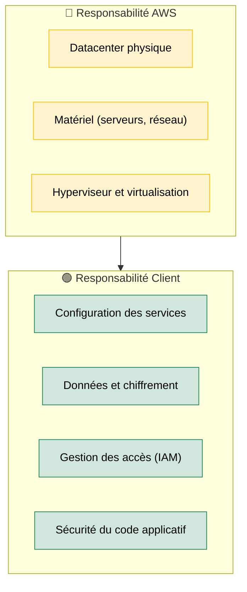
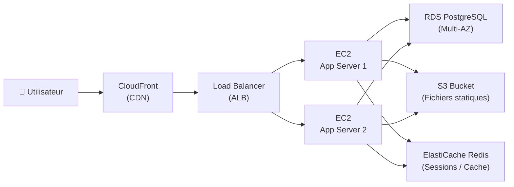

# Amazon Web Services — Le Cloud Leader Mondial

<div
  class="omny-meta"
  data-level="🟡 Intermédiaire"
  data-version="2024"
  data-time="~30 minutes">
</div>

## Introduction

!!! quote "Analogie pédagogique — Le Bailleur d'Infrastructure"
    Avant AWS (2006), une startup qui voulait lancer un service en ligne devait acheter des serveurs physiques, louer une salle dans un datacenter, et payer une équipe d'administration — des mois avant de voir le premier utilisateur. **AWS** a changé les règles : vous louez de la puissance de calcul, du stockage et des bases de données à la seconde, sans rien posséder. Comme un bailleur qui vous loue une chambre meublée plutôt que de vous vendre un appartement.

    Cette flexibilité est le cœur du cloud : **payer ce que vous consommez, quand vous le consommez**, et scaler instantanément si votre trafic explose.

AWS est la plateforme cloud d'Amazon, lancée en 2006, et toujours leader mondial avec ~33% de part de marché. Elle propose plus de **200 services** couvrant le calcul, le stockage, les bases de données, l'IA, la sécurité, le réseau et le DevOps.

<br>

---

## Le Modèle de Responsabilité Partagée



_AWS sécurise le cloud. **Vous** sécurisez **ce qui est dans** le cloud. La majorité des incidents de sécurité AWS proviennent d'une mauvaise configuration client (bucket S3 public, credentials IAM exposés), pas d'une faille AWS._

<br>

---

## Les Services Fondamentaux

### EC2 — Les Serveurs Virtuels

**EC2 (Elastic Compute Cloud)** est le service de machines virtuelles d'AWS. Chaque instance est une VM avec CPU, RAM et OS au choix.

```bash title="Lancer une instance EC2 via AWS CLI"
# Installer et configurer le CLI
aws configure
# → AWS Access Key ID
# → AWS Secret Access Key
# → Region (ex: eu-west-1 pour l'Irlande)

# Lancer une instance EC2 (Ubuntu 24.04, type t3.micro)
aws ec2 run-instances \
    --image-id ami-0c55b159cbfafe1f0 \
    --instance-type t3.micro \
    --key-name ma-cle-ssh \
    --security-group-ids sg-xxxxxxxx \
    --count 1 \
    --tag-specifications 'ResourceType=instance,Tags=[{Key=Name,Value=mon-serveur}]'
```

**Types d'instances courants :**

| Famille | Usage | Exemple |
|---|---|---|
| `t3` / `t4g` | Développement, charges variables | `t3.micro` (Free Tier) |
| `m6i` | Production généraliste | `m6i.large` (2 vCPU, 8 Go) |
| `c6i` | Calcul intensif (CPU) | `c6i.xlarge` |
| `r6i` | Mémoire intensive (BDD) | `r6i.2xlarge` |

### S3 — Le Stockage Objet

**S3 (Simple Storage Service)** est le service de stockage de fichiers d'AWS. Chaque fichier est un **objet** dans un **bucket**. Capacité théoriquement illimitée.

```bash title="Opérations S3 basiques"
# Créer un bucket (nom unique mondial)
aws s3 mb s3://mon-bucket-unique-2024

# Uploader un fichier
aws s3 cp ./rapport.pdf s3://mon-bucket-unique-2024/rapports/

# Synchroniser un dossier entier
aws s3 sync ./build/ s3://mon-site-web/ --delete

# Rendre un fichier accessible publiquement
aws s3api put-object-acl --bucket mon-bucket --key rapport.pdf --acl public-read
```

!!! warning "S3 Public = Données exposées"
    Ne jamais rendre un bucket S3 entièrement public sans audit. En 2024, des centaines d'organisations ont exposé des données sensibles par erreur de configuration. Utilisez les **S3 Block Public Access** settings systématiquement.

### RDS — Les Bases de Données Managées

**RDS (Relational Database Service)** gère MySQL, PostgreSQL, MariaDB, Oracle et SQL Server. AWS s'occupe des sauvegardes, mises à jour et haute disponibilité.

| Avantage RDS | Détail |
|---|---|
| **Backups automatiques** | Rétention jusqu'à 35 jours, point-in-time recovery |
| **Multi-AZ** | Réplication synchrone dans 2 zones de disponibilité |
| **Read Replicas** | Scalabilité des lectures en lecture seule |
| **Maintenance automatique** | Patches OS et moteur sans intervention manuelle |

### IAM — La Gestion des Identités

**IAM (Identity and Access Management)** contrôle **qui peut faire quoi** sur quels services AWS.

```json title="Politique IAM — Accès S3 en lecture seule sur un bucket spécifique"
{
    "Version": "2012-10-17",
    "Statement": [
        {
            "Effect": "Allow",
            "Action": [
                "s3:GetObject",
                "s3:ListBucket"
            ],
            "Resource": [
                "arn:aws:s3:::mon-bucket-production",
                "arn:aws:s3:::mon-bucket-production/*"
            ]
        }
    ]
}
```

!!! tip "Principe du moindre privilège"
    Chaque utilisateur, rôle ou service IAM doit avoir **uniquement** les permissions dont il a besoin. Ne jamais utiliser les credentials root pour les opérations courantes. Créer des rôles IAM dédiés pour chaque application.

<br>

---

## Architecture Applicative Typique sur AWS



<br>

---

## Conclusion

!!! quote "Ce qu'il faut retenir"
    AWS n'est pas un service — c'est un écosystème de 200+ services qu'on compose pour construire des architectures. Le point d'entrée pour un développeur est systématiquement **EC2** (calculer), **S3** (stocker), **RDS** (données relationnelles) et **IAM** (sécuriser). Ces quatre services couvrent 90% des besoins d'une application web standard. La maîtrise d'IAM est la compétence la plus critique : une politique IAM mal configurée expose toute votre infrastructure.

> [Azure — La plateforme cloud Microsoft →](../azure/)