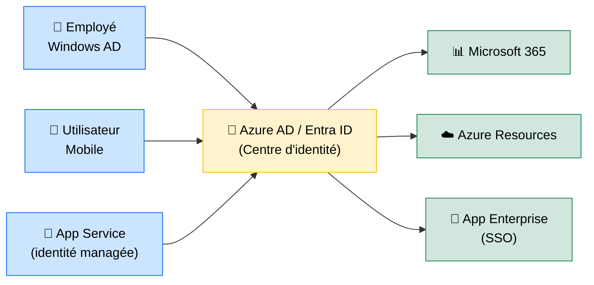

# Microsoft Azure — Le Cloud de l'Écosystème Microsoft

<div
  class="omny-meta"
  data-level="🟡 Intermédiaire"
  data-version="2024"
  data-time="~25 minutes">
</div>

## Introduction

!!! quote "Analogie pédagogique — Le Prolongement Naturel de l'Entreprise Microsoft"
    Si votre entreprise utilise Windows, Active Directory, Office 365 et Teams, choisir **Azure** comme plateforme cloud est comme agrandir votre maison plutôt que d'en acheter une nouvelle. L'intégration est native : vos comptes utilisateurs Active Directory fonctionnent directement sur Azure via Azure AD, vos équipes Teams peuvent interagir avec les pipelines DevOps, et votre infrastructure Windows se migre avec un minimum de friction.

    AWS est le leader de l'innovation cloud. Azure est le leader de **l'intégration d'entreprise**. Le bon choix dépend de votre écosystème existant.

Azure, lancé en 2010 par Microsoft, est le deuxième cloud mondial (~22% de part de marché). Sa force principale réside dans son intégration profonde avec l'écosystème Microsoft, la conformité réglementaire (RGPD, HDS, ANSSI) et sa stratégie hybride (Azure Arc pour gérer des serveurs on-premise depuis Azure).

<br>

---

## Services Fondamentaux Azure

### Comparatif AWS ↔ Azure

| Service | AWS | Azure |
|---|---|---|
| **VM (compute)** | EC2 | Azure Virtual Machines |
| **Stockage objet** | S3 | Azure Blob Storage |
| **Base de données managée** | RDS | Azure Database (PostgreSQL/MySQL) |
| **Container orchestration** | EKS | AKS (Azure Kubernetes Service) |
| **Serverless** | Lambda | Azure Functions |
| **CDN** | CloudFront | Azure CDN / Front Door |
| **Identité** | IAM | Azure Active Directory (Entra ID) |
| **CI/CD** | CodePipeline | Azure DevOps |
| **DNS** | Route 53 | Azure DNS |

<br>

---

## Azure App Service — Déployer sans Gérer de Serveur

**Azure App Service** est la plateforme PaaS (Platform as a Service) d'Azure pour déployer des applications web sans gérer les VMs. Supporte PHP, Node.js, Python, .NET, Java et les containers Docker.

```bash title="Déployer une application Laravel sur Azure App Service via CLI"
# Installer Azure CLI
# https://docs.microsoft.com/fr-fr/cli/azure/install-azure-cli

# Se connecter
az login

# Créer un Resource Group
az group create --name mon-projet-rg --location francecentral

# Créer un App Service Plan (niveau Standard S1)
az appservice plan create \
    --name mon-plan \
    --resource-group mon-projet-rg \
    --sku S1 \
    --is-linux

# Créer l'application web PHP 8.3
az webapp create \
    --name mon-app-laravel \
    --resource-group mon-projet-rg \
    --plan mon-plan \
    --runtime "PHP|8.3"

# Configurer les variables d'environnement
az webapp config appsettings set \
    --name mon-app-laravel \
    --resource-group mon-projet-rg \
    --settings \
        APP_KEY="base64:xxxx" \
        DB_CONNECTION="mysql" \
        DB_HOST="mon-serveur.mysql.database.azure.com"
```

<br>

---

## Azure Active Directory — La Couche d'Identité

**Azure AD (maintenant Microsoft Entra ID)** est le service d'identité d'Azure. C'est la clé différenciatrice d'Azure par rapport à AWS pour les entreprises.



_Le **SSO (Single Sign-On)** via Azure AD permet à un utilisateur de s'authentifier une seule fois et d'accéder à Microsoft 365, Azure, et toutes les applications d'entreprise intégrées. C'est l'argument n°1 d'Azure pour les grandes organisations._

<br>

---

## AKS — Kubernetes Managé sur Azure

**AKS (Azure Kubernetes Service)** gère automatiquement le control plane Kubernetes. Vous vous concentrez sur vos déploiements, Azure gère la haute disponibilité du cluster.

```bash title="Créer et se connecter à un cluster AKS"
# Créer un cluster AKS (2 nœuds Standard_DS2_v2)
az aks create \
    --resource-group mon-projet-rg \
    --name mon-cluster \
    --node-count 2 \
    --node-vm-size Standard_DS2_v2 \
    --enable-addons monitoring \
    --generate-ssh-keys

# Récupérer les credentials kubectl
az aks get-credentials \
    --resource-group mon-projet-rg \
    --name mon-cluster

# Vérifier les nœuds
kubectl get nodes
```

<br>

---

## Stratégie Hybride — Azure Arc

**Azure Arc** est l'une des innovations majeures d'Azure : il permet de gérer des serveurs **on-premise** (dans votre datacenter) depuis le portail Azure, avec les mêmes outils, politiques et monitoring. C'est la réponse Microsoft aux entreprises qui ne peuvent pas tout migrer dans le cloud.

<br>

---

## Conclusion

!!! quote "Ce qu'il faut retenir"
    Azure est le cloud de prédilection des entreprises déjà dans l'écosystème Microsoft — et pour de bonnes raisons : l'intégration Active Directory, la conformité réglementaire (RGPD, HDS), et la stratégie hybride avec Azure Arc n'ont pas d'équivalent direct chez AWS. Pour un développeur, App Service et Azure Functions permettent de déployer sans gérer d'infrastructure. Pour une entreprise, Azure AD et Azure DevOps offrent une suite intégrée développement → production → identité unique sur le marché.

> [Retour à la section Cloud →](../)