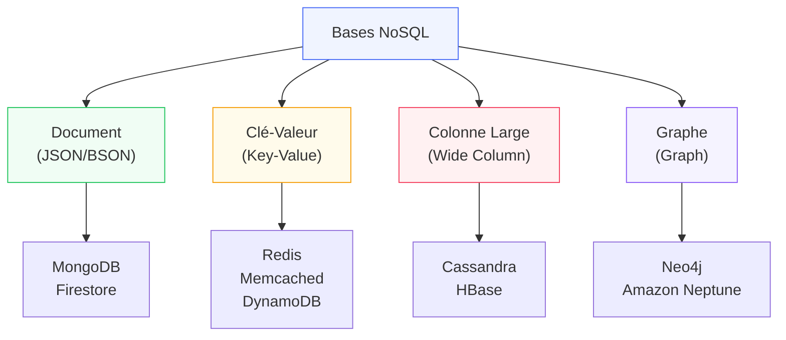
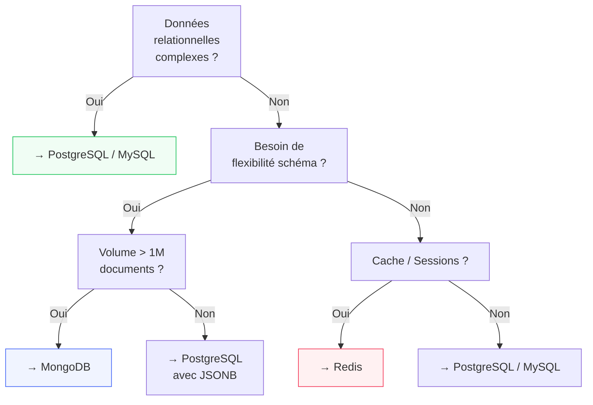

# NoSQL — Bases de Données Non-Relationnelles

<div
  class="omny-meta"
  data-level="🟡 Intermédiaire"
  data-version="2024"
  data-time="15-20 heures">
</div>

## Introduction

!!! quote "Analogie pédagogique — Le Magasin Généraliste vs la Boutique Spécialisée"
    SQL est un magasin généraliste bien organisé : tout a une place définie dans des rayons structurés (tables/colonnes). NoSQL, c'est une collection de boutiques spécialisées : une pour les documents JSON (MongoDB), une pour les stocks ultra-rapides (Redis), une pour l'analyse massive en colonne (Cassandra), une pour les réseaux et relations (Neo4j). Chaque boutique excelle dans son domaine, mais aucune ne remplace toutes les autres. Choisir NoSQL, c'est choisir le bon outil pour le bon problème.

**NoSQL** (Not Only SQL) désigne les bases de données qui s'affranchissent du modèle relationnel tabulaire pour gagner en flexibilité, scalabilité ou performance dans des cas d'usage spécifiques.

> NoSQL ne remplace pas SQL — il le **complète**. La plupart des architectures modernes combinent les deux.

<br>

---

## 1. Panorama des Modèles NoSQL



| Modèle | Moteur phare | Structure | Cas d'usage idéal |
|---|---|---|---|
| **Document** | MongoDB, Firestore | JSON/BSON imbriqué | CMS, catalogues, profils utilisateur |
| **Clé-Valeur** | Redis, DynamoDB | Clé → Valeur simple | Cache, sessions, rate limiting |
| **Colonne Large** | Cassandra, HBase | Colonnes + lignes flexibles | IoT, logs, séries temporelles |
| **Graphe** | Neo4j, Neptune | Nœuds + Relations | Réseaux sociaux, recommandations |

<br>

---

## 2. MongoDB — Base Orientée Document

MongoDB stocke les données en **documents BSON** (JSON binaire), organisés en **collections** (l'équivalent des tables).

```javascript title="JavaScript — CRUD MongoDB (shell / Node.js)"
// ─── Connexion ────────────────────────────────────────────────────────────────
// mongosh mongodb://localhost:27017/myapp

// ─── Insérer des documents ────────────────────────────────────────────────────
db.users.insertOne({
    name: "Alice Dupont",
    email: "alice@example.com",
    age: 28,
    address: {           // Document imbriqué — pas besoin de table séparée
        city: "Paris",
        zip: "75001"
    },
    tags: ["php", "laravel"],  // Tableau natif
    createdAt: new Date()
});

// Multi-insertion
db.users.insertMany([
    { name: "Bob",   email: "bob@example.com",   age: 35 },
    { name: "Carol", email: "carol@example.com", age: 22 },
]);

// ─── Lire ─────────────────────────────────────────────────────────────────────
db.users.find({ age: { $gte: 18 } });         // age >= 18
db.users.find({ "address.city": "Paris" });   // Champ imbriqué
db.users.find({ tags: "laravel" });           // Contient dans le tableau

// Opérateurs de filtre
db.users.find({
    $or: [{ age: { $lt: 18 } }, { age: { $gt: 65 } }],
    name: { $regex: /^A/, $options: 'i' }
});

// ─── Trier, limiter, projeter ─────────────────────────────────────────────────
db.users.find({}, { name: 1, email: 1, _id: 0 })  // Projection (1=inclure, 0=exclure)
         .sort({ name: 1 })                         // Ascendant
         .limit(10)
         .skip(20);                                  // Pagination

// ─── Mettre à jour ────────────────────────────────────────────────────────────
db.users.updateOne(
    { email: "alice@example.com" },              // Filtre
    {
        $set: { age: 29 },                       // Mettre à jour un champ
        $push: { tags: "postgresql" },           // Ajouter à un tableau
        $currentDate: { updatedAt: true }        // Date courante
    }
);

// Mettre à jour ou créer (upsert)
db.users.updateOne(
    { email: "new@example.com" },
    { $set: { name: "New User" } },
    { upsert: true }                             // Crée si absent
);

// ─── Supprimer ────────────────────────────────────────────────────────────────
db.users.deleteOne({ email: "alice@example.com" });
db.users.deleteMany({ age: { $lt: 18 } });

// ─── Aggregation Pipeline ─────────────────────────────────────────────────────
db.orders.aggregate([
    { $match: { status: "completed" } },              // Filtrer
    { $group: {
        _id: "$userId",
        total: { $sum: "$amount" },
        nb: { $count: {} }
    }},
    { $sort: { total: -1 } },                          // Trier
    { $limit: 10 }                                     // Top 10
]);
```

```javascript title="JavaScript — Index MongoDB"
// Index simple
db.users.createIndex({ email: 1 }, { unique: true });

// Index composite
db.orders.createIndex({ userId: 1, status: 1, createdAt: -1 });

// Index texte (Full-Text Search)
db.articles.createIndex({ title: "text", content: "text" });
db.articles.find({ $text: { $search: "laravel eloquent" } });

// Voir les index
db.users.getIndexes();

// Analyser une requête
db.users.find({ email: "alice@example.com" }).explain("executionStats");
```

<br>

---

## 3. Redis — Clé-Valeur Ultra-Rapide

Redis est une base **en mémoire** (RAM), utilisée principalement comme **cache**, **system de files (queues)** et **session store**.

```bash title="Bash — Redis CLI"
# Connexion : redis-cli

# ─── Types de données Redis ───────────────────────────────────────────────────
# String (chaîne)
SET user:1:name "Alice Dupont"
GET user:1:name                          # "Alice Dupont"
SET session:abc123 '{"user_id":1}' EX 3600  # Expire dans 1 heure

# Integer (compteur)
SET page:home:views 0
INCR page:home:views                     # 1
INCRBY page:home:views 5                 # 6

# Hash (objet clé-valeur)
HSET user:1 name "Alice" email "alice@example.com" age 28
HGET user:1 name                         # "Alice"
HGETALL user:1                           # Tout l'objet

# List (file FIFO)
RPUSH queue:emails "send:1" "send:2"     # Enqueue
LPOP queue:emails                        # Dequeue ("send:1")
LLEN queue:emails                        # Longueur de la file

# Set (ensemble unique)
SADD tags:post:1 "php" "laravel" "sql"
SMEMBERS tags:post:1                     # {"php", "laravel", "sql"}
SISMEMBER tags:post:1 "laravel"          # 1 (vrai)

# Sorted Set (classement avec score)
ZADD leaderboard 150 "Alice" 200 "Bob" 175 "Carol"
ZRANGE leaderboard 0 -1 WITHSCORES      # Alice-150, Carol-175, Bob-200
ZREVRANK leaderboard "Bob"              # 0 (premier)

# TTL & Expiration
TTL session:abc123                       # Secondes restantes
PERSIST session:abc123                   # Supprimer l'expiration
DEL user:1 session:abc123               # Supprimer des clés
```

```php title="PHP — Redis avec Laravel"
<?php

use Illuminate\Support\Facades\Redis;
use Illuminate\Support\Facades\Cache;

// ─── Via la facade Cache (recommandé) ─────────────────────────────────────────
Cache::put('user:1', $user, seconds: 3600);
$user = Cache::get('user:1');
Cache::forget('user:1');

// Cache remember : get ou compute si absent
$users = Cache::remember('dashboard:stats', 900, function () {
    return DB::table('users')->selectRaw('COUNT(*) as total, AVG(age) as avg_age')->first();
});

// ─── Via la facade Redis (accès direct) ───────────────────────────────────────
Redis::set('rate:user:1', 0, 'EX', 60);           // Expire dans 60 secondes
$hits = Redis::incr('rate:user:1');                // Compteur de requêtes

// Rate Limiting natif Laravel
if ($hits > 100) {
    abort(429, 'Too Many Requests');
}

// ─── Sessions stockées dans Redis ─────────────────────────────────────────────
// Dans .env : SESSION_DRIVER=redis
// Dans config/session.php : 'driver' => env('SESSION_DRIVER', 'redis')

// ─── Queues Laravel avec Redis ────────────────────────────────────────────────
// Dans .env : QUEUE_CONNECTION=redis
// Dispatcher un job :
// dispatch(new SendEmailJob($user))->delay(now()->addMinutes(5));
```

```bash title="Bash — .env Laravel pour Redis"
REDIS_HOST=127.0.0.1
REDIS_PASSWORD=null
REDIS_PORT=6379
REDIS_CLIENT=phpredis     # ou predis

CACHE_DRIVER=redis
SESSION_DRIVER=redis
QUEUE_CONNECTION=redis
```

<br>

---

## 4. SQL vs NoSQL — Guide de Choix

| Critère | SQL (PostgreSQL/MySQL) | NoSQL (MongoDB/Redis) |
|---|---|---|
| **Structure des données** | Schéma fixe, relations claires | Flexible, semi-structuré |
| **Transactions** | ACID complet, multi-tables | Variable (MongoDB 4.x ACID, Redis limité) |
| **Scalabilité** | Verticale (+ grosse machine) | Horizontale (+ machines) |
| **Relations complexes** | Nativement via JOIN | Dénormalisation nécessaire |
| **Recherche plein texte** | PostgreSQL FTS excellent | MongoDB Text Index |
| **Cache/Performance** | Via query cache | Redis : latence < 1ms |
| **Schéma évolutif** | Migrations requises | Champs ajoutables sans schema |
| **Apprentissage** | Long mais universel | Variable selon le moteur |



<br>

---

## Exercices

!!! note "À vous de jouer"

**Exercice 1 — MongoDB : catalogue produits**

```javascript title="JavaScript — Exercice 1 : modéliser un catalogue e-commerce"
// Créez une collection 'products' avec des documents incluant :
// name, price, category, specs (document imbriqué), tags (tableau), stock

// Insérez 5 produits de catégories différentes
// Requêtes à écrire :
// 1. Produits de la catégorie 'laptop' avec prix < 1000
// 2. Produits ayant le tag 'gaming' OU 'pro'
// 3. Agrégation : prix moyen par catégorie
// 4. Produits par specs.ram >= 16 (champ imbriqué)
// 5. Créer un index sur {category: 1, price: 1} et vérifier avec explain()
```

**Exercice 2 — Redis : système de rate limiting**

```php title="PHP — Exercice 2 : rate limiter avec Redis"
// Implémentez une fonction rateLimitCheck(string $userId, int $maxRequests, int $windowSeconds)
// qui :
// 1. Incrémente un compteur Redis (clé = "rate:$userId")
// 2. Définit l'expiration si c'est la première requête (INCR + EXPIRE)
// 3. Retourne true si sous la limite, false si dépassée
// 4. Retourne aussi le nombre de requêtes restantes

// Testez avec 10 requêtes rapides et une limite de 5
```

<br>

---

## Conclusion

!!! quote "Ce qu'il faut retenir de ce module"
    NoSQL n'est pas meilleur que SQL — c'est **différent**. **MongoDB** excelle pour les données flexibles et les documents imbriqués riches (évitant les jointures coûteuses). **Redis** est imbattable pour le cache, les sessions, les compteurs et les queues (latence < 1ms). Dans une application Laravel typique, vous utiliserez très probablement **PostgreSQL ou MySQL** pour les données métier, et **Redis** pour le cache et les queues — les deux coexistent naturellement. Ne choisissez NoSQL que si vous avez un problème concret que SQL ne résout pas bien.

> Pour les interactions graph (réseaux sociaux, recommandations), explorez Neo4j. Pour la prochaine génération d'APIs flexibles, explorez [GraphQL →](./graphql.md).

<br>