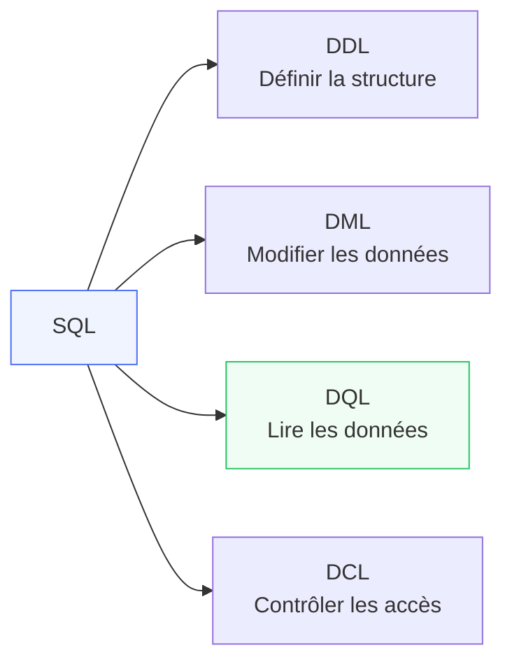

# MariaDB & MySQL

<div
  class="omny-meta"
  data-level="🟢 Débutant à 🔴 Avancé"
  data-version="MySQL 8.x / MariaDB 11.x"
  data-time="25-30 heures">
</div>

## Introduction

!!! quote "Analogie pédagogique — Le Classeur Partagé en Réseau"
    Si SQLite est votre classeur personnel, MySQL/MariaDB est la salle d'archives d'une entreprise : plusieurs utilisateurs y accèdent simultanément, chacun avec ses droits, depuis des postes différents. Un serveur dédié gère les conflits d'accès, garantit la cohérence et peut servir des milliers de requêtes simultanées. C'est le choix naturel pour toute application web avec plusieurs utilisateurs concurrents.

**MySQL** est le SGBDR open-source le plus largement déployé dans les applications web. **MariaDB** en est le fork communautaire, 100% compatible, maintenu par les créateurs originaux de MySQL. Dans l'écosystème Laravel, les deux sont interchangeables — même driver, mêmes migrations, mêmes commandes Artisan.

> MySQL/MariaDB est le moteur par défaut des stacks LAMP, LEMP et de la plupart des hébergements partagés.

<br>

---

## 1. SQL — Le Langage

SQL (Structured Query Language) est le langage standard de communication avec les bases de données relationnelles. Il se divise en 4 catégories :

| Catégorie | Nom complet | Commandes | Rôle |
|---|---|---|---|
| **DDL** | Data Definition Language | CREATE, ALTER, DROP, TRUNCATE | Définir la structure |
| **DML** | Data Manipulation Language | INSERT, UPDATE, DELETE | Modifier les données |
| **DQL** | Data Query Language | SELECT | Lire les données |
| **DCL** | Data Control Language | GRANT, REVOKE | Contrôler les accès |



<br>

---

## 2. Installation & Connexion

```bash title="Bash — Installer MySQL / MariaDB"
# ─── Ubuntu / Debian ──────────────────────────────────────────────────────────
sudo apt update
sudo apt install mysql-server       # MySQL 8.x
# ou
sudo apt install mariadb-server     # MariaDB 11.x

# Sécuriser l'installation
sudo mysql_secure_installation

# ─── macOS (Homebrew) ─────────────────────────────────────────────────────────
brew install mysql
brew services start mysql

# ─── Docker (development) ─────────────────────────────────────────────────────
docker run -d \
  --name mysql-dev \
  -e MYSQL_ROOT_PASSWORD=secret \
  -e MYSQL_DATABASE=myapp \
  -p 3306:3306 \
  mysql:8.0
```

```sql title="SQL — Connexion et premiers pas MySQL"
-- Connexion CLI
-- mysql -u root -p

-- Créer une base de données
CREATE DATABASE myapp
  CHARACTER SET utf8mb4
  COLLATE utf8mb4_unicode_ci;

-- Sélectionner la base
USE myapp;

-- Créer un utilisateur dédié (ne pas utiliser root en production)
CREATE USER 'laravel'@'localhost' IDENTIFIED BY 'secret_password';
GRANT ALL PRIVILEGES ON myapp.* TO 'laravel'@'localhost';
FLUSH PRIVILEGES;

-- Voir les bases disponibles
SHOW DATABASES;

-- Voir les tables de la base courante
SHOW TABLES;

-- Voir la structure d'une table
DESCRIBE users;
-- ou
SHOW COLUMNS FROM users;
```

<br>

---

## 3. DDL — Créer et Modifier la Structure

```sql title="SQL — CREATE TABLE avec tous les types et contraintes courants"
CREATE TABLE users (
    -- ─── Clé primaire ──────────────────────────────────────────────────────
    id         BIGINT UNSIGNED AUTO_INCREMENT PRIMARY KEY,

    -- ─── Texte ─────────────────────────────────────────────────────────────
    name       VARCHAR(255) NOT NULL,
    email      VARCHAR(255) NOT NULL UNIQUE,
    bio        TEXT,
    status     ENUM('active', 'inactive', 'banned') DEFAULT 'active',

    -- ─── Nombres ───────────────────────────────────────────────────────────
    age        TINYINT UNSIGNED,
    score      DECIMAL(8, 2) DEFAULT 0.00,  -- Total 8 chiffres, 2 décimales

    -- ─── Booléen ───────────────────────────────────────────────────────────
    verified   TINYINT(1) NOT NULL DEFAULT 0,  -- Convention Laravel (0/1)
    -- ou depuis MySQL 8.x :
    -- is_admin  BOOLEAN NOT NULL DEFAULT FALSE,

    -- ─── Dates ─────────────────────────────────────────────────────────────
    email_verified_at TIMESTAMP NULL DEFAULT NULL,
    created_at TIMESTAMP NOT NULL DEFAULT CURRENT_TIMESTAMP,
    updated_at TIMESTAMP NOT NULL DEFAULT CURRENT_TIMESTAMP
                         ON UPDATE CURRENT_TIMESTAMP,

    -- ─── JSON (MySQL 5.7+ / MariaDB 10.2+) ─────────────────────────────────
    settings   JSON,

    -- ─── Index ─────────────────────────────────────────────────────────────
    INDEX idx_status (status),
    INDEX idx_created (created_at)
) ENGINE=InnoDB DEFAULT CHARSET=utf8mb4 COLLATE=utf8mb4_unicode_ci;
```

```sql title="SQL — ALTER TABLE : modifications courantes"
-- Ajouter une colonne
ALTER TABLE users ADD COLUMN phone VARCHAR(20) AFTER email;

-- Modifier une colonne
ALTER TABLE users MODIFY COLUMN name VARCHAR(500) NOT NULL;

-- Renommer une colonne (MySQL 8.0+)
ALTER TABLE users RENAME COLUMN bio TO biography;

-- Supprimer une colonne
ALTER TABLE users DROP COLUMN biography;

-- Ajouter un index
ALTER TABLE users ADD INDEX idx_name (name);

-- Ajouter une clé étrangère
ALTER TABLE posts
  ADD CONSTRAINT fk_posts_user
  FOREIGN KEY (user_id) REFERENCES users(id)
  ON DELETE CASCADE ON UPDATE CASCADE;

-- Supprimer une contrainte
ALTER TABLE posts DROP FOREIGN KEY fk_posts_user;
```

<br>

---

## 4. DML — Manipuler les Données

```sql title="SQL — INSERT, UPDATE, DELETE avec leurs variantes"
-- ─── INSERT ───────────────────────────────────────────────────────────────────
INSERT INTO users (name, email, age)
VALUES ('Alice Dupont', 'alice@example.com', 28);

-- Multi-lignes (bien plus rapide qu'un INSERT par ligne)
INSERT INTO users (name, email, age) VALUES
    ('Bob Martin',   'bob@example.com',   35),
    ('Carol White',  'carol@example.com', 22),
    ('David Brown',  'david@example.com', 41);

-- INSERT ... ON DUPLICATE KEY UPDATE (upsert MySQL)
INSERT INTO users (email, name, age)
VALUES ('alice@example.com', 'Alice Updated', 29)
ON DUPLICATE KEY UPDATE name = VALUES(name), age = VALUES(age);

-- ─── UPDATE ───────────────────────────────────────────────────────────────────
UPDATE users SET age = 29 WHERE id = 1;

-- Multi-colonnes
UPDATE users
SET name = 'Alice Martin', age = 29, updated_at = NOW()
WHERE id = 1;

-- Update avec JOIN (MySQL spécifique)
UPDATE users u
INNER JOIN orders o ON u.id = o.user_id
SET u.status = 'active'
WHERE o.created_at > DATE_SUB(NOW(), INTERVAL 30 DAY);

-- ─── DELETE ───────────────────────────────────────────────────────────────────
DELETE FROM users WHERE id = 1;

-- DELETE avec JOIN
DELETE u FROM users u
LEFT JOIN orders o ON u.id = o.user_id
WHERE o.id IS NULL;         -- Supprimer les users sans commandes

-- TRUNCATE (vide toute la table, reset auto_increment)
TRUNCATE TABLE logs;        -- Plus rapide que DELETE sans WHERE
```

<br>

---

## 5. SELECT — Requêtes Avancées

```sql title="SQL — SELECT : fenêtrage, GROUP BY, HAVING, CTE"
-- ─── Agrégations classiques ───────────────────────────────────────────────────
SELECT
    country,
    COUNT(*)   AS nb_users,
    AVG(age)   AS avg_age,
    MAX(score) AS top_score
FROM users
WHERE status = 'active'
GROUP BY country
HAVING nb_users > 10
ORDER BY nb_users DESC
LIMIT 20;

-- ─── Fonctions de fenêtrage (Window Functions — MySQL 8.0+) ───────────────────
SELECT
    name,
    score,
    RANK()       OVER (ORDER BY score DESC)               AS global_rank,
    RANK()       OVER (PARTITION BY country ORDER BY score DESC) AS country_rank,
    ROW_NUMBER() OVER (PARTITION BY country ORDER BY score DESC) AS row_in_country,
    LAG(score)   OVER (ORDER BY score DESC)               AS prev_score,
    LEAD(score)  OVER (ORDER BY score DESC)               AS next_score
FROM users;

-- ─── CTE (Common Table Expressions — MySQL 8.0+) ──────────────────────────────
WITH top_users AS (
    SELECT id, name, score
    FROM users
    WHERE score > 100
),
ranked AS (
    SELECT *, RANK() OVER (ORDER BY score DESC) AS rnk
    FROM top_users
)
SELECT * FROM ranked WHERE rnk <= 10;

-- ─── CTE récursive : hiérarchie de catégories ────────────────────────────────
WITH RECURSIVE category_tree AS (
    SELECT id, name, parent_id, 0 AS depth
    FROM categories WHERE parent_id IS NULL   -- Racines

    UNION ALL

    SELECT c.id, c.name, c.parent_id, ct.depth + 1
    FROM categories c
    INNER JOIN category_tree ct ON c.parent_id = ct.id
)
SELECT CONCAT(REPEAT('  ', depth), name) AS tree_view
FROM category_tree
ORDER BY id;
```

<br>

---

## 6. Index & Optimisation

```sql title="SQL — Stratégie d'indexation MySQL"
-- Voir les index d'une table
SHOW INDEX FROM users;

-- Créer différents types d'index
CREATE INDEX idx_email ON users(email);                    -- Simple
CREATE UNIQUE INDEX idx_unique_email ON users(email);     -- Unique
CREATE INDEX idx_name_status ON users(name, status);       -- Composite
CREATE FULLTEXT INDEX idx_content ON posts(title, content); -- Fulltext search

-- Analyser le plan d'exécution
EXPLAIN SELECT * FROM users WHERE email = 'alice@example.com';
-- Ou plus détaillé :
EXPLAIN FORMAT=JSON SELECT * FROM users WHERE email = 'alice@example.com';

-- Vérifier si la requête utilise les index (key = NULL = problème)
-- EXPLAIN doit montrer : type=ref ou type=const (bon), pas ALL (mauvais)

-- Forcer l'utilisation d'un index (rarement nécessaire)
SELECT * FROM users USE INDEX (idx_email) WHERE email = 'alice@example.com';

-- Optimiser une table (défragmenter)
OPTIMIZE TABLE users;

-- Analyser les statistiques
ANALYZE TABLE users;
```

<br>

---

## 7. Configuration Laravel

```bash title="Bash — .env Laravel pour MySQL/MariaDB"
DB_CONNECTION=mysql
DB_HOST=127.0.0.1
DB_PORT=3306
DB_DATABASE=myapp
DB_USERNAME=laravel
DB_PASSWORD=secret_password
DB_CHARSET=utf8mb4
DB_COLLATION=utf8mb4_unicode_ci
```

```php title="PHP — Migration Laravel : types MySQL spécifiques"
<?php

use Illuminate\Database\Migrations\Migration;
use Illuminate\Database\Schema\Blueprint;
use Illuminate\Support\Facades\Schema;

return new class extends Migration
{
    public function up(): void
    {
        Schema::create('posts', function (Blueprint $table) {
            $table->id();                                // BIGINT UNSIGNED AUTO_INCREMENT
            $table->foreignId('user_id')->constrained()->cascadeOnDelete();
            $table->string('title');                     // VARCHAR(255)
            $table->text('content')->nullable();
            $table->enum('status', ['draft', 'published', 'archived'])
                  ->default('draft');
            $table->json('metadata')->nullable();
            $table->unsignedInteger('views')->default(0);
            $table->boolean('featured')->default(false);
            $table->fullText(['title', 'content']);      // FULLTEXT pour la recherche
            $table->timestamps();
            $table->softDeletes();                       // deleted_at pour soft delete

            $table->index(['user_id', 'status', 'created_at']);
        });
    }

    public function down(): void
    {
        Schema::dropIfExists('posts');
    }
};
```

```php title="PHP — Eloquent : requêtes MySQL avancées avec Query Builder"
<?php

use Illuminate\Support\Facades\DB;
use App\Models\User;

// ─── Window functions via rawQuery ────────────────────────────────────────────
$ranked = DB::select('
    SELECT name, score,
           RANK() OVER (ORDER BY score DESC) AS rnk
    FROM users
    WHERE status = ?
', ['active']);

// ─── FULLTEXT search ──────────────────────────────────────────────────────────
$results = Post::whereRaw(
    'MATCH(title, content) AGAINST(? IN BOOLEAN MODE)',
    ['+Laravel +eloquent']
)->get();

// ─── Upsert Laravel (insertOrIgnore, upsert) ──────────────────────────────────
User::upsert(
    [
        ['email' => 'alice@example.com', 'name' => 'Alice Updated'],
        ['email' => 'bob@example.com',   'name' => 'Bob New'],
    ],
    uniqueBy: ['email'],         // Colonnes qui détectent le doublon
    update: ['name']             // Colonnes à mettre à jour si doublon
);
```

<br>

---

## Exercices

!!! note "À vous de jouer"

**Exercice 1 — Schéma e-commerce**

```sql title="SQL — Exercice 1 : concevoir et requêter un schéma e-commerce"
-- Créez ces tables avec toutes les contraintes :
-- customers (id, name, email, country, created_at)
-- products  (id, name, price DECIMAL(10,2), stock INT, category_id)
-- categories (id, name, parent_id → auto-référence)
-- orders    (id, customer_id FK, total DECIMAL(10,2), status ENUM, created_at)
-- order_items (id, order_id FK, product_id FK, quantity, unit_price)

-- Requêtes à écrire :
-- 1. Top 10 clients par montant total commandé (GROUP BY + ORDER BY)
-- 2. Produits jamais commandés (LEFT JOIN + IS NULL)
-- 3. Chiffre d'affaires mensuel sur 12 mois (DATE_FORMAT + GROUP BY)
-- 4. Catégories avec sous-catégories (CTE récursive)
-- 5. Rank des produits les plus vendus par catégorie (Window function)
```

**Exercice 2 — Optimisation**

```sql title="SQL — Exercice 2 : analyser et optimiser des requêtes lentes"
-- Sur la table orders (10 millions de lignes) :
-- 1. EXPLAIN ces requêtes et identifier les full scans
EXPLAIN SELECT * FROM orders WHERE status = 'pending';
EXPLAIN SELECT * FROM orders WHERE customer_id = 42 ORDER BY created_at DESC;

-- 2. Créer les index appropriés
-- 3. Relancer EXPLAIN et vérifier l'amélioration
-- 4. Mesurer la différence de temps avec SHOW PROFILES
```

<br>

---

## Conclusion

!!! quote "Ce qu'il faut retenir de ce module"
    MySQL et MariaDB sont interchangeables dans l'écosystème Laravel — même driver, mêmes migrations. Le SQL standard (DDL/DML/DQL) est commun aux deux. **MySQL 8.0+** apporte les fonctions de fenêtrage (RANK, LAG, LEAD), les CTE récursives et le type JSON natif — indispensables pour les analyses modernes. L'`EXPLAIN` est l'outil clé pour diagnostiquer les requêtes lentes : `type=ALL` est le signal d'alarme. `utf8mb4` est l'encodage requis pour les emojis et les caractères asiatiques — toujours préférer `utf8mb4_unicode_ci`.

> Pour des fonctionnalités avancées (types de données riches, requêtes géospatiales, JSON performant), explorez [PostgreSQL →](./postgresql.md).

<br>