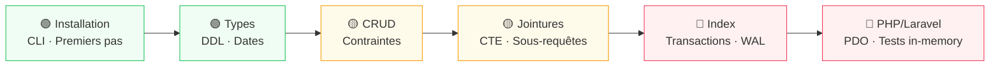

# SQLite

## Introduction

!!! quote "Analogie pédagogique — Le Classeur Portable"
    MySQL et PostgreSQL sont comme une bibliothèque municipale — bâtiment dédié, personnel, horaires, système de réservation. SQLite est votre classeur personnel : tout y est, dans un seul fichier `.db` transportable, ouvrable n'importe où sans serveur, sans configuration, sans administrateur. C'est le moteur de base de données **le plus déployé au monde** — milliards d'appareils, navigateurs, smartphones, applications desktop. Zéro configuration, zéro maintenance, ACID complet.

**SQLite en bref :**

- ✅ **Serverless** — Pas de serveur séparé, bibliothèque intégrée à l'application
- ✅ **Single-file** — Toute la base = 1 fichier `.db` portable
- ✅ **Zero-config** — Fonctionne immédiatement, aucun setup
- ✅ **ACID** — Transactions atomiques, cohérentes, isolées, durables
- ✅ **SQL standard** — Syntaxe SQL classique + extensions pratiques
- ✅ **Public domain** — Aucune licence, usage commercial libre

 

---

## Parcours — 6 modules

-   :lucide-info:{ .lg .middle } **Module 1** — _Introduction & Installation_

    ---
    Architecture serverless, quand utiliser SQLite, installation CLI, premiers pas.

    **Durée** : ~3h | **Niveau** : 🟢 Débutant

    [:lucide-book-open-check: Accéder au module 1](./01-introduction-installation.md)

-   :lucide-layers:{ .lg .middle } **Module 2** — _Types & Structure_

    ---
    Storage classes, type affinity, DDL (CREATE, ALTER, DROP), gestion des dates.

    **Durée** : ~3h | **Niveau** : 🟢 Débutant

    [:lucide-book-open-check: Accéder au module 2](./02-types-et-structure.md)

-   :lucide-pen-line:{ .lg .middle } **Module 3** — _CRUD & Contraintes_

    ---
    INSERT, SELECT, UPDATE, DELETE, contraintes d'intégrité (PK, FK, UNIQUE, CHECK).

    **Durée** : ~4h | **Niveau** : 🟢→🟡

    [:lucide-book-open-check: Accéder au module 3](./03-crud-et-contraintes.md)

-   :lucide-git-merge:{ .lg .middle } **Module 4** — _Jointures & Relations_

    ---
    INNER JOIN, LEFT JOIN, sous-requêtes, CTE, relations un-à-plusieurs et plusieurs-à-plusieurs.

    **Durée** : ~4h | **Niveau** : 🟡 Intermédiaire

    [:lucide-book-open-check: Accéder au module 4](./04-jointures-et-relations.md)

-   :lucide-zap:{ .lg .middle } **Module 5** — _Index & Transactions_

    ---
    Index (création, stratégie), EXPLAIN QUERY PLAN, transactions ACID, WAL mode, concurrence.

    **Durée** : ~4h | **Niveau** : 🟡→🔴

    [:lucide-book-open-check: Accéder au module 5](./05-index-et-transactions.md)

-   :lucide-server:{ .lg .middle } **Module 6** — _Intégration PHP & Laravel_

    ---
    PDO SQLite, configuration Laravel, migrations, tests avec SQLite in-memory, production.

    **Durée** : ~4h | **Niveau** : 🔴 Avancé

    [:lucide-book-open-check: Accéder au module 6](./06-integration-php-laravel.md)

 

---

## SQLite vs MySQL/PostgreSQL

| Critère | SQLite | MySQL / PostgreSQL |
|---|---|---|
| **Architecture** | Bibliothèque intégrée | Serveur client-serveur |
| **Configuration** | Aucune (zero-config) | Fichiers config, users, permissions |
| **Fichiers** | 1 fichier `.db` | Multiples fichiers, logs |
| **Réseau** | Accès local uniquement | TCP/IP, remote connections |
| **Concurrence** | Lecture multiple, écriture unique | Lecture/écriture simultanées |
| **Use case idéal** | Mobile, desktop, IoT, tests, prototypes | Web apps multi-users, haute concurrence |

!!! info "Quand choisir SQLite ?"
    ✅ **Oui** : Apps mobiles/desktop, IoT, tests unitaires (in-memory), prototypes, data science locale, configuration application, cache local.

    ❌ **Non** : Web apps > 100 req écriture/seconde, bases > 100 Go avec écritures fréquentes, accès réseau distribué, permissions par utilisateur.

 

---

## Compétences couvertes

 

---

!!! note "Note sur le fichier source"
    Ce hub de navigation remplace le fichier monolithique `sqlite.md` (2770 lignes) découpé en 6 modules thématiques progressifs. Le contenu original est intégralement conservé et réparti dans les 6 modules.

> Commencez par le [Module 1 — Introduction & Installation](./01-introduction-installation.md).

 
