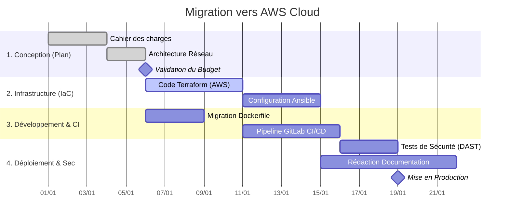

# Le Diagramme de Gantt

## Introduction

!!! quote "Analogie pédagogique - La Construction d'une Maison"
    Imaginez que vous deviez construire une maison. Vous ne pouvez pas faire venir l'électricien avant que les murs ne soient posés, et vous ne pouvez pas poser les murs avant d'avoir coulé les fondations. Chaque corps de métier dépend du précédent.
    
    Si l'équipe qui coule le béton prend deux semaines de retard, **l'intégralité** du chantier est décalée de deux semaines, peu importe la vitesse à laquelle travaillera le plombier par la suite.

Inventé par l'ingénieur Henry Gantt en 1910, le diagramme de Gantt est un outil de visualisation qui transpose exactement cette logique temporelle. Il est le symbole absolu de la gestion de projet classique, dite en **cascade** (*Waterfall*). Bien que le DevSecOps favorise les méthodes Agiles, le Gantt reste l'outil roi pour planifier les chantiers d'infrastructure lourde (ex: la migration vers le Cloud d'une entreprise).

 

---

## Les Trois Piliers du Gantt

Un diagramme de Gantt n'est pas un simple calendrier de vacances. Il repose sur un système mathématique de relations entre les entités.

1. **Les Tâches (Tasks)** : Des blocs de travail avec une estimation de durée (ex: *Créer le cluster Kubernetes - 5 jours*).
2. **Les Dépendances (Dependencies)** : La flèche qui relie deux tâches. Elle indique une contrainte absolue de précédence. La tâche B ne peut physiquement pas commencer tant que la tâche A n'est pas terminée (relation *Finish-to-Start*).
3. **Les Jalons (Milestones)** : Ce ne sont pas des tâches, mais des marqueurs symboliques d'une durée de zéro jour. Ils valident la fin d'une phase majeure (ex: *Mise en production validée*).

 

---

## Le Chemin Critique (Critical Path)

C'est le concept le plus important de la gestion de projet classique.
Le **Chemin Critique** est la séquence ininterrompue de tâches dépendantes qui représente la **durée totale minimale** du projet.

!!! danger "La loi implacable du Chemin Critique"
    Toute tâche située *sur* le chemin critique possède une **marge de tolérance (flottement) de zéro**. 
    Si une tâche de 2 jours située sur le chemin critique prend finalement 3 jours, la date de livraison finale du projet est **mathématiquement repoussée d'un jour**.

    À l'inverse, les tâches situées *hors* du chemin critique peuvent prendre du retard (dans la limite de leur marge) sans affecter la date de livraison globale.

### Exemple : Déploiement d'une nouvelle Infrastructure

Observez le diagramme ci-dessous. Le *chemin critique* est constitué de la Conception $\rightarrow$ Terraform $\rightarrow$ Pipeline CI $\rightarrow$ DAST. Remarquez comment la "Documentation" peut être effectuée en parallèle sans bloquer la livraison finale.

 

---

## Gantt vs Agile : Le Choc des Cultures

Dans le monde du développement logiciel pur, le diagramme de Gantt est de plus en plus abandonné au profit des méthodes Agiles (Scrum, Kanban). Pourquoi ?

=== ":simple-trello: Méthodologie Agile (Scrum)"

    **Idéologie : L'adaptation au changement**
    - **Portée (Scope) :** Variable. On sait qu'on ne sait pas tout au début du projet.
    - **Cycle :** Itératif. On développe par petits sprints de 2 semaines.
    - **Livraison :** Continue. On livre un MVP (Minimum Viable Product) fonctionnel très tôt, puis on l'améliore selon les retours des utilisateurs.
    - **Le danger du Gantt :** Faire un Gantt sur 6 mois en logiciel suppose que les besoins des utilisateurs ne changeront pas pendant 6 mois, ce qui est faux dans 90% des cas.

=== ":simple-microsoftproject: Méthodologie Classique (Waterfall/Gantt)"

    **Idéologie : La prédictibilité**
    - **Portée (Scope) :** Fixée à l'avance par un cahier des charges rigide.
    - **Cycle :** Séquentiel. Design $\rightarrow$ Dev $\rightarrow$ Test $\rightarrow$ Livraison.
    - **Livraison :** Uniquement à la toute fin du projet ("Big Bang deployment").
    - **L'avantage du Gantt :** Indispensable quand les ressources physiques sont impliquées (construire un datacenter, acheter des serveurs, passer des contrats fournisseurs). 

!!! tip "Le Compromis DevSecOps : Les Epics"
    Dans les entreprises modernes, on utilise une approche hybride. Le **Gantt** est utilisé au niveau de la Direction pour visualiser les grandes initiatives stratégiques sur l'année (les *Epics*). Mais au niveau opérationnel, les équipes utilisent **Scrum/Kanban** pour découper ces *Epics* en petites tâches gérables au jour le jour.

 

---

## Conclusion

!!! quote "Ce qu'il faut retenir de ce module"
    Le diagramme de Gantt modélise le temps, les tâches, et surtout les **dépendances**. Comprendre le concept de **Chemin Critique** est essentiel pour identifier les goulots d'étranglement qui mettront en péril la date de livraison de votre projet. Bien qu'inadapté au développement logiciel moderne qui requiert une flexibilité Agile, le Gantt reste le standard absolu pour les projets d'infrastructure matérielle.

> Dans la phase suivante, nous abandonnons la gestion de projet pour entrer dans la technique pure avec les Fondamentaux de la Conteneurisation : **Docker (Moteur)**.

 
