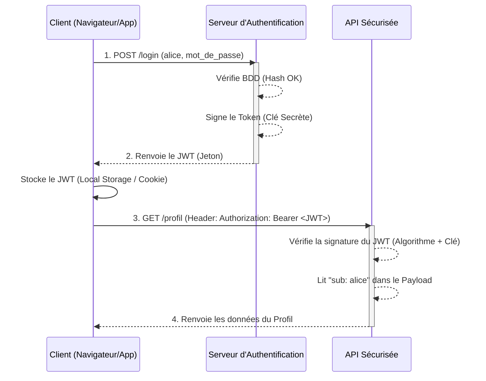

# Authentification (JWT & Famille JOSE)

## Introduction

!!! quote "Analogie pédagogique - Le Billet de Train"
    Dans les anciens systèmes web (*Stateful Sessions*), quand vous vous connectiez, le serveur écrivait votre nom dans un grand registre gardé à l'accueil. À chaque fois que vous demandiez une page, le serveur cherchait votre nom dans son registre. Imaginez une gare où le contrôleur doit téléphoner au guichet pour vérifier le nom de *chaque* passager qui monte dans le train. C'est lent, et si le registre brûle (le serveur plante), tout le monde est déconnecté.
    
    L'authentification **Stateless (JWT)** fonctionne comme un vrai billet de train TGV. Le guichet (Serveur d'Auth) imprime le billet, le tamponne avec une encre cryptographique infalsifiable, et vous le donne. Quand vous montez dans le train (Serveur API), le contrôleur n'a pas besoin de téléphoner au guichet : il lui suffit d'examiner le billet et de vérifier que le tampon cryptographique est authentique.

L'authentification par "jeton" (Token) est la pierre angulaire des architectures web modernes (Single Page Applications + APIs REST) et des microservices.

 

---

## Le Flux d'Authentification JWT

Voici comment les systèmes modernes s'assurent de votre identité sans stocker de "session" en mémoire vive :

 

---

## Déchiffrer la "Soupe d'Alphabets" : La famille JOSE

Le terme JWT est utilisé partout, mais il n'est en fait que le conteneur central d'une norme beaucoup plus vaste appelée **JOSE** (*JSON Object Signing and Encryption*).

Pour briller en DevSecOps, il faut connaître les membres de la famille :

### 1. Le Jeton : JWT (JSON Web Token)

C'est le format standardisé pour représenter une déclaration (un "Claim") entre deux parties.
Un JWT ressemble à une longue chaîne de caractères divisée par des points : `Header.Payload.Signature`. 
*(Exemple: `eyJhbG.eyJzdWI.SflKxw`)*

!!! warning "Un JWT n'est PAS chiffré par défaut !"
    C'est la faille de sécurité la plus commune des développeurs débutants. Un JWT classique est simplement **encodé** en Base64. N'importe qui peut le décoder sur un site web en 2 secondes pour lire son contenu. **Ne mettez jamais d'informations sensibles (Mots de passe, numéro de CB) dans le Payload d'un JWT.**

### 2. La Signature : JWS (JSON Web Signature)

Puisque le JWT n'est pas chiffré et que n'importe qui peut le lire, comment empêcher un pirate de modifier son rôle "User" en "Admin" ?
C'est le rôle de la **JWS**. La troisième partie du JWT est une signature cryptographique. Si un pirate modifie le payload (même d'une seule virgule), la signature devient mathématiquement invalide. Le serveur API rejettera le faux billet.

### 3. L'Algorithme : JWA (JSON Web Algorithms)

C'est la norme qui définit les algorithmes cryptographiques autorisés pour signer (JWS) ou chiffrer (JWE) un token.

- **HS256 (HMAC SHA-256)** : Symétrique. Le serveur d'Auth et le serveur API doivent posséder la **même clé secrète**. Rapide, mais dangereux si la clé fuite.
- **RS256 (RSA SHA-256)** : Asymétrique. Le serveur d'Auth signe avec une Clé Privée. Le serveur API vérifie avec une Clé Publique (sans jamais pouvoir signer de faux jetons). C'est le standard des architectures Microservices matures.

### 4. Le Chiffrement : JWE (JSON Web Encryption)

Si vous *devez absolument* stocker des informations confidentielles à l'intérieur du token, le JWS ne suffit plus. Vous devez utiliser un **JWE**. Contrairement au JWS qui garantit l'intégrité (Personne n'a modifié le jeton), le JWE garantit la **confidentialité** (Personne ne peut *lire* le jeton sans la clé de déchiffrement).

### 5. Les Clés : JWK (JSON Web Key)

Dans une architecture asymétrique (RS256), le serveur d'Auth publie ses clés publiques sur une URL spécifique (souvent `/.well-known/jwks.json`). Cette liste de clés formatée en JSON est appelée un **JWK**. Le serveur API va lire ce fichier JWK pour pouvoir vérifier mathématiquement les jetons JWT qu'il reçoit.

 

---

## Les Vulnérabilités AppSec (Attaques sur JWT)

Les tokens JWT sont puissants, mais ils souffrent de vulnérabilités graves s'ils sont mal implémentés par les développeurs.

1. **La faille `alg: none`**
   L'en-tête du JWT précise l'algorithme utilisé (`{"alg": "HS256"}`). Des pirates ont découvert que si on envoyait un jeton avec `{"alg": "none"}` et aucune signature, certaines mauvaises librairies API l'acceptaient comme valide, permettant de s'octroyer les droits administrateurs ! (Aujourd'hui, toutes les librairies bloquent cette faille).
   
2. **Le Vol de Token (XSS)**
   Si vous stockez le JWT dans le `LocalStorage` du navigateur, une simple faille XSS sur votre site permet à un pirate de voler le JWT de l'utilisateur. Le pirate possède alors le "Billet de train" et peut se faire passer pour l'utilisateur.
   *Protection : Stocker le JWT dans un Cookie `HttpOnly` et `Secure`.*

3. **Le problème de la Révocation (Logout)**
   Contrairement à une Session qui vit sur le serveur, le JWT vit chez le client. Vous ne pouvez pas simplement "l'effacer" du serveur. Pour déconnecter un utilisateur (ou bannir un pirate), il faut utiliser des stratégies de "Blacklist" (Liste noire de jetons volés), ce qui réintroduit l'état (Stateful) qu'on essayait justement de fuir...

 

---

## Conclusion

!!! quote "Ce qu'il faut retenir de ce module"
    L'authentification "Stateless" par JWT est incontournable en DevSecOps pour garantir la montée en charge des microservices. Rappelez-vous toujours de la Famille JOSE : le **JWT** est la donnée, le **JWS** garantit son intégrité (anti-falsification), le **JWE** garantit sa confidentialité (chiffrement), et les **JWA/JWK** définissent la cryptographie sous-jacente. Enfin, ne stockez jamais de données confidentielles dans un JWT standard.

> Une fois que le serveur API s'est assuré de *qui* vous êtes (Authentification via JWT), il doit décider *ce que* vous avez le droit de faire, et à quelle vitesse. C'est l'objectif du prochain module sur l'**Autorisation (RBAC) et le Rate Limiting**.

 