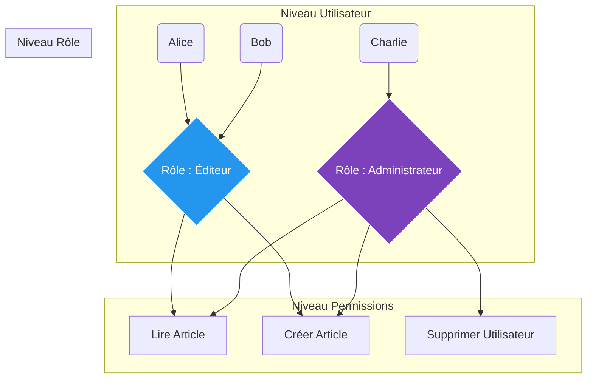

# RBAC & Rate Limiting (Autorisation et Protection)

## Introduction

!!! quote "Analogie pédagogique - Le Videur de Boîte de Nuit"
    L'authentification (JWT), c'est vérifier votre carte d'identité à l'entrée de la boîte de nuit : *"Êtes-vous bien majeur, et êtes-vous bien celui de la photo ?"*.
    
    L'**Autorisation (RBAC)**, c'est ce qui se passe *après* être entré. Le videur vous voit essayer d'entrer dans la zone VIP. Il vérifie votre bracelet : avez-vous le **Rôle** VIP ? Si non, l'accès vous est refusé, bien que vous soyez authentifié dans le club.
    
    Le **Rate Limiting (Limitation de débit)**, c'est le gérant du bar. Vous avez le droit d'acheter des verres, mais si vous commandez 500 verres en l'espace de 3 secondes, le barman comprend que vous êtes malveillant (ou un robot) et va vous refuser le service pendant 10 minutes pour éviter que vous ne vidiez le stock du club.

L'AppSec moderne ne se limite pas à authentifier les utilisateurs, elle dicte de manière granulaire ce qu'ils ont le droit de faire, et à quelle vitesse.

 

---

## 1. L'Autorisation : Le modèle RBAC

Le **RBAC** (Role-Based Access Control) est le standard de l'industrie pour gérer les droits. 
Au lieu de donner des permissions spécifiques à chaque utilisateur (ce qui devient ingérable quand on a 10 000 clients), on donne des permissions à des **Rôles**, et on assigne les utilisateurs à ces Rôles.

### Le danger de l'IDOR (Insecure Direct Object Reference)

Même avec un RBAC parfait, les développeurs tombent souvent dans le piège de l'**IDOR**.
Imaginez qu'Alice veuille voir sa facture numéro `104`. Elle tape l'URL : `/api/factures/104`.
Alice a bien le rôle "Client", le RBAC la laisse passer.
Mais que se passe-t-il si Alice modifie l'URL en `/api/factures/105` (la facture de Bob) ? 

Si l'API vérifie seulement le *Rôle*, Alice pourra lire la facture de Bob. L'AppSec exige que le code vérifie l'**Appartenance** : *"Alice a le rôle Client, ET la facture 105 lui appartient"*.

 

---

## 2. Le Rate Limiting : Protéger le serveur

Même si votre API est sécurisée par JWT et RBAC, un pirate peut décider de vous envoyer **10 000 requêtes par seconde** sur la page de connexion.
 
- Soit le serveur va s'effondrer sous la charge (Déni de Service - DDoS).
- Soit le pirate essaie des millions de mots de passe différents (Attaque Brute-Force).

Le **Rate Limiting** est le bouclier réseau. On place un "compteur" devant l'API (souvent géré par Nginx, Traefik ou un WAF Cloudflare).

### Les Algorithmes de Rate Limiting

Le Rate Limiting n'est pas "juste" un chronomètre. Il repose sur des modèles mathématiques que tout ingénieur DevSecOps doit comprendre :

=== ":simple-nginx: Le Token Bucket (Le Seau de Jetons)"

    **Idéal pour : Autoriser des pics d'activité (Bursts) suivis d'un refroidissement.**
    
    Imaginez un seau physique qui peut contenir 10 jetons. Le serveur remplit ce seau à un rythme constant (ex: 1 jeton par seconde). 
    Quand l'utilisateur fait une requête, il prend 1 jeton du seau. 
    
    - Si l'utilisateur clique frénétiquement 10 fois d'un coup, il vide le seau instantanément (Son pic est absorbé sans erreur).
    - À la 11ème requête, le seau est vide. Le serveur renvoie une erreur HTTP `429 Too Many Requests`. 
    - Il doit attendre 1 seconde qu'un nouveau jeton tombe dans le seau pour réessayer.

=== ":simple-traefik: Le Leaky Bucket (Le Seau Percé)"

    **Idéal pour : Lisser absolument le trafic entrant et protéger une Base de Données fragile.**
    
    Ici, les requêtes des utilisateurs remplissent le seau par le haut, et le serveur traite les requêtes en les vidant par un trou au fond, **à vitesse strictement constante** (ex: 5 requêtes par seconde max).
    
    - Si 50 utilisateurs attaquent en même temps, le seau se remplit. Le serveur continue de traiter 5 requêtes/sec calmement sans paniquer.
    - Si le seau déborde (la file d'attente est pleine), les requêtes supplémentaires sont rejetées (HTTP `429`). 

 

---

## Conclusion

!!! quote "Ce qu'il faut retenir de ce module"
    La sécurité applicative demande des défenses en profondeur (Defense in Depth). L'Authentification (JWT) valide l'identité. Le **RBAC** valide le périmètre d'action de cette identité. Le **Rate Limiting** empêche l'abus mécanique du réseau. Sans ces trois couches conjointes, votre application n'est pas prête pour la production.

> L'un des points d'attaque favoris des pirates lors d'un Brute-Force (qui contournerait votre Rate Limiter) est de deviner les mots de passe. Il est temps de briser un mythe absolu de la cybersécurité dans notre prochain module : **L'Entropie des Mots de Passe**.

 