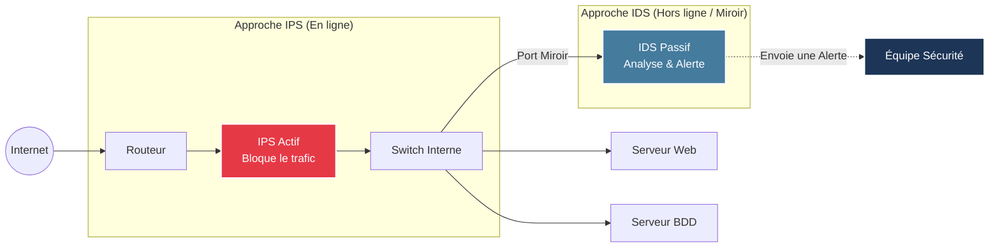

# Systèmes de Détection et de Prévention (IDS/IPS)

<div
  class="omny-meta"
  data-level="🟢 Débutant & 🟡 Intermédiaire"
  data-version="1.0"
  data-time="15 Minutes">
</div>

## Introduction : Le gardien de l'infrastructure

!!! quote "Définition : IDS / IPS"
    Un **IDS** (Intrusion Detection System) est un système passif qui écoute le trafic réseau ou l'activité système pour **détecter et alerter** sur les comportements malveillants.
    Un **IPS** (Intrusion Prevention System) est un système actif placé sur le flux de données pour **bloquer** la menace en temps réel.

Dans une stratégie de Défense en Profondeur (Defense in Depth), le pare-feu (Firewall) filtre les ports et les IP (Couche 3/4). L'IDS/IPS va plus loin : il **analyse le contenu** (payload) du trafic pour y repérer des signatures d'attaques connues ou des anomalies de comportement (Couche 7).

<br>

---

## 1. IDS vs IPS : Le Passif contre l'Actif

La principale distinction entre ces deux systèmes réside dans leur placement réseau et leur capacité d'action.



| Caractéristique | IDS (Détection) | IPS (Prévention) |
| :--- | :--- | :--- |
| **Placement** | En copie (Port Mirroring / TAP) | En coupure (In-line) |
| **Action en cas de menace** | Génère un log, alerte (Mail, Webhook) | Lâche le paquet (Drop), bloque la connexion |
| **Impact sur les performances** | Aucun impact sur le trafic légitime | Ajoute une légère latence réseau |
| **Risque de Faux Positifs** | Gênant (bruit d'alertes) mais non destructeur | **Critique** : bloque le trafic légitime de l'entreprise |

!!! warning "Le danger de l'IPS"
    Il est fortement déconseillé de déployer un IPS en mode "blocage" dès le premier jour. On le déploie d'abord en mode "IDS/Détection" pendant plusieurs semaines pour affiner les règles et éliminer les faux positifs avant d'activer le mode prévention.

<br>

---

## 2. NIDS vs HIDS : Réseau contre Hôte

Les IDS/IPS se divisent en deux grandes familles selon leur terrain d'action.

### 2.1 NIDS / NIPS (Network-based)
Ils analysent les paquets circulant sur le réseau entier.
*   **Objectif** : Protéger un segment réseau entier contre les malwares, exploits de vulnérabilités (ex: Log4Shell traversant le web), scans de ports.
*   **Logiciels de référence** : **Suricata** (multithreadé et moderne), **Snort** (le standard historique développé par Cisco), Zeek.

### 2.2 HIDS / HIPS (Host-based)
Ils sont installés directement sur la machine (Serveur cible) via un agent.
*   **Objectif** : Surveiller les fichiers système, la mémoire de la machine, et les logs applicatifs locaux qu'un NIDS réseau (chiffré via HTTPS) ne pourrait pas lire.
*   **Logiciels de référence** : **OSSEC**, **Wazuh Agent**, **Falco** (spécialisé pour Kubernetes/Docker).

<br>

---

## 3. Les Hooks : Connecter l'IDS à vos processus

Un IDS isolé sert peu. Toute la puissance du **DevSecOps** réside dans l'automatisation de la réponse aux incidents grâce aux **Hooks** (points d'accroche ou appels).

### 3.1 Webhooks de notification
Lorsqu'un NIDS comme Suricata détecte une attaque de type "SQL Injection", l'alerte est envoyée à un SIEM (comme Wazuh ou Splunk). Ce dernier peut configurer un **Webhook** (une requête HTTP POST) pour alerter immédiatement l'équipe.

```json title="Exemple : Payload JSON envoyé par un Webhook vers Slack"
{
  "text": "🚨 *Alerte Critique (Suricata)*",
  "attachments": [
    {
      "color": "danger",
      "fields": [
        { "title": "Type", "value": "SQL Injection (ET EXPLOIT)", "short": true },
        { "title": "Source IP", "value": "185.12.X.X", "short": true },
        { "title": "Cible", "value": "Serveur Web de Production", "short": false }
      ]
    }
  ]
}
```

### 3.2 Response Hooks (Réponse Automatisée)
Au lieu d'attendre qu'un administrateur lise le message Slack, le webhook peut déclencher un **SOAR** (Security Orchestration, Automation, and Response) ou une fonction Serverless.
Par exemple, l'alerte IDS déclenche un webhook vers un script AWS Lambda qui :
1. Isole automatiquement l'instance EC2 ciblée du reste du réseau (modification du Security Group).
2. Lance un conteneur de scan antivirus.
3. Déploie une nouvelle instance propre via Terraform.

### 3.3 Git Pre-commit Hooks (Prévention Shift-Left)
Dans l'esprit DevSecOps, on peut appliquer la philosophie de prévention (IPS) directement sur le code des développeurs.
On utilise des **Pre-commit hooks** avec Git (ex: via l'outil `pre-commit` ou `Husky`). Avant que le développeur ne puisse envoyer son code sur GitLab, un script s'exécute localement :
*   Il scanne le code à la recherche de secrets (avec `TruffleHog` ou `Gitleaks`).
*   S'il trouve une clé API AWS en clair, **le hook bloque le commit** (comportement de type IPS au niveau du développement).

!!! tip "Conclusion"
    Les IDS/IPS constituent vos radars et vos boucliers. Couplés à des Hooks et à un SIEM comme Wazuh, ils permettent de transformer une infrastructure passive en un système immunitaire dynamique et automatisé.