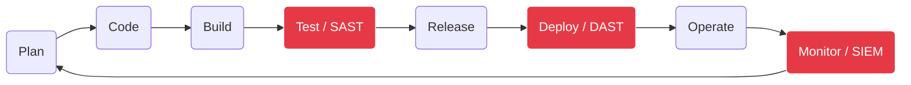

# DevSecOps

!!! quote "Analogie"
    _Si le développement logiciel était la construction d'une voiture, le DevSecOps serait l'usine entière. C'est l'art d'assembler la voiture, de la tester, de la peindre, de vérifier ses freins et de la livrer sur le marché de manière 100% automatisée, tout en s'assurant qu'aucun espion industriel n'a piégé le moteur pendant la production._

## Objectif

Le **DevSecOps** n'est pas un métier, c'est une culture et une méthodologie. Il brise les murs historiques qui séparaient les Développeurs (ceux qui créent les bugs), la Sécurité (ceux qui trouvent les bugs) et les Opérations (ceux qui subissent les bugs en production).

Ce parcours vous guidera de la philosophie fondamentale (CALMS) jusqu'à l'automatisation totale de l'infrastructure (Docker, Ansible, Terraform), en passant par la sécurisation applicative continue (Shift-Left).

!!! note "Comment lire cette section"
    L'ordre est primordial. Ne commencez **jamais** par l'Infrastructure as Code (IaC) sans avoir compris la conteneurisation (Docker). Et ne déployez jamais d'application web sans maîtriser les concepts de base de l'AppSec (JWT, RBAC).

 

---

## Les sections principales

- ### :lucide-users: Culture & Projet
    ---
    L'adoption de la méthodologie (CALMS) et la planification rigoureuse (Diagramme de Gantt) avant d'écrire la moindre ligne de code.

    [Aller vers Culture](./culture/index.md)

- ### :lucide-box: Conteneurisation
    ---
    L'art d'isoler les applications (Docker) et de les orchestrer (Docker Compose, Docker Swarm) pour garantir une portabilité absolue.

    [Aller vers Conteneurs](./containers/index.md)

- ### :lucide-server-cog: Infrastructure as Code (IaC)
    ---
    Déployer des flottes entières de serveurs sans toucher la souris, grâce à Ansible et Terraform.

    [Aller vers IaC](./iac/index.md)

- ### :lucide-shield-alert: Application Security & Secrets
    ---
    Sécuriser l'architecture (JWT, RBAC) et protéger les identifiants vitaux avec des coffres-forts dynamiques.

    [Aller vers AppSec](./appsec/index.md)

- ### :lucide-git-merge: CI/CD (Automatisation)
    ---
    L'automatisation du test et du déploiement via GitLab CI et GitHub Actions.

    [Aller vers CI/CD](./cicd/index.md)

- ### :lucide-activity: Observabilité (Obs-Sec)
    ---
    Donner des yeux à votre infrastructure. Détecter les intrusions et analyser les logs en temps réel.

    [Aller vers Observabilité](./obs-sec/index.md)

 

---

## Le Cycle DevSecOps (Shift-Left)

Le concept central est d'intégrer la sécurité le plus tôt possible (*à gauche* sur le cycle de développement) :

 

---

## Conclusion

!!! quote "Notre recommandation"
    Le DevSecOps est un domaine vaste. Prenez le temps de digérer les concepts du module **Fondamentaux Docker & IaC** avant de vous lancer dans la rédaction de fichiers de configuration YAML complexes. Le plus grand danger en IaC est d'exécuter un code que l'on ne comprend qu'à moitié.

**Point d'entrée recommandé : [Le Modèle C.A.L.M.S](./culture/calms.md)**

 
