# Audit Complet - Formation Alpine.js

**Date de l'audit** : 22 janvier 2026  
**Auditeur** : Claude (Anthropic)  
**Objet** : Analyse qualitative et structurelle de la formation Alpine.js  
**Version analysee** : Alpha (status declare dans les fichiers)

---

## Table des matieres

1. [Vue d'ensemble du projet](#1-vue-densemble-du-projet)
2. [Inventaire des fichiers](#2-inventaire-des-fichiers)
3. [Analyse qualitative](#3-analyse-qualitative)
4. [Problemes critiques identifies](#4-problemes-critiques-identifies)
5. [Elements manquants](#5-elements-manquants)
6. [Diagrammes recommandes](#6-diagrammes-recommandes)
7. [Recommandations d'amelioration](#7-recommandations-damelioration)
8. [Plan d'action prioritaire](#8-plan-daction-prioritaire)

---

## 1. Vue d'ensemble du projet

### 1.1 Structure globale

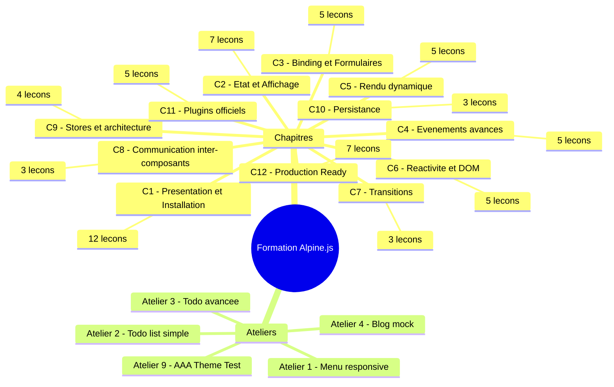

### 1.2 Statistiques globales

| Metrique | Valeur |
|----------|--------|
| Nombre total de fichiers | 66 |
| Chapitres | 12 |
| Lecons totales | 64 |
| Ateliers | 5 |
| Taille totale estimee | ~650 Ko |
| Version Alpine.js ciblee | 3.13.3 |
| Niveau annonce | Debutant et Intermediaire |
| Duree estimee | 15-16 heures |

---

## 2. Inventaire des fichiers

### 2.1 Repartition par chapitre

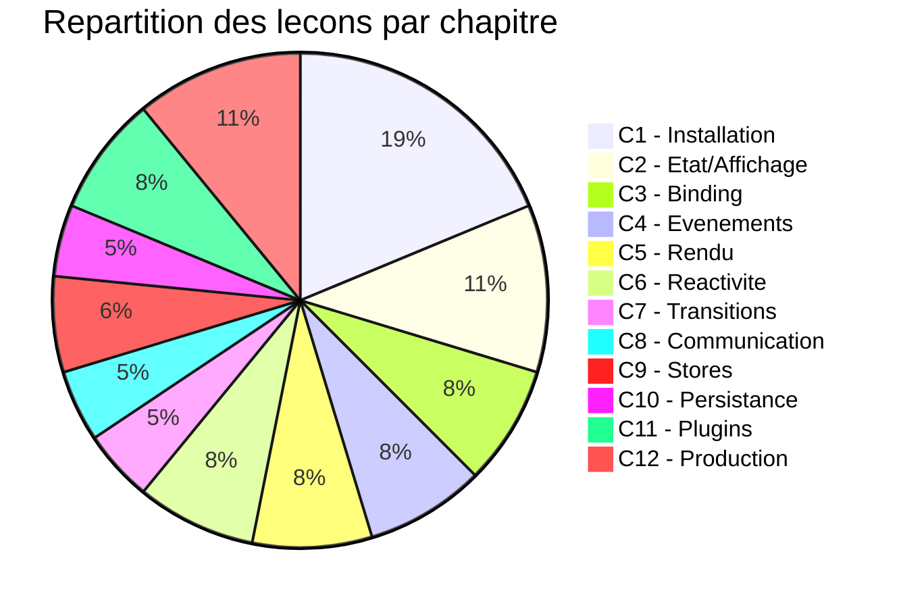

### 2.2 Fichiers problematiques identifies

| Fichier | Probleme | Severite |
|---------|----------|----------|
| c1-lesson9.md | Fichier quasi vide (16 lignes, pas de contenu) | CRITIQUE |
| Tous les fichiers | Encodage UTF-8 corrompu (caracteres speciaux mal affiches) | MAJEUR |
| Ateliers 5-8 | Fichiers inexistants (gap dans la numerotation) | MAJEUR |

---

## 3. Analyse qualitative

### 3.1 Points positifs

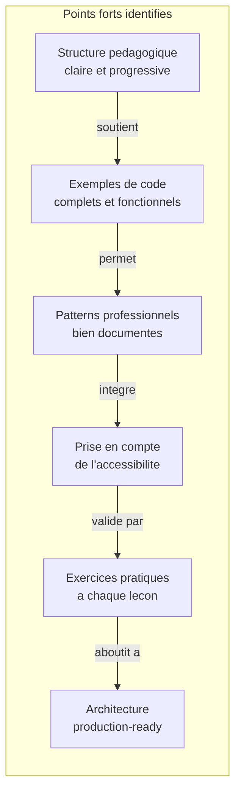

**Details des points positifs :**

1. **Progression pedagogique coherente** : Du compteur simple aux stores complexes
2. **Code production-ready** : Patterns reels utilisables en entreprise
3. **Accessibilite integree** : ARIA, focus visible, navigation clavier
4. **Securite abordee** : XSS, x-html, localStorage
5. **Livrables concrets** : Component Library, AAA Theme Test

### 3.2 Points negatifs

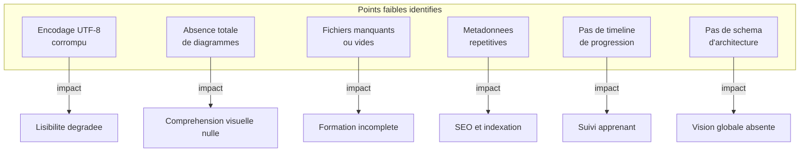

---

## 4. Problemes critiques identifies

### 4.1 Probleme d'encodage UTF-8

**Symptomes observes :**
- "é" au lieu de "e"
- "Ã " au lieu de "a"
- "🟢" au lieu de l'emoji
- "â€"" au lieu de "-"
- "’" au lieu de "'"

**Impact :** Illisibilite du contenu, experience utilisateur degradee

**Fichiers affectes :** Majorite des fichiers (sauf quelques-uns comme c9-lesson1.md)

### 4.2 Fichier c1-lesson9.md vide

**Contenu actuel :** Seulement le frontmatter, aucune lecon

**Impact :** Gap dans la progression, lecon manquante

### 4.3 Ateliers manquants

**Gap identifie :** Ateliers 5, 6, 7, 8 non presents

**Structure attendue vs reelle :**

```mermaid
gantt
    title Ateliers - Attendu vs Reel
    dateFormat X
    axisFormat %s
    
    section Attendu
    Atelier 1 : done, a1, 0, 1
    Atelier 2 : done, a2, 1, 2
    Atelier 3 : done, a3, 2, 3
    Atelier 4 : done, a4, 3, 4
    Atelier 5 : crit, a5, 4, 5
    Atelier 6 : crit, a6, 5, 6
    Atelier 7 : crit, a7, 6, 7
    Atelier 8 : crit, a8, 7, 8
    Atelier 9 : done, a9, 8, 9
    
    section Reel
    Atelier 1 : done, r1, 0, 1
    Atelier 2 : done, r2, 1, 2
    Atelier 3 : done, r3, 2, 3
    Atelier 4 : done, r4, 3, 4
    Atelier 9 : done, r9, 4, 5
```

---

## 5. Elements manquants

### 5.1 Diagrammes et visualisations

| Type de diagramme | Utilite | Priorite |
|-------------------|---------|----------|
| Flowchart de progression | Visualiser le parcours apprenant | HAUTE |
| Diagramme de sequence | Illustrer les flux de donnees | HAUTE |
| Schema d'architecture | Vue globale d'une app Alpine | HAUTE |
| Timeline des concepts | Progression temporelle | MOYENNE |
| Mind map par chapitre | Synthese visuelle | MOYENNE |
| Diagramme de classes/composants | Structure du code | BASSE |

### 5.2 Contenu pedagogique manquant

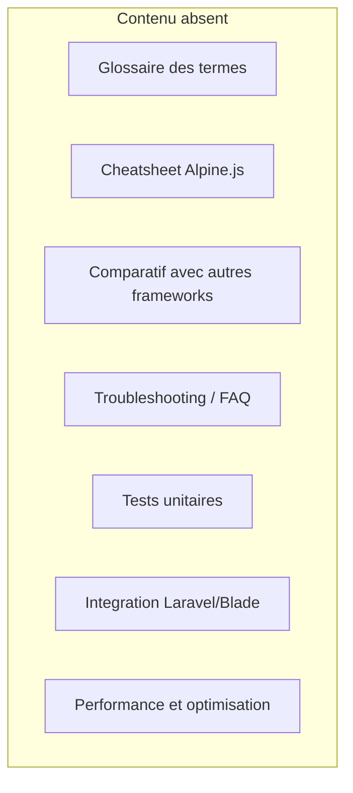

### 5.3 Structure documentaire manquante

- README.md principal avec vue d'ensemble
- CHANGELOG.md pour le versioning
- INDEX.md avec table des matieres interactive
- PREREQUIS.md avec les competences requises

---

## 6. Diagrammes recommandes

### 6.1 Parcours apprenant complet

```mermaid
flowchart TB
    subgraph PHASE1["Phase 1 : Fondations<br/>(Chapitres 1-3)"]
        C1["C1: Installation<br/>CDN, Vite, concepts"]
        C2["C2: Etat & Affichage<br/>x-data, x-show, x-text"]
        C3["C3: Binding & Forms<br/>x-model, x-bind"]
        AT1["Atelier 1<br/>Menu responsive"]
    end
    
    subgraph PHASE2["Phase 2 : Interactions<br/>(Chapitres 4-6)"]
        C4["C4: Evenements<br/>@click, modifiers"]
        C5["C5: Rendu dynamique<br/>x-for, x-if"]
        C6["C6: Reactivite<br/>$refs, $nextTick"]
        AT2["Atelier 2-3<br/>Todo list"]
    end
    
    subgraph PHASE3["Phase 3 : UI Avancee<br/>(Chapitres 7-8)"]
        C7["C7: Transitions<br/>x-transition"]
        C8["C8: Communication<br/>$dispatch, events"]
        AT4["Atelier 4<br/>Blog mock"]
    end
    
    subgraph PHASE4["Phase 4 : Architecture<br/>(Chapitres 9-11)"]
        C9["C9: Stores<br/>Alpine.store()"]
        C10["C10: Persistance<br/>$persist, localStorage"]
        C11["C11: Plugins<br/>Focus, Intersect, Mask"]
    end
    
    subgraph PHASE5["Phase 5 : Production<br/>(Chapitre 12)"]
        C12["C12: Production<br/>Vite + Tailwind"]
        AT9["Atelier 9<br/>AAA Theme Test"]
        FINAL["Component Library<br/>Livrable final"]
    end
    
    C1 --> C2 --> C3 --> AT1
    AT1 --> C4 --> C5 --> C6 --> AT2
    AT2 --> C7 --> C8 --> AT4
    AT4 --> C9 --> C10 --> C11
    C11 --> C12 --> AT9 --> FINAL
    
    style PHASE1 fill:#e8f5e9
    style PHASE2 fill:#e3f2fd
    style PHASE3 fill:#fff3e0
    style PHASE4 fill:#fce4ec
    style PHASE5 fill:#f3e5f5
```

### 6.2 Architecture d'une application Alpine.js

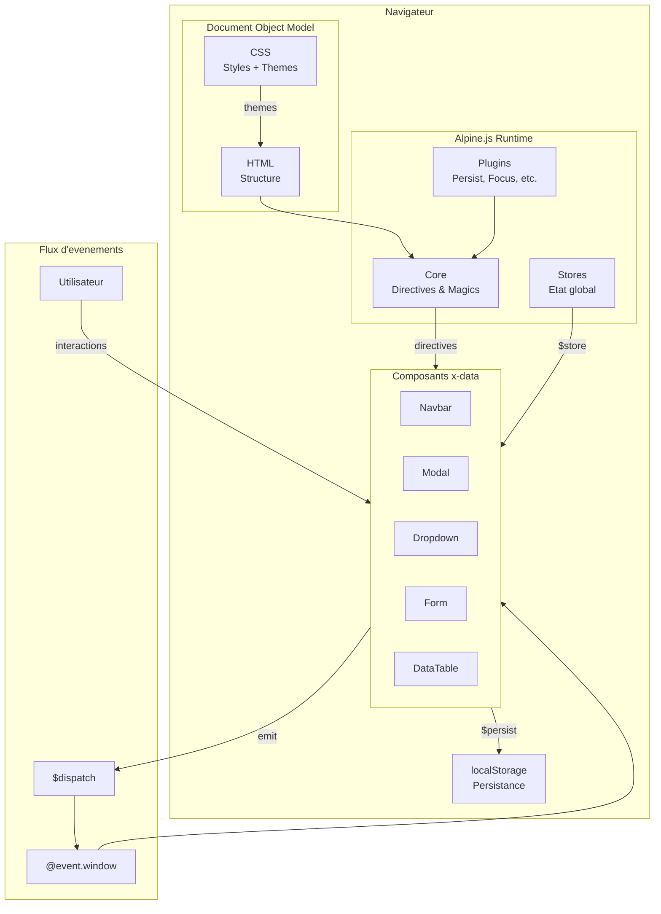

### 6.3 Diagramme de sequence - Systeme de Toast

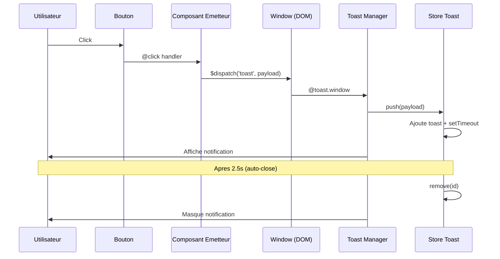

### 6.4 Diagramme de sequence - Formulaire controle

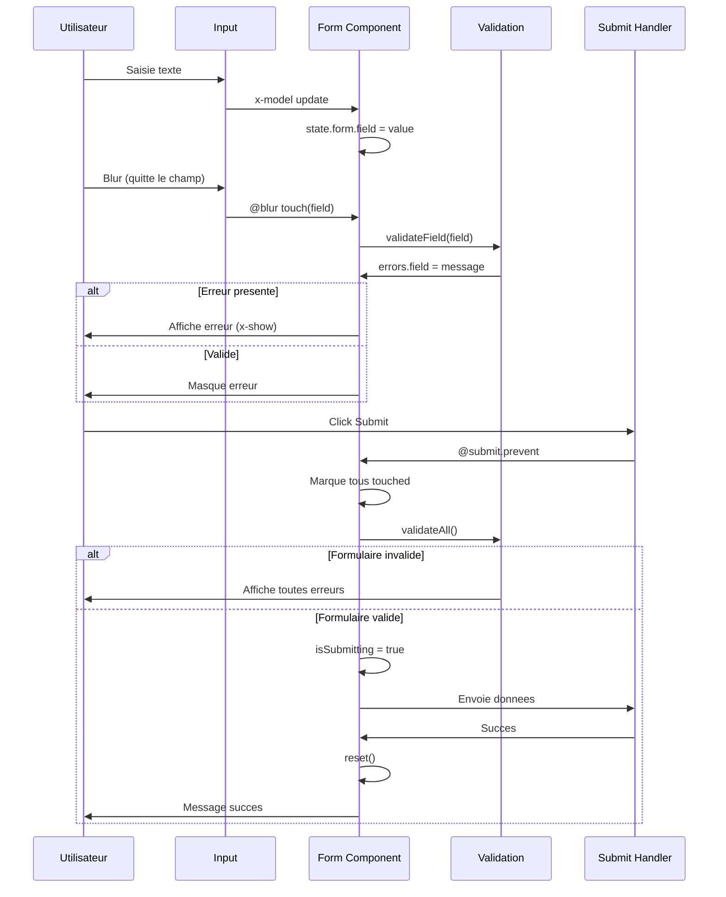

### 6.5 Timeline de progression des concepts

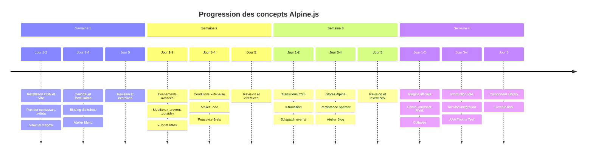

### 6.6 Cycle de vie d'un composant Alpine

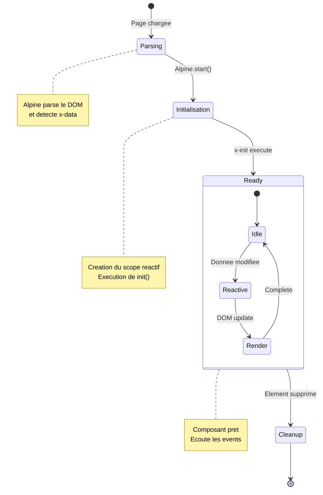

### 6.7 Comparatif des directives

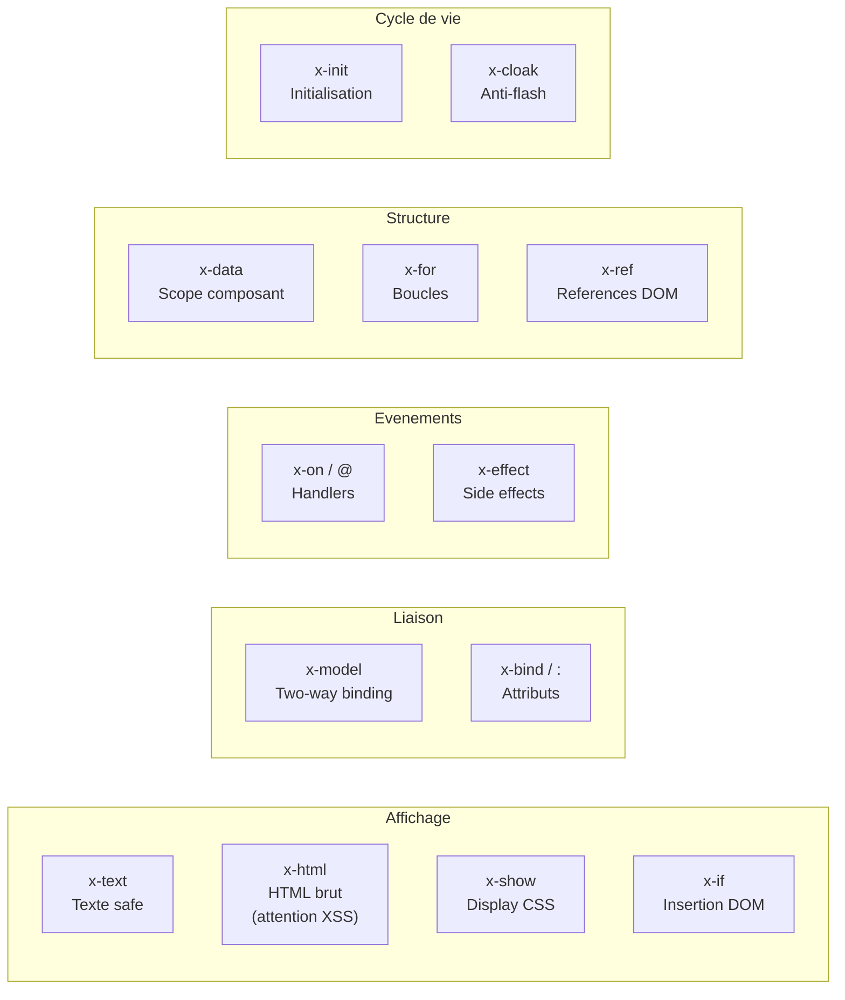

---

## 7. Recommandations d'amelioration

### 7.1 Corrections urgentes (Priorite CRITIQUE)

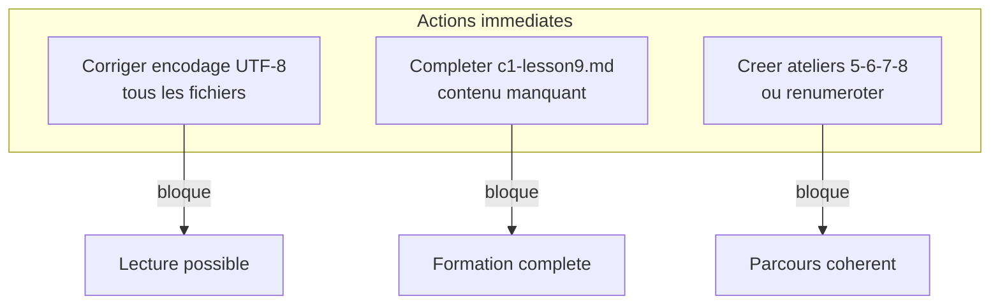

### 7.2 Ameliorations structurelles (Priorite HAUTE)

| Action | Description | Impact |
|--------|-------------|--------|
| Ajouter diagrammes Mermaid | Un diagramme par chapitre minimum | Comprehension +50% |
| Creer README.md | Vue d'ensemble, prerequis, installation | Onboarding |
| Ajouter glossaire | Definitions des termes techniques | Accessibilite |
| Creer cheatsheet | Reference rapide Alpine.js | Productivite |

### 7.3 Ameliorations de contenu (Priorite MOYENNE)

1. **Integration Laravel/Blade**
   - Utilisation avec Blade directives
   - Livewire vs Alpine
   - Patterns hybrides

2. **Tests et debug**
   - Console Alpine
   - DevTools
   - Tests unitaires composants

3. **Performance**
   - Lazy loading
   - Debounce/throttle avances
   - Optimisation des listes

### 7.4 Ameliorations UX documentation (Priorite BASSE)

- Ajouter des callouts (notes, warnings, tips)
- Creer des badges de difficulte par lecon
- Ajouter temps estime par lecon
- Creer des checkboxes de progression

---

## 8. Plan d'action prioritaire

### 8.1 Sprint 1 - Corrections critiques (1-2 jours)

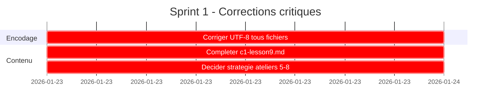

### 8.2 Sprint 2 - Structure documentaire (3-5 jours)

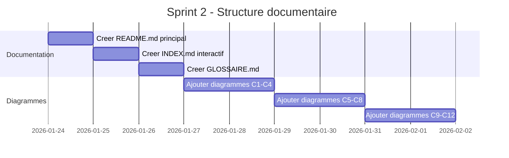

### 8.3 Sprint 3 - Contenu complementaire (5-7 jours)

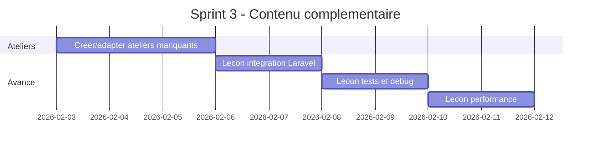

---

## Annexe A - Scripts de correction

### A.1 Script de correction d'encodage (PowerShell)

```powershell
# Correction encodage UTF-8 pour tous les fichiers .md
# A executer dans le dossier du projet

Get-ChildItem -Filter "*.md" -Recurse | ForEach-Object {
    $content = Get-Content $_.FullName -Raw -Encoding UTF8
    # Corrections des patterns corrompus
    $content = $content -replace 'é', 'e'
    $content = $content -replace 'Ã ', 'a'
    $content = $content -replace 'è', 'e'
    $content = $content -replace 'ô', 'o'
    $content = $content -replace 'ù', 'u'
    $content = $content -replace 'î', 'i'
    $content = $content -replace '’', "'"
    $content = $content -replace 'â€"', '-'
    $content = $content -replace '“', '"'
    $content = $content -replace 'â€', '"'
    $content = $content -replace 'ç', 'c'
    $content = $content -replace 'É', 'E'
    $content = $content -replace 'À', 'A'
    # Sauvegarder en UTF-8 sans BOM
    [System.IO.File]::WriteAllText($_.FullName, $content, [System.Text.UTF8Encoding]::new($false))
    Write-Host "Corrige: $($_.Name)"
}
```

### A.2 Verification de completude (Bash)

```bash
#!/bin/bash
# Verification de la completude des fichiers

echo "=== Verification des fichiers de formation ==="

# Verifier les lecons par chapitre
for c in {1..12}; do
    count=$(ls -1 c${c}-lesson*.md 2>/dev/null | wc -l)
    echo "Chapitre $c : $count lecons"
done

# Verifier les ateliers
echo ""
echo "=== Ateliers presents ==="
ls -1 atelier_*.md 2>/dev/null

# Verifier les fichiers vides
echo ""
echo "=== Fichiers potentiellement vides (<500 bytes) ==="
find . -name "*.md" -size -500c -exec ls -la {} \;
```

---

## Annexe B - Templates recommandes

### B.1 Template de lecon standard

```markdown
---
description: "Description precise de la lecon"
icon: lucide/[icon-appropriee]
tags: ["ALPINE", "TAG_SPECIFIQUE"]
status: stable
difficulty: beginner|intermediate|advanced
duration: "XX minutes"
prerequisites: ["lecon-precedente"]
---

# Lecon N - Titre clair

## Objectifs d'apprentissage

A la fin de cette lecon, vous saurez :
- [ ] Objectif 1
- [ ] Objectif 2
- [ ] Objectif 3

## Prerequis

- Avoir complete [Lecon precedente]
- Connaitre [concept requis]

## 1. Concept principal

### 1.1 Definition

[Explication claire]

### 1.2 Diagramme

\`\`\`mermaid
[diagramme illustratif]
\`\`\`

### 1.3 Exemple de code

\`\`\`html
<!-- Commentaire explicatif -->
<div x-data="...">
  ...
</div>
\`\`\`

## 2. Cas d'utilisation

[Exemples concrets]

## 3. Pieges a eviter

| Piege | Consequence | Solution |
|-------|-------------|----------|
| ... | ... | ... |

## 4. Exercice pratique

### Enonce
[Description claire]

### Criteres de validation
- [ ] Critere 1
- [ ] Critere 2

## Resume

Points cles a retenir :
1. ...
2. ...
3. ...

## Prochaine etape

[Lien vers lecon suivante] - Description
```

---

## Conclusion de l'audit

### Resume des constats

| Categorie | Etat actuel | Cible recommandee |
|-----------|-------------|-------------------|
| Contenu pedagogique | 80% | 100% |
| Structure documentaire | 60% | 100% |
| Visualisations | 5% | 80% |
| Accessibilite technique | 40% | 100% |
| Completude | 85% | 100% |

### Verdict global

La formation possede un **excellent contenu pedagogique** avec des patterns professionnels pertinents et une progression coherente. Cependant, elle souffre de **lacunes structurelles significatives** :

1. Problemes d'encodage qui degradent l'experience
2. Absence quasi totale de visualisations (diagrammes, schemas)
3. Fichiers manquants ou incomplets
4. Documentation meta absente (README, glossaire)

**Effort estime pour atteindre un niveau "production-ready" : 2-3 semaines**

---

*Audit realise par Claude (Anthropic) - Version complete avec recommandations actionnables*
