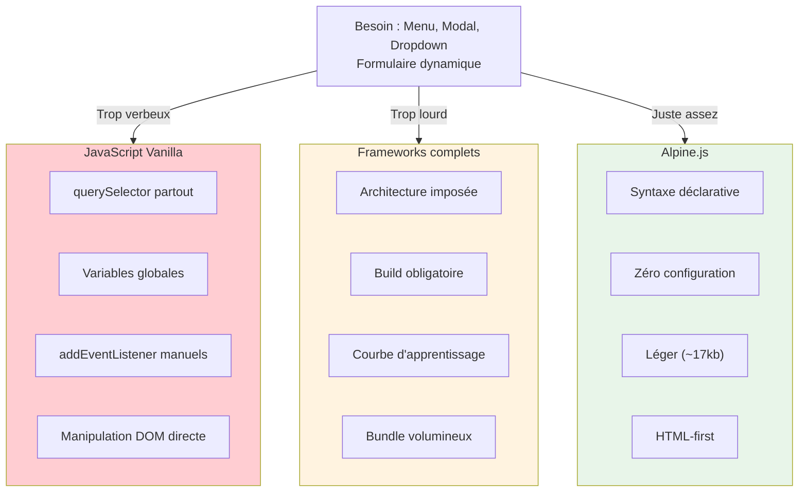
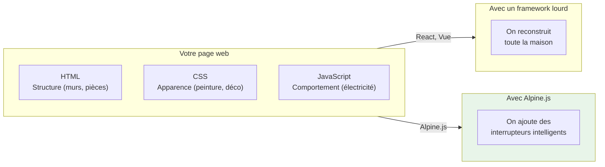
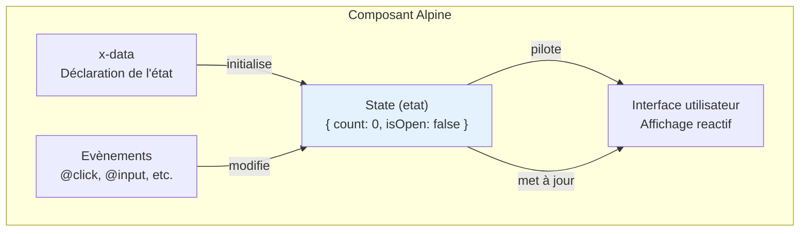
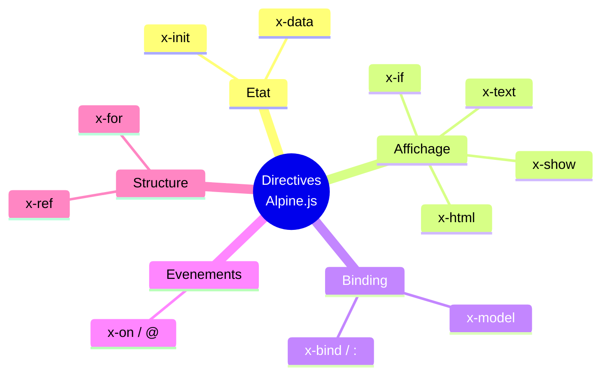
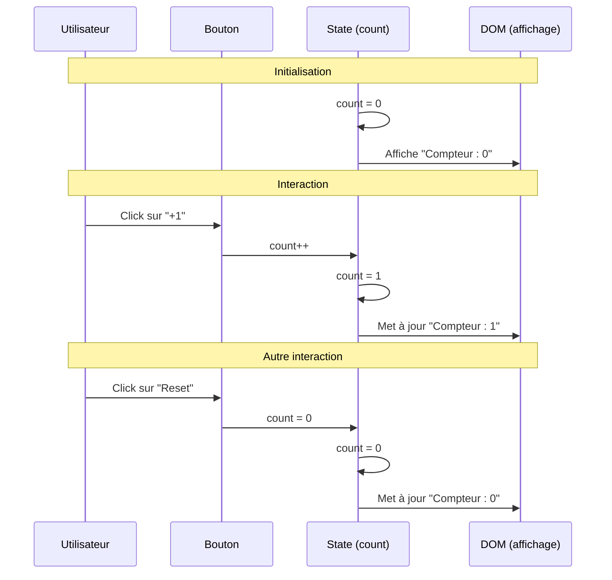
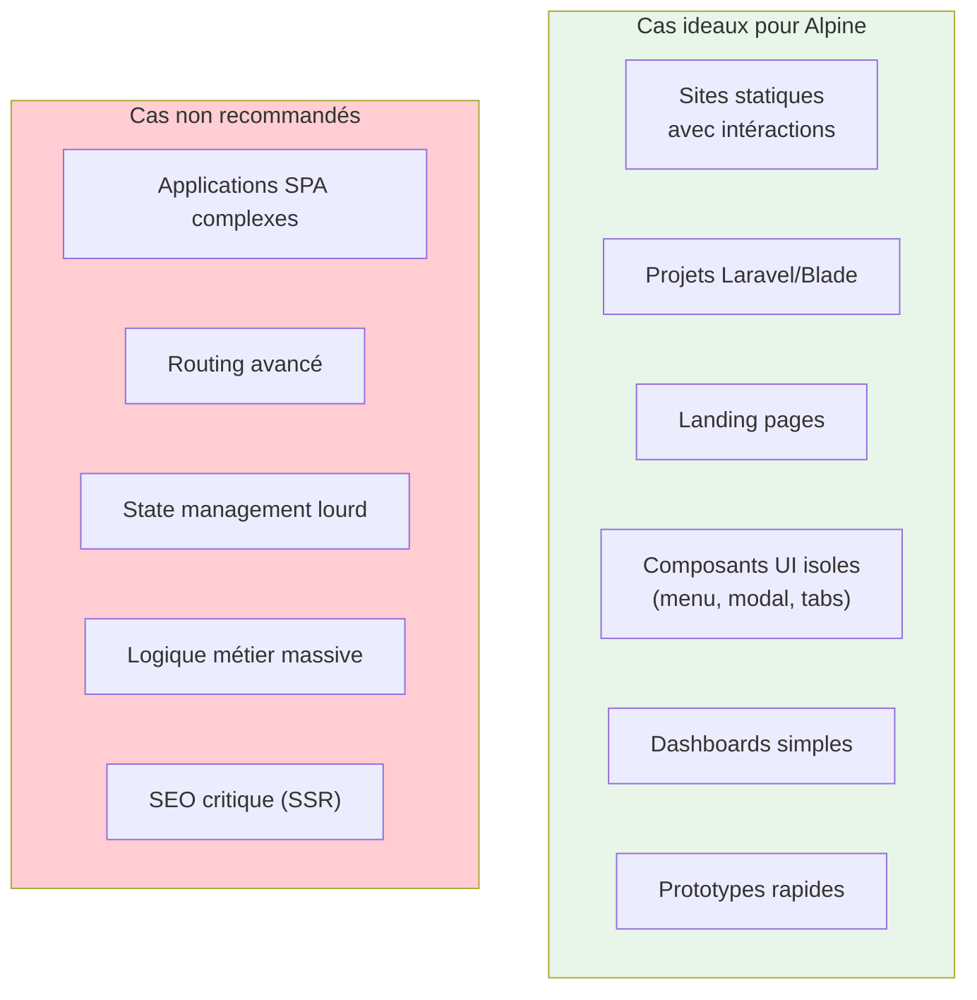
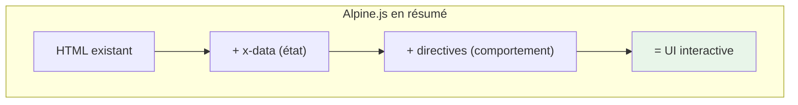

# Qu'est-ce que Alpine.js ?

<div
  class="omny-meta"
  data-level="🟢 Débutant"
  data-version="3.14.x"
  data-time="20-25 minutes">
</div>

## Introduction - <small>Leçon n° 1 - Chapitre 1</small>

!!! quote "Analogie pédagogique"
    _Imaginez que vous rénovez une maison. Vous pouvez soit **tout démolir** pour reconstruire avec des matériaux high-tech, soit **ajouter des interrupteurs intelligents** aux endroits strategiques. Alpine.js, c'est la deuxieme approche : vous gardez votre HTML existant et vous y ajoutez de l'intéractivite exactement là où vous en avez besoin._

**Alpine.js** est une micro-librairie JavaScript conçue pour ajouter de l'intéractivite aux pages web directement depuis le HTML. Elle se positionne entre le JavaScript vanilla (trop verbeux) et les frameworks complets comme React ou Vue (trop lourds pour des besoins simples).

!!! info "Objectifs de cette leçon"
    A la fin de cette leçon, vous saurez :
    
    - **Définir** ce qu'est Alpine.js et son positionnement dans l'écosystème
    - **Comprendre** la philosophie "HTML-first" et ses implications
    - **Distinguer** les cas d'usage appropriés des cas ou Alpine n'est pas adapté
    - **Créer** votre premier composant réactif fonctionnel

## Positionnement dans l'écosystème

### Le problème que résout Alpine.js

Sur le web moderne, deux approches dominent pour ajouter de l'intéractivite :



Alpine.js comble le vide entre ces deux extrêmes en proposant une approche **déclarative** et **légère**.

### Comparaison des approches

| Critère | JavaScript Vanilla | Alpine.js | React/Vue/Angular |
|---------|-------------------|-----------|-------------------|
| **Taille** | 0 kb | ~17 kb | 40-200+ kb |
| **Configuration** | Aucune | Aucune | Build requis |
| **Courbe** | Moyenne | Faible | Elevée |
| **Cas d'usage** | Scripts ponctuels | UI intéractive | Applications SPA |
| **Maintenabilité** | Difficile | Bonne | Excellente |

!!! tip "Quand choisir Alpine.js ?"
    Alpine excelle pour les **sites statiques enrichis**, les **projets Laravel/Blade**, les **landing pages**, les **dashboards simples** et les **composants UI reutilisables** (menus, modals, tabs, accordeons).

## La philosophie HTML-first

### Principe fondamental

Alpine.js est qualifié de framework **HTML-first** car la logique d'interface s'écrit directement dans le markup HTML via des attributs spéciaux.

!!! quote "Traduction concrête"
    _Plutôt que d'écrire du JavaScript qui manipule le HTML, vous écrivez du HTML qui **déclare** son comportement._

### Comparaison : approche impérative vs déclarative

**Approche impérative (JavaScript classique) :**

```javascript title="<small><em>Langage : JavaScript</em></small>"
// Sélection des élements
const button = document.querySelector('#toggle-btn');
const menu = document.querySelector('#menu');
let isOpen = false;

// Gestion de l'état
button.addEventListener('click', () => {
    isOpen = !isOpen;
    menu.style.display = isOpen ? 'block' : 'none';
    button.textContent = isOpen ? 'Fermer' : 'Ouvrir';
    button.setAttribute('aria-expanded', isOpen);
});
```

**Approche déclarative (Alpine.js) :**

```html title="<small><em>Langage : HTML + Alpine.js</em></small>"
<!-- L'état et le comportement sont déclarés directement dans le HTML -->
<div x-data="{ isOpen: false }">
    <button 
        @click="isOpen = !isOpen"
        :aria-expanded="isOpen"
        x-text="isOpen ? 'Fermer' : 'Ouvrir'">
    </button>
    
    <nav x-show="isOpen">
        <!-- Contenu du menu -->
    </nav>
</div>
```

!!! success "Avantage de l'approche déclarative"
    Le comportement est **visible** directement dans le HTML. Vous n'avez pas besoin de chercher dans un fichier JavaScript séparé pour comprendre ce que fait un élement.

### Analogie architecturale



---

## Concepts fondamentaux

### Le composant Alpine

Un composant Alpine est une **zone HTML** qui possède son propre **état** (state) et ses propres **comportements**.



**Vocabulaire essentiel :**

| Terme | Definition | Exemple |
|-------|------------|---------|
| **State** | Données internes du composant | `{ count: 0 }` |
| **Directive** | Attribut spécial Alpine | `x-data`, `x-show`, `x-text` |
| **Réactivité** | Mise à jour auto de l'UI [^1] | Changer `count` met à jour l'affichage |
| **Scope** | Zone d'influence du composant | Le `<div x-data>` et ses enfants |

### Les directives essentielles

Alpine.js fonctionne avec des **directives** (attributs HTML spéciaux) qui commencent par `x-` :



!!! warning "Directive à risque"
    La directive `x-html` permet d'injecter du HTML brut. **Ne jamais l'utiliser avec des données utilisateur** sous peine de créer une faille XSS (Cross-Site Scripting).

---

## Premier composant : le compteur

### Code complet

```html title="<small><em>Langage : HTML + Alpine.js</em></small>"
<!-- Composant compteur : premier exemple de réactivité Alpine -->
<div x-data="{ count: 0 }">
    <!-- Affichage réactif de la valeur -->
    <p>Compteur : <strong x-text="count"></strong></p>
    
    <!-- Boutons de contrôle -->
    <button @click="count++">+1</button>
    <button @click="count--">-1</button>
    <button @click="count = 0">Reset</button>
</div>
```

### Analyse de la séquence ligne par ligne



**Explication détaillée :**

| Elément | Rôle | Comportement |
|---------|------|--------------|
| `x-data="{ count: 0 }"` | Déclare le composant et son état initial | `count` vaut 0 au démarrage |
| `x-text="count"` | Affiche la valeur de `count` dans l'élement | Se met à jour automatiquement |
| `@click="count++"` | Raccourci pour `x-on:click` | Incrémente `count` au clic |

!!! tip "Réactivite automatique"
    Vous n'avez **jamais** à manipuler le DOM manuellement. Modifiez l'état, Alpine met à jour l'interface.

---

## Cas d'usage et limites

### Quand utiliser Alpine.js



!!! danger "**Piège n° 1 à éviter** : _Croire qu'Alpine remplace React/Vue pour une grosse application._"
!!! danger "**Piège n° 2 à éviter** : _Mettre trop de logique dans les attributs HTML (garder le code lisible)._"
!!! danger "**Piège n° 3 à éviter** : _Utiliser `x-html` avec des données non sanitisées (faille XSS)._"

---

## Résume de la leçon

!!! tip "Points clés à retenir"
    - **Alpine.js** est une micro-librairie (~17kb) pour ajouter de l'interactivite au HTML
    - La philosophie **HTML-first** place la logique directement dans le markup
    - Un **composant** = une zone `x-data` avec son état et ses comportements
    - La **reactivite** met à jour automatiquement l'interface quand l'état change
    - Alpine excelle pour les **UI légères**, pas pour les applications complexes

### Schéma recapitulatif



---

## Exercice pratique

!!! note "Objectif : Valider la comprehension"
    Modifiez le compteur pour qu'il ne puisse **jamais descendre sous zéro**.

**Contraintes :**

- Le bouton "-1" ne doit pas fonctionner si `count` est déjà à 0
- Bonus : Désactivez visuellement le bouton quand il est inutilisable


??? example "**Indice :**"

    ```html
    <!-- Syntaxe conditionnelle dans un @click -->
    <button @click="count > 0 && count--">-1</button>

    <!-- Ou avec :disabled pour desactiver le bouton -->
    <button @click="count--" :disabled="count === 0">-1</button>
    ```

---

## Pour aller plus loin

| Ressource | Description |
|-----------|-------------|
| [Documentation officielle](https://alpinejs.dev/) | Référence complète des directives |
| [Lecon suivante](./c1-lesson2/) | L'évolution d'Alpine.js et son écosystème |

!!! quote "Le mot de la fin"
    _Alpine.js n'est pas un framework de plus à apprendre, c'est une **façon de penser** l'interactivite web. Plutôt que de tout reconstruire, vous enrichissez ce qui existe déjà._

[^1]: Le terme **UI** signifie simplement **User Interface** en anglais qui se traduit littéralement par **Interface Utilisateur**.