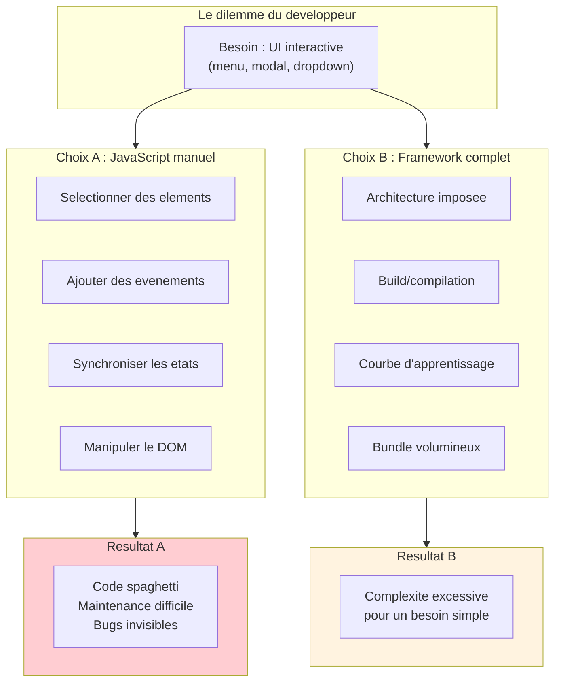
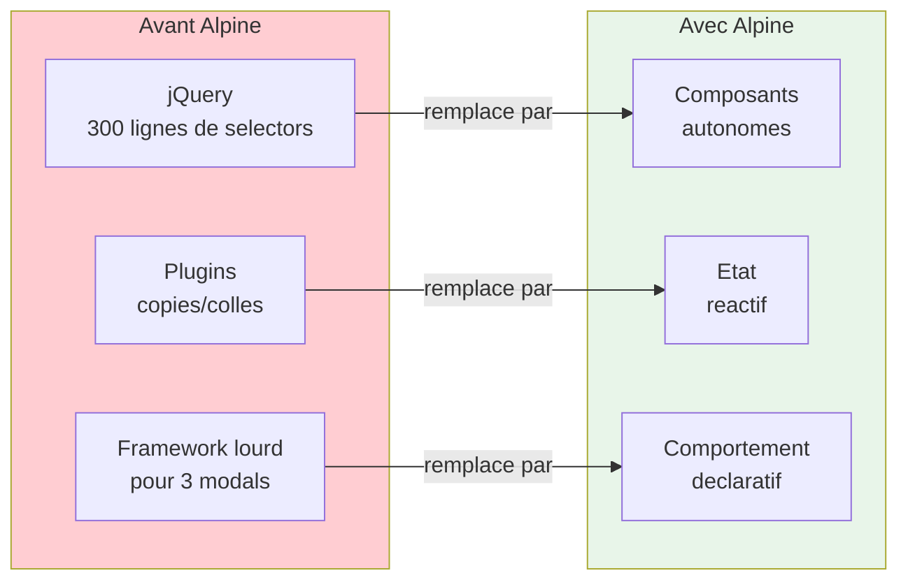
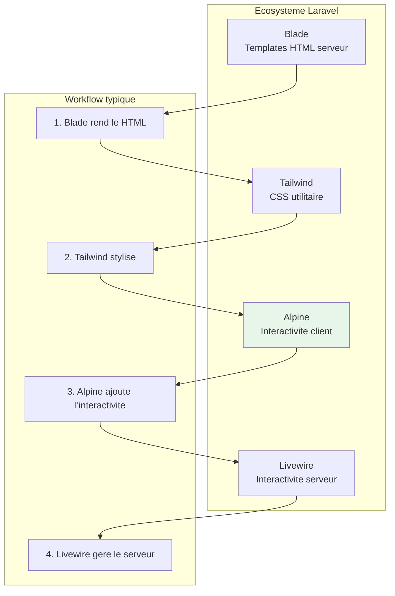
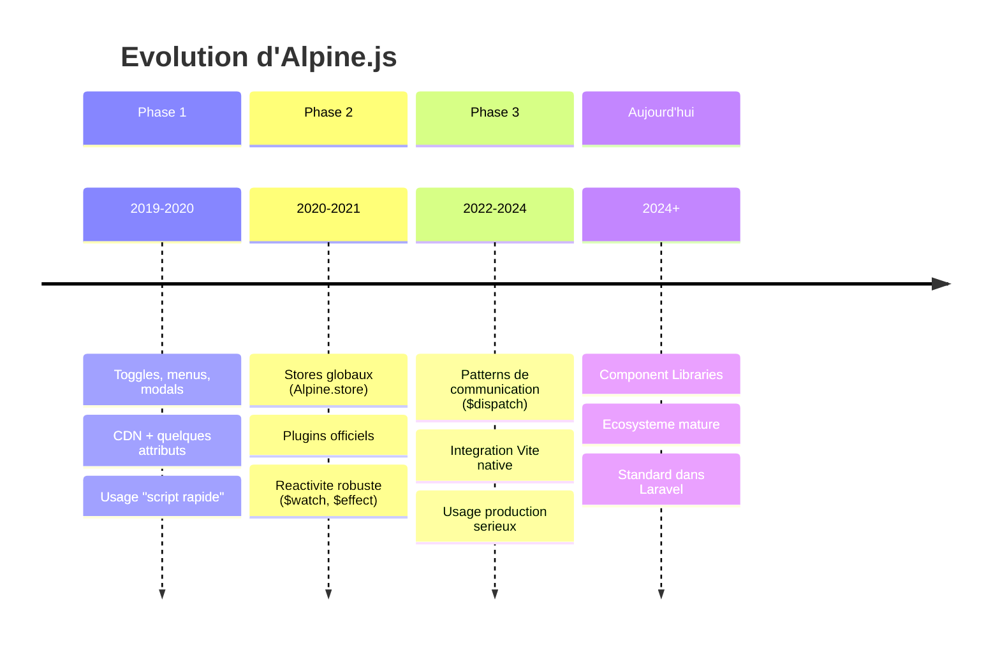
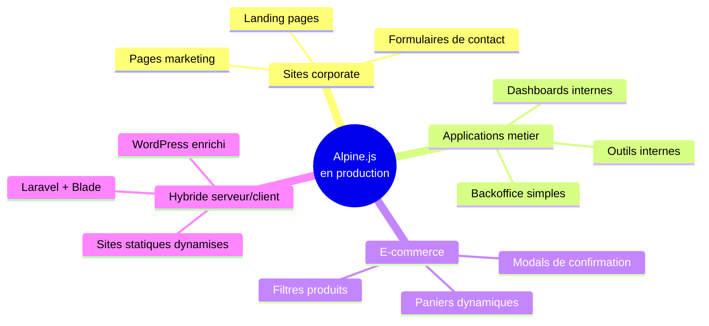
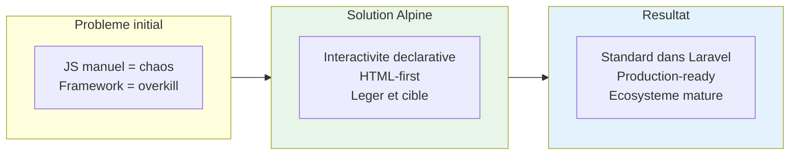

# L'evolution d'Alpine.js

<div
  class="omny-meta"
  data-level="🟢 Debutant"
  data-version="3.14.x"
  data-time="20-25 minutes">
</div>

## Introduction

!!! quote "Analogie pedagogique"
    _Imaginez l'evolution des telephones : d'abord les fixes encombrants, puis les portables basiques, enfin les smartphones. Mais parfois, vous avez juste besoin de **passer un appel**, pas de naviguer sur internet. Alpine.js, c'est ce telephone qui fait exactement ce dont vous avez besoin, sans la complexite inutile._

**Alpine.js** n'est pas apparu par hasard. Il repond a un probleme concret que les developpeurs web rencontraient quotidiennement : comment ajouter de l'interactivite a une page sans tomber dans le chaos du JavaScript manuel ou la lourdeur des frameworks complets ?

!!! info "Objectifs de cette lecon"
    A la fin de cette lecon, vous saurez :
    
    - **Identifier** le probleme historique qui a motive la creation d'Alpine.js
    - **Comprendre** ce qu'Alpine a remplace dans les projets web modernes
    - **Expliquer** pourquoi Alpine s'est impose dans l'ecosysteme Laravel/Blade
    - **Situer** Alpine dans la stack TALL et son role specifique

---

## Le probleme historique

### Deux extremes insatisfaisants

Pendant longtemps, les developpeurs web faisaient face a un dilemme pour ajouter de l'interactivite :



!!! warning "Le vrai probleme"
    Ni l'un ni l'autre n'etait adapte aux projets ou l'on souhaite simplement **enrichir une page existante** sans tout reconstruire.

### L'ere jQuery et ses limites

jQuery a domine le web pendant des annees car il simplifiait la selection d'elements et la gestion d'evenements. Cependant, il ne fournissait pas de notion de **composant** ni d'**etat reactif**.

```javascript
// Langage : JavaScript (jQuery)
// ----------------------------------------------------------------
// Exemple typique : gestion d'un menu avec jQuery
// Le code devient rapidement un reseau de dependances fragile

$('#menu-btn').on('click', function() {
    $('#menu-panel').toggle();
    $(this).toggleClass('active');
});

$('#modal-open').on('click', function() {
    $('#modal').show();
    $('#menu-panel').hide(); // Dependance croisee !
});

$(document).on('click', function(e) {
    if (!$(e.target).closest('#menu').length) {
        $('#menu-panel').hide();
    }
});

// Et ca continue... pour chaque interaction
```

!!! danger "Probleme fondamental"
    Ce pattern "si X alors modifie Y" cree un **reseau de dependances fragile** qui devient impossible a maintenir des que l'interface grandit.

---

## Ce qu'Alpine a remplace

### Comparaison des approches

| Avant Alpine | Probleme | Apres Alpine |
|--------------|----------|--------------|
| Scripts jQuery maison | Code disperse, non reutilisable | Composants localises et lisibles |
| Plugins UI copies/colles | Non maintenable, non accessible | Patterns standardises |
| Frameworks lourds pour 3 interactions | Complexite disproportionnee | Outil adapte au besoin |
| Variables globales | Collisions, bugs invisibles | Scope isole par composant |

### Schema de transformation



---

## L'ecosysteme Laravel et la stack TALL

### Pourquoi Alpine s'est impose dans Laravel

Laravel est un framework PHP oriente productivite. Son ecosysteme valorise les outils qui permettent de **construire vite** sans sacrifier la qualite.



!!! info "La stack TALL"
    L'acronyme **TALL** designe la combinaison :
    
    - **T**ailwind CSS (styles utilitaires)
    - **A**lpine.js (interactivite client)
    - **L**aravel (backend PHP)
    - **L**ivewire (composants serveur reactifs)

### Pourquoi cette synergie fonctionne

| Composant | Role | Philosophie commune |
|-----------|------|---------------------|
| **Tailwind** | Styles directement dans le HTML | HTML-first |
| **Alpine** | Comportement directement dans le HTML | HTML-first |
| **Blade** | Templates serveur | HTML comme source de verite |
| **Livewire** | Reactivite serveur | HTML comme interface |

!!! tip "Point cle"
    Alpine respecte la logique Laravel : **le HTML reste la source de verite**. Vous n'avez pas besoin de reconstruire votre page en JavaScript pour ajouter de l'interactivite.

---

## Les etapes de maturite d'Alpine

### Evolution fonctionnelle



### Fonctionnalites par phase

| Phase | Fonctionnalites | Cas d'usage |
|-------|-----------------|-------------|
| **Phase 1** | `x-data`, `x-show`, `x-on` | Toggles, menus simples |
| **Phase 2** | `Alpine.store`, plugins, `$watch` | Dashboards, formulaires |
| **Phase 3** | `$dispatch`, architecture | Applications completes |

!!! note "Evolution majeure"
    Alpine n'est plus "un petit outil sympa". C'est une **solution de production** utilisee dans des milliers de projets professionnels.

---

## Cas d'usage en production

### Ou Alpine excelle aujourd'hui



### Exemple concret : menu responsive

Comparons l'approche jQuery et l'approche Alpine pour un menu avec fermeture intelligente :

**Approche jQuery (verbose et fragile) :**

```javascript
// Langage : JavaScript (jQuery)
// ----------------------------------------------------------------
// ~25 lignes pour un comportement simple
var isOpen = false;

$('#burger').on('click', function() {
    isOpen = !isOpen;
    $('#menu').toggle();
    $(this).attr('aria-expanded', isOpen);
});

$(document).on('click', function(e) {
    if (!$(e.target).closest('#nav').length && isOpen) {
        isOpen = false;
        $('#menu').hide();
        $('#burger').attr('aria-expanded', false);
    }
});

$(document).on('keydown', function(e) {
    if (e.key === 'Escape' && isOpen) {
        isOpen = false;
        $('#menu').hide();
        $('#burger').attr('aria-expanded', false);
    }
});
```

**Approche Alpine (declarative et lisible) :**

```html
<!-- Langage : HTML + Alpine.js -->
<!-- ---------------------------------------------------------------- -->
<!-- Meme fonctionnalite en ~15 lignes, directement dans le HTML -->
<nav x-data="{ open: false }">
    <button 
        @click="open = !open"
        :aria-expanded="open"
        aria-controls="menu-panel">
        Menu
    </button>

    <div 
        id="menu-panel"
        x-show="open"
        @click.outside="open = false"
        @keydown.escape.window="open = false">
        <a href="#">Accueil</a>
        <a href="#">Services</a>
        <a href="#">Contact</a>
    </div>
</nav>
```

!!! tip "Avantages immediats"
    - L'etat est **explicite** (`open`)
    - Le comportement est **lisible** dans le HTML
    - Les regles UX sont **declaratives** (`.outside`, `.escape`)
    - Le composant est **autonome** et reutilisable

---

## Pieges a eviter

!!! danger "Piege 1 : Croire qu'Alpine est un Vue miniature"
    Alpine **ressemble** a Vue dans la syntaxe (c'est volontaire), mais Alpine n'est pas concu pour :
    
    - Le routing complet
    - L'architecture front complexe
    - Le state management a grande echelle
    
    Alpine reste un outil d'**interactivite locale**.

!!! warning "Piege 2 : Ecrire du code spaghetti Alpine"
    Meme avec Alpine, vous pouvez creer du code non maintenable si vous :
    
    - Mettez trop de logique dans les attributs HTML
    - Creez des composants interdependants sans structure
    - Dupliquez des variables dans plusieurs scopes
    
    La formation couvre les **patterns professionnels** pour eviter ces ecueils.

---

## Resume de la lecon

!!! tip "Points cles a retenir"
    - **Alpine.js** est ne pour combler le vide entre JavaScript manuel et frameworks lourds
    - Il a **remplace** jQuery, les plugins copies/colles et l'usage excessif de frameworks
    - Il s'est **impose** dans Laravel grace a la philosophie HTML-first partagee avec Blade et Tailwind
    - La **stack TALL** (Tailwind, Alpine, Laravel, Livewire) est devenue un standard de productivite
    - Alpine est aujourd'hui une **solution de production mature**, pas juste un outil de prototypage

### Schema recapitulatif



---

## Exercice pratique

!!! note "Objectif : Valider la comprehension du positionnement"
    Repondez aux questions suivantes (a l'ecrit ou a l'oral) :

**Questions :**

1. **Pourquoi** Alpine.js est-il particulierement adapte a un projet Laravel/Blade ?

2. **Dans quel cas** choisiriez-vous React ou Vue plutot qu'Alpine ?

3. **Citez deux fonctionnalites UI** pour lesquelles Alpine est le choix ideal.

**Elements de reponse attendus :**

| Question | Reponse type |
|----------|--------------|
| Q1 | Philosophie HTML-first commune, pas besoin de build, enrichit le rendu serveur |
| Q2 | Application SPA complexe, routing avance, state management lourd |
| Q3 | Menus responsives, modals, dropdowns, accordeons, filtres de liste |

---

## Pour aller plus loin

| Ressource | Description |
|-----------|-------------|
| [Site officiel Alpine.js](https://alpinejs.dev/) | Documentation et exemples |
| [Laravel TALL Stack](https://tallstack.dev/) | Ressources sur l'ecosysteme TALL |
| [Lecon suivante](./c1-lesson3/) | Pourquoi apprendre Alpine.js (argumentation marche) |

!!! quote "Le mot de la fin"
    _Alpine.js n'a pas revolutionne le web, il l'a **simplifie**. En respectant le HTML comme source de verite, il permet aux developpeurs de construire des interfaces interactives sans la taxe cognitive des frameworks lourds._