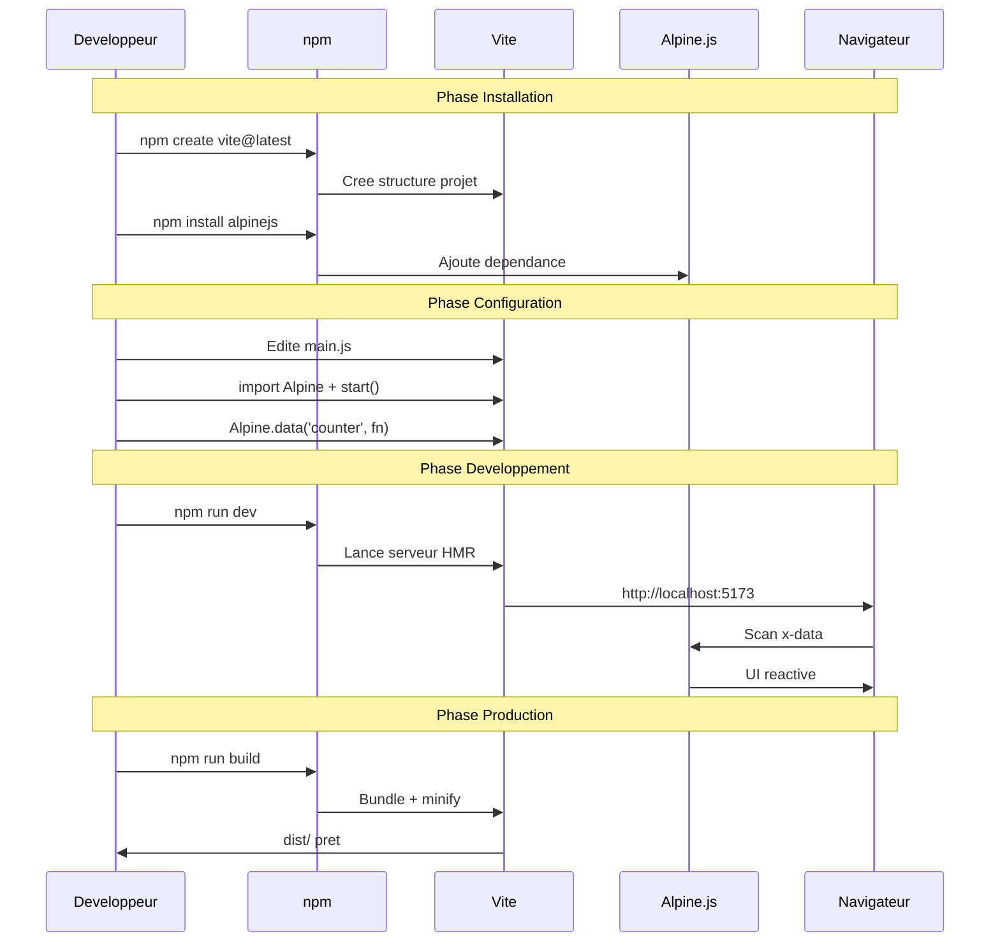

# Leçon n° 9

<div
  class="omny-meta"
  data-level="🟢 Débutant & 🟡 Intermédiaire"
  data-version="3.13.3"
  data-time="15-16 heures">
</div>

## Installation via ViteJS (projet moderne, propre, maintenable)

### Objectif de la leçon

À la fin de cette leçon, tu vas savoir :

* créer un projet moderne avec **Vite**
* installer Alpine proprement via **npm**
* structurer ton code comme un projet professionnel
* lancer un serveur de dev et build une version production
* éviter les erreurs classiques (qui font perdre du temps)

Ici on quitte le mode “CDN rapide” et on passe en mode “projet réel”.

---

## 1) C’est quoi Vite (et pourquoi on l’utilise)

Vite est un outil moderne qui te donne :

* un serveur de développement ultra rapide
* un système de build pour la production
* une structure de projet claire
* des imports JavaScript modernes

Avec Vite, ton code Alpine ne vit plus dans un seul fichier HTML.
Il vit dans des fichiers propres :

* `main.js`
* composants
* styles
* assets

### Analogie simple

Le CDN, c’est comme cuisiner dans une petite cuisine de camping : rapide, simple, pratique.

Vite, c’est une vraie cuisine professionnelle :

* tu ranges tes ingrédients
* tu as des outils propres
* tu peux produire en volume sans chaos

---

## 2) Prérequis techniques (avant de commencer)

Tu dois avoir :

* Node.js installé (version récente)
* npm (ou pnpm/yarn, mais on reste sur npm pour la formation)

### Vérification rapide

Dans ton terminal :

```bash
node -v
npm -v
```

Si tu as une version moderne (ex: Node 18+), tu es bien.

---

## 3) Création du projet Vite (étape par étape)

On va créer un projet simple en Vanilla JS.

### Étape 1 — créer le projet

```bash
npm create vite@latest alpine-vite-playground
```

Vite va te poser des questions.

Choisis :

* Framework : **Vanilla**
* Variant : **JavaScript**

Ensuite :

```bash
cd alpine-vite-playground
npm install
npm run dev
```

Tu vas obtenir une URL locale du style :

* `http://localhost:5173`

---

## 4) Installation d’Alpine dans le projet

Maintenant on installe Alpine via npm.

```bash
npm install alpinejs
```

Alpine est maintenant dans ton projet, versionné, contrôlé, fiable.

---

## 5) Intégration Alpine dans le code (proprement)

Dans Vite, ton point d’entrée JS est souvent :

* `src/main.js`

Ouvre `src/main.js` et remplace le contenu par ceci :

```js
import Alpine from "alpinejs";

window.Alpine = Alpine;

Alpine.start();
```

### Explication claire

* `import Alpine from "alpinejs";`
  Tu importes Alpine comme un module moderne.

* `window.Alpine = Alpine;`
  Tu exposes Alpine dans le navigateur (utile pour debug, plugins, etc.)

* `Alpine.start();`
  Tu démarres Alpine et il va scanner le DOM pour activer `x-data`, etc.

---

## 6) Mise en place d’un HTML propre

Dans Vite, ton HTML principal est généralement :

* `index.html` (à la racine du projet)

Tu peux y mettre ton contenu Alpine directement.

Exemple simple :

```html
<!doctype html>
<html lang="fr">
  <head>
    <meta charset="UTF-8" />
    <meta name="viewport" content="width=device-width, initial-scale=1.0" />
    <title>Alpine + Vite Playground</title>
  </head>

  <body>
    <h1>Alpine + Vite Playground</h1>

    <div x-data="{ count: 0 }">
      <p>Compteur : <strong x-text="count"></strong></p>

      <button @click="count++">+1</button>
      <button @click="count = 0">Reset</button>
    </div>

    <script type="module" src="/src/main.js"></script>
  </body>
</html>
```

### Point important

Le script Vite est :

```html
<script type="module" src="/src/main.js"></script>
```

Donc ton Alpine démarre via ton JS.

---

## 7) Structurer proprement ton projet (niveau pro)

Tu vas vite éviter le chaos si tu adoptes une structure claire.

Voici une structure recommandée :

```
alpine-vite-playground/
  index.html
  src/
    main.js
    components/
      counter.js
      menu.js
    styles/
      app.css
```

L’idée est simple :

* `main.js` démarre Alpine
* `components/` contient tes fonctions `x-data`
* `styles/` contient ton CSS (ou Tailwind plus tard)

---

## 8) Exemple pro : externaliser un composant Alpine

Au lieu d’écrire ton composant directement dans le HTML :

```html
<div x-data="{ count: 0 }">...</div>
```

On va faire un composant réutilisable.

### Étape 1 — créer `src/components/counter.js`

```js
export function counterComponent() {
  return {
    count: 0,

    increment() {
      this.count++;
    },

    decrement() {
      if (this.count > 0) {
        this.count--;
      }
    },

    reset() {
      this.count = 0;
    },
  };
}
```

### Étape 2 — utiliser ce composant dans `src/main.js`

```js
import Alpine from "alpinejs";
import { counterComponent } from "./components/counter.js";

window.Alpine = Alpine;

Alpine.data("counter", counterComponent);

Alpine.start();
```

### Étape 3 — l’utiliser dans ton HTML

```html
<div x-data="counter">
  <p>Compteur : <strong x-text="count"></strong></p>

  <button @click="decrement()">-1</button>
  <button @click="increment()">+1</button>
  <button @click="reset()">Reset</button>
</div>
```

### Pourquoi c’est “pro”

Parce que maintenant :

* ton HTML est lisible
* ta logique est dans un fichier JS
* tu peux réutiliser ce composant partout
* tu peux le maintenir facilement

---

## 9) Build production (ce que fait Vite)

Quand tu veux produire une version “livrable” :

```bash
npm run build
```

Vite va générer un dossier :

* `dist/`

C’est la version optimisée, minifiée, prête pour un hébergement.

Tu peux tester la version build avec :

```bash
npm run preview
```

---

## 10) Les pièges classiques avec Vite + Alpine

### Piège 1 — Alpine ne démarre pas

Tu as mis ton `x-data`, mais rien ne marche.

Causes fréquentes :

* tu as oublié `Alpine.start()`
* tu n’as pas mis le script module dans le HTML
* ton `main.js` ne s’exécute pas

Solution : vérifier console + Network.

---

### Piège 2 — “counterComponent is not defined”

Tu as oublié l’import, ou mauvais chemin :

```js
import { counterComponent } from "./components/counter.js";
```

Si tu écris `./component/counter.js` au lieu de `./components/`, tu perds 20 minutes.

---

### Piège 3 — Tu mélanges CDN et npm

Dans un projet Vite, tu n’utilises plus le CDN.

Tu gardes une seule source :

* npm install alpinejs
* import Alpine
* start

---

## 11) Mini exercice (important)

### Exercice A — Composant “toggle panel”

1. Crée `src/components/toggle.js`
2. Fais un composant avec :

   * `open: false`
   * `toggle()`
3. Utilise-le dans le HTML

### Exercice B — Composant “menu”

Tu fais un mini menu avec :

* un bouton burger
* `x-show`
* fermeture au clic dehors (`@click.outside`)
* fermeture Escape (`@keydown.escape.window`)

Tu n’as pas besoin de style, juste le comportement.

---

## Résumé de la leçon

Tu sais maintenant :

* créer un projet Vite moderne
* installer Alpine via npm
* démarrer Alpine proprement
* structurer ton code comme un projet maintenable
* externaliser tes composants Alpine

Le CDN est parfait pour apprendre vite.
Vite est parfait pour construire du vrai code réutilisable.

---

Prochaine leçon : **Leçon 10 — Installation avec Laravel (Blade + Alpine)**
Et là, on va connecter Alpine à son terrain naturel : Blade, composants serveur, et logique UI propre dans un projet Laravel (sans entrer trop tôt dans Livewire).


