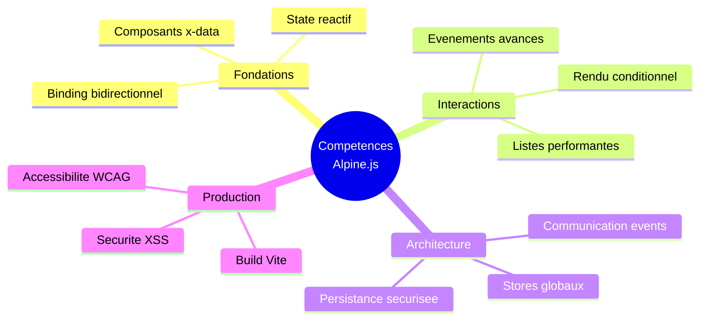

# Alpine.js

## Introduction

**Alpine.js** est un framework JavaScript leger concu pour ajouter de l'interactivite aux pages web sans la complexite des solutions comme React ou Vue. Cette formation vous accompagne depuis les premiers concepts jusqu'a la mise en production d'applications professionnelles.

> Alpine.js comble le vide entre le JavaScript vanilla et les frameworks complets, en gardant une philosophie **HTML-first** qui place la logique directement dans le markup.

!!! info "Pourquoi cette formation ?"
    - Elle **structure** votre apprentissage de maniere progressive et methodique
    - Elle **couvre** 100% des fonctionnalites essentielles d'Alpine.js
    - Elle **integre** les bonnes pratiques de securite et d'accessibilite
    - Elle **produit** des livrables reutilisables en contexte professionnel

## Parcours pedagogique

## Phase 1 — Fondations

!!! note "Cette phase couvre l'installation, les concepts de base et la liaison de donnees"

-   :lucide-download:{ .lg .middle } **Chapitre 1** — _Presentation et Installation_

    ---
    Decouverte d'Alpine.js, installation CDN et Vite, premier composant reactif.

    **Lecons** : 12 | **Duree** : ~2h30

    [:lucide-book-open-check: Acceder au chapitre 1](./c1-lesson1/)

-   :lucide-database:{ .lg .middle } **Chapitre 2** — _Etat et Affichage_

    ---
    Directives `x-data`, `x-text`, `x-html`, `x-show`, `x-if` et gestion du state.

    **Lecons** : 7 | **Duree** : ~1h30

    [:lucide-book-open-check: Acceder au chapitre 2](./c2-lesson1/)

-   :lucide-link:{ .lg .middle } **Chapitre 3** — _Binding et Formulaires_

    ---
    Liaison bidirectionnelle `x-model`, `x-bind`, validation et patterns formulaires.

    **Lecons** : 5 | **Duree** : ~1h15

    [:lucide-book-open-check: Acceder au chapitre 3](./c3-lesson1/)

### Atelier Phase 1

-   :lucide-layout-dashboard:{ .lg .middle } **Atelier UI #1** — _Menu responsive_

    ---
    Construction d'un menu burger complet avec fermeture intelligente et accessibilite.

    **Niveau** : Debutant | **Duree** : 45 min

    [:lucide-hammer: Acceder a l'atelier](./atelier_1/)

## Phase 2 — Interactions

!!! note "Cette phase approfondit les evenements, le rendu conditionnel et la reactivite"

-   :lucide-mouse-pointer-click:{ .lg .middle } **Chapitre 4** — _Evenements avances_

    ---
    Modifiers (`.prevent`, `.outside`, `.debounce`), raccourcis clavier, UX professionnelle.

    **Lecons** : 5 | **Duree** : ~1h15

    [:lucide-book-open-check: Acceder au chapitre 4](./c4-lesson1/)

-   :lucide-list:{ .lg .middle } **Chapitre 5** — _Rendu dynamique_

    ---
    Boucles `x-for`, conditions `x-if`/`x-else`, gestion des listes et `:key`.

    **Lecons** : 5 | **Duree** : ~1h15

    [:lucide-book-open-check: Acceder au chapitre 5](./c5-lesson1/)

-   :lucide-zap:{ .lg .middle } **Chapitre 6** — _Reactivite et DOM_

    ---
    References `$refs`, `$nextTick`, `x-effect`, controle precis du cycle de vie.

    **Lecons** : 5 | **Duree** : ~1h15

    [:lucide-book-open-check: Acceder au chapitre 6](./c6-lesson1/)

### Ateliers Phase 2

-   :lucide-check-square:{ .lg .middle } **Atelier UI #2** — _Todo list simple_

    ---
    Application CRUD basique avec ajout, suppression et modification de taches.

    **Niveau** : Debutant | **Duree** : 45 min

    [:lucide-hammer: Acceder a l'atelier](./atelier_2/)

-   :lucide-filter:{ .lg .middle } **Atelier UI #3** — _Todo list avancee_

    ---
    Filtres, recherche debounce, animations et persistance locale.

    **Niveau** : Intermediaire | **Duree** : 1h

    [:lucide-hammer: Acceder a l'atelier](./atelier_3/)

## Phase 3 — UI Avancee

!!! note "Cette phase couvre les transitions CSS et la communication inter-composants"

-   :lucide-sparkles:{ .lg .middle } **Chapitre 7** — _Transitions et animations_

    ---
    Directive `x-transition`, classes CSS, modifiers de timing et animations fluides.

    **Lecons** : 3 | **Duree** : ~45 min

    [:lucide-book-open-check: Acceder au chapitre 7](./c7-lesson1/)

-   :lucide-radio:{ .lg .middle } **Chapitre 8** — _Communication inter-composants_

    ---
    Events custom `$dispatch`, pattern pub/sub, decouplage et architecture modulaire.

    **Lecons** : 3 | **Duree** : ~45 min

    [:lucide-book-open-check: Acceder au chapitre 8](./c8-lesson1/)

### Atelier Phase 3

-   :lucide-newspaper:{ .lg .middle } **Atelier UI #4** — _Blog mock_

    ---
    Interface de blog avec liste d'articles, filtres, favoris et systeme de toast.

    **Niveau** : Intermediaire | **Duree** : 1h15

    [:lucide-hammer: Acceder a l'atelier](./atelier_4/)

---

## Phase 4 — Architecture et Production

!!! note "Cette phase finalise avec les stores, la persistance, les plugins et le deploiement"

-   :lucide-warehouse:{ .lg .middle } **Chapitre 9** — _Stores et architecture_

    ---
    `Alpine.store()`, etat global, `x-effect`, `$watch` et patterns d'architecture.

    **Lecons** : 4 | **Duree** : ~1h

    [:lucide-book-open-check: Acceder au chapitre 9](./c9-lesson1/)

-   :lucide-hard-drive:{ .lg .middle } **Chapitre 10** — _Persistance_

    ---
    Plugin Persist, localStorage, securite du stockage client et bonnes pratiques.

    **Lecons** : 3 | **Duree** : ~45 min

    [:lucide-book-open-check: Acceder au chapitre 10](./c10-lesson1/)

-   :lucide-puzzle:{ .lg .middle } **Chapitre 11** — _Plugins officiels_

    ---
    Focus, Intersect, Collapse, Mask, Anchor et accessibilite avancee (ARIA, a11y).

    **Lecons** : 5 | **Duree** : ~1h15

    [:lucide-book-open-check: Acceder au chapitre 11](./c11-lesson1/)

-   :lucide-rocket:{ .lg .middle } **Chapitre 12** — _Production Ready_

    ---
    Build Vite, integration Tailwind, Component Library et checklist qualite.

    **Lecons** : 7 | **Duree** : ~1h45

    [:lucide-book-open-check: Acceder au chapitre 12](./c12-lesson1/)

### Atelier Final

-   :lucide-shield-check:{ .lg .middle } **Atelier UI #9** — _AAA Theme Test_

    ---
    Page de test complete : accessibilite, plugins, themes, checklist production.

    **Niveau** : Avance | **Duree** : 1h30

    [:lucide-hammer: Acceder a l'atelier](./atelier_9/)

---

## Competences validees

A l'issue de cette formation, vous serez capable de :

## Synthese par niveau

| Phase | Chapitres | Niveau | Prerequis |
|-------|-----------|--------|-----------|
| **Fondations** | 1, 2, 3 | Debutant | HTML/CSS de base |
| **Interactions** | 4, 5, 6 | Debutant+ | Phase 1 completee |
| **UI Avancee** | 7, 8 | Intermediaire | Phases 1-2 completees |
| **Production** | 9, 10, 11, 12 | Intermediaire+ | Phases 1-3 completees |

!!! tip "Conseils de progression"
    - [x] **Suivez l'ordre** des chapitres, chaque concept s'appuie sur les precedents
    - [x] **Realisez les ateliers** pour consolider la pratique
    - [x] **Testez le code** vous-meme plutot que de simplement lire
    - [x] **Revisitez les pieges** mentionnes pour eviter les erreurs classiques

## Livrables obtenus

A la fin de cette formation, vous disposerez de :

- Un **Playground Alpine.js** pour vos tests rapides
- Une **serie d'ateliers UI** reutilisables (Menu, Todo, Blog, Modals)
- Une page **AAA Theme Test** pour valider l'accessibilite
- Un **starter Vite + Alpine + Tailwind** pret a cloner
- Une **Component Library** documentee et professionnelle
- Une **checklist production** (qualite, securite, accessibilite)

!!! warning "Prerequis techniques"
    Cette formation suppose une connaissance de base de **HTML**, **CSS** et des **fondamentaux JavaScript**

    - variables
    - fonctions
    - objets
    - tableaux

> Les fiches suivantes detaillent chaque chapitre avec des exemples pratiques, des diagrammes explicatifs et des exercices progressifs.