# Templates Diagrammes Mermaid - Formation Alpine.js

Ce fichier contient des diagrammes prets a integrer dans chaque chapitre de la formation.

---

## Chapitre 1 - Presentation et Installation

### Diagramme 1.1 - Positionnement Alpine.js dans l'ecosysteme

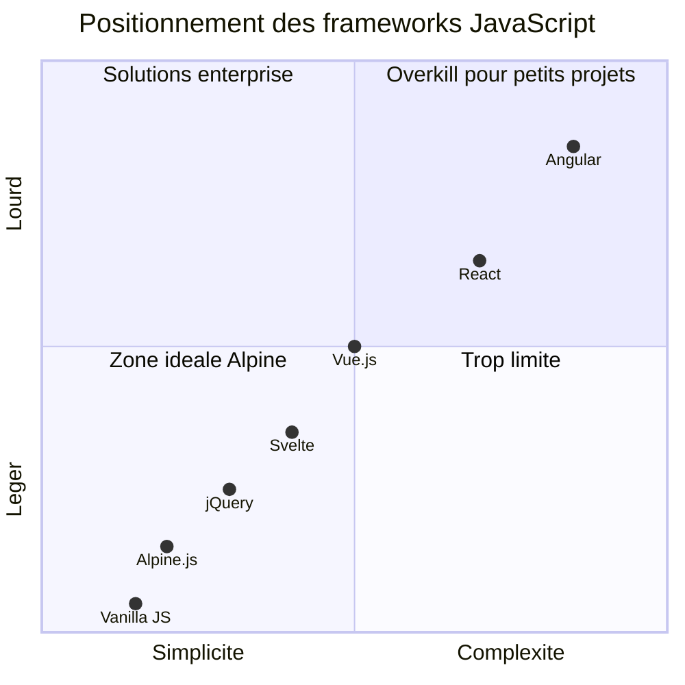
```mermaid
quadrantChart
    title Positionnement des frameworks JavaScript
    x-axis Simplicite --> Complexite
    y-axis Leger --> Lourd
    quadrant-1 Overkill pour petits projets
    quadrant-2 Solutions enterprise
    quadrant-3 Zone ideale Alpine
    quadrant-4 Trop limite
    
    Alpine.js: [0.2, 0.15]
    jQuery: [0.3, 0.25]
    Vue.js: [0.5, 0.5]
    React: [0.7, 0.65]
    Angular: [0.85, 0.85]
    Vanilla JS: [0.15, 0.05]
    Svelte: [0.4, 0.35]
```

### Diagramme 1.2 - Methodes d'installation

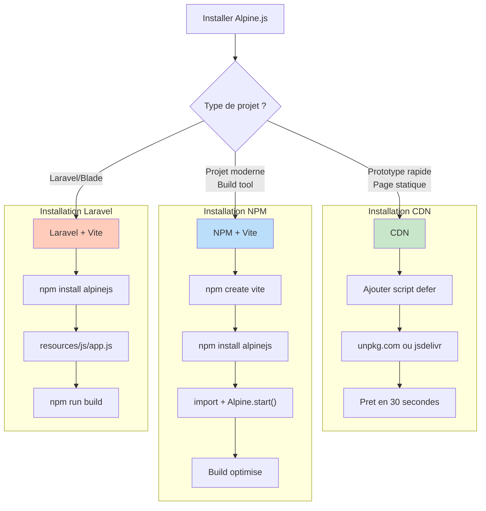
```mermaid
flowchart TB
    START["Installer Alpine.js"]
    
    START --> Q1{"Type de projet ?"}
    
    Q1 --> |"Prototype rapide<br/>Page statique"| CDN["CDN"]
    Q1 --> |"Projet moderne<br/>Build tool"| NPM["NPM + Vite"]
    Q1 --> |"Laravel/Blade"| LARAVEL["Laravel + Vite"]
    
    subgraph CDN_INSTALL["Installation CDN"]
        CDN --> CDN1["Ajouter script defer"]
        CDN1 --> CDN2["unpkg.com ou jsdelivr"]
        CDN2 --> CDN3["Pret en 30 secondes"]
    end
    
    subgraph NPM_INSTALL["Installation NPM"]
        NPM --> NPM1["npm create vite"]
        NPM1 --> NPM2["npm install alpinejs"]
        NPM2 --> NPM3["import + Alpine.start()"]
        NPM3 --> NPM4["Build optimise"]
    end
    
    subgraph LARAVEL_INSTALL["Installation Laravel"]
        LARAVEL --> LAR1["npm install alpinejs"]
        LAR1 --> LAR2["resources/js/app.js"]
        LAR2 --> LAR3["npm run build"]
    end
    
    style CDN fill:#c8e6c9
    style NPM fill:#bbdefb
    style LARAVEL fill:#ffccbc
```

### Diagramme 1.3 - Concepts fondamentaux

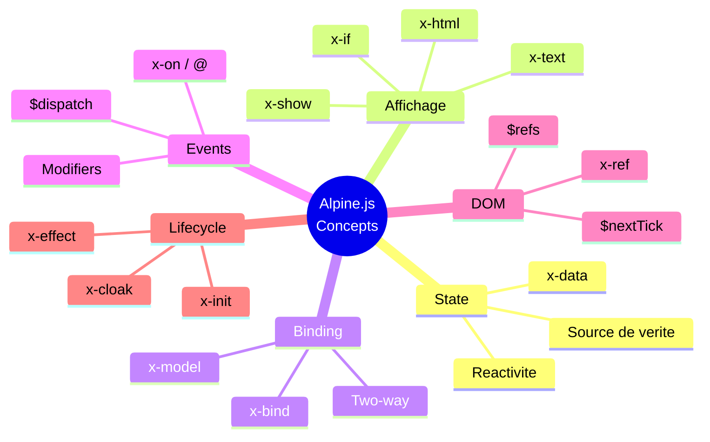
```mermaid
mindmap
    root((Alpine.js<br/>Concepts))
        State
            x-data
            Reactivite
            Source de verite
        Affichage
            x-text
            x-html
            x-show
            x-if
        Binding
            x-model
            x-bind
            Two-way
        Events
            x-on / @
            Modifiers
            $dispatch
        DOM
            x-ref
            $refs
            $nextTick
        Lifecycle
            x-init
            x-cloak
            x-effect
```

---

## Chapitre 2 - Etat et Affichage

### Diagramme 2.1 - Flux de donnees reactif

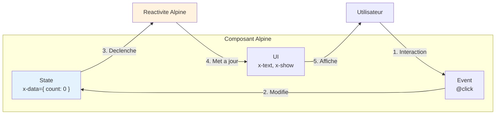
```mermaid
flowchart LR
    subgraph COMPOSANT["Composant Alpine"]
        STATE["State<br/>x-data={ count: 0 }"]
        UI["UI<br/>x-text, x-show"]
        EVENT["Event<br/>@click"]
    end
    
    USER["Utilisateur"] --> |"1. Interaction"| EVENT
    EVENT --> |"2. Modifie"| STATE
    STATE --> |"3. Declenche"| REACTIVITY["Reactivite Alpine"]
    REACTIVITY --> |"4. Met a jour"| UI
    UI --> |"5. Affiche"| USER
    
    style STATE fill:#e3f2fd
    style REACTIVITY fill:#fff3e0
```

### Diagramme 2.2 - x-show vs x-if

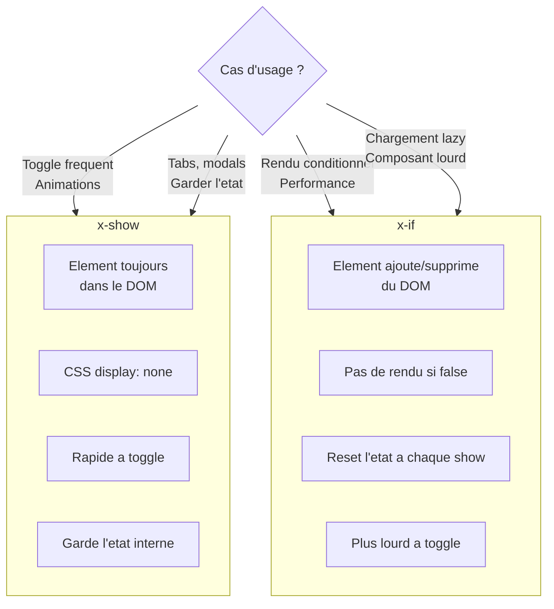
```mermaid
flowchart TB
    subgraph XSHOW["x-show"]
        XS1["Element toujours<br/>dans le DOM"]
        XS2["CSS display: none"]
        XS3["Rapide a toggle"]
        XS4["Garde l'etat interne"]
    end
    
    subgraph XIF["x-if"]
        XI1["Element ajoute/supprime<br/>du DOM"]
        XI2["Pas de rendu si false"]
        XI3["Reset l'etat a chaque show"]
        XI4["Plus lourd a toggle"]
    end
    
    DECISION{"Cas d'usage ?"}
    
    DECISION --> |"Toggle frequent<br/>Animations"| XSHOW
    DECISION --> |"Rendu conditionnel<br/>Performance"| XIF
    DECISION --> |"Tabs, modals<br/>Garder l'etat"| XSHOW
    DECISION --> |"Chargement lazy<br/>Composant lourd"| XIF
```

---

## Chapitre 3 - Binding et Formulaires

### Diagramme 3.1 - x-model Two-Way Binding

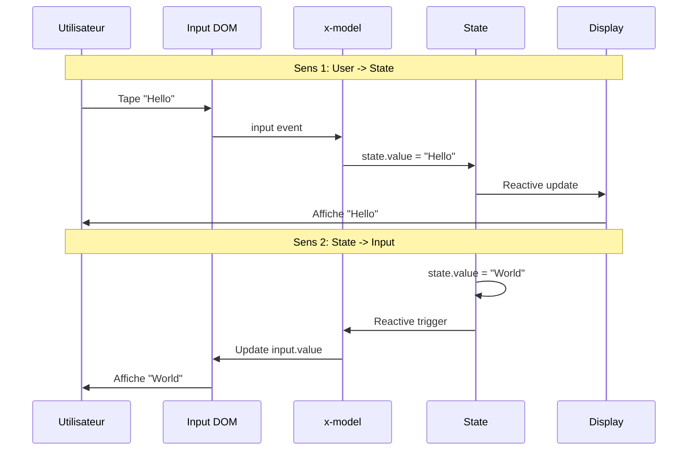
```mermaid
sequenceDiagram
    participant U as Utilisateur
    participant I as Input DOM
    participant M as x-model
    participant S as State
    participant D as Display
    
    Note over U,D: Sens 1: User -> State
    U->>I: Tape "Hello"
    I->>M: input event
    M->>S: state.value = "Hello"
    S->>D: Reactive update
    D->>U: Affiche "Hello"
    
    Note over U,D: Sens 2: State -> Input
    S->>S: state.value = "World"
    S->>M: Reactive trigger
    M->>I: Update input.value
    I->>U: Affiche "World"
```

### Diagramme 3.2 - Architecture d'un formulaire controle

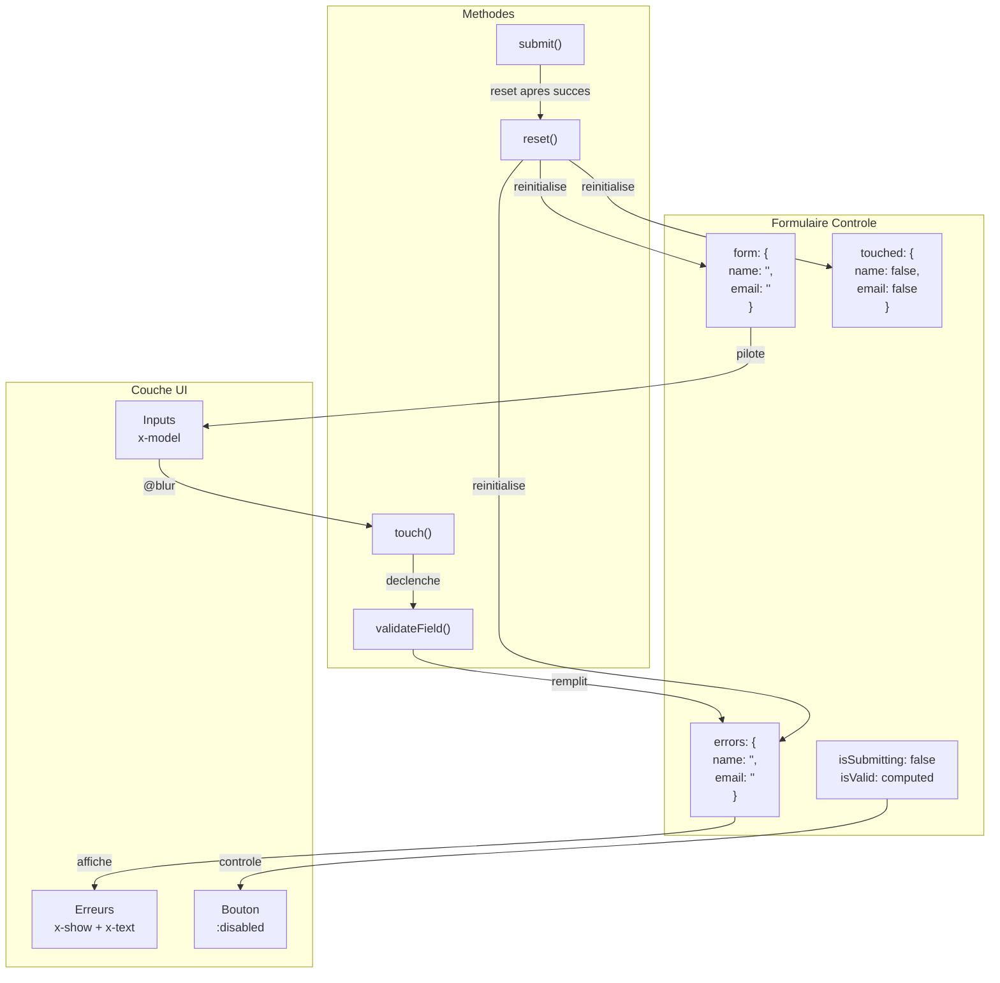
```mermaid
flowchart TB
    subgraph FORM["Formulaire Controle"]
        STATE["form: {<br/>  name: '',<br/>  email: ''<br/>}"]
        ERRORS["errors: {<br/>  name: '',<br/>  email: ''<br/>}"]
        TOUCHED["touched: {<br/>  name: false,<br/>  email: false<br/>}"]
        FLAGS["isSubmitting: false<br/>isValid: computed"]
    end
    
    subgraph METHODS["Methodes"]
        VALIDATE["validateField()"]
        TOUCH["touch()"]
        SUBMIT["submit()"]
        RESET["reset()"]
    end
    
    subgraph UI_LAYER["Couche UI"]
        INPUTS["Inputs<br/>x-model"]
        ERR_DISPLAY["Erreurs<br/>x-show + x-text"]
        BTN["Bouton<br/>:disabled"]
    end
    
    STATE --> |"pilote"| INPUTS
    INPUTS --> |"@blur"| TOUCH
    TOUCH --> |"declenche"| VALIDATE
    VALIDATE --> |"remplit"| ERRORS
    ERRORS --> |"affiche"| ERR_DISPLAY
    FLAGS --> |"controle"| BTN
    SUBMIT --> |"reset apres succes"| RESET
    RESET --> |"reinitialise"| STATE
    RESET --> |"reinitialise"| ERRORS
    RESET --> |"reinitialise"| TOUCHED
```

---

## Chapitre 4 - Evenements avances

### Diagramme 4.1 - Modifiers d'evenements

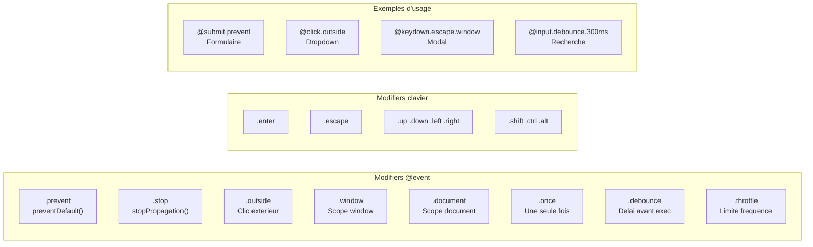
```mermaid
flowchart LR
    subgraph MODIFIERS["Modifiers @event"]
        direction TB
        PREVENT[".prevent<br/>preventDefault()"]
        STOP[".stop<br/>stopPropagation()"]
        OUTSIDE[".outside<br/>Clic exterieur"]
        WINDOW[".window<br/>Scope window"]
        DOCUMENT[".document<br/>Scope document"]
        ONCE[".once<br/>Une seule fois"]
        DEBOUNCE[".debounce<br/>Delai avant exec"]
        THROTTLE[".throttle<br/>Limite frequence"]
    end
    
    subgraph KEYS["Modifiers clavier"]
        ENTER[".enter"]
        ESCAPE[".escape"]
        ARROW[".up .down .left .right"]
        SHIFT[".shift .ctrl .alt"]
    end
    
    subgraph EXEMPLES["Exemples d'usage"]
        E1["@submit.prevent<br/>Formulaire"]
        E2["@click.outside<br/>Dropdown"]
        E3["@keydown.escape.window<br/>Modal"]
        E4["@input.debounce.300ms<br/>Recherche"]
    end
```

### Diagramme 4.2 - Propagation des evenements

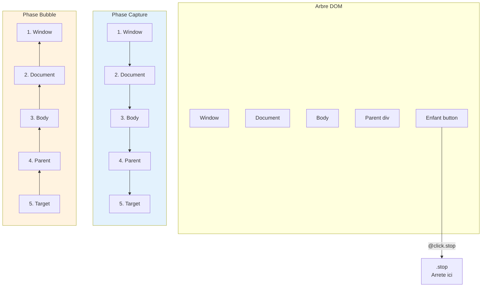
```mermaid
flowchart TB
    subgraph DOM_TREE["Arbre DOM"]
        WINDOW["Window"]
        DOC["Document"]
        BODY["Body"]
        PARENT["Parent div"]
        CHILD["Enfant button"]
    end
    
    subgraph CAPTURE["Phase Capture"]
        direction TB
        C1["1. Window"] --> C2["2. Document"]
        C2 --> C3["3. Body"]
        C3 --> C4["4. Parent"]
        C4 --> C5["5. Target"]
    end
    
    subgraph BUBBLE["Phase Bubble"]
        direction BT
        B1["5. Target"] --> B2["4. Parent"]
        B2 --> B3["3. Body"]
        B3 --> B4["2. Document"]
        B4 --> B5["1. Window"]
    end
    
    STOP_PROP[".stop<br/>Arrete ici"]
    
    CHILD --> |"@click.stop"| STOP_PROP
    
    style CAPTURE fill:#e3f2fd
    style BUBBLE fill:#fff3e0
```

---

## Chapitre 5 - Rendu dynamique

### Diagramme 5.1 - x-for avec :key

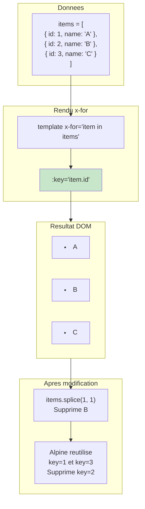
```mermaid
flowchart TB
    subgraph DATA["Donnees"]
        ITEMS["items = [<br/>  { id: 1, name: 'A' },<br/>  { id: 2, name: 'B' },<br/>  { id: 3, name: 'C' }<br/>]"]
    end
    
    subgraph RENDER["Rendu x-for"]
        TEMPLATE["template x-for='item in items'"]
        KEY[":key='item.id'"]
    end
    
    subgraph DOM_RESULT["Resultat DOM"]
        LI1["<li key=1>A</li>"]
        LI2["<li key=2>B</li>"]
        LI3["<li key=3>C</li>"]
    end
    
    subgraph UPDATE["Apres modification"]
        NEW_ITEMS["items.splice(1, 1)<br/>Supprime B"]
        DOM_EFFICIENT["Alpine reutilise<br/>key=1 et key=3<br/>Supprime key=2"]
    end
    
    ITEMS --> TEMPLATE
    TEMPLATE --> KEY
    KEY --> DOM_RESULT
    DOM_RESULT --> NEW_ITEMS
    NEW_ITEMS --> DOM_EFFICIENT
    
    style KEY fill:#c8e6c9
```

### Diagramme 5.2 - Filtrage et tri de listes

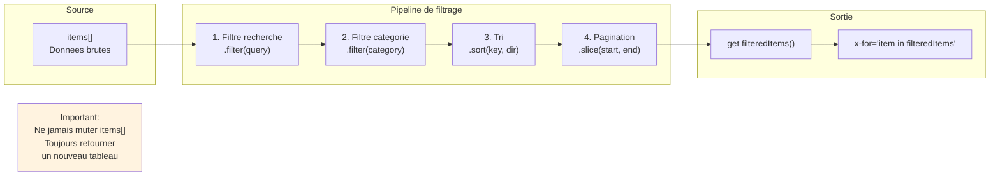
```mermaid
flowchart LR
    subgraph SOURCE["Source"]
        RAW["items[]<br/>Donnees brutes"]
    end
    
    subgraph FILTERS["Pipeline de filtrage"]
        F1["1. Filtre recherche<br/>.filter(query)"]
        F2["2. Filtre categorie<br/>.filter(category)"]
        F3["3. Tri<br/>.sort(key, dir)"]
        F4["4. Pagination<br/>.slice(start, end)"]
    end
    
    subgraph OUTPUT["Sortie"]
        COMPUTED["get filteredItems()"]
        RENDER["x-for='item in filteredItems'"]
    end
    
    RAW --> F1 --> F2 --> F3 --> F4 --> COMPUTED --> RENDER
    
    NOTE["Important:<br/>Ne jamais muter items[]<br/>Toujours retourner<br/>un nouveau tableau"]
    
    style NOTE fill:#fff3e0
```

---

## Chapitre 6 - Reactivite et DOM

### Diagramme 6.1 - $refs et $nextTick

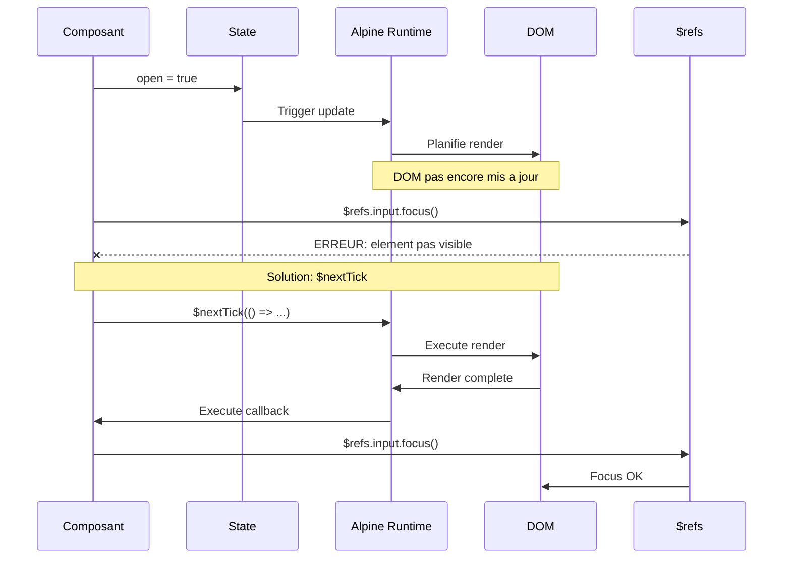
```mermaid
sequenceDiagram
    participant C as Composant
    participant S as State
    participant A as Alpine Runtime
    participant D as DOM
    participant R as $refs
    
    C->>S: open = true
    S->>A: Trigger update
    A->>D: Planifie render
    
    Note over A,D: DOM pas encore mis a jour
    
    C->>R: $refs.input.focus()
    R--xC: ERREUR: element pas visible
    
    Note over C,D: Solution: $nextTick
    
    C->>A: $nextTick(() => ...)
    A->>D: Execute render
    D->>A: Render complete
    A->>C: Execute callback
    C->>R: $refs.input.focus()
    R->>D: Focus OK
```

### Diagramme 6.2 - Cycle de mise a jour reactive

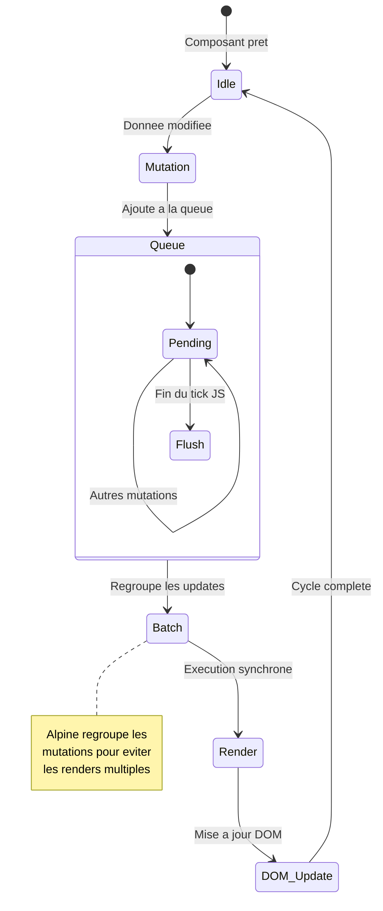
```mermaid
stateDiagram-v2
    [*] --> Idle: Composant pret
    
    Idle --> Mutation: Donnee modifiee
    Mutation --> Queue: Ajoute a la queue
    Queue --> Batch: Regroupe les updates
    Batch --> Render: Execution synchrone
    Render --> DOM_Update: Mise a jour DOM
    DOM_Update --> Idle: Cycle complete
    
    state Queue {
        [*] --> Pending
        Pending --> Pending: Autres mutations
        Pending --> Flush: Fin du tick JS
    }
    
    note right of Batch
        Alpine regroupe les
        mutations pour eviter
        les renders multiples
    end note
```

---

## Chapitre 7 - Transitions

### Diagramme 7.1 - Classes de transition

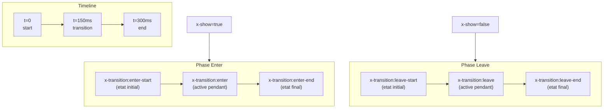
```mermaid
flowchart TB
    subgraph ENTER["Phase Enter"]
        E_FROM["x-transition:enter-start<br/>(etat initial)"]
        E_ACTIVE["x-transition:enter<br/>(active pendant)"]
        E_TO["x-transition:enter-end<br/>(etat final)"]
        
        E_FROM --> E_ACTIVE --> E_TO
    end
    
    subgraph LEAVE["Phase Leave"]
        L_FROM["x-transition:leave-start<br/>(etat initial)"]
        L_ACTIVE["x-transition:leave<br/>(active pendant)"]
        L_TO["x-transition:leave-end<br/>(etat final)"]
        
        L_FROM --> L_ACTIVE --> L_TO
    end
    
    subgraph TIMELINE["Timeline"]
        T1["t=0<br/>start"] --> T2["t=150ms<br/>transition"] --> T3["t=300ms<br/>end"]
    end
    
    SHOW["x-show=true"] --> ENTER
    HIDE["x-show=false"] --> LEAVE
```

### Diagramme 7.2 - Modifiers de transition

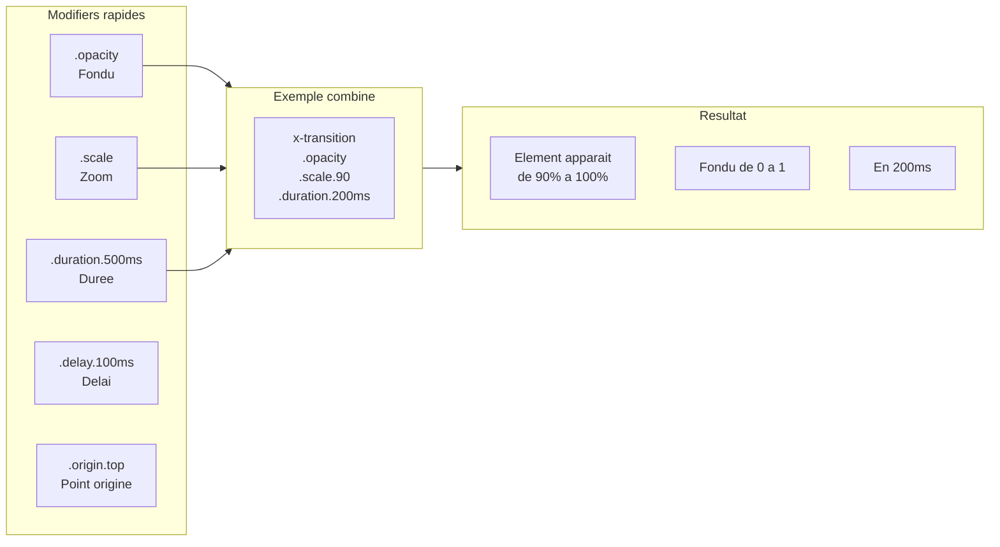
```mermaid
flowchart LR
    subgraph MODIFIERS["Modifiers rapides"]
        M1[".opacity<br/>Fondu"]
        M2[".scale<br/>Zoom"]
        M3[".duration.500ms<br/>Duree"]
        M4[".delay.100ms<br/>Delai"]
        M5[".origin.top<br/>Point origine"]
    end
    
    subgraph EXEMPLE["Exemple combine"]
        EX["x-transition<br/>.opacity<br/>.scale.90<br/>.duration.200ms"]
    end
    
    subgraph RESULT["Resultat"]
        R1["Element apparait<br/>de 90% a 100%"]
        R2["Fondu de 0 a 1"]
        R3["En 200ms"]
    end
    
    M1 & M2 & M3 --> EXEMPLE --> RESULT
```

---

## Chapitre 8 - Communication inter-composants

### Diagramme 8.1 - Pattern $dispatch

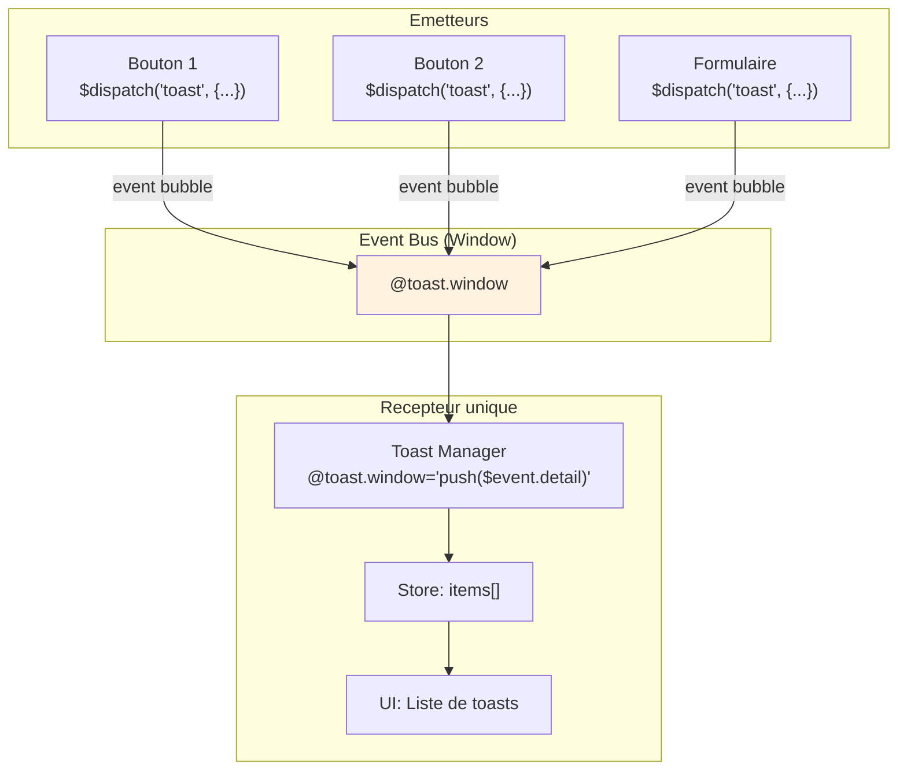
```mermaid
flowchart TB
    subgraph EMITTERS["Emetteurs"]
        BTN1["Bouton 1<br/>$dispatch('toast', {...})"]
        BTN2["Bouton 2<br/>$dispatch('toast', {...})"]
        FORM["Formulaire<br/>$dispatch('toast', {...})"]
    end
    
    subgraph EVENT_BUS["Event Bus (Window)"]
        WINDOW["@toast.window"]
    end
    
    subgraph RECEIVER["Recepteur unique"]
        TOAST_MGR["Toast Manager<br/>@toast.window='push($event.detail)'"]
        STORE["Store: items[]"]
        UI["UI: Liste de toasts"]
    end
    
    BTN1 --> |"event bubble"| WINDOW
    BTN2 --> |"event bubble"| WINDOW
    FORM --> |"event bubble"| WINDOW
    WINDOW --> TOAST_MGR
    TOAST_MGR --> STORE --> UI
    
    style WINDOW fill:#fff3e0
```

### Diagramme 8.2 - Patterns de communication

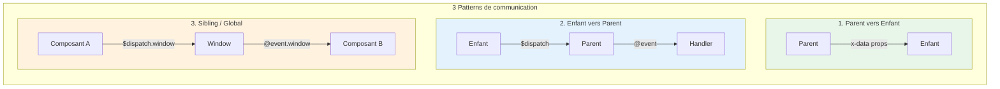
```mermaid
flowchart TB
    subgraph PATTERNS["3 Patterns de communication"]
        direction TB
        
        subgraph P1["1. Parent vers Enfant"]
            PARENT1["Parent"] --> |"x-data props"| CHILD1["Enfant"]
        end
        
        subgraph P2["2. Enfant vers Parent"]
            CHILD2["Enfant"] --> |"$dispatch"| PARENT2["Parent"]
            PARENT2 --> |"@event"| LISTENER["Handler"]
        end
        
        subgraph P3["3. Sibling / Global"]
            COMP_A["Composant A"] --> |"$dispatch.window"| GLOBAL["Window"]
            GLOBAL --> |"@event.window"| COMP_B["Composant B"]
        end
    end
    
    style P1 fill:#e8f5e9
    style P2 fill:#e3f2fd
    style P3 fill:#fff3e0
```

---

## Chapitre 9 - Stores et architecture

### Diagramme 9.1 - Architecture Store global

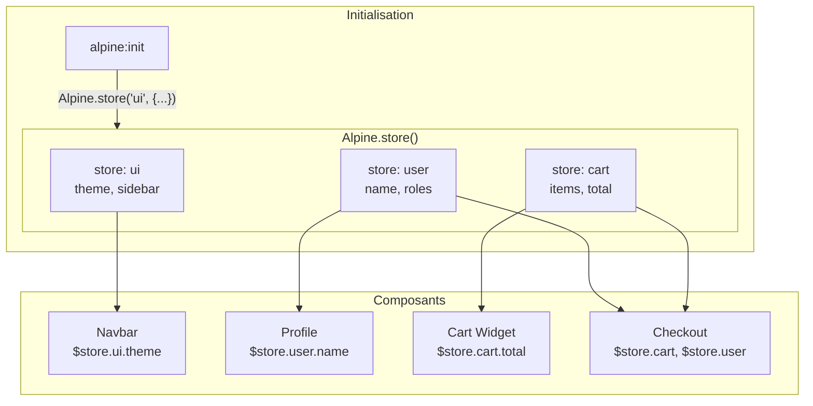
```mermaid
flowchart TB
    subgraph STORES["Alpine.store()"]
        STORE_UI["store: ui<br/>theme, sidebar"]
        STORE_USER["store: user<br/>name, roles"]
        STORE_CART["store: cart<br/>items, total"]
    end
    
    subgraph COMPONENTS["Composants"]
        NAVBAR["Navbar<br/>$store.ui.theme"]
        PROFILE["Profile<br/>$store.user.name"]
        CART_WIDGET["Cart Widget<br/>$store.cart.total"]
        CHECKOUT["Checkout<br/>$store.cart, $store.user"]
    end
    
    STORE_UI --> NAVBAR
    STORE_USER --> PROFILE
    STORE_USER --> CHECKOUT
    STORE_CART --> CART_WIDGET
    STORE_CART --> CHECKOUT
    
    subgraph INIT["Initialisation"]
        ALPINE_INIT["alpine:init"]
        ALPINE_INIT --> |"Alpine.store('ui', {...})"| STORES
    end
```

### Diagramme 9.2 - Store vs x-data local

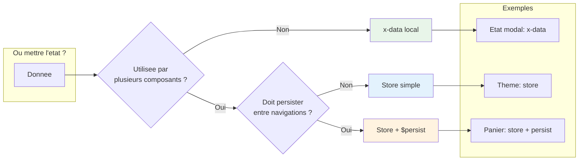
```mermaid
flowchart LR
    subgraph QUESTION["Ou mettre l'etat ?"]
        Q["Donnee"]
    end
    
    Q --> D1{"Utilisee par<br/>plusieurs composants ?"}
    
    D1 --> |Oui| D2{"Doit persister<br/>entre navigations ?"}
    D1 --> |Non| LOCAL["x-data local"]
    
    D2 --> |Oui| STORE_PERSIST["Store + $persist"]
    D2 --> |Non| STORE_SIMPLE["Store simple"]
    
    subgraph EXEMPLES["Exemples"]
        E_LOCAL["Etat modal: x-data"]
        E_STORE["Theme: store"]
        E_PERSIST["Panier: store + persist"]
    end
    
    LOCAL --> E_LOCAL
    STORE_SIMPLE --> E_STORE
    STORE_PERSIST --> E_PERSIST
    
    style LOCAL fill:#e8f5e9
    style STORE_SIMPLE fill:#e3f2fd
    style STORE_PERSIST fill:#fff3e0
```

---

## Chapitre 10 - Persistance

### Diagramme 10.1 - $persist avec localStorage

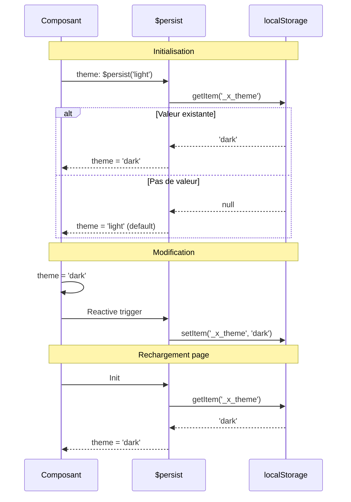
```mermaid
sequenceDiagram
    participant C as Composant
    participant P as $persist
    participant LS as localStorage
    
    Note over C,LS: Initialisation
    C->>P: theme: $persist('light')
    P->>LS: getItem('_x_theme')
    
    alt Valeur existante
        LS-->>P: 'dark'
        P-->>C: theme = 'dark'
    else Pas de valeur
        LS-->>P: null
        P-->>C: theme = 'light' (default)
    end
    
    Note over C,LS: Modification
    C->>C: theme = 'dark'
    C->>P: Reactive trigger
    P->>LS: setItem('_x_theme', 'dark')
    
    Note over C,LS: Rechargement page
    C->>P: Init
    P->>LS: getItem('_x_theme')
    LS-->>P: 'dark'
    P-->>C: theme = 'dark'
```

### Diagramme 10.2 - Securite localStorage

```mermaid
flowchart TB
    subgraph SAFE["A persister (OK)"]
        S1["Preferences UI<br/>theme, sidebar"]
        S2["Etat navigation<br/>dernier onglet"]
        S3["Panier e-commerce<br/>produits temporaires"]
        S4["Filtres de recherche"]
    end
    
    subgraph DANGER["NE JAMAIS persister"]
        D1["Tokens d'authentification<br/>JWT, session"]
        D2["Donnees sensibles<br/>cartes, passwords"]
        D3["Donnees personnelles<br/>email, adresse"]
        D4["Secrets API<br/>cles, credentials"]
    end
    
    subgraph ATTACK["Risque: XSS"]
        XSS["Attaquant injecte<br/>du JavaScript"]
        XSS --> READ["localStorage.getItem()"]
        READ --> STEAL["Vole les donnees"]
    end
    
    DANGER --> |"accessible via"| ATTACK
    
    style DANGER fill:#ffcdd2
    style ATTACK fill:#ffcdd2
    style SAFE fill:#c8e6c9
```

---

## Chapitre 11 - Plugins officiels

### Diagramme 11.1 - Vue d'ensemble des plugins

```mermaid
flowchart TB
    subgraph PLUGINS["Plugins officiels Alpine.js"]
        PERSIST["Persist<br/>Sauvegarde localStorage"]
        FOCUS["Focus<br/>Trap + gestion focus"]
        INTERSECT["Intersect<br/>Visibility observer"]
        COLLAPSE["Collapse<br/>Animation hauteur"]
        MASK["Mask<br/>Format de saisie"]
        ANCHOR["Anchor<br/>Positionnement"]
        SORT["Sort<br/>Drag & drop"]
    end
    
    subgraph USAGES["Cas d'usage"]
        U_PERSIST["Theme persistant"]
        U_FOCUS["Modal accessible"]
        U_INTERSECT["Lazy load images"]
        U_COLLAPSE["FAQ accordeon"]
        U_MASK["Telephone, date"]
    end
    
    PERSIST --> U_PERSIST
    FOCUS --> U_FOCUS
    INTERSECT --> U_INTERSECT
    COLLAPSE --> U_COLLAPSE
    MASK --> U_MASK
```

### Diagramme 11.2 - Focus plugin et accessibilite

```mermaid
flowchart TB
    subgraph MODAL["Modal accessible"]
        OPEN["Ouvrir modal"]
        TRAP["x-trap='open'"]
        FOCUS_FIRST["Focus premier element"]
        TAB_LOOP["Tab reste dans modal"]
        CLOSE["Fermer modal"]
        RESTORE["Restore focus initial"]
    end
    
    OPEN --> TRAP
    TRAP --> FOCUS_FIRST
    FOCUS_FIRST --> TAB_LOOP
    TAB_LOOP --> |"loop"| TAB_LOOP
    TAB_LOOP --> |"Escape"| CLOSE
    CLOSE --> RESTORE
    
    subgraph A11Y["Checklist accessibilite"]
        A1["Focus trap actif"]
        A2["Focus visible"]
        A3["Escape ferme"]
        A4["Focus restaure"]
        A5["aria-hidden sur fond"]
    end
```

---

## Chapitre 12 - Production Ready

### Diagramme 12.1 - Architecture projet Vite + Alpine

```mermaid
flowchart TB
    subgraph PROJECT["Structure projet"]
        ROOT["/projet"]
        SRC["src/"]
        COMP["components/"]
        STORES["stores/"]
        MAIN["main.js"]
        INDEX["index.html"]
        VITE["vite.config.js"]
        TAILWIND["tailwind.config.js"]
    end
    
    ROOT --> SRC
    ROOT --> INDEX
    ROOT --> VITE
    ROOT --> TAILWIND
    SRC --> COMP
    SRC --> STORES
    SRC --> MAIN
    
    subgraph MAIN_JS["main.js"]
        IMPORT_ALPINE["import Alpine"]
        IMPORT_PLUGINS["import Plugins"]
        IMPORT_COMP["import Components"]
        IMPORT_STORES["import Stores"]
        REGISTER["Alpine.data() / Alpine.store()"]
        START["Alpine.start()"]
    end
    
    IMPORT_ALPINE --> IMPORT_PLUGINS
    IMPORT_PLUGINS --> IMPORT_COMP
    IMPORT_COMP --> IMPORT_STORES
    IMPORT_STORES --> REGISTER
    REGISTER --> START
```

### Diagramme 12.2 - Pipeline de build

```mermaid
flowchart LR
    subgraph DEV["Developpement"]
        SRC_FILES["Sources<br/>JS, CSS, HTML"]
        VITE_DEV["Vite dev server<br/>HMR"]
        BROWSER["Navigateur<br/>localhost:5173"]
    end
    
    subgraph BUILD["Build production"]
        VITE_BUILD["vite build"]
        BUNDLE["Bundle optimise"]
        MINIFY["Minification"]
        HASH["Hash fichiers"]
        DIST["dist/"]
    end
    
    subgraph DEPLOY["Deploiement"]
        CDN["CDN / Hosting"]
        USERS["Utilisateurs"]
    end
    
    SRC_FILES --> VITE_DEV --> BROWSER
    SRC_FILES --> VITE_BUILD --> BUNDLE --> MINIFY --> HASH --> DIST
    DIST --> CDN --> USERS
```

### Diagramme 12.3 - Checklist production

```mermaid
flowchart TB
    subgraph CHECKLIST["Checklist avant production"]
        direction TB
        
        subgraph PERF["Performance"]
            P1["Bundle < 50kb"]
            P2["Lazy load plugins"]
            P3[":key sur les listes"]
            P4["Debounce recherche"]
        end
        
        subgraph A11Y["Accessibilite"]
            A1["Focus visible"]
            A2["aria-* coherents"]
            A3["Navigation clavier"]
            A4["Contraste suffisant"]
        end
        
        subgraph SEC["Securite"]
            S1["Pas de x-html user"]
            S2["Pas de token localStorage"]
            S3["CSP headers"]
            S4["Sanitize inputs"]
        end
        
        subgraph QUALITY["Qualite"]
            Q1["Code splitte en modules"]
            Q2["Naming coherent"]
            Q3["Pas de console.log"]
            Q4["Gestion erreurs"]
        end
    end
```

---

## Ateliers - Diagrammes specifiques

### Atelier Todo - Machine a etats

```mermaid
stateDiagram-v2
    [*] --> Empty: Init
    
    Empty --> HasItems: Ajouter todo
    HasItems --> Empty: Supprimer tout
    
    state HasItems {
        [*] --> Viewing
        Viewing --> Filtering: Appliquer filtre
        Filtering --> Viewing: Reset filtre
        
        Viewing --> Editing: Double-click
        Editing --> Viewing: Save/Cancel
    }
    
    state "Filtres" as Filters {
        All
        Active
        Completed
    }
```

### Atelier Modal - Flux d'interaction

```mermaid
sequenceDiagram
    participant U as Utilisateur
    participant B as Bouton trigger
    participant M as Modal
    participant T as Trap focus
    participant F as Form/Content
    
    U->>B: Click "Ouvrir"
    B->>M: open = true
    M->>T: x-trap active
    T->>F: Focus premier element
    
    loop Navigation
        U->>F: Tab
        F->>T: Verif dans modal
        T->>F: Focus suivant
    end
    
    alt Confirmer
        U->>F: Click "Confirmer"
        F->>M: $dispatch('confirm')
        M->>M: open = false
    else Annuler
        U->>F: Click "Annuler" / Escape
        F->>M: close()
        M->>M: open = false
    end
    
    M->>B: Restore focus
```

---

## Notes d'integration

Pour integrer ces diagrammes dans vos fichiers markdown :

1. Copiez le bloc \`\`\`mermaid ... \`\`\` dans votre fichier
2. La plupart des viewers markdown (GitHub, Obsidian, VSCode) rendront automatiquement
3. Pour les exports PDF, utilisez un outil compatible comme Mermaid CLI ou Obsidian

---

*Templates crees par Claude (Anthropic) - Prets a l'integration*
