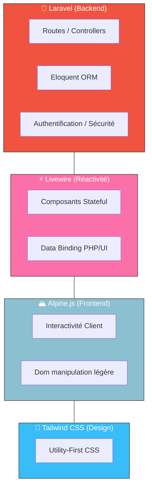

# Frameworks & Librairies

!!! quote "L'art de l'abstraction"
    "Le but d'un framework n'est pas de vous dicter comment coder, mais de vous libérer des tâches répétitives pour vous permettre de vous concentrer sur ce qui compte vraiment : votre logique métier et l'expérience de vos utilisateurs." — Taylor Otwell, Créateur de Laravel.

Bienvenue dans le cœur battant du développement moderne. Dans cette section, nous explorons les outils qui transforment le code brut en applications professionnelles. Nous nous concentrons sur la **Stack TALL**, un écosystème cohérent et puissant qui domine le monde PHP actuel.

Cette formation est divisée en trois piliers complémentaires :
1.  **Laravel** : Le moteur backend, gérant la sécurité, la base de données et l'architecture MVC.
2.  **Livewire** : Le pont réactif, permettant de créer des interfaces dynamiques en restant en PHP.
3.  **Alpine.js** : La touche d'interactivité légère, gérant le comportement côté client sans la lourdeur des SPAs.

 

---

## Prérequis

!!! warning "Socle de connaissances requis"
    Avant d'aborder les frameworks, vous devez avoir validé les bases du développement web :
    - **PHP Fondamental** : Classes, namespaces, typage et programmation orientée objet.
    - **Algorithmique** : Structures de contrôle, boucles et manipulation de données.
    - **HTML/CSS** : Structure sémantique et bases du design (Tailwind CSS est un plus).
    - **Bases de Données** : Concepts de tables, relations (1:n, n:n) et requêtes SQL.

**Environnement de développement :**

| Outil | Version | Rôle |
|---|---|---|
| **PHP** | 8.2+ | Moteur d'exécution backend |
| **Composer** | 2.x | Gestionnaire de dépendances PHP |
| **Node / NPM** | 18+ | Gestion des dépendances frontend et compilation |
| **SQLite / MariaDB** | - | Systèmes de gestion de base de données |

 

---

## La Stack TALL : Un Écosystème Unifié

La force de notre approche réside dans l'intégration de ces quatre technologies (Tailwind, Alpine, Laravel, Livewire). Elles travaillent ensemble pour offrir une expérience développeur inégalée.

_Le workflow TALL : Laravel gère les données, Livewire assure le lien dynamique, Alpine peaufine l'expérience client et Tailwind sublime le rendu._

 

---

## Les Trois Piliers de la Formation

### 1. Laravel — La Fondation Backend
Le framework PHP le plus populaire au monde. Nous apprenons à construire une architecture MVC solide, à manipuler les données avec Eloquent, et à sécuriser nos applications.

| Module | Focus | Progression |
|---|---|---|
| [**Laravel — Masterclass**](./laravel/index.md) | MVC, Eloquent, Auth & Workflow | 🟢 Débutant → 🔴 Avancé |

### 2. Livewire — La Réactivité Full-Stack
Livewire permet de créer des composants réactifs (recherche temps réel, formulaires dynamiques, modales) sans écrire de Javascript complexe. Tout se passe en PHP, avec la réactivité d'une SPA.

| Module | Focus | Progression |
|---|---|---|
| [**Livewire — Full-Stack**](./livewire/index.md) | Événements, Data Binding, Real-time | 🟡 Intermédiaire → 🔴 Expert |

### 3. Alpine.js — L'Interactivité Légère
Alpine.js est le "chaînon manquant". Il remplace avantageusement jQuery et complète Livewire pour toutes les micro-interactions qui ne nécessitent pas de retour serveur.

| Module | Focus | Progression |
|---|---|---|
| [**Alpine.js — Minimalisme**](./alpine/01-introduction.md) | x-data, x-init, x-show, transitions | 🟢 Débutant → 🟡 Intermédiaire |

 

---

## Table des Matières Détaillée

### 🏗️ Laravel (43 Leçons)
- **Fondations** : Installation, structure, Artisan, cycle de vie.
- **Routing & Controllers** : Routes HTTP, Route Model Binding, Validation.
- **Eloquent ORM** : Migrations, Relations (1:n, n:n), Scopes, Factories.
- **Sécurité** : Authentification custom, Breeze, Gate/Policies, RBAC.
- **Architecture** : Workflow éditorial, State Machine, Service Pattern.

### ⚡ Livewire (16 Modules)
- **Basics** : Propriétés, Actions, Data Binding.
- **Lifecycle** : Hooks, Événements, Validation temps réel.
- **Advanced** : File Uploads, Pagination, WebSockets, Testing.
- **Production** : Optimisation N+1, Sécurité, Composants réutilisables.

### 🏔️ Alpine.js (5 Chapitres)
- **Philosophie** : Approche HTML-first et minimalisme.
- **Directives** : Manipulation du DOM et gestion d'état locale.
- **Écosystème** : Intégration avec Livewire (`@entangle`) et plugins.

 

---

## Vers la Maîtrise Full-Stack

Cette section n'est pas qu'une suite de cours techniques ; c'est un parcours conçu pour vous rendre autonome dans la création de produits web complets. En maîtrisant ces outils, vous devenez un développeur capable de concevoir, développer et déployer des solutions complexes avec une efficacité maximale.

> Commencez par la [Masterclass Laravel](./laravel/index.md) pour poser vos fondations.