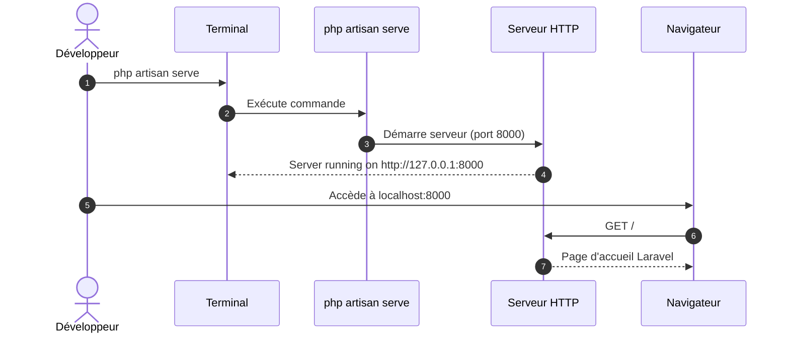

# I - Fondations Laravel & Installation

<div
  class="omny-meta"
  data-level="🟢 Débutant"
  data-version="1.0"
  data-time="2 Heures">
</div>

## Introduction au module

!!! quote "Analogie pédagogique"
    _Imaginez que vous apprenez à piloter un avion. Avant de décoller, vous devez comprendre le **tableau de bord** : à quoi sert chaque instrument, comment l'avion réagit aux commandes, où se trouvent les systèmes critiques. Laravel, c'est pareil : avant d'écrire du code métier, vous devez comprendre **comment le framework est organisé**, **comment il traite une requête**, et **quels outils vous avez à disposition**._

Ce premier module établit les **fondations indispensables** pour tout développeur Laravel. Vous allez installer votre environnement de développement, comprendre l'architecture du framework, explorer la structure d'un projet, et maîtriser les outils en ligne de commande (Artisan) qui accélèrent votre productivité.

**Objectifs pédagogiques du module :**

- [x] Installer PHP 8.5, Composer, et Laravel via php.new
- [x] Comprendre l'architecture MVC[^1] de Laravel
- [x] Maîtriser la structure de dossiers d'un projet Laravel
- [x] Visualiser le cycle de vie d'une requête HTTP
- [x] Utiliser Artisan CLI pour générer des composants

<br>

---

## 1. Installation de l'environnement

### 1.1 Pourquoi php.new ?

**php.new** est un environnement de développement PHP en ligne créé par Laravel/Taylor Otwell. Il fournit instantanément :

- PHP 8.5 (dernière version stable)
- Composer (gestionnaire de dépendances)
- Laravel CLI pré-installé
- Terminal web fonctionnel
- Éditeur de code intégré

C'est idéal pour **apprendre sans friction** : pas de configuration système complexe, pas de conflits de versions.

!!! info "Alternative locale"
    Si vous préférez travailler en local, installez **Laravel Herd** (macOS/Windows) ou **Laragon** (Windows) ou **Docker avec Laravel Sail**. Mais pour ce guide, nous utiliserons php.new pour la simplicité.

### 1.2 Installation pas à pas

**Étape 1 : Créer un projet Laravel**

Rendez-vous sur [https://php.new](https://php.new) et créez un nouveau projet Laravel, ou en ligne de commande locale :

```bash
# Création d'un nouveau projet Laravel nommé "blog-laravel"
composer create-project laravel/laravel blog-laravel

# Entrer dans le répertoire du projet
cd blog-laravel
```

**Étape 2 : Vérifier l'installation**

```bash
# Afficher la version de Laravel installée
php artisan --version
```

!!! warning "Version Laravel"
    Ce guide utilise **Laravel 11.x** (dernière version à la date de rédaction). Si vous utilisez une version antérieure (10.x, 9.x), certaines conventions peuvent différer légèrement.

**Étape 3 : Lancer le serveur de développement**

```bash
# Démarre le serveur PHP intégré sur le port 8000
php artisan serve
```

Ouvrez votre navigateur et accédez à `http://localhost:8000`. Vous devriez voir la **page d'accueil Laravel** par défaut.



_Le diagramme montre le flux d'exécution lors du lancement du serveur de développement._

<br>

---

## Conclusion

Vous avez configuré votre environnement avec succès, la prochaine étape consistera à comprendre l'arborescence magique de Laravel.

[^1]: **MVC (Model-View-Controller)** : Pattern architectural qui sépare les données (Model), l'interface (View), et la logique de contrôle (Controller).
