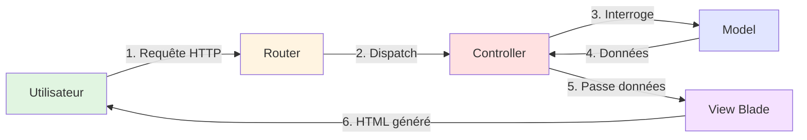

# L'Architecture MVC de Laravel

<div
  class="omny-meta"
  data-level="🟢 Débutant"
  data-version="1.0"
  data-time="2 Heures">
</div>

## 1. Qu'est-ce que MVC ?

**MVC** (Model-View-Controller) est un pattern architectural qui sépare :

1. **Model (Modèle)** : Représente les **données** et la logique métier.
2. **View (Vue)** : Représente l'**interface utilisateur** (HTML).
3. **Controller (Contrôleur)** : Gère la **logique de contrôle** (traite les requêtes, orchestre Model et View).



_Le flux MVC dans Laravel met en exergue le fait que l'utilisateur ne dialogue jamais directement avec la base de données._

<br>

---

## 2. Exemple : Afficher la liste des utilisateurs

### 2.1 Le Routage

Imaginons une route `/users` qui doit afficher tous les utilisateurs.

```php
<?php
// routes/web.php

use App\Http\Controllers\UserController;
use Illuminate\Support\Facades\Route;

// Route GET mappée vers la méthode index
Route::get('/users', [UserController::class, 'index']);
```

### 2.2 Le Controller

Grâce à Artisan (`php artisan make:controller UserController`), nous créons notre contrôleur :

```php title="app/Http/Controllers/UserController.php"
<?php

namespace App\Http\Controllers;

use App\Models\User;
use Illuminate\Http\Request;

class UserController extends Controller
{
    public function index()
    {
        // Interroge le Model User (qui interroge la table 'users')
        $users = User::all();

        // Retourne la vue correspondante (resources/views/users/index.blade.php)
        return view('users.index', [
            'users' => $users
        ]);
    }
}
```

!!! tip "La simplicité de l'ORM"
    La ligne `User::all()` utilise le moteur Eloquent ORM de Laravel pour générer en tâche de fond le `SELECT * FROM users`. Vous n'avez plus jamais à écrire de SQL brut.

### 2.3 La Vue (Blade)

Le contrôleur ayant retourné `'users.index'`, Laravel cherche le fichier `resources/views/users/index.blade.php` :

```html title="resources/views/users/index.blade.php"
<!DOCTYPE html>
<html lang="fr">
<head>
    <title>Liste des utilisateurs</title>
</head>
<body>
    <h1>Utilisateurs</h1>

    @if ($users->isEmpty())
        <p>Aucun utilisateur.</p>
    @else
        <ul>
            @foreach ($users as $user)
                <li>{{ $user->name }} - {{ $user->email }}</li>
            @endforeach
        </ul>
    @endif
</body>
</html>
```

<br>

---

## Conclusion

Le flux complet MVC : **requête → router → controller → model → base de données → vue → réponse**. Vous savez désormais où placer les éléments constitutifs de vos pages. La prochaine étape nous plonge dans le cycle de vie précis d'une requête HTTP.
