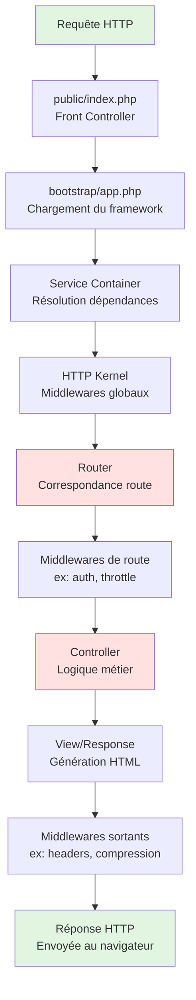

# Cycle de vie et Artisan

<div
  class="omny-meta"
  data-level="🟢 Débutant"
  data-version="1.0"
  data-time="2 Heures">
</div>

## 1. Cycle de vie d'une requête HTTP

Quand un utilisateur accède à une URL Laravel (ex: `http://localhost:8000/users`), c'est toute une machinerie asynchrone qui s'active en fond pour distribuer la requête :



1. **Point d'entrée unique** `public/index.php` : Seul le dossier `public` est accessible de l'extérieur. Toutes les requêtes sont capturées ici.
2. **Bootstrapping** : Laravel éveille le `Service Container` pour gérer l'injection de dépendances.
3. **Middlewares** : Une succession de "Douanes" qui filtrent la requête (Vérifier le CSRF, vérifier si l'utilisateur est banni, etc).
4. **Router & Controller** : L'URL est associée à une Route qui ordonne l'exécution d'un Contrôleur spécifique.
5. **Génération (View)** : La réponse finale (HTML ou JSON) est générée puis expédiée à l'envoyeur et le cycle s'éteint.

<br>

---

## 2. Artisan CLI - Votre meilleur allié

Pour vous aider à manipuler ce cycle, **Artisan** est l'interface en ligne de commande historique de Laravel. Il fournit des dizaines de générateurs pour vous éviter d'écrire des fichiers complexes de série.

```bash
# Lister toutes les commandes disponibles :
php artisan list
```

### 2.1 Les générateurs clés

L'action principale d'Artisan s'articule autour de la création : `make:...`

```bash
# Créer un controller MVC
php artisan make:controller PostController

# Créer un modèle (Table Utilisateur ou Post par exemple)
php artisan make:model Post

# La commande magique (-mcrf) "Le Pack Complet"
php artisan make:model Post -mcrf
```

!!! success "Gagner 2 heures de Setup"
    Le suffixe `-mcrf` indique à Artisan de générer **simultanément** : Le Modèle, la Migration BDD (`-m`), le Controller resource (`-c -r`), et la Factory de données (`-f`). En une commande, vous avez mis en place tout l'échafaudage de votre table Article (Post).

### 2.2 Gestion de la Base de Données

Les fichiers générés par Artisan ne servent à rien si vous ne mettez pas la base de données au courant que vos structures existent.

```bash
# Applique les dernières migrations dans votre BDD (Exécute du SQL)
php artisan migrate

# Annule la dernière migration (En cas de faute de frappe)
php artisan migrate:rollback

# "Nuclear Option" : Vide toute la BDD et la remonte à Zero
php artisan migrate:fresh
```

<br>

---

## Conclusion

Vous comprenez désormais comment l'utilisateur déclenche un cycle de vie, et comment vous, le développeur, utilisez `php artisan` pour intervenir sur ces cycles depuis la console. L'étape suivante concerne la configuration globale.
