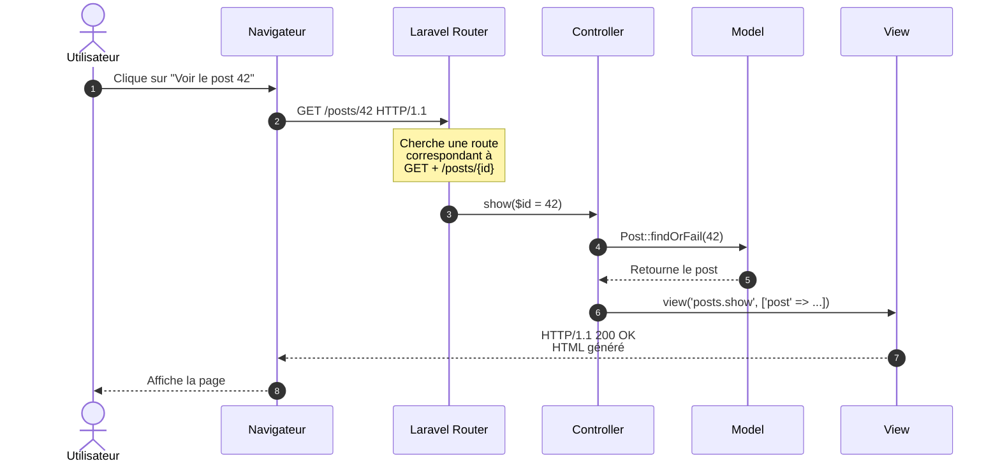

# Routing Laravel & Méthodes HTTP

<div
  class="omny-meta"
  data-level="🟢 Débutant"
  data-version="1.0"
  data-time="2 Heures">
</div>

## Introduction au module

!!! quote "Analogie pédagogique"
    _Imaginez un **standard téléphonique** dans une grande entreprise. Quand quelqu'un appelle, le standardiste (le **Router**) écoute la demande : "Je voudrais parler au service comptabilité". Le standardiste consulte son annuaire (les **routes définies**) et transfère l'appel au bon département (le **Controller**). Le département traite la demande et renvoie une réponse. Le routing Laravel fonctionne exactement ainsi : chaque URL est une "demande", le Router la dirige vers le bon Controller, qui exécute l'action appropriée._

Cette étape permet de plonger dans **le cœur de toute application web** : comment Laravel reçoit une requête HTTP, la route vers le bon endroit, et génère une réponse avant de comprendre comment valider cette requête.

**Objectifs pédagogiques de la section :**

- [x] Comprendre le système de routing Laravel en profondeur
- [x] Maîtriser les différents types de routes (GET, POST, PUT, PATCH, DELETE)
- [x] Comprendre l'anatomie d'une requête HTTP

<br>

---

## 1. Le système de routing : vue d'ensemble

Avant de brancher du code, reprenez en compte le fait qu'une trame est nécessaire.

### 1.1 Anatomie d'une requête HTTP

Avant de router une requête, comprenons ce qu'est une requête HTTP.

**Structure d'une requête HTTP GET :**

```http
GET /posts/42 HTTP/1.1
Host: blog-laravel.local
User-Agent: Mozilla/5.0...
Accept: text/html
Cookie: laravel_session=xyz123...
```

**Éléments clés :**

1. **Méthode HTTP** : `GET` (autres : POST, PUT, PATCH, DELETE, OPTIONS, HEAD).
2. **URI (chemin)** : `/posts/42`.
3. **Headers** : Métadonnées (cookies, type de contenu accepté, etc.).
4. **Body** : Corps de la requête (présent surtout pour POST/PUT).

**Structure d'une réponse HTTP :**

```http
HTTP/1.1 200 OK
Content-Type: text/html; charset=UTF-8
Set-Cookie: laravel_session=abc456...

<!DOCTYPE html>
<html>
...
</html>
```

**Éléments clés :**

1. **Code statut** : `200 OK` (autres : 404 Not Found, 302 Redirect, 500 Server Error).
2. **Headers** : Type de contenu, cookies à définir, etc.
3. **Body** : Le contenu HTML/JSON/etc.



_Le flux complet d'une requête GET : du clic utilisateur à l'affichage de la page._

<br>

---

## 2. Définir des routes : méthodes HTTP

### 2.1 Les méthodes HTTP essentielles

HTTP définit plusieurs **verbes** (méthodes) pour indiquer l'intention de la requête :

| Méthode | Usage RESTful | Idempotent[^1] ? | Exemple |
|---------|---------------|------------------|---------|
| **GET** | Lire une ressource | ✅ Oui | Afficher un article |
| **POST** | Créer une ressource | ❌ Non | Créer un nouvel article |
| **PUT** | Remplacer entièrement une ressource | ✅ Oui | Remplacer un article |
| **PATCH** | Modifier partiellement une ressource | ✅ Oui | Modifier le titre d'un article |
| **DELETE** | Supprimer une ressource | ✅ Oui | Supprimer un article |

**Définir des routes pour chaque méthode dans `routes/web.php` :**

```php
<?php

use Illuminate\Support\Facades\Route;
use App\Http\Controllers\PostController;

// Route GET : afficher la liste des posts
// URL : GET /posts
Route::get('/posts', [PostController::class, 'index']);

// Route GET avec paramètre : afficher un post spécifique
// URL : GET /posts/42
Route::get('/posts/{id}', [PostController::class, 'show']);

// Route GET : afficher le formulaire de création
// URL : GET /posts/create
Route::get('/posts/create', [PostController::class, 'create']);

// Route POST : enregistrer un nouveau post
// URL : POST /posts
Route::post('/posts', [PostController::class, 'store']);

// Route GET : afficher le formulaire d'édition
// URL : GET /posts/42/edit
Route::get('/posts/{id}/edit', [PostController::class, 'edit']);

// Route PUT : mettre à jour un post
// URL : PUT /posts/42
Route::put('/posts/{id}', [PostController::class, 'update']);

// Route DELETE : supprimer un post
// URL : DELETE /posts/42
Route::delete('/posts/{id}', [PostController::class, 'destroy']);
```

**Explication détaillée :**

1. **`Route::get('/posts', ...)`** : Déclare une route qui répond uniquement aux requêtes GET sur `/posts`
2. **`[PostController::class, 'index']`** : Appelle la méthode `index()` du `PostController`
3. **`{id}`** : Paramètre de route (variable) capturé et passé à la méthode du controller

**Ordre des routes : pourquoi c'est critique**

```php
// ❌ MAUVAIS : /posts/create sera capturé par /posts/{id}
Route::get('/posts/{id}', [PostController::class, 'show']);
Route::get('/posts/create', [PostController::class, 'create']);

// ✅ BON : les routes spécifiques AVANT les routes génériques
Route::get('/posts/create', [PostController::class, 'create']);
Route::get('/posts/{id}', [PostController::class, 'show']);
```

**Pourquoi ?**  
Laravel évalue les routes **dans l'ordre de déclaration**. Si `/posts/{id}` est déclaré en premier, une requête vers `/posts/create` sera capturée par cette route (avec `$id = "create"`), et la vraie route `/posts/create` ne sera jamais atteinte.

**Règle d'or :** Routes **spécifiques** (URLs fixes) avant routes **génériques** (avec paramètres).

### 2.2 Routes nommées : pourquoi c'est essentiel

Au lieu de référencer les URLs en dur (`/posts/42`), Laravel permet de **nommer les routes**.

**Définir un nom de route :**

```php
Route::get('/posts/{id}', [PostController::class, 'show'])
    ->name('posts.show');
```

**Utiliser le nom dans le code :**

```php
// Dans un controller : redirection vers la route nommée
return redirect()->route('posts.show', ['id' => 42]);

// Dans une vue Blade : générer l'URL
<a href="{{ route('posts.show', ['id' => $post->id]) }}">
    Voir le post
</a>
```

**Avantages des routes nommées :**

1. **Maintenance simplifiée** : Si vous changez l'URL `/posts/{id}` en `/articles/{id}`, seul le fichier de routes change. Tous les `route('posts.show')` continuent de fonctionner.
2. **Lisibilité** : `route('posts.show', $post)` est plus explicite que `"/posts/{$post->id}"`
3. **Prévention d'erreurs** : Laravel génère une erreur si vous référencez une route inexistante

### 2.3 Raccourci : Route::resource()

Laravel fournit un raccourci pour générer **les 7 routes CRUD** d'un coup :

```php
// Une seule ligne pour générer 7 routes
Route::resource('posts', PostController::class);
```

**Cette ligne génère automatiquement :**

| Verbe | URI | Action | Nom de route |
|-------|-----|--------|--------------|
| GET | `/posts` | index | posts.index |
| GET | `/posts/create` | create | posts.create |
| POST | `/posts` | store | posts.store |
| GET | `/posts/{post}` | show | posts.show |
| GET | `/posts/{post}/edit` | edit | posts.edit |
| PUT/PATCH | `/posts/{post}` | update | posts.update |
| DELETE | `/posts/{post}` | destroy | posts.destroy |

**Limiter les routes générées :**

Si vous ne voulez que certaines routes (ex: lecture seule), utilisez `only()` ou `except()` :

```php
// Seulement index et show (lecture seule)
Route::resource('posts', PostController::class)
    ->only(['index', 'show']);

// Tout sauf destroy (pas de suppression)
Route::resource('posts', PostController::class)
    ->except(['destroy']);
```

[^1]: **Idempotent** : Opération qui produit le même résultat qu'on l'exécute une ou plusieurs fois (ex: DELETE /posts/42 supprime le post, l'exécuter 10 fois ne change rien après la première fois).
