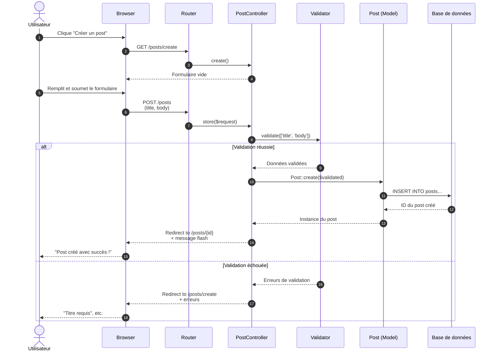

# Les Controllers

<div
  class="omny-meta"
  data-level="🟢 Débutant"
  data-version="1.0"
  data-time="2 Heures">
</div>

## 1. Créer un controller

Il est rare de créer des routes sans y attacher de controller en production. Ce sont les aiguilleurs clés du framework.

**Commande Artisan :**

```bash
# Controller vide (vous ajoutez les méthodes vous-même)
php artisan make:controller PostController

# Controller resource (avec les 7 méthodes CRUD pré-générées)
php artisan make:controller PostController --resource
```

**Structure d'un controller généré :**

```php
<?php

namespace App\Http\Controllers;

use Illuminate\Http\Request;

class PostController extends Controller
{
    /**
     * Affiche la liste de tous les posts.
     * Route associée : GET /posts
     */
    public function index()
    {
        //
    }

    /**
     * Enregistre un nouveau post en base de données.
     * Route associée : POST /posts
     */
    public function store(Request $request)
    {
        //
    }
    
    // ... [show, update, destroy]
}
```

<br>

---

## 2. Bonnes Pratiques d'Architecture

Un bon controller doit agir comme un **coordinateur** et non comme un exécutant.

1. **Être mince** : Déléguer la logique métier complexe vers des Services ou des Actions.
2. **Valider** : Déléguée hors du contrôleur sur des systèmes complexes, ou directement au début (Request validate).
3. **Retourner une réponse** : Son seul but : View, Redirect, ou JSON.

**Anti-pattern à éviter :**

```php
// ❌ MAUVAIS : logique métier dans le controller
public function store(Request $request)
{
    $post = new Post();
    $post->title = $request->input('title');
    $post->body = $request->input('body');
    $post->slug = Str::slug($request->input('title'));
    $post->user_id = auth()->id();
    $post->published_at = now();
    
    if ($request->hasFile('image')) {
        $path = $request->file('image')->store('images', 'public');
        $post->image_path = $path;
    }
    
    $post->save();
    
    // Envoi d'un email
    Mail::to($post->user)->send(new PostPublished($post));
    
    return redirect('/posts');
}
```

**Bonne pratique (Clean Architecture) :**

```php
// ✅ BON : controller délègue la logique
public function store(StorePostRequest $request)
{
    // La validation est déléguée à StorePostRequest
    // La création est déléguée à une Action ou un Service
    $post = CreatePostAction::execute($request->validated());
    
    return redirect()->route('posts.show', $post)
        ->with('success', 'Post créé avec succès.');
}
```

<br>

---

## 3. Implémenter les méthodes CRUD (version simple)

Implémentons maintenant le CRUD complet avec de **vrais exemples fonctionnels**.
Dans cet exemple on assume l'existence d'un Modèle `Post`.

**Controller complet commenté :**

```php
<?php

namespace App\Http\Controllers;

use App\Models\Post; // On importe le modèle Post
use Illuminate\Http\Request;

class PostController extends Controller
{
    public function index()
    {
        // latest() est un raccourci pour orderBy('created_at', 'desc')
        $posts = Post::latest()->get();
        
        return view('posts.index', [
            'posts' => $posts
        ]);
    }

    public function create()
    {
        return view('posts.create');
    }

    public function store(Request $request)
    {
        $validated = $request->validate([
            'title' => 'required|string|max:255',
            'body' => 'required|string|min:10',
        ]);
        
        $validated['user_id'] = 1;
        $post = Post::create($validated);
        
        return redirect()
            ->route('posts.show', $post)
            ->with('success', 'Post créé avec succès !');
    }

    public function show($id)
    {
        // Si le post n'existe pas, Laravel retourne automatiquement une 404
        $post = Post::findOrFail($id);
        
        return view('posts.show', [
            'post' => $post
        ]);
    }

    public function edit($id)
    {
        $post = Post::findOrFail($id);
        
        return view('posts.edit', [
            'post' => $post
        ]);
    }

    public function update(Request $request, $id)
    {
        $post = Post::findOrFail($id);
        
        $validated = $request->validate([
            'title' => 'required|string|max:255',
            'body' => 'required|string|min:10',
        ]);
        
        // Mise à jour du post en BDD
        $post->update($validated);
        
        return redirect()
            ->route('posts.show', $post)
            ->with('success', 'Post mis à jour avec succès !');
    }

    public function destroy($id)
    {
        $post = Post::findOrFail($id);
        $post->delete();
        
        return redirect()
            ->route('posts.index')
            ->with('success', 'Post supprimé avec succès !');
    }
}
```

**Diagramme de séquence : cycle de création d'un post**



<br>

---

## Conclusion

Le flux complet d'un objet (CRUD) a été géré de bout en bout. On identifie rapidement la nécessité de sécuriser les données transmises, d'où la validation serveur abordée dans le module suivant.
