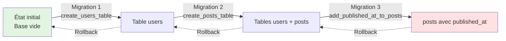

# ORM & Migrations

<div
  class="omny-meta"
  data-level="🟡 Intermédiaire"
  data-version="1.0"
  data-time="2 Heures">
</div>

## Introduction au module

!!! quote "Analogie pédagogique"
    _Imaginez une **bibliothèque municipale**. Les **migrations** sont comme le plan architectural : elles définissent où se trouvent les étagères (tables), combien de livres chaque étagère peut contenir (colonnes), et comment les sections sont reliées (clés étrangères). Les **seeders** sont les bibliothécaires qui testent et remplissent initialement les étagères avec les premiers ouvrages. **Eloquent** est le système de catalogue informatisé : au lieu de chercher physiquement dans les rayons, vous tapez "romans policiers" et le système vous rapporte tous les livres correspondants. Les **relations** sont les références croisées : "Si vous aimez cet auteur, vous aimerez aussi ces autres livres"._

Ce module vise à expliquer comment **structurer notre base de données**, la **manipuler avec Eloquent** (l'ORM de Laravel), et comprendre comment **relier les entités entre elles**.

**Objectifs pédagogiques de cette section :**

- [x] Saisir la différence entre SQL direct et ORM.
- [x] Comprendre le système de migrations (versioning du schéma DB)
- [x] Créer et modifier des tables avec les migrations en CLI

<br>

---

## 1. Pourquoi un ORM ?

### 1.1 Eloquent ORM vs SQL brut : comparaison

Un ORM se place en "bouclier de proxy" pour interroger une base. Vous parlez langage objet (PHP), la base reçoit sa conversion SQL traduite. C'est plus sécuritaire et cela prémunit l'injection d'attaque.

| Opération | SQL brut (PDO) | Eloquent ORM |
|-----------|----------------|--------------|
| **Récupérer tous les posts** | `SELECT * FROM posts` + fetch | `Post::all()` |
| **Créer un post** | `INSERT INTO posts...` + bind | `Post::create([...])` |
| **Mettre à jour** | `UPDATE posts SET ... WHERE id = ?` | `$post->update([...])` |
| **Supprimer** | `DELETE FROM posts WHERE id = ?` | `$post->delete()` |
| **Récupérer avec condition** | `SELECT * WHERE status = ?` | `Post::where('status', 'published')->get()` |
| **Relations** | JOIN manuel + logique de mapping | `$user->posts` |

**Eloquent ne remplace pas SQL** : il l'**abstrait**. 

<br>

---

## 2. Migrations : le versioning de votre base de données

### 2.1 Qu'est-ce qu'une migration ?

Une **migration** est un fichier PHP qui définit des **modifications structurelles** : 
Vous ne créez plus jamais de table sous PHPMyAdmin ou directement en ligne de commande.

- Créer/supprimer des tables
- Ajouter/supprimer/modifier des colonnes
- Créer des index, clés étrangères
- Modifier le type d'une colonne

**Principe clé :** Les migrations sont **versionnées** et **réversibles**.



_Les migrations permettent de faire évoluer le schéma progressivement et de revenir en arrière si nécessaire._

### 2.2 Créer et modifier des tables

La commande d'initialisation artisan gérera le nom du fichier temporel et la base globale du fichier.

```bash
# Convention : create_NOM_PLURIEL_table
php artisan make:migration create_posts_table
```

```php title="database/migrations/xxxx_create_posts_table.php"
<?php

use Illuminate\Database\Migrations\Migration;
use Illuminate\Database\Schema\Blueprint;
use Illuminate\Support\Facades\Schema;

/**
 * Migration de création de la table "posts".
 * 
 * Principe : up() et down() doivent être des **opérations inverses**.
 */
return new class extends Migration
{
    public function up(): void
    {
        Schema::create('posts', function (Blueprint $table) {
            $table->id(); // Colonne id (BIGINT UNSIGNED AUTO_INCREMENT PRIMARY KEY)
            
            // Colonne user_id (clé étrangère vers la table users)
            // unsignedBigInteger() car users.id est un BIGINT UNSIGNED
            $table->foreignId('user_id')
                ->constrained()              // Crée la clé étrangère vers users.id
                ->onDelete('cascade');       // Si le user n°42 est supprimé → ces posts sont auto supprimés
            
            $table->string('title'); // VARCHAR(255) NOT NULL
            $table->string('slug')->unique(); // VARCHAR(255) UNIQUE NOT NULL
            $table->text('body'); // TEXT NOT NULL
            $table->timestamps(); // Colonnes created_at et updated_at (TIMESTAMP)
        });
    }

    public function down(): void
    {
        Schema::dropIfExists('posts');
    }
};
```

### 2.3 Exécuter les migrations

Une fois votre plan architectural posé, il faut le soumettre au système :

```bash
php artisan migrate
```

Que se passe-t-il en coulisse ?
- Laravel lit le dossier `database/migrations/`
- Il consulte la table `migrations` (créée automatiquement par Laravel au dépot du projet) pour savoir quelles migrations ont déjà été exécutées
- Il exécute les méthodes `up()` des migrations manquantes, dans l'ordre chronologique de leur préfixation numérale.
- Si le système n'est plus à jour et fait un problème, il peut être rebroussé de 1 crans avec `php artisan migrate:rollback`

### 2.4 Modifier une table existante (Ajouter une colonne)

**Situation :** Vous avez déjà créé la table `posts`, mais vous voulez rajouter une colonne `published_at`. Modifiez la migration et faites un `migrate:rollback`. Cela va détruire vos posts déja publiés ! Le code ci-dessous doit être utilisé pour ajouter des élements à des colonnes où **la donnée n'est plus test mais en base de production**.

```bash
# Ajouter add_NOM_COLONNE_to_NOM_TABLE_table
php artisan make:migration add_published_at_to_posts_table --table=posts
```

```php
public function up(): void
{
    Schema::table('posts', function (Blueprint $table) {
        // Ajoute une colonne timestamp nullable après la colonne 'body'
        $table->timestamp('published_at')
            ->nullable()
            ->after('body');
    });
}
```

<br>

---

## Conclusion

La base de donnée est isolée grâce à des fichier que l'on manipule en PHP, permettant le stockage des modifications en git versionné. Le prochain chapitre s'attarde sur comment configurer l'envoi de ces données en fonction de votre système d'entreprise (MariaDB, PostgreSQL etc).
