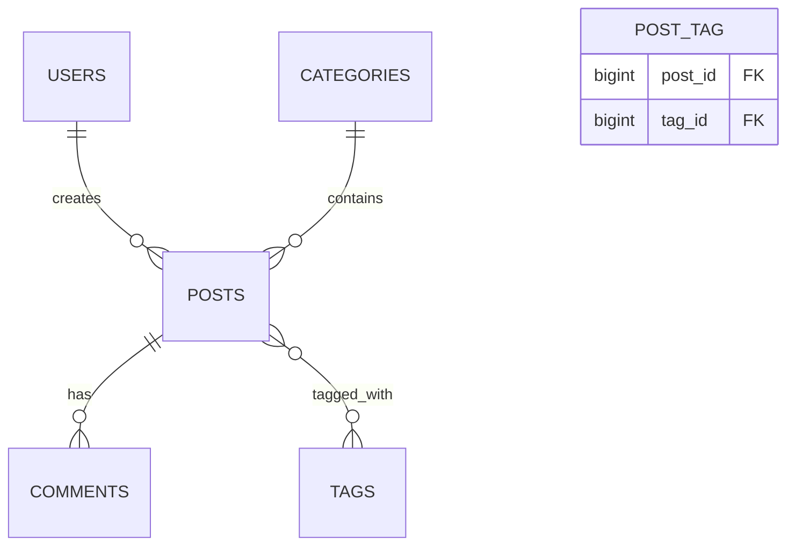

# L'art des Relations

<div
  class="omny-meta"
  data-level="🔴 Avancé"
  data-version="1.0"
  data-time="2.5 Heures">
</div>

## 1. Modéliser notre blog

L'essence même d'une application relationnelle est... les interactions.
Si l'application dispose de la liste suivante : (Users, Posts, Categories, Tags, Comments). Comment réagissent-ils ?

- Un utilisateur **a crée** des articles : (One-to-Many - HasMany).
- Un post **appartient a** une catégorie (One-to-Many ou One-to-One - BelongsTo).
- Un post **est contenu aux** tags (Many-To-Many - BelongsToMany).



<br>

---

## 2. Ecrire les Relations : HasMany VS Belongs

### 2.1 Relation Simple (Auteur -> Articles)

On explique à la classe qu'elle est Parent (Possède Plusieurs - `HasMany`).

```php title="app/Models/User.php"
use Illuminate\Database\Eloquent\Relations\HasMany;

class User extends Authenticatable
{
    /**
     * Un utilisateur possède plusieurs posts.
     * Laravel cherchera systématiquement : user_id dans la table Posts
     */
    public function posts(): HasMany
    {
        return $this->hasMany(Post::class);
    }
}
```

On explique à la classe qu'elle est Enfant (Appartient à - `BelongsTo`).

```php title="app/Models/Post.php"
use Illuminate\Database\Eloquent\Relations\BelongsTo;

class Post extends Model
{
    public function user(): BelongsTo
    {
        return $this->belongsTo(User::class);
    }
}
```

**Visualisation à l'usage dans le back-office web :**

```php
// Je souhaite afficher la liste de tout les articles écrit par l'ID 1
// Le format magique $user->posts agit comme une property dynamiquement généré qui renvoie la requête.
$user = User::find(1);
$user->posts->all();

// Je souhaite savoir qui à écrit l'article 1 (Il ira demander le nom dans la table User de façon native).
$post = Post::find(1);
echo $post->user->name;
```

### 2.2 Table de Croisement Many-to-Many (Tags et Posts)

Pour les mots clefs, un post possède 17 mots clefs, et 1 mots clefs cible 17 articles. Il s'agit d'une table d'association croisée pure. Dans ce cas de figure, l'architecture implique la création d'une Table Pivot (`post_tag` par ordre alphabétique). Eloquent ne perd néanmoins pas son côté pratique, ce sont les deux éléments qui utiliseront le statut **Apartient à des Multiples**.

```php
// Modele POST
public function tags(): BelongsToMany
{
    return $this->belongsToMany(Tag::class);
}

// Modele TAGS
public function posts(): BelongsToMany
{
    return $this->belongsToMany(Post::class);
}
```

**Usage (Table Pivot) :**

La mécanique permet de Synchroniser sur le moment l'entièreté d'un tag avec un tableau simple.

```php
$post = Post::find(1);

// Le système va vider les tags de la table d'association pour ce POST ID et les remplacer par la liste [1,2,3]. Aucun soucis de doublons.
$post->tags()->sync([1, 2, 3]);

// Détacher completement sans remplacer
$post->tags()->detach(5);
```

<br>

---

## 3. L'optimisation : Eager Loading (Le problème N+1)

Vous venez de voir qu'appeler `$post->user->name` fonctionnait par magie. Cette magie a un prix.

```php
// ❌ MAUVAIS CODE : LA BOUCLE N+1
$posts = Post::all(); // Fait 1 requête à la DB. Ex 102 Posts en retour.

foreach ($posts as $post) {
    echo $post->user->name; // Force 1 nouvelle requête individuelle par Post ciblé. 
}
// TOTAL : 103 requêtes d'envoi. La base de donnée s'étouffe et la connexion s'effondre en vue liste d'un blog de 14.000 pages.
```

**Solution vitale (Le Chargement par Anticipation ou `With`)**

Vous devez expliquer au moteur Eloquent de ramener les dépendances User dans ses baggages.

```php
// ✅ BON CODE : 
$posts = Post::with('user')->get(); 

foreach ($posts as $post) {
    echo $post->user->name; 
}
// TOTAL: 2 Requêtes d'envois. Le chargement est quasi-instantané via des clefs d'identifiant en interne.
```

De la même manière, si vous avez des dépendances croisées, listez les. `Post::with(['user', 'category', 'tags'])->get();`

<br>

---

## Conclusion 

Le modèle est maintenant une architecture riche d'objets inter-connectés très facilement via l'Orienté Objet pur sans écriture brutale en code SQL. Le système devient ludique. Ne manque plus qu'à ce système des données à traiter, ce qui nous emmène dans une logique d'hydratation de test par Seeders.

<br>

---

## Conclusion

!!! quote "Ce qu'il faut retenir"
    Les relations Eloquent sont le cœur du modèle de données Laravel. Un `User` qui `hasMany(Post::class)` ou un `Post` qui `belongsTo(User::class)` : ces déclarations semblent simples, mais elles évitent des dizaines de JOINs SQL manuels. La clé de la performance reste le chargement anticipé (`with()`) pour éviter le piège classique du problème N+1.

> [Relations comprises. Peuplez maintenant vos bases de données avec les factories et seeders →](./17-factory-seeder-scopes.md)
