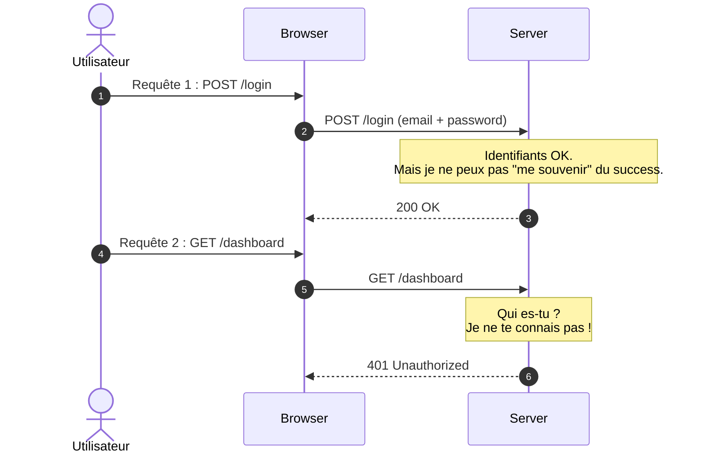

# Fondamentaux de l'authentification

<div
  class="omny-meta"
  data-level="🟡 Intermédiaire"
  data-version="1.0"
  data-time="2 Heures">
</div>

## Introduction au module

!!! quote "Analogie pédagogique"
    _Imaginez un **club privé**. Le videur vérifie votre carte de membre à l'entrée (authentification). Une fois rentré, le videur vous met un  **bracelet** (session). Les serveurs du club ne revérifient pas votre carte, ils regardent juste votre bracelet. Dehors le lendemain, vous devrez reprouver votre identité._

Une application ne connaît pas un visiteur par défaut, et a besoin des mêmes protocoles.

Il n'est d'ordinaire **pas recommandé** de faire ce que vous allez accomplir ici, les coffrets (Breeze / Jetstream) sont audités par des équipes de sécurité pour fournir la plomberie "clés en mains". Le construire à la main de zéro garantit cependant **une maitrise parfaite sur l'infrastructure de Laravel en cas de pépin** ou d'attaque.  

<br>

---

## 1. Fondamentaux : HTTP et sessions

### 1.1 Le problème : HTTP est stateless

**Stateless** signifie "sans état" : chaque requête HTTP est **amnésique et indépendante**.



### 1.2 La solution : les sessions PHP / Cookies HTTP

Une **session** est un mécanisme de substitution d'amnésie.

1. Lors du login, le serveur crée un **identifiant unique volatile** (ex: `abc123def456`)
2. Le serveur stocke cet identifiant (temporairement).
3. Le serveur envoie cet identifiant au navigateur via un **cookie système de fond**
4. Le navigateur renvoie automatiquement ce cookie invisible à chaque requête suivante
5. Le serveur lit le cookie, retrouve la valeur associée, et "se souvient" que ce jeton appartient au visiteur N°42.

> Par défaut, cet identifiant système volatile est stocké en dur par le framework très profondement sous formes de petits fichiers encryptés dans `/storage/framework/sessions/`. 

<br>

---

## 2. Hashing des mots de passe : la base de la sécurité

!!! danger "Règle d'or de la sécurité"
    **JAMAIS, JAMAIS, JAMAIS** stocker un mot de passe en clair en base de données. Si votre base est fuité, les attaquants auront accès aux comptes. Le framework vous punira immédiatement s'il sent votre approche non sécurisée.

### 2.1 Solution : Cryptage unidirectionnel (Hashing)

*   **Bcrypt** (Par défaut sous Laravel).
*   **Argon2id** (Protocole d'Etat cryptographique pour très haut risque, mais lourd).

Un Hash ne remonte son cours.

- Facile : `$2y$10$abc123...` créé à partir du texte 'AlainPassword'.
- **Impossible** : Texte 'AlainPassword' depuis le hash aléatoire `$2y$10$abc...` 

```php
use Illuminate\Support\Facades\Hash; // Façade Magique

// 1. Processus de Création / Enregistrement
$inputTaperSurFormulaireCreation = 'MySecureP@ssw0rd';

// Remplacer par : $2y$12$abcdefghijklmnopqrstuvwxyz0123... (Et donc incraquable en BDD)
$user->password = Hash::make($inputTaperSurFormulaireCreation);


// 2. Processus de Connexion / Authentification future
$passwordUtilisateurConnexion = 'MySecureP@ssw0rd';

// L'application ressort sa moulinette et mixe le mot avec les mêmes variables
// Puis les mets en miroir avec la Base !
if (Hash::check($passwordUtilisateurConnexion, $user->password)) {
    // ✅ Mot de passe correct !
}
```

<br>

---

## Conclusion 

Les mécanismes d'échanges d'identités étant désormais claire pour vous, nous passons à l'application pratique en recréant un système entier d'inscription et de connexion sans utiliser les automatismes natifs du framework.
