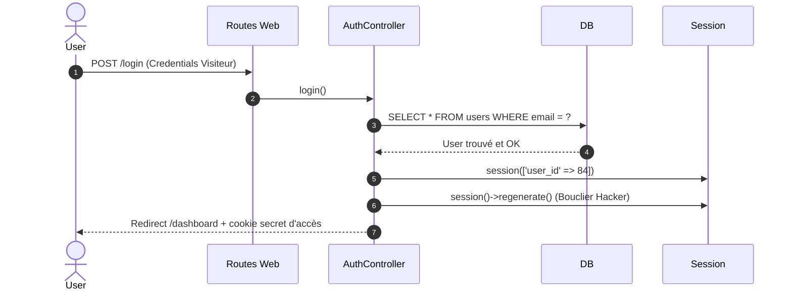

# Inscription et Connexion manuelles

<div
  class="omny-meta"
  data-level="🟡 Intermédiaire"
  data-version="1.0"
  data-time="2 Heures">
</div>

## 1. Flux d'authentification



<br>

---

## 2. Déployer les Routes & les vues

### 2.1. Fichier de Routage dédié
Il est primordial de séparer la sécurité des routes des articles grand publics.

```php title="routes/auth.php"
// Registration
Route::get('/register', [AuthController::class, 'showRegister'])
    ->middleware('guest') // Accessible uniquement si NON connecté
    ->name('register');
Route::post('/register', [AuthController::class, 'register'])
    ->middleware('guest');

// Login
Route::get('/login', [AuthController::class, 'showLogin'])
    ->middleware('guest')
    ->name('login');
Route::post('/login', [AuthController::class, 'login'])
    ->middleware('guest');

// Logout
Route::post('/logout', [AuthController::class, 'logout'])
    ->middleware('auth') // Accessible uniquement si CONNECTE
    ->name('logout');
```

```php title="routes/web.php"
// On branche le custom fichier Web à vos routes principales.
require __DIR__.'/auth.php';
```

### 2.2. Vues dédiées

Les vues ne revêtent rien de particulier par rapport à votre utilisation classique si ce n'est une utilisation intensive de `@error('email')` ou du Helper de rétention de remplissage passé `old('email')`.

L'important est d'envoyer l'information via la macro de sécurisation de protection de formulaire : **`@csrf`**. A partir du moment ou elle est branché, Laravel bloquera l'entrée aux Hackers ou Robots de spam qui tenterait de simuler des fausses connexions en continue sur le formulaire depuis des URLs extérieures.

```html title="resources/views/auth/login.blade.php"
<form method="POST" action="/login">
    @csrf

    <input type="email" name="email" value="{{ old('email') }}" required>
    
    <input type="password" name="password" required>
    @error('password')
        <span>{{ $message }}</span>
    @enderror

    <button type="submit">Se connecter</button>
</form>
```

<br>

---

## 3. Le Controller Maître : AuthController

### 3.1 Gérer l'enregistrement (Registration)

L'inscription réclame un chiffrement au moment de valider la base après vérification stricte.

```php title="app/Http/Controllers/Auth/AuthController.php"
use Illuminate\Validation\Rules\Password;

public function register(Request $request)
{
    // Règle Password::defaults() se base sur un ratio de robustesse défini dans la configuration du site.
    $validated = $request->validate([
        'name' => ['required', 'string', 'max:255'],
        'email' => ['required', 'string', 'email', 'max:255', 'unique:users'],
        'password' => ['required', 'confirmed', Password::defaults()],
    ]);

    // Hasher le mot de passe avant Base
    $validated['password'] = Hash::make($validated['password']);
    
    $user = User::create($validated);

    // Démontrer au module interne que le visiteur de cette ID a le droit de rester (Il est désormais Session Connecté)
    $request->session()->put('user_id', $user->id);

    // Générérer un nouvel identifiant (Bloque les attaques Hackeur sur Fixation de ID public)
    $request->session()->regenerate();

    return redirect()->route('dashboard');
}
```

### 3.2 Gérer les vérifications croisées (Login)

```php
public function login(Request $request)
{
    $credentials = $request->validate([
        'email' => ['required', 'email'],
        'password' => ['required'],
    ]);

    // Rapatrier le modele complet sans vérifier son pass
    $user = User::where('email', $credentials['email'])->first();

    // Verifier le pass recu, en le mixant au pass crypté sur le coup via la façade de sécurité native !
    if (!$user || !Hash::check($credentials['password'], $user->password)) {
        
        // Refoulé ! Ne jamais préciser en cas d'erreur ce qui pêche (L'email ? Le pass ?)
        return back()->withErrors(['email' => 'Identifiants incorrects.']);
    }

    $request->session()->put('user_id', $user->id);
    $request->session()->regenerate();

    return redirect()->intended(route('dashboard'));
}
```

### 3.3. Nettoyer l'état et déloguer

```php
public function logout(Request $request)
{
    $request->session()->forget('user_id'); // Révocation de visite
    $request->session()->invalidate(); // Destruction du conteneur de Session Interne Laravel
    $request->session()->regenerateToken(); // Re-sécurisation du CSRF Bouclier.

    return redirect('/')->with('success', 'Déconnexion réussie.');
}
```

<br>

---

## Conclusion 

L'inscription est maintenant active sur votre projet et vous permets d'utiliser la mécanique d'identifiant et d'authentification manuelle. Vous avez abordé l'utilisation des middlewares `guest` et `auth` dans le routing, mais il va nous falloir les construire correctement au moment de sécuriser les URLs de notre site internet au module suivant !

<br>

---

## Conclusion

!!! quote "Ce qu'il faut retenir"
    L'authentification est le point le plus sensible de toute application web. Laravel fournit une infrastructure éprouvée — hachage bcrypt, protection CSRF, gestion des sessions — mais la responsabilité de l'architecte est de comprendre ce qui se passe derrière chaque façade pour pouvoir auditer, étendre et adapter ces mécanismes aux besoins métier.

> [Authentification maîtrisée. Sécurisez maintenant l'accès aux routes avec les middlewares →](./22-middlewares-auth.md)
