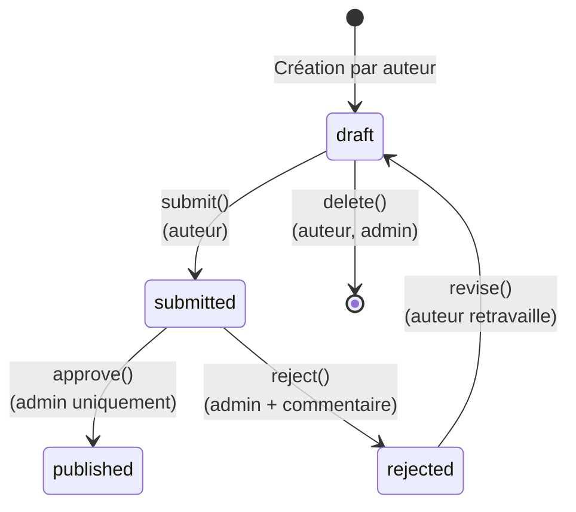

# Machine d'États (Status)

<div
  class="omny-meta"
  data-level="🔴 Avancé"
  data-version="1.0"
  data-time="2 Heures">
</div>

## 1. Réflexion : La Modélisation UML

**Un cycle métier est simple à expliquer par l'analogie :** L'auteur écrit librement (`Brouillon`), l'éditeur le lit (`Soumis`), il l'accepte et l'imprime (`Publié`) ou bien le renvoie à l'auteur pour modification de sa copie (`Rejeté`). Et l'auteur corrige sa copie jusqu'à validation. Pendant ses états de transitions, ni l'auteur, ni l'éditeur ne suppriment le livre en cours de cycle sans concertation !



Votre mission, si vous aviez bien suivit la Masterclass des 5 précédents modules, est d'empecher par Middlewares, par Helpers, par Policies, d'outre passer les cycles de vie de ce Status de manière non voulue (Exemple : l'éditeur qui efface le livre `soumis` sans meme l'avoir lu, alors que la règle dit que le manuscrit appartient à l'auteur.)

<br>

---

## 2. Traduction BDD & Enum

### 2.1 Les constantes d'États

Afin déviter l'anarchie des typages de BDD (un coup on injecte la String "draft", un coup "drafts" avec une faute de frappe, etc.), créez un Enum.

```php title="app/Enums/PostStatus.php"
enum PostStatus: string
{
    case DRAFT = 'draft';
    case SUBMITTED = 'submitted';
    case PUBLISHED = 'published';
    case REJECTED = 'rejected';

    // Badge color pour le Frontend (optionnel)
    public function color(): string
    {
        return match($this) {
            self::DRAFT => 'gray',
            self::SUBMITTED => 'yellow',
            self::PUBLISHED => 'green',
            self::REJECTED => 'red',
        };
    }
}
```

### 2.2 Migrations et Traces Temporelles

Lors du Module 3, la table s'est créée avec la plus grande justesse, mais on avait oublié d'y inclure les colonnes de ce workflow (L'historique des dates ou les notes des rejets de l'administrateur !). Corrigeons ça sans tout casser par une nouvelle migration d'Additions :

`php artisan make:migration add_workflow_columns_to_posts_table --table=posts`

```php
Schema::table('posts', function (Blueprint $table) {
    // Par defaut un post commence donc en Draft sur sa nouvelle colonne
    $table->string('status', 20)->default('draft')->index(); 
    
    // Garder la trace temporelle
    $table->timestamp('submitted_at')->nullable();
    $table->timestamp('published_at')->nullable(); // Déjà créée lors du module 3.
    $table->timestamp('rejected_at')->nullable();
    
    // Commentaire d'un administrateur qui bloque et demande une Modif
    $table->text('admin_note')->nullable();
    
    // Relier a quel admin a pris la derniere décision du status de ce post
    $table->foreignId('reviewed_by')->nullable()->constrained('users');
});
```

### 2.3 Injection Modèle des Enums

Le framework est doté d'une "dé-sérialisation / casting" de vos colomnes afin d'y insuffler des Classes et des Méthodes. C'est le moment de lier le Mot `draft` de votre base de donnée MySQL, à la constante globale du `PostStatus` ! S'y reférer évitera d'écrire des strings à la main et de créer les bugs de typo, le typage sera assuré.

```php title="app/Models/Post.php"
class Post extends Model
{
    // C'est cette variable qui effectue la conversion magique.
    protected $casts = [
        'status' => PostStatus::class, // <====== MAGIQUE // L'array et le json pour d'autres colonnes est poss.
        'submitted_at' => 'datetime',
        'rejected_at' => 'datetime',
    ];

    public function isDraft(): bool { return $this->status === PostStatus::DRAFT; }
    
    // Scopes (Faire des filtres de bases rapides : Post::draft())
    public function scopeDraft($query) { return $query->where('status', PostStatus::DRAFT); }
}
```

<br>

---

## Conclusion 

Les piliers en base de donnée sont scellés et les constantes de typage sécurisent le transit de l'information. Nous passons au cerveau des Controller : Les Services d'Architecture qui valideront ces états.
