# Refonte et Enjeux Breeze

## Introduction au module

!!! quote "Analogie pédagogique"
    _Imaginez que vous avez construit une voiture à la main : moteur, transmission, freins, et les sièges. Vous comprenez chaque pièce. Maintenant, un constructeur vous propose un **Kit Préfabriqué Professionnel** : Le moteur est pré-assemblé, testé en usine européenne, garantit, avec documentations techniques. 
    Vous gardez la carrosserie et les pare-chocs (votre Workflow métiers du précédent cours), mais vous remplacez les pièces "standards" (S'inscrire, se connecter) par du matériel professionnel. 
    Laravel Breeze est ce kit._

Aux Moduless 1 à 6, vous avez construit un système complet. Au **Module 4**, vous avez créé une authentification manuelle pour **comprendre la plomberie des sessions**. Maintenant que vous en maitrisez ces méandres nous allons **refactoriser** l'application en abandonnant nos scripts pour **Laravel Breeze**.

**Pourquoi Refactoriser et jeter ce qu'on a durement appris ?**

1. **Production-ready** : Breeze est testé et mis à jour très séverement l'équipe principale.
2. **Fonctions en pagaye manquantes** : Email de vérification, "J'ai oublié mot de passe", Rate Limiting (Sécurité).
3. **UI Moderne** : Le design s'applique automatiquement sur du Tailwind CSS Pro.

 

---

## 1. Comparaison : Custom vs Breeze

Voici ce que nous allons gagner et supprimer de nos précédents cours en terme de temps homme. L'architecture va être découpée proprement.

| Composant | Custom Auth (Notre Module 4) | Laravel Breeze |
|-----------|------------------------|----------------|
| **Controllers** | 1 Fichier (Monolhite illisible) | Plus de 8 petits Fichiers par Action (S'inscrire, S'auth, Reset) |
| **Middlewares** | Manuels à la main | Fournis et reconnus |
| **Routes** | Définies | Auto-Générées par le Paquet |
| **Vues** | HTML Brutale sans CSS | Blade + Tailwind CSS |
| **Validation** | Inline moche dans les controllers | Form Requests dédiées ! |
| **Remember Me** | Implémenté manuellement | Intégré sans y penser |

 

---

## 2. Le Flux Laravel Professionnel

Afin de comprendre pourquoi les entreprises s'attardent à maitriser la plomberie sans avoir à s'épuiser à tout re-créer, voici l'execution d'une Facade Laravel appelé `Auth::attempt()` lors du Clic Utilisateur "S'inscrire" que nous allons invoquer.

```mermaid
graph TB
    subgraph "Custom Auth de Base"
        A1[POST /login] --> A2[AuthController::login]
        A2 --> A3[Validation manuelle Pénible]
        A3 --> A4[Hash::check password]
        A4 --> A5[session 'user_id' Pénible à Sécuriser]
        A5 --> A6[Redirection Manuelle]
    end
    
    subgraph "Laravel Breeze"
        B1[POST /login] --> B2[Facade Auth::attempt credentials]
        B2 --> B3[Crée la Session Formée]
        B3 --> B4[Gere le RateLimiter Flood]
        B4 --> B5[Gere la Memoire URL voulue]
    end
    
    style A2 fill:#fff4e1
    style B2 fill:#e1f5e1
```

Il n'y a plus besoin du Helper `auth()->user` créé ! Il est reconnu nativement avec les méthodes `guest()`, `check()` ou `logout()`.

Passons aux choses sérieuses :  L'installation du Kit.
