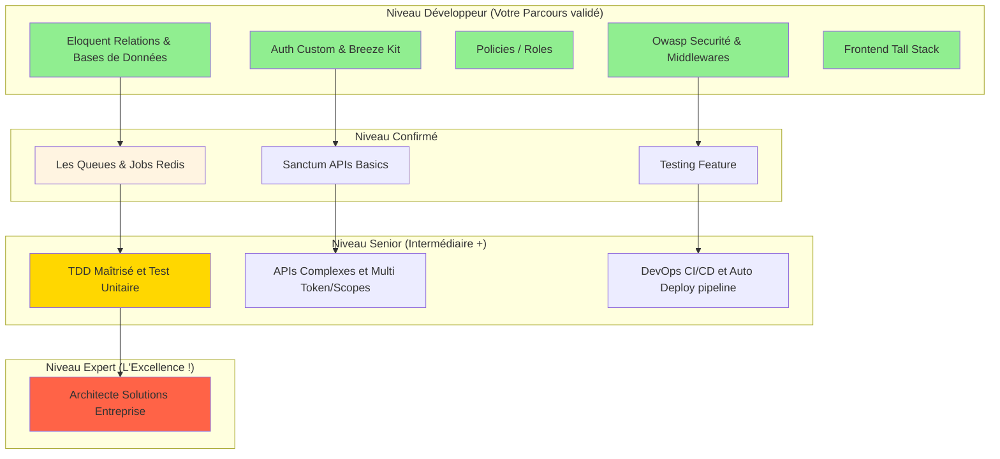

# L'Ultime Masterclass

## 1. Conclusion Finale de vos Projets.

Cette formation d'architecture vous a conduit du niveau zéro absolu jusqu'au niveau **Junior Backend Laravel confirmé**.  La carte mentale suivant représente par les éléments extérieurs (Ce qu'il vous manque pour être un Leader Senior sur les Frameworks de type Back).

 

---

## 2. Le mot de la fin

!!! success "🎓 Formation Masterclass complétée !"
    **Vous avez terminé les Modules Laravel**. C'est un accomplissement majeur.

Vous avez les **fondations solides** d'un développeur backend professionnel. Ce qui distingue un junior d'un senior n'est pas la quantité de connaissances théoriques, mais l'**expérience pratique** et la **capacité à prendre des décisions architecturales**. 

L'essentiel à l'avenir et pour aller au delà : 
- **La Documentation officielle** : https://laravel.com/docs (Votre futur bureau).
- **Consolidez** et reconstruisez un projet ou portfolio similaire seul (Breeze, Des policies, un espace d'Administration et public).
- **Pratiquez** l'écosystème TALL Livewire.
- **Approfondissez** La méthode de déploiement d'un Site Laravel sur un serveur vierge (VPS Linux) et la configuration SSL.

Continuez à construire, à échouer, à debugger, à refactoriser en Live. Chaque Bug résolu, chaque feature implémentée asynchrone, vous rapproche de l'expertise très vite au sein de cet univers structuré.

**Bon courage pour la suite, et bienvenue dans l'Architecture Masterclass ! 🚀**

  
OmnyDocs - Frameworks Laravel Training

