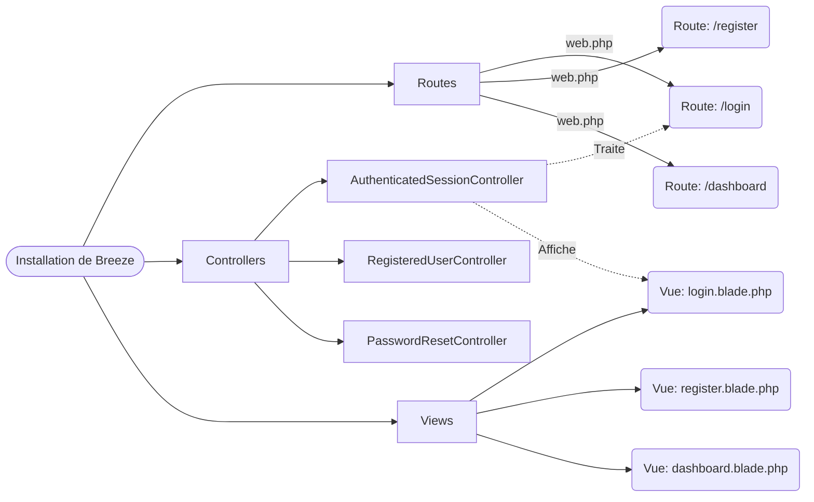

# Laravel Breeze

!!! quote "La rampe de lancement parfaite"
    Construire un système de connexion, d'inscription, d'oubli de mot de passe et de vérification d'email demande beaucoup de temps. **Laravel Breeze** est le "Starter Kit" officiel et minimaliste qui implémente toutes ces fonctionnalités vitales en une seule ligne de commande. Il injecte le code source directement dans votre projet, vous permettant de l'éditer à loisir.

 

---

## 1. À quoi sert Breeze ?

L'objectif de Breeze est de fournir un **scaffold** (un échafaudage) propre et accessible. Lorsque vous installez Breeze, il ne se cache pas derrière un "package" immuable : il copie brutalement les contrôleurs, les routes et les vues d'authentification directement dans vos dossiers `app/Http/Controllers/Auth` et `resources/views/auth`.

### Quand utiliser Breeze ?
- Pour les **nouveaux projets** qui nécessitent une authentification standard.
- Si vous débutez avec Laravel et que vous souhaitez lire le code source écrit par les créateurs du framework pour comprendre comment l'authentification fonctionne sous le capot.
- Si vous souhaitez avoir un contrôle total sur l'esthétique et la logique de vos pages de connexion.

### Les choix technologiques front-end
Breeze est extrêmement souple. Lors de l'installation, il vous demandera quelle technologie vous préférez utiliser de la vue (Frontend) :
1. **Blade & TailwindCSS** (Le choix historique et le plus simple).
2. **Livewire** (Pour des composants dynamiques sans écrire de JavaScript).
3. **React ou Vue** (Construit une application SPA avec Inertia.js).
4. **API Only** (Si vous créez une API headless pour une application mobile, il préparera les routes pour *Laravel Sanctum*).

 

---

## 2. Diagramme de la pile Breeze (Mode Blade)

Voici ce que Breeze déploie concrètement dans votre projet vierge une fois installé :

_Le diagramme met en évidence que Breeze n'est pas une "magie noire" : c'est un simple générateur de fichiers qui vous évite d'écrire les dizaines de fichiers fastidieux liés au login._

 

---

## Conclusion et mise en pratique

!!! tip "Pas juste de la théorie"
    La meilleure façon de comprendre Laravel Breeze est de l'installer dans un vrai projet. Vous pourrez ainsi manipuler les formulaires de connexion et restreindre l'accès à vos propres routes.

> **Vous êtes prêt à coder ?**  
> Dirigez-vous vers nos applications pratiques dans le [Lab Laravel](../../projets/laravel-lab/). La théorie prend tout son sens lorsque vous l'appliquez dans un projet concret.

 