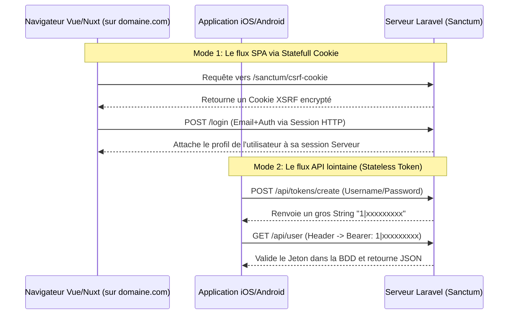

# Laravel Sanctum

!!! quote "Le passeport des machines"
    Lorsque vous écrivez une application web "classique" (avec les vues Blade de Laravel), le navigateur conserve une "Session" magique sous forme de cookie pour se rappeler que vous êtes connecté. Mais comment faire quand votre client est une **Application Mobile (Swift, Kotlin)** ou une **Application Front end moderne détâchée de votre domaine (Vue, React, Nuxt)** ? C'est le rôle de Sanctum : émettre et valider des "Super Jetons" API ou des "Cookies de SPA".

 

---

## 1. À quoi sert Sanctum ?

**Laravel Sanctum** offre un système léger d'authentification spécialement pensé pour les SPAs (Single Page Applications), les applications mobiles, et les API simples basées sur des jetons. Contrairement au package lourd *Laravel Passport* (qui déploie un serveur complet OAuth2 avec flux de redirection), Sanctum est minimal.

### Les deux modes d'action de Sanctum :

1. **Jeton d'API (API Tokens) :**  
   Il permet à un utilisateur de générer plusieurs jetons de connexion et de leur donner un titre (ex : "Clé Maison", "Clé Bureau"). Le client insère ensuite ce jeton en entête HTTP (Bearer token) lors de ses requêtes (`Authorization: Bearer 1|xxx-mon-token-secret-xxx`).
   
2. **Authentification SPA (Cookies) :**  
   Si votre frontend en Vue/React est hébergé sur le **même serveur source** (ou même sous-domaine) que l'API Laravel, Sanctum génère une authentification basée sur les Cookies natifs hautement sécurisés, esquivant totalement la faille de sécurité consistant à stocker un jeton dans le `localStorage` du navigateur.

 

---

## 2. Diagramme "API Token" vs "SPA"

Le secret de Sanctum réside dans sa flexibilité. Il détecte intelligemment le mode d'entrée de la requête HTTP :

_Le diagramme met en évidence que Sanctum est un pont à deux voies. Il assure que les développeurs Frontend (SPA) n'ont pas à gérer "à la main" la transmission de JSON Web Tokens dans l'entête HTTP, tout en laissant l'accès libre aux Appareils Téléphoniques isolés._

 

---

## Conclusion et mise en pratique

!!! quote "Ne complexifiez pas outre mesure"
    La règle d'or dans l'écosystème Laravel est simple : Si vous n'êtes pas contraints de construire un "Fournisseur d'accès public autorisant d'autres applications à se brancher" (Comme "Se Connecter avec Google" / OuAth2), vous devriez toujours utiliser **Sanctum** plutôt que **Passport**.

> **Prêt à distribuer des jetons ?**  
> L'authentification par tokens est démontrée dans nos modules avancés. Allez tester sa résilience en visitant [Le Lab Laravel](../../projets/laravel-lab/).

 