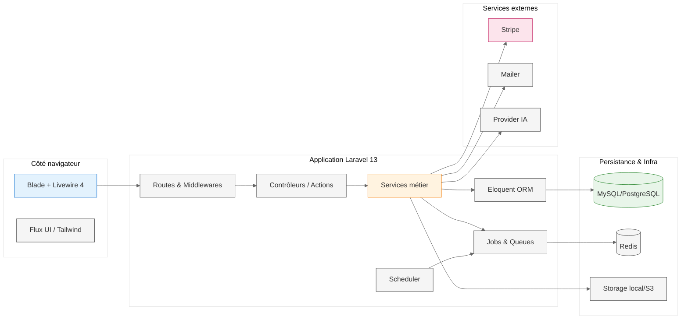
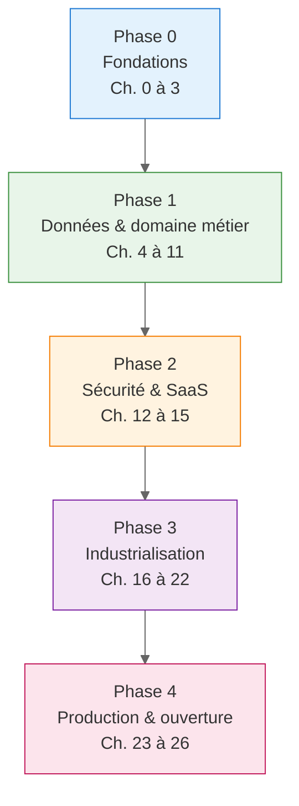
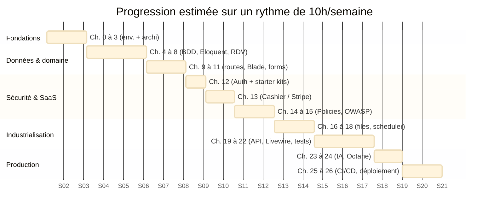
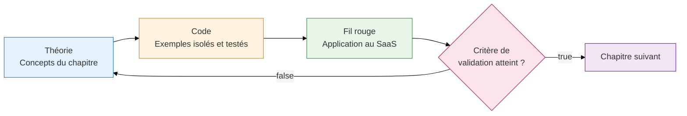
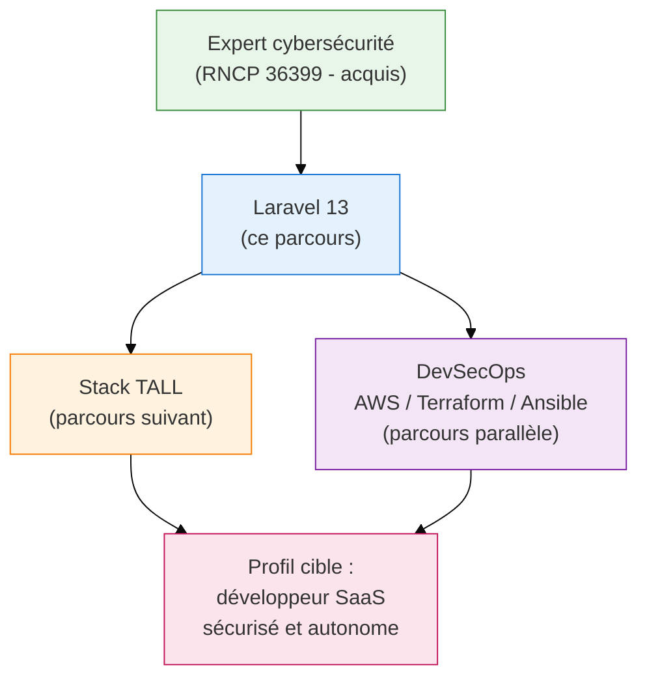

# Présentation du parcours : ce que nous allons réaliser ensemble de A à Z

!!! abstract "Objectif du module"
    Comprendre **où l'on va**, **pourquoi on y va de cette manière** et **ce qui sera réellement livrable** à la fin du parcours. Ce module ne contient aucun code : il pose le cadre mental, les engagements pédagogiques et la trajectoire complète des 27 chapitres. C'est le seul module qu'il faut relire à chaque doute de progression.

!!! quote "Analogie pédagogique"
    Construire un SaaS en Laravel sans plan, c'est comme bâtir une maison en commençant par poser le canapé dans le jardin. Ce chapitre 0 est le **permis de construire** : il décrit le terrain, les fondations, l'étage et la toiture avant même que la première pelletée ne soit donnée. Tout ce qui suit n'est qu'exécution disciplinée du plan.

 

---

## 1. La promesse du parcours

Ce cursus ne vise pas à produire un développeur qui "connaît Laravel". Il vise à produire un développeur capable de **livrer, sécuriser et exploiter en production** une application SaaS réelle, conforme aux référentiels du marché en 2026.

| Critère | Engagement du parcours |
|---|---|
| Framework | Laravel 13 (dernière version stable de la branche LTS courante) |
| Référentiel sécurité | OWASP Top 10:2025 traité catégorie par catégorie |
| Référentiel facturation | Laravel Cashier (Stripe) avec webhooks et cycle complet d'abonnement |
| Interface | Blade puis Livewire 4, ouverture vers la stack TALL |
| Tests | Pest (unitaire, fonctionnel) et Nightwatch (end-to-end) |
| Déploiement | Forge, Vapor **et** IaaS RockyLinux + OVH (trois voies comparées) |
| Industrialisation | CI/CD GitLab + GitHub Actions, `composer audit`, linters, secrets |
| Durée réaliste | 90 à 110 heures effectives, hors temps de relecture |

!!! warning "Ce que ce parcours n'est pas"
    Ce n'est **pas** un tutoriel express, **pas** une compilation de recettes copiables sans comprendre, et **pas** une vitrine d'effets visuels. Chaque chapitre est conçu pour résister à un audit technique réel : revue de code, audit sécurité, mise en production.

 

---

## 2. Le projet fil rouge : un SaaS de gestion de rendez-vous

Le fil rouge n'est pas un prétexte : c'est l'application qui sera **réellement déployée** au chapitre 26 et qui pourrait être commercialisée. Il s'agit d'une plateforme de gestion de rendez-vous et de clients, multi-utilisateurs, avec abonnements payants.

### 2.1 Périmètre fonctionnel

??? abstract "Détail complet des modules métier du SaaS"
    - **Gestion des clients** : création, édition, recherche, suppression douce, historique.
    - **Gestion des sociétés** : regroupement de clients par entité juridique.
    - **Gestion des rendez-vous** : création, déplacement, annulation, détection de conflits horaires.
    - **Gestion des créneaux** : disponibilités, récurrences, fuseaux horaires utilisateur.
    - **Notifications** : rappels automatiques par email et notifications temps réel (Reverb).
    - **Facturation** : abonnements Stripe avec essais gratuits, changements de plan, webhooks.
    - **Rôles et équipes** : propriétaire, manager, opérateur, lecture seule.
    - **Audit et journalisation** : traçabilité des actions sensibles conforme OWASP A09.
    - **API REST** : exposition pour intégrations tierces, documentée OpenAPI.
    - **Assistant IA** : suggestion intelligente de créneaux via Laravel AI SDK.

### 2.2 Architecture cible simplifiée

*Schéma d'architecture cible : chaque bloc sera construit progressivement au fil des 27 chapitres.*

 

---

## 3. Architecture globale du cursus

Le parcours suit une logique **strictement linéaire** : chaque chapitre ajoute une pierre stable à l'édifice. Aucun chapitre n'est optionnel, aucun ne peut être sauté sans dette technique immédiate.

### 3.1 Découpage en cinq phases

### 3.2 Table de correspondance chapitre / livrable

| Phase | Chapitres | Livrable du projet fil rouge |
|---|---|---|
| Fondations | 0 à 3 | Projet initialisé, environnement Docker/Sail, première ressource |
| Données et domaine | 4 à 11 | CRUD client, logique de réservation, formulaires validés |
| Sécurité et SaaS | 12 à 15 | Authentification, abonnements Stripe, durcissement OWASP |
| Industrialisation | 16 à 22 | Files, scheduler, API REST, tests E2E complets |
| Production et ouverture | 23 à 26 | IA, performance, CI/CD, déploiement réel |

 

---

## 4. Cartographie temporelle réaliste

La durée varie selon le rythme personnel. Le diagramme ci-dessous donne une estimation **honnête** sur un rythme de 10 heures effectives par semaine.

!!! info "Lecture du planning"
    Total brut estimé : environ **15 à 16 semaines** à raison de 10 heures par semaine, soit la fourchette de 90 à 110 heures annoncée. Un rythme plus intensif (20h/semaine) ramène le parcours autour de **8 semaines**, mais la consolidation mentale demande tout de même du recul.

 

---

## 5. Méthodologie pédagogique

Trois principes structurent chaque chapitre, sans exception.

### 5.1 Le triptyque théorie / code / projet

### 5.2 Apprendre par l'attaque

Le chapitre 15 et son annexe OWASP suivent un format délibéré : **code vulnérable → exploitation → code sûr → lien avec le projet**. Ce format n'est pas une coquetterie, c'est la méthode reconnue par les pentesters pour ancrer durablement les réflexes défensifs[^1].

### 5.3 Tester avant de produire

À partir du chapitre 6, **aucun code métier ne sera ajouté sans test**. La couverture sera mesurée, mais ce n'est pas le pourcentage qui compte : c'est la couverture des **chemins critiques** (authentification, autorisation, facturation, réservation).

 

---

## 6. Prérequis honnêtes

| Domaine | Niveau minimum attendu | Si lacune |
|---|---|---|
| PHP 8.x | Syntaxe, classes, namespaces, types | Combler avant le chapitre 1 |
| SQL | SELECT, JOIN, contraintes simples | Combler avant le chapitre 4 |
| HTML / CSS | Structure de base, sélecteurs | Combler avant le chapitre 10 |
| Ligne de commande | Navigation, exécution de scripts | Combler avant le chapitre 0 |
| Git | clone, commit, push, branches | Combler dès le chapitre 0 |
| Docker | Notion de conteneur (souhaité, non obligatoire) | Sera introduit au chapitre 0 |

!!! warning "Pièges classiques au démarrage"
    - Vouloir aller au chapitre 13 (Stripe) avant d'avoir terminé les chapitres 4 à 8. **La facturation sans modèle de données solide est ingérable**.
    - Installer Laravel sans Git initialisé. Toute erreur devient irréversible.
    - Lancer `composer update` au lieu de `composer install` sur un projet existant. Cela casse les versions verrouillées.
    - Activer `APP_DEBUG=true` en production "le temps d'un test". C'est une violation directe d'OWASP A02.

 

---

## 7. Compétences visées en sortie

À la fin du chapitre 26, le développeur doit être capable de réaliser, **sans assistance et sous contrainte de délai**, les sept opérations suivantes.

-   :lucide-database:{ .lg .middle } **Modéliser un domaine métier**

    ---

    Concevoir un schéma relationnel cohérent, migrations versionnées, relations Eloquent maîtrisées, factories et seeders pour tous les environnements.

-   :lucide-shield-check:{ .lg .middle } **Sécuriser une application web**

    ---

    Auditer une application contre OWASP Top 10:2025, mettre en place policies, gates, rate limiting, journalisation et signatures.

-   :lucide-credit-card:{ .lg .middle } **Implémenter un SaaS payant**

    ---

    Intégrer Stripe via Cashier, gérer abonnements, essais, changements de plan, webhooks et limites fonctionnelles par plan.

-   :lucide-test-tube:{ .lg .middle } **Tester de bout en bout**

    ---

    Couvrir l'application avec Pest (unitaire, fonctionnel) et Nightwatch (E2E), intégrer la suite à un pipeline CI.

-   :lucide-zap:{ .lg .middle } **Optimiser les performances**

    ---

    Mettre en cache Redis, déployer Octane, identifier et résoudre les N+1, mesurer avec Pulse et Clockwork.

-   :lucide-git-branch:{ .lg .middle } **Industrialiser la livraison**

    ---

    Construire un pipeline GitLab CI/CD et GitHub Actions avec tests, audit, linters, déploiement automatisé et secrets sécurisés.

-   :lucide-server:{ .lg .middle } **Déployer en production**

    ---

    Comparer et opérer Forge, Vapor et IaaS RockyLinux sécurisé sur OVH, avec Nginx, PHP-FPM, Redis, Supervisor, HTTPS et fail2ban.

 

---

## 8. Position dans une trajectoire plus large

Ce parcours Laravel n'est pas une fin. Il est la **deuxième pierre** d'un édifice de compétences plus vaste, dont la cohérence est représentée ci-dessous.

!!! info "Note sur la cohérence du parcours"
    Les bases cybersécurité (BC01, BC02, BC03 du RNCP 36399) sont supposées acquises. Le chapitre 15 et son annexe OWASP s'appuient explicitement sur ces fondations. Aucun rappel exhaustif des concepts d'attaque ne sera fait : le lecteur est traité comme un professionnel capable de lire un CVE et un rapport de pentest.

 

---

## 9. Ressources complémentaires

| Ressource | Nature | Usage recommandé |
|---|---|---|
| Documentation officielle Laravel 13 | Référence | À garder ouverte en permanence |
| OWASP Top 10:2025 | Référentiel sécurité | Consulté à chaque sous-section du chapitre 15 |
| Stripe API Reference | Documentation tierce | Indispensable au chapitre 13 |
| Pest documentation | Documentation tierce | À partir du chapitre 6 |
| Laravel News | Veille | Lecture hebdomadaire conseillée |
| Laravel Daily (YouTube) | Vidéos pédagogiques | Compléments visuels, jamais substitut |

 

---

## 10. Critère de validation du module

??? abstract "Checkpoint de progression — à cocher avant de passer au module suivant"
    - [x] J'ai compris que le livrable final est un SaaS réellement déployable et non un exercice.
    - [x] J'ai identifié les cinq phases du parcours et leur ordre.
    - [x] J'ai estimé honnêtement le temps que je peux consacrer chaque semaine.
    - [x] J'ai vérifié que mes prérequis PHP, SQL et Git sont au niveau attendu.
    - [x] J'accepte la règle "pas de code métier sans test" à partir du chapitre 6.
    - [x] J'ai compris que le chapitre 15 reposera sur une pédagogie par l'attaque.
    - [x] Je sais que la durée totale réaliste est de 90 à 110 heures effectives.

 

---

!!! quote "Ce qu'il faut retenir"
    Ce parcours n'enseigne pas Laravel pour Laravel. Il enseigne **la livraison d'un produit SaaS sécurisé, testé, facturable et déployable**. Le projet fil rouge n'est pas un exercice : c'est la preuve, à la fin du chapitre 26, que les 27 modules ont été réellement assimilés. Tout chapitre sauté est une dette technique différée qui se paiera, sans exception, au chapitre suivant.

> [Passer à la leçon suivante : C'est quoi Laravel ?](02-cest-quoi-laravel.md)

[^1]: La pédagogie par l'attaque (vulnérable → exploitation → contre-mesure) est documentée par OWASP comme méthode formative privilégiée pour les développeurs, et reprise par les certifications offensives type OSCP et PNPT.