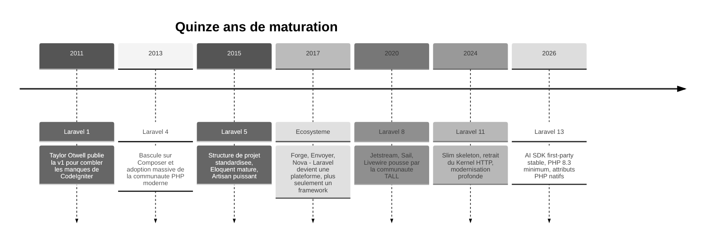
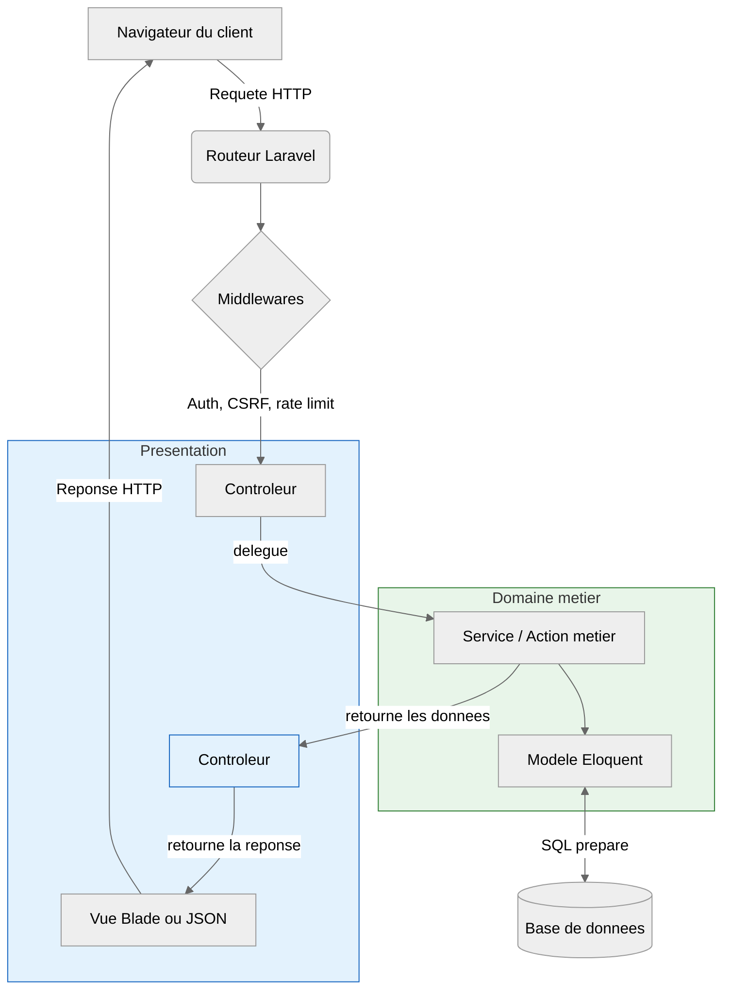

# 02 — C'est quoi Laravel ?

<div class="omny-meta" data-level="Débutant" data-version="Laravel 13.x" data-time="25 min"></div>

!!! quote "Analogie pédagogique"
    Imaginez que vous deviez construire une maison. Vous pourriez tout fabriquer à la main : couler le béton, fondre les clous, tisser les câbles électriques. C'est ce que faisait un développeur PHP en 2005 avec un éditeur de texte et un dossier vide. **Laravel, c'est l'équivalent d'un chantier où la dalle est déjà coulée, les conduits passés, le tableau électrique posé et où l'on vous donne en plus une caisse à outils calibrée pour l'ouvrage**. Vous gardez la liberté totale de l'architecture, mais vous ne perdez plus six mois à réinventer la plomberie.

<br>

---

## 1. Définition technique

**Laravel est un framework PHP open source**, libre, gratuit, sous licence MIT, conçu pour développer des applications web côté serveur en suivant le patron d'architecture **MVC** (Modèle - Vue - Contrôleur).

Concrètement, Laravel fournit :

- Un **moteur de routage** qui transforme une URL en exécution de code PHP.
- Un **ORM** (Eloquent) qui dialogue avec la base de données sans écrire de SQL brut.
- Un **moteur de templates** (Blade) qui sépare le HTML de la logique métier.
- Une **couche de validation, d'authentification, de gestion des files d'attente, de cache, de tests, de mailing et de tâches planifiées**, prêtes à l'emploi.

En une phrase : Laravel est **l'épine dorsale technique** sur laquelle vous greffez votre logique métier, sans réécrire ce que tous les développeurs réécrivaient avant lui[^1].

<br>

---

## 2. Une brève histoire pour comprendre sa philosophie

Laravel n'est pas tombé du ciel. Sa philosophie actuelle est le résultat direct de quinze ans de décisions techniques cohérentes.



Cette frise révèle une constante : **Laravel intègre comme standard ce que la communauté plébiscite**. Livewire, Sail, Inertia, Reverb sont tous nés en périphérie avant de devenir des piliers officiels.

<br>

---

## 3. La philosophie : la « developer happiness » comme axiome

Taylor Otwell, le créateur, a articulé Laravel autour d'une idée précise : **un développeur heureux écrit du meilleur code, plus vite, et plus longtemps**. Cela se traduit par trois principes structurants.

| Principe | Traduction concrète | Conséquence métier |
|---|---|---|
| **Convention over configuration** | Des choix par défaut sensés pour 90 % des cas | Un nouveau développeur est productif en quelques heures |
| **Expressive syntax** | Le code se lit comme une phrase anglaise | Moins de bugs, revues de code plus rapides |
| **Batteries included** | Tout est fourni : auth, ORM, queues, mail, tests, cache | Vous ne dépendez pas d'une mosaïque de packages tiers fragiles |

??? abstract "Exemple comparatif : récupérer les utilisateurs actifs"

    **En PHP brut** (PDO, environ 15 lignes)

    ```php
    # Connexion manuelle, préparation, exécution, parsing, gestion d'erreurs
    $pdo = new PDO('mysql:host=localhost;dbname=app', $user, $pass);
    $stmt = $pdo->prepare('SELECT * FROM users WHERE active = :active');
    $stmt->bindValue(':active', 1, PDO::PARAM_INT);
    $stmt->execute();
    $users = $stmt->fetchAll(PDO::FETCH_ASSOC);
    ```

    **Avec Laravel** (Eloquent, une ligne)

    ```php
    # Le modèle gère la connexion, la requête préparée et la conversion en objets
    $users = User::where('active', true)->get();
    ```

    Le gain n'est pas seulement esthétique : la version Laravel **protège nativement contre les injections SQL** (catégorie A05 de l'OWASP Top 10:2025) et renvoie des objets typés exploitables immédiatement.

<br>

---

## 4. L'architecture MVC expliquée sans jargon

Laravel impose un découpage clair des responsabilités. Comprendre ce schéma maintenant vous évitera des dizaines d'heures de refactoring plus tard.



**Lecture du flux** :

1. Le navigateur envoie une requête (par exemple `GET /clients/42`).
2. Le **routeur** identifie la route et lance les **middlewares** (authentification, protection CSRF, limitation de débit).
3. Le **contrôleur** reçoit la requête et délègue la logique métier à un **service** ou une **action** — il ne traite aucune règle métier lui-même.
4. Le **service** ou l'**action** applique la règle métier (par exemple : « un utilisateur ne peut voir que les clients de son équipe ») et interroge le **modèle Eloquent**.
5. Le **modèle Eloquent** exécute les requêtes préparées sur la base et retourne les données au service.
6. Le service retourne le résultat **au contrôleur**, qui sélectionne et retourne la **vue Blade** (HTML) ou la **ressource API** (JSON) en réponse.

Cette séparation n'est pas un caprice académique. Elle rend le code **testable, lisible et auditable** - trois qualités non négociables pour une application destinée à facturer des clients.

<br>

---

## 5. Ce que Laravel vous donne « gratuitement »

Beaucoup de frameworks vous fournissent un routeur et un moteur de templates. Laravel va beaucoup plus loin. Voici l'inventaire de ce qui est inclus dans une installation neuve de Laravel 13.

<div class="grid cards" markdown>

-   :lucide-route:{ .lg .middle } **Routage et middlewares**

    ---

    Routes web et API, paramètres typés, groupes, throttling, CSRF, rate limiting.

-   :lucide-database:{ .lg .middle } **Eloquent ORM**

    ---

    Modèles, relations, eager loading, casts chiffrés, requêtes fluides, migrations versionnées.

-   :lucide-shield-check:{ .lg .middle } **Authentification**

    ---

    Sessions, tokens API (Sanctum), 2FA, vérification d'email, reset password, équipes.

-   :lucide-mail:{ .lg .middle } **Mail et notifications**

    ---

    SMTP, Mailgun, Postmark, SES, notifications multi-canaux (mail, SMS, Slack, base).

-   :lucide-clock:{ .lg .middle } **Queues et scheduler**

    ---

    Jobs en arrière-plan, tâches planifiées de type cron, supervision via Horizon.

-   :lucide-flask-conical:{ .lg .middle } **Tests intégrés**

    ---

    PHPUnit et Pest, factories, base de données SQLite mémoire pour des tests rapides.

-   :lucide-bot:{ .lg .middle } **Laravel AI SDK**

    ---

    Nouveauté Laravel 13 stable, agnostique au fournisseur (OpenAI, Anthropic), embeddings et tool calling.

-   :lucide-radio:{ .lg .middle } **Temps réel (Reverb)**

    ---

    Serveur WebSocket first-party, désormais avec driver base de données en Laravel 13.

</div>

<br>

---

## 6. L'écosystème : là où Laravel écrase la concurrence

Le framework lui-même n'est qu'une partie de l'histoire. **L'écosystème officiel Laravel est probablement le plus dense du monde PHP**, et c'est ce qui le distingue de Symfony ou des frameworks JavaScript équivalents.

| Outil | Rôle | Quand vous l'utiliserez dans le fil rouge |
|---|---|---|
| **Sail** | Environnement Docker local prêt à l'emploi | Chapitre 0 |
| **Starter kits officiels** | Authentification clé en main — 4 kits : Livewire 4 + Flux, React, Vue, Svelte *(Breeze toujours disponible mais plus maintenu)* | Chapitre 12 |
| **Cashier** | Abonnements Stripe et Paddle | Chapitre 13 |
| **Sanctum** | Authentification API et SPA | Chapitre 19 |
| **Horizon** | Tableau de bord des queues Redis | Chapitre 18 |
| **Pulse** | Métriques applicatives en temps réel | Chapitre 24 |
| **Telescope** | Outil de debug en développement | Chapitre 2 |
| **Reverb** | Serveur WebSocket pour le temps réel | Chapitre 18 |
| **Octane** | Démarrage long pour performances extrêmes (FrankenPHP, Swoole) | Chapitre 24 |
| **Forge / Vapor** | Déploiement géré ou serverless AWS | Chapitre 26 |
| **Boost** | Tooling agentique pour Copilot, Cursor, Claude Code | Tout au long |

**Conséquence directe pour vous** : quand vous arriverez au chapitre 13 pour ajouter la facturation Stripe, vous n'aurez pas à chercher un package communautaire douteux. Vous installerez Cashier, qui est maintenu par l'équipe Laravel elle-même.

<br>

---

## 7. Laravel en 2026 : pourquoi cette version est un tournant

La version 13, sortie en **mars 2026**, n'est pas une simple mise à jour. Elle consacre trois virages stratégiques.

!!! info "Les trois ruptures de Laravel 13"
    **PHP 8.3 minimum** : enums natifs, readonly properties, types stricts. Le framework abandonne définitivement les compromis de l'ère PHP 7.

    **AI SDK first-party stable** : générer du texte, faire du tool calling, créer des embeddings et exécuter une recherche vectorielle, le tout avec une API unifiée OpenAI/Anthropic interchangeable par une simple variable de configuration.

    **Reverb avec driver base de données** : le temps réel sans dépendance Redis obligatoire, ce qui simplifie radicalement les déploiements modestes.

!!! warning "Pièges fréquents à ce stade"
    - **Ne confondez pas Laravel et PHP**. PHP est le langage. Laravel est un framework écrit en PHP. Vous devez maîtriser un minimum de PHP pour utiliser Laravel sereinement.
    - **Ne confondez pas Laravel et Symfony**. Laravel utilise plusieurs composants Symfony en interne (HttpFoundation, Console, etc.), mais sa philosophie est radicalement différente : Symfony privilégie la configuration explicite, Laravel la convention implicite.
    - **N'utilisez pas Laravel pour tout**. Pour un script en ligne de commande de 50 lignes ou une API ultra-spécialisée à faible surface, un micro-framework ou du PHP brut peuvent suffire.

<br>

---

## 8. Pourquoi Laravel pour notre SaaS fil rouge

Le projet du parcours est un **SaaS de gestion de rendez-vous et clients**. Décortiquons les besoins métier et regardons en face ce que Laravel apporte.

| Besoin du SaaS | Réponse de Laravel | Chapitre concerné |
|---|---|---|
| Inscription, connexion sécurisée, 2FA | Starter kit Livewire + Fortify | 12 |
| Gestion de clients et rendez-vous | Eloquent + migrations + policies | 4 à 7 |
| Détection de conflits de créneaux | Logique métier dans des services dédiés | 8 et 17 |
| Abonnements payants | Cashier Stripe | 13 |
| Rappels automatiques | Scheduler + queues + Reverb | 18 |
| API mobile future | Sanctum + API Resources | 19 |
| Audit OWASP Top 10:2025 | Policies, FormRequests, hashing, encrypted casts | 15 |
| Déploiement | Forge ou IaaS RockyLinux | 26 |

**Aucune de ces briques n'est à reconstruire**. Vous allez les assembler, les configurer, les durcir et les tester. Ce travail d'assemblage est précisément ce qui distingue un développeur d'application d'un développeur d'algorithme : vous livrez de la valeur métier sans réinventer la pierre angulaire.

<br>

---

## 9. Qui utilise Laravel ? Les preuves par l'usage

Laravel n'est pas un framework de niche. Il fait tourner des plateformes à très grande échelle, et c'est un argument à connaître quand un décideur vous demandera « est-ce sérieux ? ».

- **Pfizer** l'utilise pour des portails internes.
- **BBC** s'en sert pour certaines applications éditoriales.
- **About You**, géant allemand du e-commerce, l'a longtemps utilisé en cœur de plateforme.
- **Statamic**, **Invoice Ninja**, **Snipe-IT**, **Pterodactyl** sont des produits open source bâtis sur Laravel.
- **Le marché de l'emploi français en 2026** affiche Laravel parmi les trois compétences PHP les plus demandées avec Symfony et WordPress.

<br>

---

## 10. Comparaison honnête avec les alternatives

Soyons rigoureux : Laravel n'est pas un choix par défaut acceptable, c'est un choix éclairé qui s'oppose à d'autres choix éclairés.

!!! warning "Tableau qualitatif, pas un benchmark"
    Les données ci-dessous sont des **estimations qualitatives** issues de l'expérience terrain et de l'analyse des offres d'emploi françaises (2025-2026). Elles ne remplacent pas un benchmark de charge pour votre cas d'usage précis. Pour les performances brutes, consultez [TechEmpower Framework Benchmarks](https://www.techempower.com/benchmarks/).

| Critère | Laravel 13 | Symfony 7 | Django (Python) | NestJS (Node) |
|---|---|---|---|---|
| Courbe d'apprentissage | Douce | Raide | Moyenne | Moyenne |
| Conventions par défaut | Très fortes | Faibles — tout est configurable | Fortes | Moyennes |
| Écosystème officiel | Très dense et intégré | Dense, mais composants éclatés | Dense | Moyennement dense |
| Performance brute (FPM) | Bonne | Bonne | Bonne | Excellente (async natif) |
| Performance avec runtime optimisé | Excellente (Octane + FrankenPHP) | Excellente (FrankenPHP/RoadRunner) | Bonne (ASGI) | Excellente |
| Maturité ORM | Eloquent : pragmatique et expressif | Doctrine : puissant, plus rigide | ORM Django : excellent et intégré | TypeORM / Prisma : variable |
| Marché de l'emploi FR[^2] | Bon (startups, agences, SaaS) | **Excellent** (grands comptes, public) | Bon | En croissance |


**Verdict honnête** : si vous visez la fonction publique française, Symfony reste imbattable. Pour un SaaS B2B, une startup, un MVP rapide à durcir ensuite, Laravel est statistiquement le meilleur compromis temps-de-livraison / qualité / maintenabilité.

<br>

---

## Ressources complémentaires

- [Documentation officielle Laravel 13](https://laravel.com/docs/13.x)
- [Laravel News - source d'information de référence](https://laravel-news.com)
- [Laracasts - vidéos pédagogiques par Jeffrey Way](https://laracasts.com)
- [Annonce officielle Laravel 13](https://laravel.com/docs/13.x/releases)
- [Awesome Laravel - liste curée de ressources](https://github.com/chiraggude/awesome-laravel)

<br>

---

!!! quote "Ce qu'il faut retenir"
    **Laravel est un framework PHP open source**, mature depuis quinze ans, qui fournit en standard tout ce qu'une application web professionnelle attend : routage, ORM, authentification, queues, mail, tests, temps réel et désormais IA.

    Sa **philosophie « developer happiness »** se traduit par des conventions fortes, une syntaxe expressive et un écosystème officiel dense qui réduit drastiquement la dépendance à des packages tiers fragiles.

    **Laravel 13** marque un tournant avec l'AI SDK first-party stable, le passage à PHP 8.3 minimum et un Reverb sans dépendance Redis obligatoire.

    Pour notre SaaS fil rouge, Laravel n'est pas un choix de cœur mais un **choix d'ingénierie raisonné** : il couvre 100 % des briques techniques du projet avec du code maintenu par l'éditeur du framework.

> Leçon suivante : [Leçon 03 — Pourquoi Laravel pour un projet professionnel moderne ?](./03-pourquoi-laravel-professionnel.md)

[^1]: Avant 2011, un projet PHP « propre » signifiait assembler à la main un routeur, un ORM (souvent Doctrine), un moteur de templates (Smarty), une couche d'authentification et un système de tests. Laravel a unifié tout cela sous une bannière cohérente.
[^2]: Analyse qualitative basée sur les tendances du marché de l'emploi PHP en France (2025-2026). Symfony reste historiquement dominant dans les grands comptes, les institutions publiques et les banques françaises. Laravel domine côté startups, SaaS et agences. Source : analyse croisée des offres d'emploi et de la communauté PHP francophone.

