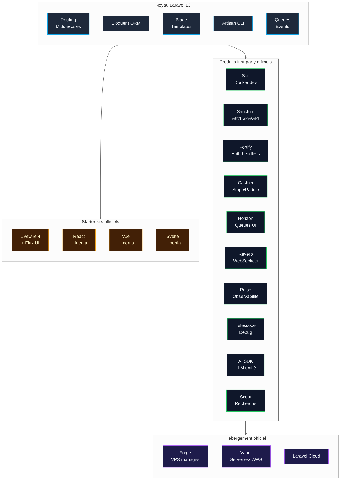
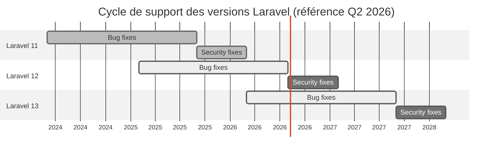
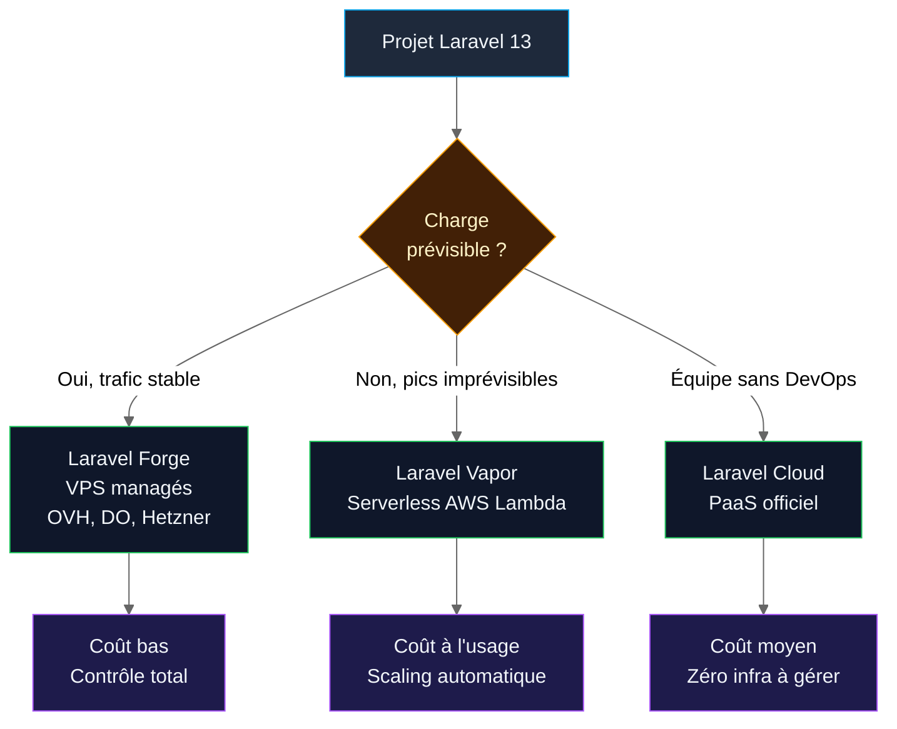

# 03 — Pourquoi Laravel pour un projet professionnel moderne ?

<div class="omny-meta" data-level="Fondamental" data-version="Laravel 13.x" data-time="25 min"></div>

!!! quote "Analogie pédagogique"
    Choisir un framework backend, c'est comme choisir le châssis d'un véhicule professionnel. On ne choisit pas la peinture, on choisit la **plateforme industrielle** : les pièces détachées disponibles dix ans plus tard, le réseau de garagistes, les normes de sécurité, la résistance à la charge et la facilité de revente. Laravel n'est pas « un framework PHP » : c'est une **plateforme produit** complète, avec ses propres pièces détachées (Cashier, Horizon, Reverb, Pulse, AI SDK) et son propre réseau de garagistes (Forge, Vapor, communauté).

<br>

---

## 1. Le critère qui prime : aligner la technologie avec le cycle de vie d'un projet

Un projet professionnel ne se juge pas le jour de sa mise en ligne, mais sur sa capacité à **survivre dix ans** dans des conditions changeantes : équipes qui tournent, dépendances qui meurent, failles qui apparaissent, charge qui augmente. Le choix d'un framework doit donc être évalué sur six axes mesurables, pas sur des impressions.

| Axe d'évaluation | Question concrète | Pourquoi c'est critique |
|---|---|---|
| Maturité | Le framework existe-t-il depuis assez longtemps pour avoir essuyé les plâtres ? | Évite de payer le R&D des autres |
| Écosystème officiel | Les briques critiques (auth, paiement, queues) sont-elles maintenues par l'éditeur ? | Évite la dette des packages communautaires abandonnés |
| Cycle de support | Quelle est la durée garantie des correctifs de sécurité ? | Conditionne le rythme et le coût des migrations |
| Marché de l'emploi | Combien de développeurs sont recrutables sur cette stack ? | Conditionne la continuité d'exploitation |
| Productivité mesurable | Combien de lignes de code pour livrer une fonctionnalité standard ? | Conditionne le délai de mise sur le marché |
| Sécurité par défaut | Quelles protections sont actives sans configuration ? | Conditionne le risque OWASP résiduel |

Laravel 13[^1] coche les six cases simultanément, ce qui est rare dans l'écosystème backend.

<br>

---

## 2. Une plateforme, pas un framework

La confusion la plus répandue chez les profils non-Laravel consiste à comparer Laravel à Symfony, Express ou FastAPI. La comparaison est faussée dès le départ : ces outils sont des **frameworks** (des bibliothèques de routage, validation, ORM). Laravel est une **plateforme** au sens produit, c'est-à-dire un framework **plus** un ensemble de produits first-party maintenus par la même équipe.



*Diagramme — Le périmètre réel de la plateforme Laravel 13. Chaque bloc remplace une dépendance tierce qu'il aurait fallu trouver, évaluer, intégrer et maintenir.*

L'enjeu concret : sur un projet SaaS standard, **80 % des dépendances critiques** (authentification, paiement, queues, websockets, observabilité, IA) sont fournies et **versionnées par l'éditeur du framework lui-même**. Cela élimine la catégorie de risque la plus coûteuse en PHP : le package communautaire abandonné par un mainteneur unique.

<br>

---

## 3. PHP 8.3+ : un socle moderne et performant

Laravel 13 impose **PHP 8.3 minimum**[^2] et supporte officiellement PHP 8.4 et 8.5. Cette exigence n'est pas anodine : elle élimine de facto les projets traînant sur des runtimes obsolètes et impose un niveau minimum de qualité au démarrage.

??? abstract "Pourquoi PHP 8.3+ change concrètement la donne"
    | Fonctionnalité PHP | Conséquence professionnelle |
    |---|---|
    | Typage strict natif | Bugs détectés à l'écriture, pas en production |
    | Readonly properties | Modèles de données immuables sûrs |
    | Enums backed | Élimination des constantes magiques |
    | Attributes natifs | Configuration déclarative lisible (utilisée massivement dans Laravel 13) |
    | JIT compiler amélioré (PHP 8.5) | Gains de performance mesurables sur CPU-bound |
    | Fin de vie de PHP 8.1 (déc. 2025) | Tout projet sous PHP 8.1 est désormais une dette de sécurité |

Un projet démarré aujourd'hui sur Laravel 13 hérite donc d'un **socle de typage strict et de performance moderne**, là où démarrer sur un framework qui supporte encore PHP 7.4 oblige à composer avec dix ans de code rétrocompatible.

<br>

---

## 4. Productivité mesurable : le ratio fonctionnalité / ligne de code

L'argument productivité est souvent invoqué sans preuve. Voici la comparaison concrète, sur une opération métier banale : **créer une ressource avec validation, autorisation, persistance et réponse JSON**.

=== "Laravel 13 (Eloquent + FormRequest + Policy)"

    ```php title="PHP - app/Http/Controllers/ClientController.php"
    // Le contrôleur reste minimal car chaque responsabilité est déléguée
    public function store(StoreClientRequest $request): JsonResponse
    {
        // La validation et l'autorisation ont déjà eu lieu dans StoreClientRequest
        $client = Client::create($request->validated());

        return response()->json(new ClientResource($client), 201);
    }
    ```

=== "Approche framework minimaliste équivalent"

    ```php title="PHP - Pseudo-code framework minimaliste"
    // Tout doit être assemblé à la main : validation, autorisation, ORM, sérialisation
    public function store(Request $request): Response
    {
        $validator = new Validator($rules);
        if (! $validator->validate($request->all())) { /* ... */ }

        if (! $this->authChecker->can($user, 'create-client')) { /* ... */ }

        $client = $this->repository->create($validator->validated());

        return new JsonResponse($this->serializer->serialize($client), 201);
    }
    ```

Le code Laravel n'est pas plus court par magie : il est plus court parce que **les conventions remplacent la configuration**. Chaque décision standard (où mettre la validation, comment nommer les méthodes, comment structurer la réponse) est déjà prise par le framework. L'équipe ne perd pas de temps à débattre, elle livre.

<br>

---

## 5. Sécurité par défaut : ce que Laravel active sans rien faire

L'OWASP Top 10:2025[^3] sert de référentiel commun. Laravel adresse plusieurs catégories **par défaut**, avant toute configuration de la part du développeur. C'est un argument décisif pour un projet professionnel : la sécurité de base n'est pas optionnelle, elle est imposée par le framework.

| Catégorie OWASP 2025 | Protection Laravel native | Action développeur requise |
|---|---|---|
| A01 Broken Access Control | Policies, Gates, middleware `auth` | Définir les policies métier |
| A03 Supply Chain | Composer + verrouillage `composer.lock`, `composer audit` | Lancer l'audit en CI |
| A04 Cryptographic Failures | Hash bcrypt/argon par défaut, `encrypted` casts | Activer les casts sur données sensibles |
| A05 Injection (SQL) | Eloquent et Query Builder paramétrés par défaut | Éviter `whereRaw` non paramétré |
| A05 Injection (XSS) | Échappement automatique Blade via `{{ }}` | Éviter `{!! !!}` sur entrée utilisateur |
| A07 Authentication Failures | Throttling, rate limiting, sessions sécurisées | Configurer la politique de mot de passe |
| CSRF (hors Top 10) | Middleware `VerifyCsrfToken` actif par défaut | Inclure `@csrf` dans les formulaires |
| Mass assignment | `$fillable` / `$guarded` obligatoires sur les modèles | Définir explicitement les champs autorisés |

L'effet concret : un débutant qui suit la documentation officielle Laravel produit un code **plus sûr par défaut** qu'un développeur expérimenté qui assemble un framework minimaliste à la main. La sécurité n'est plus une compétence, c'est une conséquence du framework.

!!! warning "Piège fréquent : la sécurité par défaut n'est pas l'absence d'audit"
    Laravel protège contre les erreurs classiques, pas contre les erreurs métier. Une policy mal écrite, un `whereRaw` injecté, un `{!! !!}` non échappé ou un `.env` exposé annulent toutes les protections par défaut. La sécurité par défaut **réduit la surface d'attaque**, elle ne **l'élimine pas**. L'audit OWASP du chapitre 15 reste obligatoire.

<br>

---

## 6. Le cycle de support : un argument financier, pas technique

Un framework professionnel doit garantir un cycle de support prévisible. Laravel applique une politique publique et stable, ce qui permet de **budgéter les montées de version à l'avance**.



*Diagramme — Cycle de support Laravel. Chaque version majeure reçoit environ 18 mois de correctifs fonctionnels puis 6 mois supplémentaires de correctifs de sécurité.*

| Version | Date de sortie | Bug fixes jusqu'à | Security fixes jusqu'à |
|---|---|---|---|
| Laravel 11 | Mars 2024 | Septembre 2025 | Mars 2026 |
| Laravel 12 | Février 2025 | Août 2026 | Février 2027 |
| Laravel 13 | Mars 2026 | Septembre 2027 | Mars 2028 |

**Conséquence pour un projet démarré en 2026** : choisir Laravel 13 garantit deux ans de tranquillité sans migration de version majeure, et la promesse explicite de l'éditeur de **minimiser les breaking changes** sur ce cycle[^2].

<br>

---

## 7. L'écosystème d'hébergement : un avantage souvent sous-estimé

Un projet professionnel finit toujours par poser la question : **qui exploite ça en production, et avec quelle expertise ?** Laravel propose trois voies officielles, ce qui couvre l'essentiel des besoins du marché.



*Diagramme — Arbre de décision d'hébergement officiel Laravel. Aucun de ces choix n'est exclusif : un projet peut migrer de Forge à Vapor sans changer de framework.*

L'argument décisif n'est pas que ces produits soient meilleurs que la concurrence, mais qu'ils **partagent la même équipe d'ingénierie que le framework**. Un bug de déploiement Forge est corrigé par les gens qui écrivent Laravel. Cette intégration verticale n'existe nulle part ailleurs dans l'écosystème PHP.

<br>

---

## 8. Le marché de l'emploi et la continuité d'exploitation

Un projet professionnel doit pouvoir **changer d'équipe** sans réécriture. C'est ici que l'argument communautaire prend son sens, à condition d'être chiffré et non déclamé.

| Indicateur | Mesure (référence début 2026) |
|---|---|
| Stars GitHub `laravel/laravel` | > 80 000 |
| Téléchargements Packagist (cumulés) | > 350 millions |
| Offres d'emploi « Laravel » en France | Plusieurs milliers actives en continu |
| Présence en agences web françaises | Stack PHP majoritaire avec Symfony |
| Forums et entraide francophones | Laravel France, Discord officiel, Laracasts |

L'effet pratique : remplacer un développeur Laravel en France prend **quelques semaines**, là où remplacer un développeur sur une stack de niche peut prendre **plusieurs mois**, voire imposer une réécriture. Cet argument est financier, pas technique, et c'est précisément pour ça qu'il pèse lourd dans une décision professionnelle.

<br>

---

## 9. Les limites à connaître avant de s'engager

Refuser de flatter Laravel implique aussi de nommer ses limites. Un choix professionnel honnête repose sur la connaissance des contreparties.

!!! warning "Ce que Laravel ne fait pas bien, ou pas mieux que la concurrence"
    - **Calcul intensif CPU pur** : Python (NumPy, Pandas) ou Go restent supérieurs pour le data crunching.
    - **Microservices événementiels haute fréquence** : Go ou Node.js sont mieux outillés pour les architectures à très faible latence.
    - **Temps réel massif** : Reverb est viable mais ne rivalise pas avec Elixir/Phoenix sur 100 000+ connexions simultanées.
    - **Effet « cage dorée »** : la productivité Laravel repose sur les conventions. Un développeur qui les contourne systématiquement obtient un projet plus difficile à maintenir qu'un Symfony bien architecturé.
    - **Magie Eloquent** : la facilité d'écriture peut masquer des N+1 catastrophiques en production sans audit.

Ces limites n'invalident pas Laravel pour un SaaS de gestion de rendez-vous comme le projet fil rouge. Elles invalident Laravel pour un moteur de trading haute fréquence ou un système de streaming vidéo temps réel à l'échelle de Twitch.

<br>

---

## 10. Synthèse : la grille de décision finale

| Critère | Réponse Laravel 13 | Verdict |
|---|---|---|
| Maturité | 14 ans, version 13 | Solide |
| Écosystème officiel | 10+ produits first-party | Décisif |
| Cycle de support | 2 ans bug fixes + 6 mois sécurité par version | Prévisible |
| Sécurité par défaut | Couvre 6 catégories OWASP 2025 sur 10 | Élevée |
| Productivité | Conventions fortes, scaffolding complet | Élevée |
| Hébergement | 3 voies officielles (Forge, Vapor, Cloud) | Complet |
| Marché de l'emploi | Stack majoritaire en France | Faible risque RH |
| Coût total de possession | Faible sur 5 ans pour un SaaS standard | Compétitif |
| Limites | Calcul intensif, temps réel massif | À assumer |

**Conclusion stricte** : pour un SaaS B2B francophone, à équipe modeste, devant atteindre la production rapidement et survivre dix ans, Laravel 13 n'est pas le seul choix raisonnable, mais c'est probablement **le choix le moins risqué**. Aucun autre framework PHP ne combine ce niveau d'intégration verticale, de cycle de support prévisible et de profondeur d'écosystème officiel.

<br>

---

## Ressources complémentaires

| Ressource | Type | Lien |
|---|---|---|
| Documentation officielle Laravel 13 | Référence | <https://laravel.com/docs/13.x> |
| Notes de release Laravel 13 | Article | <https://laravel-news.com/laravel-13-released> |
| Cycle de support officiel | Politique éditeur | <https://laravel.com/docs/13.x/releases#support-policy> |
| OWASP Top 10:2025 | Référentiel sécurité | <https://owasp.org/Top10/2025/> |
| Écosystème first-party | Catalogue produits | <https://laravel.com/#ecosystem> |

<br>

---

[^1]: Laravel 13 a été officiellement publié le 17 mars 2026, avec un focus sur la stabilité, les PHP Attributes natifs et l'AI SDK first-party. Référence : <https://laravel-news.com/laravel-13-released>.
[^2]: Laravel 13 exige PHP 8.3 minimum et supporte PHP 8.4 et 8.5. PHP 8.1 a atteint sa fin de vie en décembre 2025 et ne reçoit plus de correctifs de sécurité.
[^3]: La liste OWASP Top 10:2025 est le référentiel utilisé tout au long du chapitre 15 et de l'annexe sécurité du parcours.

!!! quote "Ce qu'il faut retenir"
    Laravel 13 n'est pas un framework de plus, c'est une **plateforme produit verticalement intégrée** : noyau + écosystème officiel + hébergement managé + cycle de support garanti. Pour un projet professionnel à équipe modeste devant survivre dix ans, ce niveau d'intégration constitue le principal réducteur de risque technique et financier. Le coût d'entrée se paie sur les limites assumées : calcul intensif, temps réel massif et discipline d'utilisation des conventions.

> Leçon suivante : [Leçon 04 — Développer avec Laravel sans Docker ni Sail : avantages, limites et cas d'usage](04-laravel-sans-docker.md)

<br>