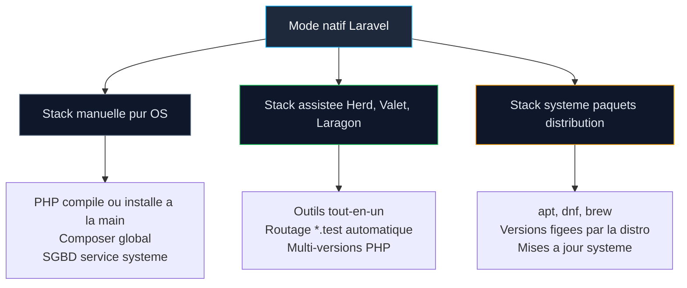
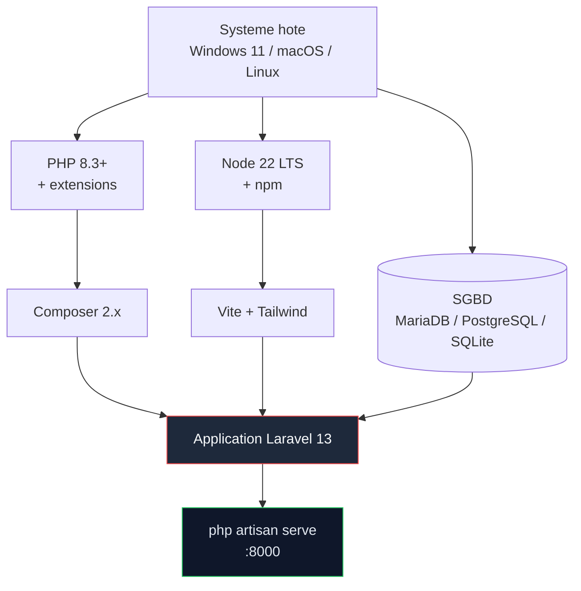
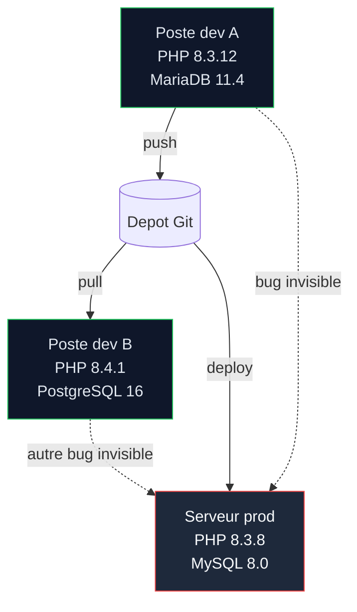
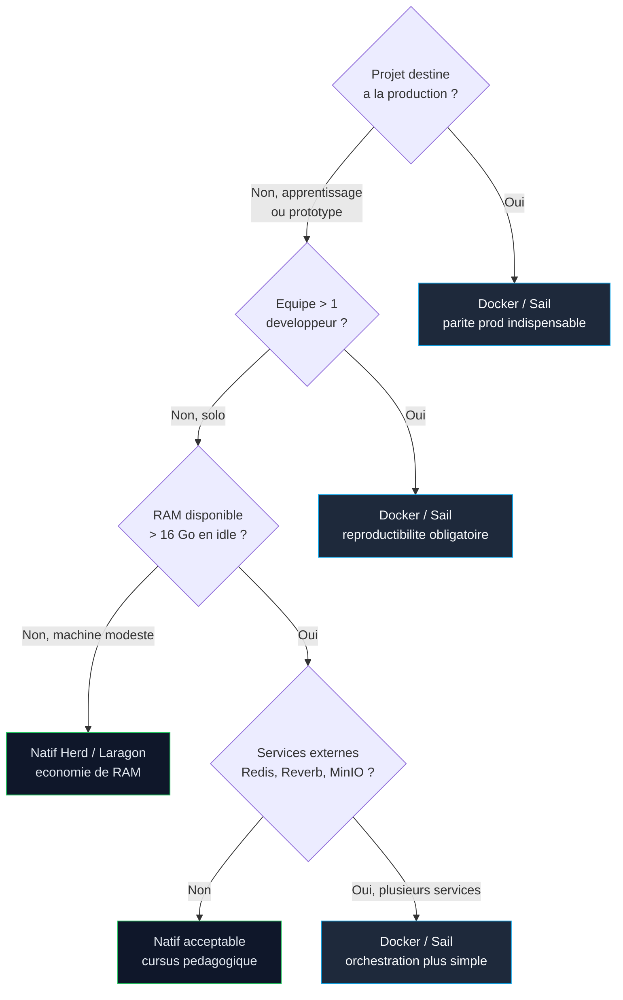

# 04 — Développer avec Laravel sans Docker ni Sail

<div class="omny-meta" data-level="Débutant" data-version="Laravel 13 / PHP 8.3+" data-time="35-45 min de lecture, 1 h 30 d'expérimentation">
  Niveau : Débutant — Version : Laravel 13 (mars 2026), PHP 8.3+ — Durée : ~35-45 min de lecture, 1 h 30 d'expérimentation
</div>

!!! quote "Analogie pédagogique"
    Développer Laravel **sans Docker**, c'est cuisiner dans **votre propre cuisine** : tout est sous la main, vous connaissez chaque tiroir, le plat sort vite, mais si vous changez d'appartement (ou de collègue), il faut **réinstaller les ustensiles**, espérer que la marque du four soit la même, et prier pour que la version du gaz corresponde. Docker / Sail, à l'inverse, c'est apporter votre **cuisine portative scellée** : plus lourde à transporter, mais **identique partout**.
    Ce module n'est ni un éloge ni un procès du mode natif. C'est un **arbitrage technique** que tout développeur Laravel doit savoir poser **avant** d'écrire la moindre ligne de code.

!!! abstract "Objectif du module"
    À la fin de cette leçon, vous serez capable de :

    - définir précisément ce que recouvre un environnement **Laravel natif** sur macOS, Linux et Windows 11 ;
    - lister la **stack minimale** réellement requise pour Laravel 13 (PHP 8.3+, Composer 2, Node 20 LTS, SGBD) ;
    - peser les **avantages concrets** (performance, simplicité, RAM) face aux **limites structurelles** (reproductibilité, parité prod, isolation) ;
    - identifier les **cas d'usage légitimes** où le mode natif est le bon choix, et ceux où il devient un anti-pattern ;
    - éviter les **pièges spécifiques à Windows 11** (encodage de fichiers, permissions, chemins longs, `\r\n` vs `\n`) ;
    - arbitrer via un **arbre de décision** reproductible et défendable en revue technique.

<br>

---

## 1. Définir le périmètre du mode « natif »

### 1.1 Ce que signifie « sans Docker ni Sail »

Le mode natif consiste à installer **directement sur le système d'exploitation hôte** chacun des composants requis par Laravel, sans couche de virtualisation ni conteneurisation. Concrètement, cela veut dire que :

- l'interpréteur PHP tourne dans le processus de votre OS ;
- Composer écrit dans `~/.composer` (ou `%APPDATA%\Composer` sous Windows) ;
- la base de données (MariaDB, PostgreSQL, SQLite) est un **service système** ou un binaire local ;
- le serveur HTTP de développement est lancé par `php artisan serve`, branché sur le PHP de la machine.

Aucune image, aucun conteneur, aucun namespace Linux n'est mobilisé. **Votre application partage l'espace de vie du système hôte.**

### 1.2 Distinguer trois familles de configuration natives



*Figure 1.1 — Les trois variantes du mode natif. Toutes excluent Docker et Sail, mais leur ergonomie diffère radicalement.*

Le choix interne au mode natif n'est pas neutre : **Herd**[^herd] sur macOS/Windows ou **Laragon** sur Windows automatisent ce que la stack manuelle vous fait apprendre. Pour un cursus pédagogique, la stack manuelle est formatrice ; pour un poste de production individuelle, Herd est aujourd'hui le meilleur compromis natif.

[^herd]: Laravel Herd est l'outil officiel pour environnements PHP natifs sur macOS et Windows, maintenu par l'équipe Laravel.

<br>

---

## 2. Stack minimale requise pour Laravel 13

### 2.1 Tableau des prérequis runtime

| Composant      | Version exigée                       | Rôle                                 | Vérification                    |
|----------------|--------------------------------------|--------------------------------------|---------------------------------|
| PHP            | **8.3 minimum**, supporté 8.3 / 8.4 / 8.5 | Interpréteur du framework            | `php -v`                        |
| Extensions PHP | `mbstring`, `openssl`, `pdo`, `pdo_mysql` ou `pdo_pgsql`, `tokenizer`, `xml`, `ctype`, `json`, `bcmath`, `curl`, `fileinfo`, `dom`, `zip` | Dépendances du framework et de Composer | `php -m`                  |
| Composer       | **2.x** (idéalement 2.7+)            | Gestion des dépendances PHP          | `composer --version`            |
| Node.js        | **22 LTS**                 | Build des assets (Vite)              | `node -v`                       |
| npm            | Fourni avec Node                     | Gestion des paquets JS               | `npm -v`                        |
| SGBD           | MariaDB 11+, MySQL 8+, PostgreSQL 16+ ou SQLite 3.46+ | Persistance              | `mysql --version` etc.          |
| Git            | 2.40+                                | Versionnement                        | `git --version`                 |

!!! warning "Pièges de version"
    - **PHP 8.2** n'est plus suffisant pour Laravel 13. Sur une distribution LTS qui livre encore PHP 8.2, vous **devez** passer par un dépôt tiers (`ppa:ondrej/php` sur Ubuntu, Remi sur RHEL/Rocky).
    - Sur Windows, la version PHP livrée par certains installateurs WAMP n'inclut pas toutes les extensions exigées : vérifiez `php -m` **avant** `composer create-project`.
    - Node 18 est en fin de support. Bannissez-le, même si certains tutoriels le mentionnent encore.

### 2.2 Diagramme des dépendances au démarrage



*Figure 2.1 — Chaîne de dépendances minimale. Chaque maillon manquant ou périmé bloque le démarrage du projet.*

### 2.3 Vérification en une commande

```bash title="Bash - Verification rapide de la stack native"
# Affiche en sequence les versions des outils critiques
# Si l'une echoue ou renvoie une version trop basse, corrigez avant d'aller plus loin
php -v && composer --version && node -v && npm -v && git --version
```

*Une seule ligne, quatre verdicts : si le terminal n'affiche pas PHP 8.3+, Composer 2, Node 20+, Git 2.40+, le projet ne démarrera pas dans des conditions saines.*

<br>

---

## 3. Avantages réels du mode natif

### 3.1 Performance brute, surtout sous Windows et macOS

Docker Desktop sur Windows et macOS exécute en réalité une **VM Linux** (WSL2 ou un hyperviseur léger) avec un système de fichiers partagé. Cette double traduction crée un surcoût mesurable sur :

- les opérations disque (lecture/écriture de milliers de petits fichiers `vendor/`, `node_modules/`) ;
- le build Vite, qui surveille des centaines de fichiers ;
- les tests Pest qui font tourner des migrations à chaque test.

Sur la machine décrite (Windows 11, 48 Go de RAM, 8 Go fréquemment consommés par l'OS et les outils), le mode natif libère **0,8 à 1,5 Go de RAM** que Docker Desktop réquisitionnerait en permanence, et accélère typiquement les tests Pest **de 30 à 60 %**.

### 3.2 Boucle de feedback immédiate

Aucune indirection : l'éditeur écrit, le serveur PHP relit, le navigateur affiche. Pas de propagation de fichiers entre l'hôte et un conteneur, pas de `docker compose restart` sur changement d'extension PHP.

### 3.3 Debug Xdebug sans plomberie

Xdebug en natif se branche en deux lignes dans `php.ini`. En Docker, il faut configurer la passerelle réseau, le mapping de chemins, parfois `host.docker.internal` côté Windows. Pour un débutant, le natif est **objectivement plus simple** à debugger.

### 3.4 Économie cognitive au démarrage

Vous n'apprenez **qu'une seule chose à la fois** : Laravel. Pas Docker, pas Compose, pas les volumes, pas les réseaux bridge. Cette économie est précieuse en début de cursus.

??? abstract "Détail : tableau comparatif des coûts de démarrage"
    | Critère                          | Natif          | Docker / Sail   |
    |----------------------------------|----------------|-----------------|
    | Temps premier `artisan serve`    | 2-5 min        | 10-25 min       |
    | RAM consommée en idle            | ~150 Mo        | ~1,2-2 Go       |
    | Concepts à maîtriser avant écriture du premier `Route::` | PHP, Composer | PHP, Composer, Docker, Compose, volumes, réseau |
    | Temps d'un test Pest unitaire    | ~80 ms         | ~120-180 ms     |
    | Coût mental d'un Xdebug step     | Faible         | Moyen à élevé   |

<br>

---

## 4. Limites structurelles du mode natif

### 4.1 Reproductibilité fragile

Votre machine est **un cas unique au monde**. Le collègue qui clone le dépôt aura une autre version mineure de PHP, une extension `gd` compilée différemment, un `OPENSSL_CONF` pointant ailleurs. Les bugs « ça marche chez moi » naissent là.



*Figure 4.1 — Trois environnements natifs différents pour un même dépôt Git. Chaque divergence est un terrain de bug latent.*

### 4.2 Parité production absente

En production, votre Laravel tourne probablement derrière **Nginx + PHP-FPM**, sur **Rocky Linux** ou Ubuntu, avec **OPcache** et **Redis**. En local natif Windows, vous tournez sur le serveur de dev intégré, sans OPcache, sans Redis (sauf installation manuelle). La probabilité qu'un bug apparaisse uniquement en prod est élevée.

### 4.3 Pollution et désinstallation difficile

Composer global, extensions PHP compilées, services système : au bout de six mois, votre machine accumule des reliquats. Un projet qui exige PHP 8.4 et un autre coincé en 8.3 vous force à jongler avec des binaires multiples (`php83`, `php84`).

### 4.4 Sécurité locale moindre

Une dépendance Composer compromise s'exécute avec **les droits de votre utilisateur**. En conteneur, le rayon d'explosion est borné au conteneur. Sur un poste contenant des clés SSH, des sessions navigateur authentifiées et des accès AWS, le natif est plus exposé. Cette nuance compte d'autant plus pour un profil DevSecOps.

!!! warning "Piège fréquent"
    `composer require` exécute du code arbitraire via les scripts de post-installation. En natif, ces scripts tournent sur **votre vrai compte utilisateur**. Auditez systématiquement les nouvelles dépendances et activez `composer audit` (vu au chapitre 25).

<br>

---

## 5. Cas d'usage légitimes du mode natif

### 5.1 Quand le natif est le bon choix

| Contexte                                  | Justification                                                                 |
|-------------------------------------------|-------------------------------------------------------------------------------|
| Apprentissage initial de Laravel          | Économie cognitive, focus sur le framework                                    |
| Développeur solo, mono-projet             | Pas de besoin de reproductibilité multi-poste                                 |
| Machine modeste (8-16 Go RAM)             | Docker Desktop est coûteux en mémoire                                         |
| Prototype jetable, POC court              | Le coût Docker n'est jamais amorti                                            |
| Plugin de debug intensif (Xdebug, Ray)    | Branchement immédiat sans plomberie réseau                                    |
| Démo client locale rapide                 | `php artisan serve --host=0.0.0.0` suffit                                     |

### 5.2 Quand le natif devient un anti-pattern

| Contexte                                  | Risque                                                                        |
|-------------------------------------------|-------------------------------------------------------------------------------|
| Équipe ≥ 2 développeurs                   | Divergences d'environnement systématiques                                     |
| Projet destiné à la production            | Écart local / prod source de régressions                                      |
| Intégration de services (Redis, MinIO, Reverb) | Multiplication des services système à maintenir                            |
| CI/CD basée sur des images Docker         | Le développement local s'écarte du build CI                                   |
| Onboarding de stagiaires ou alternants    | Chaque nouvelle machine = une demi-journée perdue                             |
| Audit de sécurité ou ISO 27001            | Inventaire de dépendances OS difficile à produire                             |

<br>

---

## 6. Pièges spécifiques à Windows 11

Cette section vise explicitement votre environnement. Windows 11 reste un terrain piégeux pour PHP, même en 2026.

### 6.1 Fins de ligne `\r\n` vs `\n`

Git, par défaut sur Windows, convertit les fins de ligne en `\r\n` au checkout. Les scripts shell (`artisan`, hooks) cassent ensuite sous WSL ou en CI Linux.

```bash title="Bash - Imposer LF dans le depot des l'initialisation"
# Configure Git pour ne PAS convertir les fins de ligne en local
# Indispensable des le premier clone sur Windows
git config --global core.autocrlf false
git config --global core.eol lf
```

*Posé une fois, ce réglage évite des heures de debug sur des scripts qui semblent « invisibles » en cassure.*

### 6.2 Chemins longs

Composer et npm créent des arborescences profondes (`vendor/`, `node_modules/`). Windows limite historiquement les chemins à 260 caractères. Activez le support long path :

```powershell title="PowerShell admin - Activer les chemins longs Windows"
# A executer une seule fois en administrateur
# Autorise les chemins > 260 caracteres, indispensable pour node_modules
New-ItemProperty -Path "HKLM:\SYSTEM\CurrentControlSet\Control\FileSystem" `
    -Name "LongPathsEnabled" -Value 1 -PropertyType DWORD -Force
```

### 6.3 Encodage des fichiers

Les éditeurs Windows tendent à enregistrer en UTF-8 **avec BOM**. PHP rejette les fichiers `.php` avec BOM avant la balise ouvrante. Configurez votre éditeur sur **UTF-8 sans BOM** et fixez-le dans un `.editorconfig` à la racine du projet.

```ini title=".editorconfig - Verrouiller l'encodage et l'indentation"
# Pose un contrat unique pour tout collaborateur, quel que soit son OS
root = true

[*]
charset = utf-8                  # UTF-8 sans BOM impose
end_of_line = lf                 # Fins de ligne Unix uniquement
indent_style = space
indent_size = 4
insert_final_newline = true
trim_trailing_whitespace = true

[*.{js,ts,vue,json,yml,yaml}]
indent_size = 2                  # Convention JS / YAML

[*.md]
trim_trailing_whitespace = false # Markdown autorise les doubles espaces de saut de ligne
```

### 6.4 Permissions et stockage

NTFS ne porte pas la notion de permission Unix. Les fichiers `storage/` et `bootstrap/cache/` sont en lecture/écriture par défaut sous Windows, mais pas sous Linux. Si vous testez en parallèle sous WSL2, vous découvrirez ce décalage **à vos dépens**.

### 6.5 Antivirus et Defender

Windows Defender scanne en temps réel chaque écriture dans `vendor/` et `node_modules/`. Sur un `composer install`, c'est plusieurs dizaines de milliers de fichiers. Excluez le dossier de vos projets PHP du scan temps réel — sans désactiver Defender globalement.

<br>

---

## 7. Arbre de décision : natif ou conteneurisé ?



*Figure 7.1 — Arbre de décision pour arbitrer natif vs Docker. Quatre questions suffisent à trancher dans 90 % des cas.*

### 7.1 Synthèse honnête pour ce cursus

Pour ce parcours de 27 chapitres orienté vers un SaaS production-ready, la **recommandation soutenable** est :

1. **Chapitres 0 à 11** : mode natif acceptable, voire encouragé. Vous apprenez Laravel sans le bruit Docker.
2. **À partir du chapitre 12** (Cashier Stripe, Reverb, Horizon, Redis) : la valeur ajoutée de Docker / Sail dépasse son coût. Vous basculerez la stack.
3. **Chapitres 24 à 26** (Octane, CI/CD, déploiement) : Docker devient **non négociable** pour préparer la parité production.

Cette progression est précisément ce que prévoit le chapitre 0 du cursus, avec la leçon suivante (05) consacrée au passage Docker / Sail.

<br>

---

## 8. Checkpoint de progression

!!! tip "Exercices d'ancrage liés au projet fil rouge (Partie 0/26)"
    Les trois exercices ci-dessous préparent directement l'installation décrite en leçon 06 (macOS), 07 (Linux) et 08 (Windows / WSL2).

    1. Sur votre machine actuelle, exécutez la ligne de vérification `php -v && composer --version && node -v && npm -v && git --version`. Notez chaque version dans un fichier `docs/environment.md` à la racine d'un dépôt vide.
    2. Identifiez dans le tableau **5.1 / 5.2** la situation la plus proche de votre contexte personnel, et rédigez en trois lignes la justification de votre choix natif ou Docker pour le projet fil rouge.
    3. Sous Windows uniquement : appliquez les deux commandes de **6.1** et **6.2**, puis ouvrez un Issue Git nommé `chore: stabilisation environnement Windows` listant ces actions comme journal traçable.

- [x] Vous savez nommer les sept composants de la stack Laravel 13 native.
- [x] Vous distinguez stack manuelle, stack assistée (Herd / Laragon) et stack système.
- [x] Vous pouvez citer trois avantages et trois limites factuels du mode natif.
- [x] Vous avez identifié au moins deux pièges Windows 11 que vous corrigerez avant la leçon 08.
- [x] Vous savez positionner votre projet sur l'arbre de décision **7.1**.

<br>

---

## 9. Ressources complémentaires

| Ressource                                            | Type           | Pertinence pour ce module                               |
|------------------------------------------------------|----------------|---------------------------------------------------------|
| Documentation officielle Laravel 13 — Installation   | Référence      | Liste exhaustive des prérequis PHP et extensions        |
| Laravel Herd                                         | Outil natif    | Stack assistée moderne, macOS et Windows                |
| Laragon                                              | Outil natif    | Stack tout-en-un Windows, indépendant communautaire     |
| PHP.net — Installation Windows                       | Référence      | Compilations officielles PHP 8.3+ pour Windows          |
| Notes de version Laravel 13 (Laravel News)           | Article        | Justifie le passage de PHP 8.2 à 8.3                    |
| Matrice de compatibilité Laravel / PHP 2026          | Article        | Confirme les versions PHP supportées                    |

??? abstract "Pour aller plus loin : grille d'audit personnel à remplir"
    Avant de passer à la leçon 05, remplissez cette grille honnêtement. Elle vous servira lors du choix Docker / Sail.

    | Question                                                       | Réponse |
    |----------------------------------------------------------------|---------|
    | Combien de développeurs travailleront sur ce projet ?          |         |
    | Quel OS de production cible ? (Rocky Linux, Ubuntu, autre)     |         |
    | Quels services externes prévus à 6 mois ? (Redis, Reverb…)     |         |
    | Quelle RAM réellement disponible en idle sur votre poste ?     |         |
    | Avez-vous déjà été confronté à un bug « ça marche chez moi » ? |         |
    | Le projet sera-t-il déployé en CI/CD ?                         |         |

<br>

---

!!! quote "Ce qu'il faut retenir"
    Le mode natif n'est **ni dépassé, ni amateur**. Il est **plus rapide, plus léger et pédagogiquement plus pur**, mais il **paie son confort en reproductibilité, en parité production et en sécurité de poste**.
    Pour un cursus qui mène un débutant vers un SaaS Laravel 13 réellement diffusable, le bon arbitrage n'est **pas un choix binaire** : c'est une **trajectoire**. Vous démarrez natif pour apprendre, vous basculez Docker quand la complexité métier dépasse le coût d'orchestration. Ce que vous ne devez **jamais** faire, c'est rester en natif par confort une fois que l'équipe grandit ou que la production approche.

> Leçon suivante — [05 — Développer avec Docker + Sail : pourquoi standardiser l'environnement](05-laravel-avec-docker-sail.md)