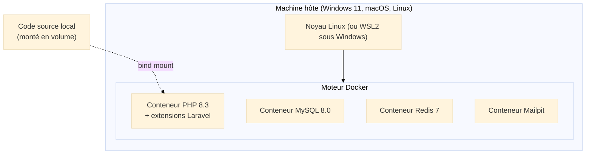
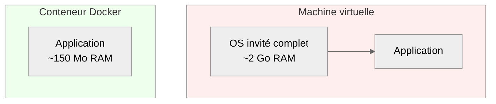
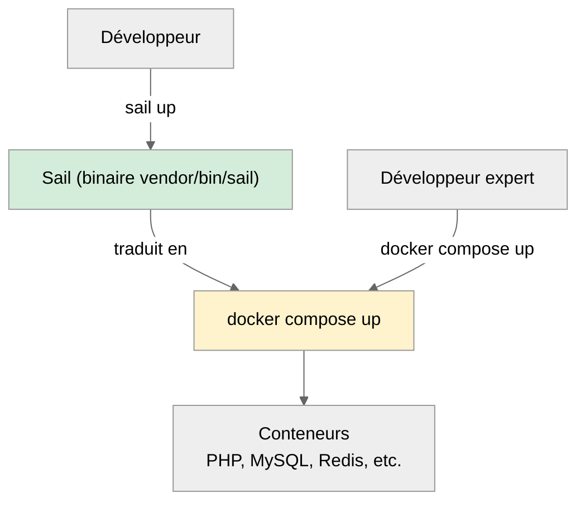
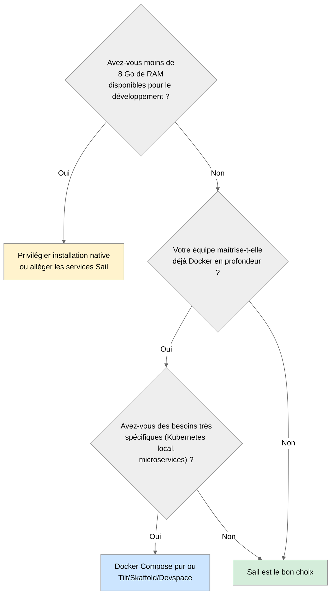
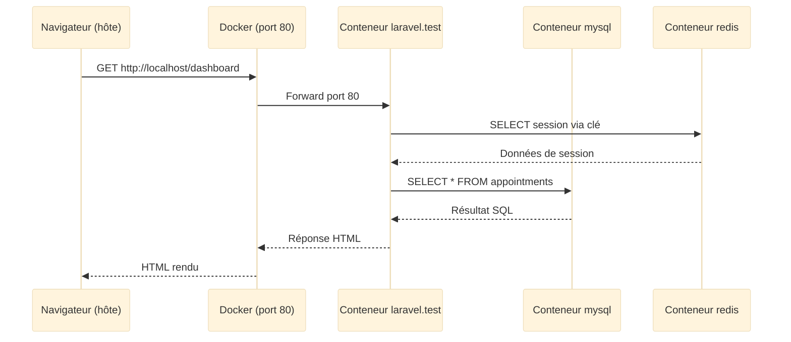

<div class="omny-meta" data-level="Débutant à intermédiaire" data-version="Laravel 13 / Sail 1.x" data-time="45 minutes"></div>

# 05 — Docker et Laravel Sail

!!! abstract "Objectif du module"
    À la fin de cette leçon, vous serez capable de justifier techniquement le choix d'un environnement conteneurisé, de décrire précisément ce que Laravel Sail apporte par-dessus Docker, et de distinguer les cas où Sail est pertinent de ceux où il devient un frein. Vous comprendrez l'architecture interne d'un projet Sail, les services qu'il orchestre, et les points de sécurité à surveiller dès le développement local.

!!! quote "Analogie pédagogique"
    Un environnement de développement non standardisé, c'est un orchestre où chaque musicien accorde son instrument selon son oreille. Tant qu'ils jouent seuls, tout va bien. Le jour du concert collectif, le résultat est cacophonique. Docker, c'est le diapason : tout le monde s'accorde sur la même fréquence. Sail, c'est le chef d'orchestre qui distribue les partitions et lance le tempo sans que chaque musicien ait à apprendre à diriger.

<br>

---

## 1. Le problème réel que résout la standardisation

### 1.1 Le syndrome « ça marche sur ma machine »

Un projet Laravel dépend d'une chaîne précise de versions : PHP, extensions PHP (`pdo_mysql`, `mbstring`, `gd`, `intl`, `redis`, etc.), MySQL ou PostgreSQL, Redis, Node, npm, parfois Meilisearch ou MinIO. Multipliez cela par les variantes d'OS (Windows, macOS Intel, macOS Apple Silicon, Linux Ubuntu, Linux Fedora) et vous obtenez une combinatoire ingérable.

Les symptômes classiques d'un environnement non standardisé sont les suivants[^1] :

| Symptôme observé | Cause sous-jacente |
|---|---|
| Le test passe en local mais échoue en CI | Version de PHP ou d'une extension différente |
| Une migration plante uniquement chez un collègue | Mode SQL MySQL différent (`STRICT_TRANS_TABLES`) |
| Un job Redis est ignoré par un développeur | Service Redis non lancé ou version incompatible |
| Le projet refuse de démarrer après un `git pull` | Nouvelle extension PHP requise non installée localement |
| Le déploiement casse alors que tout va bien en dev | Production sur PHP 8.3, dev sur PHP 8.2 |

Aucune de ces situations n'est imputable au code. Toutes proviennent d'une **dérive d'environnement**.

### 1.2 Le coût caché de la non-standardisation

Selon les retours d'expérience publiés par plusieurs équipes ayant migré vers Docker, le temps d'onboarding d'un nouveau développeur passe en moyenne de **une demi-journée à deux journées** sur un environnement natif, à **moins de trente minutes** sur un environnement conteneurisé documenté. Ce delta n'est pas marginal : sur une équipe de cinq personnes avec un turnover annuel modéré, c'est l'équivalent d'une semaine-développeur récupérée par an.

<br>

---

## 2. Docker : la fondation technique

### 2.1 Qu'est-ce qu'un conteneur

Un conteneur n'est pas une machine virtuelle. C'est un **processus isolé** qui s'exécute directement sur le noyau de l'hôte, avec son propre système de fichiers, son propre réseau et ses propres limites de ressources. Cette isolation est obtenue via les `namespaces` et les `cgroups` du noyau Linux.



*Schéma 1 : architecture d'isolation des conteneurs sur un hôte unique. Le code source reste sur la machine hôte et est exposé aux conteneurs via un volume monté.*

### 2.2 Image, conteneur, volume : le vocabulaire à maîtriser

| Terme | Définition opérationnelle |
|---|---|
| **Image** | Modèle figé en lecture seule. C'est la « recette » de l'environnement (ex : `php:8.3-fpm` avec extensions installées). |
| **Conteneur** | Instance vivante d'une image. On peut le démarrer, l'arrêter, le détruire sans perdre l'image. |
| **Volume** | Espace de stockage persistant indépendant du cycle de vie du conteneur. Indispensable pour les données MySQL. |
| **Bind mount** | Lien direct entre un dossier de l'hôte et un dossier du conteneur. Utilisé pour exposer le code source. |
| **Réseau** | Bus de communication virtuel entre conteneurs. Permet à PHP de joindre MySQL via le nom `mysql` au lieu d'une IP. |

### 2.3 Pourquoi Docker plutôt qu'une VM



*Schéma 2 : comparaison de l'empreinte mémoire. Une VM embarque un OS complet, un conteneur partage celui de l'hôte.*

Un conteneur démarre en quelques secondes, une VM en plusieurs dizaines de secondes. Sur un poste Windows 11 avec 8 Go de RAM, lancer trois VM est impraticable. Lancer cinq conteneurs reste fluide.

<br>

---

## 3. Laravel Sail : l'abstraction officielle

### 3.1 Définition technique

Laravel Sail est une **interface en ligne de commande** distribuée comme dépendance Composer du projet Laravel. Sail n'est pas un outil indépendant : il s'agit d'un wrapper officiel autour de `docker compose`, accompagné d'un fichier `docker-compose.yml` préconfiguré et de scripts d'aide.

D'après la documentation officielle de Laravel 13, Sail est compatible avec macOS, Linux et Windows via WSL2[^2].

### 3.2 Ce que Sail apporte par-dessus Docker brut



*Schéma 3 : Sail est une couche de confort. Un développeur expert peut toujours appeler `docker compose` directement, Sail ne masque rien d'irréversible.*

Concrètement, Sail vous évite d'écrire ce genre de commande au quotidien :

```bash title="Bash - Sans Sail, lancer Artisan dans le conteneur"
# Lourd et verbeux : on doit spécifier le service et l'utilisateur à chaque appel
docker compose exec -u sail laravel.test php artisan migrate
```

*Sans Sail, chaque commande Artisan nécessite la syntaxe complète de Docker Compose.*

```bash title="Bash - Avec Sail, équivalent strict"
# Court, lisible, mémorisable
sail artisan migrate
```

*Avec Sail, la commande retrouve la concision du Laravel natif. C'est la valeur ajoutée principale de l'outil.*

### 3.3 Anatomie d'un projet Sail

Lorsqu'on installe Sail, trois éléments sont ajoutés au projet :

| Fichier ou dossier | Rôle |
|---|---|
| `docker-compose.yml` | Définit les services (PHP, MySQL, Redis...) et leurs relations. C'est le cœur de la configuration. |
| `vendor/bin/sail` | Script shell qui traduit les commandes courtes en appels Docker Compose. |
| `docker/` | Dockerfiles personnalisés par version de PHP (8.1, 8.2, 8.3, 8.4). Vous pouvez les modifier. |

??? abstract "Voir un extrait commenté de docker-compose.yml généré par Sail"

    ```yaml title="docker-compose.yml - Extrait commenté"
    services:
        laravel.test:
            # Image construite à la volée à partir de docker/8.3/Dockerfile
            build:
                context: './vendor/laravel/sail/runtimes/8.3'
                dockerfile: Dockerfile
                args:
                    WWWGROUP: '${WWWGROUP}'  # Évite les problèmes de permissions sous Linux
            image: 'sail-8.3/app'
            ports:
                - '${APP_PORT:-80}:80'        # Expose l'application sur le port hôte
                - '${VITE_PORT:-5173}:${VITE_PORT:-5173}'  # Port pour Vite (hot reload)
            environment:
                WWWUSER: '${WWWUSER}'
                LARAVEL_SAIL: 1
            volumes:
                - '.:/var/www/html'           # Bind mount : code source modifiable en direct
            networks:
                - sail
            depends_on:
                - mysql                       # Sail garantit que MySQL est prêt avant PHP
                - redis
    ```

    *Chaque section a un rôle précis. Les variables `${WWWUSER}` et `${WWWGROUP}` sont injectées par Sail pour aligner l'UID Linux du conteneur sur celui de l'hôte, ce qui évite les fichiers créés en root.*

<br>

---

## 4. Comparaison rigoureuse : natif, Docker pur, Sail

### 4.1 Tableau de décision

| Critère | Installation native | Docker pur | Laravel Sail |
|---|---|---|---|
| Temps d'installation initiale | 1 à 4 heures | 30 à 60 minutes | 5 à 10 minutes |
| Reproductibilité entre développeurs | Faible | Élevée | Élevée |
| Empreinte RAM (projet seul) | ~200 Mo | ~600 Mo | ~600 Mo |
| Courbe d'apprentissage | Faible (PHP/MySQL connus) | Élevée (Docker, Compose) | Faible (commandes Sail) |
| Personnalisation fine | Totale | Totale | Bonne (publier les Dockerfiles) |
| Compatibilité Windows | Difficile (WSL2 conseillé) | Bonne | Excellente |
| Dépendance à un outil tiers | Aucune | Docker | Docker + Composer |
| Alignement avec la prod | Variable | Très bon | Très bon |

### 4.2 Quand Sail n'est pas le bon choix

Sail n'est pas une solution universelle. Il devient discutable dans ces cas :



*Schéma 4 : arbre de décision pour choisir entre les trois approches.*

!!! warning "Pièges courants à connaître"
    - **Sous Windows hors WSL2** : Sail ne fonctionne pas. Il faut impérativement passer par WSL2, sinon les performances des bind mounts sont catastrophiques.
    - **Sur macOS Intel ancien** : la couche de virtualisation de Docker Desktop consomme significativement plus que sur Apple Silicon. Prévoir 4 Go de RAM dédiés à Docker.
    - **Mélanger Sail et installation native** : exécuter `php artisan` en local alors que les migrations ont été lancées dans le conteneur produit des incohérences de droits sur les fichiers générés.
    - **Oublier `WWWUSER`** : sous Linux, sans cette variable, les fichiers créés par le conteneur appartiennent à `root` et bloquent les éditeurs.

<br>

---

## 5. Architecture standard d'un environnement Sail

### 5.1 Services par défaut

Lors de l'installation, Sail propose une sélection de services. Voici ceux qui composent un environnement SaaS typique :

| Service | Rôle | Port hôte par défaut |
|---|---|---|
| `laravel.test` | Conteneur applicatif PHP-FPM + Nginx | 80 |
| `mysql` | Base de données principale | 3306 |
| `redis` | Cache, sessions, queues | 6379 |
| `mailpit` | Capture des emails sortants en développement | 1025 (SMTP), 8025 (UI) |
| `meilisearch` | Moteur de recherche full-text optionnel | 7700 |
| `minio` | Stockage S3 compatible en local | 9000 |

### 5.2 Flux d'une requête en environnement Sail



*Schéma 5 : trajet complet d'une requête à travers les conteneurs. Chaque service est joignable par son nom DNS interne (`mysql`, `redis`).*

<br>

---

## 6. Sécurité dès le développement

La phase de développement est souvent négligée côté sécurité. Plusieurs réflexes doivent être ancrés dès maintenant, en cohérence avec OWASP Top 10:2025[^3].

### 6.1 Configuration dangereuse

```yaml title="docker-compose.yml - Dangereux"
# Exposition de MySQL sur toutes les interfaces réseau de la machine hôte
mysql:
    ports:
        - '3306:3306'  # Accessible depuis le LAN de l'entreprise
    environment:
        MYSQL_ROOT_PASSWORD: root  # Mot de passe trivial
```

*Cette configuration expose la base à tout le réseau local. Sur un WiFi partagé (open space, coworking), n'importe quel poste peut tenter une connexion.*

### 6.2 Configuration sécurisée

```yaml title="docker-compose.yml - Sécurisé"
mysql:
    ports:
        - '127.0.0.1:3306:3306'  # Binding explicite sur la loopback uniquement
    environment:
        # Le mot de passe vient de .env, jamais en dur dans le fichier versionné
        MYSQL_ROOT_PASSWORD: '${DB_PASSWORD}'
        MYSQL_DATABASE: '${DB_DATABASE}'
```

*Le préfixe `127.0.0.1:` restreint l'exposition à la machine locale. Le mot de passe est externalisé dans `.env`, qui doit figurer dans `.gitignore`.*

### 6.3 Points de vigilance

| Risque | Mitigation |
|---|---|
| Image Docker non vérifiée pulled depuis un registre public | Vérifier l'éditeur officiel, épingler une version (`mysql:8.0.35` plutôt que `mysql:latest`) |
| Secrets dans `docker-compose.yml` versionné | Tout passer par `.env`, lui-même `.gitignore` |
| Conteneur tournant en root | Sail utilise déjà `sail:sail` (UID 1000), ne pas le casser |
| Réseau Docker exposé sur le LAN | Binder explicitement sur `127.0.0.1` pour les services internes |
| Logs contenant des données sensibles | Configurer `LOG_LEVEL=warning` en local partagé |

<br>

---

## 7. Personnalisation et publication des fichiers Sail

Par défaut, les Dockerfiles de Sail sont enfouis dans `vendor/`. Pour les modifier durablement, il faut les **publier** dans le projet.

```bash title="Bash - Publier les fichiers de configuration Sail"
# Copie les Dockerfiles et fichiers de service dans le répertoire docker/ du projet
sail artisan sail:publish
```

*Après publication, le dossier `docker/` contient les Dockerfiles versionnés et modifiables. Toute modification survit aux `composer update`.*

Un cas concret : ajouter l'extension PHP `imagick` pour la manipulation d'images avancée.

```dockerfile title="docker/8.3/Dockerfile - Ajout d'imagick"
# Section originale ajoutée par Sail (extensions de base)
RUN apt-get update \
    && apt-get install -y --no-install-recommends \
       # On ajoute libmagickwand-dev pour compiler l'extension PHP imagick
       libmagickwand-dev \
    && pecl install imagick \
    && docker-php-ext-enable imagick \
    && apt-get clean
```

*L'ajout de `libmagickwand-dev` est requis avant la compilation. `apt-get clean` réduit la taille finale de l'image.*

!!! tip "Exercice lié au projet fil rouge"
    Au moment d'aborder la partie 0/26 du SaaS de rendez-vous, vous devrez choisir entre installation native et Sail. Si vous optez pour Sail, listez sur papier les services dont votre projet aura besoin sur les six prochains chapitres (MySQL oui, Redis oui pour les queues plus tard, Mailpit oui pour tester les confirmations de rendez-vous, Meilisearch peut-être pour la recherche client). Cette anticipation évite de devoir reconstruire les conteneurs à chaque chapitre.

<br>

---

## 8. Ressources complémentaires

| Ressource | Type | Pertinence |
|---|---|---|
| Documentation officielle Laravel Sail 13.x | Référence | Indispensable, à consulter avant toute modification de `docker-compose.yml` |
| `docker compose` reference | Référence Docker | Pour comprendre ce que Sail traduit en arrière-plan |
| OWASP Docker Top 10 | Sécurité | Bonnes pratiques de sécurité spécifiques aux conteneurs |
| Talk "Sail vs Herd vs Valet" (Laracon EU) | Vidéo | Comparaison vivante des trois approches dans l'écosystème Laravel |

<br>

## Checkpoint de progression

- [x] Je comprends pourquoi la non-standardisation produit le syndrome « ça marche sur ma machine »
- [x] Je distingue une image, un conteneur, un volume et un réseau Docker
- [x] Je sais ce que Sail apporte concrètement par rapport à `docker compose` brut
- [x] J'ai identifié les cas où Sail n'est pas la bonne réponse
- [x] Je connais les services qui composent un environnement Sail SaaS typique
- [x] Je peux décrire le trajet d'une requête HTTP à travers les conteneurs
- [x] Je sais sécuriser l'exposition réseau des services en développement
- [x] Je sais publier les Dockerfiles pour les modifier durablement

<br>

---

!!! quote "Ce qu'il faut retenir"
    Docker élimine la dérive d'environnement en isolant les services dans des conteneurs reproductibles. Laravel Sail est une couche de confort officielle qui rend Docker accessible sans masquer son fonctionnement : un développeur Sail reste un développeur Docker, simplement plus rapide au quotidien. La standardisation n'est pas un luxe d'équipe expérimentée, c'est une assurance contre les pertes de temps invisibles. Reste à choisir l'approche en lucidité : Sail est excellent pour la majorité des cas, mais une installation native garde sa pertinence sur les machines contraintes en mémoire.

[^1]: Ces symptômes sont régulièrement rapportés sur les forums Laracasts et Stack Overflow autour des tags `laravel`, `docker` et `sail`.
[^2]: Documentation Laravel 13.x, section Sail : https://laravel.com/docs/13.x/sail
[^3]: OWASP Top 10:2025, catégories A02 (Security Misconfiguration) et A03 (Software Supply Chain Failures) particulièrement concernées par la chaîne Docker.

---

[Leçon suivante : 06 — Installation sur macOS →](06-installation-macos.md)