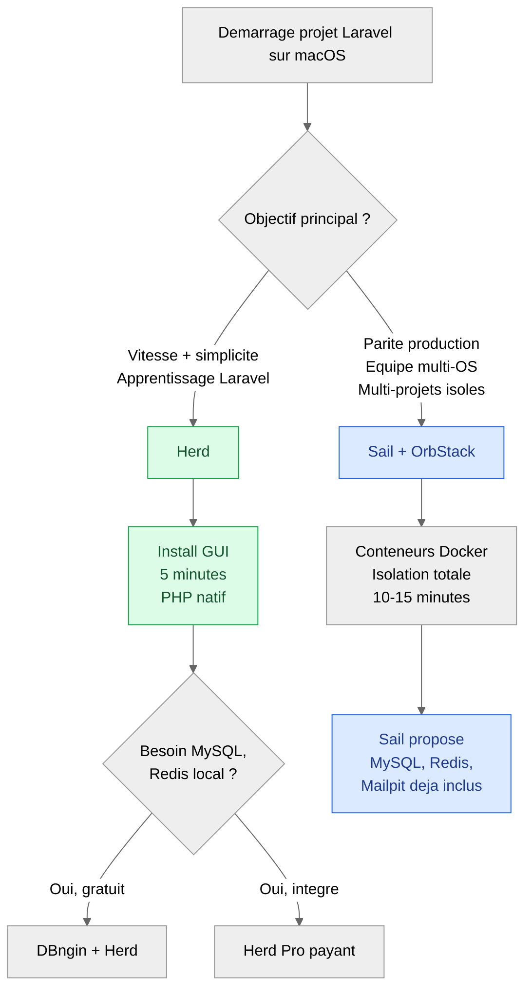
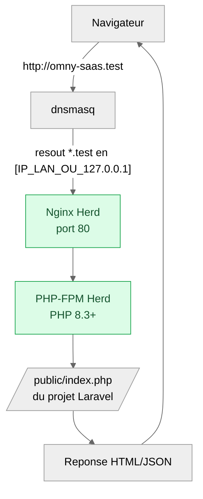

<div class="omny-meta" data-level="Débutant" data-version="Laravel 13.x" data-time="35 min"></div>

# 06 — Installation sur macOS

!!! abstract "Objectif du module"
    À la fin de cette leçon, vous saurez :

    - Choisir entre la voie **native (Herd)** et la voie **conteneurisée (Sail + OrbStack)** selon votre contexte.
    - Installer un environnement Laravel 13 reproductible sur **macOS 13+**, Apple Silicon ou Intel récent.
    - Vérifier que la chaîne **PHP 8.3+ / Composer / Node / Laravel Installer** est fonctionnelle.
    - Créer, démarrer et arrêter une application Laravel sans dépendre d'un outil tiers fragile.
    - Identifier les pièges classiques (ports occupés, conflits Homebrew, droits administrateur).

!!! quote "Analogie pédagogique"
    Installer Laravel sur macOS, c'est comme équiper un atelier. Vous avez deux philosophies : soit vous achetez un **établi déjà monté** (Herd : tout est branché, vous travaillez en cinq minutes), soit vous installez un **container d'atelier mobile** (Sail + OrbStack : isolé du reste de la maison, mais qu'il faut démarrer à chaque session). Aucune n'est supérieure dans l'absolu : l'une est plus rapide à l'usage, l'autre est plus fidèle à l'environnement de production.

<br>

---

## 1. Prérequis et état des lieux

### 1.1 Configuration minimale

| Composant | Minimum recommandé | Commentaire |
|---|---|---|
| Système | macOS 13 (Ventura) ou plus récent | Herd 1.26+ exige macOS 13[^1] |
| Processeur | Apple Silicon (M1/M2/M3/M4) ou Intel récent | ARM64 natif sur Apple Silicon, perfs ×3 sur conteneurs |
| RAM | 8 Go (16 Go conseillés) | Sail seul peut consommer 2 à 4 Go selon les services |
| Disque | 10 Go libres minimum | PHP + Node + images Docker grossissent vite |
| Connexion | Internet stable lors de l'install | Téléchargement de PHP, binaires Herd, images Docker |

### 1.2 Diagnostic préalable

Avant toute installation, vérifiez ce qui existe déjà sur votre Mac. Cela évite les conflits silencieux.

```bash title="Bash - Diagnostic de l'environnement existant"
# Vérifier la version de macOS (Herd exige 13.0+)
sw_vers

# Vérifier l'architecture (arm64 = Apple Silicon, x86_64 = Intel)
uname -m

# Détecter une éventuelle installation PHP système ou Homebrew
which php && php --version

# Détecter Composer
which composer && composer --version

# Détecter Node.js
which node && node --version

# Vérifier si le port 80 est déjà occupé (conflit potentiel avec Herd)
sudo lsof -iTCP:80 -sTCP:LISTEN
```

*Diagnostic complet avant installation. Notez les versions présentes : vous saurez ensuite ce que Herd ou Sail remplace.*

<br>

---

## 2. Choisir sa voie : Herd ou Sail + OrbStack

### 2.1 Logique de décision



### 2.2 Comparatif factuel

| Critère | Herd (natif) | Sail + OrbStack (conteneurs) |
|---|---|---|
| Temps d'installation | 5 à 10 min | 15 à 25 min |
| Consommation RAM au repos | ~150 Mo (Nginx + dnsmasq) | ~800 Mo à 1,5 Go (VM + services) |
| Démarrage de session | Instantané, services en arrière-plan | `sail up` : 5 à 15 s |
| Parité avec la production Linux | Moyenne (Nginx local, pas containerisé) | Élevée (Debian + PHP-FPM + MySQL identiques) |
| Bases de données locales | Externes (DBngin gratuit, ou Herd Pro) | MySQL/PostgreSQL/Redis inclus dans Sail |
| Multi-projets simultanés | Excellent (un `cd` suffit) | Bon mais coûteux en RAM si tout est lancé |
| Cas d'usage idéal | Apprentissage, prototypage, dev solo rapide | Équipe, projet long, déploiement Docker prévu |

!!! info "Recommandation pour ce cursus"
    Pour le **chapitre 0**, nous utiliserons **Herd** par défaut : la friction est minimale, vous écrivez du Laravel en moins de dix minutes. À partir du **chapitre 24 (Octane et performance)** et du **chapitre 26 (déploiement IaaS)**, nous basculerons sur **Sail + OrbStack** pour reproduire le comportement de production. Les deux voies sont documentées ici afin que vous puissiez basculer à tout moment.

<br>

---

## 3. Voie A — Installation avec Laravel Herd

Herd est l'environnement officiel Laravel pour macOS depuis 2023. Il embarque PHP, Nginx, dnsmasq, Composer, le Laravel Installer, Node.js et npm dans une seule application native.

### 3.1 Téléchargement et installation

```bash title="Bash - Étape 1 : ouvrir Herd dans le navigateur"
# Ouvrir la page officielle Herd
# (alternative : aller manuellement sur https://herd.laravel.com)
open https://herd.laravel.com
```

*Téléchargez le `.dmg`. La version stable au moment de la rédaction est Herd 1.26.1[^2].*

??? abstract "Étapes graphiques détaillées (à dérouler)"
    1. Double-cliquez sur le fichier `Herd-1.26.x.dmg` téléchargé.
    2. Glissez l'icône **Herd** dans le dossier **Applications**.
    3. Ouvrez Herd depuis **Applications** (clic droit > Ouvrir si Gatekeeper bloque la première fois).
    4. L'onboarding télécharge la dernière version stable de PHP (8.3 ou 8.4 selon la build).
    5. Saisissez votre mot de passe administrateur lorsque Herd installe son service en arrière-plan. Ce service gère Nginx et dnsmasq.
    6. Une fois l'onboarding terminé, Herd ajoute automatiquement les binaires `herd`, `php`, `composer`, `laravel` et `node` à votre `PATH`.

### 3.2 Vérification de l'installation

```bash title="Bash - Vérification post-installation Herd"
# Redémarrer le terminal pour recharger le PATH, puis :
herd --version       # Doit afficher 1.26.x ou supérieur
php --version        # Doit afficher PHP 8.3.x ou 8.4.x
composer --version   # Composer 2.7+ attendu
laravel --version    # Laravel Installer 5.x
node --version       # Node 20.x ou 22.x LTS
npm --version        # npm 10.x ou 11.x
```

*Si une commande retourne `command not found`, fermez complètement le terminal (Cmd+Q) et rouvrez-le. Herd modifie `~/.zshrc` ou `~/.bash_profile`.*

### 3.3 Créer un premier projet Laravel

Herd crée automatiquement un répertoire **parqué** (`parked`) dans `~/Herd`. Tout dossier Laravel placé à l'intérieur est servi sur le domaine `.test` sans configuration supplémentaire.

```bash title="Bash - Création d'un projet Laravel servi par Herd"
# Se placer dans le répertoire parqué par Herd
cd ~/Herd

# Créer un nouveau projet Laravel via l'installer officiel
laravel new omny-saas

# Le projet est immédiatement accessible sur :
# http://omny-saas.test
open http://omny-saas.test
```

*Aucun `php artisan serve` n'est nécessaire avec Herd : Nginx sert le projet en permanence tant que Herd tourne.*

### 3.4 Diagramme de flux d'une requête sous Herd



<br>

---

## 4. Voie B — Installation avec OrbStack + Laravel Sail

Sur macOS en 2026, **OrbStack** remplace avantageusement Docker Desktop : démarrage en moins d'une seconde, consommation mémoire 3 à 5 fois inférieure, performances de bind-mount proches du natif[^3]. Pour un usage personnel non-commercial, OrbStack est gratuit ; pour un usage commercial, il facture environ 8 à 10 USD/mois/poste.

### 4.1 Installer OrbStack

```bash title="Bash - Installation d'OrbStack via Homebrew"
# Installer Homebrew si absent (gestionnaire de paquets macOS)
/bin/bash -c "$(curl -fsSL https://raw.githubusercontent.com/Homebrew/install/HEAD/install.sh)"

# Installer OrbStack
brew install --cask orbstack

# Lancer OrbStack (première exécution : autoriser dans les Préférences Système)
open -a OrbStack

# Vérifier que la CLI Docker répond
docker --version
docker compose version
```

*OrbStack expose la même API que Docker. Aucun script Sail ne doit être modifié.*

### 4.2 Créer un projet Laravel avec Sail

```bash title="Bash - Création d'un projet Laravel via Sail (sans PHP local)"
# Se placer dans un répertoire de travail
cd ~/Projets

# Créer un projet Laravel + Sail en une commande (utilise un conteneur jetable)
# Le paramètre with= sélectionne les services à provisionner
curl -s "https://laravel.build/omny-saas?with=mysql,redis,mailpit" | bash

# Entrer dans le projet
cd omny-saas

# Démarrer la pile Sail en arrière-plan
./vendor/bin/sail up -d

# Accessible sur :
open http://localhost
```

*Sail provisionne PHP 8.3+, MySQL 8, Redis et Mailpit dans des conteneurs séparés mais sur un même réseau Docker.*

### 4.3 Aliaser `sail` pour la productivité

Taper `./vendor/bin/sail` douze fois par heure n'est pas viable. Définissez un alias permanent.

```bash title="Bash - Ajouter un alias sail dans ~/.zshrc"
# Ouvrir le fichier de configuration du shell
echo "alias sail='[ -f sail ] && sh sail || sh vendor/bin/sail'" >> ~/.zshrc

# Recharger la configuration
source ~/.zshrc

# Désormais, depuis n'importe quel projet Sail :
sail up -d        # Démarre la pile
sail artisan migrate  # Exécute artisan dans le conteneur
sail down         # Arrête la pile
```

*Cet alias détecte automatiquement si vous êtes dans un projet Sail et invoque le bon binaire.*

<br>

---

## 5. Sécurité opérationnelle de l'installation

Une installation locale est rarement perçue comme un risque. Elle peut pourtant en créer.

### 5.1 Points à surveiller

| Risque | Vecteur | Contre-mesure |
|---|---|---|
| Exposition involontaire sur le réseau local | `php artisan serve --host=0.0.0.0` sans firewall | Activer le pare-feu macOS et limiter à l'IP LAN précise |
| Binaire PHP système obsolète conflictuel | PHP fourni par Apple ou ancien Homebrew | Forcer le PATH Herd en premier, ou désinstaller via `brew uninstall php` |
| Image Docker non vérifiée | Image tierce dans un `docker-compose.override.yml` | Utiliser uniquement les images officielles Laravel Sail |
| Mot de passe MySQL par défaut | Sail utilise `password` comme défaut | Modifier `DB_PASSWORD` dans `.env` dès le premier commit |
| Fuite via `.env` | `.env` poussé sur Git | Vérifier que `.env` est bien dans `.gitignore` (étape leçon 10) |

### 5.2 Comparaison d'une exposition réseau

```php title="PHP/Artisan - Exposition locale stricte vs exposition LAN contrôlée"
// Dangereux : expose Laravel sur toutes les interfaces réseau
// Tout appareil sur le Wi-Fi peut accéder au site sans authentification
// php artisan serve --host=0.0.0.0 --port=8000

// Sécurisé : expose uniquement sur une IP LAN précise
// (à utiliser dans la leçon 9 du chapitre 0 pour tester depuis un autre appareil)
// php artisan serve --host=192.168.1.42 --port=8000
```

*La nuance est mince mais critique : `0.0.0.0` ouvre à tout le réseau, une IP précise restreint à l'interface concernée.*

<br>

---

## 6. Pièges classiques et résolutions

!!! warning "Pièges fréquents lors de l'installation macOS"

    **Port 80 déjà utilisé**

    : Apache préinstallé sur macOS occupe parfois le port 80.
      Solution : `sudo apachectl stop` puis `sudo launchctl unload -w /System/Library/LaunchDaemons/org.apache.httpd.plist`.

    **PHP Homebrew prend le pas sur Herd**

    : Si vous aviez installé `brew install php` auparavant, le `PATH` peut prioriser l'ancien binaire.
      Solution : `brew unlink php` ou ajouter `export PATH="/Users/$(whoami)/Library/Application Support/Herd/bin:$PATH"` en tête de `~/.zshrc`.

    **`laravel new` échoue avec "command not found"**

    : Le terminal n'a pas rechargé son `PATH` après l'install.
      Solution : Cmd+Q sur Terminal/iTerm2, puis réouvrir. Vérifier avec `echo $PATH`.

    **OrbStack bloqué par Gatekeeper**

    : Premier lancement refusé avec "developer cannot be verified".
      Solution : Préférences Système > Confidentialité et Sécurité > "Ouvrir quand même".

    **Sail démarre mais le site renvoie une erreur 502**

    : MySQL n'a pas fini d'initialiser quand Laravel tente la connexion.
      Solution : attendre 30 s puis `sail restart`, vérifier `sail logs mysql`.

    **Conflit entre Herd et Sail simultanés**

    : Les deux tentent d'utiliser le port 80.
      Solution : ne lancer qu'un seul environnement à la fois, ou modifier `APP_PORT=8080` dans `.env` du projet Sail.

<br>

---

## 7. Exercice pratique

!!! tip "Exercice — Préparer la machine pour le SaaS fil rouge"

    **Énoncé**

    1. Installer Herd sur votre Mac (ou OrbStack + Sail si vous préférez la voie B).
    2. Créer un projet nommé `omny-saas` dans le bon répertoire.
    3. Confirmer l'accès via le navigateur sur `http://omny-saas.test` (Herd) ou `http://localhost` (Sail).
    4. Modifier le fichier `resources/views/welcome.blade.php` : remplacer le titre par `Omny SaaS - Plateforme RDV`.
    5. Vérifier le rechargement automatique de la page.

    **Critères de validation**

    - `php --version` ou `sail php --version` retourne PHP 8.3+.
    - `laravel --version` retourne la version 5.x ou supérieure.
    - La page d'accueil affiche le nouveau titre sans intervention manuelle (cache).
    - Aucun warning ou erreur dans les logs (`storage/logs/laravel.log` ou `sail logs`).

<br>

---

## 8. Checkpoint de progression

- [x] J'ai compris la différence entre la voie native Herd et la voie conteneurisée Sail + OrbStack.
- [x] J'ai vérifié les prérequis macOS de ma machine (version, architecture, RAM, ports libres).
- [x] J'ai installé Herd **ou** OrbStack + Sail selon ma stratégie.
- [x] J'ai confirmé la chaîne `php / composer / laravel / node` avec les commandes de vérification.
- [x] J'ai créé un premier projet Laravel accessible depuis le navigateur.
- [x] J'ai identifié les pièges classiques et je sais où chercher en cas d'incident.

<br>

---

## 9. Ressources complémentaires

- Documentation officielle Laravel — Installation : <https://laravel.com/docs/13.x/installation>
- Documentation Herd macOS : <https://herd.laravel.com/docs/macos/getting-started/installation>
- Documentation OrbStack : <https://docs.orbstack.dev>
- Documentation Laravel Sail : <https://laravel.com/docs/13.x/sail>
- Comparatif Herd / Valet / Sail : <https://benjamincrozat.com/laravel-herd>

<br>

---

!!! quote "Ce qu'il faut retenir"
    Sur macOS en 2026, **Herd est la voie la plus rapide** pour apprendre Laravel : zéro friction, environnement officiel, performances natives. **OrbStack + Sail** devient pertinent dès que la **parité avec la production** ou le **travail en équipe Docker** prime sur la rapidité d'installation. Les deux approches cohabitent sans conflit majeur, à condition de ne pas les exécuter simultanément sur le port 80. Pour le cursus Omny SaaS, **Herd est le défaut jusqu'au chapitre 23**, après quoi nous basculons sur Sail pour préparer le déploiement.

[^1]: Source : documentation officielle Herd, section "Installation", exigence macOS 13.0+ pour les versions 1.22 et ultérieures.
[^2]: Version stable au moment de la rédaction : Herd 1.26.1 publiée en mars 2026.
[^3]: Benchmarks communautaires publiés en 2026 sur macOS Tahoe 26.4 avec puces M3/M4 : OrbStack atteint 75 à 95 % des performances natives en lecture de volume contre 25 à 40 % pour Docker Desktop.

<br>

---

> **Prochaine étape** : [07 — Installation sur Linux](07-installation-linux.md)