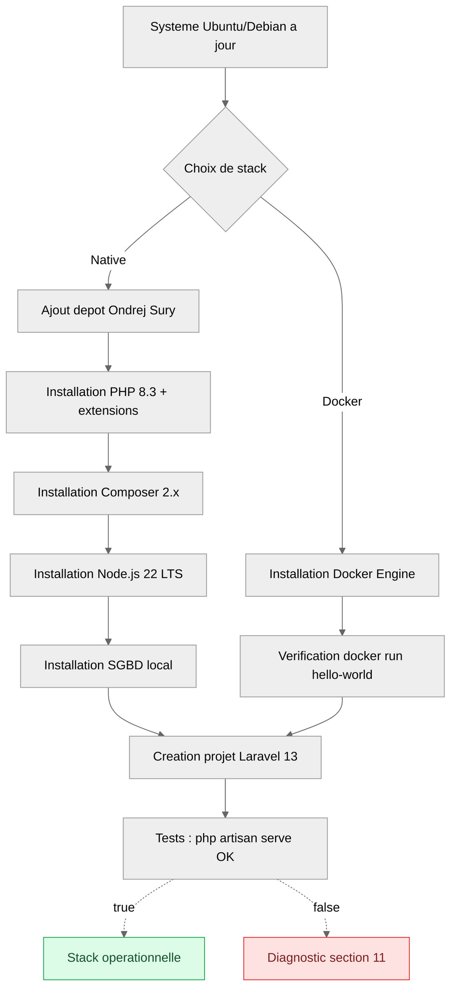

# 07 — Installation sur Linux

<div class="omny-meta" data-level="Débutant" data-version="Laravel 13.x" data-time="45 min"></div>

!!! abstract "Objectif du module"
    Mettre en place un poste de développement Laravel 13 complet sur une distribution Linux moderne (Ubuntu 24.04 LTS ou Debian 12). À la fin de cette leçon, vous disposerez d'une stack fonctionnelle : **PHP 8.3+**, **Composer 2.x**, **Node.js 20 LTS**, un **SGBD** local (PostgreSQL ou MariaDB), et **Docker Engine** prêt pour Laravel Sail. Vous saurez vérifier chaque maillon, comprendre ce que vous installez et pourquoi.

<br>

---

## 1. Pourquoi Linux est la cible naturelle de Laravel

Laravel s'exécute en production sur des serveurs Linux dans l'écrasante majorité des cas (Nginx ou Apache + PHP-FPM). Installer Laravel sur un poste Linux, c'est donc **réduire l'écart entre votre machine de développement et la production**. Moins d'écart, moins de bugs « ça marche chez moi ».

Vous avez deux approches, non exclusives :

| Approche | Quand la choisir | Coût mémoire |
|---|---|---|
| **Native** (PHP, Composer, Node directement sur l'hôte) | Vous travaillez seul, vous voulez une performance maximale, vous maîtrisez la machine | Très faible |
| **Docker + Laravel Sail** | Vous travaillez en équipe, vous voulez une parité stricte avec la production conteneurisée, vous changez souvent de version PHP | Modéré (~1 à 2 Go selon services) |

!!! info "Recommandation"
    Installez **les deux**. La stack native sert pour les scripts rapides, les tests Pest locaux et la lecture de logs. Sail sert quand vous voulez isoler un projet, basculer entre PHP 8.3 et 8.4, ou reproduire un environnement type production.

<br>

---

## 2. Distribution cible et prérequis

### 2.1 Choisir la distribution

Cette leçon prend **Ubuntu 24.04 LTS (Noble Numbat)** comme référence, car c'est la cible majoritaire des hébergeurs et la plus documentée. Les commandes sont quasiment identiques sur **Debian 12 (Bookworm)** : remplacez simplement le dépôt `ppa:ondrej/php` par le dépôt Sury de Debian (voir section 12).

| Distribution | PHP par défaut | Compatible Laravel 13 sans dépôt tiers | Recommandation |
|---|---|---|---|
| Ubuntu 24.04 LTS | PHP 8.3 | Oui | Choix par défaut |
| Ubuntu 26.04 LTS | PHP 8.5 | Oui | Très récent, à privilégier si dispo |
| Debian 12 | PHP 8.2 | Non, nécessite dépôt Sury | Solide en serveur |
| Fedora 41+ | PHP 8.3+ | Oui via `dnf` | Pour utilisateurs avancés |

!!! warning "Laravel 13 et PHP"
    Laravel 13 **exige PHP 8.3 minimum** et supporte PHP 8.3, 8.4 et 8.5. Si votre distribution fournit PHP 8.2 ou inférieur par défaut, vous **devez** passer par un dépôt tiers maintenu (Ondřej Surý). N'utilisez **jamais** un build PHP compilé à la main pour le développement quotidien : pas de sécurité, pas de maintenance.

### 2.2 Prérequis matériels réalistes

| Ressource | Minimum viable | Confortable |
|---|---|---|
| RAM | 4 Go | 8 Go et plus |
| Disque libre | 10 Go | 30 Go |
| CPU | 2 cœurs | 4 cœurs |

Sur une machine de 8 Go avec Docker actif, fermez les onglets de navigateur superflus avant de lancer `sail up`. Le démon Docker, PHP-FPM et le SGBD se partagent la RAM.

<br>

---

## 3. Vue d'ensemble de la procédure



*Schéma de progression — chaque étape conditionne la suivante. Ne sautez pas la mise à jour initiale.*

<br>

---

## 4. Mise à jour du système

Avant toute installation, on aligne l'index APT et on applique les correctifs en attente. C'est la base de l'hygiène d'un poste de développement.

```bash title="Bash - Mise à jour du système Ubuntu/Debian"
# Synchronisation de l'index des paquets avec les dépôts distants
sudo apt update

# Application des mises à jour disponibles (sans modification de version majeure)
sudo apt upgrade -y

# Suppression des paquets devenus inutiles (anciens noyaux, dépendances orphelines)
sudo apt autoremove -y
```

*Exécutez ces trois commandes systématiquement avant d'ajouter un nouveau dépôt. Un système non à jour cumule les conflits de signature GPG.*

```bash title="Bash - Outillage minimal indispensable"
# ca-certificates  : autorités de certification à jour pour HTTPS
# curl             : récupération de scripts d'installation
# git              : indispensable pour cloner et versionner
# unzip            : extraction d'archives Composer et Laravel
# gnupg            : vérification des signatures de dépôts
# lsb-release      : détection automatique du nom de version (noble, bookworm...)
sudo apt install -y ca-certificates curl git unzip gnupg lsb-release software-properties-common
```

*Ces paquets sont consommés à chaque étape suivante. Les installer en lot évite les retours en arrière.*

<br>

---

## 5. Installation de PHP 8.3 et de ses extensions

### 5.1 Ajouter le dépôt Ondřej Surý

Le dépôt officiel d'Ubuntu fige une seule version de PHP par release. Le dépôt **Ondřej Surý** (`ppa:ondrej/php`) est maintenu par le mainteneur Debian de PHP et fournit toutes les versions co-installables (8.1, 8.2, 8.3, 8.4, 8.5) avec leurs extensions.

```bash title="Bash - Ajout du dépôt Ondřej Surý sur Ubuntu"
# Ajout du PPA dans /etc/apt/sources.list.d/
# L'option -y évite la confirmation interactive
sudo add-apt-repository -y ppa:ondrej/php

# Resynchronisation de l'index APT pour intégrer le nouveau dépôt
sudo apt update
```

*Sur Debian, ce PPA n'existe pas : utilisez le dépôt `https://packages.sury.org/php/` (procédure section 12).*

### 5.2 Installer PHP 8.3 et les extensions requises par Laravel

Laravel 13 dépend d'un jeu d'extensions précis. Les installer toutes d'un coup évite les erreurs cryptiques en cours de projet (un `Class "DOMDocument" not found` est presque toujours une extension `xml` manquante).

```bash title="Bash - Installation de PHP 8.3 et extensions Laravel"
sudo apt install -y \
  php8.3 \
  php8.3-cli \
  php8.3-fpm \
  php8.3-common \
  php8.3-mysql \
  php8.3-pgsql \
  php8.3-sqlite3 \
  php8.3-redis \
  php8.3-mbstring \
  php8.3-xml \
  php8.3-curl \
  php8.3-zip \
  php8.3-gd \
  php8.3-bcmath \
  php8.3-intl \
  php8.3-opcache \
  php8.3-readline
```

*Chaque extension a une raison d'être : `mbstring` pour les chaînes UTF-8, `bcmath` pour les calculs financiers de Cashier, `intl` pour la localisation, `gd` pour le traitement d'images, `opcache` pour la performance.*

### 5.3 Vérifier l'installation

```bash title="Bash - Contrôle de version et extensions"
# Doit afficher PHP 8.3.x — toute version inférieure bloquera Laravel 13
php -v

# Liste les extensions chargées ; vérifiez la présence de mbstring, xml, curl, pdo_mysql
php -m | grep -E "mbstring|xml|curl|pdo_mysql|bcmath|intl|gd"
```

*Si `php -v` retourne PHP 8.2, c'est qu'une ancienne installation prend le pas. Voir section 11.2.*

<br>

---

## 6. Installation de Composer

Composer est le gestionnaire de dépendances PHP. Sans lui, pas de `laravel new`, pas de packages tiers. On installe la version officielle, pas le paquet APT (souvent figé).

```bash title="Bash - Installation de Composer 2.x en global"
# Téléchargement du script d'installation officiel dans /tmp
cd /tmp
curl -sS https://getcomposer.org/installer -o composer-setup.php

# Récupération du hash SHA-384 publié par getcomposer.org
HASH=$(curl -sS https://composer.github.io/installer.sig)

# Vérification d'intégrité : si le hash ne correspond pas, on s'arrête net
php -r "if (hash_file('SHA384', 'composer-setup.php') === '$HASH') { echo 'Installer OK'; } else { echo 'Installer CORROMPU'; exit(1); } echo PHP_EOL;"

# Installation globale dans /usr/local/bin avec le nom 'composer'
sudo php composer-setup.php --install-dir=/usr/local/bin --filename=composer

# Nettoyage
rm composer-setup.php

# Vérification finale
composer --version
```

*La vérification de hash n'est pas optionnelle. Un installeur Composer compromis donne un accès root complet à votre poste via les scripts post-install.*

!!! warning "Ne lancez jamais `sudo composer install` dans un projet"
    Composer doit être appelé en utilisateur normal. Lui donner `sudo` change les permissions des fichiers `vendor/` en root et casse les écritures ultérieures du framework.

<br>

---

## 7. Installation de Node.js 22 LTS et NPM

Laravel 13 utilise **Vite** pour compiler les assets frontend (Tailwind, Livewire, JS). Vite tourne sur Node.js. La version 20 LTS est la cible stable jusqu'en avril 2026 ; la 22 LTS est désormais le nouveau standard long-terme et un choix valable.

```bash title="Bash - Installation de Node.js 22 LTS via NodeSource"
# Récupération et exécution du script officiel NodeSource pour Node 22.x
# Le pipe direct est ici acceptable car la source est officielle et HTTPS
curl -fsSL https://deb.nodesource.com/setup_22.x | sudo -E bash -

# Installation de nodejs (qui embarque npm)
sudo apt install -y nodejs

# Vérification
node --version    # doit afficher v22.x.x
npm --version     # doit afficher 10.x ou plus
```

*Évitez le paquet `nodejs` du dépôt Ubuntu par défaut : il fige une version ancienne et incompatible avec les outils Vite récents.*

!!! info "Alternative : nvm"
    Si vous prévoyez de jongler entre plusieurs versions de Node selon les projets, installez **nvm** (Node Version Manager). C'est l'équivalent de `phpbrew` côté JavaScript. Hors scope de cette leçon.

<br>

---

## 8. Installation d'une base de données locale

Laravel 13 supporte nativement SQLite, MySQL/MariaDB, PostgreSQL, SQL Server. Pour le projet fil rouge SaaS, **PostgreSQL** est un excellent choix (typage strict, JSONB, performant). MariaDB reste pertinent pour la compatibilité maximale.

### 8.1 Option A — PostgreSQL 16 (recommandé)

```bash title="Bash - Installation et démarrage de PostgreSQL"
# Installation du serveur et du client
sudo apt install -y postgresql postgresql-contrib

# Activation au démarrage et lancement immédiat
sudo systemctl enable --now postgresql

# Création d'un utilisateur et d'une base pour le projet
# -- on bascule sur l'utilisateur système 'postgres' qui gère le SGBD
sudo -u postgres psql <<EOF
CREATE USER laravel WITH PASSWORD 'motdepasse_a_changer';
CREATE DATABASE saas_omny OWNER laravel;
GRANT ALL PRIVILEGES ON DATABASE saas_omny TO laravel;
EOF
```

*Remplacez `motdepasse_a_changer` par un mot de passe robuste (16 caractères, généré par `openssl rand -base64 24`). Ce mot de passe ira dans le fichier `.env` du projet, jamais dans Git.*

### 8.2 Option B — MariaDB 10.11

```bash title="Bash - Installation et sécurisation de MariaDB"
sudo apt install -y mariadb-server
sudo systemctl enable --now mariadb

# Script interactif : retire les comptes anonymes, désactive le login root distant,
# supprime la base 'test' et recharge les privilèges
sudo mysql_secure_installation
```

*Répondez `Y` à toutes les questions de sécurisation, sauf si vous savez ce que vous faites. Ne sautez jamais cette étape, même en local.*

<br>

---

## 9. Installation de Docker Engine pour Laravel Sail

Docker Desktop n'existe pas sur Linux serveur ; on installe **Docker Engine** directement, c'est plus léger et c'est le standard.

```bash title="Bash - Installation de Docker Engine selon la procédure officielle"
# Création du répertoire pour la clé GPG du dépôt Docker
sudo install -m 0755 -d /etc/apt/keyrings

# Téléchargement et stockage de la clé GPG officielle de Docker
sudo curl -fsSL https://download.docker.com/linux/ubuntu/gpg \
  -o /etc/apt/keyrings/docker.asc
sudo chmod a+r /etc/apt/keyrings/docker.asc

# Ajout du dépôt Docker à la liste APT, avec détection automatique de la version Ubuntu
echo \
  "deb [arch=$(dpkg --print-architecture) signed-by=/etc/apt/keyrings/docker.asc] \
  https://download.docker.com/linux/ubuntu \
  $(. /etc/os-release && echo "$VERSION_CODENAME") stable" | \
  sudo tee /etc/apt/sources.list.d/docker.list > /dev/null

sudo apt update

# Installation : moteur, CLI, conteneurs runtime, Buildx et Compose v2
sudo apt install -y docker-ce docker-ce-cli containerd.io docker-buildx-plugin docker-compose-plugin

# Vérification : doit afficher la version
docker --version
docker compose version
```

*Compose v2 est livré comme plugin Docker (`docker compose ...`, sans tiret), pas comme binaire séparé `docker-compose`.*

### 9.1 Permettre à votre utilisateur d'utiliser Docker sans sudo

```bash title="Bash - Ajout de l'utilisateur au groupe docker"
# Ajout au groupe docker pour exécuter la CLI sans sudo
sudo usermod -aG docker $USER

# Application immédiate du nouveau groupe dans la session courante
# (alternative : se déconnecter/reconnecter)
newgrp docker

# Test : doit télécharger et exécuter un conteneur minimal sans erreur
docker run --rm hello-world
```

!!! warning "Implication sécurité du groupe docker"
    Tout utilisateur dans le groupe `docker` peut monter `/` en lecture-écriture dans un conteneur et obtenir un accès root équivalent à la machine. **Ne mettez jamais un compte non maîtrisé dans ce groupe.** Sur un poste de développement personnel, c'est acceptable ; sur un serveur partagé, jamais.

<br>

---

## 10. Création et lancement du premier projet Laravel 13

Deux chemins selon votre choix d'approche.

### 10.1 Voie native

```bash title="Bash - Création d'un projet Laravel 13 en natif"
# Création du dossier de travail
cd ~
mkdir -p Code && cd Code

# Création d'un projet Laravel 13 via Composer
# Le suffixe ^13.0 force la version majeure 13
composer create-project laravel/laravel:^13.0 saas-omny

cd saas-omny

# Génération de la clé d'application (remplit APP_KEY dans .env)
php artisan key:generate

# Lancement du serveur de développement intégré
php artisan serve
```

*Le serveur écoute sur `http://127.0.0.1:8000`. Pour exposer sur le réseau local (autres machines), voir la leçon 09.*

### 10.2 Voie Docker via Laravel Sail

```bash title="Bash - Création d'un projet Laravel 13 avec Sail"
cd ~/Code

# L'installer Sail prépare un docker-compose.yml prêt à l'emploi
# Le paramètre 'with' choisit les services (ici : postgres, redis, mailpit)
curl -s "https://laravel.build/saas-omny?with=pgsql,redis,mailpit" | bash

cd saas-omny

# Démarrage des conteneurs en arrière-plan
./vendor/bin/sail up -d

# Génération de la clé d'application via le conteneur
./vendor/bin/sail artisan key:generate
```

*Création d'un alias `sail` recommandé : `alias sail='[ -f sail ] && sh sail || sh vendor/bin/sail'` dans votre `~/.bashrc` ou `~/.zshrc`.*

<br>

---

## 11. Sécurité opposée : exemples à connaître

Cette section illustre des erreurs fréquentes en installation Linux, opposées à leur version sûre. Vous apprenez par l'attaque, donc vous voyez le piège avant le correctif.

### 11.1 Téléchargement de scripts d'installation

**Dangereux**

```bash title="Bash - Téléchargement aveugle (à NE PAS faire)"
# Pipe direct depuis une source non vérifiée : si le site est compromis,
# vous exécutez du code arbitraire en root sur votre machine
curl http://exemple-douteux.tld/install.sh | sudo bash
```

*Le pipe vers `sudo bash` exécute en root le contenu d'une URL HTTP non chiffrée. Une attaque MITM (Wi-Fi public, DNS empoisonné) suffit à compromettre la machine.*

**Sûr**

```bash title="Bash - Téléchargement, inspection, exécution"
# Téléchargement HTTPS dans un fichier temporaire
curl -fsSL https://source-officielle.tld/install.sh -o /tmp/install.sh

# Inspection du contenu avant exécution
less /tmp/install.sh

# Vérification éventuelle d'un hash publié par l'éditeur
sha256sum /tmp/install.sh

# Exécution uniquement après contrôle
sudo bash /tmp/install.sh
```

*La règle : HTTPS obligatoire, lecture du script, vérification du hash quand l'éditeur le publie. Aucune exception sur un poste de développement professionnel.*

### 11.2 Permissions du dossier projet

**Dangereux**

```bash title="Bash - Permissions trop ouvertes (à NE PAS faire)"
# 777 = lecture, écriture, exécution pour tout le monde
# Résultat : n'importe quel processus système peut modifier le code applicatif
sudo chmod -R 777 /var/www/saas-omny
```

*Le `chmod 777` est le réflexe paresseux qui résout temporairement les erreurs de permissions et ouvre durablement la machine. À bannir.*

**Sûr**

```bash title="Bash - Permissions Laravel standard"
# Propriété : votre utilisateur (lecture/écriture) et le groupe www-data (lecture)
sudo chown -R $USER:www-data /var/www/saas-omny

# Permissions de base : 755 sur les dossiers, 644 sur les fichiers
sudo find /var/www/saas-omny -type d -exec chmod 755 {} \;
sudo find /var/www/saas-omny -type f -exec chmod 644 {} \;

# Exceptions : storage/ et bootstrap/cache/ doivent être écrivibles par le serveur web
sudo chmod -R 775 /var/www/saas-omny/storage
sudo chmod -R 775 /var/www/saas-omny/bootstrap/cache
```

*Le couple `chown` + permissions chirurgicales conserve l'isolement entre processus tout en laissant Laravel écrire ses logs et son cache.*

<br>

---

## 12. Cas Debian 12 et autres distributions

??? abstract "Procédure Debian 12 (Bookworm)"
    Le dépôt PPA d'Ondřej Surý n'existe pas sur Debian. Utilisez le dépôt Sury équivalent.

    ```bash title="Bash - Installation PHP 8.3 sur Debian 12"
    # Outillage nécessaire à l'ajout de dépôt signé
    sudo apt install -y apt-transport-https lsb-release ca-certificates curl

    # Téléchargement de la clé GPG du dépôt Sury
    sudo curl -sSLo /etc/apt/trusted.gpg.d/php.gpg https://packages.sury.org/php/apt.gpg

    # Ajout du dépôt Sury PHP pour Debian
    echo "deb https://packages.sury.org/php/ $(lsb_release -sc) main" | \
      sudo tee /etc/apt/sources.list.d/php.list

    sudo apt update
    sudo apt install -y php8.3 php8.3-cli php8.3-fpm php8.3-mbstring \
      php8.3-xml php8.3-curl php8.3-zip php8.3-mysql php8.3-pgsql \
      php8.3-bcmath php8.3-intl php8.3-gd
    ```

    *Le reste de la procédure (Composer, Node, Docker, projet Laravel) est identique.*

??? abstract "Procédure Fedora 41+"
    ```bash title="Bash - Installation PHP sur Fedora"
    # Fedora fournit PHP 8.3+ directement via dnf
    sudo dnf install -y php php-cli php-fpm php-mbstring php-xml php-mysqlnd \
      php-pgsql php-pdo php-zip php-gd php-bcmath php-intl php-opcache
    ```

??? abstract "Procédure Arch Linux"
    ```bash title="Bash - Installation PHP sur Arch"
    # Arch suit le rolling release, PHP est toujours récent
    sudo pacman -S --noconfirm php php-fpm php-gd php-intl composer nodejs npm
    ```

<br>

---

## 13. Vérification globale de la stack

```bash title="Bash - Diagnostic complet en une commande"
# Compose un mini-rapport de votre environnement de développement
echo "=== Diagnostic Laravel 13 ==="
echo "PHP        : $(php -v | head -n1)"
echo "Composer   : $(composer --version)"
echo "Node       : $(node --version)"
echo "NPM        : $(npm --version)"
echo "Docker     : $(docker --version 2>/dev/null || echo 'non installé')"
echo "PostgreSQL : $(psql --version 2>/dev/null || echo 'non installé')"
echo "Git        : $(git --version)"
```

*Conservez ce script dans `~/bin/devcheck.sh`. Vous le relancerez à chaque mise à jour majeure pour repérer immédiatement les régressions.*

| Composant attendu | Version minimale | Version cible 2026 |
|---|---|---|
| PHP | 8.3.0 | 8.3.x ou 8.4.x |
| Composer | 2.7 | 2.8+ |
| Node.js | 20 LTS | 22 LTS |
| Docker Engine | 24.0 | 27.x |
| PostgreSQL | 14 | 16 |

<br>

---

## 14. Pièges fréquents et résolutions

!!! warning "Pièges"
    - **PHP 8.2 reste actif après installation de 8.3.** La commande `php` pointe vers l'ancienne version via `update-alternatives`. Correction : `sudo update-alternatives --set php /usr/bin/php8.3`.
    - **`composer install` échoue avec `proc_open() has been disabled`.** Votre `php.ini` désactive `proc_open` pour des raisons de sécurité. Retirez-le de la directive `disable_functions` dans `/etc/php/8.3/cli/php.ini`.
    - **Docker ne démarre pas après installation.** Le service n'est pas activé. `sudo systemctl enable --now docker`.
    - **`sail up` reste bloqué sur le téléchargement d'images.** Votre réseau bloque Docker Hub. Configurez un miroir dans `/etc/docker/daemon.json` ou utilisez un VPN.
    - **Erreur SQLSTATE[HY000] à la migration.** Le mot de passe `.env` ne correspond pas à celui de l'utilisateur PostgreSQL. Resynchronisez : `ALTER USER laravel WITH PASSWORD 'nouveau_mdp';`.

<br>

---

## 15. Ressources complémentaires

- Documentation officielle Laravel 13, section installation : [laravel.com/docs/13.x/installation](https://laravel.com/docs/13.x/installation)
- Documentation Laravel Sail : [laravel.com/docs/13.x/sail](https://laravel.com/docs/13.x/sail)
- Dépôt Ondřej Surý : [launchpad.net/~ondrej/+archive/ubuntu/php](https://launchpad.net/~ondrej/+archive/ubuntu/php)
- Guide officiel Docker Engine sur Ubuntu : [docs.docker.com/engine/install/ubuntu](https://docs.docker.com/engine/install/ubuntu/)
- Politique de support PHP : [php.net/supported-versions.php](https://www.php.net/supported-versions.php)

<br>

---

## 16. Exercices liés au projet fil rouge

!!! tip "Exercice 1 — Mise en place complète"
    Installez la stack native **et** Docker sur votre poste Linux. Créez deux projets test : `saas-natif` via `composer create-project`, `saas-docker` via `laravel.build`. Lancez les deux en parallèle sur des ports différents (`php artisan serve --port=8000` et Sail sur `:80`). Vérifiez que les deux affichent la page d'accueil Laravel 13.

!!! tip "Exercice 2 — Script de diagnostic"
    Écrivez un script Bash `~/bin/devcheck.sh` étendant celui de la section 13. Il doit :
    
    - Vérifier que PHP est en version ≥ 8.3
    - Vérifier la présence des extensions Laravel (mbstring, xml, curl, pdo, bcmath, intl, gd)
    - Tester la connectivité PostgreSQL avec un `psql -c "SELECT 1"`
    - Sortir en code 1 si une vérification échoue, 0 sinon

!!! tip "Exercice 3 — Sécurité"
    Auditez votre installation : aucun dossier projet en `777`, votre utilisateur n'est ni `root` ni `www-data`, le mot de passe PostgreSQL fait plus de 16 caractères et n'apparaît pas dans votre historique shell (`history | grep -i password` doit être vide). Documentez ce que vous trouvez dans un fichier `SECURITY.md` à la racine du projet fil rouge.

<br>

---

## Checkpoint de Progression

- [x] Système Ubuntu/Debian à jour
- [x] PHP 8.3+ installé avec extensions Laravel
- [x] Composer 2.x global et vérifié par hash
- [x] Node.js 22 LTS et NPM fonctionnels
- [x] Base de données locale (PostgreSQL ou MariaDB) accessible
- [x] Docker Engine + Compose v2 opérationnels sans `sudo`
- [x] Premier projet Laravel 13 créé (natif ou Sail)
- [x] Page d'accueil Laravel servie sur `http://127.0.0.1:8000`
- [x] Script `devcheck.sh` rédigé et exécutable
- [x] Permissions vérifiées, aucun `chmod 777` dans l'arborescence

<br>

---

!!! quote "Ce qu'il faut retenir"
    Un poste Linux pour Laravel 13 repose sur quatre piliers : **PHP 8.3+ via Ondřej Surý**, **Composer installé par hash**, **Node 22 LTS via NodeSource**, **Docker Engine pour Sail**. Le reste est outillage. Le piège n'est jamais l'installation initiale, c'est la dérive : versions qui se télescopent, permissions ouvertes par flemme, mots de passe en clair dans l'historique. Adoptez la discipline dès le premier projet, vous la garderez en production.

> Leçon suivante : [08 — Installation sur Windows / WSL2 →](08-installation-windows.md)