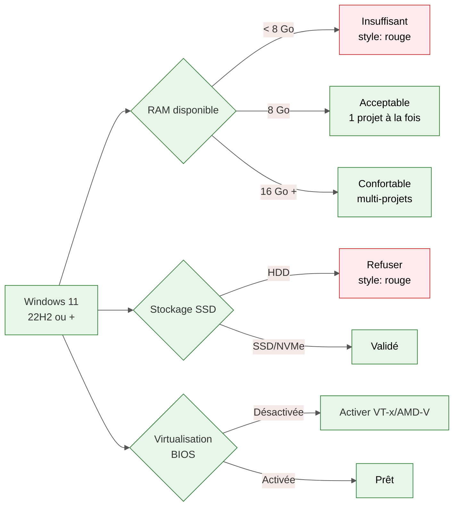
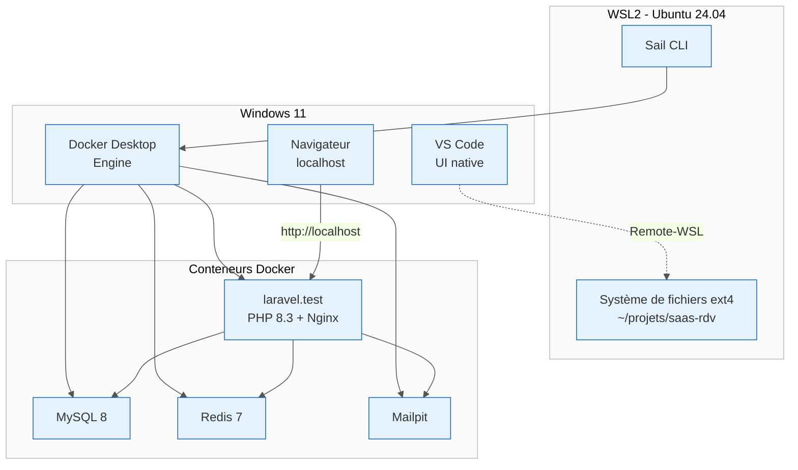

# 0.8 — Installation sur Windows 11 via WSL2

<div class="omny-meta" data-level="débutant" data-version="Laravel 13 / WSL2 / Ubuntu 24.04 LTS" data-time="60 min"></div>

!!! abstract "Objectif du module"
    Mettre en place un environnement Laravel 13 stable, performant et reproductible sur Windows 11, en s'appuyant sur **WSL2** comme noyau Linux natif, **Docker Desktop** comme moteur de conteneurs et **Laravel Sail** comme interface de pilotage. À la fin du module, la commande `sail up` lancera un projet Laravel fonctionnel accessible depuis Windows, dans un environnement strictement identique à celui de production.

!!! quote "Analogie pédagogique"
    Développer Laravel directement sous Windows revient à essayer de cuisiner un plat italien dans une cuisine japonaise : tout est possible, mais chaque ustensile devient un obstacle. WSL2 installe une vraie cuisine italienne **à côté** de la japonaise, dans la même maison. Docker Desktop fournit les ingrédients pré-dosés, et Sail joue le rôle du chef qui orchestre la préparation. Vous restez dans Windows, mais vous cuisinez en Linux.

<br>

---

## 1. Pourquoi WSL2 plutôt que Windows natif

Laravel, Composer, npm, les extensions PHP et Docker sont conçus, testés et déployés majoritairement sous Linux. Windows reste utilisable, mais introduit trois familles de frictions : **performance disque**, **incompatibilités de scripts shell** et **divergence avec la production**. WSL2 résout ces trois points en exécutant un noyau Linux complet[^1] dans une machine virtuelle légère, intégrée à Windows.

| Critère | Windows natif (XAMPP/Laragon) | WSL2 + Docker + Sail |
|---|---|---|
| Performance I/O | Variable, lente sur node_modules | Native (système de fichiers ext4) |
| Parité production | Faible | Forte (même OS, mêmes versions) |
| Reproductibilité équipe | Manuelle | Garantie par Docker |
| Outils CLI Linux | Émulés | Natifs |
| Coût RAM au repos | ~500 Mo | ~1,5 à 2,5 Go |
| Courbe d'apprentissage | Faible | Moyenne |

!!! info "Décision recommandée"
    Pour un parcours professionnel visant le déploiement en production, WSL2 n'est plus une option : c'est le standard de l'écosystème Laravel depuis la version 9, confirmé par la documentation officielle Sail.

<br>

---

## 2. Prérequis matériels et système

### 2.1 Configuration minimale réaliste



| Composant | Minimum | Recommandé |
|---|---|---|
| OS | Windows 11 22H2 (Build 22621) | Windows 11 24H2 |
| RAM | 8 Go | 16 Go |
| CPU | x64 avec virtualisation matérielle | 4 cœurs / 8 threads |
| Stockage libre | 20 Go SSD | 60 Go NVMe |
| Architecture | x64 ou ARM64 | x64 |

### 2.2 Vérifier la virtualisation matérielle

Ouvrir le **Gestionnaire des tâches** (`Ctrl+Maj+Échap`), onglet **Performance** → **Processeur**. La ligne **Virtualisation** doit indiquer **Activée**. Sinon, redémarrer dans le BIOS/UEFI et activer **Intel VT-x** ou **AMD-V**, ainsi que **SLAT** si présent.

!!! warning "Piège fréquent"
    Sur les portables professionnels, la virtualisation est parfois bloquée par une politique d'entreprise ou par Hyper-V déjà actif via Device Guard. Si `wsl --install` échoue plus tard avec une erreur 0x80370102, c'est presque toujours ici qu'il faut chercher.

<br>

---

## 3. Installer WSL2 et Ubuntu

### 3.1 Installation en une commande

Ouvrir **PowerShell en administrateur** (clic droit sur le menu Démarrer → *Terminal (administrateur)*) :

```powershell title="PowerShell - Installation complète de WSL2"
# Installe le composant WSL, active la virtualisation, télécharge Ubuntu 24.04 LTS par défaut
wsl --install -d Ubuntu-24.04
```

*Cette commande active automatiquement les fonctionnalités `Microsoft-Windows-Subsystem-Linux` et `VirtualMachinePlatform`, puis télécharge la distribution. Un redémarrage est obligatoire.*

### 3.2 Premier démarrage et création du compte UNIX

Au redémarrage, Ubuntu se lance et demande :

```bash title="Ubuntu - Première configuration"
# Nom d'utilisateur UNIX (en minuscules, sans espace, sans accent)
Enter new UNIX username: votre_login

# Mot de passe (ne s'affiche pas pendant la frappe, c'est normal)
New password: ********
```

!!! note "Indépendance des comptes"
    Ce compte UNIX est **totalement distinct** de votre session Windows. Il n'a pas besoin de correspondre. Le mot de passe sera demandé pour toute commande `sudo`.

### 3.3 Vérifier la version WSL

```powershell title="PowerShell - Contrôle de version"
# Doit indiquer VERSION 2 pour Ubuntu-24.04
wsl --list --verbose
```

Résultat attendu :

```
  NAME            STATE           VERSION
* Ubuntu-24.04    Running         2
```

Si la version affichée est `1`, forcer la migration :

```powershell title="PowerShell - Forcer WSL2"
# Conversion de la distribution en WSL2 (peut prendre plusieurs minutes)
wsl --set-version Ubuntu-24.04 2

# Définir WSL2 comme défaut pour les futures distributions
wsl --set-default-version 2
```

<br>

---

## 4. Mettre à jour Ubuntu et installer les outils de base

### 4.1 Mise à jour système

Depuis le terminal Ubuntu (lancé via menu Démarrer → *Ubuntu*) :

```bash title="Bash - Mise à jour des paquets"
# Rafraîchit la liste des paquets puis applique toutes les mises à jour
sudo apt update && sudo apt upgrade -y

# Outils indispensables pour la suite (curl pour télécharger, git pour le versioning,
# unzip pour Composer, ca-certificates pour HTTPS)
sudo apt install -y curl git unzip ca-certificates software-properties-common
```

*Bien que Sail encapsule PHP dans Docker, certains outils hôtes (Git, curl) restent nécessaires côté WSL pour éditer, versionner et bootstrapper le projet.*

### 4.2 Configurer Git globalement

```bash title="Bash - Configuration Git"
# Identité utilisée dans les commits
git config --global user.name "Prénom Nom"
git config --global user.email "vous@exemple.com"

# Branche par défaut moderne (remplace master)
git config --global init.defaultBranch main

# Évite les conversions automatiques de fin de ligne sous WSL
git config --global core.autocrlf input
```

!!! warning "Piège des fins de ligne"
    Sans `core.autocrlf input`, les fichiers créés sous Windows et lus sous Linux peuvent corrompre les scripts shell (`\r\n` au lieu de `\n`). Cette configuration est non négociable en environnement hybride.

<br>

---

## 5. Installer Docker Desktop avec l'intégration WSL2

### 5.1 Téléchargement et installation

Télécharger **Docker Desktop for Windows** depuis [docker.com](https://www.docker.com/products/docker-desktop/). Pendant l'installation, **cocher impérativement** :

- *Use WSL 2 instead of Hyper-V (recommended)*
- *Add shortcut to desktop* (facultatif)

### 5.2 Activer l'intégration WSL

Après installation, ouvrir Docker Desktop → **Settings** → **Resources** → **WSL Integration** :

| Réglage | Valeur |
|---|---|
| Enable integration with my default WSL distro | Activé |
| Enable integration with additional distros | Activer `Ubuntu-24.04` |

Cliquer sur **Apply & Restart**.

### 5.3 Limiter la consommation mémoire

Docker Desktop peut consommer plusieurs Go au repos. Sur une machine avec 8 Go de RAM, créer un fichier `.wslconfig` dans le profil Windows :

```ini title="C:\Users\<votre_user>\.wslconfig - Plafond ressources WSL2"
[wsl2]
# Plafond mémoire allouée à la VM WSL2 (ajuster selon votre RAM totale)
memory=4GB

# Nombre de cœurs CPU exposés
processors=4

# Plafond du fichier d'échange
swap=2GB

# Libère la RAM inutilisée vers Windows (Windows 11 22H2+)
autoMemoryReclaim=gradual
```

*Sans ce plafond, WSL2 peut absorber jusqu'à 50 % de la RAM physique, étouffant Windows. Avec 16 Go de RAM totale, allouer 6 à 8 Go est un bon compromis.*

Appliquer en redémarrant WSL depuis PowerShell :

```powershell title="PowerShell - Redémarrage WSL"
# Arrête toutes les distributions, force le rechargement de .wslconfig
wsl --shutdown
```

### 5.4 Vérifier Docker dans Ubuntu

```bash title="Bash - Test de Docker côté WSL"
# Doit afficher la version client + serveur
docker --version
docker compose version

# Test fonctionnel : télécharge et exécute une image de test
docker run --rm hello-world
```

<br>

---

## 6. Créer le projet Laravel 13 avec Sail

### 6.1 Choisir un emplacement de travail

!!! warning "Règle absolue de performance"
    **Le code doit résider dans le système de fichiers Linux**, pas dans `/mnt/c/`. Travailler depuis `/mnt/c/Users/...` divise les performances I/O par 10 à 20. Toujours utiliser `~/projets/` (équivalent à `\\wsl.localhost\Ubuntu-24.04\home\<user>\projets\`).

```bash title="Bash - Préparer le dossier de travail"
# Créer un dossier dédié dans le HOME Linux
mkdir -p ~/projets
cd ~/projets
```

### 6.2 Bootstrapper le projet avec Sail

Laravel fournit un installeur en une ligne qui télécharge le squelette du projet, configure Sail et provisionne les services :

```bash title="Bash - Création du projet via le script officiel Laravel"
# Le script lit le nom du projet, propose les services (MySQL, Redis, Mailpit...),
# génère le docker-compose.yml et exécute la première installation Composer dans un conteneur
curl -s "https://laravel.build/saas-rdv?with=mysql,redis,mailpit" | bash
```

*Le paramètre `with=` sélectionne les services. Pour ce parcours fil rouge : MySQL pour la persistance, Redis pour le cache et les queues, Mailpit pour intercepter les emails de test.*

### 6.3 Lancer l'environnement

```bash title="Bash - Premier démarrage"
# Se positionner dans le projet
cd saas-rdv

# Créer un alias pratique (évite de taper ./vendor/bin/sail à chaque commande)
alias sail='[ -f sail ] && sh sail || sh vendor/bin/sail'

# Démarrer les conteneurs en arrière-plan
sail up -d

# Vérifier que tout est UP
sail ps
```

Ouvrir un navigateur sur [http://localhost](http://localhost) : la page d'accueil Laravel 13 doit s'afficher.

### 6.4 Persister l'alias `sail`

```bash title="Bash - Ajouter l'alias au shell"
# Écrit l'alias dans le profil Bash pour qu'il soit chargé à chaque session
echo "alias sail='[ -f sail ] && sh sail || sh vendor/bin/sail'" >> ~/.bashrc

# Recharge la configuration
source ~/.bashrc
```

<br>

---

## 7. Workflow quotidien VS Code + WSL

### 7.1 Installer l'extension Remote-WSL

Dans VS Code, ouvrir l'onglet **Extensions** (`Ctrl+Shift+X`) et installer :

| Extension | Éditeur | Rôle |
|---|---|---|
| WSL | Microsoft | Connecter VS Code au système de fichiers Linux |
| Dev Containers | Microsoft | (Optionnel) Travailler dans le conteneur Sail |
| PHP Intelephense | Ben Mewburn | Intellisense PHP |
| Laravel Blade Snippets | Winnie Lin | Coloration et snippets Blade |

### 7.2 Ouvrir le projet en mode WSL

```bash title="Bash - Lancer VS Code depuis WSL"
# Depuis le dossier du projet, dans le terminal Ubuntu
cd ~/projets/saas-rdv
code .
```

La fenêtre VS Code qui s'ouvre affichera en bas à gauche **WSL: Ubuntu-24.04**, indiquant que l'éditeur agit comme un client distant sur la VM Linux. Toutes les extensions installées s'appliquent au contexte WSL et non à Windows.

### 7.3 Diagramme du flux complet



<br>

---

## 8. Estimation du temps d'installation

```mermaid
%%{init: {'theme':'base'}}%%
gantt
    title Chronologie d'installation - poste neuf
    dateFormat HH:mm
    axisFormat %H:%M

    section WSL2
    Activation WSL + reboot      :done, w1, 00:00, 10m
    Téléchargement Ubuntu        :done, w2, after w1, 8m
    Création compte UNIX         :done, w3, after w2, 2m

    section Système
    apt update + upgrade         :active, s1, after w3, 12m
    Configuration Git            :s2, after s1, 3m

    section Docker
    Installation Docker Desktop  :d1, after s2, 10m
    Intégration WSL              :d2, after d1, 3m
    Test hello-world             :d3, after d2, 2m

    section Laravel
    laravel.build + Composer     :l1, after d3, 8m
    sail up premier démarrage    :l2, after l1, 5m
```



Total réaliste sur connexion 100 Mb/s et machine moyenne : **55 à 65 minutes**.

<br>

---

## 9. Sécurité de l'environnement

### 9.1 Risques spécifiques au poste de développement

Un environnement de développement n'est pas neutre. Il contient des **secrets** (`.env`), des **identifiants de base de données**, des **tokens Git** et expose des **ports réseau** parfois accessibles au LAN.

??? abstract "Surface d'attaque d'un poste WSL2 mal configuré"
    - Conteneurs Docker exposés sur `0.0.0.0` au lieu de `127.0.0.1`
    - Fichier `.env` versionné par erreur
    - Clé SSH stockée sans passphrase dans `~/.ssh/`
    - Mot de passe MySQL par défaut (`password`) en environnement de démo accessible
    - Image Docker base obsolète avec CVE non patchées
    - Volume Docker monté en `:rw` alors qu'un `:ro` suffirait

### 9.2 Bonnes pratiques minimales

```bash title="Bash - Durcissement de base"
# Vérifier que .env est bien ignoré par Git (doit retourner .env)
grep -E "^\.env$" .gitignore

# Restreindre les permissions du fichier .env
chmod 600 .env

# Lister les ports exposés par Sail (doivent être bindés sur 127.0.0.1 par défaut)
sail ps --format "table {{.Names}}\t{{.Ports}}"
```

### 9.3 Code vulnérable vs sécurisé sur le binding

```yaml title="docker-compose.yml - Configuration dangereuse"
# DANGER : expose MySQL sur toutes les interfaces réseau du poste,
# y compris le Wi-Fi public d'un café ou d'un coworking
services:
  mysql:
    ports:
      - '3306:3306'
```

*Lisible par n'importe quel hôte du même réseau si le pare-feu Windows est permissif.*

```yaml title="docker-compose.yml - Configuration sécurisée"
# Le port n'est accessible que depuis l'hôte local (Windows + WSL)
services:
  mysql:
    ports:
      - '127.0.0.1:3306:3306'
```

*Sail applique cette configuration par défaut via la variable `FORWARD_DB_PORT` combinée à `APP_PORT`, mais toute modification manuelle du `docker-compose.yml` doit conserver ce préfixe `127.0.0.1:`.*

!!! warning "Pièges récurrents sur WSL2"
    - **Antivirus tiers** (Avast, Kaspersky) qui scannent les volumes Docker et divisent les performances par 5. Exclure `\\wsl.localhost\` et le dossier `Docker`.
    - **VPN d'entreprise** qui casse la résolution DNS interne aux conteneurs. Solution : ajouter `nameserver 1.1.1.1` dans `/etc/resolv.conf` après désactivation de la génération automatique.
    - **Windows Defender** qui place WSL en quarantaine après mise à jour. Ajouter `wslservice.exe` aux exclusions.
    - **Mise en veille prolongée** qui corrompt parfois l'horloge de la VM, faussant les tokens JWT et les certificats. Solution : `sudo hwclock -s` au réveil.

<br>

---

## 10. Checkpoint de progression

Avant de passer à la section suivante (`09 — Serveur local accessible sur le réseau`), vérifier :

- [x] `wsl --list --verbose` affiche Ubuntu-24.04 en version 2
- [x] `docker run hello-world` s'exécute sans erreur dans Ubuntu
- [x] Le fichier `~/.wslconfig` plafonne la mémoire selon la RAM disponible
- [x] Git est configuré avec nom, email et `core.autocrlf input`
- [x] Le projet `saas-rdv` est créé dans `~/projets/` (pas dans `/mnt/c/`)
- [x] `sail up -d` démarre les conteneurs sans erreur
- [x] [http://localhost](http://localhost) affiche la page d'accueil Laravel 13
- [x] VS Code s'ouvre en mode **WSL: Ubuntu-24.04** depuis `code .`
- [x] Le fichier `.env` est en permissions `600` et listé dans `.gitignore`
- [x] Les ports Docker sont bindés sur `127.0.0.1`

!!! tip "Exercice projet fil rouge"
    Profiter de cette installation pour réaliser la **Partie 0/26** : initialiser le dépôt Git local du projet `saas-rdv`, créer un premier commit *Conventional Commits* (`chore: initial laravel 13 + sail scaffold`) et pousser sur un dépôt distant privé (GitHub ou GitLab). Cela valide à la fois l'environnement Linux, l'authentification SSH/HTTPS et la chaîne Git de bout en bout.

<br>

---

## 11. Ressources complémentaires

| Ressource | Type | Lien |
|---|---|---|
| Documentation officielle WSL | Référence Microsoft | [learn.microsoft.com/wsl](https://learn.microsoft.com/windows/wsl/) |
| Documentation Laravel Sail | Référence Laravel | [laravel.com/docs/sail](https://laravel.com/docs/13.x/sail) |
| Docker Desktop WSL2 backend | Référence Docker | [docs.docker.com/desktop/wsl](https://docs.docker.com/desktop/features/wsl/) |
| Optimisation `.wslconfig` | Article officiel | [learn.microsoft.com/wsl/wsl-config](https://learn.microsoft.com/windows/wsl/wsl-config) |
| Performances de fichiers cross-OS | Article Microsoft | [Comparing file systems in WSL](https://learn.microsoft.com/windows/wsl/filesystems) |

[^1]: WSL2 n'est pas un émulateur ni une couche de traduction comme WSL1. Il s'agit d'une véritable machine virtuelle ultra-légère reposant sur Hyper-V, qui exécute un noyau Linux compilé par Microsoft et synchronisé avec les versions LTS du noyau officiel. Cette différence architecturale explique le gain de performance majeur sur les opérations système, notamment `composer install` et `npm install`.

<br>

---

!!! quote "Ce qu'il faut retenir"
    Sous Windows 11, l'environnement de référence pour Laravel 13 repose sur trois briques empilées : **WSL2** fournit le noyau Linux, **Docker Desktop** orchestre les conteneurs via l'intégration WSL, et **Laravel Sail** sert d'interface CLI pour piloter le tout. Le code doit impérativement vivre dans le système de fichiers Linux (`~/projets/`), jamais dans `/mnt/c/`. Toute modification manuelle des bindings réseau Docker doit conserver le préfixe `127.0.0.1:` pour éviter une exposition involontaire au LAN. Une fois ce socle posé, le poste de développement est strictement équivalent à un serveur de production Linux, ce qui élimine la classe entière des bugs *"ça marchait chez moi"*.

> Section suivante : [0.9 — Lancer un serveur local accessible depuis plusieurs ordinateurs avec `php artisan serve --host`](./09-serveur-local-reseau.md)
