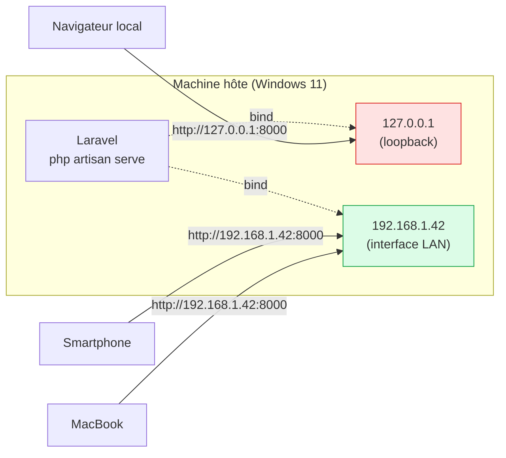
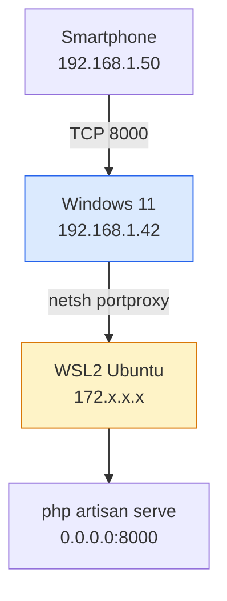
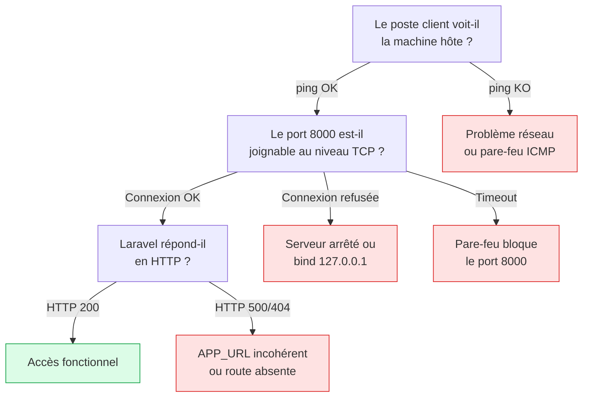

<div class="omny-meta" data-level="Débutant" data-version="Laravel 13 / Sail 1.x" data-time="35 min"></div>

# 0.9 — Serveur local multiposte : Laravel sur le réseau

!!! quote "Analogie pédagogique"
    Imaginez un téléphone fixe interne à une maison. Par défaut, `php artisan serve` est branché sur **un seul combiné** dans une seule pièce : vous seul pouvez décrocher (c'est `127.0.0.1`, la boucle locale). Exposer le serveur sur le réseau revient à connecter ce téléphone à **l'autocommutateur de l'immeuble** : tous les postes connectés au même réseau (PC du salon, Mac de la cuisine, smartphone du jardin) peuvent maintenant composer le numéro. Mais comme dans tout immeuble, il faut aussi que **le gardien** (le pare-feu) laisse passer les appels. C'est l'objet de cette leçon.

<br>

---

## 1. Objectif et périmètre

!!! abstract "Objectif du module"
    Être capable de démarrer un projet Laravel localement, l'exposer de manière **contrôlée** sur le réseau local (LAN ou Wi-Fi), et **vérifier méthodiquement** son accessibilité depuis quatre types de clients : Windows 11, macOS, Linux, et mobile (iOS/Android). Le tout, sans compromettre la sécurité de la machine hôte.

| Élément | Détail |
|---|---|
| Hôte de référence | Windows 11, Laravel 13 + PHP 8.3, ou Sail/Docker |
| Clients de test | Windows (PowerShell), macOS, Linux, iOS, Android |
| Réseau cible | LAN domestique ou réseau d'entreprise privé |
| Hors périmètre | Exposition Internet, tunnels publics (Ngrok, Expose), production |
| Référentiels | Documentation Laravel 13, PHP CLI server, Microsoft Defender Firewall |

<br>

---

## 2. Comprendre `127.0.0.1` vs `0.0.0.0`

C'est **le** point qui bloque 90 % des débutants. La distinction n'est pas un détail technique : elle conditionne tout ce qui suit.



| Adresse de bind | Signification | Qui peut joindre le serveur ? |
|---|---|---|
| `127.0.0.1` (défaut) | Boucle locale, jamais routée sur le réseau | **Uniquement** la machine elle-même |
| `192.168.x.y` | IP réelle d'une interface réseau précise | Les hôtes du même LAN, si pare-feu OK |
| `0.0.0.0` | Toutes les interfaces réseau IPv4 de la machine | Les hôtes de tous les réseaux atteignables |
| `[::]` | Équivalent IPv6 de `0.0.0.0` | Idem, côté IPv6 |

!!! warning "Pièges à connaître"
    - `0.0.0.0` n'est **pas une adresse joignable** : c'est une instruction donnée au serveur (« écoute partout »). On ne tape jamais `http://0.0.0.0:8000` depuis un autre poste.
    - Choisir `0.0.0.0` sur un réseau public (café, aéroport, hôtel) **expose votre application de dev à des inconnus**. Ne le faites que sur un réseau de confiance.
    - Le serveur intégré de PHP (`php artisan serve` repose dessus) est **mono-process et non destiné à la production**[^1]. Il sert au développement et aux démos internes, rien d'autre.

<br>

---

## 3. Identifier l'IP de la machine hôte

Avant d'exposer quoi que ce soit, il faut connaître l'adresse à communiquer aux autres postes.

### 3.1. Sur Windows 11 (hôte)

```powershell
# Affichage complet des interfaces (IPv4, masque, passerelle)
ipconfig

# Filtrage rapide sur la ligne IPv4 utile
ipconfig | Select-String "IPv4"

# Équivalent moderne, plus précis (cmdlet PowerShell)
Get-NetIPAddress -AddressFamily IPv4 `
  | Where-Object { $_.InterfaceAlias -notmatch "Loopback|vEthernet" } `
  | Select-Object InterfaceAlias, IPAddress, PrefixLength
```

*La sortie attendue ressemble à `IPv4 Address. . . . . . . . . . . : 192.168.1.42`. C'est cette IP que les autres postes utiliseront.*

??? abstract "Cas particulier : WSL2, Hyper-V, Docker Desktop"
    Sur Windows 11, plusieurs interfaces virtuelles cohabitent :

    | Interface | Rôle | À utiliser pour exposer le LAN ? |
    |---|---|---|
    | `Ethernet` ou `Wi-Fi` | Vraie carte réseau physique | **Oui** |
    | `vEthernet (WSL)` | Pont vers WSL2 | Non, IP interne à WSL |
    | `vEthernet (Default Switch)` | Pont Hyper-V | Non |
    | `Loopback Pseudo-Interface 1` | `127.0.0.1` | Jamais |

    Si Laravel tourne **dans WSL2** (cas Sail typique), il faut soit utiliser l'IP Windows hôte (Sail expose les ports vers Windows automatiquement), soit configurer `wsl --set-default-version 2` et exposer le port via `netsh interface portproxy` — vu au point 7.

### 3.2. Sur macOS / Linux (hôte alternatif)

```bash
# macOS et Linux modernes
ip -4 addr show | grep inet

# macOS uniquement (BSD)
ifconfig | grep "inet "

# Variante portable
hostname -I    # Linux uniquement, retourne la liste des IP
```

<br>

---

## 4. Démarrer Laravel en mode multiposte

### 4.1. Avec `php artisan serve` (sans Docker)

```bash
# Démarrage classique : seule la machine hôte peut accéder
php artisan serve

# Exposition sur toutes les interfaces, port 8000 (défaut)
php artisan serve --host=0.0.0.0

# Variante explicite avec port personnalisé
php artisan serve --host=0.0.0.0 --port=8080

# Variante restrictive : bind sur UNE seule interface (plus sûr)
# Recommandé en réseau partagé
php artisan serve --host=192.168.1.42 --port=8000
```

*La variante `--host=192.168.1.42` limite l'exposition à l'interface LAN choisie. Si la machine est aussi connectée à un VPN ou à un hotspot, ces autres réseaux ne verront pas le serveur. C'est la posture la plus défensive.*

| Option | Effet | Quand l'utiliser |
|---|---|---|
| (rien) | Bind sur `127.0.0.1:8000` | Dev solo, par défaut |
| `--host=0.0.0.0` | Bind sur toutes les interfaces | Démo rapide, réseau de confiance |
| `--host=<ip-lan>` | Bind sur une seule interface | Posture recommandée en multiposte |
| `--port=<n>` | Change le port d'écoute | Conflit avec 8000, plusieurs projets |

### 4.2. Avec Laravel Sail (Docker)

Sail simplifie le sujet : par défaut, le conteneur **publie** déjà son port `80` sur `0.0.0.0:APP_PORT` de l'hôte via Docker.

```bash
# Fichier .env : choisir le port exposé sur la machine hôte
APP_PORT=8000

# Démarrage du stack
./vendor/bin/sail up -d

# Vérifier que Docker écoute bien sur toutes les interfaces
docker ps --format "table {{.Names}}\t{{.Ports}}"
# Sortie attendue : 0.0.0.0:8000->80/tcp, [::]:8000->80/tcp
```

*Si la ligne `Ports` indique `127.0.0.1:8000->80/tcp`, c'est que Docker a été configuré pour ne pas exposer publiquement. Il faut alors revoir le `docker-compose.yml` du projet et retirer un éventuel `127.0.0.1:` devant le mapping.*

!!! info "Spécificité Sail sous Windows / WSL2"
    Avec Docker Desktop + WSL2, Docker publie les ports sur l'hôte Windows automatiquement. Aucun `netsh portproxy` n'est nécessaire dans ce cas. C'est l'un des grands avantages de Sail face à un `php artisan serve` lancé depuis l'intérieur de WSL.

<br>

---

## 5. Configurer `.env` pour le mode réseau

Une URL d'application incohérente casse les liens absolus, les e-mails, les redirections OAuth, et les assets compilés par Vite. À adapter chaque fois que l'on bascule de mode.

```bash
# .env — mode solo (défaut)
APP_URL=http://127.0.0.1:8000

# .env — mode multiposte
APP_URL=http://192.168.1.42:8000

# Vite doit aussi connaître l'hôte pour le HMR (Hot Module Replacement)
# vite.config.js, section server.host
```

```js
// vite.config.js — extrait
export default defineConfig({
  server: {
    host: '0.0.0.0',          // Vite expose le HMR sur le réseau
    hmr: {
      host: '192.168.1.42',   // IP visible par les clients distants
    },
  },
});
```

*Sans cet ajustement Vite, le navigateur du smartphone tentera de se connecter à `127.0.0.1:5173` pour le HMR, ce qui échouera silencieusement.*

<br>

---

## 6. Ouvrir le pare-feu Windows pour le port 8000

C'est la deuxième cause d'échec la plus fréquente, après le bind sur `127.0.0.1`. Tant que la règle n'existe pas, Windows Defender **droppe** les paquets entrants sans avertissement.

### 6.1. Création de la règle (PowerShell admin)

```powershell
# Ouvrir PowerShell en administrateur, puis :

# Création d'une règle entrante pour le port TCP 8000
# Limitée au profil "Privé" : ne s'applique PAS sur Wi-Fi public
New-NetFirewallRule `
  -DisplayName "Laravel Dev Server (port 8000)" `
  -Direction Inbound `
  -Action Allow `
  -Protocol TCP `
  -LocalPort 8000 `
  -Profile Private

# Vérifier que la règle est bien active
Get-NetFirewallRule -DisplayName "Laravel Dev Server (port 8000)" `
  | Format-List DisplayName, Enabled, Direction, Action, Profile
```

### 6.2. Suppression propre après usage

```powershell
# Supprimer la règle quand le multiposte n'est plus nécessaire
Remove-NetFirewallRule -DisplayName "Laravel Dev Server (port 8000)"
```

| Profil Windows | Quand est-il actif ? | Recommandation |
|---|---|---|
| `Domain` | PC joint à un AD d'entreprise | À éviter sans validation IT |
| `Private` | Réseau domestique ou de confiance | **Recommandé** |
| `Public` | Wi-Fi café, hôtel, aéroport | **Ne jamais activer** |

!!! warning "Risque réel"
    Ouvrir le port 8000 en profil `Public` revient à publier un serveur de développement avec `APP_DEBUG=true` à tous les clients du même Wi-Fi. Un attaquant local peut lire les variables d'environnement via Ignition, déclencher des exceptions volontaires et récupérer secrets, tokens et clés API. C'est exactement le type de vecteur qui alimente la catégorie **A02 Security Misconfiguration** du Top 10 OWASP 2025.

<br>

---

## 7. Cas avancé : Laravel dans WSL2, clients sur le LAN

Quand `php artisan serve` tourne **à l'intérieur** d'une distribution WSL2, l'IP du serveur n'est pas celle de Windows. Il faut un *port proxy* pour faire suivre les connexions entrantes Windows vers WSL.



```powershell
# Récupérer l'IP interne de WSL (change à chaque redémarrage par défaut)
wsl hostname -I

# Mettre en place le port proxy : Windows:8000 -> WSL:8000
# Remplacer 172.24.123.45 par la sortie de la commande précédente
netsh interface portproxy add v4tov4 `
  listenport=8000 listenaddress=0.0.0.0 `
  connectport=8000 connectaddress=172.24.123.45

# Vérifier la table de redirection
netsh interface portproxy show all

# Supprimer la redirection quand on n'en a plus besoin
netsh interface portproxy delete v4tov4 listenport=8000 listenaddress=0.0.0.0
```

*Cette manipulation n'est pas nécessaire avec Sail/Docker Desktop : le démon Docker prend en charge la traversée WSL2 ↔ Windows automatiquement.*

<br>

---

## 8. Vérifier l'accessibilité depuis chaque type de poste

C'est la phase de validation. **Aucune étape ne doit être sautée** : chaque commande répond à une question précise du diagnostic.



### 8.1. Depuis un poste Windows (client de test)

```powershell
# Étape 1 — Vérifier la connectivité réseau de base (couche 3)
Test-Connection -ComputerName 192.168.1.42 -Count 2

# Étape 2 — Vérifier que le port 8000 est ouvert (couche 4)
# Équivalent moderne et explicite de telnet
Test-NetConnection -ComputerName 192.168.1.42 -Port 8000

# Étape 3 — Vérifier la réponse HTTP applicative (couche 7)
# La méthode GET de PowerShell, sans suivi de redirection
Invoke-WebRequest -Uri "http://192.168.1.42:8000" -UseBasicParsing `
  | Select-Object StatusCode, StatusDescription, @{N='Length';E={$_.Content.Length}}

# Variante détaillée : récupérer aussi les en-têtes de réponse
$response = Invoke-WebRequest -Uri "http://192.168.1.42:8000" -UseBasicParsing
$response.Headers           # En-têtes HTTP (X-Powered-By, Set-Cookie, etc.)
$response.RawContent.Substring(0, 500)   # Aperçu des 500 premiers caractères

# Étape 4 — Variante avec curl.exe (livré avec Windows 10/11)
# Attention : utiliser curl.exe et non curl, qui est un alias PowerShell vers Invoke-WebRequest
curl.exe -v http://192.168.1.42:8000
```

*Le `-v` (verbose) de `curl.exe` affiche la négociation TCP, les en-têtes envoyés et reçus, et le corps de la réponse : c'est l'outil le plus pédagogique pour comprendre ce qui passe sur le câble.*

| Symptôme `Test-NetConnection` | Diagnostic probable |
|---|---|
| `TcpTestSucceeded : True` | Tout est ouvert, le souci est applicatif |
| `TcpTestSucceeded : False` + `PingSucceeded : True` | Pare-feu hôte bloque le port |
| `PingSucceeded : False` | Machine hôte injoignable ou ICMP bloqué |

### 8.2. Depuis macOS (client de test)

```bash
# Connectivité réseau
ping -c 2 192.168.1.42

# Test du port (netcat est préinstallé)
nc -zv 192.168.1.42 8000

# Requête HTTP applicative
curl -v http://192.168.1.42:8000

# Variante : code HTTP seul, pratique pour scripts
curl -o /dev/null -s -w "%{http_code}\n" http://192.168.1.42:8000
```

### 8.3. Depuis Linux (client de test)

```bash
# Connectivité
ping -c 2 192.168.1.42

# Port TCP (deux outils selon ce qui est installé)
nc -zv 192.168.1.42 8000          # netcat
ss -tn dst 192.168.1.42:8000      # variante moderne après connexion

# Requête HTTP
curl -v http://192.168.1.42:8000

# Test avec en-tête Host explicite (utile si APP_URL pointe sur un domaine)
curl -v -H "Host: monapp.test" http://192.168.1.42:8000
```

### 8.4. Depuis un mobile (iOS / Android)

Pas de terminal natif simple, mais trois approches :

| Méthode | iOS | Android |
|---|---|---|
| Navigateur web | Safari : `http://192.168.1.42:8000` | Chrome : idem |
| Application réseau | Network Analyzer (App Store) | Network Analyzer (Play Store) |
| Terminal | iSH (Alpine) ou Termius | Termux (Play Store / F-Droid) |

```bash
# Depuis Termux ou iSH (équivalent terminal sur mobile)
curl -v http://192.168.1.42:8000
```

!!! info "Pré-requis indispensable"
    Le mobile doit être connecté **au même réseau Wi-Fi** que la machine hôte. Un téléphone en 4G/5G n'a aucune visibilité sur le LAN domestique. De même, beaucoup de box opérateur isolent par défaut les appareils en *Wi-Fi invité* : à vérifier dans l'interface de la box.

<br>

---

## 9. Dépannage : matrice symptôme/cause

| Symptôme observé | Cause la plus probable | Vérification |
|---|---|---|
| `ERR_CONNECTION_REFUSED` côté client | Serveur lancé en `127.0.0.1` ou arrêté | `Get-NetTCPConnection -LocalPort 8000` côté hôte |
| `ERR_CONNECTION_TIMED_OUT` | Pare-feu Windows bloque le port | Vérifier `Get-NetFirewallRule` |
| `ping` OK mais `Test-NetConnection` KO | Pare-feu hôte (cas typique) | Voir section 6 |
| Page blanche ou redirection vers `127.0.0.1` | `APP_URL` incohérent | Corriger `.env` puis `php artisan config:clear` |
| Assets Vite manquants en multiposte | `vite.config.js` non adapté | Voir section 5 |
| Accessible localement, pas depuis WSL2 | Pas de portproxy | Voir section 7 |
| Smartphone ne voit rien | Wi-Fi invité ou isolation client | Vérifier la box opérateur |

```powershell
# Côté hôte Windows : voir si Laravel écoute vraiment où on croit
Get-NetTCPConnection -LocalPort 8000 -State Listen `
  | Select-Object LocalAddress, LocalPort, OwningProcess

# Identifier le processus qui tient le port
Get-Process -Id (Get-NetTCPConnection -LocalPort 8000 -State Listen).OwningProcess
```

*`LocalAddress = 0.0.0.0` confirme un bind multiposte. `LocalAddress = 127.0.0.1` explique l'inaccessibilité distante sans même avoir à toucher au pare-feu.*

<br>

---

## 10. Ressources complémentaires

- Documentation officielle Laravel sur le serveur de développement local et Sail.
- Documentation Microsoft sur `New-NetFirewallRule` et `Test-NetConnection`.
- Documentation PHP sur le serveur web intégré (`-S` flag), socle de `php artisan serve`.
- OWASP Top 10 2025, catégorie A02 Security Misconfiguration, pour mesurer le risque d'exposition d'un environnement de dev.

<br>

---

!!! quote "Ce qu'il faut retenir"
    - `php artisan serve` écoute par défaut sur `127.0.0.1`, **uniquement accessible localement**.
    - Pour le multiposte, deux options : `--host=0.0.0.0` (toutes interfaces, plus permissif) ou `--host=<ip-lan>` (une seule interface, plus sûr).
    - Trois leviers conditionnent l'accès distant : **bind du serveur**, **pare-feu de l'hôte**, **APP_URL cohérent**. Si un seul échoue, rien ne fonctionne.
    - Sous Windows, la règle de pare-feu doit être créée en profil **Private**, jamais Public.
    - Avec Sail, Docker Desktop gère la traversée WSL2 ↔ Windows automatiquement ; avec `php artisan serve` dans WSL2, il faut un `netsh interface portproxy`.
    - La validation se fait par couches : `ping` (L3), `Test-NetConnection` (L4), `Invoke-WebRequest`/`curl` (L7). Toujours dans cet ordre.
    - Un serveur de dev exposé n'est **jamais** un serveur de production. `APP_DEBUG=false` et un vrai serveur web (Nginx, Apache, FrankenPHP) restent obligatoires hors développement.

[^1]: Le serveur de développement intégré à PHP est explicitement marqué comme « not intended to be a full-featured web server » dans la documentation PHP, et ne doit pas être utilisé sur un réseau public.

> Prochaine étape : [0.10 — Initialiser Git, `.gitignore` et Conventional Commits](10-git-conventional-commits.md)