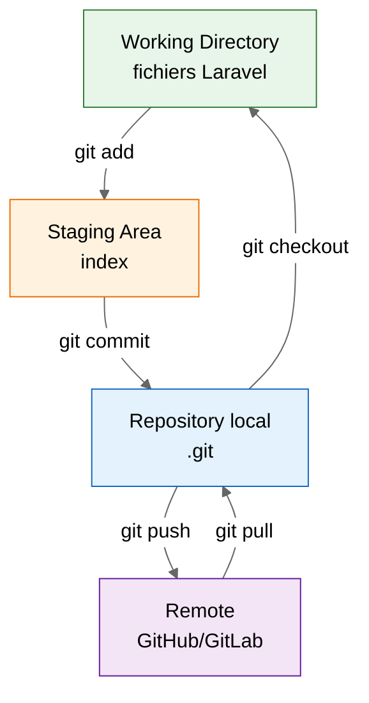
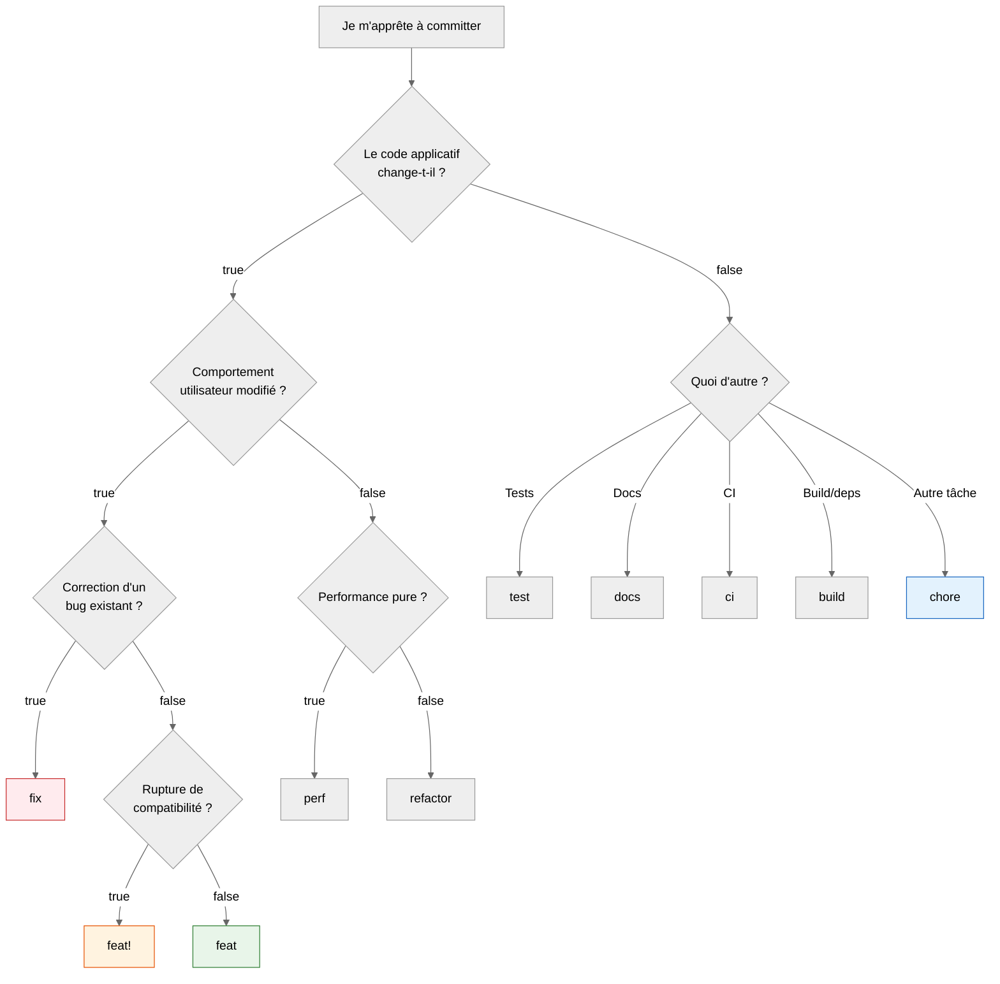
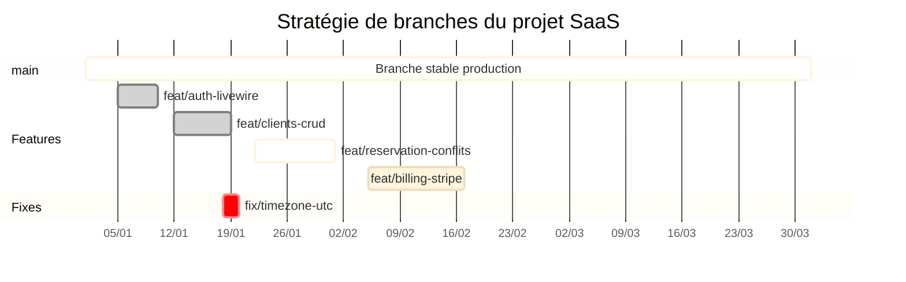

# 10 — Initialiser Git, structurer le `.gitignore` et adopter Conventional Commits

<div class="omny-meta" data-level="Débutant" data-version="Laravel 13" data-time="45 min"></div>

!!! abstract "Objectif du module"
    À la fin de cette leçon, tu sauras initialiser un dépôt Git sur un projet Laravel 13 fraîchement créé, configurer un `.gitignore` cohérent avec l'écosystème Laravel/Sail/Node, produire des commits normalisés selon la spécification **Conventional Commits 1.0.0**, et préparer ton dépôt à une future intégration continue (CI) qui dépendra de la qualité de cet historique.

!!! quote "Analogie pédagogique"
    Un dépôt Git sans convention de commits, c'est un journal de bord d'expédition où chaque membre d'équipage écrit dans sa propre langue, sans date, sans lieu. Tant que tu navigues seul par beau temps, ça passe. Le jour où il faut comprendre **pourquoi le bateau a dévié de sa route trois mois plus tôt**, tu n'as plus que des bribes illisibles. Conventional Commits, c'est la grammaire commune qui transforme ce journal en document forensique exploitable — par toi, par ton équipe, et par les outils automatiques de release.

<br>

---

## 1. Pourquoi versionner dès la première ligne

Sur un projet Laravel professionnel, le dépôt Git n'est pas un outil de sauvegarde — c'est un **artefact d'ingénierie**. Il sert simultanément à :

- reconstituer l'état exact du code à n'importe quelle date (audit, incident, support client) ;
- générer automatiquement un `CHANGELOG.md` et des numéros de version (SemVer[^1]) ;
- alimenter une pipeline CI/CD qui décide quoi déployer en fonction du type de commit ;
- documenter les décisions techniques sans recourir à un wiki parallèle.

| Sans discipline Git | Avec discipline Git |
|---|---|
| Historique illisible (`fix`, `update`, `wip`) | Historique parsable par machine |
| Versionnement manuel et arbitraire | SemVer automatisé via les commits |
| Changelog rédigé à la main, oublié | Changelog généré à chaque release |
| Rollback hasardeux | Rollback chirurgical par commit ou tag |
| Revue de code lente | Revue ciblée par scope (`feat(auth):`) |

!!! warning "Piège fréquent"
    Beaucoup de débutants exécutent `git init` **après** avoir commencé à coder et committent un premier paquet de 150 fichiers intitulé `initial commit`. Cet historique perd toute valeur : on ne sait pas qui a introduit quoi, ni quand. La règle est simple — `git init` se fait **avant** la première modification du projet Laravel généré.

<br>

---

## 2. Initialiser Git sur un projet Laravel 13

### 2.1 Vérifier la configuration globale de Git

Avant tout `git init`, ton identité doit être correcte. Sinon, tes premiers commits seront signés avec un nom par défaut ou un email d'ancien poste.

```bash title="Bash - Configuration globale de l'identité Git"
# Vérifier la configuration actuelle (nom, email, branche par défaut)
git config --global --list | grep -E "user.name|user.email|init.defaultBranch"

# Définir l'identité si elle est absente ou incorrecte
git config --global user.name "Prénom Nom"
git config --global user.email "prenom.nom@exemple.fr"

# Forcer 'main' comme branche par défaut (alignement avec GitHub/GitLab modernes)
git config --global init.defaultBranch main

# Activer le rebase automatique au pull pour éviter les merge commits parasites
git config --global pull.rebase true

# Activer la détection automatique des fins de ligne (utile en équipe Windows/Linux)
git config --global core.autocrlf input
```

*Ces réglages sont globaux : tu ne les refais pas à chaque projet, sauf besoin d'une identité spécifique par dépôt (`--local`).*

### 2.2 Initialiser le dépôt dans le dossier du projet

Le projet Laravel généré via `composer create-project` ou `laravel new` **n'inclut pas** de dépôt Git initialisé dans toutes les versions. On vérifie, puis on initialise si nécessaire.

```bash title="Bash - Initialisation du dépôt local"
# Se placer à la racine du projet Laravel
cd ~/projets/saas-rdv

# Vérifier si un dépôt existe déjà (présence du dossier .git)
ls -la | grep ".git"

# Initialiser le dépôt avec 'main' comme branche initiale
git init -b main

# Vérifier que la branche initiale est bien 'main'
git branch --show-current
```

*L'option `-b main` évite que Git ne crée une branche `master` sur les anciennes versions du client.*

### 2.3 Schéma du cycle Git appliqué à Laravel



<br>

---

## 3. Structurer un `.gitignore` cohérent avec Laravel

### 3.1 Ce que Laravel fournit par défaut

Un projet Laravel 13 est livré avec un `.gitignore` à la racine. Il couvre l'essentiel mais reste **minimaliste** : il ne traite ni les fichiers IDE, ni les artefacts d'outils annexes (Sail, Telescope, Pulse, dumps SQL).

??? abstract "Voir le `.gitignore` livré par défaut avec Laravel 13"
    ```gitignore title=".gitignore - version Laravel 13 par défaut (extrait représentatif)"
    /.phpunit.cache
    /node_modules
    /public/build
    /public/hot
    /public/storage
    /storage/*.key
    /storage/pail
    /vendor
    .env
    .env.backup
    .env.production
    .phpactor.json
    .phpunit.result.cache
    Homestead.json
    Homestead.yaml
    auth.json
    npm-debug.log
    yarn-error.log
    /.fleet
    /.idea
    /.nova
    /.vscode
    /.zed
    ```

### 3.2 Compléter le `.gitignore` pour un projet professionnel

Sur un projet réel, on enrichit ce fichier pour ignorer également les artefacts d'OS, les dumps locaux et les fichiers de configuration sensibles d'outils tiers.

```gitignore title=".gitignore - additions recommandées pour un projet Laravel pro"
# === Système d'exploitation ===
.DS_Store              # macOS - fichiers de métadonnées Finder
Thumbs.db              # Windows - cache de miniatures
desktop.ini            # Windows - configuration de dossier

# === Dumps et bases de données locales ===
*.sql                  # exports SQL temporaires (jamais committés)
*.sqlite               # bases SQLite locales si non utilisées en CI
*.sqlite-journal       # journaux SQLite

# === Outils Laravel additionnels ===
/storage/debugbar      # cache du package barryvdh/laravel-debugbar
/storage/clockwork     # données collectées par Clockwork
/storage/logs/*.log    # logs applicatifs (gardés en runtime, ignorés en VCS)

# === Outils de développement ===
.php-cs-fixer.cache    # cache de PHP CS Fixer
.rector.cache          # cache de Rector
.phpstan.cache         # cache de PHPStan / Larastan

# === Secrets et clés locales ===
*.pem                  # certificats et clés privées
*.key                  # clés cryptographiques hors storage Laravel
auth.json              # tokens Composer (déjà couvert mais on confirme)

# === Sail / Docker local ===
docker-compose.override.yml   # surcharges locales non partagées
```

*Le principe : ce qui est **régénérable** (vendor, node_modules, caches) ou **secret** (.env, clés) ne va jamais dans Git.*

### 3.3 Vérifier ce qui sera committé avant le premier commit

```bash title="Bash - Inspection préventive du staging"
# Lister tous les fichiers que Git suivrait actuellement
git status --short

# Vérifier qu'aucun fichier sensible (.env, *.key) n'apparaît dans la liste
git status --short | grep -E "\.env|\.key|\.pem"

# Si un fichier sensible apparaît : l'ajouter au .gitignore AVANT le premier commit
```

*Cette inspection prend dix secondes et évite des heures de réécriture d'historique plus tard.*

<br>

---

## 4. Le premier commit

### 4.1 Construire le commit initial

```bash title="Bash - Premier commit du projet Laravel"
# Ajouter tous les fichiers respectant le .gitignore au staging
git add .

# Vérifier une dernière fois ce qui va être committé
git status

# Créer le commit initial avec un message Conventional Commits
git commit -m "chore: initialisation du projet Laravel 13"

# Vérifier l'historique
git log --oneline
```

*Le type `chore` est utilisé pour les tâches techniques sans impact métier — parfait pour un commit d'initialisation.*

### 4.2 Connecter à un dépôt distant

```bash title="Bash - Liaison avec GitHub ou GitLab"
# Ajouter l'URL du remote (à adapter selon ton hébergeur)
git remote add origin git@github.com:utilisateur/saas-rdv.git

# Vérifier que le remote est bien enregistré
git remote -v

# Pousser la branche main et créer le tracking
git push -u origin main
```

*L'option `-u` lie la branche locale à la branche distante pour les futurs `git pull` et `git push` sans arguments.*

<br>

---

## 5. Conventional Commits : la grammaire des commits

### 5.1 Anatomie d'un commit conventionnel

La spécification **Conventional Commits 1.0.0**[^2] définit une structure stricte :

```text title="Format - Spécification Conventional Commits 1.0.0"
<type>(<scope>)<!>: <description>

<corps optionnel>

<footer optionnel>
```

| Élément | Obligatoire | Rôle |
|---|---|---|
| `type` | Oui | Nature du changement (`feat`, `fix`, `chore`, etc.) |
| `scope` | Non | Zone du code impactée (`auth`, `billing`, `api`) |
| `!` | Non | Indique un **breaking change** |
| `description` | Oui | Résumé court à l'impératif, sans majuscule initiale ni point final |
| Corps | Non | Détail du changement et de sa motivation |
| Footer | Non | Références d'issues, `BREAKING CHANGE:`, co-auteurs |

### 5.2 Les types canoniques à retenir

| Type | Usage | Impact SemVer |
|---|---|---|
| `feat` | Nouvelle fonctionnalité utilisateur | MINOR (`1.2.0` → `1.3.0`) |
| `fix` | Correction de bug | PATCH (`1.2.0` → `1.2.1`) |
| `docs` | Documentation seule | Aucun |
| `style` | Formatage, espaces, virgules | Aucun |
| `refactor` | Réécriture sans changement fonctionnel | Aucun |
| `perf` | Amélioration de performance | PATCH |
| `test` | Ajout ou modification de tests | Aucun |
| `build` | Système de build, dépendances | Aucun |
| `ci` | Configuration CI/CD | Aucun |
| `chore` | Tâche technique sans impact | Aucun |
| `revert` | Annulation d'un commit précédent | Variable |
| `feat!` ou footer `BREAKING CHANGE:` | Rupture de compatibilité | MAJOR (`1.2.0` → `2.0.0`) |

### 5.3 Exemples appliqués au SaaS fil rouge

```text title="Conventional Commits - Exemples concrets sur le projet"
feat(auth): ajouter la connexion via starter kit Livewire

feat(billing)!: migrer les abonnements vers Stripe Cashier

BREAKING CHANGE: le champ `user.plan` est remplacé par la relation
`user->subscription()`. Les contrôleurs lisant `user.plan` doivent
être adaptés.

fix(reservation): corriger le conflit de créneau en zone UTC+2

docs(readme): ajouter la procédure d'installation Sail sous WSL2

chore(deps): mettre à jour les dépendances Composer

ci(github): activer composer audit dans la pipeline
```

### 5.4 Diagramme de décision pour choisir le bon type



<br>

---

## 6. Sécurité du dépôt : ce qu'il ne faut jamais committer

!!! danger "Risque opérationnel"
    Un secret committé une seule fois reste exposé dans l'historique Git **même après suppression**. La seule remédiation propre consiste à **réécrire l'historique** (`git filter-repo`) puis **révoquer le secret** côté fournisseur. La prévention coûte mille fois moins cher que la correction.

### Code à risque

```bash title="Bash - Pratique dangereuse"
# Ajout massif sans inspection : tout part dans le commit, y compris .env
git add .
git commit -m "wip"
git push
```

*Aucune vérification, message inutile, et potentiellement des secrets exposés sur le remote.*

### Code sécurisé

```bash title="Bash - Pratique sécurisée"
# Vérifier l'état avant tout add
git status

# Vérifier explicitement qu'aucun secret ne sera committé
git diff --cached --name-only | grep -E "\.env|\.key|\.pem|auth\.json" && echo "ALERTE : secret détecté" || echo "OK"

# Ajouter uniquement les fichiers concernés par le changement courant
git add app/Http/Controllers/Auth/LoginController.php tests/Feature/AuthTest.php

# Commit avec un message Conventional Commits explicite
git commit -m "feat(auth): ajouter la limitation de tentatives de connexion"
```

*Chaque commit est un acte délibéré, pas un dépôt en vrac.*

<br>

---

## 7. Outiller la convention : valider automatiquement les messages

Sans automatisation, la convention dérive en quelques semaines. Deux approches sont possibles sur un projet Laravel.

=== "Approche Node (commitlint + Husky)"

    ```bash title="Bash - Installation de commitlint et Husky"
    # Installer commitlint et la configuration Conventional Commits
    npm install --save-dev @commitlint/cli @commitlint/config-conventional

    # Installer Husky pour brancher des hooks Git
    npm install --save-dev husky

    # Activer Husky (crée le dossier .husky/)
    npx husky init

    # Créer le hook commit-msg qui appelle commitlint
    echo 'npx --no -- commitlint --edit "$1"' > .husky/commit-msg
    ```

    ```javascript title="commitlint.config.js - Configuration minimale"
    // Extension de la configuration officielle Conventional Commits
    export default {
      extends: ['@commitlint/config-conventional'],
      rules: {
        // Limiter la longueur du sujet à 72 caractères
        'subject-max-length': [2, 'always', 72],
        // Forcer le sujet en minuscules
        'subject-case': [2, 'always', 'lower-case'],
      },
    };
    ```

=== "Approche PHP pure (CaptainHook)"

    ```bash title="Bash - Installation de CaptainHook"
    # Installer CaptainHook en dépendance de développement
    composer require --dev captainhook/captainhook

    # Générer la configuration captainhook.json
    vendor/bin/captainhook configure

    # Activer les hooks dans .git/hooks/
    vendor/bin/captainhook install
    ```

    *CaptainHook permet d'imposer des règles Conventional Commits sans dépendre de Node, ce qui simplifie l'onboarding sur un projet purement backend.*

!!! tip "Choix pour le fil rouge"
    Le projet SaaS utilisera Node de toute façon pour Vite et Tailwind. **commitlint + Husky** est donc le choix par défaut. Si tu pars sur un projet 100 % API sans Node, bascule sur CaptainHook.

<br>

---

## 8. Stratégie de branches minimale

Pour démarrer, on adopte un modèle simple inspiré de **GitHub Flow**[^3], adapté à un développeur solo ou une petite équipe.



**Règles** :

- `main` est toujours déployable ;
- chaque fonctionnalité vit sur une branche `feat/<scope>` ;
- chaque correction vit sur une branche `fix/<scope>` ;
- merge dans `main` uniquement après revue et tests verts ;
- les branches sont supprimées après merge.

<br>

---

## 9. Ressources complémentaires

<div class="grid cards" markdown>

-   :lucide-book-open:{ .lg .middle } **Conventional Commits 1.0.0**

    ---

    Spécification officielle et exhaustive.

    [conventionalcommits.org](https://www.conventionalcommits.org/fr/v1.0.0/)

-   :lucide-git-branch:{ .lg .middle } **Pro Git Book**

    ---

    Référence libre et gratuite de Git, en français.

    [git-scm.com/book/fr/v2](https://git-scm.com/book/fr/v2)

-   :lucide-shield-check:{ .lg .middle } **gitleaks**

    ---

    Scanner de secrets pour auditer un dépôt avant push.

    [github.com/gitleaks/gitleaks](https://github.com/gitleaks/gitleaks)

-   :lucide-package:{ .lg .middle } **commitlint**

    ---

    Validation automatique des messages de commit.

    [commitlint.js.org](https://commitlint.js.org)

</div>

<br>

---

## 10. Checkpoint de Progression

!!! tip "Exercice lié au projet fil rouge"
    Applique ces étapes sur ton projet `saas-rdv` créé dans les leçons précédentes du chapitre 0. Chaque case cochée correspond à une étape vérifiable dans ton dépôt.

- [x] L'identité Git globale (`user.name`, `user.email`) est configurée
- [x] `init.defaultBranch` est défini sur `main`
- [x] `git init -b main` a été exécuté à la racine du projet Laravel
- [x] Le `.gitignore` a été enrichi avec les sections OS, dumps, outils dev, secrets
- [x] `git status` confirme qu'aucun fichier `.env`, `.key` ou `.pem` n'est suivi
- [x] Le premier commit utilise un message Conventional Commits valide
- [x] Un remote `origin` est configuré et la branche `main` est poussée
- [x] commitlint (ou CaptainHook) est installé et bloque les messages non conformes
- [x] Une branche `feat/page-accueil` est créée pour préparer la partie 1/26

<br>

---

!!! quote "Ce qu'il faut retenir"
    Git initialisé avant la première ligne de code, `.gitignore` durci dès le départ, et **chaque commit obéit à Conventional Commits**. Cette discipline n'est pas cosmétique : elle conditionne l'automatisation future du changelog, du versionnement SemVer, de la pipeline CI/CD et des audits de sécurité. Un projet Laravel professionnel se reconnaît à la qualité de son historique Git avant même qu'on lise une ligne de PHP.

[^1]: **SemVer** (Semantic Versioning) — convention de numérotation `MAJOR.MINOR.PATCH` où chaque incrément reflète la nature du changement. Voir [semver.org](https://semver.org).
[^2]: **Conventional Commits 1.0.0** — spécification stable depuis 2019, adoptée par Angular, Vue, NestJS et la majorité de l'écosystème open source moderne.
[^3]: **GitHub Flow** — modèle de branches simplifié de Vincent Driessen, adapté aux livraisons continues, par opposition au GitFlow plus lourd des cycles de release planifiés.

<br>

---

[Leçon précédente : 09. Exposer le serveur Laravel sur le réseau local](09-serveur-reseau-local.md){ .md-button } [Partie suivante : 0/26 — Préparer le SaaS fil rouge](../projet/00-preparation-projet.md){ .md-button .md-button--primary }
