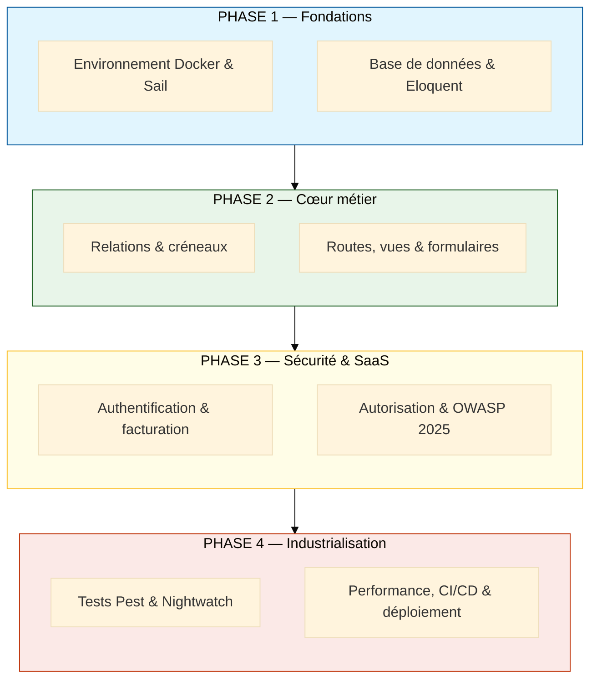
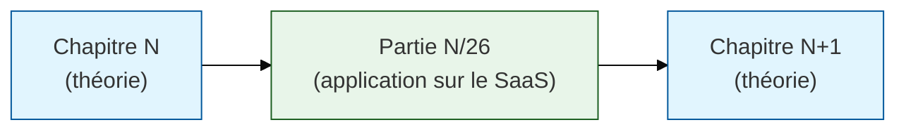

# Laravel 13

<div
  class="omny-meta"
  data-level="Débutant à Avancé"
  data-version="1.0"
  data-time="6-8 minutes">
</div>


!!! quote "Analogie pédagogique"
    _Construire une application SaaS professionnelle, c'est comme ériger un bâtiment : on coule d'abord les fondations (l'environnement), on monte la structure (l'architecture et les données), on installe les systèmes vitaux (authentification, facturation), on pose les serrures et les alarmes (sécurité OWASP), on fait passer le contrôle technique (les tests), avant d'ouvrir au public (la mise en production)._

## Introduction

**Cette formation Laravel 13** conduit un développeur d'un niveau **débutant jusqu'à la mise en production** d'une véritable application **SaaS diffusable**. Elle repose sur un principe simple et tenu sans exception : **un chapitre théorique, suivi immédiatement de son application sur le projet fil rouge**.

> Le parcours ne se contente pas d'enseigner la syntaxe du framework : il construit, chapitre après chapitre, un **SaaS de gestion de rendez-vous et de clients** complet, sécurisé selon l'**OWASP Top 10:2025** et préparé pour un déploiement réel.

!!! info "Ce que cette formation vous apporte"
    - **Maîtrise de Laravel 13** : du cycle requête/réponse jusqu'aux fonctionnalités modernes (AI SDK first-party, recherche vectorielle)
    - **Un projet concret et réutilisable** : un SaaS de prise de rendez-vous avec facturation Stripe
    - **La sécurité par l'attaque** : chaque faille OWASP 2025 illustrée par un code vulnérable et sa remédiation
    - **Une vraie chaîne d'industrialisation** : tests automatisés, CI/CD et déploiement
    - **Une ouverture vers la suite** : stack TALL et pratiques DevSecOps

## Dynamique du parcours

Le cursus se déroule en **27 chapitres (0 à 26)**, regroupés en quatre phases qui s'enchaînent des fondations vers la production.



_Chaque phase capitalise sur la précédente : on ne sécurise pas (Phase 3) ce qui n'a pas été construit (Phase 2), et on n'industrialise pas (Phase 4) ce qui n'a pas été sécurisé. La progression est strictement cumulative._

## Les piliers de la formation

!!! note "Cette section présente les grands blocs du parcours"

<div class="grid cards" markdown>

-   :lucide-box:{ .lg .middle } **Fondations & environnement**

    ---

    Environnement local reproductible avec **Docker** et **Laravel Sail**, structuration **Git** (Conventional Commits), architecture MVC et conteneur de services.

    [:lucide-book-open-check: Chapitres 0 à 3](./chapitres/00-environnement/)

-   :lucide-database:{ .lg .middle } **Domaine & données**

    ---

    Migrations, **Eloquent ORM**, relations, et le cœur métier du SaaS : **créneaux, disponibilités et détection de conflits** de réservation.

    [:lucide-book-open-check: Chapitres 4 à 8](./chapitres/04-base-de-donnees/)

</div>

<div class="grid cards" markdown>

-   :lucide-credit-card:{ .lg .middle } **Authentification & facturation**

    ---

    Starter kits officiels (**Livewire 4 / React / Vue / Svelte**), 2FA via Fortify, équipes, puis abonnements **Stripe** avec **Laravel Cashier** et limites par plan.

    [:lucide-book-open-check: Chapitres 12 à 13](./chapitres/12-authentification/)

-   :lucide-shield-check:{ .lg .middle } **Sécurité applicative**

    ---

    Autorisation par **policies**, puis durcissement complet selon l'**OWASP Top 10:2025**, enseigné par l'attaque (code vulnérable face au code sûr).

    [:lucide-book-open-check: Chapitres 14 à 15](./chapitres/15-securite-owasp/)

</div>

<div class="grid cards" markdown>

-   :lucide-flask-conical:{ .lg .middle } **Tests & qualité**

    ---

    **Pest** introduit dès les premiers CRUD (approche TDD), tests fonctionnels et de modèles, puis tests **end-to-end** avec **Nightwatch**.

    [:lucide-book-open-check: Chapitres 6, 16 et 21](./chapitres/06-tests-pest/)

-   :lucide-rocket:{ .lg .middle } **Industrialisation**

    ---

    **Octane** (FrankenPHP/Swoole), cache Redis, pipelines **CI/CD** (GitHub Actions, GitLab), puis déploiement via **Forge**, **Vapor** ou IaaS durci.

    [:lucide-book-open-check: Chapitres 24 à 26](./chapitres/24-performance/)

</div>

## Le projet fil rouge

Le fil conducteur est un **SaaS de gestion de rendez-vous et de clients** : gestion d'équipes, prise de rendez-vous avec **détection de conflits** et **fuseaux horaires**, **rappels automatiques**, **abonnements Stripe** avec limites par plan, et **API REST** documentée.

Chaque chapitre théorique débouche immédiatement sur une partie pratique numérotée, dans un rapport strict de un pour un.



_On apprend une notion, on la met en œuvre aussitôt sur le projet, et on commit. Aucune théorie ne reste sans application concrète._

## Stack technique

| Domaine | Technologie | Rôle |
|---|---|---|
| Framework | Laravel 13 (PHP 8.3+) | Socle applicatif |
| Interface réactive | Livewire 4 + Flux UI | UI dynamique sans framework JS séparé |
| Starter kits | Livewire / React / Vue / Svelte | Authentification clé en main |
| Facturation | Laravel Cashier + Stripe | Abonnements et limites de plan |
| Tests | Pest + Nightwatch | Tests unitaires/fonctionnels et E2E |
| Sécurité | OWASP Top 10:2025 | Référentiel de durcissement |
| Temps réel | Laravel Reverb | Websockets et notifications en direct |
| Performance | Octane (FrankenPHP/Swoole) | Montée en charge |
| Industrialisation | GitHub Actions / GitLab CI | Tests, audit et déploiement |
| Déploiement | Forge, Vapor ou IaaS | Mise en production |

## Repères du parcours

| Élément | Détail |
|---|---|
| Chapitres | 27, numérotés de 0 à 26 |
| Parties fil rouge | 27, de 0/26 à 26/26 |
| Projet | SaaS de gestion de rendez-vous et clients |
| Niveau | Débutant vers production |
| Durée estimée | 90 à 110 heures |
| Référentiel sécurité | OWASP Top 10:2025 |

## Prérequis

- **Docker Desktop** (sur Windows 11, via **WSL2**) — aucune installation de PHP en local n'est requise grâce à Sail
- **8 Go de RAM minimum** (16 Go pour plus de confort)
- **Node.js LTS** et **npm** pour la compilation des assets front
- Un éditeur : **VS Code** ou **PHPStorm**
- Des bases de **PHP** et de **HTML/CSS** ; aucun prérequis Laravel

## Démarrage rapide

```bash
# 1. Cloner le dépôt du projet fil rouge
git clone <url-du-depot> rdv-saas && cd rdv-saas

# 2. Installer les dépendances PHP via un conteneur jetable (sans PHP local)
docker run --rm -v "$(pwd):/var/www/html" -w /var/www/html \
    laravelsail/php83-composer composer install

# 3. Préparer le fichier d'environnement
cp .env.example .env

# 4. Démarrer la stack Docker (PHP, MySQL, Redis) en arrière-plan
./vendor/bin/sail up -d

# 5. Générer la clé applicative, puis migrer et peupler la base
./vendor/bin/sail artisan key:generate
./vendor/bin/sail artisan migrate --seed

# 6. Installer et compiler les assets front (Livewire 4 / Flux)
./vendor/bin/sail npm install
./vendor/bin/sail npm run dev

# 7. Vérifier que tout fonctionne en lançant la suite de tests
./vendor/bin/sail artisan test
```

## Rôle dans l'écosystème

Cette formation constitue le **socle applicatif** sur lequel s'appuient des compétences plus larges. Une fois l'application SaaS maîtrisée et sécurisée, le parcours ouvre naturellement vers :

- la **stack TALL** (Tailwind, Alpine.js, Laravel, Livewire 4) pour les interfaces avancées ;
- les pratiques **DevSecOps** (Terraform, Ansible, durcissement système, CI/CD sécurisée) pour l'exploitation à l'échelle.

> L'annexe **OWASP Top 10:2025** accompagne le chapitre 15 : chaque catégorie y est présentée au format **vulnérable / sûr / lien fil rouge**, fidèle à une pédagogie par l'attaque.

<br>

---

## Conclusion

!!! quote "Ce qu'il faut retenir"
    Cette formation n'est pas une collection de tutoriels isolés : c'est la construction continue d'une application réelle, testée et sécurisée. La sécurité y est enseignée **par l'attaque** — on montre la faille avant la défense — parce qu'on ne protège bien que ce qu'on a appris à casser. La valeur du parcours se mesure à son livrable final : un SaaS que vous pouvez réellement déployer et défendre.

> [Démarrez par le chapitre 0 — Environnement Docker, Sail et Git →](./chapitre-00/01-presentation-parcours.md)