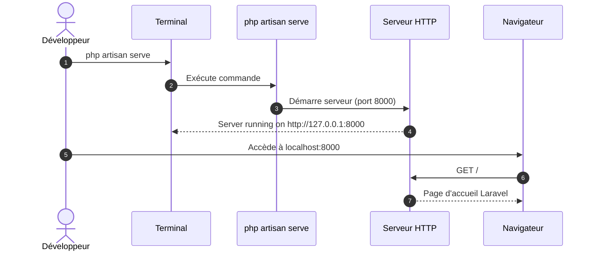
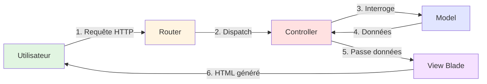
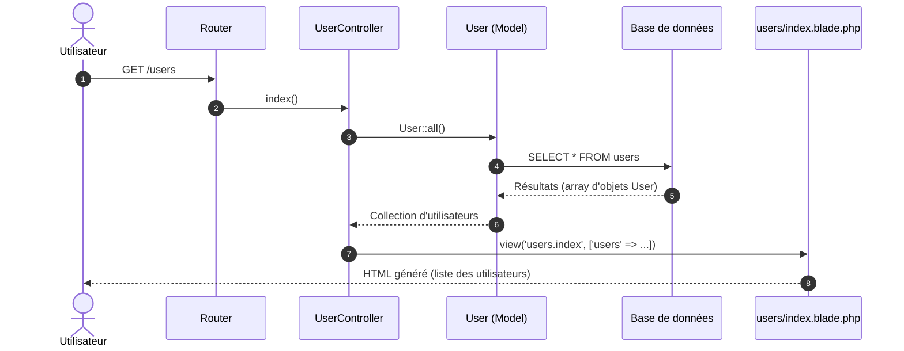
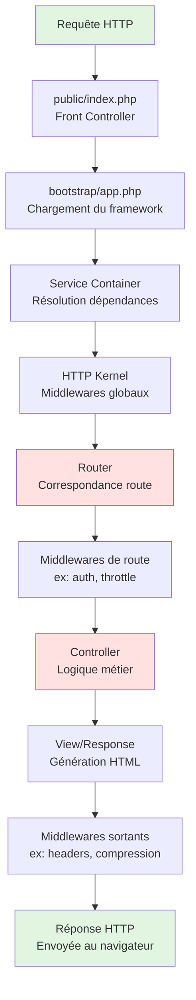
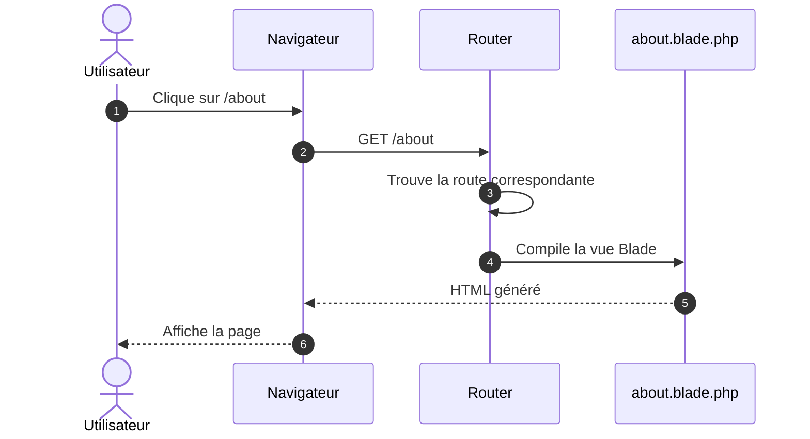

# I - Fondations Laravel

<div
  class="omny-meta"
  data-level="🟢 Débutant"
  data-version="1.0"
  data-time="8-10 heures">
</div>

## Introduction au module

!!! quote "Analogie pédagogique"
    _Imaginez que vous apprenez à piloter un avion. Avant de décoller, vous devez comprendre le **tableau de bord** : à quoi sert chaque instrument, comment l'avion réagit aux commandes, où se trouvent les systèmes critiques. Laravel, c'est pareil : avant d'écrire du code métier, vous devez comprendre **comment le framework est organisé**, **comment il traite une requête**, et **quels outils vous avez à disposition**._

Ce premier module établit les **fondations indispensables** pour tout développeur Laravel. Vous allez installer votre environnement de développement, comprendre l'architecture du framework, explorer la structure d'un projet, et maîtriser les outils en ligne de commande (Artisan) qui accélèrent votre productivité.

**Objectifs pédagogiques du module :**

- [x] Installer PHP 8.5, Composer, et Laravel via php.new
- [x] Comprendre l'architecture MVC[^1] de Laravel
- [x] Maîtriser la structure de dossiers d'un projet Laravel
- [x] Visualiser le cycle de vie d'une requête HTTP
- [x] Utiliser Artisan CLI pour générer des composants
- [x] Configurer l'environnement (fichier `.env`)
- [x] Lancer le serveur de développement

---

## 1. Installation de l'environnement

### 1.1 Pourquoi php.new ?

**php.new** est un environnement de développement PHP en ligne créé par Laravel/Taylor Otwell. Il fournit instantanément :

- PHP 8.5 (dernière version stable)
- Composer (gestionnaire de dépendances)
- Laravel CLI pré-installé
- Terminal web fonctionnel
- Éditeur de code intégré

C'est idéal pour **apprendre sans friction** : pas de configuration système complexe, pas de conflits de versions.

!!! info "Alternative locale"
    Si vous préférez travailler en local, installez **Laravel Herd** (macOS/Windows) ou **Laragon** (Windows) ou **Docker avec Laravel Sail**. Mais pour ce guide, nous utiliserons php.new pour la simplicité.

### 1.2 Installation pas à pas

**Étape 1 : Créer un projet Laravel**

Rendez-vous sur [https://php.new](https://php.new) et créez un nouveau projet Laravel.

Ou en ligne de commande locale (si vous avez Composer) :

```bash
# Création d'un nouveau projet Laravel nommé "blog-laravel"
# La commande télécharge Laravel et toutes ses dépendances
composer create-project laravel/laravel blog-laravel

# Entrer dans le répertoire du projet
cd blog-laravel
```

**Explication :**
- `create-project` : commande Composer pour initialiser un projet depuis un template
- `laravel/laravel` : package officiel Laravel (structure de départ)
- `blog-laravel` : nom de votre dossier projet

**Étape 2 : Vérifier l'installation**

```bash
# Afficher la version de PHP utilisée
php -v

# Afficher la version de Composer
composer --version

# Afficher la version de Laravel installée
php artisan --version
```

**Sortie attendue :**

```
PHP 8.5.x (cli) ...
Composer version 2.x.x ...
Laravel Framework 11.x.x
```

!!! warning "Version Laravel"
    Ce guide utilise **Laravel 11.x** (dernière version à la date de rédaction). Si vous utilisez une version antérieure (10.x, 9.x), certaines conventions peuvent différer légèrement.

**Étape 3 : Lancer le serveur de développement**

```bash
# Démarre le serveur PHP intégré sur le port 8000
php artisan serve
```

**Sortie console :**

```
INFO  Server running on [http://127.0.0.1:8000].

Press Ctrl+C to stop the server
```

**Explication technique :**
- `artisan` : CLI[^2] de Laravel (outil en ligne de commande)
- `serve` : commande qui lance un serveur HTTP léger pour le développement
- Par défaut, l'application est accessible sur `http://localhost:8000`

Ouvrez votre navigateur et accédez à `http://localhost:8000`. Vous devriez voir la **page d'accueil Laravel** par défaut.



_Le diagramme montre le flux d'exécution lors du lancement du serveur de développement._

---

## 2. Structure d'un projet Laravel

### 2.1 Vue d'ensemble de l'arborescence

Quand vous créez un projet Laravel, voici la structure générée :

```
blog-laravel/
├── app/                    # Code métier de l'application
│   ├── Console/           # Commandes Artisan custom
│   ├── Exceptions/        # Gestionnaires d'exceptions
│   ├── Http/              # Controllers, Middleware, Requests
│   │   ├── Controllers/   # Logique de contrôle (MVC)
│   │   └── Middleware/    # Filtres de requêtes
│   ├── Models/            # Modèles Eloquent (ORM)
│   └── Providers/         # Service Providers (bootstrapping)
│
├── bootstrap/             # Fichiers de démarrage du framework
│   └── app.php            # Point d'entrée de l'application
│
├── config/                # Fichiers de configuration
│   ├── app.php            # Config principale
│   ├── database.php       # Config base de données
│   └── ...                # (auth, cache, mail, etc.)
│
├── database/              # Migrations, seeders, factories
│   ├── factories/         # Factories (génération données test)
│   ├── migrations/        # Migrations (versioning schéma DB)
│   └── seeders/           # Seeders (peuplement initial)
│
├── public/                # Point d'entrée web (accessible HTTP)
│   ├── index.php          # Front controller (toutes requêtes passent ici)
│   └── ...                # Assets publics (images, CSS, JS compilés)
│
├── resources/             # Ressources non-PHP
│   ├── views/             # Templates Blade (HTML + directives Laravel)
│   ├── css/               # CSS source (avant compilation)
│   └── js/                # JavaScript source
│
├── routes/                # Définition des routes
│   ├── web.php            # Routes web (session, CSRF)
│   ├── api.php            # Routes API (stateless, token)
│   └── console.php        # Routes commandes Artisan
│
├── storage/               # Fichiers générés par l'app (logs, cache, uploads)
│   ├── app/               # Fichiers applicatifs (uploads utilisateurs)
│   ├── framework/         # Cache, sessions, views compilées
│   └── logs/              # Logs applicatifs
│
├── tests/                 # Tests automatisés
│   ├── Feature/           # Tests fonctionnels (simulation requêtes)
│   └── Unit/              # Tests unitaires (logique isolée)
│
├── vendor/                # Dépendances Composer (NE PAS MODIFIER)
│
├── .env                   # Configuration environnement (SENSIBLE, git-ignored)
├── .env.example           # Template .env (commité dans git)
├── artisan                # Executable CLI Laravel
├── composer.json          # Dépendances PHP du projet
└── package.json           # Dépendances JavaScript (npm)
```

### 2.2 Explication des dossiers critiques

Chaque dossier a un **rôle précis**. Comprendre cette organisation est essentiel.

#### 2.2.1 Le dossier `app/`

**Rôle :** Contient **tout votre code métier**. C'est ici que vous passerez 80% de votre temps.

**Sous-dossiers clés :**

```php
app/
├── Http/Controllers/    # CONTROLLERS (MVC)
│   └── Controller.php   # Classe de base (tous vos controllers en héritent)
│
├── Models/              # MODELS (MVC)
│   └── User.php         # Modèle User (exemple fourni par Laravel)
│
├── Providers/           # Service Providers (bootstrapping du framework)
│   └── AppServiceProvider.php  # Provider principal de l'app
```

**Principe important :**  
Laravel suit le pattern **MVC** (Model-View-Controller). Vos **Models** vont dans `app/Models/`, vos **Controllers** dans `app/Http/Controllers/`, et vos **Views** dans `resources/views/`.

#### 2.2.2 Le dossier `routes/`

**Rôle :** Définir les **URLs de votre application** et les mapper vers des actions (controllers).

```php
routes/
├── web.php      # Routes pour interface web (session, cookies, CSRF)
├── api.php      # Routes pour API REST (stateless, authentification token)
└── console.php  # Commandes Artisan personnalisées
```

**Exemple de route dans `routes/web.php` :**

```php
<?php

use Illuminate\Support\Facades\Route;

// Route GET vers la page d'accueil
// Quand l'utilisateur accède à "/", Laravel exécute cette fonction anonyme
Route::get('/', function () {
    return view('welcome'); // Retourne la vue resources/views/welcome.blade.php
});
```

**Explication ligne par ligne :**

1. `use Illuminate\Support\Facades\Route;` : Import de la facade[^3] Route
2. `Route::get('/', function () { ... });` : Définit une route HTTP GET sur l'URL `/`
3. `return view('welcome');` : Retourne la vue Blade nommée `welcome` (fichier `resources/views/welcome.blade.php`)

!!! tip "Convention de nommage"
    Laravel utilise des **facades** (classes statiques apparentes) pour simplifier l'accès aux services. `Route::get()` est en réalité un appel à une instance du routeur injectée par le Service Container.

#### 2.2.3 Le dossier `resources/views/`

**Rôle :** Contient les **templates Blade**[^4] (fichiers `.blade.php`).

Blade est le moteur de templates de Laravel. Il permet d'écrire du HTML avec des directives PHP simplifiées.

**Exemple de vue Blade (`resources/views/welcome.blade.php`) :**

```html
<!DOCTYPE html>
<html>
<head>
    <title>Blog Laravel</title>
</head>
<body>
    <h1>Bienvenue sur le blog</h1>
    
    {{-- Ceci est un commentaire Blade (non visible dans le HTML généré) --}}
    
    @if (true)
        <p>Cette condition est vraie.</p>
    @endif
</body>
</html>
```

**Directives Blade courantes :**

- `{{ $variable }}` : Affiche une variable (échappement XSS[^5] automatique)
- `{!! $html !!}` : Affiche du HTML brut (ATTENTION : risque XSS si données non fiables)
- `@if`, `@else`, `@endif` : Structures de contrôle
- `@foreach`, `@endforeach` : Boucles
- `{{-- Commentaire --}}` : Commentaires Blade (non rendus)

#### 2.2.4 Le dossier `database/`

**Rôle :** Gestion du **schéma de base de données** et des **données de test**.

```php
database/
├── migrations/   # Fichiers de migration (versioning du schéma)
├── seeders/      # Seeders (insertion de données initiales)
└── factories/    # Factories (génération de fausses données pour tests)
```

Nous approfondirons ce dossier au **Module 3 - Base de données & Eloquent**.

#### 2.2.5 Le fichier `.env`

**Rôle :** Configuration **spécifique à l'environnement** (développement, production, test).

**Exemple de `.env` minimal :**

```env
APP_NAME=Blog Laravel
APP_ENV=local
APP_KEY=base64:GeneratedKeyHere
APP_DEBUG=true
APP_URL=http://localhost:8000

DB_CONNECTION=sqlite
# DB_HOST=127.0.0.1
# DB_PORT=3306
# DB_DATABASE=blog_laravel
# DB_USERNAME=root
# DB_PASSWORD=
```

**Variables critiques :**

- `APP_KEY` : Clé de chiffrement (générée automatiquement, **JAMAIS** committée en clair)
- `APP_ENV` : Environnement (`local`, `production`, `testing`)
- `APP_DEBUG` : Affichage des erreurs détaillées (true en dev, **false** en prod)
- `DB_CONNECTION` : Type de base de données (`sqlite`, `mysql`, `pgsql`)

!!! danger "Sécurité .env"
    Le fichier `.env` contient des **secrets** (clés API, mots de passe DB). Il est **git-ignored** par défaut. **JAMAIS** de commit de `.env` dans git. Utilisez `.env.example` comme template.

**Générer une APP_KEY :**

```bash
# Génère une nouvelle clé de chiffrement dans .env
php artisan key:generate
```

---

## 3. Architecture MVC de Laravel

### 3.1 Qu'est-ce que MVC ?

**MVC** = **Model-View-Controller**, un pattern architectural qui sépare :

1. **Model (Modèle)** : Représente les **données** et la **logique métier**
2. **View (Vue)** : Représente l'**interface utilisateur** (HTML)
3. **Controller (Contrôleur)** : Gère la **logique de contrôle** (traite les requêtes, orchestre Model et View)



_Le flux MVC dans Laravel : du routeur au contrôleur, qui interroge le modèle et retourne une vue._

### 3.2 Exemple concret : afficher la liste des utilisateurs

Imaginons une route `/users` qui affiche tous les utilisateurs.

**Étape 1 : Définir la route (`routes/web.php`)**

```php
<?php

use App\Http\Controllers\UserController;
use Illuminate\Support\Facades\Route;

// Route GET /users mappée vers la méthode index du UserController
Route::get('/users', [UserController::class, 'index']);
```

**Explication :**
- `Route::get('/users', ...)` : Déclare une route GET sur l'URL `/users`
- `[UserController::class, 'index']` : Appelle la méthode `index()` de `UserController`

**Étape 2 : Créer le Controller**

```bash
# Génère un controller nommé UserController dans app/Http/Controllers/
php artisan make:controller UserController
```

**Commande exécutée :**  
Artisan crée le fichier `app/Http/Controllers/UserController.php` avec une structure de base.

**Modifier `app/Http/Controllers/UserController.php` :**

```php
<?php

namespace App\Http\Controllers;

use App\Models\User; // Import du modèle User
use Illuminate\Http\Request;

class UserController extends Controller
{
    /**
     * Affiche la liste des utilisateurs.
     * 
     * Cette méthode est appelée quand on accède à GET /users.
     * Elle récupère tous les utilisateurs depuis la base de données,
     * puis passe ces données à la vue 'users.index' pour affichage.
     * 
     * @return \Illuminate\View\View
     */
    public function index()
    {
        // Récupère tous les utilisateurs depuis la table 'users'
        // User::all() utilise Eloquent ORM pour exécuter : SELECT * FROM users
        $users = User::all();

        // Retourne la vue 'resources/views/users/index.blade.php'
        // en lui passant la variable $users
        return view('users.index', [
            'users' => $users
        ]);
        
        // Syntaxe alternative (équivalente) :
        // return view('users.index', compact('users'));
    }
}
```

**Explication détaillée du code :**

1. `namespace App\Http\Controllers;` : Déclare l'espace de noms[^6] du controller
2. `use App\Models\User;` : Importe le modèle `User` pour pouvoir l'utiliser
3. `class UserController extends Controller` : Le controller hérite de la classe de base `Controller`
4. `User::all()` : Méthode Eloquent qui récupère **tous** les enregistrements de la table `users`
5. `view('users.index', ['users' => $users])` : Retourne la vue Blade avec les données

**Étape 3 : Créer la Vue (`resources/views/users/index.blade.php`)**

Créez le dossier `resources/views/users/` et le fichier `index.blade.php` :

```html
<!DOCTYPE html>
<html lang="fr">
<head>
    <meta charset="UTF-8">
    <title>Liste des utilisateurs</title>
</head>
<body>
    <h1>Utilisateurs du blog</h1>

    {{-- Vérification : y a-t-il des utilisateurs ? --}}
    @if ($users->isEmpty())
        <p>Aucun utilisateur pour le moment.</p>
    @else
        <ul>
            {{-- Boucle sur chaque utilisateur --}}
            @foreach ($users as $user)
                <li>
                    {{-- Affiche le nom (échappement automatique contre XSS) --}}
                    {{ $user->name }} - {{ $user->email }}
                </li>
            @endforeach
        </ul>
    @endif
</body>
</html>
```

**Explication des directives Blade :**

1. `@if ($users->isEmpty())` : Condition Blade (équivalent PHP : `if (count($users) === 0)`)
2. `@foreach ($users as $user)` : Boucle Blade (équivalent PHP : `foreach`)
3. `{{ $user->name }}` : Affiche la propriété `name` du modèle `$user` (échappement XSS automatique)
4. `@else`, `@endif`, `@endforeach` : Fermeture des structures de contrôle

**Résultat final : diagramme de séquence**



_Ce diagramme montre le flux complet MVC : requête → router → controller → model → base de données → vue → réponse._

---

## 4. Cycle de vie d'une requête HTTP

### 4.1 Vue d'ensemble du processus

Quand un utilisateur accède à une URL Laravel (ex: `http://localhost:8000/users`), voici ce qui se passe :



_Le cycle de vie complet d'une requête, de l'entrée (public/index.php) à la sortie (réponse HTTP)._

### 4.2 Étapes détaillées

#### Étape 1 : Point d'entrée unique (`public/index.php`)

**Toutes** les requêtes HTTP passent par ce fichier (grâce à la configuration du serveur web).

```php
<?php

// Charge l'autoloader Composer (permet d'utiliser les classes sans require manuel)
require __DIR__.'/../vendor/autoload.php';

// Crée l'instance de l'application Laravel (Service Container)
$app = require_once __DIR__.'/../bootstrap/app.php';

// Résout le HTTP Kernel depuis le container
$kernel = $app->make(Illuminate\Contracts\Http\Kernel::class);

// Traite la requête et génère une réponse
$response = $kernel->handle(
    $request = Illuminate\Http\Request::capture()
);

// Envoie la réponse au navigateur
$response->send();

// Termine les tâches post-réponse (logs, cleanup)
$kernel->terminate($request, $response);
```

**Pourquoi un point d'entrée unique ?**

- Sécurité : seul le dossier `public/` est accessible via HTTP
- Cohérence : toutes les requêtes passent par la même initialisation
- Routing centralisé : le routeur décide quelle action exécuter

#### Étape 2 : Bootstrapping du framework

Le fichier `bootstrap/app.php` initialise :

1. Le **Service Container**[^7] : système de gestion des dépendances
2. Les **Service Providers** : composants qui enregistrent les services (DB, Auth, etc.)
3. Les **Facades** : interfaces statiques vers les services du container

#### Étape 3 : Passage par les middlewares

Les **middlewares**[^8] sont des filtres appliqués aux requêtes. Exemples :

- `VerifyCsrfToken` : Vérifie le token CSRF sur les requêtes POST/PUT/DELETE
- `auth` : Vérifie que l'utilisateur est authentifié
- `throttle` : Limite le nombre de requêtes par minute (anti-spam)

**Ordre d'exécution :**

```
Requête → Middlewares globaux → Route → Middlewares de route → Controller
```

#### Étape 4 : Routing

Le **Router** compare l'URL demandée aux routes définies dans `routes/web.php` et `routes/api.php`.

Si une correspondance est trouvée, Laravel exécute l'action associée (closure ou méthode de controller).

#### Étape 5 : Exécution du Controller

Le controller exécute la logique métier, interroge les modèles si nécessaire, et retourne une **réponse** (view, JSON, redirect, etc.).

#### Étape 6 : Génération de la réponse

Laravel compile la vue Blade en PHP pur, l'exécute, et génère le HTML final.

#### Étape 7 : Envoi de la réponse

La réponse HTTP (headers + body) est envoyée au navigateur de l'utilisateur.

---

## 5. Artisan CLI - Votre meilleur allié

### 5.1 Qu'est-ce qu'Artisan ?

**Artisan** est l'interface en ligne de commande de Laravel. Il fournit des dizaines de commandes pour :

- Générer du code (controllers, models, migrations, etc.)
- Gérer la base de données (migrations, seeders)
- Lancer des tâches (queues, scheduler)
- Interagir avec l'application (tinker = REPL[^9])

### 5.2 Commandes essentielles

**Lister toutes les commandes disponibles :**

```bash
php artisan list
```

**Afficher l'aide d'une commande :**

```bash
php artisan help make:controller
```

**Commandes de génération de code (les plus utilisées) :**

```bash
# Créer un controller
php artisan make:controller PostController

# Créer un controller avec méthodes CRUD (index, create, store, show, edit, update, destroy)
php artisan make:controller PostController --resource

# Créer un modèle
php artisan make:model Post

# Créer un modèle + migration + controller resource + factory
php artisan make:model Post -mcrf

# Créer une migration
php artisan make:migration create_posts_table

# Créer un middleware
php artisan make:middleware CheckAuthor

# Créer une policy
php artisan make:policy PostPolicy --model=Post
```

**Explication des flags :**

- `-m` : Crée aussi la migration associée
- `-c` : Crée aussi un controller
- `-r` : Rend le controller "resource" (7 méthodes CRUD)
- `-f` : Crée aussi une factory

**Commandes de base de données :**

```bash
# Exécuter les migrations (créer/modifier les tables)
php artisan migrate

# Annuler la dernière migration
php artisan migrate:rollback

# Annuler toutes les migrations puis les réexécuter
php artisan migrate:fresh

# Réinitialiser + migrer + seeder (données de test)
php artisan migrate:fresh --seed
```

**Commandes utilitaires :**

```bash
# Lancer le serveur de développement
php artisan serve

# Vider les caches (config, routes, views)
php artisan optimize:clear

# Générer une clé d'application (APP_KEY)
php artisan key:generate

# Lister toutes les routes définies
php artisan route:list

# Accéder au REPL (console interactive Laravel)
php artisan tinker
```

### 5.3 Exemple pratique : générer un CRUD complet

Vous voulez créer un CRUD[^10] pour gérer des articles (posts) ? Une seule commande :

```bash
php artisan make:model Post -mcrf
```

**Ce que cette commande génère :**

1. `app/Models/Post.php` : Modèle Eloquent
2. `database/migrations/xxxx_create_posts_table.php` : Migration pour créer la table `posts`
3. `app/Http/Controllers/PostController.php` : Controller resource avec 7 méthodes
4. `database/factories/PostFactory.php` : Factory pour générer de faux posts

**Gain de temps :** Au lieu d'écrire 4 fichiers manuellement, vous avez un squelette prêt en 2 secondes.

---

## 6. Configuration de l'environnement

### 6.1 Le fichier `.env` en détail

Le fichier `.env` centralise **toutes les variables d'environnement**. Laravel le charge automatiquement au démarrage.

**Exemple de `.env` complet pour notre blog :**

```env
# Informations générales de l'application
APP_NAME="Blog Laravel"
APP_ENV=local
APP_KEY=base64:votre_cle_generee_ici
APP_DEBUG=true
APP_TIMEZONE=Europe/Paris
APP_URL=http://localhost:8000

# Base de données (SQLite pour démarrer)
DB_CONNECTION=sqlite
# Ou MySQL/MariaDB :
# DB_CONNECTION=mysql
# DB_HOST=127.0.0.1
# DB_PORT=3306
# DB_DATABASE=blog_laravel
# DB_USERNAME=root
# DB_PASSWORD=

# Cache, Session, Queue (drivers par défaut)
CACHE_STORE=file
SESSION_DRIVER=file
QUEUE_CONNECTION=database

# Mail (pour les notifications futures)
MAIL_MAILER=log
MAIL_FROM_ADDRESS="noreply@blog-laravel.local"
MAIL_FROM_NAME="${APP_NAME}"
```

**Variables critiques à comprendre :**

| Variable | Rôle | Valeurs courantes |
|----------|------|-------------------|
| `APP_ENV` | Environnement d'exécution | `local`, `production`, `testing` |
| `APP_DEBUG` | Affichage erreurs détaillées | `true` (dev), `false` (prod) |
| `APP_KEY` | Clé de chiffrement | Générée via `php artisan key:generate` |
| `DB_CONNECTION` | Type de base de données | `sqlite`, `mysql`, `pgsql` |
| `SESSION_DRIVER` | Stockage des sessions | `file`, `cookie`, `database`, `redis` |

### 6.2 Accéder aux variables d'environnement dans le code

Laravel fournit la fonction helper `env()` :

```php
<?php

// Récupère la valeur de APP_NAME définie dans .env
$appName = env('APP_NAME');

// Avec valeur par défaut si la variable n'existe pas
$appUrl = env('APP_URL', 'http://localhost');
```

**Bonne pratique :**  
N'utilisez **jamais** `env()` directement dans votre code métier. Utilisez plutôt les fichiers de configuration dans `config/`.

**Exemple :**  
Au lieu de `env('APP_NAME')`, utilisez `config('app.name')`.

**Pourquoi ?**  
En production, Laravel met en cache la configuration (`php artisan config:cache`), et les appels `env()` retourneront `null`. Les valeurs sont accessibles via `config()`.

### 6.3 Configuration de la base de données

Laravel supporte plusieurs SGBD[^11]. Nous couvrirons les 3 principaux dans le **Module 3**, mais voici un aperçu :

#### SQLite (idéal pour démarrer)

**Avantages :**
- Zéro configuration (fichier unique)
- Parfait pour développement et prototypes
- Pas de serveur DB à lancer

**Configuration `.env` :**

```env
DB_CONNECTION=sqlite
# DB_DATABASE=/chemin/absolu/vers/database.sqlite (optionnel)
```

**Créer le fichier de base de données :**

```bash
# Crée un fichier vide database/database.sqlite
touch database/database.sqlite

# Ou sur Windows :
type nul > database\database.sqlite
```

#### MySQL / MariaDB

**Configuration `.env` :**

```env
DB_CONNECTION=mysql
DB_HOST=127.0.0.1
DB_PORT=3306
DB_DATABASE=blog_laravel
DB_USERNAME=root
DB_PASSWORD=votre_mot_de_passe
```

**Créer la base de données (dans mysql CLI) :**

```sql
CREATE DATABASE blog_laravel CHARACTER SET utf8mb4 COLLATE utf8mb4_unicode_ci;
```

#### PostgreSQL

**Configuration `.env` :**

```env
DB_CONNECTION=pgsql
DB_HOST=127.0.0.1
DB_PORT=5432
DB_DATABASE=blog_laravel
DB_USERNAME=postgres
DB_PASSWORD=votre_mot_de_passe
```

**Créer la base de données (dans psql CLI) :**

```sql
CREATE DATABASE blog_laravel;
```

---

## 7. Premiers pas pratiques

### 7.1 Créer une page "À propos"

Nous allons créer une page statique `/about` pour pratiquer les concepts vus.

**Étape 1 : Définir la route**

Ouvrez `routes/web.php` et ajoutez :

```php
<?php

use Illuminate\Support\Facades\Route;

// Route existante (page d'accueil)
Route::get('/', function () {
    return view('welcome');
});

// Nouvelle route : page "À propos"
Route::get('/about', function () {
    return view('about');
});
```

**Explication :**
- `Route::get('/about', ...)` : Déclare une route GET sur l'URL `/about`
- `return view('about');` : Retourne la vue `resources/views/about.blade.php`

**Étape 2 : Créer la vue**

Créez le fichier `resources/views/about.blade.php` :

```html
<!DOCTYPE html>
<html lang="fr">
<head>
    <meta charset="UTF-8">
    <meta name="viewport" content="width=device-width, initial-scale=1.0">
    <title>À propos - Blog Laravel</title>
</head>
<body>
    <h1>À propos de ce blog</h1>
    
    <p>
        Ce blog est un projet d'apprentissage Laravel.
        Il couvre les concepts fondamentaux du framework.
    </p>
    
    <p>
        <a href="/">Retour à l'accueil</a>
    </p>
</body>
</html>
```

**Étape 3 : Tester**

1. Lancez le serveur : `php artisan serve`
2. Accédez à `http://localhost:8000/about`
3. Vous devriez voir votre page "À propos"

**Diagramme de flux :**



### 7.2 Ajouter une variable dynamique

Modifions la route pour passer une variable à la vue.

**Route modifiée :**

```php
Route::get('/about', function () {
    // On passe une variable $siteName à la vue
    return view('about', [
        'siteName' => 'Blog Laravel Professionnel',
        'version' => '1.0.0'
    ]);
});
```

**Vue modifiée (`resources/views/about.blade.php`) :**

```html
<!DOCTYPE html>
<html lang="fr">
<head>
    <meta charset="UTF-8">
    <title>À propos - {{ $siteName }}</title>
</head>
<body>
    <h1>À propos</h1>
    
    <p>Nom du site : <strong>{{ $siteName }}</strong></p>
    <p>Version : {{ $version }}</p>
    
    <p><a href="/">Retour à l'accueil</a></p>
</body>
</html>
```

**Explication :**
- `{{ $siteName }}` : Affiche la variable passée depuis la route (échappement XSS automatique)
- Laravel remplace les doubles accolades par `<?php echo htmlspecialchars($siteName); ?>`

**Résultat :**  
La page affichera "Nom du site : **Blog Laravel Professionnel**" et "Version : 1.0.0".

---

## 8. Conventions et bonnes pratiques

### 8.1 Conventions de nommage Laravel

Laravel impose des **conventions strictes** pour bénéficier de la magie du framework.

| Élément | Convention | Exemple |
|---------|-----------|---------|
| **Controller** | PascalCase + "Controller" | `PostController`, `UserController` |
| **Modèle** | Singulier PascalCase | `Post`, `User`, `Comment` |
| **Table DB** | Pluriel snake_case | `posts`, `users`, `comments` |
| **Migration** | `create_xxx_table` ou `add_xxx_to_yyy` | `2024_01_15_create_posts_table.php` |
| **Route nommée** | snake_case avec point | `posts.index`, `users.show` |
| **Méthode** | camelCase | `index()`, `showProfile()` |

**Exemple concret :**

```php
// Modèle (singulier)
class Post extends Model {}

// Table (pluriel, automatiquement déduit par Eloquent)
// Laravel cherche la table "posts" (pluriel de Post)

// Controller (PascalCase + Controller)
class PostController extends Controller {}

// Route nommée
Route::get('/posts', [PostController::class, 'index'])->name('posts.index');
```

### 8.2 Structure d'un controller resource

Un **controller resource** suit 7 méthodes standardisées pour un CRUD complet :

| Méthode | Route | Verbe HTTP | Action |
|---------|-------|------------|--------|
| `index()` | `/posts` | GET | Liste tous les posts |
| `create()` | `/posts/create` | GET | Affiche le formulaire de création |
| `store()` | `/posts` | POST | Enregistre un nouveau post |
| `show()` | `/posts/{post}` | GET | Affiche un post spécifique |
| `edit()` | `/posts/{post}/edit` | GET | Affiche le formulaire d'édition |
| `update()` | `/posts/{post}` | PUT/PATCH | Met à jour un post |
| `destroy()` | `/posts/{post}` | DELETE | Supprime un post |

**Générer toutes ces routes automatiquement :**

```php
// Dans routes/web.php
Route::resource('posts', PostController::class);
```

**Cette seule ligne génère les 7 routes ci-dessus.**

Vérifiez avec :

```bash
php artisan route:list --name=posts
```

### 8.3 Principe de responsabilité unique

**Un controller ne doit pas :**

- Contenir de logique métier complexe (déplacer vers des Services)
- Faire des requêtes SQL directes (utiliser Eloquent)
- Gérer l'upload de fichiers directement (utiliser des classes dédiées)

**Un controller doit :**

- Valider les données entrantes
- Appeler les modèles/services appropriés
- Retourner une réponse (view, redirect, JSON)

**Exemple MAUVAIS :**

```php
public function store(Request $request)
{
    // ❌ Logique métier complexe dans le controller
    $data = $request->all();
    $post = new Post();
    $post->title = $data['title'];
    $post->body = $data['body'];
    $post->user_id = auth()->id();
    
    if ($request->hasFile('image')) {
        $path = $request->file('image')->store('images');
        $post->image = $path;
    }
    
    $post->save();
    
    // Envoi d'un email
    Mail::to('admin@example.com')->send(new PostCreated($post));
    
    return redirect('/posts');
}
```

**Exemple BON :**

```php
public function store(StorePostRequest $request)
{
    // ✅ Validation déléguée à une FormRequest
    // ✅ Logique métier dans un Service
    $post = $this->postService->createPost($request->validated());
    
    return redirect()->route('posts.show', $post)
        ->with('success', 'Post créé avec succès.');
}
```

---

## 9. Checkpoint de progression

### 9.1 Compétences acquises

À la fin de ce module, vous devriez être capable de :

- [x] Installer Laravel via php.new ou Composer
- [x] Comprendre la structure de dossiers d'un projet Laravel
- [x] Expliquer le rôle de chaque dossier principal (`app/`, `routes/`, `resources/`, etc.)
- [x] Visualiser le cycle de vie d'une requête HTTP dans Laravel
- [x] Utiliser Artisan pour générer des composants (controller, model, migration)
- [x] Créer une route simple (GET) et retourner une vue Blade
- [x] Passer des variables d'une route vers une vue
- [x] Configurer l'environnement via le fichier `.env`
- [x] Lancer le serveur de développement (`php artisan serve`)

### 9.2 Quiz d'auto-évaluation

Avant de passer au module suivant, testez vos connaissances :

1. **Question :** Quel fichier sert de point d'entrée pour toutes les requêtes HTTP ?
   <details>
   <summary>Réponse</summary>
   `public/index.php` (Front Controller)
   </details>

2. **Question :** Quelle commande Artisan génère un modèle + migration + controller resource + factory ?
   <details>
   <summary>Réponse</summary>
   `php artisan make:model Post -mcrf`
   </details>

3. **Question :** Dans quelle convention Laravel nomme-t-il les tables de base de données ?
   <details>
   <summary>Réponse</summary>
   Pluriel snake_case (ex: `posts`, `user_profiles`)
   </details>

4. **Question :** Que fait la directive Blade `{{ $variable }}` ?
   <details>
   <summary>Réponse</summary>
   Affiche la variable avec échappement XSS automatique (équivalent à `htmlspecialchars()`)
   </details>

5. **Question :** Pourquoi ne doit-on JAMAIS committer le fichier `.env` dans git ?
   <details>
   <summary>Réponse</summary>
   Il contient des secrets (clés API, mots de passe DB, APP_KEY) qui doivent rester privés.
   </details>

### 9.3 Exercice pratique

**Objectif :** Créer une page "Contact" avec un formulaire factice.

**Consignes :**

1. Créez une route GET `/contact` qui affiche un formulaire
2. Créez une route POST `/contact` qui affiche simplement "Message reçu !"
3. Utilisez Blade pour créer la vue du formulaire avec :
   - Champ "Nom" (texte)
   - Champ "Email" (email)
   - Champ "Message" (textarea)
   - Bouton "Envoyer"

**Indice :**  
Pour le formulaire, utilisez la directive `@csrf` pour protéger contre les attaques CSRF.

**Solution (à tenter seul d'abord) :**

<details>
<summary>Voir la solution</summary>

**`routes/web.php` :**

```php
Route::get('/contact', function () {
    return view('contact');
});

Route::post('/contact', function () {
    return 'Message reçu !';
});
```

**`resources/views/contact.blade.php` :**

```html
<!DOCTYPE html>
<html lang="fr">
<head>
    <meta charset="UTF-8">
    <title>Contact - Blog Laravel</title>
</head>
<body>
    <h1>Contactez-nous</h1>
    
    <form method="POST" action="/contact">
        @csrf
        
        <div>
            <label for="name">Nom :</label>
            <input type="text" id="name" name="name" required>
        </div>
        
        <div>
            <label for="email">Email :</label>
            <input type="email" id="email" name="email" required>
        </div>
        
        <div>
            <label for="message">Message :</label>
            <textarea id="message" name="message" required></textarea>
        </div>
        
        <button type="submit">Envoyer</button>
    </form>
</body>
</html>
```

**Explication :**
- `@csrf` : Génère un token CSRF caché dans le formulaire (obligatoire pour les POST/PUT/DELETE)
- `method="POST"` : Méthode HTTP du formulaire
- `action="/contact"` : URL de soumission (route POST `/contact`)

</details>

---

## 10. Le mot de la fin du module

!!! quote "Récapitulatif"
    Vous avez maintenant les **fondations solides** pour travailler avec Laravel. Vous comprenez comment le framework est structuré, comment une requête est traitée, et comment générer rapidement des composants avec Artisan.
    
    Ces concepts sont **essentiels** : chaque module suivant s'appuiera sur cette base. Si quelque chose n'est pas clair, n'hésitez pas à **relire les sections concernées** ou à **expérimenter** en modifiant le code.
    
    Le meilleur moyen d'apprendre Laravel, c'est de **casser des choses**. Modifiez une route, supprimez un `@csrf`, changez le nom d'une vue, et observez les erreurs. Les messages d'erreur Laravel sont **très explicites** : apprenez à les lire.

**Prochaine étape :**  
Le **Module 2 - Routing & Controllers** va approfondir la gestion des routes, les controllers resource, la validation, et le Route Model Binding.

---

## Navigation du module

**Module précédent :**  
[:lucide-arrow-left: Retour à l'index](../index/)

**Module suivant :**  
[:lucide-arrow-right: Module 2 - Routing & Controllers](../module-02-routing-controllers/)

---

## Ressources complémentaires du Module 1

### Documentation officielle

- [Laravel Documentation - Installation](https://laravel.com/docs/installation)
- [Laravel Documentation - Directory Structure](https://laravel.com/docs/structure)
- [Laravel Documentation - Request Lifecycle](https://laravel.com/docs/lifecycle)
- [Laravel Documentation - Artisan Console](https://laravel.com/docs/artisan)

### Vidéos recommandées (Laracasts)

- "Laravel From Scratch" (série gratuite)
- "The PHP Practitioner" (bases PHP objet)

### Outils à installer

- **Laravel Debugbar** : `composer require barryvdh/laravel-debugbar --dev`
- **Laravel IDE Helper** : `composer require --dev barryvdh/laravel-ide-helper`

---

[^1]: **MVC (Model-View-Controller)** : Pattern architectural qui sépare les données (Model), l'interface (View), et la logique de contrôle (Controller).
[^2]: **CLI (Command Line Interface)** : Interface en ligne de commande permettant d'interagir avec un programme via le terminal.
[^3]: **Facade** : Pattern Laravel offrant une interface statique simple vers des services du Service Container.
[^4]: **Blade** : Moteur de templates de Laravel permettant d'écrire du HTML avec des directives PHP simplifiées.
[^5]: **XSS (Cross-Site Scripting)** : Vulnérabilité permettant l'injection de code JavaScript malveillant via des données non échappées.
[^6]: **Namespace** : Mécanisme PHP organisant les classes en espaces de noms pour éviter les conflits de noms.
[^7]: **Service Container** : Système de gestion des dépendances de Laravel permettant l'injection automatique de services.
[^8]: **Middleware** : Filtre appliqué aux requêtes HTTP avant ou après leur traitement par le controller.
[^9]: **REPL (Read-Eval-Print Loop)** : Console interactive permettant d'exécuter du code PHP dans le contexte de l'application.
[^10]: **CRUD** : Create, Read, Update, Delete - les quatre opérations de base sur des données.
[^11]: **SGBD (Système de Gestion de Base de Données)** : Logiciel gérant le stockage et la manipulation de données (MySQL, PostgreSQL, SQLite).
