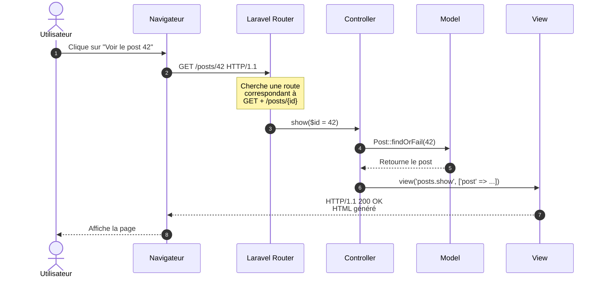
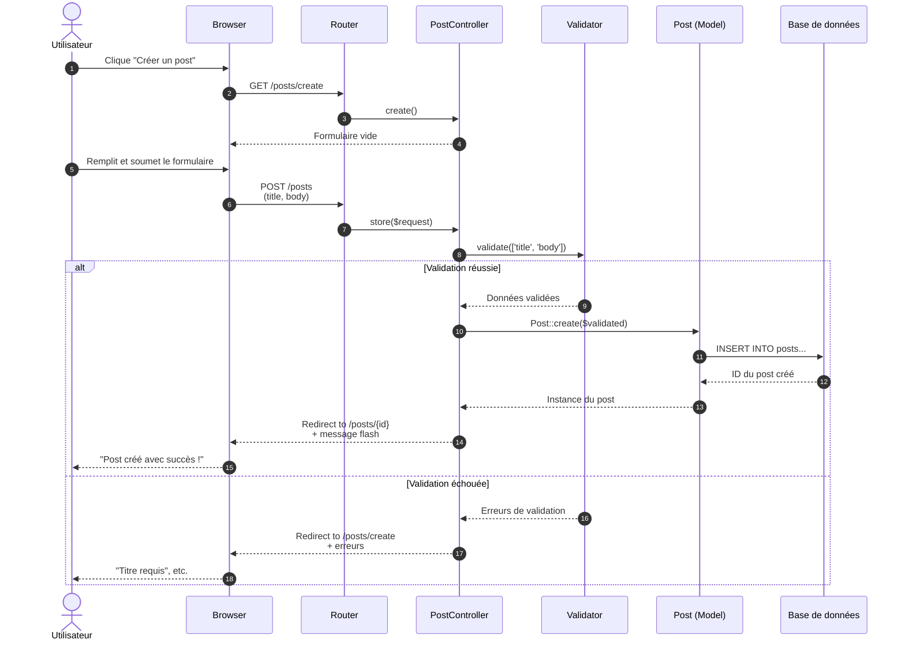
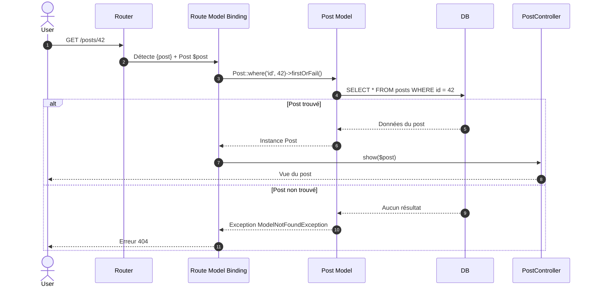

# II - Routing & Controllers

<div
  class="omny-meta"
  data-level="🟢 Débutant"
  data-version="1.0"
  data-time="10-12 heures">
</div>

## Introduction au module

!!! quote "Analogie pédagogique"
    _Imaginez un **standard téléphonique** dans une grande entreprise. Quand quelqu'un appelle, le standardiste (le **Router**) écoute la demande : "Je voudrais parler au service comptabilité". Le standardiste consulte son annuaire (les **routes définies**) et transfère l'appel au bon département (le **Controller**). Le département traite la demande et renvoie une réponse. Le routing Laravel fonctionne exactement ainsi : chaque URL est une "demande", le Router la dirige vers le bon Controller, qui exécute l'action appropriée._

Au **Module 1**, vous avez découvert les fondations de Laravel. Maintenant, nous allons approfondir **le cœur de toute application web** : comment Laravel reçoit une requête HTTP, la route vers le bon endroit, et génère une réponse.

**Objectifs pédagogiques du module :**

- [x] Comprendre le système de routing Laravel en profondeur
- [x] Maîtriser les différents types de routes (GET, POST, PUT, PATCH, DELETE)
- [x] Créer et organiser des controllers
- [x] Utiliser les controllers resource (7 méthodes CRUD)
- [x] Implémenter la validation côté serveur
- [x] Maîtriser le Route Model Binding automatique
- [x] Gérer les redirections et messages flash
- [x] Comprendre les groupes de routes et les middlewares

---

## 1. Le système de routing : vue d'ensemble

### 1.1 Question de réflexion avant de commencer

Avant de plonger dans le code, prenez 2 minutes pour réfléchir :

!!! question "Questions à se poser"
    1. Quand vous tapez `https://blog.com/posts/42` dans votre navigateur, comment le serveur sait-il quelle page afficher ?
    2. Pourquoi `GET /posts` et `POST /posts` peuvent-ils faire des choses complètement différentes alors que l'URL est identique ?
    3. Comment un framework peut-il "capturer" une partie de l'URL (comme le `42` dans `/posts/42`) pour l'utiliser dans le code ?

<details>
<summary>Réponses guidées</summary>

1. **Comment le serveur sait quelle page afficher ?**  
   Le serveur compare l'URL demandée à une **liste de routes pré-définies**. Quand il trouve une correspondance, il exécute l'action associée (afficher une vue, appeler un controller, etc.).

2. **Pourquoi GET et POST sur la même URL font des choses différentes ?**  
   HTTP distingue les **méthodes** (verbes). `GET /posts` = "affiche la liste", `POST /posts` = "crée un nouveau post". Le routing considère à la fois l'**URL** ET la **méthode HTTP**.

3. **Comment capturer des parties de l'URL ?**  
   Grâce aux **paramètres de route**. Laravel permet de définir des "placeholders" : `/posts/{id}` où `{id}` devient une variable accessible dans le code.

</details>

### 1.2 Anatomie d'une requête HTTP

Avant de router une requête, comprenons ce qu'est une requête HTTP.

**Structure d'une requête HTTP GET :**

```http
GET /posts/42 HTTP/1.1
Host: blog-laravel.local
User-Agent: Mozilla/5.0...
Accept: text/html
Cookie: laravel_session=xyz123...
```

**Éléments clés :**

1. **Méthode HTTP** : `GET` (autres : POST, PUT, PATCH, DELETE, OPTIONS, HEAD)
2. **URI (chemin)** : `/posts/42`
3. **Headers** : Métadonnées (cookies, type de contenu accepté, etc.)
4. **Body** : Corps de la requête (présent surtout pour POST/PUT)

**Structure d'une réponse HTTP :**

```http
HTTP/1.1 200 OK
Content-Type: text/html; charset=UTF-8
Set-Cookie: laravel_session=abc456...

<!DOCTYPE html>
<html>
...
</html>
```

**Éléments clés :**

1. **Code statut** : `200 OK` (autres : 404 Not Found, 302 Redirect, 500 Server Error)
2. **Headers** : Type de contenu, cookies à définir, etc.
3. **Body** : Le contenu HTML/JSON/etc.



_Le flux complet d'une requête GET : du clic utilisateur à l'affichage de la page._

---

## 2. Définir des routes : méthodes HTTP

### 2.1 Les méthodes HTTP essentielles

HTTP définit plusieurs **verbes** (méthodes) pour indiquer l'intention de la requête :

| Méthode | Usage RESTful | Idempotent[^1] ? | Exemple |
|---------|---------------|------------------|---------|
| **GET** | Lire une ressource | ✅ Oui | Afficher un article |
| **POST** | Créer une ressource | ❌ Non | Créer un nouvel article |
| **PUT** | Remplacer entièrement une ressource | ✅ Oui | Remplacer un article |
| **PATCH** | Modifier partiellement une ressource | ✅ Oui | Modifier le titre d'un article |
| **DELETE** | Supprimer une ressource | ✅ Oui | Supprimer un article |

**Définir des routes pour chaque méthode dans `routes/web.php` :**

```php
<?php

use Illuminate\Support\Facades\Route;
use App\Http\Controllers\PostController;

// Route GET : afficher la liste des posts
// URL : GET /posts
Route::get('/posts', [PostController::class, 'index']);

// Route GET avec paramètre : afficher un post spécifique
// URL : GET /posts/42
Route::get('/posts/{id}', [PostController::class, 'show']);

// Route GET : afficher le formulaire de création
// URL : GET /posts/create
Route::get('/posts/create', [PostController::class, 'create']);

// Route POST : enregistrer un nouveau post
// URL : POST /posts
Route::post('/posts', [PostController::class, 'store']);

// Route GET : afficher le formulaire d'édition
// URL : GET /posts/42/edit
Route::get('/posts/{id}/edit', [PostController::class, 'edit']);

// Route PUT : mettre à jour un post
// URL : PUT /posts/42
Route::put('/posts/{id}', [PostController::class, 'update']);

// Route DELETE : supprimer un post
// URL : DELETE /posts/42
Route::delete('/posts/{id}', [PostController::class, 'destroy']);
```

**Explication détaillée :**

1. **`Route::get('/posts', ...)`** : Déclare une route qui répond uniquement aux requêtes GET sur `/posts`
2. **`[PostController::class, 'index']`** : Appelle la méthode `index()` du `PostController`
3. **`{id}`** : Paramètre de route (variable) capturé et passé à la méthode du controller

**Ordre des routes : pourquoi c'est critique**

```php
// ❌ MAUVAIS : /posts/create sera capturé par /posts/{id}
Route::get('/posts/{id}', [PostController::class, 'show']);
Route::get('/posts/create', [PostController::class, 'create']);

// ✅ BON : les routes spécifiques AVANT les routes génériques
Route::get('/posts/create', [PostController::class, 'create']);
Route::get('/posts/{id}', [PostController::class, 'show']);
```

**Pourquoi ?**  
Laravel évalue les routes **dans l'ordre de déclaration**. Si `/posts/{id}` est déclaré en premier, une requête vers `/posts/create` sera capturée par cette route (avec `$id = "create"`), et la vraie route `/posts/create` ne sera jamais atteinte.

**Règle d'or :** Routes **spécifiques** (URLs fixes) avant routes **génériques** (avec paramètres).

### 2.2 Routes nommées : pourquoi c'est essentiel

Au lieu de référencer les URLs en dur (`/posts/42`), Laravel permet de **nommer les routes**.

**Définir un nom de route :**

```php
Route::get('/posts/{id}', [PostController::class, 'show'])
    ->name('posts.show');
```

**Utiliser le nom dans le code :**

```php
// Dans un controller : redirection vers la route nommée
return redirect()->route('posts.show', ['id' => 42]);

// Dans une vue Blade : générer l'URL
<a href="{{ route('posts.show', ['id' => $post->id]) }}">
    Voir le post
</a>
```

**Avantages des routes nommées :**

1. **Maintenance simplifiée** : Si vous changez l'URL `/posts/{id}` en `/articles/{id}`, seul le fichier de routes change. Tous les `route('posts.show')` continuent de fonctionner.
2. **Lisibilité** : `route('posts.show', $post)` est plus explicite que `"/posts/{$post->id}"`
3. **Prévention d'erreurs** : Laravel génère une erreur si vous référencez une route inexistante

**Convention de nommage :**

```
{ressource}.{action}

Exemples :
- posts.index
- posts.create
- posts.store
- posts.show
- posts.edit
- posts.update
- posts.destroy
```

### 2.3 Raccourci : Route::resource()

Laravel fournit un raccourci pour générer **les 7 routes CRUD** d'un coup :

```php
// Une seule ligne pour générer 7 routes
Route::resource('posts', PostController::class);
```

**Cette ligne génère automatiquement :**

| Verbe | URI | Action | Nom de route |
|-------|-----|--------|--------------|
| GET | `/posts` | index | posts.index |
| GET | `/posts/create` | create | posts.create |
| POST | `/posts` | store | posts.store |
| GET | `/posts/{post}` | show | posts.show |
| GET | `/posts/{post}/edit` | edit | posts.edit |
| PUT/PATCH | `/posts/{post}` | update | posts.update |
| DELETE | `/posts/{post}` | destroy | posts.destroy |

**Vérifier les routes générées :**

```bash
php artisan route:list --name=posts
```

**Sortie attendue :**

```
GET|HEAD   posts ..................... posts.index › PostController@index
GET|HEAD   posts/create .............. posts.create › PostController@create
POST       posts ..................... posts.store › PostController@store
GET|HEAD   posts/{post} .............. posts.show › PostController@show
GET|HEAD   posts/{post}/edit ......... posts.edit › PostController@edit
PUT|PATCH  posts/{post} .............. posts.update › PostController@update
DELETE     posts/{post} .............. posts.destroy › PostController@destroy
```

**Limiter les routes générées :**

Si vous ne voulez que certaines routes (ex: lecture seule), utilisez `only()` ou `except()` :

```php
// Seulement index et show (lecture seule)
Route::resource('posts', PostController::class)
    ->only(['index', 'show']);

// Tout sauf destroy (pas de suppression)
Route::resource('posts', PostController::class)
    ->except(['destroy']);
```

---

## 3. Controllers : organiser la logique métier

### 3.1 Créer un controller

**Commande Artisan :**

```bash
# Controller vide (vous ajoutez les méthodes vous-même)
php artisan make:controller PostController

# Controller resource (avec les 7 méthodes CRUD pré-générées)
php artisan make:controller PostController --resource
```

**Fichier généré : `app/Http/Controllers/PostController.php`**

```php
<?php

namespace App\Http\Controllers;

use Illuminate\Http\Request;

/**
 * Controller gérant les opérations CRUD sur les posts.
 * 
 * Chaque méthode correspond à une action du cycle de vie d'un post :
 * - Affichage (index, show)
 * - Création (create, store)
 * - Modification (edit, update)
 * - Suppression (destroy)
 */
class PostController extends Controller
{
    /**
     * Affiche la liste de tous les posts.
     * 
     * Route associée : GET /posts
     * Nom : posts.index
     * 
     * @return \Illuminate\View\View
     */
    public function index()
    {
        //
    }

    /**
     * Affiche le formulaire de création d'un nouveau post.
     * 
     * Route associée : GET /posts/create
     * Nom : posts.create
     * 
     * @return \Illuminate\View\View
     */
    public function create()
    {
        //
    }

    /**
     * Enregistre un nouveau post en base de données.
     * 
     * Route associée : POST /posts
     * Nom : posts.store
     * 
     * @param  \Illuminate\Http\Request  $request
     * @return \Illuminate\Http\RedirectResponse
     */
    public function store(Request $request)
    {
        //
    }

    /**
     * Affiche un post spécifique.
     * 
     * Route associée : GET /posts/{post}
     * Nom : posts.show
     * 
     * @param  int  $id
     * @return \Illuminate\View\View
     */
    public function show($id)
    {
        //
    }

    /**
     * Affiche le formulaire d'édition d'un post existant.
     * 
     * Route associée : GET /posts/{post}/edit
     * Nom : posts.edit
     * 
     * @param  int  $id
     * @return \Illuminate\View\View
     */
    public function edit($id)
    {
        //
    }

    /**
     * Met à jour un post existant en base de données.
     * 
     * Route associée : PUT/PATCH /posts/{post}
     * Nom : posts.update
     * 
     * @param  \Illuminate\Http\Request  $request
     * @param  int  $id
     * @return \Illuminate\Http\RedirectResponse
     */
    public function update(Request $request, $id)
    {
        //
    }

    /**
     * Supprime un post de la base de données.
     * 
     * Route associée : DELETE /posts/{post}
     * Nom : posts.destroy
     * 
     * @param  int  $id
     * @return \Illuminate\Http\RedirectResponse
     */
    public function destroy($id)
    {
        //
    }
}
```

**Structure d'un controller : bonnes pratiques**

Un bon controller doit :

1. **Être mince** : Déléguer la logique métier complexe vers des Services ou des Actions
2. **Valider** : Utiliser `$request->validate()` ou Form Requests
3. **Retourner une réponse** : View, Redirect, ou JSON

**Anti-pattern à éviter :**

```php
// ❌ MAUVAIS : logique métier dans le controller
public function store(Request $request)
{
    $post = new Post();
    $post->title = $request->input('title');
    $post->body = $request->input('body');
    $post->slug = Str::slug($request->input('title'));
    $post->user_id = auth()->id();
    $post->published_at = now();
    
    if ($request->hasFile('image')) {
        $path = $request->file('image')->store('images', 'public');
        $post->image_path = $path;
    }
    
    $post->save();
    
    // Envoi d'un email
    Mail::to($post->user)->send(new PostPublished($post));
    
    return redirect('/posts');
}
```

**Bonne pratique :**

```php
// ✅ BON : controller délègue la logique
public function store(StorePostRequest $request)
{
    // La validation est déléguée à StorePostRequest
    // La création est déléguée à une Action ou un Service
    $post = CreatePostAction::execute($request->validated());
    
    return redirect()->route('posts.show', $post)
        ->with('success', 'Post créé avec succès.');
}
```

### 3.2 Implémenter les méthodes CRUD (version simple)

Implémentons maintenant le CRUD complet avec de **vrais exemples fonctionnels**.

**Pour cet exemple, nous utiliserons un modèle `Post` simple (nous créerons le modèle au Module 3, mais anticipons la structure) :**

```php
// Anticipation du modèle Post (Module 3)
class Post extends Model
{
    protected $fillable = ['title', 'body', 'user_id'];
}
```

**Controller complet commenté :**

```php
<?php

namespace App\Http\Controllers;

use App\Models\Post; // On importe le modèle Post
use Illuminate\Http\Request;

class PostController extends Controller
{
    /**
     * Affiche la liste de tous les posts.
     * 
     * Dans une vraie application, on ajouterait :
     * - Pagination (->paginate(15) au lieu de ->get())
     * - Filtre par statut (draft/published)
     * - Tri (par date, popularité, etc.)
     * 
     * @return \Illuminate\View\View
     */
    public function index()
    {
        // Récupère tous les posts, triés du plus récent au plus ancien
        // latest() est un raccourci pour orderBy('created_at', 'desc')
        $posts = Post::latest()->get();
        
        // Retourne la vue avec les données
        return view('posts.index', [
            'posts' => $posts
        ]);
    }

    /**
     * Affiche le formulaire de création.
     * 
     * Cette méthode est simple : elle affiche juste le formulaire vide.
     * Pas de logique métier ici.
     * 
     * @return \Illuminate\View\View
     */
    public function create()
    {
        return view('posts.create');
    }

    /**
     * Enregistre un nouveau post.
     * 
     * Flux :
     * 1. Validation des données
     * 2. Création du post en base
     * 3. Redirection vers la page du post créé
     * 
     * @param  \Illuminate\Http\Request  $request
     * @return \Illuminate\Http\RedirectResponse
     */
    public function store(Request $request)
    {
        // Validation des données entrantes
        // Si la validation échoue, Laravel redirige automatiquement
        // vers la page précédente avec les erreurs
        $validated = $request->validate([
            'title' => 'required|string|max:255',
            'body' => 'required|string|min:10',
        ]);
        
        // Ajout de l'ID de l'utilisateur connecté
        // (Pour l'instant on hard-code 1, on fera mieux au Module 4)
        $validated['user_id'] = 1;
        
        // Création du post via assignation de masse
        // Post::create() utilise le tableau $fillable du modèle
        $post = Post::create($validated);
        
        // Redirection vers la page du post créé
        // avec() permet de passer un message "flash" (disponible une seule fois)
        return redirect()
            ->route('posts.show', $post)
            ->with('success', 'Post créé avec succès !');
    }

    /**
     * Affiche un post spécifique.
     * 
     * @param  int  $id
     * @return \Illuminate\View\View
     */
    public function show($id)
    {
        // findOrFail() cherche le post avec cet ID
        // Si le post n'existe pas, Laravel retourne automatiquement une 404
        $post = Post::findOrFail($id);
        
        return view('posts.show', [
            'post' => $post
        ]);
    }

    /**
     * Affiche le formulaire d'édition.
     * 
     * @param  int  $id
     * @return \Illuminate\View\View
     */
    public function edit($id)
    {
        $post = Post::findOrFail($id);
        
        return view('posts.edit', [
            'post' => $post
        ]);
    }

    /**
     * Met à jour un post existant.
     * 
     * @param  \Illuminate\Http\Request  $request
     * @param  int  $id
     * @return \Illuminate\Http\RedirectResponse
     */
    public function update(Request $request, $id)
    {
        $post = Post::findOrFail($id);
        
        // Validation (mêmes règles que store)
        $validated = $request->validate([
            'title' => 'required|string|max:255',
            'body' => 'required|string|min:10',
        ]);
        
        // Mise à jour du post
        // update() accepte un tableau et met à jour les colonnes correspondantes
        $post->update($validated);
        
        return redirect()
            ->route('posts.show', $post)
            ->with('success', 'Post mis à jour avec succès !');
    }

    /**
     * Supprime un post.
     * 
     * @param  int  $id
     * @return \Illuminate\Http\RedirectResponse
     */
    public function destroy($id)
    {
        $post = Post::findOrFail($id);
        
        // Suppression du post de la base de données
        $post->delete();
        
        return redirect()
            ->route('posts.index')
            ->with('success', 'Post supprimé avec succès !');
    }
}
```

**Diagramme de séquence : cycle de création d'un post**



_Le flux complet de création d'un post, avec gestion de la validation._

---

## 4. Validation côté serveur

### 4.1 Pourquoi la validation côté serveur est indispensable

!!! danger "Règle d'or de la sécurité web"
    **JAMAIS** de confiance dans les données venant du client (navigateur). Même si vous validez en JavaScript côté client, un utilisateur malveillant peut contourner cette validation et envoyer des données invalides/malveillantes directement à votre serveur.

**La validation serveur est :**

- **Obligatoire** : Protège contre les attaques
- **Automatique** : Laravel gère les erreurs et les redirections
- **Flexible** : Règles réutilisables et composables

### 4.2 Validation dans le controller

**Syntaxe de base :**

```php
public function store(Request $request)
{
    $validated = $request->validate([
        'champ' => 'règle1|règle2|règle3',
    ]);
    
    // Si on arrive ici, la validation a réussi
    // $validated contient UNIQUEMENT les champs validés
}
```

**Règles de validation courantes :**

| Règle | Signification | Exemple |
|-------|---------------|---------|
| `required` | Champ obligatoire | `'title' => 'required'` |
| `string` | Doit être une chaîne | `'title' => 'string'` |
| `integer` | Doit être un entier | `'age' => 'integer'` |
| `email` | Doit être un email valide | `'email' => 'email'` |
| `min:X` | Longueur/valeur minimum | `'password' => 'min:8'` |
| `max:X` | Longueur/valeur maximum | `'title' => 'max:255'` |
| `unique:table,column` | Valeur unique en DB | `'email' => 'unique:users,email'` |
| `exists:table,column` | Valeur existe en DB | `'user_id' => 'exists:users,id'` |
| `confirmed` | Champ de confirmation | `'password' => 'confirmed'` (cherche `password_confirmation`) |
| `nullable` | Peut être vide (null) | `'bio' => 'nullable|string'` |

**Exemple complet de validation d'un post :**

```php
public function store(Request $request)
{
    $validated = $request->validate([
        // Titre : obligatoire, chaîne, max 255 caractères
        'title' => 'required|string|max:255',
        
        // Corps : obligatoire, chaîne, min 10 caractères
        'body' => 'required|string|min:10',
        
        // Catégorie : optionnelle, mais si présente doit exister dans la table categories
        'category_id' => 'nullable|exists:categories,id',
        
        // Tags : optionnel, tableau, chaque élément doit exister dans la table tags
        'tags' => 'nullable|array',
        'tags.*' => 'exists:tags,id',
    ]);
    
    // ...
}
```

**Syntaxe alternative (tableau de règles) :**

```php
$validated = $request->validate([
    'title' => ['required', 'string', 'max:255'],
    'body' => ['required', 'string', 'min:10'],
]);
```

Cette syntaxe est préférable quand vous avez beaucoup de règles ou des règles complexes.

### 4.3 Messages d'erreur personnalisés

**Par défaut**, Laravel génère des messages en anglais. Pour personnaliser :

```php
$validated = $request->validate(
    [
        'title' => 'required|max:255',
        'body' => 'required|min:10',
    ],
    [
        // Messages personnalisés
        'title.required' => 'Le titre est obligatoire.',
        'title.max' => 'Le titre ne peut pas dépasser 255 caractères.',
        'body.required' => 'Le contenu est obligatoire.',
        'body.min' => 'Le contenu doit faire au moins 10 caractères.',
    ]
);
```

**Syntaxe :** `'champ.règle' => 'Message'`

### 4.4 Afficher les erreurs dans la vue Blade

Laravel stocke automatiquement les erreurs de validation dans une variable `$errors` accessible dans toutes les vues.

**Exemple de formulaire avec affichage d'erreurs :**

```html
{{-- resources/views/posts/create.blade.php --}}

<h1>Créer un post</h1>

{{-- Affichage global des erreurs --}}
@if ($errors->any())
    <div style="color: red; border: 1px solid red; padding: 10px;">
        <strong>Erreurs de validation :</strong>
        <ul>
            @foreach ($errors->all() as $error)
                <li>{{ $error }}</li>
            @endforeach
        </ul>
    </div>
@endif

<form method="POST" action="{{ route('posts.store') }}">
    @csrf
    
    <div>
        <label for="title">Titre :</label>
        <input 
            type="text" 
            id="title" 
            name="title" 
            value="{{ old('title') }}"
        >
        
        {{-- Affichage de l'erreur spécifique au champ --}}
        @error('title')
            <span style="color: red;">{{ $message }}</span>
        @enderror
    </div>
    
    <div>
        <label for="body">Contenu :</label>
        <textarea id="body" name="body">{{ old('body') }}</textarea>
        
        @error('body')
            <span style="color: red;">{{ $message }}</span>
        @enderror
    </div>
    
    <button type="submit">Créer</button>
</form>
```

**Explication des helpers Blade :**

1. **`@error('champ')`** : Affiche le contenu si le champ a une erreur
2. **`$message`** : Variable contenant le message d'erreur du champ
3. **`old('champ')`** : Récupère l'ancienne valeur soumise (pour réafficher les données en cas d'erreur)
4. **`$errors->any()`** : Retourne `true` s'il y a au moins une erreur

### 4.5 Form Request : validation séparée (avancé)

Pour des validations complexes, créez une **Form Request** dédiée.

**Commande :**

```bash
php artisan make:request StorePostRequest
```

**Fichier généré : `app/Http/Requests/StorePostRequest.php`**

```php
<?php

namespace App\Http\Requests;

use Illuminate\Foundation\Http\FormRequest;

class StorePostRequest extends FormRequest
{
    /**
     * Détermine si l'utilisateur est autorisé à faire cette requête.
     * 
     * Retourner false ici génère une erreur 403 (Forbidden).
     * On peut ajouter de la logique d'autorisation ici.
     * 
     * @return bool
     */
    public function authorize(): bool
    {
        // Pour l'instant, on autorise tout le monde
        // Au Module 5, on ajoutera de la vraie logique d'autorisation
        return true;
    }

    /**
     * Définit les règles de validation.
     * 
     * @return array<string, \Illuminate\Contracts\Validation\ValidationRule|array<mixed>|string>
     */
    public function rules(): array
    {
        return [
            'title' => ['required', 'string', 'max:255'],
            'body' => ['required', 'string', 'min:10'],
        ];
    }

    /**
     * Messages d'erreur personnalisés (optionnel).
     * 
     * @return array<string, string>
     */
    public function messages(): array
    {
        return [
            'title.required' => 'Le titre est obligatoire.',
            'title.max' => 'Le titre ne peut pas dépasser 255 caractères.',
            'body.required' => 'Le contenu est obligatoire.',
            'body.min' => 'Le contenu doit faire au moins 10 caractères.',
        ];
    }
}
```

**Utilisation dans le controller :**

```php
use App\Http\Requests\StorePostRequest;

public function store(StorePostRequest $request)
{
    // La validation est automatique !
    // Si elle échoue, Laravel redirige avec les erreurs
    // Si elle réussit, on arrive ici
    
    // validated() retourne uniquement les champs validés
    $validated = $request->validated();
    
    $post = Post::create($validated);
    
    return redirect()
        ->route('posts.show', $post)
        ->with('success', 'Post créé !');
}
```

**Avantages des Form Requests :**

1. **Séparation des préoccupations** : Validation hors du controller
2. **Réutilisabilité** : Même règles pour API et web
3. **Lisibilité** : Controller plus propre
4. **Testabilité** : Validation testable indépendamment

---

## 5. Route Model Binding : simplification automatique

### 5.1 Problématique

Regardez ce code répétitif :

```php
public function show($id)
{
    $post = Post::findOrFail($id);
    return view('posts.show', ['post' => $post]);
}

public function edit($id)
{
    $post = Post::findOrFail($id);
    return view('posts.edit', ['post' => $post]);
}

public function update(Request $request, $id)
{
    $post = Post::findOrFail($id);
    $post->update($request->validated());
    // ...
}
```

**Répétition :** `Post::findOrFail($id)` dans chaque méthode. Et si Laravel faisait ça automatiquement ?

### 5.2 Route Model Binding automatique

Laravel peut **automatiquement** injecter le modèle dans la méthode du controller si vous respectez une convention simple.

**Avant (manuel) :**

```php
Route::get('/posts/{id}', [PostController::class, 'show']);

public function show($id)
{
    $post = Post::findOrFail($id);
    // ...
}
```

**Après (automatique) :**

```php
// Paramètre de route nommé {post} (singulier du modèle)
Route::get('/posts/{post}', [PostController::class, 'show']);

// Type-hinting Post dans la signature
public function show(Post $post)
{
    // Laravel a déjà récupéré le post !
    // Si l'ID n'existe pas, Laravel retourne automatiquement une 404
    return view('posts.show', ['post' => $post]);
}
```

**Comment ça marche ?**

1. Laravel voit `{post}` dans la route
2. Laravel voit `Post $post` dans la signature de la méthode
3. Laravel fait automatiquement `Post::where('id', $valeurDansURL)->firstOrFail()`
4. Si le post existe, il l'injecte dans `$post`
5. Si le post n'existe pas, il retourne une erreur 404

**Exemple complet du controller avec Route Model Binding :**

```php
<?php

namespace App\Http\Controllers;

use App\Models\Post;
use Illuminate\Http\Request;

class PostController extends Controller
{
    public function index()
    {
        $posts = Post::latest()->get();
        return view('posts.index', compact('posts'));
    }

    public function create()
    {
        return view('posts.create');
    }

    public function store(Request $request)
    {
        $validated = $request->validate([
            'title' => 'required|string|max:255',
            'body' => 'required|string|min:10',
        ]);
        
        $post = Post::create($validated);
        
        return redirect()
            ->route('posts.show', $post)
            ->with('success', 'Post créé !');
    }

    /**
     * Affiche un post spécifique.
     * 
     * AVANT : public function show($id) { $post = Post::findOrFail($id); ... }
     * APRÈS : Laravel injecte automatiquement le post
     */
    public function show(Post $post)
    {
        return view('posts.show', compact('post'));
    }

    /**
     * Même chose pour edit
     */
    public function edit(Post $post)
    {
        return view('posts.edit', compact('post'));
    }

    /**
     * Même chose pour update
     */
    public function update(Request $request, Post $post)
    {
        $validated = $request->validate([
            'title' => 'required|string|max:255',
            'body' => 'required|string|min:10',
        ]);
        
        $post->update($validated);
        
        return redirect()
            ->route('posts.show', $post)
            ->with('success', 'Post mis à jour !');
    }

    /**
     * Même chose pour destroy
     */
    public function destroy(Post $post)
    {
        $post->delete();
        
        return redirect()
            ->route('posts.index')
            ->with('success', 'Post supprimé !');
    }
}
```

**Routes correspondantes :**

```php
// Route resource utilise automatiquement le Route Model Binding
Route::resource('posts', PostController::class);
```

**Diagramme de séquence : Route Model Binding en action**



_Laravel gère automatiquement la récupération du modèle et la gestion des erreurs 404._

### 5.3 Personnaliser la clé de binding (slug au lieu de l'ID)

Par défaut, Laravel cherche par `id`. Vous pouvez changer ça pour utiliser un **slug** (URL lisible).

**Exemple : `/posts/mon-premier-article` au lieu de `/posts/1`**

**Étape 1 : Ajouter une colonne `slug` au modèle Post**

```php
// Dans le modèle Post
class Post extends Model
{
    protected $fillable = ['title', 'body', 'slug', 'user_id'];
    
    /**
     * Définit la clé de route à utiliser pour le binding.
     * 
     * Par défaut c'est 'id', on le change pour 'slug'.
     */
    public function getRouteKeyName()
    {
        return 'slug';
    }
}
```

**Étape 2 : Laravel cherche maintenant par slug automatiquement**

```php
// Route inchangée
Route::get('/posts/{post}', [PostController::class, 'show']);

// Controller inchangé
public function show(Post $post)
{
    // Laravel a cherché : Post::where('slug', $valeurURL)->firstOrFail()
    return view('posts.show', compact('post'));
}
```

**Génération de l'URL dans une vue :**

```html
{{-- AVANT (avec ID) --}}
<a href="{{ route('posts.show', $post->id) }}">Voir</a>
{{-- URL générée : /posts/42 --}}

{{-- APRÈS (avec slug) --}}
<a href="{{ route('posts.show', $post) }}">Voir</a>
{{-- URL générée : /posts/mon-premier-article --}}
```

---

## 6. Redirections et messages flash

### 6.1 Types de redirections

Laravel offre plusieurs façons de rediriger l'utilisateur :

```php
// Redirection vers une URL
return redirect('/posts');

// Redirection vers une route nommée
return redirect()->route('posts.index');

// Redirection vers une route avec paramètres
return redirect()->route('posts.show', $post);
return redirect()->route('posts.show', ['post' => $post->id]);

// Redirection vers la page précédente (ex: après une erreur de validation)
return back();

// Redirection vers la page d'accueil
return redirect()->home();
```

### 6.2 Messages flash

Les **messages flash** sont stockés en session pour **une seule requête** (disparaissent après affichage).

**Définir un message flash :**

```php
return redirect()
    ->route('posts.index')
    ->with('success', 'Post créé avec succès !');
```

**Afficher le message dans la vue :**

```html
{{-- resources/views/posts/index.blade.php --}}

@if (session('success'))
    <div style="background: green; color: white; padding: 10px;">
        {{ session('success') }}
    </div>
@endif
```

**Différents types de messages :**

```php
// Message de succès
->with('success', 'Opération réussie !')

// Message d'erreur
->with('error', 'Une erreur est survenue.')

// Message d'avertissement
->with('warning', 'Attention, action irréversible.')

// Message d'information
->with('info', 'Sauvegarde en cours...')
```

**Exemple de layout avec gestion des messages flash :**

```html
{{-- resources/views/layouts/app.blade.php --}}

<!DOCTYPE html>
<html lang="fr">
<head>
    <meta charset="UTF-8">
    <title>@yield('title', 'Blog Laravel')</title>
</head>
<body>
    <nav>
        <a href="{{ route('posts.index') }}">Posts</a>
        <a href="{{ route('posts.create') }}">Nouveau post</a>
    </nav>
    
    {{-- Zone de messages flash --}}
    @if (session('success'))
        <div class="alert-success">{{ session('success') }}</div>
    @endif
    
    @if (session('error'))
        <div class="alert-error">{{ session('error') }}</div>
    @endif
    
    @if (session('warning'))
        <div class="alert-warning">{{ session('warning') }}</div>
    @endif
    
    {{-- Contenu de la page --}}
    <main>
        @yield('content')
    </main>
</body>
</html>
```

---

## 7. Groupes de routes et middlewares

### 7.1 Groupes de routes

Pour éviter la répétition, regroupez les routes partageant un préfixe ou un middleware.

**Sans groupe (répétitif) :**

```php
Route::get('/admin/users', [AdminController::class, 'users']);
Route::get('/admin/posts', [AdminController::class, 'posts']);
Route::get('/admin/settings', [AdminController::class, 'settings']);
```

**Avec groupe (DRY[^2]) :**

```php
Route::prefix('admin')->group(function () {
    Route::get('/users', [AdminController::class, 'users']);
    Route::get('/posts', [AdminController::class, 'posts']);
    Route::get('/settings', [AdminController::class, 'settings']);
});
```

**Groupe avec nom de route commun :**

```php
Route::name('admin.')->group(function () {
    Route::get('/admin/users', [AdminController::class, 'users'])
        ->name('users'); // Route nommée : admin.users
});
```

**Combinaison prefix + name :**

```php
Route::prefix('admin')->name('admin.')->group(function () {
    Route::get('/users', [AdminController::class, 'users'])->name('users');
    // URL : /admin/users
    // Nom : admin.users
});
```

### 7.2 Appliquer un middleware à un groupe

Les **middlewares** sont des filtres appliqués aux requêtes. Nous les approfondirons au Module 4 (authentification), mais voici un aperçu.

**Exemple : protéger toutes les routes admin avec le middleware `auth` :**

```php
Route::middleware('auth')->group(function () {
    Route::resource('posts', PostController::class);
});
```

**Signification :** Toutes les routes de ce groupe nécessitent une authentification. Si l'utilisateur n'est pas connecté, il est redirigé vers la page de login.

**Combinaison complète :**

```php
Route::prefix('admin')
    ->name('admin.')
    ->middleware('auth')
    ->group(function () {
        Route::get('/dashboard', [AdminController::class, 'dashboard'])
            ->name('dashboard');
        // URL : /admin/dashboard
        // Nom : admin.dashboard
        // Middleware : auth (connexion requise)
    });
```

---

## 8. Exercice pratique : CRUD complet

### 8.1 Objectif

Créer un CRUD complet pour gérer des **catégories** de posts.

**Fonctionnalités attendues :**

1. Lister toutes les catégories
2. Créer une nouvelle catégorie
3. Afficher une catégorie
4. Modifier une catégorie
5. Supprimer une catégorie

**Contraintes :**

- Utiliser `Route::resource()`
- Utiliser le Route Model Binding
- Valider les données (nom de catégorie obligatoire, max 100 caractères)
- Afficher les messages flash

### 8.2 Instructions pas à pas

**Étape 1 : Créer le modèle + migration + controller**

```bash
php artisan make:model Category -mcr
```

**Étape 2 : Définir la migration**

Éditez `database/migrations/xxxx_create_categories_table.php` :

```php
public function up(): void
{
    Schema::create('categories', function (Blueprint $table) {
        $table->id();
        $table->string('name', 100);
        $table->timestamps();
    });
}
```

**Exécuter la migration :**

```bash
php artisan migrate
```

**Étape 3 : Modèle Category**

```php
<?php

namespace App\Models;

use Illuminate\Database\Eloquent\Model;

class Category extends Model
{
    protected $fillable = ['name'];
}
```

**Étape 4 : Routes**

Dans `routes/web.php` :

```php
Route::resource('categories', CategoryController::class);
```

**Étape 5 : Controller (à vous de le compléter !)**

Tentez d'implémenter vous-même avant de regarder la solution.

<details>
<summary>Solution du controller</summary>

```php
<?php

namespace App\Http\Controllers;

use App\Models\Category;
use Illuminate\Http\Request;

class CategoryController extends Controller
{
    public function index()
    {
        $categories = Category::latest()->get();
        return view('categories.index', compact('categories'));
    }

    public function create()
    {
        return view('categories.create');
    }

    public function store(Request $request)
    {
        $validated = $request->validate([
            'name' => 'required|string|max:100',
        ]);
        
        $category = Category::create($validated);
        
        return redirect()
            ->route('categories.index')
            ->with('success', 'Catégorie créée avec succès !');
    }

    public function show(Category $category)
    {
        return view('categories.show', compact('category'));
    }

    public function edit(Category $category)
    {
        return view('categories.edit', compact('category'));
    }

    public function update(Request $request, Category $category)
    {
        $validated = $request->validate([
            'name' => 'required|string|max:100',
        ]);
        
        $category->update($validated);
        
        return redirect()
            ->route('categories.show', $category)
            ->with('success', 'Catégorie mise à jour !');
    }

    public function destroy(Category $category)
    {
        $category->delete();
        
        return redirect()
            ->route('categories.index')
            ->with('success', 'Catégorie supprimée !');
    }
}
```

</details>

**Étape 6 : Vues (à vous de les créer !)**

Créez les vues suivantes :

- `resources/views/categories/index.blade.php`
- `resources/views/categories/create.blade.php`
- `resources/views/categories/show.blade.php`
- `resources/views/categories/edit.blade.php`

<details>
<summary>Solution des vues</summary>

**`resources/views/categories/index.blade.php` :**

```html
<!DOCTYPE html>
<html lang="fr">
<head>
    <meta charset="UTF-8">
    <title>Catégories</title>
</head>
<body>
    <h1>Catégories</h1>
    
    @if (session('success'))
        <p style="color: green;">{{ session('success') }}</p>
    @endif
    
    <p><a href="{{ route('categories.create') }}">Nouvelle catégorie</a></p>
    
    <ul>
        @foreach ($categories as $category)
            <li>
                <a href="{{ route('categories.show', $category) }}">
                    {{ $category->name }}
                </a>
                
                <form method="POST" action="{{ route('categories.destroy', $category) }}" style="display:inline;">
                    @csrf
                    @method('DELETE')
                    <button type="submit">Supprimer</button>
                </form>
            </li>
        @endforeach
    </ul>
</body>
</html>
```

**`resources/views/categories/create.blade.php` :**

```html
<!DOCTYPE html>
<html lang="fr">
<head>
    <meta charset="UTF-8">
    <title>Nouvelle catégorie</title>
</head>
<body>
    <h1>Créer une catégorie</h1>
    
    @if ($errors->any())
        <ul style="color: red;">
            @foreach ($errors->all() as $error)
                <li>{{ $error }}</li>
            @endforeach
        </ul>
    @endif
    
    <form method="POST" action="{{ route('categories.store') }}">
        @csrf
        
        <div>
            <label for="name">Nom :</label>
            <input type="text" id="name" name="name" value="{{ old('name') }}">
        </div>
        
        <button type="submit">Créer</button>
    </form>
    
    <p><a href="{{ route('categories.index') }}">Retour</a></p>
</body>
</html>
```

**`resources/views/categories/show.blade.php` :**

```html
<!DOCTYPE html>
<html lang="fr">
<head>
    <meta charset="UTF-8">
    <title>{{ $category->name }}</title>
</head>
<body>
    @if (session('success'))
        <p style="color: green;">{{ session('success') }}</p>
    @endif
    
    <h1>{{ $category->name }}</h1>
    
    <p>
        <a href="{{ route('categories.edit', $category) }}">Modifier</a>
        |
        <a href="{{ route('categories.index') }}">Retour</a>
    </p>
</body>
</html>
```

**`resources/views/categories/edit.blade.php` :**

```html
<!DOCTYPE html>
<html lang="fr">
<head>
    <meta charset="UTF-8">
    <title>Modifier {{ $category->name }}</title>
</head>
<body>
    <h1>Modifier la catégorie</h1>
    
    @if ($errors->any())
        <ul style="color: red;">
            @foreach ($errors->all() as $error)
                <li>{{ $error }}</li>
            @endforeach
        </ul>
    @endif
    
    <form method="POST" action="{{ route('categories.update', $category) }}">
        @csrf
        @method('PUT')
        
        <div>
            <label for="name">Nom :</label>
            <input 
                type="text" 
                id="name" 
                name="name" 
                value="{{ old('name', $category->name) }}"
            >
        </div>
        
        <button type="submit">Mettre à jour</button>
    </form>
    
    <p><a href="{{ route('categories.show', $category) }}">Retour</a></p>
</body>
</html>
```

</details>

---

## 9. Checkpoint de progression

### 9.1 Compétences acquises

À la fin de ce module, vous devriez être capable de :

- [x] Comprendre le cycle complet d'une requête HTTP dans Laravel
- [x] Définir des routes pour toutes les méthodes HTTP (GET, POST, PUT, PATCH, DELETE)
- [x] Créer et organiser des controllers
- [x] Utiliser `Route::resource()` pour générer 7 routes CRUD automatiquement
- [x] Implémenter la validation côté serveur avec `$request->validate()`
- [x] Créer des Form Requests pour séparer la validation
- [x] Utiliser le Route Model Binding pour injecter automatiquement les modèles
- [x] Gérer les redirections et messages flash
- [x] Grouper des routes par préfixe, nom, ou middleware
- [x] Afficher les erreurs de validation dans les vues Blade

### 9.2 Quiz d'auto-évaluation

1. **Question :** Quelle est la différence entre PUT et PATCH ?
   <details>
   <summary>Réponse</summary>
   PUT remplace **entièrement** la ressource, PATCH la modifie **partiellement**. En pratique, Laravel traite les deux de manière similaire.
   </details>

2. **Question :** Que fait `Route::resource('posts', PostController::class)` ?
   <details>
   <summary>Réponse</summary>
   Génère automatiquement 7 routes CRUD (index, create, store, show, edit, update, destroy) avec leurs noms de route et méthodes HTTP correspondantes.
   </details>

3. **Question :** Pourquoi l'ordre des routes est-il important ?
   <details>
   <summary>Réponse</summary>
   Laravel évalue les routes dans l'ordre de déclaration. Une route générique (`/posts/{id}`) déclarée avant une route spécifique (`/posts/create`) capturera toutes les requêtes, empêchant la route spécifique d'être atteinte.
   </details>

4. **Question :** Comment fonctionne le Route Model Binding ?
   <details>
   <summary>Réponse</summary>
   Laravel détecte `{post}` dans la route + `Post $post` dans la signature de la méthode, puis exécute automatiquement `Post::where('id', $valeur)->firstOrFail()` et injecte l'instance trouvée.
   </details>

5. **Question :** Pourquoi utiliser `old('title')` dans un formulaire ?
   <details>
   <summary>Réponse</summary>
   Pour réafficher la valeur soumise par l'utilisateur en cas d'erreur de validation, évitant ainsi de lui faire retaper toutes les données.
   </details>

---

## 10. Le mot de la fin du module

!!! quote "Récapitulatif"
    Le **routing et les controllers** sont le **système nerveux** de votre application Laravel. Chaque clic utilisateur, chaque formulaire soumis, passe par ce système. Vous maîtrisez maintenant :
    
    - Comment Laravel route une requête vers le bon controller
    - Comment organiser votre logique métier dans des controllers propres
    - Comment valider les données utilisateur côté serveur (indispensable pour la sécurité)
    - Comment Laravel peut simplifier votre code avec le Route Model Binding
    
    Ces concepts sont **universels** : que vous construisiez un blog, un e-commerce, ou une API REST, vous utiliserez ces patterns **tous les jours**.
    
    **Prochaine étape :** Le **Module 3 - Base de données & Eloquent** va transformer ces controllers en code fonctionnel en vous apprenant à créer des tables, gérer les relations entre entités, et interroger la base de données avec l'ORM Eloquent.

**Prochaine étape :**  
[:lucide-arrow-right: Module 3 - Base de données & Eloquent](../module-03-database-eloquent/)

---

## Navigation du module

**Module précédent :**  
[:lucide-arrow-left: Module 1 - Fondations Laravel](../module-01-fondations/)

**Module suivant :**  
[:lucide-arrow-right: Module 3 - Base de données & Eloquent](../module-03-database-eloquent/)

**Retour à l'index :**  
[:lucide-home: Index du guide](../index/)

---

[^1]: **Idempotent** : Opération qui produit le même résultat qu'on l'exécute une ou plusieurs fois (ex: DELETE /posts/42 supprime le post, l'exécuter 10 fois ne change rien après la première fois).
[^2]: **DRY (Don't Repeat Yourself)** : Principe de programmation visant à éviter la duplication de code en factorisant les parties communes.