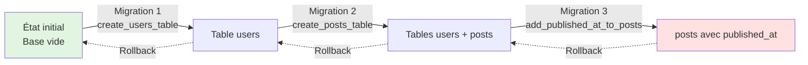
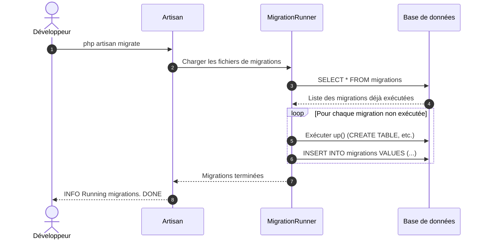
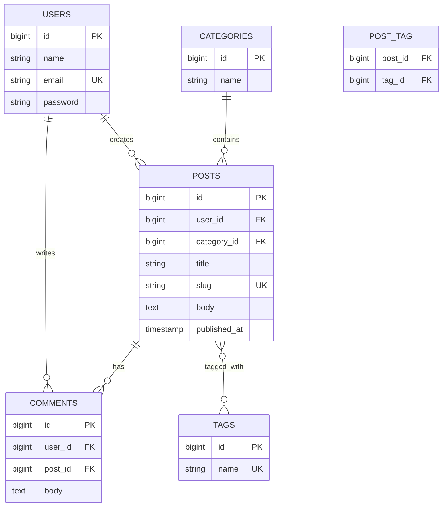
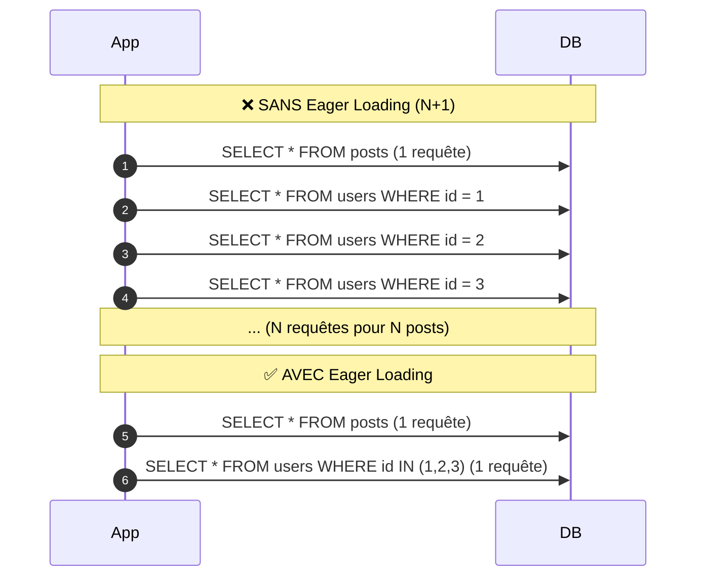

# III - BDD & Eloquent

<div
  class="omny-meta"
  data-level="🟡 Intermédiaire"
  data-version="1.0"
  data-time="15-18 heures">
</div>

## Introduction au module

!!! quote "Analogie pédagogique"
    _Imaginez une **bibliothèque municipale**. Les **migrations** sont comme le plan architectural : elles définissent où se trouvent les étagères (tables), combien de livres chaque étagère peut contenir (colonnes), et comment les sections sont reliées (clés étrangères). Les **seeders** sont les bibliothécaires qui remplissent initialement les étagères avec les premiers ouvrages. **Eloquent** est le système de catalogue informatisé : au lieu de chercher physiquement dans les rayons, vous tapez "romans policiers" et le système vous rapporte tous les livres correspondants. Les **relations** sont les références croisées : "Si vous aimez cet auteur, vous aimerez aussi ces autres livres"._

Au **Module 2**, vous avez créé des controllers qui manipulent des données, mais ces données n'étaient pas persistées. Maintenant, nous allons **structurer notre base de données**, apprendre à la **manipuler avec Eloquent** (l'ORM[^1] de Laravel), et comprendre comment **relier les entités entre elles**.

**Objectifs pédagogiques du module :**

- [x] Comprendre le système de migrations (versioning du schéma DB)
- [x] Créer et modifier des tables avec les migrations
- [x] Configurer SQLite, MySQL/MariaDB, et PostgreSQL
- [x] Maîtriser Eloquent ORM pour le CRUD (Create, Read, Update, Delete)
- [x] Implémenter les relations entre modèles (One-to-Many, Many-to-Many, etc.)
- [x] Utiliser les Query Scopes pour réutiliser des requêtes
- [x] Créer des Seeders et Factories pour générer des données de test
- [x] Comprendre les mutateurs et accesseurs
- [x] Gérer les transactions pour garantir l'intégrité des données

---

## 1. Réflexion préliminaire : pourquoi un ORM ?

### 1.1 Questions à se poser avant de commencer

!!! question "Exercice de réflexion (5 minutes)"
    Avant de plonger dans le code, prenez quelques minutes pour réfléchir à ces questions :
    
    1. **Sans ORM**, comment récupéreriez-vous tous les posts d'un utilisateur ? (Pensez SQL brut)
    2. **Quel est le problème** avec cette approche : `$query = "SELECT * FROM users WHERE email = '{$_POST['email']}'";` ?
    3. **Comment géreriez-vous** l'ajout d'une colonne `published_at` à une table `posts` si vous avez 3 environnements (dev, staging, prod) ?

<details>
<summary>Réponses guidées</summary>

**Question 1 : Récupérer les posts d'un utilisateur (SQL brut)**

```php
// Sans ORM : SQL manuel
$userId = 42;
$query = "SELECT * FROM posts WHERE user_id = ? ORDER BY created_at DESC";
$stmt = $pdo->prepare($query);
$stmt->execute([$userId]);
$posts = $stmt->fetchAll(PDO::FETCH_OBJ);

// Avec Eloquent ORM :
$posts = User::find(42)->posts;
```

**Problèmes du SQL brut :**
- Verbosité (beaucoup de code pour des opérations simples)
- Risque d'erreurs (typos SQL)
- Difficulté de maintenance (refactoring complexe)
- Pas de typage (pas d'autocomplétion IDE)

**Question 2 : Le problème de la requête non protégée**

```php
// ❌ DANGER : SQL Injection
$query = "SELECT * FROM users WHERE email = '{$_POST['email']}'";
```

Si un utilisateur envoie `email = "' OR '1'='1"`, la requête devient :
```sql
SELECT * FROM users WHERE email = '' OR '1'='1'
```
→ Retourne **tous** les utilisateurs !

**Solution :** Requêtes préparées (PDO) ou ORM qui gère ça automatiquement.

**Question 3 : Gérer l'ajout d'une colonne sur plusieurs environnements**

Sans système de versioning :
- Vous devez exécuter manuellement `ALTER TABLE posts ADD COLUMN published_at...` sur chaque serveur
- Risque d'oubli (prod sans la colonne → bug)
- Pas d'historique (impossible de revenir en arrière)

Avec migrations Laravel :
- `php artisan migrate` sur chaque environnement
- Historique versionnée (git)
- Rollback possible (`php artisan migrate:rollback`)

</details>

### 1.2 Eloquent ORM vs SQL brut : comparaison

| Opération | SQL brut (PDO) | Eloquent ORM |
|-----------|----------------|--------------|
| **Récupérer tous les posts** | `SELECT * FROM posts` + fetch | `Post::all()` |
| **Créer un post** | `INSERT INTO posts...` + bind | `Post::create([...])` |
| **Mettre à jour** | `UPDATE posts SET ... WHERE id = ?` | `$post->update([...])` |
| **Supprimer** | `DELETE FROM posts WHERE id = ?` | `$post->delete()` |
| **Récupérer avec condition** | `SELECT * WHERE status = ?` | `Post::where('status', 'published')->get()` |
| **Relations** | JOIN manuel + logique de mapping | `$user->posts` |

**Eloquent ne remplace pas SQL** : il l'**abstrait**. En coulisse, Eloquent génère du SQL optimisé.

---

## 2. Migrations : le versioning de votre base de données

### 2.1 Concept : qu'est-ce qu'une migration ?

Une **migration** est un fichier PHP qui définit des **modifications de schéma** de base de données :

- Créer/supprimer des tables
- Ajouter/supprimer/modifier des colonnes
- Créer des index, clés étrangères
- Modifier le type d'une colonne

**Principe clé :** Les migrations sont **versionnées** et **réversibles**.



_Les migrations permettent de faire évoluer le schéma progressivement et de revenir en arrière si nécessaire._

### 2.2 Créer votre première migration

**Commande pour créer une table :**

```bash
# Convention : create_NOM_PLURIEL_table
php artisan make:migration create_posts_table
```

**Fichier généré : `database/migrations/2024_01_15_100000_create_posts_table.php`**

```php
<?php

use Illuminate\Database\Migrations\Migration;
use Illuminate\Database\Schema\Blueprint;
use Illuminate\Support\Facades\Schema;

/**
 * Migration de création de la table "posts".
 * 
 * Cette classe définit deux méthodes :
 * - up() : exécutée lors de php artisan migrate
 * - down() : exécutée lors de php artisan migrate:rollback
 * 
 * Principe : up() et down() doivent être des **opérations inverses**.
 */
return new class extends Migration
{
    /**
     * Exécute les modifications de la base de données.
     * 
     * Ici : création de la table "posts" avec ses colonnes.
     */
    public function up(): void
    {
        Schema::create('posts', function (Blueprint $table) {
            // Colonne id (BIGINT UNSIGNED AUTO_INCREMENT PRIMARY KEY)
            $table->id();
            
            // Colonne user_id (clé étrangère vers la table users)
            // unsignedBigInteger() car users.id est un BIGINT UNSIGNED
            $table->foreignId('user_id')
                ->constrained()              // Crée la clé étrangère vers users.id
                ->onDelete('cascade');       // Si user supprimé → posts supprimés
            
            // Colonne title (VARCHAR(255) NOT NULL)
            $table->string('title');
            
            // Colonne slug (VARCHAR(255) UNIQUE NOT NULL)
            $table->string('slug')->unique();
            
            // Colonne body (TEXT NOT NULL)
            $table->text('body');
            
            // Colonnes created_at et updated_at (TIMESTAMP)
            $table->timestamps();
        });
    }

    /**
     * Annule les modifications (rollback).
     * 
     * Ici : suppression de la table "posts".
     */
    public function down(): void
    {
        Schema::dropIfExists('posts');
    }
};
```

**Explication détaillée des types de colonnes :**

| Méthode Blueprint | Type SQL | Usage |
|-------------------|----------|-------|
| `$table->id()` | `BIGINT UNSIGNED AUTO_INCREMENT PRIMARY KEY` | Clé primaire auto-incrémentée |
| `$table->foreignId('user_id')` | `BIGINT UNSIGNED` | Clé étrangère (référence vers une autre table) |
| `$table->string('name', 100)` | `VARCHAR(100)` | Chaîne de caractères (longueur max) |
| `$table->text('body')` | `TEXT` | Texte long (ex: contenu d'un article) |
| `$table->integer('views')` | `INT` | Nombre entier |
| `$table->boolean('is_published')` | `TINYINT(1)` | Booléen (true/false) |
| `$table->date('published_at')` | `DATE` | Date (YYYY-MM-DD) |
| `$table->timestamp('created_at')` | `TIMESTAMP` | Date + heure |
| `$table->timestamps()` | `created_at` + `updated_at` | Horodatage automatique |

**Modificateurs de colonnes :**

```php
// Colonne nullable (peut être NULL)
$table->string('subtitle')->nullable();

// Valeur par défaut
$table->boolean('is_published')->default(false);

// Colonne unique (contrainte d'unicité)
$table->string('email')->unique();

// Colonne non signée (uniquement valeurs positives)
$table->integer('views')->unsigned();

// Colonne avec commentaire (documentation)
$table->string('status')->comment('draft, published, archived');
```

### 2.3 Exécuter les migrations

**Commande pour appliquer toutes les migrations non exécutées :**

```bash
php artisan migrate
```

**Sortie console :**

```
INFO  Running migrations.

2024_01_01_000000_create_users_table ........................ 12ms DONE
2024_01_15_100000_create_posts_table ........................ 8ms DONE
```

**Que se passe-t-il en coulisse ?**

1. Laravel lit le dossier `database/migrations/`
2. Il consulte la table `migrations` (créée automatiquement) pour savoir quelles migrations ont déjà été exécutées
3. Il exécute les méthodes `up()` des migrations manquantes, dans l'ordre chronologique (tri par timestamp dans le nom du fichier)
4. Il enregistre chaque migration exécutée dans la table `migrations`

**Table `migrations` (Laravel la gère automatiquement) :**

| id | migration | batch |
|----|-----------|-------|
| 1 | 2024_01_01_000000_create_users_table | 1 |
| 2 | 2024_01_15_100000_create_posts_table | 1 |

**Commandes utiles :**

```bash
# Annuler la dernière migration (batch)
php artisan migrate:rollback

# Annuler toutes les migrations
php artisan migrate:reset

# Annuler puis réexécuter toutes les migrations
php artisan migrate:refresh

# Supprimer toutes les tables et réexécuter les migrations (⚠️ DANGER : perte de données)
php artisan migrate:fresh

# Voir le statut des migrations
php artisan migrate:status
```

**Diagramme de séquence : exécution d'une migration**



### 2.4 Modifier une table existante : ajouter une colonne

**Situation :** Vous avez déjà créé la table `posts`, mais vous voulez ajouter une colonne `published_at`.

**Commande :**

```bash
# Convention : add_NOM_COLONNE_to_NOM_TABLE_table
php artisan make:migration add_published_at_to_posts_table --table=posts
```

**Fichier généré :**

```php
<?php

use Illuminate\Database\Migrations\Migration;
use Illuminate\Database\Schema\Blueprint;
use Illuminate\Support\Facades\Schema;

return new class extends Migration
{
    /**
     * Ajoute la colonne published_at à la table posts.
     */
    public function up(): void
    {
        Schema::table('posts', function (Blueprint $table) {
            // Ajoute une colonne timestamp nullable après la colonne 'body'
            $table->timestamp('published_at')
                ->nullable()
                ->after('body');
        });
    }

    /**
     * Annule l'ajout : supprime la colonne published_at.
     */
    public function down(): void
    {
        Schema::table('posts', function (Blueprint $table) {
            $table->dropColumn('published_at');
        });
    }
};
```

**Exécuter :**

```bash
php artisan migrate
```

**SQL généré (approximatif) :**

```sql
ALTER TABLE posts ADD COLUMN published_at TIMESTAMP NULL AFTER body;
```

### 2.5 Autres opérations courantes

**Renommer une colonne :**

```php
public function up(): void
{
    Schema::table('posts', function (Blueprint $table) {
        $table->renameColumn('body', 'content');
    });
}
```

**Modifier le type d'une colonne :**

```php
public function up(): void
{
    Schema::table('posts', function (Blueprint $table) {
        // Modifier title de VARCHAR(255) à VARCHAR(500)
        $table->string('title', 500)->change();
    });
}
```

**Supprimer une colonne :**

```php
public function up(): void
{
    Schema::table('posts', function (Blueprint $table) {
        $table->dropColumn('subtitle');
    });
}
```

**Créer un index :**

```php
public function up(): void
{
    Schema::table('posts', function (Blueprint $table) {
        // Index simple sur la colonne slug
        $table->index('slug');
        
        // Index composite (multi-colonnes)
        $table->index(['user_id', 'published_at']);
    });
}
```

---

## 3. Configuration multi-SGBD : SQLite, MySQL, PostgreSQL

### 3.1 Pourquoi configurer plusieurs SGBD ?

**Scénario réaliste :**

- **Développement local** : SQLite (zéro config, fichier unique)
- **Staging/Production** : MySQL ou PostgreSQL (robustesse, performance)

Laravel permet de **switcher facilement** entre SGBD grâce au fichier `.env`.

### 3.2 Configuration SQLite

**Avantages :**
- Aucun serveur à installer
- Base de données = fichier unique
- Parfait pour développement/prototypage

**Étape 1 : Créer le fichier de base de données**

```bash
# Linux/Mac
touch database/database.sqlite

# Windows (PowerShell)
New-Item database/database.sqlite

# Ou Windows (CMD)
type nul > database\database.sqlite
```

**Étape 2 : Configurer `.env`**

```env
DB_CONNECTION=sqlite
# Pas besoin de DB_HOST, DB_PORT, DB_DATABASE, etc.
```

**Étape 3 : Exécuter les migrations**

```bash
php artisan migrate
```

**Résultat :** Le fichier `database/database.sqlite` contient maintenant vos tables.

### 3.3 Configuration MySQL / MariaDB

**Prérequis :** MySQL ou MariaDB installé et en cours d'exécution.

**Étape 1 : Créer la base de données**

```bash
# Se connecter à MySQL
mysql -u root -p

# Créer la base
CREATE DATABASE blog_laravel CHARACTER SET utf8mb4 COLLATE utf8mb4_unicode_ci;

# Quitter
exit;
```

**Étape 2 : Configurer `.env`**

```env
DB_CONNECTION=mysql
DB_HOST=127.0.0.1
DB_PORT=3306
DB_DATABASE=blog_laravel
DB_USERNAME=root
DB_PASSWORD=votre_mot_de_passe
```

**Étape 3 : Exécuter les migrations**

```bash
php artisan migrate
```

**Fichier de configuration : `config/database.php`**

Laravel lit `.env` et utilise ces valeurs dans `config/database.php` :

```php
'mysql' => [
    'driver' => 'mysql',
    'host' => env('DB_HOST', '127.0.0.1'),
    'port' => env('DB_PORT', '3306'),
    'database' => env('DB_DATABASE', 'forge'),
    'username' => env('DB_USERNAME', 'forge'),
    'password' => env('DB_PASSWORD', ''),
    'charset' => 'utf8mb4',
    'collation' => 'utf8mb4_unicode_ci',
    'prefix' => '',
    'strict' => true,
    'engine' => null,
],
```

### 3.4 Configuration PostgreSQL

**Prérequis :** PostgreSQL installé.

**Étape 1 : Créer la base de données**

```bash
# Se connecter à PostgreSQL
psql -U postgres

# Créer la base
CREATE DATABASE blog_laravel;

# Quitter
\q
```

**Étape 2 : Configurer `.env`**

```env
DB_CONNECTION=pgsql
DB_HOST=127.0.0.1
DB_PORT=5432
DB_DATABASE=blog_laravel
DB_USERNAME=postgres
DB_PASSWORD=votre_mot_de_passe
```

**Étape 3 : Exécuter les migrations**

```bash
php artisan migrate
```

### 3.5 Tableau comparatif

| SGBD | Avantages | Inconvénients | Cas d'usage |
|------|-----------|---------------|-------------|
| **SQLite** | Zéro config, portable, rapide | Pas de concurrence, limité en volume | Dev local, prototypes, tests |
| **MySQL** | Populaire, bien documenté, mature | Performances moyennes en écriture | Applications web standard |
| **MariaDB** | Fork MySQL, compatible, open-source | Moins populaire que MySQL | Alternative à MySQL |
| **PostgreSQL** | Robuste, SQL avancé, JSONB | Courbe d'apprentissage | Apps complexes, données structurées + JSON |

---

## 4. Eloquent ORM : les bases du CRUD

### 4.1 Créer un modèle

**Commande :**

```bash
# Créer le modèle Post
php artisan make:model Post
```

**Fichier généré : `app/Models/Post.php`**

```php
<?php

namespace App\Models;

use Illuminate\Database\Eloquent\Model;

/**
 * Modèle représentant un article de blog.
 * 
 * Par convention, Laravel associe automatiquement ce modèle
 * à la table "posts" (pluriel snake_case du nom du modèle).
 * 
 * @property int $id
 * @property int $user_id
 * @property string $title
 * @property string $slug
 * @property string $body
 * @property \Illuminate\Support\Carbon $published_at
 * @property \Illuminate\Support\Carbon $created_at
 * @property \Illuminate\Support\Carbon $updated_at
 */
class Post extends Model
{
    /**
     * Colonnes assignables en masse (mass assignment).
     * 
     * Protection contre l'injection de colonnes non désirées.
     * Exemple : si l'utilisateur envoie ['title' => '...', 'is_admin' => true],
     * seul 'title' sera accepté (is_admin n'est pas dans $fillable).
     * 
     * @var array<string>
     */
    protected $fillable = [
        'user_id',
        'title',
        'slug',
        'body',
        'published_at',
    ];

    /**
     * Colonnes à caster (conversion automatique de type).
     * 
     * published_at sera automatiquement converti en objet Carbon (DateTime amélioré).
     * 
     * @var array<string, string>
     */
    protected $casts = [
        'published_at' => 'datetime',
    ];
}
```

**Conventions Eloquent :**

| Convention | Valeur par défaut | Personnalisable |
|------------|-------------------|-----------------|
| **Nom de table** | Pluriel snake_case du modèle (`posts` pour `Post`) | `protected $table = 'articles';` |
| **Clé primaire** | `id` | `protected $primaryKey = 'post_id';` |
| **Timestamps** | `created_at`, `updated_at` automatiques | `public $timestamps = false;` |
| **Connexion DB** | Connexion par défaut (`.env`) | `protected $connection = 'mysql_prod';` |

### 4.2 Create : créer des enregistrements

**Méthode 1 : Instanciation + save()**

```php
use App\Models\Post;

// Créer une instance du modèle
$post = new Post();

// Assigner les valeurs aux propriétés
$post->user_id = 1;
$post->title = 'Mon premier post';
$post->slug = 'mon-premier-post';
$post->body = 'Contenu du post...';

// Enregistrer en base de données
// Exécute : INSERT INTO posts (user_id, title, slug, body, created_at, updated_at) VALUES (...)
$post->save();

// $post->id contient maintenant l'ID auto-généré
echo $post->id; // 1
```

**Méthode 2 : create() (assignation de masse)**

```php
$post = Post::create([
    'user_id' => 1,
    'title' => 'Mon premier post',
    'slug' => 'mon-premier-post',
    'body' => 'Contenu du post...',
]);

// Équivalent à new Post() + assign + save(), mais en une ligne
```

**⚠️ Mass Assignment Protection**

```php
// ❌ DANGER : si $fillable n'est pas défini, cette ligne échoue
$post = Post::create($request->all());

// ✅ BON : seuls les champs dans $fillable sont acceptés
protected $fillable = ['user_id', 'title', 'slug', 'body'];
```

**Pourquoi cette protection ?**  
Imaginez que l'utilisateur envoie `['title' => '...', 'is_admin' => true]` via le formulaire. Sans `$fillable`, il pourrait se promouvoir admin !

### 4.3 Read : récupérer des enregistrements

**Récupérer tous les posts :**

```php
// SELECT * FROM posts
$posts = Post::all();

// Retourne une Collection Eloquent (itérable comme un tableau)
foreach ($posts as $post) {
    echo $post->title;
}
```

**Récupérer par ID :**

```php
// SELECT * FROM posts WHERE id = 1 LIMIT 1
$post = Post::find(1);

// Si le post n'existe pas, $post est null
if ($post) {
    echo $post->title;
}

// Ou avec exception 404 automatique si non trouvé
$post = Post::findOrFail(1);
```

**Récupérer avec conditions :**

```php
// SELECT * FROM posts WHERE user_id = 1
$posts = Post::where('user_id', 1)->get();

// SELECT * FROM posts WHERE user_id = 1 AND published_at IS NOT NULL
$posts = Post::where('user_id', 1)
    ->whereNotNull('published_at')
    ->get();

// SELECT * FROM posts WHERE title LIKE '%Laravel%'
$posts = Post::where('title', 'LIKE', '%Laravel%')->get();
```

**Ordonner les résultats :**

```php
// SELECT * FROM posts ORDER BY created_at DESC
$posts = Post::orderBy('created_at', 'desc')->get();

// Raccourci pour orderBy('created_at', 'desc')
$posts = Post::latest()->get();

// Raccourci pour orderBy('created_at', 'asc')
$posts = Post::oldest()->get();
```

**Limiter les résultats :**

```php
// SELECT * FROM posts LIMIT 5
$posts = Post::limit(5)->get();

// SELECT * FROM posts ORDER BY created_at DESC LIMIT 10
$posts = Post::latest()->limit(10)->get();
```

**Récupérer le premier résultat :**

```php
// SELECT * FROM posts WHERE user_id = 1 LIMIT 1
$post = Post::where('user_id', 1)->first();

// Ou avec exception si non trouvé
$post = Post::where('user_id', 1)->firstOrFail();
```

**Compter les résultats :**

```php
// SELECT COUNT(*) FROM posts
$count = Post::count();

// SELECT COUNT(*) FROM posts WHERE user_id = 1
$count = Post::where('user_id', 1)->count();
```

### 4.4 Update : mettre à jour des enregistrements

**Méthode 1 : find() + save()**

```php
$post = Post::find(1);

$post->title = 'Titre modifié';
$post->body = 'Nouveau contenu';

// Exécute : UPDATE posts SET title = ?, body = ?, updated_at = ? WHERE id = 1
$post->save();
```

**Méthode 2 : update() (assignation de masse)**

```php
$post = Post::find(1);

$post->update([
    'title' => 'Titre modifié',
    'body' => 'Nouveau contenu',
]);
```

**Mise à jour en masse (plusieurs enregistrements) :**

```php
// UPDATE posts SET published_at = NOW() WHERE user_id = 1
Post::where('user_id', 1)->update([
    'published_at' => now(),
]);

// ⚠️ Cette méthode ne déclenche PAS les événements Eloquent (observers)
```

### 4.5 Delete : supprimer des enregistrements

**Méthode 1 : find() + delete()**

```php
$post = Post::find(1);

// Exécute : DELETE FROM posts WHERE id = 1
$post->delete();
```

**Méthode 2 : destroy() (par ID)**

```php
// Supprimer un seul post
Post::destroy(1);

// Supprimer plusieurs posts
Post::destroy([1, 2, 3]);

// Équivalent à :
// DELETE FROM posts WHERE id IN (1, 2, 3)
```

**Suppression en masse :**

```php
// DELETE FROM posts WHERE user_id = 1
Post::where('user_id', 1)->delete();
```

**Soft Delete (suppression douce) :**

Nous verrons cette fonctionnalité avancée plus tard. Principe : au lieu de supprimer physiquement, on marque l'enregistrement comme "supprimé" avec un timestamp `deleted_at`.

---

## 5. Relations entre modèles : le cœur d'Eloquent

### 5.1 Réflexion : modéliser notre blog

!!! question "Exercice de conception (10 minutes)"
    Notre blog a besoin de ces entités :
    
    1. **Users** (utilisateurs) - Auteurs des posts
    2. **Posts** (articles)
    3. **Categories** (catégories)
    4. **Tags** (étiquettes)
    5. **Comments** (commentaires)
    
    **Questions :**
    
    1. Un utilisateur peut-il créer plusieurs posts ? (One-to-Many ?)
    2. Un post appartient-il à une seule catégorie ? (One-to-One ou One-to-Many ?)
    3. Un post peut-il avoir plusieurs tags ? Un tag peut-il être sur plusieurs posts ? (Many-to-Many ?)
    4. Les commentaires : relation avec posts ? Avec users ?

<details>
<summary>Réponses et diagramme de relations</summary>

**Relations identifiées :**

1. **User → Posts** : One-to-Many (un user a plusieurs posts)
2. **Post → User** : Belongs-to (un post appartient à un user)
3. **Post → Category** : Belongs-to (un post appartient à une catégorie)
4. **Category → Posts** : One-to-Many (une catégorie a plusieurs posts)
5. **Post ↔ Tags** : Many-to-Many (un post a plusieurs tags, un tag est sur plusieurs posts)
6. **Post → Comments** : One-to-Many (un post a plusieurs commentaires)
7. **User → Comments** : One-to-Many (un user peut faire plusieurs commentaires)

**Diagramme ERD :**



</details>

### 5.2 Relation One-to-Many : User → Posts

**Principe :** Un utilisateur peut créer plusieurs posts, mais chaque post appartient à un seul utilisateur.

**Étape 1 : Ajouter la relation dans le modèle User**

```php
<?php

namespace App\Models;

use Illuminate\Foundation\Auth\User as Authenticatable;
use Illuminate\Database\Eloquent\Relations\HasMany;

class User extends Authenticatable
{
    // ... autres propriétés ...

    /**
     * Un utilisateur possède plusieurs posts.
     * 
     * hasMany() définit une relation "un à plusieurs".
     * Laravel déduit automatiquement la clé étrangère : user_id (nom_modèle_id).
     * 
     * @return \Illuminate\Database\Eloquent\Relations\HasMany
     */
    public function posts(): HasMany
    {
        return $this->hasMany(Post::class);
        
        // Si la clé étrangère n'était pas user_id, vous pourriez spécifier :
        // return $this->hasMany(Post::class, 'author_id', 'id');
    }
}
```

**Étape 2 : Ajouter la relation inverse dans le modèle Post**

```php
<?php

namespace App\Models;

use Illuminate\Database\Eloquent\Model;
use Illuminate\Database\Eloquent\Relations\BelongsTo;

class Post extends Model
{
    // ... autres propriétés ...

    /**
     * Un post appartient à un utilisateur.
     * 
     * belongsTo() définit la relation inverse de hasMany().
     * 
     * @return \Illuminate\Database\Eloquent\Relations\BelongsTo
     */
    public function user(): BelongsTo
    {
        return $this->belongsTo(User::class);
    }
}
```

**Utilisation dans le code :**

```php
// Récupérer tous les posts d'un utilisateur
$user = User::find(1);
$posts = $user->posts; // Collection de posts

foreach ($posts as $post) {
    echo $post->title;
}

// Récupérer l'auteur d'un post
$post = Post::find(1);
$author = $post->user; // Instance de User

echo $author->name;
```

**SQL généré (approximatif) :**

```php
// $user->posts exécute :
// SELECT * FROM posts WHERE user_id = 1

// $post->user exécute :
// SELECT * FROM users WHERE id = ? (valeur de $post->user_id)
```

**Créer un post pour un utilisateur :**

```php
$user = User::find(1);

// Méthode 1 : via la relation
$post = $user->posts()->create([
    'title' => 'Nouveau post',
    'slug' => 'nouveau-post',
    'body' => 'Contenu...',
]);

// Laravel définit automatiquement user_id = 1

// Méthode 2 : manuelle
$post = Post::create([
    'user_id' => $user->id,
    'title' => 'Nouveau post',
    'slug' => 'nouveau-post',
    'body' => 'Contenu...',
]);
```

### 5.3 Relation Many-to-Many : Posts ↔ Tags

**Principe :** Un post peut avoir plusieurs tags, et un tag peut être associé à plusieurs posts.

**Étape 1 : Créer les modèles et migrations**

```bash
# Modèle Tag + migration
php artisan make:model Tag -m

# Table pivot (jonction) post_tag
# Convention : tables en ordre alphabétique, singulier, snake_case
php artisan make:migration create_post_tag_table
```

**Migration Tag :**

```php
// database/migrations/xxxx_create_tags_table.php
public function up(): void
{
    Schema::create('tags', function (Blueprint $table) {
        $table->id();
        $table->string('name')->unique();
        $table->timestamps();
    });
}
```

**Migration table pivot :**

```php
// database/migrations/xxxx_create_post_tag_table.php
public function up(): void
{
    Schema::create('post_tag', function (Blueprint $table) {
        $table->id();
        
        // Clés étrangères vers posts et tags
        $table->foreignId('post_id')->constrained()->onDelete('cascade');
        $table->foreignId('tag_id')->constrained()->onDelete('cascade');
        
        $table->timestamps();
        
        // Index unique pour empêcher les doublons (même post + même tag)
        $table->unique(['post_id', 'tag_id']);
    });
}
```

**Exécuter les migrations :**

```bash
php artisan migrate
```

**Étape 2 : Définir les relations**

**Dans le modèle Post :**

```php
use Illuminate\Database\Eloquent\Relations\BelongsToMany;

public function tags(): BelongsToMany
{
    /**
     * Un post appartient à plusieurs tags.
     * 
     * belongsToMany() crée une relation Many-to-Many.
     * Laravel déduit la table pivot : post_tag (ordre alphabétique).
     */
    return $this->belongsToMany(Tag::class);
    
    // Si votre table pivot a un nom custom :
    // return $this->belongsToMany(Tag::class, 'post_tags');
    
    // Si vos clés étrangères ont des noms custom :
    // return $this->belongsToMany(Tag::class, 'post_tags', 'post_id', 'tag_id');
}
```

**Dans le modèle Tag :**

```php
use Illuminate\Database\Eloquent\Relations\BelongsToMany;

public function posts(): BelongsToMany
{
    /**
     * Un tag appartient à plusieurs posts.
     */
    return $this->belongsToMany(Post::class);
}
```

**Utilisation :**

```php
// Récupérer les tags d'un post
$post = Post::find(1);
$tags = $post->tags; // Collection de tags

foreach ($tags as $tag) {
    echo $tag->name;
}

// Récupérer les posts d'un tag
$tag = Tag::find(1);
$posts = $tag->posts; // Collection de posts
```

**Attacher (ajouter) des tags à un post :**

```php
$post = Post::find(1);

// Attacher un seul tag (ID 5)
$post->tags()->attach(5);

// Attacher plusieurs tags
$post->tags()->attach([1, 2, 3]);

// Détacher (supprimer) un tag
$post->tags()->detach(5);

// Détacher tous les tags
$post->tags()->detach();

// Synchroniser : remplacer tous les tags existants par une nouvelle liste
$post->tags()->sync([1, 2, 3]);
// Si le post avait les tags [2, 4], après sync il aura [1, 2, 3]
```

**SQL généré (approximatif) :**

```php
// attach(5) exécute :
// INSERT INTO post_tag (post_id, tag_id) VALUES (1, 5)

// detach(5) exécute :
// DELETE FROM post_tag WHERE post_id = 1 AND tag_id = 5

// sync([1,2,3]) exécute :
// DELETE FROM post_tag WHERE post_id = 1
// INSERT INTO post_tag (post_id, tag_id) VALUES (1,1), (1,2), (1,3)
```

### 5.4 Eager Loading : éviter le problème N+1

**Problème N+1 : qu'est-ce que c'est ?**

```php
// ❌ MAUVAIS : Problème N+1
$posts = Post::all(); // 1 requête

foreach ($posts as $post) {
    echo $post->user->name; // N requêtes (une par post)
}

// Si vous avez 100 posts, cela exécute 101 requêtes SQL !
// 1 pour récupérer les posts + 100 pour récupérer chaque auteur
```

**Solution : Eager Loading (chargement anticipé)**

```php
// ✅ BON : Eager Loading
$posts = Post::with('user')->get(); // 2 requêtes seulement

foreach ($posts as $post) {
    echo $post->user->name; // Pas de requête supplémentaire
}

// Requête 1 : SELECT * FROM posts
// Requête 2 : SELECT * FROM users WHERE id IN (1,2,3,...)
```

**Eager Loading multiple :**

```php
// Charger les relations user, category, et tags
$posts = Post::with(['user', 'category', 'tags'])->get();

// Charger une relation imbriquée (nested)
// Ex : posts avec leurs commentaires ET les auteurs des commentaires
$posts = Post::with(['comments.user'])->get();
```

**Diagramme comparatif : avec/sans Eager Loading**



---

## 6. Query Scopes : réutiliser des requêtes

### 6.1 Problème : duplication de requêtes

Imaginez que vous récupérez souvent "les posts publiés" dans votre application :

```php
// Dans le controller A
$posts = Post::whereNotNull('published_at')->get();

// Dans le controller B
$posts = Post::whereNotNull('published_at')->latest()->get();

// Dans le controller C
$posts = Post::whereNotNull('published_at')->where('user_id', $userId)->get();
```

**Duplication :** `whereNotNull('published_at')` est répété partout.

### 6.2 Solution : Local Scope

Un **scope** est une méthode du modèle qui encapsule une condition réutilisable.

**Définir un scope dans le modèle Post :**

```php
<?php

namespace App\Models;

use Illuminate\Database\Eloquent\Model;
use Illuminate\Database\Eloquent\Builder;

class Post extends Model
{
    /**
     * Scope : posts publiés uniquement.
     * 
     * Convention : méthode scope{Nom}($query)
     * Usage : Post::published()->get()
     * 
     * @param  \Illuminate\Database\Eloquent\Builder  $query
     * @return \Illuminate\Database\Eloquent\Builder
     */
    public function scopePublished(Builder $query): Builder
    {
        return $query->whereNotNull('published_at');
    }

    /**
     * Scope : posts d'un utilisateur spécifique.
     * 
     * @param  \Illuminate\Database\Eloquent\Builder  $query
     * @param  int  $userId
     * @return \Illuminate\Database\Eloquent\Builder
     */
    public function scopeByUser(Builder $query, int $userId): Builder
    {
        return $query->where('user_id', $userId);
    }

    /**
     * Scope : posts populaires (exemple avec une condition arbitraire).
     */
    public function scopePopular(Builder $query): Builder
    {
        return $query->where('views', '>', 1000);
    }
}
```

**Utilisation :**

```php
// Posts publiés
$posts = Post::published()->get();

// Posts publiés d'un utilisateur
$posts = Post::published()->byUser(1)->get();

// Posts publiés ET populaires, triés par date
$posts = Post::published()->popular()->latest()->get();

// Les scopes sont chaînables comme des méthodes de Query Builder
```

**SQL généré (approximatif) :**

```php
// Post::published()->byUser(1)->latest()->get()
// SELECT * FROM posts 
// WHERE published_at IS NOT NULL 
// AND user_id = 1 
// ORDER BY created_at DESC
```

---

## 7. Seeders et Factories : générer des données de test

### 7.1 Pourquoi des données de test ?

En développement, vous avez besoin de **données réalistes** pour :

- Tester l'interface utilisateur (posts, commentaires, etc.)
- Développer sans dépendre d'une base de production
- Exécuter des tests automatisés

**Seeders** = Insérer des données fixes (ex: catégories prédéfinies)  
**Factories** = Générer des données aléatoires (ex: 100 posts factices)

### 7.2 Créer un Seeder

**Commande :**

```bash
php artisan make:seeder CategorySeeder
```

**Fichier généré : `database/seeders/CategorySeeder.php`**

```php
<?php

namespace Database\Seeders;

use Illuminate\Database\Seeder;
use App\Models\Category;

class CategorySeeder extends Seeder
{
    /**
     * Peuple la base avec des catégories prédéfinies.
     */
    public function run(): void
    {
        $categories = [
            ['name' => 'Laravel'],
            ['name' => 'PHP'],
            ['name' => 'JavaScript'],
            ['name' => 'Bases de données'],
            ['name' => 'DevOps'],
        ];

        foreach ($categories as $category) {
            Category::create($category);
        }
    }
}
```

**Enregistrer le seeder dans `DatabaseSeeder` :**

```php
<?php

namespace Database\Seeders;

use Illuminate\Database\Seeder;

class DatabaseSeeder extends Seeder
{
    public function run(): void
    {
        // Appeler le CategorySeeder
        $this->call(CategorySeeder::class);
    }
}
```

**Exécuter les seeders :**

```bash
# Exécuter tous les seeders
php artisan db:seed

# Exécuter un seeder spécifique
php artisan db:seed --class=CategorySeeder

# Réinitialiser + migrer + seeder (⚠️ perte de données)
php artisan migrate:fresh --seed
```

### 7.3 Créer une Factory

**Commande :**

```bash
php artisan make:factory PostFactory
```

**Fichier généré : `database/factories/PostFactory.php`**

```php
<?php

namespace Database\Factories;

use App\Models\User;
use App\Models\Category;
use Illuminate\Database\Eloquent\Factories\Factory;
use Illuminate\Support\Str;

/**
 * Factory pour générer des posts factices.
 * 
 * @extends \Illuminate\Database\Eloquent\Factories\Factory<\App\Models\Post>
 */
class PostFactory extends Factory
{
    /**
     * Définit l'état par défaut du modèle.
     * 
     * Chaque appel à Post::factory()->create() génère un post
     * avec des valeurs aléatoires définies ici.
     * 
     * @return array<string, mixed>
     */
    public function definition(): array
    {
        $title = fake()->sentence(); // Phrase aléatoire
        
        return [
            // Associer à un utilisateur existant aléatoire
            'user_id' => User::inRandomOrder()->first()->id,
            
            // Titre : phrase aléatoire
            'title' => $title,
            
            // Slug : version URL du titre
            'slug' => Str::slug($title),
            
            // Corps : 3 paragraphes aléatoires
            'body' => fake()->paragraphs(3, true),
            
            // Publié aléatoirement (70% de chance)
            'published_at' => fake()->boolean(70) ? fake()->dateTimeBetween('-1 month', 'now') : null,
        ];
    }
}
```

**Utilisation :**

```php
use App\Models\Post;

// Créer 1 post factice
$post = Post::factory()->create();

// Créer 50 posts factices
Post::factory()->count(50)->create();

// Créer un post avec attributs spécifiques
$post = Post::factory()->create([
    'title' => 'Titre personnalisé',
    'user_id' => 1,
]);
```

**Créer un UserFactory (déjà fourni par Laravel) :**

```php
// database/factories/UserFactory.php
public function definition(): array
{
    return [
        'name' => fake()->name(),
        'email' => fake()->unique()->safeEmail(),
        'password' => bcrypt('password'), // Hash de "password"
    ];
}
```

**Seeder utilisant des factories :**

```php
<?php

namespace Database\Seeders;

use Illuminate\Database\Seeder;
use App\Models\User;
use App\Models\Post;

class DatabaseSeeder extends Seeder
{
    public function run(): void
    {
        // Créer 10 utilisateurs
        User::factory()->count(10)->create();

        // Créer 50 posts (distribués aléatoirement parmi les users)
        Post::factory()->count(50)->create();
    }
}
```

**Exécuter :**

```bash
php artisan migrate:fresh --seed
```

---

## 8. Mutateurs et Accesseurs : formater automatiquement

### 8.1 Accesseurs : formater à la lecture

Un **accesseur** transforme une valeur **quand vous lisez** un attribut.

**Exemple : formater le titre en majuscules**

```php
<?php

namespace App\Models;

use Illuminate\Database\Eloquent\Model;
use Illuminate\Database\Eloquent\Casts\Attribute;

class Post extends Model
{
    /**
     * Accesseur pour l'attribut title.
     * 
     * Quand vous faites $post->title, Laravel appelle cette méthode.
     * 
     * @return \Illuminate\Database\Eloquent\Casts\Attribute
     */
    protected function title(): Attribute
    {
        return Attribute::make(
            get: fn (string $value) => strtoupper($value),
        );
    }
}
```

**Utilisation :**

```php
$post = Post::find(1);

// Valeur en base : "mon titre"
// $post->title retourne : "MON TITRE"
echo $post->title; // MON TITRE
```

**Exemple pratique : afficher une date formatée**

```php
protected function publishedAt(): Attribute
{
    return Attribute::make(
        get: fn ($value) => $value ? \Carbon\Carbon::parse($value)->format('d/m/Y') : null,
    );
}
```

```php
// En base : 2024-01-15 10:30:00
echo $post->published_at; // 15/01/2024
```

### 8.2 Mutateurs : formater à l'écriture

Un **mutateur** transforme une valeur **quand vous l'assignez**.

**Exemple : slug automatique à partir du titre**

```php
protected function title(): Attribute
{
    return Attribute::make(
        get: fn (string $value) => ucfirst($value),
        set: function (string $value) {
            return [
                'title' => $value,
                // Générer automatiquement le slug
                'slug' => \Str::slug($value),
            ];
        },
    );
}
```

**Utilisation :**

```php
$post = new Post();
$post->title = 'Mon Premier Article';
$post->save();

// En base :
// title = "Mon Premier Article"
// slug = "mon-premier-article" (généré automatiquement)
```

---

## 9. Transactions : garantir l'intégrité des données

### 9.1 Problème : opérations atomiques

Imaginez ce scénario :

```php
// Créer un post
$post = Post::create([...]);

// Attacher des tags
$post->tags()->attach([1, 2, 3]);

// Créer une notification
Notification::create([...]);
```

**Que se passe-t-il si la 2ème opération échoue ?**  
→ Le post est créé, mais les tags ne sont pas attachés → données incohérentes.

### 9.2 Solution : transactions DB

Une **transaction** garantit que **toutes les opérations réussissent ou échouent ensemble**.

**Syntaxe :**

```php
use Illuminate\Support\Facades\DB;

DB::transaction(function () {
    // Créer un post
    $post = Post::create([...]);
    
    // Attacher des tags
    $post->tags()->attach([1, 2, 3]);
    
    // Créer une notification
    Notification::create([...]);
    
    // Si une erreur survient ici, TOUT est annulé (rollback)
});

// Si le bloc s'exécute sans erreur, les changements sont validés (commit)
```

**Gestion manuelle (plus de contrôle) :**

```php
DB::beginTransaction();

try {
    // Opérations critiques
    $post = Post::create([...]);
    $post->tags()->attach([1, 2, 3]);
    
    // Si tout s'est bien passé, valider
    DB::commit();
} catch (\Exception $e) {
    // En cas d'erreur, annuler tout
    DB::rollback();
    
    // Log de l'erreur
    \Log::error('Erreur création post : ' . $e->getMessage());
    
    throw $e; // Propager l'exception si nécessaire
}
```

---

## 10. Exercice pratique : système de commentaires

### 10.1 Objectif

Ajouter un système de **commentaires** au blog :

1. Un post peut avoir plusieurs commentaires
2. Un utilisateur peut écrire plusieurs commentaires
3. Un commentaire appartient à un post ET à un utilisateur

### 10.2 Instructions

**Étape 1 : Créer le modèle + migration**

```bash
php artisan make:model Comment -m
```

**Étape 2 : Définir la migration**

```php
// database/migrations/xxxx_create_comments_table.php
public function up(): void
{
    Schema::create('comments', function (Blueprint $table) {
        $table->id();
        
        // Clés étrangères
        $table->foreignId('user_id')->constrained()->onDelete('cascade');
        $table->foreignId('post_id')->constrained()->onDelete('cascade');
        
        // Contenu du commentaire
        $table->text('body');
        
        $table->timestamps();
    });
}
```

**Exécuter :**

```bash
php artisan migrate
```

**Étape 3 : Définir les relations (à vous de jouer !)**

<details>
<summary>Solution</summary>

**Modèle Comment :**

```php
<?php

namespace App\Models;

use Illuminate\Database\Eloquent\Model;
use Illuminate\Database\Eloquent\Relations\BelongsTo;

class Comment extends Model
{
    protected $fillable = ['user_id', 'post_id', 'body'];

    public function user(): BelongsTo
    {
        return $this->belongsTo(User::class);
    }

    public function post(): BelongsTo
    {
        return $this->belongsTo(Post::class);
    }
}
```

**Modèle Post (ajouter) :**

```php
public function comments(): HasMany
{
    return $this->hasMany(Comment::class);
}
```

**Modèle User (ajouter) :**

```php
public function comments(): HasMany
{
    return $this->hasMany(Comment::class);
}
```

</details>

**Étape 4 : Créer une factory pour les commentaires**

```bash
php artisan make:factory CommentFactory
```

<details>
<summary>Solution</summary>

```php
<?php

namespace Database\Factories;

use App\Models\User;
use App\Models\Post;
use Illuminate\Database\Eloquent\Factories\Factory;

class CommentFactory extends Factory
{
    public function definition(): array
    {
        return [
            'user_id' => User::inRandomOrder()->first()->id,
            'post_id' => Post::inRandomOrder()->first()->id,
            'body' => fake()->paragraph(),
        ];
    }
}
```

</details>

**Étape 5 : Tester dans tinker**

```bash
php artisan tinker
```

```php
// Créer des utilisateurs et posts si nécessaire
User::factory()->count(5)->create();
Post::factory()->count(10)->create();

// Créer des commentaires
Comment::factory()->count(20)->create();

// Récupérer les commentaires d'un post
$post = Post::first();
$post->comments; // Collection de commentaires

// Récupérer l'auteur de chaque commentaire
foreach ($post->comments as $comment) {
    echo $comment->user->name;
}
```

---

## 11. Checkpoint de progression

### 11.1 Compétences acquises

À la fin de ce module, vous devriez être capable de :

- [x] Comprendre le rôle des migrations dans le versioning du schéma DB
- [x] Créer et modifier des tables avec les migrations
- [x] Configurer SQLite, MySQL/MariaDB, et PostgreSQL
- [x] Utiliser Eloquent pour le CRUD de base (Create, Read, Update, Delete)
- [x] Définir et utiliser les relations One-to-Many et Many-to-Many
- [x] Éviter le problème N+1 avec l'Eager Loading
- [x] Créer des Query Scopes pour réutiliser des requêtes
- [x] Générer des données de test avec Seeders et Factories
- [x] Utiliser les mutateurs et accesseurs pour formater les données
- [x] Gérer les transactions pour garantir l'intégrité des données

### 11.2 Quiz d'auto-évaluation

1. **Question :** Quelle commande exécute toutes les migrations non appliquées ?
   <details>
   <summary>Réponse</summary>
   `php artisan migrate`
   </details>

2. **Question :** Quelle est la différence entre `find()` et `findOrFail()` ?
   <details>
   <summary>Réponse</summary>
   `find()` retourne `null` si l'enregistrement n'existe pas. `findOrFail()` lève une exception `ModelNotFoundException` (erreur 404 automatique).
   </details>

3. **Question :** Qu'est-ce que le problème N+1 ?
   <details>
   <summary>Réponse</summary>
   Exécuter N requêtes supplémentaires dans une boucle pour charger des relations, au lieu de charger toutes les relations en 1 seule requête avec `with()`.
   </details>

4. **Question :** Comment définir une relation Many-to-Many entre Post et Tag ?
   <details>
   <summary>Réponse</summary>
   Dans Post : `public function tags() { return $this->belongsToMany(Tag::class); }`  
   Dans Tag : `public function posts() { return $this->belongsToMany(Post::class); }`  
   + Table pivot `post_tag` avec colonnes `post_id` et `tag_id`.
   </details>

5. **Question :** À quoi sert `protected $fillable` dans un modèle ?
   <details>
   <summary>Réponse</summary>
   Définit les colonnes autorisées pour l'assignation de masse (`create()`, `update()`), protégeant contre l'injection de colonnes non désirées.
   </details>

---

## 12. Le mot de la fin du module

!!! quote "Récapitulatif"
    Eloquent ORM transforme la manipulation de base de données d'une **corvée technique** en une **API élégante et expressive**. Vous avez maintenant les outils pour :
    
    - Structurer proprement votre schéma avec les migrations
    - Interroger la base de données sans écrire de SQL (tout en comprenant le SQL généré)
    - Modéliser des relations complexes entre entités
    - Générer des données de test pour développer rapidement
    
    Ces concepts sont **universels** dans le développement web moderne. Que vous utilisiez Laravel, Django (Python), Rails (Ruby), ou Symfony (PHP), vous retrouverez des patterns similaires.
    
    **Prochaine étape :** Le **Module 4 - Authentification Custom** va vous apprendre à sécuriser votre application en créant un système d'authentification complet **à la main** (sessions, hashing, middlewares), avant d'utiliser les starter kits (Breeze) au Module 7.

**Prochaine étape :**  
[:lucide-arrow-right: Module 4 - Authentification Custom](../module-04-auth-custom/)

---

## Navigation du module

**Module précédent :**  
[:lucide-arrow-left: Module 2 - Routing & Controllers](../module-02-routing-controllers/)

**Module suivant :**  
[:lucide-arrow-right: Module 4 - Authentification Custom](../module-04-auth-custom/)

**Retour à l'index :**  
[:lucide-home: Index du guide](../index/)

---

[^1]: **ORM (Object-Relational Mapping)** : Technique qui permet de manipuler des données de base de données comme des objets PHP, sans écrire de SQL directement.