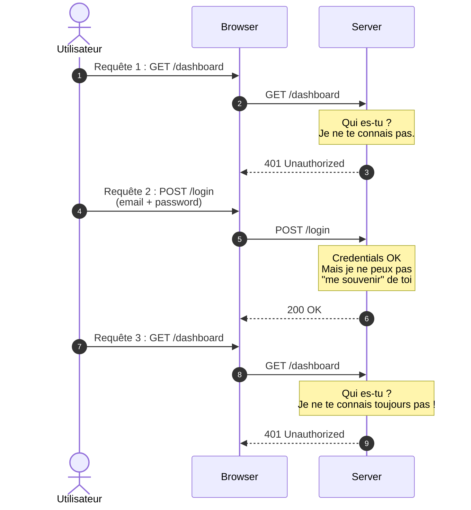
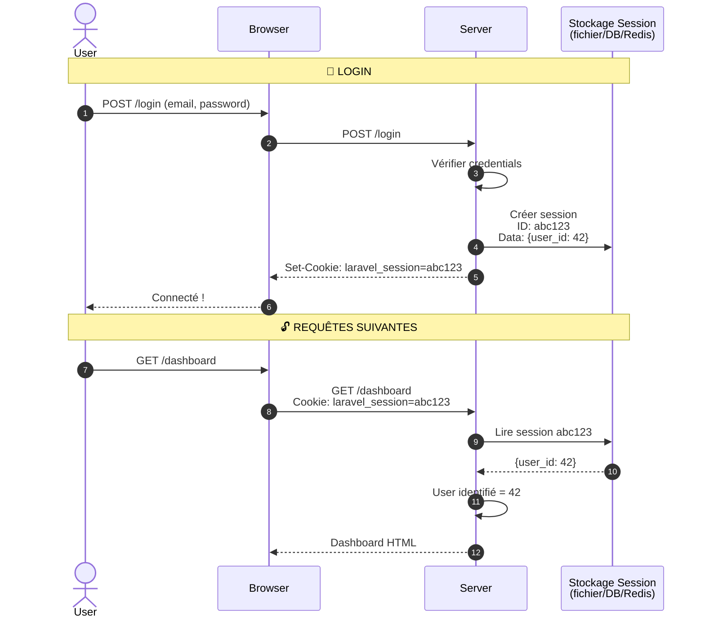
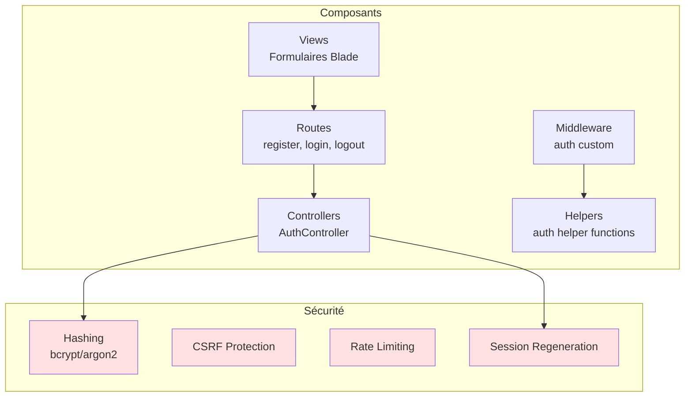
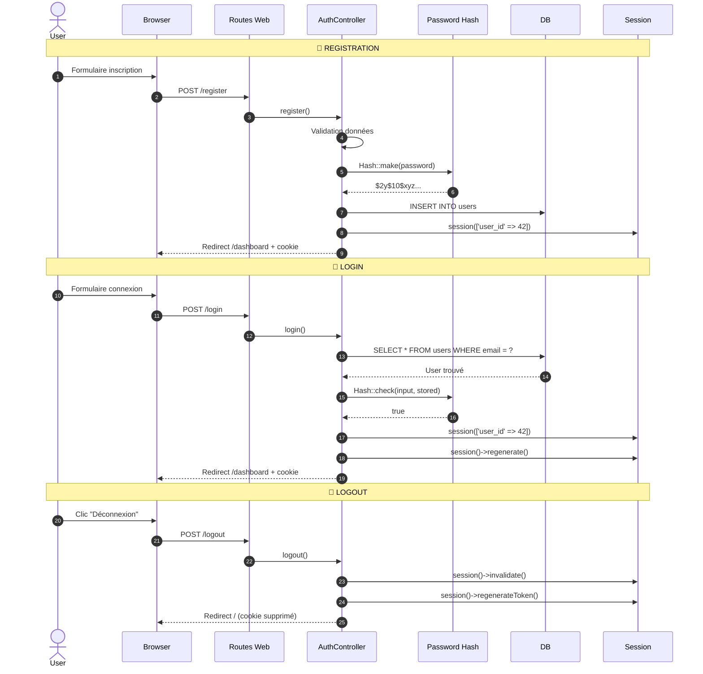
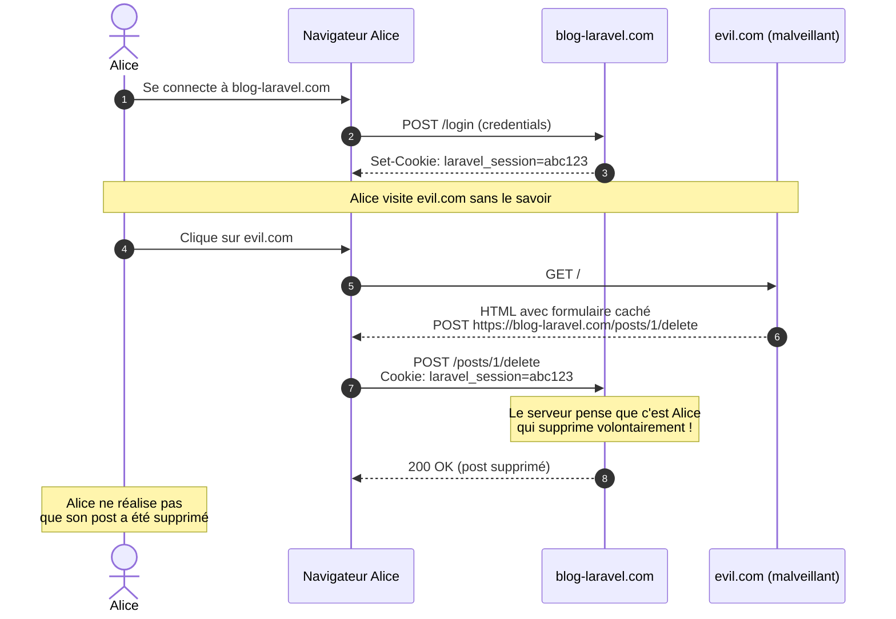

# IV - Auth' Custom

<div
  class="omny-meta"
  data-level="🟡 Intermédiaire"
  data-version="1.0"
  data-time="12-15 heures">
</div>

## Introduction au module

!!! quote "Analogie pédagogique"
    _Imaginez un **club privé**. Pour entrer, vous devez prouver votre identité à l'entrée (authentification). Le videur vérifie votre carte de membre : votre nom correspond-il ? La photo est-elle la bonne ? Une fois à l'intérieur, vous portez un **bracelet** (session) qui prouve que vous êtes autorisé à rester. Les serveurs ne re-vérifient pas votre identité à chaque verre commandé : ils regardent juste votre bracelet. Si vous quittez et revenez le lendemain, vous devez re-prouver votre identité (login). Le système d'authentification web fonctionne exactement ainsi : vous prouvez qui vous êtes une fois, puis vous recevez un "bracelet" (cookie de session) qui vous identifie pour toutes les requêtes suivantes._

Aux **Modules 1-3**, vous avez construit les fondations techniques de Laravel. Maintenant, nous entrons dans le domaine de la **sécurité applicative**. L'authentification est la **première ligne de défense** de votre application : elle détermine qui peut accéder à quoi.

**Pourquoi créer une authentification "à la main" alors que Laravel propose Breeze ?**

1. **Compréhension profonde** : Vous devez comprendre ce qui se passe "sous le capot"
2. **Debugging** : Quand Breeze bug, vous saurez où chercher
3. **Customisation** : Pour adapter Breeze à des besoins spécifiques, vous devez comprendre les mécanismes
4. **Sécurité** : Comprendre les vulnérabilités (session fixation, CSRF, etc.)
5. **Entretiens techniques** : Questions classiques ("Comment fonctionne une session ?")

**Objectifs pédagogiques du module :**

- [x] Comprendre le fonctionnement des sessions PHP/HTTP
- [x] Implémenter le hashing sécurisé des mots de passe
- [x] Créer un système register/login/logout complet
- [x] Protéger les routes avec des middlewares custom
- [x] Comprendre et prévenir les attaques (session fixation, CSRF, brute-force)
- [x] Implémenter "Remember Me" (connexion persistante)
- [x] Gérer la déconnexion de toutes les sessions
- [x] Comparer avec l'approche Breeze (Module 7)

---

## 1. Fondamentaux : HTTP et sessions

### 1.1 Le problème : HTTP est stateless

**Stateless** signifie "sans état" : chaque requête HTTP est **indépendante**, le serveur ne "se souvient" de rien.



_Sans mécanisme de session, le serveur "oublie" l'utilisateur à chaque requête._

**Comment résoudre ce problème ?**

Deux approches principales :

1. **Sessions côté serveur** (traditionnelles, ce que nous allons implémenter)
2. **Tokens côté client** (JWT, utilisés pour les APIs)

### 1.2 Solution : les sessions PHP

Une **session** est un mécanisme qui permet au serveur de "se souvenir" d'un utilisateur entre plusieurs requêtes.

**Principe :**

1. Lors du login, le serveur crée un **identifiant de session unique** (ex: `abc123def456`)
2. Le serveur stocke cet identifiant + les données associées (ex: `user_id = 42`)
3. Le serveur envoie cet identifiant au navigateur via un **cookie**
4. Le navigateur renvoie automatiquement ce cookie à chaque requête suivante
5. Le serveur lit le cookie, retrouve la session, et "se souvient" de l'utilisateur



_Le cookie de session permet au serveur de "reconnaître" l'utilisateur à chaque requête._

### 1.3 Sessions dans Laravel : configuration

Laravel gère les sessions automatiquement. Configuration dans `config/session.php` :

```php
return [
    // Driver de stockage : file, cookie, database, redis, memcached
    'driver' => env('SESSION_DRIVER', 'file'),
    
    // Durée de vie de la session (minutes)
    'lifetime' => 120, // 2 heures
    
    // Expiration si inactivité
    'expire_on_close' => false,
    
    // Nom du cookie
    'cookie' => env('SESSION_COOKIE', 'laravel_session'),
    
    // Chemin du cookie
    'path' => '/',
    
    // Domaine du cookie
    'domain' => env('SESSION_DOMAIN'),
    
    // Cookie accessible uniquement via HTTP (pas JavaScript)
    'http_only' => true,
    
    // Cookie envoyé uniquement en HTTPS (production)
    'secure' => env('SESSION_SECURE_COOKIE', false),
    
    // Protection CSRF
    'same_site' => 'lax',
];
```

**Fichier `.env` :**

```env
SESSION_DRIVER=file
SESSION_LIFETIME=120
```

**Drivers disponibles :**

| Driver | Stockage | Avantages | Inconvénients |
|--------|----------|-----------|---------------|
| `file` | Fichiers dans `storage/framework/sessions/` | Simple, par défaut | Lent sur gros trafic |
| `database` | Table `sessions` en DB | Centralisé, facile à debugger | Requêtes DB supplémentaires |
| `redis` | Redis (in-memory) | **Très rapide**, scalable | Nécessite Redis installé |
| `cookie` | Cookie chiffré côté client | Pas de stockage serveur | Limité à 4KB, risques |

**Pour ce module, nous utiliserons `file` (simple) puis `database` (production-ready).**

---

## 2. Architecture du système d'authentification

### 2.1 Vue d'ensemble des composants

Notre système d'authentification "maison" comprendra :



### 2.2 Flux d'authentification complet



---

## 3. Hashing des mots de passe : la base de la sécurité

### 3.1 Pourquoi JAMAIS stocker les mots de passe en clair

!!! danger "Règle d'or de la sécurité"
    **JAMAIS, JAMAIS, JAMAIS** stocker un mot de passe en clair en base de données. Si votre base est compromise (et elle le sera un jour, statistiquement), les attaquants auront accès à tous les comptes.

**Exemple de violation catastrophique (monde réel) :**

```php
// ❌❌❌ CATASTROPHE
$user = User::create([
    'email' => $request->email,
    'password' => $request->password, // TEXTE EN CLAIR
]);

// Base de données compromise :
// | id | email           | password   |
// |----|-----------------|------------|
// | 1  | alice@mail.com  | alice123   |
// | 2  | bob@mail.com    | P@ssw0rd!  |

// Conséquences :
// - Attaquant peut se connecter à tous les comptes
// - Si utilisateurs réutilisent leurs mots de passe ailleurs → compromission en cascade
// - Réputation de l'entreprise détruite
// - Amendes RGPD massives
```

### 3.2 Solution : hashing cryptographique

Un **hash** est une fonction mathématique à **sens unique** :

- Facile de calculer `hash(password)` → `$2y$10$abc123...`
- **Impossible** de retrouver `password` à partir du hash

**Propriétés essentielles :**

1. **Déterministe** : Même input → même hash
2. **Irréversible** : Hash → input impossible
3. **Résistant aux collisions** : Deux inputs différents → hashes différents (très haute probabilité)
4. **Lent** : Calcul volontairement coûteux (contre bruteforce)

### 3.3 Algorithmes de hashing en Laravel

Laravel supporte deux algorithmes modernes :

| Algorithme | Sécurité | Performance | Recommandation |
|------------|----------|-------------|----------------|
| **bcrypt** | ✅ Excellente | Moyenne | **Défaut Laravel**, excellent choix |
| **argon2id** | ✅ Meilleure | Plus lente | Si serveur puissant et besoin max sécurité |

**Configuration dans `config/hashing.php` :**

```php
return [
    // Algorithme par défaut
    'driver' => 'bcrypt',

    // Options bcrypt
    'bcrypt' => [
        'rounds' => env('BCRYPT_ROUNDS', 12), // Coût computationnel (10-15)
    ],

    // Options argon2
    'argon' => [
        'memory' => 65536, // KB de RAM
        'threads' => 1,
        'time' => 4,       // Itérations
    ],
];
```

**Fichier `.env` :**

```env
BCRYPT_ROUNDS=12
```

**Augmenter les "rounds" rend le hash plus sûr mais plus lent :**

| Rounds | Temps (approximatif) | Usage |
|--------|----------------------|-------|
| 10 | ~100ms | Minimum absolu |
| 12 | ~400ms | **Recommandé** (défaut Laravel) |
| 14 | ~1.6s | Si serveurs très puissants |
| 16 | ~6.4s | Trop lent (impact UX) |

### 3.4 Utilisation pratique du hashing

**Hashing d'un mot de passe :**

```php
use Illuminate\Support\Facades\Hash;

// Hashing
$password = 'MySecureP@ssw0rd';
$hashed = Hash::make($password);

// Résultat (bcrypt) :
// $2y$12$abcdefghijklmnopqrstuvwxyz0123456789ABCDEFGHIJKLMNOPQRSTUV

// Composants du hash :
// $2y$       : Algorithme (bcrypt)
// 12$        : Cost factor (rounds)
// abcdef...  : Salt (sel aléatoire unique)
// ...        : Hash proprement dit
```

**Vérification d'un mot de passe :**

```php
// Input utilisateur lors du login
$inputPassword = 'MySecureP@ssw0rd';

// Hash stocké en base
$storedHash = '$2y$12$abc...';

// Vérification
if (Hash::check($inputPassword, $storedHash)) {
    // ✅ Mot de passe correct
} else {
    // ❌ Mot de passe incorrect
}
```

**Pourquoi `Hash::check()` est sécurisé :**

```php
// ❌ MAUVAIS : comparaison directe
if (Hash::make($input) === $storedHash) {
    // Ne fonctionnera JAMAIS car le salt change à chaque appel
}

// ✅ BON : Hash::check() re-calcule avec le même salt
// Extrait du hash stocké : algorithme + salt + hash
// Recalcule : hash(input + salt) et compare
```

**Vérifier si un hash a besoin d'être recalculé :**

```php
// Si l'algorithme ou le cost ont changé dans la config
if (Hash::needsRehash($user->password)) {
    // Re-hasher avec les nouveaux paramètres
    $user->password = Hash::make($newPassword);
    $user->save();
}
```

---

## 4. Implémentation : Registration (inscription)

### 4.1 Migration : table users

Laravel fournit déjà une migration pour `users`, mais vérifions sa structure :

```bash
# Afficher les migrations existantes
ls database/migrations/
```

**Migration par défaut : `xxxx_create_users_table.php`**

```php
<?php

use Illuminate\Database\Migrations\Migration;
use Illuminate\Database\Schema\Blueprint;
use Illuminate\Support\Facades\Schema;

return new class extends Migration
{
    public function up(): void
    {
        Schema::create('users', function (Blueprint $table) {
            $table->id();
            
            // Nom de l'utilisateur
            $table->string('name');
            
            // Email (unique)
            $table->string('email')->unique();
            
            // Date de vérification email (nullable)
            $table->timestamp('email_verified_at')->nullable();
            
            // Mot de passe hashé
            $table->string('password');
            
            // Token "Remember Me"
            $table->rememberToken();
            
            $table->timestamps();
        });
    }

    public function down(): void
    {
        Schema::dropIfExists('users');
    }
};
```

**Exécuter si pas déjà fait :**

```bash
php artisan migrate
```

### 4.2 Routes d'authentification

**Créer le fichier `routes/auth.php` :**

```php
<?php

use Illuminate\Support\Facades\Route;
use App\Http\Controllers\Auth\AuthController;

/*
|--------------------------------------------------------------------------
| Authentication Routes
|--------------------------------------------------------------------------
|
| Routes pour l'inscription, la connexion et la déconnexion.
| Séparées dans un fichier dédié pour plus de clarté.
*/

// Registration
Route::get('/register', [AuthController::class, 'showRegisterForm'])
    ->middleware('guest') // Accessible uniquement si non connecté
    ->name('register');

Route::post('/register', [AuthController::class, 'register'])
    ->middleware('guest')
    ->name('register.post');

// Login
Route::get('/login', [AuthController::class, 'showLoginForm'])
    ->middleware('guest')
    ->name('login');

Route::post('/login', [AuthController::class, 'login'])
    ->middleware('guest')
    ->name('login.post');

// Logout
Route::post('/logout', [AuthController::class, 'logout'])
    ->middleware('auth') // Accessible uniquement si connecté
    ->name('logout');
```

**Inclure ce fichier dans `routes/web.php` :**

```php
<?php

use Illuminate\Support\Facades\Route;

// Routes publiques
Route::get('/', function () {
    return view('welcome');
});

// Routes d'authentification
require __DIR__.'/auth.php';

// Routes protégées (dashboard, posts, etc.)
// Nous les créerons après avoir implémenté les middlewares
```

### 4.3 Controller d'authentification

**Créer le controller :**

```bash
mkdir -p app/Http/Controllers/Auth
php artisan make:controller Auth/AuthController
```

**Fichier : `app/Http/Controllers/Auth/AuthController.php`**

```php
<?php

namespace App\Http\Controllers\Auth;

use App\Http\Controllers\Controller;
use App\Models\User;
use Illuminate\Http\Request;
use Illuminate\Support\Facades\Hash;
use Illuminate\Validation\Rules\Password;

/**
 * Controller gérant l'inscription, la connexion et la déconnexion.
 * 
 * Implémentation "from scratch" pour comprendre les mécanismes.
 * En production, utilisez Laravel Breeze (Module 7).
 */
class AuthController extends Controller
{
    /**
     * Affiche le formulaire d'inscription.
     * 
     * @return \Illuminate\View\View
     */
    public function showRegisterForm()
    {
        return view('auth.register');
    }

    /**
     * Traite l'inscription d'un nouvel utilisateur.
     * 
     * Étapes :
     * 1. Validation des données
     * 2. Hashing du mot de passe
     * 3. Création de l'utilisateur
     * 4. Connexion automatique (création de session)
     * 5. Redirection vers le dashboard
     * 
     * @param  \Illuminate\Http\Request  $request
     * @return \Illuminate\Http\RedirectResponse
     */
    public function register(Request $request)
    {
        // Validation
        // Password::defaults() utilise les règles de config/auth.php
        $validated = $request->validate([
            'name' => ['required', 'string', 'max:255'],
            'email' => ['required', 'string', 'email', 'max:255', 'unique:users'],
            'password' => ['required', 'confirmed', Password::defaults()],
            // password_confirmation est automatiquement requis par 'confirmed'
        ]);

        // Hashing du mot de passe
        // JAMAIS stocker en clair !
        $validated['password'] = Hash::make($validated['password']);

        // Création de l'utilisateur
        $user = User::create($validated);

        // Connexion automatique après inscription
        // On stocke l'ID de l'utilisateur en session
        $request->session()->put('user_id', $user->id);

        // Régénération de l'ID de session (protection contre session fixation)
        $request->session()->regenerate();

        // Redirection vers le dashboard
        return redirect()
            ->route('dashboard')
            ->with('success', 'Compte créé avec succès !');
    }

    /**
     * Affiche le formulaire de connexion.
     * 
     * @return \Illuminate\View\View
     */
    public function showLoginForm()
    {
        return view('auth.login');
    }

    /**
     * Traite la connexion d'un utilisateur.
     * 
     * Étapes :
     * 1. Validation des données
     * 2. Recherche de l'utilisateur par email
     * 3. Vérification du mot de passe
     * 4. Création de session
     * 5. Redirection
     * 
     * @param  \Illuminate\Http\Request  $request
     * @return \Illuminate\Http\RedirectResponse
     */
    public function login(Request $request)
    {
        // Validation
        $credentials = $request->validate([
            'email' => ['required', 'email'],
            'password' => ['required'],
        ]);

        // Recherche de l'utilisateur par email
        $user = User::where('email', $credentials['email'])->first();

        // Vérification :
        // 1. L'utilisateur existe
        // 2. Le mot de passe correspond
        if (!$user || !Hash::check($credentials['password'], $user->password)) {
            // ⚠️ Message volontairement vague (sécurité)
            // On ne révèle pas si l'email existe ou si le password est faux
            return back()
                ->withErrors(['email' => 'Identifiants incorrects.'])
                ->onlyInput('email'); // Ré-afficher l'email (mais pas le password)
        }

        // Connexion réussie : créer la session
        $request->session()->put('user_id', $user->id);

        // Régénération de l'ID de session (sécurité)
        $request->session()->regenerate();

        // Redirection vers la page initialement demandée ou dashboard
        return redirect()
            ->intended(route('dashboard'))
            ->with('success', 'Bienvenue, ' . $user->name . ' !');
    }

    /**
     * Déconnecte l'utilisateur.
     * 
     * Étapes :
     * 1. Supprimer toutes les données de session
     * 2. Invalider la session
     * 3. Régénérer le token CSRF
     * 4. Redirection vers la page d'accueil
     * 
     * @param  \Illuminate\Http\Request  $request
     * @return \Illuminate\Http\RedirectResponse
     */
    public function logout(Request $request)
    {
        // Supprimer l'ID utilisateur de la session
        $request->session()->forget('user_id');

        // Invalider complètement la session
        // Détruit le fichier de session côté serveur
        $request->session()->invalidate();

        // Régénérer le token CSRF
        // Protection contre les attaques CSRF après déconnexion
        $request->session()->regenerateToken();

        // Redirection
        return redirect('/')
            ->with('success', 'Déconnexion réussie.');
    }
}
```

**Explication des concepts de sécurité :**

1. **`session()->regenerate()`** : Change l'ID de session après login  
   **Pourquoi ?** Protection contre **session fixation** (attaque où l'attaquant impose un ID de session connu)

2. **Message d'erreur vague** : "Identifiants incorrects" au lieu de "Email inexistant" ou "Mot de passe incorrect"  
   **Pourquoi ?** Évite de révéler si un email est enregistré (énumération d'utilisateurs)

3. **`session()->invalidate()`** : Détruit complètement la session au logout  
   **Pourquoi ?** Empêche la réutilisation du même ID de session

4. **`session()->regenerateToken()`** : Change le token CSRF au logout  
   **Pourquoi ?** Invalide les tokens CSRF des formulaires encore ouverts

### 4.4 Vues d'authentification

**Vue d'inscription : `resources/views/auth/register.blade.php`**

```html
<!DOCTYPE html>
<html lang="fr">
<head>
    <meta charset="UTF-8">
    <meta name="viewport" content="width=device-width, initial-scale=1.0">
    <title>Inscription - Blog Laravel</title>
</head>
<body>
    <h1>Créer un compte</h1>

    {{-- Affichage des erreurs de validation --}}
    @if ($errors->any())
        <div style="color: red; border: 1px solid red; padding: 10px; margin-bottom: 20px;">
            <strong>Erreurs :</strong>
            <ul>
                @foreach ($errors->all() as $error)
                    <li>{{ $error }}</li>
                @endforeach
            </ul>
        </div>
    @endif

    <form method="POST" action="{{ route('register.post') }}">
        {{-- 
            Token CSRF : protection obligatoire contre les attaques CSRF.
            Laravel vérifie automatiquement ce token sur toutes les requêtes POST/PUT/DELETE.
        --}}
        @csrf

        <div style="margin-bottom: 15px;">
            <label for="name">Nom :</label><br>
            <input 
                type="text" 
                id="name" 
                name="name" 
                value="{{ old('name') }}"
                required
                style="width: 300px; padding: 8px;"
            >
            {{-- Affichage de l'erreur spécifique au champ --}}
            @error('name')
                <span style="color: red; display: block;">{{ $message }}</span>
            @enderror
        </div>

        <div style="margin-bottom: 15px;">
            <label for="email">Email :</label><br>
            <input 
                type="email" 
                id="email" 
                name="email" 
                value="{{ old('email') }}"
                required
                style="width: 300px; padding: 8px;"
            >
            @error('email')
                <span style="color: red; display: block;">{{ $message }}</span>
            @enderror
        </div>

        <div style="margin-bottom: 15px;">
            <label for="password">Mot de passe :</label><br>
            <input 
                type="password" 
                id="password" 
                name="password" 
                required
                style="width: 300px; padding: 8px;"
            >
            @error('password')
                <span style="color: red; display: block;">{{ $message }}</span>
            @enderror
            <small style="display: block; color: #666;">
                Minimum 8 caractères
            </small>
        </div>

        <div style="margin-bottom: 15px;">
            <label for="password_confirmation">Confirmer le mot de passe :</label><br>
            <input 
                type="password" 
                id="password_confirmation" 
                name="password_confirmation" 
                required
                style="width: 300px; padding: 8px;"
            >
        </div>

        <button type="submit" style="padding: 10px 20px;">
            S'inscrire
        </button>
    </form>

    <p style="margin-top: 20px;">
        Déjà un compte ? <a href="{{ route('login') }}">Se connecter</a>
    </p>
</body>
</html>
```

**Vue de connexion : `resources/views/auth/login.blade.php`**

```html
<!DOCTYPE html>
<html lang="fr">
<head>
    <meta charset="UTF-8">
    <meta name="viewport" content="width=device-width, initial-scale=1.0">
    <title>Connexion - Blog Laravel</title>
</head>
<body>
    <h1>Se connecter</h1>

    @if ($errors->any())
        <div style="color: red; border: 1px solid red; padding: 10px; margin-bottom: 20px;">
            <strong>Erreur :</strong>
            <ul>
                @foreach ($errors->all() as $error)
                    <li>{{ $error }}</li>
                @endforeach
            </ul>
        </div>
    @endif

    <form method="POST" action="{{ route('login.post') }}">
        @csrf

        <div style="margin-bottom: 15px;">
            <label for="email">Email :</label><br>
            <input 
                type="email" 
                id="email" 
                name="email" 
                value="{{ old('email') }}"
                required
                autofocus
                style="width: 300px; padding: 8px;"
            >
            @error('email')
                <span style="color: red; display: block;">{{ $message }}</span>
            @enderror
        </div>

        <div style="margin-bottom: 15px;">
            <label for="password">Mot de passe :</label><br>
            <input 
                type="password" 
                id="password" 
                name="password" 
                required
                style="width: 300px; padding: 8px;"
            >
            @error('password')
                <span style="color: red; display: block;">{{ $message }}</span>
            @enderror
        </div>

        {{-- 
            "Remember Me" : nous l'implémenterons dans la section suivante
        <div style="margin-bottom: 15px;">
            <label>
                <input type="checkbox" name="remember" value="1">
                Se souvenir de moi
            </label>
        </div>
        --}}

        <button type="submit" style="padding: 10px 20px;">
            Se connecter
        </button>
    </form>

    <p style="margin-top: 20px;">
        Pas encore de compte ? <a href="{{ route('register') }}">S'inscrire</a>
    </p>
</body>
</html>
```

### 4.5 Tester l'inscription et la connexion

**Étape 1 : Lancer le serveur**

```bash
php artisan serve
```

**Étape 2 : Accéder au formulaire d'inscription**

```
http://localhost:8000/register
```

**Étape 3 : Créer un compte**

- Nom : Alice Dupont
- Email : alice@example.com
- Mot de passe : password123
- Confirmation : password123

**Étape 4 : Vérifier dans la base**

```bash
php artisan tinker
```

```php
$user = User::where('email', 'alice@example.com')->first();
echo $user->name; // Alice Dupont
echo $user->password; // $2y$12$abc... (hashé)
```

**Étape 5 : Tester la connexion**

- Se déconnecter (si connecté automatiquement)
- Accéder à `/login`
- Se connecter avec alice@example.com / password123

---

## 5. Middlewares d'authentification

### 5.1 Problème : protéger les routes

Actuellement, **n'importe qui** peut accéder au dashboard, même sans être connecté.

```php
// ❌ Route non protégée
Route::get('/dashboard', function () {
    return view('dashboard');
});

// N'importe qui peut accéder à /dashboard, même sans login
```

**Solution :** Créer un middleware qui vérifie si l'utilisateur est connecté.

### 5.2 Créer un middleware d'authentification custom

**Commande :**

```bash
php artisan make:middleware Authenticate
```

**Fichier : `app/Http/Middleware/Authenticate.php`**

```php
<?php

namespace App\Http\Middleware;

use Closure;
use Illuminate\Http\Request;
use Symfony\Component\HttpFoundation\Response;

/**
 * Middleware d'authentification custom.
 * 
 * Vérifie si l'utilisateur est connecté (session contient user_id).
 * Si non connecté, redirige vers la page de login.
 */
class Authenticate
{
    /**
     * Traite une requête entrante.
     * 
     * @param  \Illuminate\Http\Request  $request
     * @param  \Closure  $next
     * @return \Symfony\Component\HttpFoundation\Response
     */
    public function handle(Request $request, Closure $next): Response
    {
        // Vérifier si l'utilisateur est connecté
        // (si la session contient une clé 'user_id')
        if (!$request->session()->has('user_id')) {
            // Non connecté : rediriger vers login
            // intended() sauvegarde l'URL demandée pour rediriger après login
            return redirect()->guest(route('login'));
        }

        // Connecté : continuer vers la route demandée
        return $next($request);
    }
}
```

**Créer aussi un middleware "Guest" (inverse) :**

```bash
php artisan make:middleware RedirectIfAuthenticated
```

**Fichier : `app/Http/Middleware/RedirectIfAuthenticated.php`**

```php
<?php

namespace App\Http\Middleware;

use Closure;
use Illuminate\Http\Request;
use Symfony\Component\HttpFoundation\Response;

/**
 * Middleware "Guest".
 * 
 * Empêche un utilisateur connecté d'accéder aux pages d'auth (login, register).
 * Ex : si déjà connecté, rediriger vers dashboard au lieu d'afficher le formulaire login.
 */
class RedirectIfAuthenticated
{
    public function handle(Request $request, Closure $next): Response
    {
        // Si l'utilisateur est déjà connecté
        if ($request->session()->has('user_id')) {
            // Rediriger vers le dashboard
            return redirect()->route('dashboard');
        }

        // Non connecté : continuer (afficher login/register)
        return $next($request);
    }
}
```

### 5.3 Enregistrer les middlewares

**Laravel 11+ : `bootstrap/app.php`**

```php
<?php

use Illuminate\Foundation\Application;
use Illuminate\Foundation\Configuration\Middleware;

return Application::configure(basePath: dirname(__DIR__))
    ->withRouting(
        web: __DIR__.'/../routes/web.php',
        commands: __DIR__.'/../routes/console.php',
        health: '/up',
    )
    ->withMiddleware(function (Middleware $middleware) {
        // Enregistrer les alias de middlewares
        $middleware->alias([
            'auth' => \App\Http\Middleware\Authenticate::class,
            'guest' => \App\Http\Middleware\RedirectIfAuthenticated::class,
        ]);
    })
    ->withExceptions(function (Exceptions $exceptions) {
        //
    })->create();
```

### 5.4 Utiliser les middlewares sur les routes

**Fichier `routes/web.php` :**

```php
<?php

use Illuminate\Support\Facades\Route;

// Routes publiques (pas de middleware)
Route::get('/', function () {
    return view('welcome');
})->name('home');

// Routes d'authentification (guest middleware)
require __DIR__.'/auth.php';

// Routes protégées (auth middleware)
Route::middleware('auth')->group(function () {
    
    Route::get('/dashboard', function () {
        return view('dashboard');
    })->name('dashboard');
    
    // Toutes les routes des modules précédents (posts, categories, etc.)
    Route::resource('posts', PostController::class);
    Route::resource('categories', CategoryController::class);
    
});
```

**Tester :**

1. Accéder à `/dashboard` sans être connecté → Redirection vers `/login`
2. Se connecter → Redirection vers `/dashboard`
3. Essayer d'accéder à `/login` en étant connecté → Redirection vers `/dashboard`

---

## 6. Helper auth() : accéder à l'utilisateur connecté

### 6.1 Créer un helper personnalisé

**Fichier : `app/helpers.php`**

```php
<?php

use App\Models\User;

if (!function_exists('auth')) {
    /**
     * Retourne l'utilisateur actuellement connecté.
     * 
     * @return \App\Models\User|null
     */
    function auth(): ?User
    {
        $userId = session('user_id');
        
        if (!$userId) {
            return null;
        }
        
        // Cache l'utilisateur en mémoire pour éviter plusieurs requêtes DB
        static $cachedUser = null;
        static $cachedUserId = null;
        
        if ($cachedUserId !== $userId) {
            $cachedUser = User::find($userId);
            $cachedUserId = $userId;
        }
        
        return $cachedUser;
    }
}

if (!function_exists('user')) {
    /**
     * Alias de auth() pour plus de lisibilité.
     * 
     * @return \App\Models\User|null
     */
    function user(): ?User
    {
        return auth();
    }
}
```

**Charger ce fichier automatiquement dans `composer.json` :**

```json
{
    "autoload": {
        "psr-4": {
            "App\\": "app/",
            "Database\\Factories\\": "database/factories/",
            "Database\\Seeders\\": "database/seeders/"
        },
        "files": [
            "app/helpers.php"
        ]
    }
}
```

**Recharger l'autoload :**

```bash
composer dump-autoload
```

### 6.2 Utiliser le helper dans les vues

**Vue dashboard : `resources/views/dashboard.blade.php`**

```html
<!DOCTYPE html>
<html lang="fr">
<head>
    <meta charset="UTF-8">
    <title>Dashboard</title>
</head>
<body>
    <nav>
        <a href="{{ route('home') }}">Accueil</a>
        
        @if (user())
            <span>Bonjour, {{ user()->name }} !</span>
            
            <form method="POST" action="{{ route('logout') }}" style="display: inline;">
                @csrf
                <button type="submit">Déconnexion</button>
            </form>
        @else
            <a href="{{ route('login') }}">Connexion</a>
            <a href="{{ route('register') }}">Inscription</a>
        @endif
    </nav>

    <hr>

    @if (session('success'))
        <p style="color: green;">{{ session('success') }}</p>
    @endif

    <h1>Tableau de bord</h1>

    <p>Bienvenue, {{ user()->name }} !</p>
    <p>Email : {{ user()->email }}</p>
    <p>Membre depuis : {{ user()->created_at->format('d/m/Y') }}</p>
</body>
</html>
```

### 6.3 Utiliser dans les controllers

```php
<?php

namespace App\Http\Controllers;

use Illuminate\Http\Request;

class DashboardController extends Controller
{
    public function index()
    {
        // Récupérer l'utilisateur connecté
        $user = user();
        
        // Ou via le helper auth()
        $user = auth();
        
        // Ou via la session directement
        $userId = session('user_id');
        $user = User::find($userId);
        
        return view('dashboard', [
            'user' => $user,
        ]);
    }
}
```

---

## 7. Remember Me : connexion persistante

### 7.1 Principe du "Remember Me"

Problème : Par défaut, la session expire quand le navigateur est fermé. L'utilisateur doit se reconnecter à chaque fois.

**Solution : "Remember Me"**

1. Générer un **token aléatoire** unique à l'utilisateur
2. Stocker ce token en base de données (colonne `remember_token`)
3. Envoyer ce token au navigateur via un **cookie long-durée** (ex: 30 jours)
4. À chaque requête, si la session n'existe pas mais le cookie oui, recréer la session automatiquement

### 7.2 Migration : colonne remember_token

La migration `users` fournie par Laravel contient déjà :

```php
$table->rememberToken();
```

Cela crée une colonne `remember_token VARCHAR(100) NULL`.

### 7.3 Modifier le controller de login

**Fichier : `app/Http/Controllers/Auth/AuthController.php`**

```php
public function login(Request $request)
{
    $credentials = $request->validate([
        'email' => ['required', 'email'],
        'password' => ['required'],
    ]);
    
    // Récupérer la case "Remember Me" (optionnelle)
    $remember = $request->boolean('remember');

    $user = User::where('email', $credentials['email'])->first();

    if (!$user || !Hash::check($credentials['password'], $user->password)) {
        return back()
            ->withErrors(['email' => 'Identifiants incorrects.'])
            ->onlyInput('email');
    }

    // Créer la session
    $request->session()->put('user_id', $user->id);
    $request->session()->regenerate();

    // Si "Remember Me" coché : générer un token persistant
    if ($remember) {
        // Générer un token aléatoire
        $token = \Str::random(60);
        
        // Stocker en base
        $user->remember_token = $token;
        $user->save();
        
        // Créer un cookie long-durée (30 jours)
        // Laravel gère automatiquement le chiffrement du cookie
        cookie()->queue(
            'remember_token',
            $token,
            60 * 24 * 30 // 30 jours en minutes
        );
    }

    return redirect()
        ->intended(route('dashboard'))
        ->with('success', 'Bienvenue, ' . $user->name . ' !');
}
```

### 7.4 Modifier le middleware pour vérifier le cookie

**Fichier : `app/Http/Middleware/Authenticate.php`**

```php
public function handle(Request $request, Closure $next): Response
{
    // Vérifier si déjà connecté (session active)
    if ($request->session()->has('user_id')) {
        return $next($request);
    }

    // Pas de session active : vérifier le cookie "Remember Me"
    $rememberToken = $request->cookie('remember_token');
    
    if ($rememberToken) {
        // Chercher l'utilisateur avec ce token
        $user = User::where('remember_token', $rememberToken)->first();
        
        if ($user) {
            // Token valide : recréer la session
            $request->session()->put('user_id', $user->id);
            $request->session()->regenerate();
            
            // Continuer vers la route demandée
            return $next($request);
        }
    }

    // Aucun moyen d'authentification : rediriger vers login
    return redirect()->guest(route('login'));
}
```

### 7.5 Modifier le logout pour supprimer le token

**Fichier : `app/Http/Controllers/Auth/AuthController.php`**

```php
public function logout(Request $request)
{
    // Récupérer l'utilisateur avant de détruire la session
    $user = user();
    
    if ($user) {
        // Supprimer le remember_token en base
        $user->remember_token = null;
        $user->save();
    }
    
    // Supprimer la session
    $request->session()->forget('user_id');
    $request->session()->invalidate();
    $request->session()->regenerateToken();
    
    // Supprimer le cookie "Remember Me"
    cookie()->queue(cookie()->forget('remember_token'));

    return redirect('/')
        ->with('success', 'Déconnexion réussie.');
}
```

### 7.6 Ajouter la checkbox dans la vue login

**Fichier : `resources/views/auth/login.blade.php`**

```html
<div style="margin-bottom: 15px;">
    <label>
        <input type="checkbox" name="remember" value="1">
        Se souvenir de moi (30 jours)
    </label>
</div>
```

---

## 8. Protection CSRF : comprendre et implémenter

### 8.1 Qu'est-ce qu'une attaque CSRF ?

**CSRF** = **Cross-Site Request Forgery** (Falsification de requête inter-sites)

**Scénario d'attaque :**

1. Alice est connectée à `blog-laravel.com`
2. Alice visite (sans s'en rendre compte) un site malveillant `evil.com`
3. `evil.com` contient ce code HTML caché :

```html
<!-- Code malveillant sur evil.com -->


<!-- Ou via un formulaire caché : -->
<form id="hack" method="POST" action="https://blog-laravel.com/posts/1/delete">
    <!-- Pas de token CSRF ! -->
</form>
<script>document.getElementById('hack').submit();</script>
```

4. Le navigateur d'Alice envoie **automatiquement** le cookie de session de `blog-laravel.com`
5. Le serveur pense qu'Alice a volontairement supprimé le post → **action malveillante exécutée**



### 8.2 Solution : token CSRF

Laravel génère un **token unique** par session, que le serveur vérifie à chaque requête POST/PUT/DELETE.

**Fonctionnement :**

1. Laravel génère un token aléatoire : `abc123xyz789`
2. Ce token est stocké en session (côté serveur)
3. Tous les formulaires doivent inclure ce token via `@csrf`
4. À chaque soumission, Laravel vérifie : `token_formulaire === token_session`
5. Si différent ou absent → **erreur 419 (Page Expired)**

**Pourquoi ça fonctionne ?**

Le site malveillant `evil.com` ne peut **pas lire** le token CSRF de `blog-laravel.com` (Same-Origin Policy du navigateur). Il ne peut donc pas forger une requête valide.

### 8.3 Utilisation dans les formulaires

**Toujours inclure `@csrf` dans les formulaires POST/PUT/DELETE :**

```html
<form method="POST" action="{{ route('posts.store') }}">
    @csrf
    <!-- Génère un champ caché : -->
    <!-- <input type="hidden" name="_token" value="abc123xyz789"> -->
    
    <input type="text" name="title">
    <button type="submit">Créer</button>
</form>
```

**Pour les requêtes AJAX (JavaScript) :**

```html
<meta name="csrf-token" content="{{ csrf_token() }}">

<script>
fetch('/api/posts', {
    method: 'POST',
    headers: {
        'Content-Type': 'application/json',
        'X-CSRF-TOKEN': document.querySelector('meta[name="csrf-token"]').content
    },
    body: JSON.stringify({ title: 'Nouveau post' })
});
</script>
```

### 8.4 Configuration CSRF

**Fichier : `config/sanctum.php` (ou `config/csrf.php` selon version)**

```php
'except' => [
    // Routes exclues de la vérification CSRF (ex: webhooks externes)
    'webhooks/*',
],
```

**⚠️ N'excluez JAMAIS vos routes métier de la vérification CSRF !**

---

## 9. Rate Limiting : protection contre le brute-force

### 9.1 Problème : attaques par force brute

Un attaquant peut essayer des milliers de combinaisons email/password par minute :

```
POST /login email=alice@mail.com&password=password1
POST /login email=alice@mail.com&password=password2
POST /login email=alice@mail.com&password=password3
... (10 000 tentatives par minute)
```

**Solution :** Limiter le nombre de tentatives de connexion par IP et par email.

### 9.2 Utiliser le RateLimiter de Laravel

**Définir une limite dans `app/Providers/AppServiceProvider.php` :**

```php
<?php

namespace App\Providers;

use Illuminate\Support\ServiceProvider;
use Illuminate\Cache\RateLimiting\Limit;
use Illuminate\Support\Facades\RateLimiter;
use Illuminate\Http\Request;

class AppServiceProvider extends ServiceProvider
{
    public function boot(): void
    {
        // Rate limiter pour la connexion
        RateLimiter::for('login', function (Request $request) {
            // Limiter à 5 tentatives par minute par email + IP
            return Limit::perMinute(5)->by(
                $request->input('email') . '|' . $request->ip()
            );
        });
    }
}
```

**Appliquer dans le controller :**

```php
use Illuminate\Support\Facades\RateLimiter;

public function login(Request $request)
{
    // Vérifier le rate limiting
    $key = $request->input('email') . '|' . $request->ip();
    
    if (RateLimiter::tooManyAttempts('login:' . $key, 5)) {
        // Trop de tentatives
        $seconds = RateLimiter::availableIn('login:' . $key);
        
        return back()->withErrors([
            'email' => "Trop de tentatives. Réessayez dans {$seconds} secondes."
        ]);
    }

    // ... validation normale ...

    // Si échec de connexion, incrémenter le compteur
    if (!$user || !Hash::check($credentials['password'], $user->password)) {
        RateLimiter::hit('login:' . $key);
        
        return back()->withErrors(['email' => 'Identifiants incorrects.']);
    }

    // Si succès, effacer le compteur
    RateLimiter::clear('login:' . $key);

    // ... connexion réussie ...
}
```

---

## 10. Checkpoint de progression

### 10.1 Compétences acquises

À la fin de ce module, vous devriez être capable de :

- [x] Comprendre le fonctionnement des sessions HTTP
- [x] Implémenter le hashing sécurisé avec bcrypt/argon2
- [x] Créer un système complet register/login/logout
- [x] Protéger les routes avec des middlewares d'authentification
- [x] Accéder à l'utilisateur connecté via un helper
- [x] Implémenter "Remember Me" pour connexion persistante
- [x] Comprendre et prévenir les attaques CSRF
- [x] Protéger contre le brute-force avec rate limiting
- [x] Régénérer les sessions pour éviter la fixation
- [x] Expliquer pourquoi JAMAIS stocker les mots de passe en clair

### 10.2 Quiz d'auto-évaluation

1. **Question :** Pourquoi `session()->regenerate()` est-il appelé après login ?
   <details>
   <summary>Réponse</summary>
   Pour prévenir les attaques de **session fixation** : un attaquant ne peut pas imposer un ID de session connu et l'utiliser après que la victime se soit connectée.
   </details>

2. **Question :** Quelle est la différence entre `Hash::make()` et `Hash::check()` ?
   <details>
   <summary>Réponse</summary>
   `Hash::make($password)` crée un hash à partir d'un mot de passe en clair. `Hash::check($input, $hash)` vérifie si un input correspond à un hash stocké.
   </details>

3. **Question :** Pourquoi le message d'erreur est-il volontairement vague ("Identifiants incorrects") ?
   <details>
   <summary>Réponse</summary>
   Pour éviter l'**énumération d'utilisateurs** : un attaquant ne doit pas pouvoir déterminer si un email est enregistré ou si le mot de passe est incorrect.
   </details>

4. **Question :** Comment fonctionne le token CSRF ?
   <details>
   <summary>Réponse</summary>
   Laravel génère un token aléatoire stocké en session. Les formulaires doivent inclure ce token (`@csrf`). Laravel vérifie que le token soumis correspond au token de session, empêchant les sites externes de forger des requêtes.
   </details>

5. **Question :** Qu'est-ce que le "Remember Me" ?
   <details>
   <summary>Réponse</summary>
   Un mécanisme qui stocke un token long-durée dans un cookie. Si la session expire mais le cookie est présent, Laravel recrée automatiquement la session.
   </details>

---

## 11. Le mot de la fin du module

!!! quote "Récapitulatif"
    Vous venez de construire un système d'authentification **from scratch**. Ce n'est pas un exercice académique : c'est **exactement** ce que font Breeze, Jetstream, et Fortify en coulisses. La différence ? Ils ajoutent des fonctionnalités (email verification, reset password, 2FA) et sont maintenus par Laravel.
    
    **Ce que vous maîtrisez maintenant :**
    
    - Les sessions HTTP ne sont pas magiques : c'est un cookie + stockage serveur
    - Les mots de passe hashés ne sont pas "optionnels" : c'est **obligatoire** pour la sécurité
    - Les middlewares sont des "portes" qui filtrent l'accès aux routes
    - CSRF, rate limiting, session fixation ne sont pas des concepts abstraits : ce sont des menaces réelles
    
    **Au Module 7**, nous refactoriserons ce projet en utilisant **Laravel Breeze**. Vous verrez que les concepts sont identiques, mais Breeze ajoute une couche de robustesse (throttling avancé, email verification, policies intégrées) qui rend votre application production-ready.
    
    **Prochaine étape :** Le **Module 5 - Autorisation & Policies** va vous apprendre à gérer les **permissions** : qui peut faire quoi ? (Un auteur peut-il modifier le post d'un autre auteur ? Un admin peut-il tout supprimer ?)

**Prochaine étape :**  
[:lucide-arrow-right: Module 5 - Autorisation & Policies](../module-05-authorization-policies/)

---

## Navigation du module

**Module précédent :**  
[:lucide-arrow-left: Module 3 - Base de données & Eloquent](../module-03-database-eloquent/)

**Module suivant :**  
[:lucide-arrow-right: Module 5 - Autorisation & Policies](../module-05-authorization-policies/)

**Retour à l'index :**  
[:lucide-home: Index du guide](../index/)