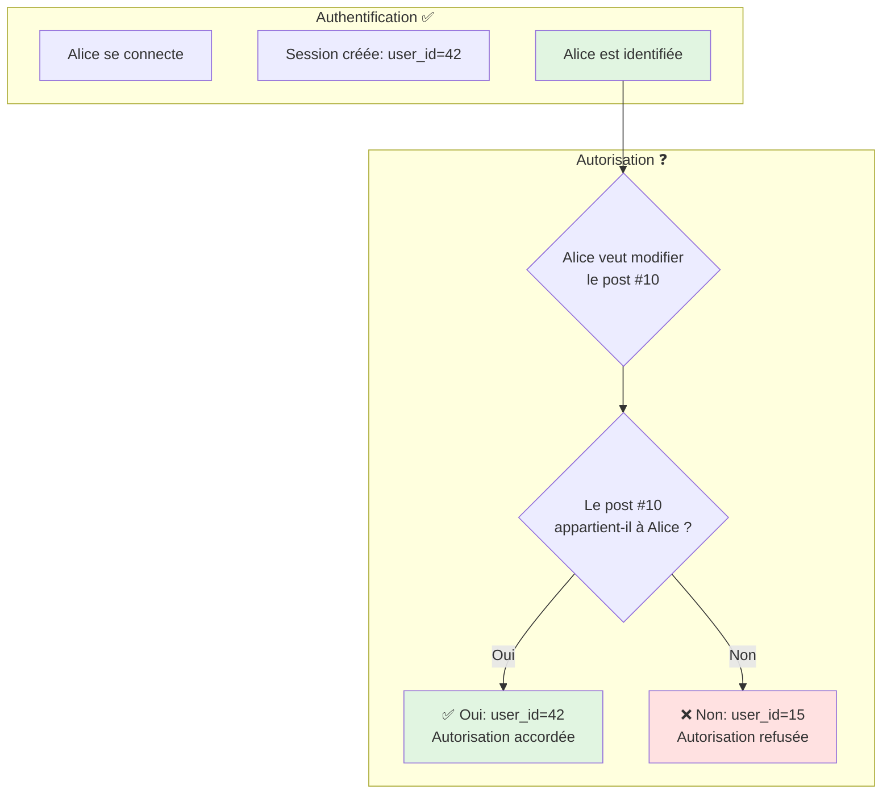
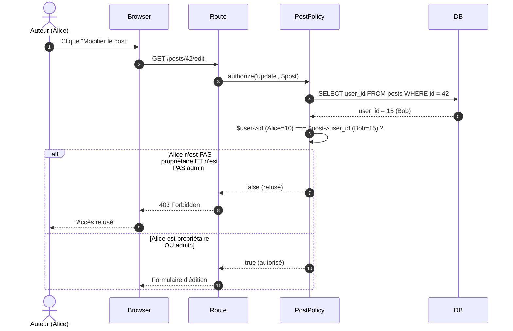
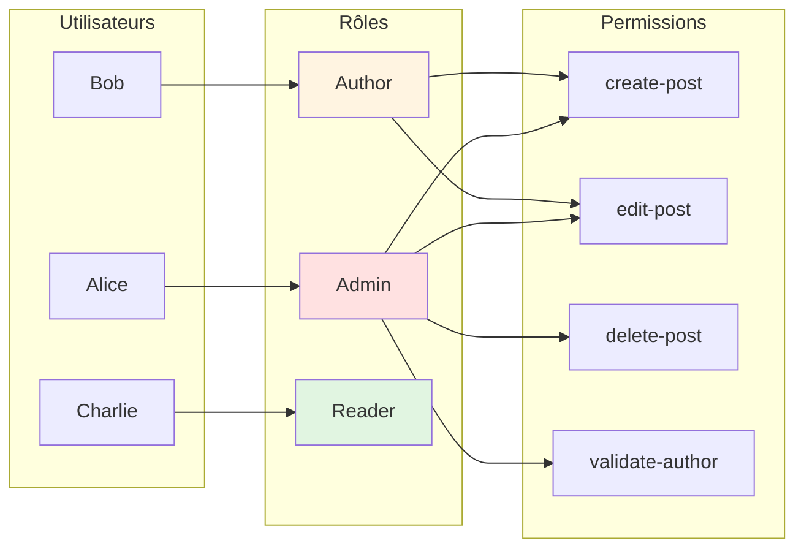

# V - Autorisation & Policies

<div
  class="omny-meta"
  data-level="🟡 Intermédiaire"
  data-version="1.0"
  data-time="10-12 heures">
</div>

## Introduction au module

!!! quote "Analogie pédagogique"
    _Imaginez une **grande entreprise** avec plusieurs départements. L'**authentification** (Module 4) est comme le badge d'entrée du bâtiment : il prouve que vous êtes employé. Mais une fois à l'intérieur, tout le monde n'a pas accès à tout. Le directeur financier peut consulter les comptes, mais pas accéder au serveur IT. Un développeur peut déployer du code, mais pas valider les factures. Un stagiaire peut lire les documents, mais pas les modifier. L'**autorisation**, c'est ce système de **permissions granulaires** : qui peut faire quoi, sur quelles ressources, dans quels contextes._

Au **Module 4**, vous avez implémenté l'authentification : savoir **qui** est l'utilisateur. Maintenant, nous allons implémenter l'**autorisation** : déterminer **ce qu'il peut faire**.

**Distinction cruciale :**

- **Authentification** : "Es-tu Alice ?" → Login/Logout
- **Autorisation** : "Alice peut-elle supprimer ce post ?" → Permissions

**Objectifs pédagogiques du module :**

- [x] Comprendre la différence entre authentification et autorisation
- [x] Implémenter les Gates (autorisations globales)
- [x] Créer des Policies (autorisations par modèle)
- [x] Gérer l'ownership (un auteur ne modifie que SES posts)
- [x] Implémenter un système de rôles simple (admin/author/reader)
- [x] Protéger les routes et actions avec les middlewares d'autorisation
- [x] Comprendre RBAC (Role-Based Access Control)
- [x] Gérer les autorisations dans les vues Blade
- [x] Anticiper l'introduction des packages (Spatie Permission au Module 8)

---

## 1. Fondamentaux : authentification vs autorisation

### 1.1 Matrice des concepts

| Concept | Question posée | Réponse | Mécanisme Laravel |
|---------|----------------|---------|-------------------|
| **Authentification** | Qui es-tu ? | "Je suis Alice (user_id=42)" | Sessions, cookies, tokens |
| **Autorisation** | Que peux-tu faire ? | "Tu peux éditer tes posts, mais pas ceux des autres" | Gates, Policies |

### 1.2 Scénarios du monde réel



_L'authentification identifie l'utilisateur, l'autorisation détermine ses droits._

### 1.3 Exemples concrets dans notre blog

| Action | Authentification requise ? | Autorisation requise ? | Règle d'autorisation |
|--------|---------------------------|------------------------|----------------------|
| Lire un post publié | ❌ Non | ❌ Non | Public |
| Créer un post | ✅ Oui | ✅ Oui | Être auteur approuvé |
| Modifier un post | ✅ Oui | ✅ Oui | Être propriétaire OU admin |
| Supprimer un post | ✅ Oui | ✅ Oui | Être admin uniquement |
| Valider un auteur | ✅ Oui | ✅ Oui | Être admin |
| Bannir un utilisateur | ✅ Oui | ✅ Oui | Être admin |

---

## 2. Gates : autorisations globales simples

### 2.1 Concept des Gates

Un **Gate** est une **fonction booléenne** qui détermine si un utilisateur peut effectuer une action.

**Caractéristiques :**

- Définies globalement (dans un Service Provider)
- Utilisées pour des permissions simples, non liées à un modèle spécifique
- Retournent `true` (autorisé) ou `false` (refusé)

**Cas d'usage typiques :**

- "L'utilisateur est-il admin ?"
- "L'utilisateur peut-il accéder au backoffice ?"
- "L'utilisateur peut-il publier du contenu ?"

### 2.2 Définir des Gates

**Fichier : `app/Providers/AppServiceProvider.php`**

```php
<?php

namespace App\Providers;

use Illuminate\Support\ServiceProvider;
use Illuminate\Support\Facades\Gate;
use App\Models\User;

class AppServiceProvider extends ServiceProvider
{
    public function boot(): void
    {
        /**
         * Gate : vérifier si l'utilisateur est administrateur.
         * 
         * Usage : Gate::allows('admin') ou Gate::denies('admin')
         * 
         * @param  \App\Models\User  $user
         * @return bool
         */
        Gate::define('admin', function (User $user) {
            return $user->is_admin === true;
        });

        /**
         * Gate : vérifier si l'utilisateur est auteur approuvé.
         * 
         * Un auteur approuvé peut créer et gérer ses posts.
         */
        Gate::define('author', function (User $user) {
            return $user->is_author_approved === true;
        });

        /**
         * Gate : vérifier si l'utilisateur peut accéder au dashboard admin.
         * 
         * Alias de 'admin' pour plus de clarté sémantique.
         */
        Gate::define('access-admin-dashboard', function (User $user) {
            return $user->is_admin === true;
        });

        /**
         * Gate : vérifier si l'utilisateur peut soumettre un post.
         * 
         * Règle : être auteur approuvé ET ne pas être banni.
         */
        Gate::define('submit-post', function (User $user) {
            return $user->is_author_approved === true 
                && $user->is_banned !== true;
        });
    }
}
```

**Explication des paramètres :**

1. Premier paramètre `$user` : **Toujours** l'utilisateur actuellement connecté (injecté automatiquement par Laravel)
2. Paramètres suivants : Arguments optionnels passés lors de l'appel du Gate

### 2.3 Utiliser les Gates dans les controllers

**Fichier : `app/Http/Controllers/Admin/DashboardController.php`**

```php
<?php

namespace App\Http\Controllers\Admin;

use App\Http\Controllers\Controller;
use Illuminate\Support\Facades\Gate;

class DashboardController extends Controller
{
    public function index()
    {
        // Vérifier si l'utilisateur peut accéder au dashboard admin
        // Si non autorisé, Lance une exception AuthorizationException (403)
        Gate::authorize('access-admin-dashboard');
        
        // Alternative : vérification manuelle
        if (Gate::denies('access-admin-dashboard')) {
            abort(403, 'Accès refusé : réservé aux administrateurs.');
        }
        
        // Alternative 2 : avec redirection custom
        if (!Gate::allows('admin')) {
            return redirect()
                ->route('home')
                ->with('error', 'Accès refusé.');
        }
        
        return view('admin.dashboard');
    }
}
```

**Différentes méthodes de vérification :**

```php
// 1. authorize() : Lance une exception 403 si refusé
Gate::authorize('admin');

// 2. allows() : Retourne true/false
if (Gate::allows('admin')) {
    // Autorisé
}

// 3. denies() : Inverse de allows()
if (Gate::denies('admin')) {
    // Refusé
}

// 4. check() : Alias de allows()
if (Gate::check('admin')) {
    // Autorisé
}

// 5. any() : Vérifier si AU MOINS un gate autorise
if (Gate::any(['admin', 'author'])) {
    // Autorisé si admin OU auteur
}

// 6. none() : Vérifier si AUCUN gate n'autorise
if (Gate::none(['admin', 'author'])) {
    // Refusé si ni admin ni auteur
}
```

### 2.4 Utiliser les Gates dans les vues Blade

**Directive `@can` / `@cannot` :**

```html
{{-- resources/views/dashboard.blade.php --}}

<h1>Dashboard</h1>

{{-- Afficher le lien admin uniquement si autorisé --}}
@can('admin')
    <a href="{{ route('admin.dashboard') }}">
        Administration
    </a>
@endcan

{{-- Afficher le bouton "Créer un post" si auteur --}}
@can('author')
    <a href="{{ route('posts.create') }}">
        Nouveau post
    </a>
@endcan

{{-- Afficher un message si non autorisé --}}
@cannot('author')
    <p>Votre compte auteur est en attente de validation.</p>
@endcannot

{{-- Condition complexe : admin OU auteur --}}
@canany(['admin', 'author'])
    <p>Vous avez accès aux fonctionnalités avancées.</p>
@endcanany
```

### 2.5 Middleware basé sur les Gates

**Créer un middleware custom :**

```bash
php artisan make:middleware EnsureUserIsAdmin
```

**Fichier : `app/Http/Middleware/EnsureUserIsAdmin.php`**

```php
<?php

namespace App\Http\Middleware;

use Closure;
use Illuminate\Http\Request;
use Illuminate\Support\Facades\Gate;
use Symfony\Component\HttpFoundation\Response;

class EnsureUserIsAdmin
{
    public function handle(Request $request, Closure $next): Response
    {
        // Vérifier le gate 'admin'
        if (Gate::denies('admin')) {
            abort(403, 'Accès réservé aux administrateurs.');
        }

        return $next($request);
    }
}
```

**Enregistrer dans `bootstrap/app.php` :**

```php
$middleware->alias([
    'auth' => \App\Http\Middleware\Authenticate::class,
    'guest' => \App\Http\Middleware\RedirectIfAuthenticated::class,
    'admin' => \App\Http\Middleware\EnsureUserIsAdmin::class,
]);
```

**Utiliser sur les routes :**

```php
// routes/web.php

// Routes admin protégées
Route::middleware(['auth', 'admin'])->prefix('admin')->group(function () {
    Route::get('/dashboard', [AdminDashboardController::class, 'index'])
        ->name('admin.dashboard');
});
```

---

## 3. Policies : autorisations par modèle

### 3.1 Concept des Policies

Une **Policy** est une classe dédiée qui regroupe toutes les règles d'autorisation pour un **modèle spécifique**.

**Différence avec les Gates :**

| Aspect | Gates | Policies |
|--------|-------|----------|
| **Scope** | Global, actions générales | Par modèle (Post, User, Comment) |
| **Organisation** | Définies dans Service Provider | Classes dédiées |
| **Paramètres** | User + optionnels | User + instance du modèle |
| **Cas d'usage** | "Peut-il accéder à l'admin ?" | "Peut-il modifier CE post ?" |

**Quand utiliser une Policy ?**

- Actions liées à une ressource spécifique (Post, Comment, Category)
- Règles d'ownership ("peut modifier son propre post")
- Logique complexe nécessitant plusieurs méthodes

### 3.2 Créer une Policy pour Post

**Commande :**

```bash
# Créer une policy liée au modèle Post
php artisan make:policy PostPolicy --model=Post
```

**Fichier généré : `app/Policies/PostPolicy.php`**

```php
<?php

namespace App\Policies;

use App\Models\Post;
use App\Models\User;

/**
 * Policy définissant les autorisations pour le modèle Post.
 * 
 * Laravel associe automatiquement cette policy au modèle Post
 * via la convention de nommage : PostPolicy → Post
 */
class PostPolicy
{
    /**
     * Determine if the user can view any posts.
     * 
     * Action : afficher la liste des posts (index).
     * Règle : tout le monde peut voir la liste (public).
     * 
     * @param  \App\Models\User  $user
     * @return bool
     */
    public function viewAny(?User $user): bool
    {
        // Liste publique : pas besoin d'être connecté
        // Le ? devant User indique que $user peut être null
        return true;
    }

    /**
     * Determine if the user can view the post.
     * 
     * Action : afficher un post spécifique (show).
     * Règle : tout le monde peut voir un post publié.
     * 
     * @param  \App\Models\User|null  $user
     * @param  \App\Models\Post  $post
     * @return bool
     */
    public function view(?User $user, Post $post): bool
    {
        // Si le post est publié, accessible publiquement
        if ($post->published_at !== null) {
            return true;
        }
        
        // Si brouillon : accessible uniquement par l'auteur ou un admin
        if ($user) {
            return $user->id === $post->user_id || $user->is_admin;
        }
        
        return false;
    }

    /**
     * Determine if the user can create posts.
     * 
     * Action : créer un nouveau post.
     * Règle : être auteur approuvé et non banni.
     * 
     * @param  \App\Models\User  $user
     * @return bool
     */
    public function create(User $user): bool
    {
        return $user->is_author_approved === true 
            && $user->is_banned !== true;
    }

    /**
     * Determine if the user can update the post.
     * 
     * Action : modifier un post existant.
     * Règle : être le propriétaire du post OU être admin.
     * 
     * @param  \App\Models\User  $user
     * @param  \App\Models\Post  $post
     * @return bool
     */
    public function update(User $user, Post $post): bool
    {
        // L'auteur peut toujours modifier son propre post
        if ($user->id === $post->user_id) {
            return true;
        }
        
        // Un admin peut modifier n'importe quel post
        if ($user->is_admin) {
            return true;
        }
        
        return false;
    }

    /**
     * Determine if the user can delete the post.
     * 
     * Action : supprimer un post.
     * Règle : UNIQUEMENT les administrateurs.
     * 
     * Selon les spécifications du projet (Module 4), 
     * les auteurs ne peuvent PAS supprimer leurs posts.
     * 
     * @param  \App\Models\User  $user
     * @param  \App\Models\Post  $post
     * @return bool
     */
    public function delete(User $user, Post $post): bool
    {
        // Suppression réservée aux admins
        return $user->is_admin === true;
    }

    /**
     * Determine if the user can restore the post.
     * 
     * (Si soft deletes activés)
     */
    public function restore(User $user, Post $post): bool
    {
        return $user->is_admin === true;
    }

    /**
     * Determine if the user can permanently delete the post.
     * 
     * (Force delete pour soft deletes)
     */
    public function forceDelete(User $user, Post $post): bool
    {
        return $user->is_admin === true;
    }
}
```

**Conventions de nommage des méthodes :**

| Méthode | Action | Paramètres |
|---------|--------|------------|
| `viewAny()` | Liste (index) | `User` (optionnel) |
| `view()` | Afficher un item | `User` + `Post` |
| `create()` | Créer | `User` |
| `update()` | Modifier | `User` + `Post` |
| `delete()` | Supprimer | `User` + `Post` |
| `restore()` | Restaurer (soft delete) | `User` + `Post` |
| `forceDelete()` | Suppression définitive | `User` + `Post` |

### 3.3 Enregistrer la Policy

**Laravel 11+** : Découverte automatique par convention de nommage.

Si la découverte automatique ne fonctionne pas, enregistrez manuellement dans `app/Providers/AppServiceProvider.php` :

```php
use App\Models\Post;
use App\Policies\PostPolicy;
use Illuminate\Support\Facades\Gate;

public function boot(): void
{
    // Enregistrement manuel de la policy
    Gate::policy(Post::class, PostPolicy::class);
}
```

### 3.4 Utiliser les Policies dans les controllers

**Méthode 1 : `authorize()` (recommandée)**

```php
<?php

namespace App\Http\Controllers;

use App\Models\Post;
use Illuminate\Http\Request;

class PostController extends Controller
{
    public function edit(Post $post)
    {
        // Vérifier l'autorisation 'update' sur ce post
        // Si refusé : lance AuthorizationException (403)
        $this->authorize('update', $post);
        
        return view('posts.edit', compact('post'));
    }

    public function update(Request $request, Post $post)
    {
        $this->authorize('update', $post);
        
        $validated = $request->validate([
            'title' => 'required|string|max:255',
            'body' => 'required|string',
        ]);
        
        $post->update($validated);
        
        return redirect()
            ->route('posts.show', $post)
            ->with('success', 'Post mis à jour !');
    }

    public function destroy(Post $post)
    {
        $this->authorize('delete', $post);
        
        $post->delete();
        
        return redirect()
            ->route('posts.index')
            ->with('success', 'Post supprimé.');
    }
}
```

**Méthode 2 : Middleware `can` sur les routes**

```php
// routes/web.php

// Protéger une route spécifique
Route::get('/posts/{post}/edit', [PostController::class, 'edit'])
    ->middleware('can:update,post');

// Protéger un groupe de routes
Route::middleware('can:create,App\Models\Post')->group(function () {
    Route::get('/posts/create', [PostController::class, 'create']);
    Route::post('/posts', [PostController::class, 'store']);
});
```

**Méthode 3 : Vérification manuelle avec `Gate`**

```php
use Illuminate\Support\Facades\Gate;

public function edit(Post $post)
{
    if (Gate::denies('update', $post)) {
        abort(403, 'Vous ne pouvez pas modifier ce post.');
    }
    
    return view('posts.edit', compact('post'));
}

// Ou avec redirection
public function edit(Post $post)
{
    if (!Gate::allows('update', $post)) {
        return redirect()
            ->route('posts.index')
            ->with('error', 'Accès refusé.');
    }
    
    return view('posts.edit', compact('post'));
}
```

### 3.5 Utiliser les Policies dans les vues Blade

```html
{{-- resources/views/posts/show.blade.php --}}

<h1>{{ $post->title }}</h1>

<div>{{ $post->body }}</div>

{{-- Afficher le bouton "Modifier" uniquement si autorisé --}}
@can('update', $post)
    <a href="{{ route('posts.edit', $post) }}">
        Modifier
    </a>
@endcan

{{-- Afficher le bouton "Supprimer" uniquement si admin --}}
@can('delete', $post)
    <form method="POST" action="{{ route('posts.destroy', $post) }}">
        @csrf
        @method('DELETE')
        <button type="submit">Supprimer</button>
    </form>
@endcan

{{-- Affichage conditionnel : message si non autorisé --}}
@cannot('update', $post)
    <p>Seul l'auteur ou un admin peut modifier ce post.</p>
@endcannot
```

---

## 4. Ownership : un auteur ne modifie que SES posts

### 4.1 Diagramme de flux : vérification d'ownership



### 4.2 Implémentation dans la Policy

**La logique d'ownership est déjà dans la méthode `update()` :**

```php
public function update(User $user, Post $post): bool
{
    // Vérification d'ownership
    if ($user->id === $post->user_id) {
        return true; // ✅ Propriétaire
    }
    
    // Bypass pour les admins
    if ($user->is_admin) {
        return true; // ✅ Admin
    }
    
    return false; // ❌ Ni propriétaire ni admin
}
```

**Factorisation pour réutilisation :**

```php
class PostPolicy
{
    /**
     * Vérifier si l'utilisateur est propriétaire du post.
     * 
     * Méthode helper privée pour éviter la duplication.
     */
    private function isOwner(User $user, Post $post): bool
    {
        return $user->id === $post->user_id;
    }

    /**
     * Vérifier si l'utilisateur est propriétaire OU admin.
     */
    private function isOwnerOrAdmin(User $user, Post $post): bool
    {
        return $this->isOwner($user, $post) || $user->is_admin;
    }

    public function update(User $user, Post $post): bool
    {
        return $this->isOwnerOrAdmin($user, $post);
    }

    public function delete(User $user, Post $post): bool
    {
        // Uniquement admin (selon spécifications projet)
        return $user->is_admin;
    }
}
```

### 4.3 Tests manuels (via Tinker)

```bash
php artisan tinker
```

```php
// Créer deux utilisateurs
$alice = User::create([
    'name' => 'Alice',
    'email' => 'alice@example.com',
    'password' => Hash::make('password'),
    'is_author_approved' => true,
]);

$bob = User::create([
    'name' => 'Bob',
    'email' => 'bob@example.com',
    'password' => Hash::make('password'),
    'is_author_approved' => true,
]);

// Créer un post pour Alice
$post = Post::create([
    'user_id' => $alice->id,
    'title' => 'Post d\'Alice',
    'slug' => 'post-alice',
    'body' => 'Contenu...',
]);

// Tester l'ownership
Gate::forUser($alice)->allows('update', $post); // true ✅
Gate::forUser($bob)->allows('update', $post);   // false ❌

// Promouvoir Bob en admin
$bob->update(['is_admin' => true]);
Gate::forUser($bob)->allows('update', $post);   // true ✅ (admin bypass)
```

---

## 5. Système de rôles simple (RBAC)

### 5.1 Qu'est-ce que RBAC ?

**RBAC** = **Role-Based Access Control** (Contrôle d'accès basé sur les rôles)

**Principe :**

1. Définir des **rôles** (admin, author, reader)
2. Associer des **permissions** à chaque rôle
3. Assigner un ou plusieurs **rôles** aux utilisateurs



### 5.2 Migration : ajouter une colonne role

**Approche simple (1 rôle par utilisateur) :**

```bash
php artisan make:migration add_role_to_users_table --table=users
```

```php
public function up(): void
{
    Schema::table('users', function (Blueprint $table) {
        // Colonne role : 'admin', 'author', 'reader'
        $table->string('role')->default('reader');
    });
}
```

**Migrer :**

```bash
php artisan migrate
```

**Modifier le modèle User :**

```php
class User extends Authenticatable
{
    protected $fillable = [
        'name',
        'email',
        'password',
        'role',
    ];

    /**
     * Vérifier si l'utilisateur a un rôle spécifique.
     */
    public function hasRole(string $role): bool
    {
        return $this->role === $role;
    }

    /**
     * Vérifier si l'utilisateur a AU MOINS UN des rôles fournis.
     */
    public function hasAnyRole(array $roles): bool
    {
        return in_array($this->role, $roles);
    }

    /**
     * Accesseurs pour rôles communs (sugar syntax).
     */
    public function isAdmin(): bool
    {
        return $this->role === 'admin';
    }

    public function isAuthor(): bool
    {
        return $this->role === 'author';
    }

    public function isReader(): bool
    {
        return $this->role === 'reader';
    }
}
```

### 5.3 Mettre à jour les Gates

```php
// app/Providers/AppServiceProvider.php

public function boot(): void
{
    // Gate admin basé sur le rôle
    Gate::define('admin', function (User $user) {
        return $user->isAdmin();
    });

    // Gate author
    Gate::define('author', function (User $user) {
        return $user->hasAnyRole(['admin', 'author']);
    });

    // Gate reader (tout le monde)
    Gate::define('reader', function (User $user) {
        return true;
    });
}
```

### 5.4 Mettre à jour les Policies

```php
// app/Policies/PostPolicy.php

public function create(User $user): bool
{
    // Peut créer si role = admin OU author
    return $user->hasAnyRole(['admin', 'author']);
}

public function update(User $user, Post $post): bool
{
    // Admin peut tout modifier
    if ($user->isAdmin()) {
        return true;
    }
    
    // Author peut modifier ses propres posts
    if ($user->isAuthor() && $user->id === $post->user_id) {
        return true;
    }
    
    return false;
}

public function delete(User $user, Post $post): bool
{
    // Uniquement admin
    return $user->isAdmin();
}
```

### 5.5 Seeders : créer des utilisateurs de test

```php
// database/seeders/UserSeeder.php

<?php

namespace Database\Seeders;

use App\Models\User;
use Illuminate\Database\Seeder;
use Illuminate\Support\Facades\Hash;

class UserSeeder extends Seeder
{
    public function run(): void
    {
        // Admin
        User::create([
            'name' => 'Admin',
            'email' => 'admin@example.com',
            'password' => Hash::make('password'),
            'role' => 'admin',
        ]);

        // Author
        User::create([
            'name' => 'Alice Author',
            'email' => 'alice@example.com',
            'password' => Hash::make('password'),
            'role' => 'author',
        ]);

        // Reader
        User::create([
            'name' => 'Bob Reader',
            'email' => 'bob@example.com',
            'password' => Hash::make('password'),
            'role' => 'reader',
        ]);
    }
}
```

**Exécuter :**

```bash
php artisan db:seed --class=UserSeeder
```

---

## 6. Middleware d'autorisation sur les routes

### 6.1 Middleware basé sur les rôles

**Créer un middleware :**

```bash
php artisan make:middleware EnsureUserHasRole
```

```php
<?php

namespace App\Http\Middleware;

use Closure;
use Illuminate\Http\Request;
use Symfony\Component\HttpFoundation\Response;

class EnsureUserHasRole
{
    /**
     * Handle an incoming request.
     * 
     * @param  string|array  $roles  Rôle(s) autorisé(s)
     */
    public function handle(Request $request, Closure $next, ...$roles): Response
    {
        $user = user(); // Helper créé au Module 4
        
        if (!$user) {
            abort(403, 'Non authentifié.');
        }
        
        // Vérifier si l'utilisateur a AU MOINS UN des rôles
        if (!$user->hasAnyRole($roles)) {
            abort(403, 'Accès refusé : rôle insuffisant.');
        }

        return $next($request);
    }
}
```

**Enregistrer dans `bootstrap/app.php` :**

```php
$middleware->alias([
    'auth' => \App\Http\Middleware\Authenticate::class,
    'role' => \App\Http\Middleware\EnsureUserHasRole::class,
]);
```

**Utiliser sur les routes :**

```php
// routes/web.php

// Routes admin : role = admin
Route::middleware(['auth', 'role:admin'])->prefix('admin')->group(function () {
    Route::get('/dashboard', [AdminController::class, 'dashboard']);
});

// Routes author : role = admin OU author
Route::middleware(['auth', 'role:admin,author'])->group(function () {
    Route::get('/posts/create', [PostController::class, 'create']);
    Route::post('/posts', [PostController::class, 'store']);
});
```

### 6.2 Middleware basé sur les Gates

Laravel fournit déjà un middleware `can` :

```php
// Protéger avec un gate
Route::middleware('can:admin')->group(function () {
    Route::get('/admin/dashboard', [AdminController::class, 'dashboard']);
});

// Protéger avec une policy
Route::middleware('can:update,post')->group(function () {
    Route::get('/posts/{post}/edit', [PostController::class, 'edit']);
});
```

---

## 7. Autorisations dans les vues : pattern avancés

### 7.1 Afficher des éléments selon le rôle

```html
{{-- resources/views/layouts/app.blade.php --}}

<nav>
    <a href="{{ route('home') }}">Accueil</a>
    
    {{-- Afficher uniquement pour les auteurs --}}
    @can('author')
        <a href="{{ route('posts.create') }}">Nouveau post</a>
    @endcan
    
    {{-- Afficher uniquement pour les admins --}}
    @can('admin')
        <a href="{{ route('admin.dashboard') }}">Administration</a>
    @endcan
    
    {{-- Afficher selon le rôle (via helper custom) --}}
    @if (user() && user()->isAdmin())
        <a href="{{ route('admin.users') }}">Gérer les utilisateurs</a>
    @endif
</nav>
```

### 7.2 Liste conditionnelle avec ownership

```html
{{-- resources/views/posts/index.blade.php --}}

<h1>Mes posts</h1>

<table>
    <thead>
        <tr>
            <th>Titre</th>
            <th>Statut</th>
            <th>Actions</th>
        </tr>
    </thead>
    <tbody>
        @foreach ($posts as $post)
            <tr>
                <td>{{ $post->title }}</td>
                <td>{{ $post->status }}</td>
                <td>
                    {{-- Afficher "Modifier" uniquement si autorisé --}}
                    @can('update', $post)
                        <a href="{{ route('posts.edit', $post) }}">Modifier</a>
                    @endcan
                    
                    {{-- Afficher "Supprimer" uniquement si admin --}}
                    @can('delete', $post)
                        <form method="POST" action="{{ route('posts.destroy', $post) }}" style="display:inline;">
                            @csrf
                            @method('DELETE')
                            <button type="submit">Supprimer</button>
                        </form>
                    @endcan
                    
                    {{-- Message si aucune action possible --}}
                    @cannot('update', $post)
                        @cannot('delete', $post)
                            <span>Lecture seule</span>
                        @endcannot
                    @endcannot
                </td>
            </tr>
        @endforeach
    </tbody>
</table>
```

---

## 8. Gestion avancée : before() et Super Admin

### 8.1 Méthode before() dans les Policies

La méthode `before()` est exécutée **avant toute autre méthode** de la policy.

**Cas d'usage : Super Admin bypass**

```php
// app/Policies/PostPolicy.php

class PostPolicy
{
    /**
     * Méthode exécutée AVANT toute vérification d'autorisation.
     * 
     * Si elle retourne true : autorisation accordée (bypass)
     * Si elle retourne false : autorisation refusée (bypass)
     * Si elle retourne null : continuer vers les méthodes normales
     */
    public function before(User $user, string $ability): ?bool
    {
        // Super admin bypass : autorise TOUT
        if ($user->is_super_admin === true) {
            return true;
        }
        
        // Sinon, continuer normalement
        return null;
    }

    // ... méthodes normales (update, delete, etc.)
}
```

**Migration pour ajouter is_super_admin :**

```php
Schema::table('users', function (Blueprint $table) {
    $table->boolean('is_super_admin')->default(false);
});
```

### 8.2 Autorisation conditionnelle selon le statut

```php
// app/Policies/PostPolicy.php

public function update(User $user, Post $post): bool
{
    // Ne peut pas modifier si le post est publié (sauf admin)
    if ($post->status === 'published' && !$user->isAdmin()) {
        return false;
    }
    
    // Ownership normale
    return $user->id === $post->user_id || $user->isAdmin();
}
```

---

## 9. Exercice pratique : système de commentaires avec modération

### 9.1 Objectif

Implémenter les règles d'autorisation pour les commentaires :

1. Tout utilisateur connecté peut commenter
2. Un utilisateur peut modifier/supprimer ses propres commentaires
3. Un admin peut supprimer n'importe quel commentaire
4. L'auteur du post peut supprimer les commentaires sur son post

### 9.2 Instructions

**Étape 1 : Créer la Policy**

```bash
php artisan make:policy CommentPolicy --model=Comment
```

<details>
<summary>Solution</summary>

```php
<?php

namespace App\Policies;

use App\Models\Comment;
use App\Models\User;

class CommentPolicy
{
    public function create(User $user): bool
    {
        // Tout utilisateur connecté peut commenter
        return true;
    }

    public function update(User $user, Comment $comment): bool
    {
        // Uniquement le propriétaire du commentaire
        return $user->id === $comment->user_id;
    }

    public function delete(User $user, Comment $comment): bool
    {
        // Admin peut tout supprimer
        if ($user->isAdmin()) {
            return true;
        }
        
        // Propriétaire du commentaire peut supprimer
        if ($user->id === $comment->user_id) {
            return true;
        }
        
        // Auteur du post peut supprimer les commentaires sur son post
        if ($user->id === $comment->post->user_id) {
            return true;
        }
        
        return false;
    }
}
```

</details>

**Étape 2 : Utiliser dans le controller**

```php
public function destroy(Comment $comment)
{
    $this->authorize('delete', $comment);
    
    $comment->delete();
    
    return back()->with('success', 'Commentaire supprimé.');
}
```

**Étape 3 : Affichage conditionnel dans la vue**

```html
@foreach ($post->comments as $comment)
    <div>
        <strong>{{ $comment->user->name }}</strong>
        <p>{{ $comment->body }}</p>
        
        @can('update', $comment)
            <a href="{{ route('comments.edit', $comment) }}">Modifier</a>
        @endcan
        
        @can('delete', $comment)
            <form method="POST" action="{{ route('comments.destroy', $comment) }}">
                @csrf
                @method('DELETE')
                <button type="submit">Supprimer</button>
            </form>
        @endcan
    </div>
@endforeach
```

---

## 10. Checkpoint de progression

### 10.1 Compétences acquises

- [x] Comprendre la différence entre authentification et autorisation
- [x] Définir et utiliser des Gates pour les autorisations globales
- [x] Créer des Policies pour les autorisations par modèle
- [x] Implémenter l'ownership (un auteur gère ses posts)
- [x] Mettre en place un système de rôles simple (RBAC)
- [x] Protéger les routes avec des middlewares d'autorisation
- [x] Afficher des éléments conditionnels dans les vues Blade
- [x] Comprendre la méthode before() pour les super admins
- [x] Anticiper les packages avancés (Spatie Permission)

### 10.2 Quiz d'auto-évaluation

1. **Question :** Quelle est la différence entre un Gate et une Policy ?
   <details>
   <summary>Réponse</summary>
   Un **Gate** est une autorisation globale simple (ex: "est admin ?"). Une **Policy** est une classe dédiée regroupant les autorisations pour un modèle spécifique (ex: "peut modifier CE post ?").
   </details>

2. **Question :** Que fait `$this->authorize('update', $post)` ?
   <details>
   <summary>Réponse</summary>
   Appelle la méthode `update()` de `PostPolicy` avec l'utilisateur connecté et le post fourni. Si elle retourne `false`, lance une exception `AuthorizationException` (403).
   </details>

3. **Question :** Comment vérifier l'ownership dans une Policy ?
   <details>
   <summary>Réponse</summary>
   Comparer `$user->id === $model->user_id` pour vérifier que l'utilisateur connecté est le propriétaire de la ressource.
   </details>

4. **Question :** À quoi sert la méthode `before()` dans une Policy ?
   <details>
   <summary>Réponse</summary>
   Elle est exécutée AVANT toute autre méthode. Si elle retourne `true`, autorise tout (bypass). Si `null`, continue normalement. Utilisée pour les super admins.
   </details>

5. **Question :** Comment afficher un bouton uniquement si l'utilisateur peut supprimer un post ?
   <details>
   <summary>Réponse</summary>
   ```html
   @can('delete', $post)
       <button>Supprimer</button>
   @endcan
   ```
   </details>

---

## 11. Le mot de la fin du module

!!! quote "Récapitulatif"
    L'autorisation est la **couche de sécurité** qui détermine ce que chaque utilisateur peut faire dans votre application. Sans elle, une fois authentifié, un utilisateur pourrait **tout** faire : modifier les posts des autres, se promouvoir admin, supprimer des données critiques.
    
    **Ce que vous maîtrisez maintenant :**
    
    - **Gates** : Autorisations globales simples (rôles, accès généraux)
    - **Policies** : Autorisations granulaires par modèle (ownership, actions spécifiques)
    - **Ownership** : Un utilisateur ne gère que SES ressources
    - **RBAC** : Système de rôles simple (admin/author/reader)
    - **Protection multi-couches** : Routes, controllers, vues
    
    **Ce système est solide mais basique.** Pour des applications d'entreprise avec des permissions complexes (rôles multiples, permissions granulaires, hiérarchies), vous utiliserez des packages comme **Spatie Laravel Permission** (que nous introduirons au Module 8).
    
    **Prochaine étape :** Le **Module 6 - Workflow Éditorial** va mettre en pratique toute l'autorisation dans un contexte réel : un système de validation de posts avec machine à états (draft → submitted → published → rejected), notifications admin, et gestion d'images.

**Prochaine étape :**  
[:lucide-arrow-right: Module 6 - Workflow Éditorial](../module-06-workflow-editorial/)

---

## Navigation du module

**Module précédent :**  
[:lucide-arrow-left: Module 4 - Authentification Custom](../module-04-auth-custom/)

**Module suivant :**  
[:lucide-arrow-right: Module 6 - Workflow Éditorial](../module-06-workflow-editorial/)

**Retour à l'index :**  
[:lucide-home: Index du guide](../index/)