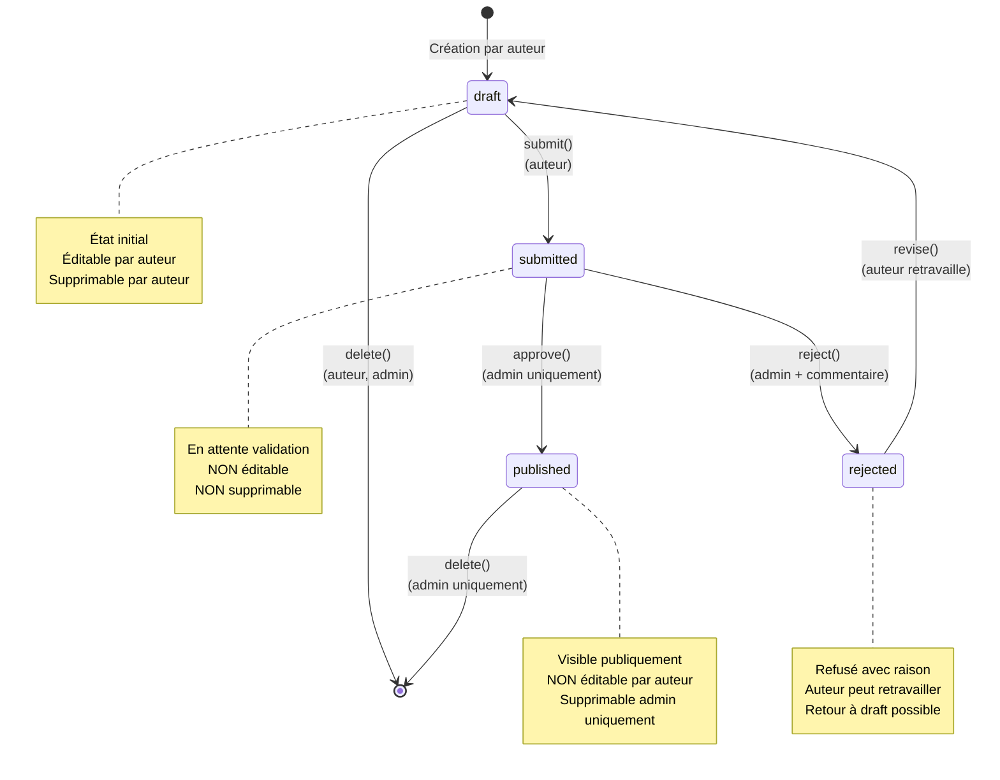
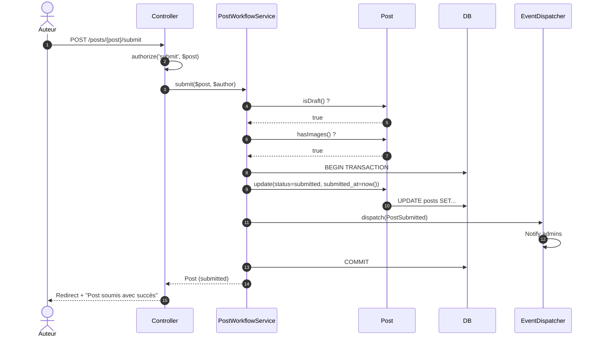

# VI - Workflow Éditorial

<div
  class="omny-meta"
  data-level="🔴 Avancé"
  data-version="1.0"
  data-time="15-18 heures">
</div>

## Introduction au module

!!! quote "Analogie pédagogique"
    _Imaginez le processus de publication d'un livre dans une maison d'édition. L'auteur écrit son manuscrit (**draft**), puis le soumet à l'éditeur (**submitted**). L'éditeur lit, évalue la qualité, et prend une décision : soit il accepte et le livre est publié (**published**), soit il refuse avec un retour constructif (**rejected**). Si rejeté, l'auteur peut retravailler son manuscrit et le soumettre à nouveau. Une fois publié, le manuscrit ne peut plus être supprimé arbitrairement par l'auteur. Ce workflow éditorial, avec ses **états**, ses **transitions** et ses **règles métier**, est exactement ce que nous allons implémenter dans ce module._

Aux **Modules 1-5**, vous avez construit les fondations techniques. Maintenant, nous allons les assembler dans un **système réel et complexe** : un workflow éditorial complet qui respecte les règles métier définies dans le cahier des charges du projet (Module 1).

**Rappel des règles métier (cahier des charges) :**

1. Un auteur crée un post en **brouillon** (draft)
2. L'auteur **soumet** le post pour validation (submitted)
3. Un admin **valide** (published) ou **rejette** (rejected) avec commentaire
4. Un post soumis **ne peut plus être supprimé** par l'auteur
5. Une **alerte explicite** s'affiche avant la première soumission
6. Les images sont **obligatoires** pour chaque post

**Objectifs pédagogiques du module :**

- [x] Comprendre le concept de machine à états (FSM - Finite State Machine)
- [x] Implémenter les transitions d'états avec validation
- [x] Gérer les règles métier complexes dans les Policies
- [x] Créer un système de notifications (email, base de données)
- [x] Implémenter l'upload et la gestion d'images
- [x] Valider les fichiers (type, taille, dimensions)
- [x] Créer une interface admin de modération
- [x] Gérer les commentaires admin (notes de rejet)
- [x] Comprendre les événements et listeners Laravel

---

## 1. Réflexion préliminaire : modéliser le workflow

### 1.1 Questions de conception

Avant d'écrire du code, prenons 10 minutes pour réfléchir au système que nous allons construire.

!!! question "Exercice de conception (10 minutes)"
    En tant que développeur, vous devez transformer les règles métier en un système technique. Réfléchissez à ces questions :
    
    1. **États possibles** : Quels sont tous les états qu'un post peut avoir au cours de son cycle de vie ?
    2. **Transitions** : Quelles sont les transitions possibles entre états ? (ex: de draft vers quoi ?)
    3. **Contraintes** : Quelles transitions sont interdites ? (ex: peut-on passer de published à draft ?)
    4. **Acteurs** : Qui peut déclencher chaque transition ? (auteur, admin, système)
    5. **Effets de bord** : Que se passe-t-il lors d'une transition ? (notification, timestamp, log)

Prenez 10 minutes pour dessiner un diagramme d'états sur papier avant de continuer.

<details>
<summary>Diagramme de référence (à consulter après votre réflexion)</summary>



**États identifiés :**

| État | Description | Qui peut voir ? | Qui peut éditer ? | Qui peut supprimer ? |
|------|-------------|-----------------|-------------------|----------------------|
| **draft** | Brouillon en cours | Auteur, Admin | Auteur, Admin | Auteur, Admin |
| **submitted** | Soumis pour validation | Auteur, Admin | Personne | Personne |
| **published** | Publié et visible | Tout le monde | Admin | Admin |
| **rejected** | Refusé par admin | Auteur, Admin | Personne | Admin |

**Transitions identifiées :**

1. `draft → submitted` : Auteur soumet (`submit()`)
2. `submitted → published` : Admin approuve (`approve()`)
3. `submitted → rejected` : Admin rejette (`reject()`)
4. `rejected → draft` : Auteur retravaille (`revise()`)
5. `draft → suppression` : Auteur ou admin supprime
6. `published → suppression` : Admin uniquement supprime

</details>

### 1.2 Règles de validation des transitions

Maintenant que vous avez identifié les états et transitions, pensons aux **conditions** qui doivent être respectées pour chaque transition.

!!! question "Exercice : règles métier"
    Pour chaque transition, listez les conditions qui doivent être **vraies** pour que la transition soit autorisée.
    
    Exemple pour `draft → submitted` :
    - [ ] L'utilisateur est bien l'auteur du post OU un admin
    - [ ] Le post a un titre
    - [ ] Le post a un contenu (body)
    - [ ] Le post a au moins une image
    - [ ] L'auteur a vu l'alerte "première soumission"
    
    À vous : listez les conditions pour `submitted → published`

<details>
<summary>Conditions de transition complètes</summary>

**Transition : `draft → submitted`**
- L'utilisateur est l'auteur OU admin
- Le post a un titre (validé)
- Le post a un contenu minimum (validé)
- Le post a au moins une image
- L'auteur a confirmé comprendre qu'il ne pourra plus supprimer

**Transition : `submitted → published`**
- L'utilisateur est admin
- Le contenu est conforme (vérification manuelle admin)

**Transition : `submitted → rejected`**
- L'utilisateur est admin
- Un commentaire de rejet est obligatoire (admin_note)

**Transition : `rejected → draft`**
- L'utilisateur est l'auteur OU admin
- Permet de retravailler le post

</details>

---

## 2. Migration : structure de données

### 2.1 Modifications de la table posts

Nous devons ajouter plusieurs colonnes pour gérer le workflow :

```bash
php artisan make:migration add_workflow_columns_to_posts_table --table=posts
```

**Migration :**

```php
<?php

use Illuminate\Database\Migrations\Migration;
use Illuminate\Database\Schema\Blueprint;
use Illuminate\Support\Facades\Schema;

return new class extends Migration
{
    public function up(): void
    {
        Schema::table('posts', function (Blueprint $table) {
            /**
             * Colonne status : état actuel du post.
             * 
             * Valeurs possibles : draft, submitted, published, rejected
             * Valeur par défaut : draft
             */
            $table->string('status', 20)
                ->default('draft')
                ->index(); // Index pour recherches fréquentes par statut
            
            /**
             * Timestamp de soumission.
             * 
             * Enregistre quand le post est passé de draft à submitted.
             * Nullable car un brouillon n'a pas de date de soumission.
             */
            $table->timestamp('submitted_at')->nullable();
            
            /**
             * Colonne published_at déjà existante (Module 3).
             * 
             * Enregistre quand le post a été publié (approved).
             */
            // $table->timestamp('published_at')->nullable(); // Déjà créée
            
            /**
             * Timestamp de rejet.
             */
            $table->timestamp('rejected_at')->nullable();
            
            /**
             * Note de l'administrateur.
             * 
             * Commentaire explicatif lors du rejet ou de modifications.
             * Visible uniquement par l'auteur et les admins.
             */
            $table->text('admin_note')->nullable();
            
            /**
             * ID de l'admin qui a validé/rejeté.
             * 
             * Traçabilité : qui a pris la décision ?
             */
            $table->foreignId('reviewed_by')
                ->nullable()
                ->constrained('users')
                ->nullOnDelete();
        });
    }

    public function down(): void
    {
        Schema::table('posts', function (Blueprint $table) {
            $table->dropColumn([
                'status',
                'submitted_at',
                'rejected_at',
                'admin_note',
                'reviewed_by',
            ]);
        });
    }
};
```

**Exécuter :**

```bash
php artisan migrate
```

### 2.2 Table post_images (images obligatoires)

```bash
php artisan make:migration create_post_images_table
```

```php
<?php

use Illuminate\Database\Migrations\Migration;
use Illuminate\Database\Schema\Blueprint;
use Illuminate\Support\Facades\Schema;

return new class extends Migration
{
    public function up(): void
    {
        Schema::create('post_images', function (Blueprint $table) {
            $table->id();
            
            // Relation vers le post
            $table->foreignId('post_id')
                ->constrained()
                ->onDelete('cascade'); // Si post supprimé → images supprimées
            
            // Chemin du fichier image
            $table->string('path');
            
            // Image principale (featured)
            $table->boolean('is_main')->default(false);
            
            // Ordre d'affichage (pour galeries)
            $table->integer('order')->default(0);
            
            $table->timestamps();
            
            // Index pour recherches
            $table->index(['post_id', 'is_main']);
        });
    }

    public function down(): void
    {
        Schema::dropIfExists('post_images');
    }
};
```

**Exécuter :**

```bash
php artisan migrate
```

---

## 3. Modèles : enum et relations

### 3.3 Enum PostStatus (Laravel 11+)

**Créer un enum pour les statuts :**

```bash
mkdir -p app/Enums
```

**Fichier : `app/Enums/PostStatus.php`**

```php
<?php

namespace App\Enums;

/**
 * Enum définissant les états possibles d'un post.
 * 
 * Utiliser un enum plutôt que des strings en dur :
 * 1. Typage fort (autocomplétion IDE)
 * 2. Pas de fautes de frappe (draft vs darft)
 * 3. Documentation centralisée
 * 4. Refactoring facile
 */
enum PostStatus: string
{
    case DRAFT = 'draft';
    case SUBMITTED = 'submitted';
    case PUBLISHED = 'published';
    case REJECTED = 'rejected';

    /**
     * Label lisible pour l'affichage.
     */
    public function label(): string
    {
        return match($this) {
            self::DRAFT => 'Brouillon',
            self::SUBMITTED => 'En attente',
            self::PUBLISHED => 'Publié',
            self::REJECTED => 'Refusé',
        };
    }

    /**
     * Badge color pour l'UI.
     */
    public function color(): string
    {
        return match($this) {
            self::DRAFT => 'gray',
            self::SUBMITTED => 'yellow',
            self::PUBLISHED => 'green',
            self::REJECTED => 'red',
        };
    }

    /**
     * Vérifier si le post est éditable.
     */
    public function isEditable(): bool
    {
        return in_array($this, [self::DRAFT]);
    }

    /**
     * Vérifier si le post est en attente de validation.
     */
    public function isPending(): bool
    {
        return $this === self::SUBMITTED;
    }

    /**
     * Vérifier si le post est publié.
     */
    public function isPublished(): bool
    {
        return $this === self::PUBLISHED;
    }
}
```

### 3.2 Modèle Post mis à jour

**Fichier : `app/Models/Post.php`**

```php
<?php

namespace App\Models;

use App\Enums\PostStatus;
use Illuminate\Database\Eloquent\Model;
use Illuminate\Database\Eloquent\Relations\BelongsTo;
use Illuminate\Database\Eloquent\Relations\HasMany;

class Post extends Model
{
    protected $fillable = [
        'user_id',
        'title',
        'slug',
        'body',
        'status',
        'submitted_at',
        'published_at',
        'rejected_at',
        'admin_note',
        'reviewed_by',
    ];

    /**
     * Casts : conversions automatiques de type.
     * 
     * status sera automatiquement converti en enum PostStatus.
     */
    protected $casts = [
        'status' => PostStatus::class,
        'submitted_at' => 'datetime',
        'published_at' => 'datetime',
        'rejected_at' => 'datetime',
    ];

    /**
     * Relations
     */
    public function user(): BelongsTo
    {
        return $this->belongsTo(User::class);
    }

    public function images(): HasMany
    {
        return $this->hasMany(PostImage::class);
    }

    public function reviewer(): BelongsTo
    {
        return $this->belongsTo(User::class, 'reviewed_by');
    }

    /**
     * Scopes : requêtes réutilisables.
     */
    public function scopeDraft($query)
    {
        return $query->where('status', PostStatus::DRAFT);
    }

    public function scopeSubmitted($query)
    {
        return $query->where('status', PostStatus::SUBMITTED);
    }

    public function scopePublished($query)
    {
        return $query->where('status', PostStatus::PUBLISHED);
    }

    public function scopeRejected($query)
    {
        return $query->where('status', PostStatus::REJECTED);
    }

    /**
     * Accesseurs : helpers pour vérifier l'état.
     */
    public function isDraft(): bool
    {
        return $this->status === PostStatus::DRAFT;
    }

    public function isSubmitted(): bool
    {
        return $this->status === PostStatus::SUBMITTED;
    }

    public function isPublished(): bool
    {
        return $this->status === PostStatus::PUBLISHED;
    }

    public function isRejected(): bool
    {
        return $this->status === PostStatus::REJECTED;
    }

    /**
     * Vérifier si le post a au moins une image.
     */
    public function hasImages(): bool
    {
        return $this->images()->exists();
    }

    /**
     * Récupérer l'image principale.
     */
    public function mainImage(): ?PostImage
    {
        return $this->images()->where('is_main', true)->first();
    }
}
```

### 3.3 Modèle PostImage

```bash
php artisan make:model PostImage
```

**Fichier : `app/Models/PostImage.php`**

```php
<?php

namespace App\Models;

use Illuminate\Database\Eloquent\Model;
use Illuminate\Database\Eloquent\Relations\BelongsTo;
use Illuminate\Support\Facades\Storage;

class PostImage extends Model
{
    protected $fillable = [
        'post_id',
        'path',
        'is_main',
        'order',
    ];

    protected $casts = [
        'is_main' => 'boolean',
        'order' => 'integer',
    ];

    /**
     * Relation : appartient à un post.
     */
    public function post(): BelongsTo
    {
        return $this->belongsTo(Post::class);
    }

    /**
     * Obtenir l'URL publique de l'image.
     */
    public function url(): string
    {
        return Storage::url($this->path);
    }

    /**
     * Supprimer le fichier physique du storage.
     */
    public function deleteFile(): bool
    {
        return Storage::delete($this->path);
    }
}
```

---

## 4. Transitions d'états : logique métier

### 4.1 Service PostWorkflowService

Pour centraliser la logique des transitions, créons un **Service** dédié.

```bash
mkdir -p app/Services
```

**Fichier : `app/Services/PostWorkflowService.php`**

```php
<?php

namespace App\Services;

use App\Models\Post;
use App\Models\User;
use App\Enums\PostStatus;
use Illuminate\Support\Facades\DB;
use InvalidArgumentException;

/**
 * Service gérant les transitions d'états des posts.
 * 
 * Centralise toute la logique métier du workflow éditorial.
 * Garantit que les transitions sont valides et enregistre les timestamps.
 */
class PostWorkflowService
{
    /**
     * Soumettre un post pour validation.
     * 
     * Transition : draft → submitted
     * 
     * Conditions :
     * - Post doit être en draft
     * - Post doit avoir au moins une image
     * - Utilisateur doit être l'auteur ou admin
     * 
     * @throws InvalidArgumentException
     */
    public function submit(Post $post, User $user): Post
    {
        // Vérifier l'état actuel
        if (!$post->isDraft()) {
            throw new InvalidArgumentException(
                "Seuls les brouillons peuvent être soumis. État actuel : {$post->status->value}"
            );
        }

        // Vérifier les images (règle métier)
        if (!$post->hasImages()) {
            throw new InvalidArgumentException(
                "Le post doit avoir au moins une image avant soumission."
            );
        }

        // Transaction pour garantir l'atomicité
        return DB::transaction(function () use ($post, $user) {
            $post->update([
                'status' => PostStatus::SUBMITTED,
                'submitted_at' => now(),
            ]);

            // TODO : Déclencher une notification aux admins
            // event(new PostSubmitted($post));

            return $post->fresh();
        });
    }

    /**
     * Approuver un post (publier).
     * 
     * Transition : submitted → published
     * 
     * @param  string|null  $adminNote  Note optionnelle de l'admin
     */
    public function approve(Post $post, User $admin, ?string $adminNote = null): Post
    {
        if (!$post->isSubmitted()) {
            throw new InvalidArgumentException(
                "Seuls les posts soumis peuvent être approuvés."
            );
        }

        return DB::transaction(function () use ($post, $admin, $adminNote) {
            $post->update([
                'status' => PostStatus::PUBLISHED,
                'published_at' => now(),
                'admin_note' => $adminNote,
                'reviewed_by' => $admin->id,
            ]);

            // TODO : Notification à l'auteur
            // event(new PostPublished($post));

            return $post->fresh();
        });
    }

    /**
     * Rejeter un post.
     * 
     * Transition : submitted → rejected
     * 
     * @param  string  $reason  Raison du rejet (OBLIGATOIRE)
     */
    public function reject(Post $post, User $admin, string $reason): Post
    {
        if (!$post->isSubmitted()) {
            throw new InvalidArgumentException(
                "Seuls les posts soumis peuvent être rejetés."
            );
        }

        if (empty(trim($reason))) {
            throw new InvalidArgumentException(
                "Une raison de rejet est obligatoire."
            );
        }

        return DB::transaction(function () use ($post, $admin, $reason) {
            $post->update([
                'status' => PostStatus::REJECTED,
                'rejected_at' => now(),
                'admin_note' => $reason,
                'reviewed_by' => $admin->id,
            ]);

            // TODO : Notification à l'auteur
            // event(new PostRejected($post));

            return $post->fresh();
        });
    }

    /**
     * Repasser un post rejeté en brouillon.
     * 
     * Transition : rejected → draft
     * 
     * Permet à l'auteur de retravailler son post après rejet.
     */
    public function revise(Post $post, User $user): Post
    {
        if (!$post->isRejected()) {
            throw new InvalidArgumentException(
                "Seuls les posts rejetés peuvent être retravaillés."
            );
        }

        return DB::transaction(function () use ($post) {
            $post->update([
                'status' => PostStatus::DRAFT,
                'rejected_at' => null,
                // On conserve admin_note pour historique
            ]);

            return $post->fresh();
        });
    }

    /**
     * Dépublier un post (admin uniquement).
     * 
     * Transition : published → draft
     * 
     * Cas d'usage : retrait d'un post publié pour corrections.
     */
    public function unpublish(Post $post, User $admin, string $reason): Post
    {
        if (!$post->isPublished()) {
            throw new InvalidArgumentException(
                "Seuls les posts publiés peuvent être dépubliés."
            );
        }

        return DB::transaction(function () use ($post, $admin, $reason) {
            $post->update([
                'status' => PostStatus::DRAFT,
                'published_at' => null,
                'admin_note' => $reason,
                'reviewed_by' => $admin->id,
            ]);

            return $post->fresh();
        });
    }
}
```

**Diagramme de séquence : soumission d'un post**



---

## 5. Policies : règles d'autorisation du workflow

### 5.1 Mettre à jour PostPolicy

**Fichier : `app/Policies/PostPolicy.php`**

```php
<?php

namespace App\Policies;

use App\Models\Post;
use App\Models\User;
use App\Enums\PostStatus;

class PostPolicy
{
    /**
     * Vérifier si l'utilisateur peut voir ce post.
     */
    public function view(?User $user, Post $post): bool
    {
        // Si publié : visible par tous
        if ($post->isPublished()) {
            return true;
        }

        // Sinon, visible uniquement par l'auteur et les admins
        if ($user) {
            return $user->id === $post->user_id || $user->isAdmin();
        }

        return false;
    }

    /**
     * Vérifier si l'utilisateur peut modifier ce post.
     * 
     * Règle : Uniquement les brouillons sont éditables.
     */
    public function update(User $user, Post $post): bool
    {
        // Un post soumis, publié ou rejeté n'est PAS éditable
        if (!$post->isDraft()) {
            return false;
        }

        // L'auteur peut modifier son brouillon
        if ($user->id === $post->user_id) {
            return true;
        }

        // Un admin peut tout modifier
        if ($user->isAdmin()) {
            return true;
        }

        return false;
    }

    /**
     * Vérifier si l'utilisateur peut supprimer ce post.
     * 
     * Règle : 
     * - Brouillon : auteur OU admin
     * - Soumis : PERSONNE
     * - Publié : admin uniquement
     * - Rejeté : admin uniquement
     */
    public function delete(User $user, Post $post): bool
    {
        // Un post soumis ne peut PAS être supprimé
        if ($post->isSubmitted()) {
            return false;
        }

        // Admin peut tout supprimer (sauf submitted)
        if ($user->isAdmin()) {
            return true;
        }

        // Auteur peut supprimer uniquement les brouillons
        if ($user->id === $post->user_id && $post->isDraft()) {
            return true;
        }

        return false;
    }

    /**
     * Vérifier si l'utilisateur peut soumettre ce post.
     */
    public function submit(User $user, Post $post): bool
    {
        // Doit être en brouillon
        if (!$post->isDraft()) {
            return false;
        }

        // Auteur ou admin
        return $user->id === $post->user_id || $user->isAdmin();
    }

    /**
     * Vérifier si l'utilisateur peut approuver ce post.
     */
    public function approve(User $user, Post $post): bool
    {
        // Uniquement admin
        if (!$user->isAdmin()) {
            return false;
        }

        // Doit être soumis
        return $post->isSubmitted();
    }

    /**
     * Vérifier si l'utilisateur peut rejeter ce post.
     */
    public function reject(User $user, Post $post): bool
    {
        if (!$user->isAdmin()) {
            return false;
        }

        return $post->isSubmitted();
    }

    /**
     * Vérifier si l'utilisateur peut retravailler ce post.
     */
    public function revise(User $user, Post $post): bool
    {
        // Doit être rejeté
        if (!$post->isRejected()) {
            return false;
        }

        // Auteur ou admin
        return $user->id === $post->user_id || $user->isAdmin();
    }
}
```

---

## 6. Upload et gestion des images

### 6.1 Configuration du stockage

**Fichier : `config/filesystems.php`**

```php
'disks' => [
    'public' => [
        'driver' => 'local',
        'root' => storage_path('app/public'),
        'url' => env('APP_URL').'/storage',
        'visibility' => 'public',
        'throw' => false,
    ],
],
```

**Créer le lien symbolique :**

```bash
php artisan storage:link
```

Cela crée un lien `public/storage` → `storage/app/public`.

### 6.2 Validation des images

**Fichier : `app/Http/Requests/StorePostRequest.php`**

```php
<?php

namespace App\Http\Requests;

use Illuminate\Foundation\Http\FormRequest;

class StorePostRequest extends FormRequest
{
    public function authorize(): bool
    {
        return true;
    }

    public function rules(): array
    {
        return [
            'title' => ['required', 'string', 'max:255'],
            'body' => ['required', 'string', 'min:100'],
            
            // Images (obligatoires lors de la création)
            'images' => ['required', 'array', 'min:1', 'max:5'],
            'images.*' => [
                'required',
                'image',                    // Doit être une image
                'mimes:jpeg,jpg,png,webp',  // Formats autorisés
                'max:2048',                 // 2MB max
                'dimensions:min_width=800,min_height=600', // Dimensions minimales
            ],
        ];
    }

    public function messages(): array
    {
        return [
            'images.required' => 'Au moins une image est obligatoire.',
            'images.min' => 'Au moins une image est requise.',
            'images.*.image' => 'Le fichier doit être une image.',
            'images.*.mimes' => 'Formats acceptés : JPEG, JPG, PNG, WEBP.',
            'images.*.max' => 'Taille maximale : 2MB par image.',
            'images.*.dimensions' => 'Dimensions minimales : 800x600px.',
        ];
    }
}
```

### 6.3 Controller : upload des images

**Fichier : `app/Http/Controllers/PostController.php`**

```php
public function store(StorePostRequest $request)
{
    $this->authorize('create', Post::class);
    
    $validated = $request->validated();
    
    // Transaction pour garantir l'atomicité
    return DB::transaction(function () use ($validated, $request) {
        // Créer le post en brouillon
        $post = Post::create([
            'user_id' => user()->id,
            'title' => $validated['title'],
            'slug' => Str::slug($validated['title']),
            'body' => $validated['body'],
            'status' => PostStatus::DRAFT,
        ]);

        // Uploader et enregistrer les images
        foreach ($request->file('images') as $index => $image) {
            // Stocker l'image dans storage/app/public/posts/{post_id}/
            $path = $image->store("posts/{$post->id}", 'public');

            // Créer l'enregistrement PostImage
            PostImage::create([
                'post_id' => $post->id,
                'path' => $path,
                'is_main' => $index === 0, // Première image = principale
                'order' => $index,
            ]);
        }

        return redirect()
            ->route('posts.show', $post)
            ->with('success', 'Post créé en brouillon.');
    });
}
```

### 6.4 Afficher les images dans la vue

**Vue : `resources/views/posts/show.blade.php`**

```html
<h1>{{ $post->title }}</h1>

{{-- Image principale --}}
@if ($mainImage = $post->mainImage())
    url() }}" alt="{{ $post->title }}" style="max-width: 100%;">
@endif

{{-- Galerie d'images --}}
<div style="display: flex; gap: 10px; margin-top: 20px;">
    @foreach ($post->images as $image)
        url() }}" alt="Image {{ $image->order }}" style="width: 150px; height: 100px; object-fit: cover;">
    @endforeach
</div>

<div>{{ $post->body }}</div>
```

---

## 7. Interface admin de modération

### 7.1 Controller AdminPostController

```bash
php artisan make:controller Admin/PostController
```

**Fichier : `app/Http/Controllers/Admin/PostController.php`**

```php
<?php

namespace App\Http\Controllers\Admin;

use App\Http\Controllers\Controller;
use App\Models\Post;
use App\Services\PostWorkflowService;
use Illuminate\Http\Request;

class PostController extends Controller
{
    public function __construct(
        private PostWorkflowService $workflowService
    ) {}

    /**
     * Afficher la liste des posts en attente de validation.
     */
    public function pending()
    {
        $this->authorize('admin');
        
        $posts = Post::submitted()
            ->with(['user', 'images'])
            ->latest('submitted_at')
            ->paginate(20);

        return view('admin.posts.pending', compact('posts'));
    }

    /**
     * Approuver un post.
     */
    public function approve(Request $request, Post $post)
    {
        $this->authorize('approve', $post);
        
        $validated = $request->validate([
            'admin_note' => ['nullable', 'string', 'max:1000'],
        ]);

        $this->workflowService->approve(
            $post,
            user(),
            $validated['admin_note'] ?? null
        );

        return redirect()
            ->route('admin.posts.pending')
            ->with('success', "Post \"{$post->title}\" approuvé et publié.");
    }

    /**
     * Rejeter un post.
     */
    public function reject(Request $request, Post $post)
    {
        $this->authorize('reject', $post);
        
        $validated = $request->validate([
            'reason' => ['required', 'string', 'max:1000'],
        ]);

        $this->workflowService->reject(
            $post,
            user(),
            $validated['reason']
        );

        return redirect()
            ->route('admin.posts.pending')
            ->with('success', "Post \"{$post->title}\" rejeté.");
    }
}
```

### 7.2 Vue de modération

**Vue : `resources/views/admin/posts/pending.blade.php`**

```html
<!DOCTYPE html>
<html lang="fr">
<head>
    <meta charset="UTF-8">
    <title>Posts en attente - Administration</title>
</head>
<body>
    <h1>Posts en attente de validation</h1>

    @if (session('success'))
        <p style="color: green;">{{ session('success') }}</p>
    @endif

    @if ($posts->isEmpty())
        <p>Aucun post en attente de validation.</p>
    @else
        <table border="1" cellpadding="10" style="width: 100%; border-collapse: collapse;">
            <thead>
                <tr>
                    <th>Titre</th>
                    <th>Auteur</th>
                    <th>Soumis le</th>
                    <th>Actions</th>
                </tr>
            </thead>
            <tbody>
                @foreach ($posts as $post)
                    <tr>
                        <td>
                            <a href="{{ route('posts.show', $post) }}" target="_blank">
                                {{ $post->title }}
                            </a>
                        </td>
                        <td>{{ $post->user->name }}</td>
                        <td>{{ $post->submitted_at->format('d/m/Y H:i') }}</td>
                        <td>
                            {{-- Formulaire d'approbation --}}
                            <form method="POST" action="{{ route('admin.posts.approve', $post) }}" style="display: inline;">
                                @csrf
                                <input type="text" name="admin_note" placeholder="Note (optionnel)" style="width: 200px;">
                                <button type="submit" style="background: green; color: white;">
                                    Approuver
                                </button>
                            </form>

                            {{-- Formulaire de rejet --}}
                            <form method="POST" action="{{ route('admin.posts.reject', $post) }}" style="display: inline;">
                                @csrf
                                <input type="text" name="reason" placeholder="Raison du rejet *" required style="width: 200px;">
                                <button type="submit" style="background: red; color: white;">
                                    Rejeter
                                </button>
                            </form>
                        </td>
                    </tr>
                @endforeach
            </tbody>
        </table>

        {{ $posts->links() }}
    @endif
</body>
</html>
```

---

## 8. Alerte "première soumission"

### 8.1 Tracking côté utilisateur

**Migration : ajouter une colonne à users**

```bash
php artisan make:migration add_has_submitted_post_to_users_table --table=users
```

```php
public function up(): void
{
    Schema::table('users', function (Blueprint $table) {
        $table->boolean('has_submitted_post')->default(false);
    });
}
```

**Migrer :**

```bash
php artisan migrate
```

### 8.2 Controller : afficher l'alerte

**Fichier : `app/Http/Controllers/PostController.php`**

```php
public function confirmSubmit(Post $post)
{
    $this->authorize('submit', $post);
    
    // Vérifier si première soumission
    $isFirstSubmission = !user()->has_submitted_post;

    return view('posts.confirm-submit', [
        'post' => $post,
        'isFirstSubmission' => $isFirstSubmission,
    ]);
}

public function submit(Request $request, Post $post)
{
    $this->authorize('submit', $post);
    
    // Si première soumission, exiger la confirmation
    if (!user()->has_submitted_post) {
        $request->validate([
            'confirm_first_submission' => ['required', 'accepted'],
        ], [
            'confirm_first_submission.accepted' => 'Vous devez confirmer avoir lu l\'avertissement.',
        ]);
        
        // Marquer que l'utilisateur a soumis au moins un post
        user()->update(['has_submitted_post' => true]);
    }
    
    // Soumettre via le service
    $this->workflowService->submit($post, user());

    return redirect()
        ->route('posts.show', $post)
        ->with('success', 'Post soumis pour validation !');
}
```

### 8.3 Vue de confirmation

**Vue : `resources/views/posts/confirm-submit.blade.php`**

```html
<!DOCTYPE html>
<html lang="fr">
<head>
    <meta charset="UTF-8">
    <title>Confirmer la soumission</title>
</head>
<body>
    <h1>Soumettre le post : {{ $post->title }}</h1>

    @if ($isFirstSubmission)
        <div style="background: #fff3cd; border: 2px solid #ffc107; padding: 20px; margin-bottom: 20px;">
            <h2>⚠️ Important : Première soumission</h2>
            <p><strong>Veuillez lire attentivement :</strong></p>
            <ul>
                <li>Une fois soumis, vous <strong>ne pourrez plus modifier ni supprimer</strong> ce post.</li>
                <li>Un administrateur examinera votre contenu et décidera de le publier ou le rejeter.</li>
                <li>Si rejeté, vous recevrez un commentaire explicatif et pourrez retravailler le post.</li>
                <li>Si le contenu est hors-sujet ou inapproprié, votre compte pourra être banni.</li>
            </ul>
        </div>
    @endif

    <form method="POST" action="{{ route('posts.submit', $post) }}">
        @csrf

        @if ($isFirstSubmission)
            <label style="display: block; margin-bottom: 20px;">
                <input type="checkbox" name="confirm_first_submission" value="1" required>
                J'ai lu et compris les conditions de soumission
            </label>
            
            @error('confirm_first_submission')
                <p style="color: red;">{{ $message }}</p>
            @enderror
        @endif

        <button type="submit" style="background: #007bff; color: white; padding: 10px 20px;">
            Confirmer la soumission
        </button>

        <a href="{{ route('posts.show', $post) }}" style="margin-left: 10px;">
            Annuler
        </a>
    </form>
</body>
</html>
```

---

## 9. Checkpoint de progression

!!! question "Auto-évaluation (5 minutes)"
    Avant de continuer, prenez 5 minutes pour réfléchir à ce que vous avez appris :
    
    1. Dessinez le diagramme d'états du workflow sur papier (sans regarder le cours)
    2. Listez les 4 états possibles d'un post
    3. Expliquez pourquoi un post soumis ne peut pas être supprimé
    4. Quel est le rôle du `PostWorkflowService` ?
    5. Pourquoi utiliser une transaction DB lors d'une transition d'état ?

<details>
<summary>Réponses attendues</summary>

1. **Diagramme d'états** : draft ↔ submitted ↔ published/rejected
2. **4 états** : draft, submitted, published, rejected
3. **Pas de suppression en submitted** : Pour éviter qu'un auteur ne retire un post en cours de validation, ce qui forcerait l'admin à revalider
4. **Rôle du service** : Centraliser toute la logique métier des transitions (validation, timestamps, règles) pour éviter duplication dans les controllers
5. **Transaction DB** : Garantir l'atomicité : soit TOUTES les opérations réussissent (update status + timestamp + event), soit AUCUNE

</details>

### Compétences acquises

- [x] Modéliser un workflow avec une machine à états
- [x] Implémenter des transitions d'états avec validation
- [x] Centraliser la logique métier dans un Service
- [x] Gérer les règles d'autorisation complexes dans les Policies
- [x] Uploader et valider des fichiers (images)
- [x] Créer une interface admin de modération
- [x] Implémenter une alerte de confirmation conditionnelle
- [x] Utiliser les transactions DB pour garantir l'intégrité

---

## 10. Le mot de la fin du module

!!! quote "Récapitulatif"
    Ce module est le **cœur métier** de votre application. Vous avez transformé un simple CRUD en un **système de publication professionnel** avec workflow de validation, règles métier complexes, et gestion d'images.
    
    **Concepts clés maîtrisés :**
    
    - **Machine à états** : Modéliser les états et transitions d'une entité
    - **Services** : Centraliser la logique métier (DRY, testabilité)
    - **Transactions** : Garantir l'intégrité des données
    - **Policies avancées** : Autorisations contextuelles (dépend de l'état)
    - **Upload de fichiers** : Validation, stockage, affichage
    
    Ce pattern (workflow + service + policy + transactions) est **universel** dans les applications d'entreprise : commandes e-commerce, tickets support, demandes de congés, validation de documents, etc.
    
    **Prochaine étape :** Le **Module 7 - Refonte avec Breeze** va vous montrer comment Laravel Breeze implémente l'authentification/autorisation, et comment intégrer votre workflow éditorial dans un starter kit professionnel.

**Prochaine étape :**  
[:lucide-arrow-right: Module 7 - Refonte avec Breeze](../module-07-breeze-refactoring/)

---

## Navigation du module

**Module précédent :**  
[:lucide-arrow-left: Module 5 - Autorisation & Policies](../module-05-authorization-policies/)

**Module suivant :**  
[:lucide-arrow-right: Module 7 - Refonte avec Breeze](../module-07-breeze-refactoring/)

**Retour à l'index :**  
[:lucide-home: Index du guide](../index/)
