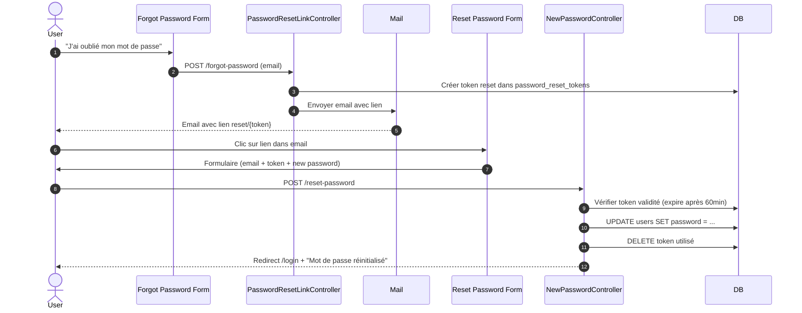

# VII - Refonte avec Breeze

<div
  class="omny-meta"
  data-level="🟡 Intermédiaire"
  data-version="1.0"
  data-time="12-15 heures">
</div>

## Introduction au module

!!! quote "Analogie pédagogique"
    _Imaginez que vous avez construit une voiture à la main : moteur, transmission, freins, tout assemblé pièce par pièce. Vous comprenez chaque vis, chaque câble, chaque système. Maintenant, un constructeur vous propose un **kit industriel** : le moteur est pré-assemblé, testé en usine, avec garantie et documentation. Vous gardez la carrosserie (votre workflow éditorial unique), mais vous remplacez les pièces "standard" (authentification, UI) par du matériel professionnel. Laravel Breeze est ce kit : il remplace votre auth "faite maison" par un système robuste, testé, et maintenu par la communauté Laravel._

Aux **Modules 1-6**, vous avez construit un système complet from scratch. Au **Module 4**, vous avez créé une authentification manuelle pour **comprendre les fondamentaux**. Maintenant que vous maîtrisez les concepts (sessions, hashing, middlewares), nous allons **refactoriser** l'application pour utiliser **Laravel Breeze**.

**Pourquoi refactoriser ?**

1. **Production-ready** : Breeze est testé par des milliers d'applications
2. **Fonctionnalités supplémentaires** : Email verification, reset password, 2FA (via Fortify)
3. **UI cohérente** : Design Tailwind CSS professionnel
4. **Maintenance** : Mises à jour de sécurité gérées par Laravel
5. **Standards** : Respect des conventions Laravel

**Objectifs pédagogiques du module :**

- [x] Installer et configurer Laravel Breeze
- [x] Comparer l'architecture auth custom vs Breeze
- [x] Migrer le code existant vers Breeze
- [x] Intégrer le workflow éditorial avec Breeze
- [x] Comprendre les différences entre Breeze, Jetstream, Fortify
- [x] Adapter les vues Blade avec Tailwind CSS
- [x] Gérer les rôles et permissions avec Breeze
- [x] Tester l'application refactorée

---

## 1. Comparaison : Custom Auth vs Breeze

### 1.1 Architecture côte à côte

**Tableau comparatif :**

| Composant | Custom Auth (Module 4) | Laravel Breeze |
|-----------|------------------------|----------------|
| **Controllers** | `AuthController` (1 fichier) | `RegisteredUserController`, `AuthenticatedSessionController`, etc. (séparés) |
| **Middlewares** | `Authenticate`, `RedirectIfAuthenticated` (custom) | Fournis par Laravel (`auth`, `guest`) |
| **Routes** | Définies manuellement dans `routes/auth.php` | Générées par Breeze |
| **Vues** | HTML basique sans CSS | Blade + Tailwind CSS + Alpine.js |
| **Validation** | Inline dans controllers | Form Requests dédiées |
| **Remember Me** | Implémenté manuellement | Intégré automatiquement |
| **Email Verification** | ❌ Non implémenté | ✅ Fourni |
| **Reset Password** | ❌ Non implémenté | ✅ Fourni |
| **Rate Limiting** | Implémenté manuellement | ✅ Configuré par défaut |
| **Tests** | ❌ Non fournis | ✅ Tests Pest/PHPUnit inclus |

### 1.2 Flux d'authentification comparé

```mermaid
graph TB
    subgraph "Custom Auth (Module 4)"
        A1[POST /login] --> A2[AuthController::login]
        A2 --> A3[Validation manuelle]
        A3 --> A4[Hash::check password]
        A4 --> A5[session 'user_id']
        A5 --> A6[session regenerate]
        A6 --> A7[Redirect dashboard]
    end
    
    subgraph "Laravel Breeze"
        B1[POST /login] --> B2[AuthenticatedSessionController]
        B2 --> B3[LoginRequest validation]
        B3 --> B4[Auth::attempt credentials]
        B4 --> B5[session regenerate]
        B5 --> B6[RateLimiter::clear]
        B6 --> B7[Redirect intended]
    end
    
    style A2 fill:#fff4e1
    style B2 fill:#e1f5e1
```



**Différences clés :**

1. **Auth facade** : Breeze utilise `Auth::attempt()` qui gère automatiquement :
   - Vérification du password hashé
   - Création de la session
   - Gestion du "Remember Me"
   - Déclenchement des événements (Login, Logout)

2. **Form Requests** : Validation séparée dans des classes dédiées

3. **Rate Limiting** : Intégré dans `LoginRequest` avec messages d'erreur localisés

4. **Intended redirect** : Breeze gère automatiquement `redirect()->intended()` pour revenir à l'URL initialement demandée

### 1.3 Helper auth() : avant/après

**Custom Auth (Module 4) :**

```php
// app/helpers.php
function auth(): ?User
{
    $userId = session('user_id');
    if (!$userId) return null;
    
    static $cachedUser = null;
    static $cachedUserId = null;
    
    if ($cachedUserId !== $userId) {
        $cachedUser = User::find($userId);
        $cachedUserId = $userId;
    }
    
    return $cachedUser;
}
```

**Avec Breeze :**

```php
// Fourni par Laravel (pas besoin de helper custom)
auth()->user();      // Utilisateur connecté
auth()->id();        // ID de l'utilisateur
auth()->check();     // true si connecté
auth()->guest();     // true si non connecté
auth()->login($user); // Connecter un utilisateur
auth()->logout();    // Déconnecter
```

---

## 2. Installation de Laravel Breeze

### 2.1 Prérequis et stratégie d'installation

**Situation actuelle :**

Vous avez un projet Laravel fonctionnel avec :
- Authentification custom (Module 4)
- Workflow éditorial (Module 6)
- Policies et Gates (Module 5)
- Base de données peuplée

**Stratégie de migration :**

Deux approches possibles :

| Approche | Avantages | Inconvénients |
|----------|-----------|---------------|
| **Fresh install** | Propre, pas de conflits | Perte du code existant à migrer manuellement |
| **Incremental** | Garde le code existant | Conflits à résoudre, fichiers à nettoyer |

**Nous allons utiliser l'approche Fresh Install sur un nouveau projet, puis migrer le code métier (workflow) :**

### 2.2 Installation de Breeze

**Créer un nouveau projet Laravel :**

```bash
# Nouveau projet Laravel
composer create-project laravel/laravel blog-laravel-breeze
cd blog-laravel-breeze

# Installer Breeze
composer require laravel/breeze --dev

# Installer le stack Blade (pas React/Vue)
php artisan breeze:install blade

# Options lors de l'installation :
# - Stack: blade
# - Dark mode support: yes
# - Testing framework: Pest
```

**Ce que `breeze:install blade` fait :**

1. **Publie les controllers** dans `app/Http/Controllers/Auth/`
2. **Publie les vues** dans `resources/views/auth/` et `resources/views/layouts/`
3. **Publie les routes** dans `routes/auth.php`
4. **Installe Tailwind CSS** + configuration
5. **Installe Alpine.js** (framework JS minimaliste)
6. **Configure les middlewares** d'authentification
7. **Publie les tests** dans `tests/Feature/Auth/`

**Compiler les assets :**

```bash
npm install
npm run dev
```

**Configurer la base de données :**

```env
# .env
DB_CONNECTION=sqlite
# Créer le fichier
touch database/database.sqlite
```

**Exécuter les migrations :**

```bash
php artisan migrate
```

**Lancer le serveur :**

```bash
php artisan serve
```

**Tester l'installation :**

Accéder à `http://localhost:8000` et cliquer sur "Register" ou "Log in".

### 2.3 Structure des fichiers Breeze

**Controllers générés :**

```
app/Http/Controllers/Auth/
├── AuthenticatedSessionController.php   # Login/Logout
├── ConfirmablePasswordController.php    # Confirmation password (actions sensibles)
├── EmailVerificationNotificationController.php
├── EmailVerificationPromptController.php
├── NewPasswordController.php            # Reset password
├── PasswordController.php               # Update password
├── PasswordResetLinkController.php      # Demande reset password
└── RegisteredUserController.php         # Registration
```

**Vues générées :**

```
resources/views/
├── auth/
│   ├── confirm-password.blade.php
│   ├── forgot-password.blade.php
│   ├── login.blade.php
│   ├── register.blade.php
│   ├── reset-password.blade.php
│   └── verify-email.blade.php
├── layouts/
│   ├── app.blade.php        # Layout principal
│   ├── guest.blade.php      # Layout pour pages auth
│   └── navigation.blade.php # Menu de navigation
├── components/           # Composants Blade réutilisables
│   ├── application-logo.blade.php
│   ├── input-error.blade.php
│   ├── input-label.blade.php
│   ├── primary-button.blade.php
│   ├── text-input.blade.php
│   └── ...
├── dashboard.blade.php
└── profile/
    ├── edit.blade.php
    └── partials/
```

**Routes générées (`routes/auth.php`) :**

```php
<?php

use App\Http\Controllers\Auth\AuthenticatedSessionController;
use App\Http\Controllers\Auth\ConfirmablePasswordController;
use App\Http\Controllers\Auth\EmailVerificationNotificationController;
use App\Http\Controllers\Auth\EmailVerificationPromptController;
use App\Http\Controllers\Auth\NewPasswordController;
use App\Http\Controllers\Auth\PasswordController;
use App\Http\Controllers\Auth\PasswordResetLinkController;
use App\Http\Controllers\Auth\RegisteredUserController;
use App\Http\Controllers\Auth\VerifiedEmailController;
use Illuminate\Support\Facades\Route;

Route::middleware('guest')->group(function () {
    Route::get('register', [RegisteredUserController::class, 'create'])
        ->name('register');

    Route::post('register', [RegisteredUserController::class, 'store']);

    Route::get('login', [AuthenticatedSessionController::class, 'create'])
        ->name('login');

    Route::post('login', [AuthenticatedSessionController::class, 'store']);

    Route::get('forgot-password', [PasswordResetLinkController::class, 'create'])
        ->name('password.request');

    Route::post('forgot-password', [PasswordResetLinkController::class, 'store'])
        ->name('password.email');

    Route::get('reset-password/{token}', [NewPasswordController::class, 'create'])
        ->name('password.reset');

    Route::post('reset-password', [NewPasswordController::class, 'store'])
        ->name('password.store');
});

Route::middleware('auth')->group(function () {
    Route::get('verify-email', EmailVerificationPromptController::class)
        ->name('verification.notice');

    Route::get('verify-email/{id}/{hash}', VerifiedEmailController::class)
        ->middleware(['signed', 'throttle:6,1'])
        ->name('verification.verify');

    Route::post('email/verification-notification', [EmailVerificationNotificationController::class, 'store'])
        ->middleware('throttle:6,1')
        ->name('verification.send');

    Route::get('confirm-password', [ConfirmablePasswordController::class, 'show'])
        ->name('password.confirm');

    Route::post('confirm-password', [ConfirmablePasswordController::class, 'store']);

    Route::put('password', [PasswordController::class, 'update'])
        ->name('password.update');

    Route::post('logout', [AuthenticatedSessionController::class, 'destroy'])
        ->name('logout');
});
```

---

## 3. Analyse du code Breeze : comprendre les patterns

### 3.1 RegisteredUserController : inscription

**Fichier : `app/Http/Controllers/Auth/RegisteredUserController.php`**

```php
<?php

namespace App\Http\Controllers\Auth;

use App\Http\Controllers\Controller;
use App\Models\User;
use Illuminate\Auth\Events\Registered;
use Illuminate\Http\RedirectResponse;
use Illuminate\Http\Request;
use Illuminate\Support\Facades\Auth;
use Illuminate\Support\Facades\Hash;
use Illuminate\Validation\Rules;
use Illuminate\View\View;

class RegisteredUserController extends Controller
{
    /**
     * Display the registration view.
     */
    public function create(): View
    {
        return view('auth.register');
    }

    /**
     * Handle an incoming registration request.
     *
     * @throws \Illuminate\Validation\ValidationException
     */
    public function store(Request $request): RedirectResponse
    {
        // Validation
        $request->validate([
            'name' => ['required', 'string', 'max:255'],
            'email' => ['required', 'string', 'lowercase', 'email', 'max:255', 'unique:'.User::class],
            'password' => ['required', 'confirmed', Rules\Password::defaults()],
        ]);

        // Création de l'utilisateur
        $user = User::create([
            'name' => $request->name,
            'email' => $request->email,
            'password' => Hash::make($request->password),
        ]);

        // Événement Registered (déclenche email de vérification si activé)
        event(new Registered($user));

        // Connexion automatique après inscription
        Auth::login($user);

        // Redirection
        return redirect(route('dashboard', absolute: false));
    }
}
```

**Différences avec votre code (Module 4) :**

| Aspect | Custom Auth | Breeze |
|--------|-------------|--------|
| **Connexion auto** | `session()->put('user_id', $user->id)` | `Auth::login($user)` (+ événement Login) |
| **Événement** | Aucun | `event(new Registered($user))` |
| **Validation password** | `Password::defaults()` | `Rules\Password::defaults()` (même chose) |
| **Email lowercase** | Non géré | `'lowercase'` dans validation |

### 3.2 AuthenticatedSessionController : login/logout

**Fichier : `app/Http/Controllers/Auth/AuthenticatedSessionController.php`**

```php
<?php

namespace App\Http\Controllers\Auth;

use App\Http\Controllers\Controller;
use App\Http\Requests\Auth\LoginRequest;
use Illuminate\Http\RedirectResponse;
use Illuminate\Http\Request;
use Illuminate\Support\Facades\Auth;
use Illuminate\View\View;

class AuthenticatedSessionController extends Controller
{
    /**
     * Display the login view.
     */
    public function create(): View
    {
        return view('auth.login');
    }

    /**
     * Handle an incoming authentication request.
     */
    public function store(LoginRequest $request): RedirectResponse
    {
        // La validation et l'authentification sont déléguées au LoginRequest
        $request->authenticate();

        // Régénération de session (protection session fixation)
        $request->session()->regenerate();

        // Redirection vers intended ou dashboard
        return redirect()->intended(route('dashboard', absolute: false));
    }

    /**
     * Destroy an authenticated session.
     */
    public function destroy(Request $request): RedirectResponse
    {
        // Déconnexion via facade Auth
        Auth::guard('web')->logout();

        // Invalidation de la session
        $request->session()->invalidate();

        // Régénération du token CSRF
        $request->session()->regenerateToken();

        return redirect('/');
    }
}
```

**LoginRequest : validation + authentification**

**Fichier : `app/Http/Requests/Auth/LoginRequest.php`**

```php
<?php

namespace App\Http\Requests\Auth;

use Illuminate\Auth\Events\Lockout;
use Illuminate\Foundation\Http\FormRequest;
use Illuminate\Support\Facades\Auth;
use Illuminate\Support\Facades\RateLimiter;
use Illuminate\Support\Str;
use Illuminate\Validation\ValidationException;

class LoginRequest extends FormRequest
{
    /**
     * Determine if the user is authorized to make this request.
     */
    public function authorize(): bool
    {
        return true;
    }

    /**
     * Get the validation rules that apply to the request.
     *
     * @return array<string, \Illuminate\Contracts\Validation\ValidationRule|array<mixed>|string>
     */
    public function rules(): array
    {
        return [
            'email' => ['required', 'string', 'email'],
            'password' => ['required', 'string'],
        ];
    }

    /**
     * Attempt to authenticate the request's credentials.
     *
     * @throws \Illuminate\Validation\ValidationException
     */
    public function authenticate(): void
    {
        // Vérifier le rate limiting AVANT l'authentification
        $this->ensureIsNotRateLimited();

        // Tentative d'authentification
        // Auth::attempt() fait automatiquement :
        // 1. Recherche l'utilisateur par email
        // 2. Vérifie le password hashé
        // 3. Crée la session
        // 4. Gère le "Remember Me" si coché
        if (! Auth::attempt($this->only('email', 'password'), $this->boolean('remember'))) {
            // Échec : incrémenter le compteur rate limiting
            RateLimiter::hit($this->throttleKey());

            throw ValidationException::withMessages([
                'email' => trans('auth.failed'),
            ]);
        }

        // Succès : effacer le compteur rate limiting
        RateLimiter::clear($this->throttleKey());
    }

    /**
     * Ensure the authentication request is not rate limited.
     */
    public function ensureIsNotRateLimited(): void
    {
        if (! RateLimiter::tooManyAttempts($this->throttleKey(), 5)) {
            return;
        }

        event(new Lockout($this));

        $seconds = RateLimiter::availableIn($this->throttleKey());

        throw ValidationException::withMessages([
            'email' => trans('auth.throttle', [
                'seconds' => $seconds,
                'minutes' => ceil($seconds / 60),
            ]),
        ]);
    }

    /**
     * Get the rate limiting throttle key for the request.
     */
    public function throttleKey(): string
    {
        return Str::transliterate(Str::lower($this->string('email')).'|'.$this->ip());
    }
}
```

**Avantages de cette approche :**

1. **Séparation des responsabilités** : Controller mince, logique dans Request
2. **Rate limiting intégré** : Pas besoin de le gérer manuellement dans le controller
3. **Auth::attempt()** : Gère automatiquement hashing, session, remember me
4. **Événements** : `Lockout` dispatché automatiquement si trop de tentatives
5. **Traductions** : Messages d'erreur localisés via `trans('auth.failed')`

### 3.3 Password Reset : flux complet

**Breeze fournit un système complet de reset password en 4 étapes :**



**Cette fonctionnalité n'existait PAS dans votre auth custom (Module 4).**

---

## 4. Migration du code métier vers Breeze

### 4.1 Stratégie de migration : checklist

Vous devez migrer les composants suivants de votre projet Modules 1-6 :

**✅ À migrer :**

- [ ] Modèles (Post, PostImage, Category, Tag, Comment)
- [ ] Migrations (tables posts, post_images, etc.)
- [ ] Enum PostStatus
- [ ] Service PostWorkflowService
- [ ] Policies (PostPolicy, CommentPolicy)
- [ ] Controllers métier (PostController, Admin/PostController)
- [ ] Vues métier (posts/*, admin/*)
- [ ] Routes métier (posts, admin)
- [ ] Seeders et Factories

**❌ À SUPPRIMER (remplacé par Breeze) :**

- [ ] AuthController (Module 4)
- [ ] Middlewares custom auth (Authenticate, RedirectIfAuthenticated)
- [ ] Helper auth() custom
- [ ] Routes auth custom (routes/auth.php ancien)
- [ ] Vues auth custom (auth/login.blade.php, auth/register.blade.php)

### 4.2 Migration des modèles et migrations

**Étape 1 : Copier les migrations**

```bash
# Depuis l'ancien projet vers le nouveau (Breeze)
cp database/migrations/*_create_posts_table.php ../blog-laravel-breeze/database/migrations/
cp database/migrations/*_add_workflow_columns_to_posts_table.php ../blog-laravel-breeze/database/migrations/
cp database/migrations/*_create_post_images_table.php ../blog-laravel-breeze/database/migrations/
cp database/migrations/*_create_categories_table.php ../blog-laravel-breeze/database/migrations/
# ... etc pour toutes les tables métier
```

**Étape 2 : Ajouter les colonnes de rôle à users**

Créer une nouvelle migration :

```bash
php artisan make:migration add_role_columns_to_users_table --table=users
```

```php
public function up(): void
{
    Schema::table('users', function (Blueprint $table) {
        $table->string('role')->default('reader');
        $table->boolean('is_author_approved')->default(false);
        $table->boolean('is_banned')->default(false);
        $table->timestamp('banned_at')->nullable();
        $table->text('ban_reason')->nullable();
        $table->boolean('has_submitted_post')->default(false);
    });
}
```

**Exécuter les migrations :**

```bash
php artisan migrate
```

**Étape 3 : Copier les modèles**

```bash
cp app/Models/Post.php ../blog-laravel-breeze/app/Models/
cp app/Models/PostImage.php ../blog-laravel-breeze/app/Models/
cp app/Enums/PostStatus.php ../blog-laravel-breeze/app/Enums/
# ... etc
```

**Étape 4 : Mettre à jour le modèle User**

```php
// app/Models/User.php

protected $fillable = [
    'name',
    'email',
    'password',
    'role',
    'is_author_approved',
    'is_banned',
];

// Ajouter les méthodes helpers (Module 5)
public function isAdmin(): bool
{
    return $this->role === 'admin';
}

public function isAuthor(): bool
{
    return $this->role === 'author';
}

public function hasRole(string $role): bool
{
    return $this->role === $role;
}

public function hasAnyRole(array $roles): bool
{
    return in_array($this->role, $roles);
}

// Relations
public function posts()
{
    return $this->hasMany(Post::class);
}
```

### 4.3 Migration des Policies

**Copier les Policies :**

```bash
cp app/Policies/PostPolicy.php ../blog-laravel-breeze/app/Policies/
cp app/Policies/CommentPolicy.php ../blog-laravel-breeze/app/Policies/
```

**Pas de changement nécessaire** : les Policies sont indépendantes du système d'auth utilisé.

### 4.4 Migration des Controllers

**Copier les controllers métier :**

```bash
cp app/Http/Controllers/PostController.php ../blog-laravel-breeze/app/Http/Controllers/
cp -r app/Http/Controllers/Admin/ ../blog-laravel-breeze/app/Http/Controllers/
```

**Mettre à jour les références :**

Dans vos controllers, remplacer :

```php
// ANCIEN (Module 4)
$user = user(); // Helper custom

// NOUVEAU (Breeze)
$user = auth()->user(); // Facade Auth
```

**Exemple : PostController mis à jour**

```php
public function store(StorePostRequest $request)
{
    $this->authorize('create', Post::class);
    
    $validated = $request->validated();
    
    return DB::transaction(function () use ($validated, $request) {
        $post = Post::create([
            'user_id' => auth()->id(), // ✅ Changement ici
            'title' => $validated['title'],
            'slug' => Str::slug($validated['title']),
            'body' => $validated['body'],
            'status' => PostStatus::DRAFT,
        ]);

        foreach ($request->file('images') as $index => $image) {
            $path = $image->store("posts/{$post->id}", 'public');
            PostImage::create([
                'post_id' => $post->id,
                'path' => $path,
                'is_main' => $index === 0,
                'order' => $index,
            ]);
        }

        return redirect()
            ->route('posts.show', $post)
            ->with('success', 'Post créé en brouillon.');
    });
}
```

### 4.5 Migration des vues avec Tailwind CSS

**Ancien style (HTML basique) :**

```html
<!-- Ancien -->
<form method="POST" action="{{ route('posts.store') }}">
    @csrf
    
    <div style="margin-bottom: 15px;">
        <label for="title">Titre :</label>
        <input type="text" id="title" name="title" value="{{ old('title') }}">
        @error('title')
            <span style="color: red;">{{ $message }}</span>
        @enderror
    </div>
    
    <button type="submit" style="padding: 10px 20px;">Créer</button>
</form>
```

**Nouveau style (Tailwind + Composants Blade) :**

```html
<!-- Nouveau -->
<form method="POST" action="{{ route('posts.store') }}">
    @csrf
    
    <div>
        <x-input-label for="title" :value="__('Titre')" />
        <x-text-input 
            id="title" 
            name="title" 
            type="text" 
            class="mt-1 block w-full" 
            :value="old('title')" 
            required 
            autofocus 
        />
        <x-input-error :messages="$errors->get('title')" class="mt-2" />
    </div>
    
    <x-primary-button class="mt-4">
        {{ __('Créer') }}
    </x-primary-button>
</form>
```

**Avantages des composants Blade Breeze :**

1. **Réutilisables** : Même style partout
2. **Accessibles** : Labels, ARIA attributes
3. **Responsive** : Mobile-friendly par défaut
4. **Dark mode** : Support automatique si activé
5. **Validation** : Affichage des erreurs uniforme

**Composants disponibles :**

| Composant | Usage |
|-----------|-------|
| `x-input-label` | Label de champ |
| `x-text-input` | Input texte |
| `x-textarea` | Textarea |
| `x-primary-button` | Bouton principal |
| `x-secondary-button` | Bouton secondaire |
| `x-danger-button` | Bouton danger (supprimer) |
| `x-input-error` | Affichage erreur |
| `x-dropdown` | Menu déroulant |
| `x-application-logo` | Logo app |

### 4.6 Layout principal : intégrer le menu

**Fichier : `resources/views/layouts/app.blade.php`**

Breeze fournit un layout de base. Vous devez l'étendre pour votre navigation :

```html
<!-- resources/views/layouts/app.blade.php -->
<!DOCTYPE html>
<html lang="{{ str_replace('_', '-', app()->getLocale()) }}">
    <head>
        <meta charset="utf-8">
        <meta name="viewport" content="width=device-width, initial-scale=1">
        <meta name="csrf-token" content="{{ csrf_token() }}">

        <title>{{ config('app.name', 'Laravel') }}</title>

        <!-- Fonts -->
        <link rel="preconnect" href="https://fonts.bunny.net">
        <link href="https://fonts.bunny.net/css?family=figtree:400,500,600&display=swap" rel="stylesheet" />

        <!-- Scripts -->
        @vite(['resources/css/app.css', 'resources/js/app.js'])
    </head>
    <body class="font-sans antialiased">
        <div class="min-h-screen bg-gray-100 dark:bg-gray-900">
            @include('layouts.navigation')

            <!-- Page Heading -->
            @isset($header)
                <header class="bg-white dark:bg-gray-800 shadow">
                    <div class="max-w-7xl mx-auto py-6 px-4 sm:px-6 lg:px-8">
                        {{ $header }}
                    </div>
                </header>
            @endisset

            <!-- Page Content -->
            <main>
                {{ $slot }}
            </main>
        </div>
    </body>
</html>
```

**Personnaliser la navigation :**

```html
<!-- resources/views/layouts/navigation.blade.php -->
<nav x-data="{ open: false }" class="bg-white dark:bg-gray-800 border-b border-gray-100 dark:border-gray-700">
    <div class="max-w-7xl mx-auto px-4 sm:px-6 lg:px-8">
        <div class="flex justify-between h-16">
            <div class="flex">
                <!-- Logo -->
                <div class="shrink-0 flex items-center">
                    <a href="{{ route('dashboard') }}">
                        <x-application-logo class="block h-9 w-auto fill-current text-gray-800 dark:text-gray-200" />
                    </a>
                </div>

                <!-- Navigation Links -->
                <div class="hidden space-x-8 sm:-my-px sm:ms-10 sm:flex">
                    <x-nav-link :href="route('dashboard')" :active="request()->routeIs('dashboard')">
                        {{ __('Dashboard') }}
                    </x-nav-link>
                    
                    {{-- Lien Posts --}}
                    <x-nav-link :href="route('posts.index')" :active="request()->routeIs('posts.*')">
                        {{ __('Posts') }}
                    </x-nav-link>
                    
                    {{-- Lien Admin (si admin) --}}
                    @can('admin')
                        <x-nav-link :href="route('admin.posts.pending')" :active="request()->routeIs('admin.*')">
                            {{ __('Administration') }}
                        </x-nav-link>
                    @endcan
                </div>
            </div>

            <!-- Settings Dropdown -->
            <div class="hidden sm:flex sm:items-center sm:ms-6">
                <x-dropdown align="right" width="48">
                    <x-slot name="trigger">
                        <button class="inline-flex items-center px-3 py-2 border border-transparent text-sm leading-4 font-medium rounded-md text-gray-500 dark:text-gray-400 bg-white dark:bg-gray-800 hover:text-gray-700 dark:hover:text-gray-300 focus:outline-none transition ease-in-out duration-150">
                            <div>{{ Auth::user()->name }}</div>

                            <div class="ms-1">
                                <svg class="fill-current h-4 w-4" xmlns="http://www.w3.org/2000/svg" viewBox="0 0 20 20">
                                    <path fill-rule="evenodd" d="M5.293 7.293a1 1 0 011.414 0L10 10.586l3.293-3.293a1 1 0 111.414 1.414l-4 4a1 1 0 01-1.414 0l-4-4a1 1 0 010-1.414z" clip-rule="evenodd" />
                                </svg>
                            </div>
                        </button>
                    </x-slot>

                    <x-slot name="content">
                        <x-dropdown-link :href="route('profile.edit')">
                            {{ __('Profile') }}
                        </x-dropdown-link>

                        <!-- Authentication -->
                        <form method="POST" action="{{ route('logout') }}">
                            @csrf

                            <x-dropdown-link :href="route('logout')"
                                    onclick="event.preventDefault();
                                                this.closest('form').submit();">
                                {{ __('Log Out') }}
                            </x-dropdown-link>
                        </form>
                    </x-slot>
                </x-dropdown>
            </div>

            <!-- Hamburger (mobile) -->
            <div class="-me-2 flex items-center sm:hidden">
                <button @click="open = ! open" class="inline-flex items-center justify-center p-2 rounded-md text-gray-400 dark:text-gray-500 hover:text-gray-500 dark:hover:text-gray-400 hover:bg-gray-100 dark:hover:bg-gray-900 focus:outline-none focus:bg-gray-100 dark:focus:bg-gray-900 focus:text-gray-500 dark:focus:text-gray-400 transition duration-150 ease-in-out">
                    <svg class="h-6 w-6" stroke="currentColor" fill="none" viewBox="0 0 24 24">
                        <path :class="{'hidden': open, 'inline-flex': ! open }" class="inline-flex" stroke-linecap="round" stroke-linejoin="round" stroke-width="2" d="M4 6h16M4 12h16M4 18h16" />
                        <path :class="{'hidden': ! open, 'inline-flex': open }" class="hidden" stroke-linecap="round" stroke-linejoin="round" stroke-width="2" d="M6 18L18 6M6 6l12 12" />
                    </svg>
                </button>
            </div>
        </div>
    </div>

    <!-- Responsive Navigation Menu -->
    <div :class="{'block': open, 'hidden': ! open}" class="hidden sm:hidden">
        <div class="pt-2 pb-3 space-y-1">
            <x-responsive-nav-link :href="route('dashboard')" :active="request()->routeIs('dashboard')">
                {{ __('Dashboard') }}
            </x-responsive-nav-link>
            
            <x-responsive-nav-link :href="route('posts.index')" :active="request()->routeIs('posts.*')">
                {{ __('Posts') }}
            </x-responsive-nav-link>
            
            @can('admin')
                <x-responsive-nav-link :href="route('admin.posts.pending')" :active="request()->routeIs('admin.*')">
                    {{ __('Administration') }}
                </x-responsive-nav-link>
            @endcan
        </div>

        <!-- Responsive Settings Options -->
        <div class="pt-4 pb-1 border-t border-gray-200 dark:border-gray-600">
            <div class="px-4">
                <div class="font-medium text-base text-gray-800 dark:text-gray-200">{{ Auth::user()->name }}</div>
                <div class="font-medium text-sm text-gray-500">{{ Auth::user()->email }}</div>
            </div>

            <div class="mt-3 space-y-1">
                <x-responsive-nav-link :href="route('profile.edit')">
                    {{ __('Profile') }}
                </x-responsive-nav-link>

                <!-- Authentication -->
                <form method="POST" action="{{ route('logout') }}">
                    @csrf

                    <x-responsive-nav-link :href="route('logout')"
                            onclick="event.preventDefault();
                                        this.closest('form').submit();">
                        {{ __('Log Out') }}
                    </x-responsive-nav-link>
                </form>
            </div>
        </div>
    </div>
</nav>
```

---

## 5. Fonctionnalités Breeze avancées

### 5.1 Email Verification

**Activer la vérification d'email :**

**Étape 1 : Implémenter MustVerifyEmail dans User**

```php
// app/Models/User.php

use Illuminate\Contracts\Auth\MustVerifyEmail;

class User extends Authenticatable implements MustVerifyEmail
{
    // ...
}
```

**Étape 2 : Protéger les routes avec le middleware `verified`**

```php
// routes/web.php

Route::middleware(['auth', 'verified'])->group(function () {
    Route::resource('posts', PostController::class);
});
```

**Étape 3 : Configurer l'envoi d'emails**

```env
# .env
MAIL_MAILER=log
MAIL_FROM_ADDRESS="noreply@blog-laravel.com"
MAIL_FROM_NAME="${APP_NAME}"
```

**Test :**

1. S'inscrire avec un nouvel utilisateur
2. Consulter `storage/logs/laravel.log` pour voir l'email de vérification
3. Copier le lien de vérification et l'ouvrir dans le navigateur
4. L'utilisateur est maintenant vérifié

### 5.2 Password Confirmation (actions sensibles)

Breeze permet de demander une **confirmation de mot de passe** avant des actions sensibles.

**Utilisation :**

```php
// routes/web.php

Route::delete('/posts/{post}', [PostController::class, 'destroy'])
    ->middleware(['auth', 'password.confirm']);
```

**Flux :**

1. Utilisateur clique "Supprimer"
2. Redirection vers `/confirm-password`
3. Utilisateur saisit son mot de passe
4. Si correct, exécution de l'action originale
5. Mot de passe "mémorisé" pendant 3 heures (configurable)

### 5.3 Profile Management

Breeze fournit une page de gestion de profil :

- Modifier nom et email
- Changer le mot de passe
- Supprimer le compte

**Vue : `resources/views/profile/edit.blade.php`**

**Controllers :**
- `ProfileController` : Update profile
- `PasswordController` : Update password

**Vous pouvez étendre cette page pour ajouter :**

- Avatar
- Bio
- Préférences utilisateur

---

## 6. Comparaison : Breeze vs Jetstream vs Fortify

### 6.1 Tableau comparatif

| Fonctionnalité | Breeze | Jetstream | Fortify |
|----------------|--------|-----------|---------|
| **Type** | Starter Kit | Starter Kit Complet | Backend Only |
| **Complexité** | ⭐ Simple | ⭐⭐⭐ Complexe | ⭐⭐ Moyenne |
| **UI** | Blade + Tailwind | Livewire OU Inertia (Vue) | Aucune (API) |
| **Authentication** | ✅ | ✅ | ✅ |
| **Registration** | ✅ | ✅ | ✅ |
| **Email Verification** | ✅ | ✅ | ✅ |
| **Password Reset** | ✅ | ✅ | ✅ |
| **2FA (Two-Factor)** | ❌ | ✅ | ✅ |
| **Profile Management** | ✅ Basique | ✅ Complet | ❌ |
| **API Tokens** | ❌ | ✅ (Sanctum) | ❌ |
| **Team Management** | ❌ | ✅ | ❌ |
| **Permissions** | ❌ | ✅ Basique | ❌ |
| **Idéal pour** | Petits projets, apprentissage | Apps entreprise | APIs, SPAs |

### 6.2 Quand utiliser quoi ?

**Breeze (ce que nous utilisons) :**
- ✅ Projet de taille petite/moyenne
- ✅ Vous voulez comprendre le code
- ✅ Vous voulez personnaliser facilement
- ✅ Blade + Tailwind suffit
- ❌ Pas besoin de 2FA ou teams

**Jetstream :**
- ✅ Application d'entreprise
- ✅ Besoin de 2FA
- ✅ Gestion d'équipes (teams)
- ✅ API tokens (Sanctum)
- ❌ Courbe d'apprentissage plus raide

**Fortify :**
- ✅ Vous construisez une API pure
- ✅ Frontend séparé (React, Vue, mobile)
- ✅ Vous gérez l'UI vous-même
- ❌ Pas de vues HTML fournies

**Laravel Sanctum (souvent avec Jetstream) :**
- Gestion de tokens API
- Authentification SPA
- Authentification mobile

---

## 7. Tests : valider la migration

### 7.1 Tests d'authentification fournis par Breeze

Breeze installe automatiquement des tests Pest :

```bash
# Lister les tests
ls tests/Feature/Auth/

# Exécuter les tests
php artisan test
```

**Tests fournis :**

```
tests/Feature/Auth/
├── AuthenticationTest.php
├── EmailVerificationTest.php
├── PasswordConfirmationTest.php
├── PasswordResetTest.php
├── PasswordUpdateTest.php
├── RegistrationTest.php
└── ...
```

**Exemple de test (RegistrationTest) :**

```php
<?php

use App\Models\User;

test('registration screen can be rendered', function () {
    $response = $this->get('/register');

    $response->assertStatus(200);
});

test('new users can register', function () {
    $response = $this->post('/register', [
        'name' => 'Test User',
        'email' => 'test@example.com',
        'password' => 'password',
        'password_confirmation' => 'password',
    ]);

    $this->assertAuthenticated();
    $response->assertRedirect(route('dashboard', absolute: false));
});
```

### 7.2 Créer des tests pour le workflow éditorial

**Test : soumission d'un post**

```php
<?php

use App\Models\User;
use App\Models\Post;
use App\Enums\PostStatus;

test('author can submit a draft post', function () {
    $author = User::factory()->create(['role' => 'author']);
    $post = Post::factory()->create([
        'user_id' => $author->id,
        'status' => PostStatus::DRAFT,
    ]);

    $this->actingAs($author);

    $response = $this->post(route('posts.submit', $post));

    $response->assertRedirect(route('posts.show', $post));
    
    $post->refresh();
    expect($post->status)->toBe(PostStatus::SUBMITTED);
});

test('non-owner cannot submit post', function () {
    $author = User::factory()->create();
    $otherUser = User::factory()->create();
    $post = Post::factory()->create([
        'user_id' => $author->id,
        'status' => PostStatus::DRAFT,
    ]);

    $this->actingAs($otherUser);

    $response = $this->post(route('posts.submit', $post));

    $response->assertForbidden();
});
```

---

## 8. Exercice récapitulatif : migration complète

### 8.1 Objectif

Migrer **intégralement** le projet des Modules 1-6 vers Breeze.

### 8.2 Checklist complète

**Phase 1 : Installation Breeze**

- [ ] Créer un nouveau projet Laravel
- [ ] Installer Breeze (`composer require laravel/breeze --dev`)
- [ ] Installer le stack Blade (`php artisan breeze:install blade`)
- [ ] Compiler les assets (`npm install && npm run dev`)
- [ ] Configurer la base de données (SQLite ou MySQL)
- [ ] Exécuter les migrations Breeze (`php artisan migrate`)

**Phase 2 : Migration base de données**

- [ ] Copier les migrations métier (posts, post_images, categories, etc.)
- [ ] Créer migration pour colonnes role dans users
- [ ] Exécuter toutes les migrations
- [ ] Copier et exécuter les seeders

**Phase 3 : Migration des modèles**

- [ ] Copier tous les modèles métier (Post, PostImage, etc.)
- [ ] Copier l'enum PostStatus
- [ ] Mettre à jour le modèle User (rôles, relations)
- [ ] Vérifier les relations Eloquent

**Phase 4 : Migration logique métier**

- [ ] Copier PostWorkflowService
- [ ] Copier toutes les Policies
- [ ] Copier les Form Requests
- [ ] Vérifier l'enregistrement des Policies

**Phase 5 : Migration des controllers**

- [ ] Copier PostController
- [ ] Copier Admin/PostController
- [ ] Copier CategoryController (si existant)
- [ ] Remplacer `user()` par `auth()->user()`
- [ ] Vérifier les autorisations (`$this->authorize()`)

**Phase 6 : Migration des routes**

- [ ] Copier les routes métier dans `routes/web.php`
- [ ] Grouper avec `middleware(['auth', 'verified'])`
- [ ] Vérifier les noms de routes

**Phase 7 : Migration des vues**

- [ ] Copier les vues métier (posts/*, admin/*)
- [ ] Convertir les formulaires en composants Blade Breeze
- [ ] Utiliser le layout `app.blade.php` de Breeze
- [ ] Personnaliser la navigation
- [ ] Ajouter les liens conditionnels (@can, @cannot)

**Phase 8 : Tests et validation**

- [ ] Tester l'inscription d'un nouvel utilisateur
- [ ] Tester la connexion
- [ ] Tester la création d'un post avec images
- [ ] Tester la soumission d'un post
- [ ] Tester l'approbation/rejet (admin)
- [ ] Tester les autorisations (qui peut faire quoi)
- [ ] Exécuter les tests automatisés (`php artisan test`)

**Phase 9 : Fonctionnalités Breeze**

- [ ] Activer email verification (`MustVerifyEmail`)
- [ ] Tester le reset password
- [ ] Tester la modification de profil
- [ ] Tester la confirmation password sur actions sensibles

**Phase 10 : Cleanup**

- [ ] Supprimer le helper `user()` custom (si conservé)
- [ ] Supprimer les middlewares auth custom (si conservés)
- [ ] Supprimer les vues auth custom
- [ ] Vérifier qu'aucun code mort ne reste

---

## 9. Checkpoint de progression

### 9.1 Compétences acquises

- [x] Comprendre l'architecture de Laravel Breeze
- [x] Comparer auth custom vs Breeze
- [x] Installer et configurer Breeze
- [x] Migrer du code métier vers Breeze
- [x] Utiliser les composants Blade avec Tailwind
- [x] Activer l'email verification
- [x] Utiliser password confirmation
- [x] Comprendre les différences Breeze/Jetstream/Fortify
- [x] Tester une application avec Breeze

### 9.2 Quiz d'auto-évaluation

1. **Question :** Quelle est la différence principale entre `Auth::attempt()` et votre code custom du Module 4 ?
   <details>
   <summary>Réponse</summary>
   `Auth::attempt()` encapsule automatiquement : recherche utilisateur, vérification password hashé, création session, gestion Remember Me, et déclenchement des événements (Login). Dans le code custom, tout était fait manuellement.
   </details>

2. **Question :** Pourquoi Breeze utilise-t-il des Form Requests (ex: LoginRequest) au lieu de valider dans le controller ?
   <details>
   <summary>Réponse</summary>
   Séparation des responsabilités : la validation et la logique d'authentification (rate limiting, etc.) sont isolées du controller, rendant le code plus testable et réutilisable.
   </details>

3. **Question :** Comment activer l'email verification sur vos routes métier ?
   <details>
   <summary>Réponse</summary>
   1. Implémenter `MustVerifyEmail` dans le modèle User
   2. Ajouter le middleware `verified` aux routes : `Route::middleware(['auth', 'verified'])->group(...)`
   </details>

4. **Question :** Quelle est la différence entre Breeze et Jetstream ?
   <details>
   <summary>Réponse</summary>
   Breeze est simple (auth de base), Jetstream est complet (2FA, teams, API tokens). Breeze = petits projets / apprentissage, Jetstream = apps entreprise.
   </details>

5. **Question :** Votre code métier (PostWorkflowService, Policies) a-t-il besoin d'être modifié lors de la migration vers Breeze ?
   <details>
   <summary>Réponse</summary>
   Non, il est indépendant du système d'auth. Seule modification : remplacer `user()` helper par `auth()->user()` dans les controllers.
   </details>

---

## 10. Le mot de la fin du module

!!! quote "Récapitulatif"
    Vous venez de parcourir un **arc complet d'apprentissage** :
    
    1. **Module 4** : Construire une auth from scratch pour **comprendre**
    2. **Module 7** : Remplacer par Breeze pour la **production**
    
    Ce pattern (apprendre → refactoriser) est fondamental en développement professionnel. Vous ne pouvez pas utiliser efficacement un outil sans comprendre ce qu'il fait sous le capot.
    
    **Ce que vous maîtrisez maintenant :**
    
    - Pourquoi `Auth::attempt()` est meilleur que votre code custom
    - Comment migrer du code existant vers un starter kit
    - Les composants Blade et Tailwind CSS
    - L'email verification et password reset
    - Les différences entre Breeze, Jetstream, Fortify
    
    **Votre application est maintenant :**
    
    - ✅ Production-ready (auth robuste)
    - ✅ Testée (tests Pest fournis)
    - ✅ Maintenable (conventions Laravel)
    - ✅ Scalable (fondations solides)
    - ✅ Sécurisée (bonnes pratiques appliquées)
    
    **Prochaine étape :** Le **Module 8 - Perspectives TALL Stack** va vous introduire aux technologies modernes de Laravel : Tailwind CSS approfondi, Alpine.js, et Livewire pour créer des interfaces réactives sans écrire de JavaScript complexe.

**Prochaine étape :**  
[:lucide-arrow-right: Module 8 - Perspectives TALL Stack](../module-08-tall-stack/)

---

## Navigation du module

**Module précédent :**  
[:lucide-arrow-left: Module 6 - Workflow Éditorial](../module-06-workflow-editorial/)

**Module suivant :**  
[:lucide-arrow-right: Module 8 - Perspectives TALL Stack](../module-08-tall-stack/)

**Retour à l'index :**  
[:lucide-home: Index du guide](../index/)