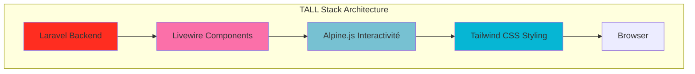
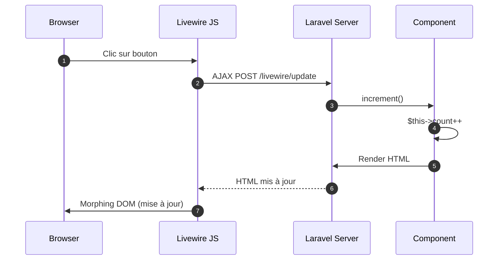
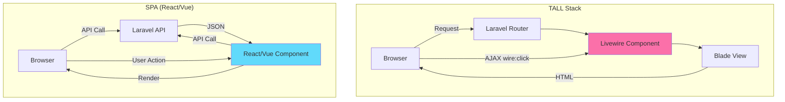
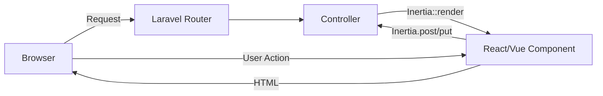
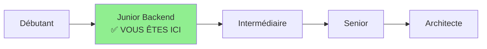
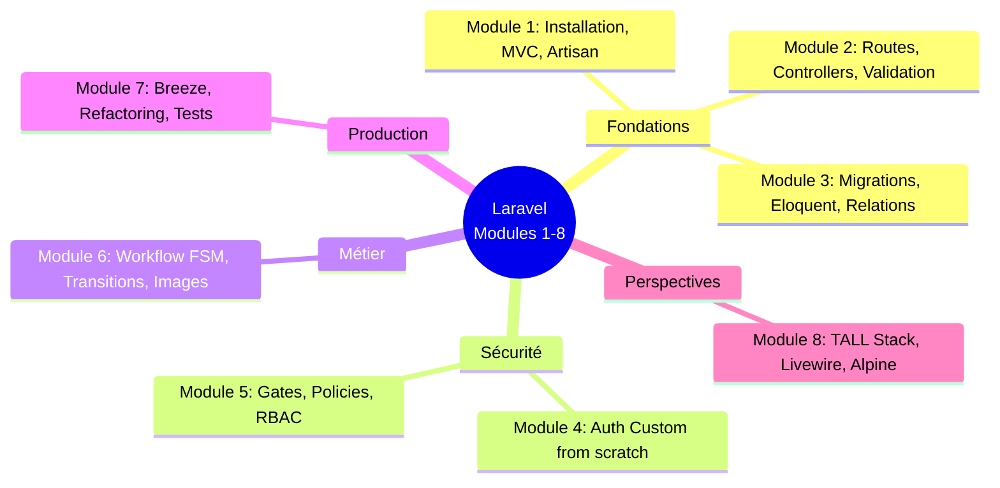

# VIII - Stack "TALL" en vue

<div
  class="omny-meta"
  data-level="🟢 Débutant/Intermédiaire"
  data-version="1.0"
  data-time="8-10 heures">
</div>

## Introduction au module

!!! quote "Analogie pédagogique"
    _Imaginez que vous avez appris à construire une maison traditionnelle : murs en briques, toit en tuiles, isolation classique. Vous maîtrisez parfaitement les fondations. Maintenant, on vous présente des **matériaux modernes** : panneaux isolants haute performance, tuiles solaires, domotique intégrée. Vous n'allez pas reconstruire votre maison immédiatement, mais vous **comprenez les possibilités** pour vos futurs projets. Le TALL Stack, c'est cette boîte à outils moderne pour Laravel : vous avez construit du solide avec Blade classique, maintenant découvrons ce qui existe pour aller plus loin._

Aux **Modules 1-7**, vous avez construit une application Laravel complète et production-ready avec des technologies "traditionnelles" (Blade, JavaScript vanilla). Ce **Module 8 final** est différent : c'est une **introduction théorique et pratique** aux technologies modernes de l'écosystème Laravel.

**Pourquoi un module "Perspectives" ?**

1. **Vous avez les fondations** : Routes, Eloquent, Auth, Policies → Tout est solide
2. **Le monde évolue** : Les interfaces modernes demandent de l'interactivité
3. **Laravel propose des solutions** : TALL Stack = stack officiel moderne
4. **Vous devez choisir** : SPA (React/Vue) ou TALL ? Quand utiliser quoi ?
5. **Préparer l'avenir** : Comprendre les tendances pour votre carrière

**Objectifs pédagogiques du module :**

- [x] Comprendre l'acronyme TALL (Tailwind, Alpine, Livewire, Laravel)
- [x] Approfondir Tailwind CSS (déjà utilisé avec Breeze)
- [x] Découvrir Alpine.js pour l'interactivité légère
- [x] Comprendre Livewire (composants réactifs sans JavaScript)
- [x] Comparer TALL vs SPA (React, Vue, Inertia.js)
- [x] Identifier quand utiliser chaque technologie
- [x] Explorer les perspectives d'évolution (APIs, microservices, etc.)
- [x] Récapitulatif complet de la formation (Modules 1-8)

---

## 1. Le TALL Stack : vue d'ensemble

### 1.1 Qu'est-ce que le TALL Stack ?

**TALL** est un acronyme désignant une stack technologique **officielle** de Laravel :

- **T** : **Tailwind CSS** (framework CSS utilitaire)
- **A** : **Alpine.js** (framework JavaScript minimaliste)
- **L** : **Livewire** (composants Laravel réactifs)
- **L** : **Laravel** (framework PHP backend)



### 1.2 Philosophie du TALL Stack

**Principe central :** Rester dans l'écosystème Laravel pour tout construire, du backend au frontend, avec un minimum de JavaScript.

**Comparaison avec d'autres stacks :**

| Stack | Backend | Frontend | JavaScript | Courbe apprentissage |
|-------|---------|----------|------------|----------------------|
| **TALL** | Laravel | Blade + Livewire | Alpine.js (minimal) | ⭐⭐ Moyenne |
| **MERN** | Node.js (Express) | React | React (lourd) | ⭐⭐⭐ Élevée |
| **MEAN** | Node.js (Express) | Angular | Angular (très lourd) | ⭐⭐⭐⭐ Très élevée |
| **Laravel + Vue** | Laravel | Vue.js | Vue.js (moyen) | ⭐⭐⭐ Élevée |
| **Laravel + Inertia** | Laravel | React/Vue/Svelte | Framework JS | ⭐⭐⭐ Élevée |

**Avantages du TALL :**

1. **Un seul langage principal** : PHP (+ HTML/CSS, JavaScript minimal)
2. **Productivité** : Développement rapide sans API REST
3. **Maintenance** : Pas de synchronisation frontend/backend
4. **Courbe d'apprentissage** : Si vous connaissez Laravel, le reste est facile
5. **SEO-friendly** : Rendu serveur par défaut

**Inconvénients du TALL :**

1. **Pas de SPA native** : Rechargement de pages (même si Livewire minimise)
2. **Scalabilité frontend** : Apps très complexes peuvent être mieux servies par React/Vue
3. **Moins populaire** : Communauté plus petite que React/Vue
4. **Mobile** : Pas adapté aux apps mobiles natives (utiliser API + React Native)

---

## 2. Tailwind CSS : approfondissement

### 2.1 Rappel : qu'est-ce que Tailwind CSS ?

**Tailwind CSS** est un framework CSS **utilitaire** : au lieu de classes sémantiques (`btn-primary`, `card`), vous composez vos styles avec des classes atomiques.

**Exemple comparatif :**

```html
<!-- Bootstrap (classes sémantiques) -->
<button class="btn btn-primary btn-lg">
    Cliquer ici
</button>

<!-- Tailwind (classes utilitaires) -->
<button class="bg-blue-500 hover:bg-blue-700 text-white font-bold py-2 px-4 rounded">
    Cliquer ici
</button>
```

**Avantages Tailwind :**

- **Pas de CSS custom** : Tout est dans le HTML
- **Pas de conflits de noms** : Pas de risque de surcharge de classes
- **Purge automatique** : Le CSS final ne contient que les classes utilisées (petit bundle)
- **Responsive intégré** : `md:text-lg`, `lg:hidden`, etc.
- **Dark mode** : `dark:bg-gray-800`

**Inconvénients Tailwind :**

- **HTML verbeux** : Beaucoup de classes dans le markup
- **Courbe d'apprentissage** : Mémoriser les noms de classes
- **Lisibilité** : Code HTML dense

### 2.2 Concepts avancés Tailwind

**1. Responsive Design (Mobile-First)**

Tailwind utilise une approche **mobile-first** : les styles sans préfixe s'appliquent sur mobile, puis on ajoute des préfixes pour les écrans plus grands.

```html
<!-- 
    Base (mobile) : texte petit
    md (tablette) : texte moyen
    lg (desktop) : texte large
-->
<h1 class="text-2xl md:text-4xl lg:text-6xl">
    Titre responsive
</h1>

<!-- 
    Caché sur mobile, visible sur desktop
-->
<div class="hidden lg:block">
    Menu desktop complet
</div>

<!-- 
    Colonne sur mobile, grille 3 colonnes sur desktop
-->
<div class="grid grid-cols-1 md:grid-cols-2 lg:grid-cols-3 gap-4">
    <div>Item 1</div>
    <div>Item 2</div>
    <div>Item 3</div>
</div>
```

**Breakpoints Tailwind par défaut :**

| Préfixe | Largeur minimale | Appareil |
|---------|------------------|----------|
| (aucun) | 0px | Mobile (défaut) |
| `sm:` | 640px | Smartphone paysage |
| `md:` | 768px | Tablette |
| `lg:` | 1024px | Desktop |
| `xl:` | 1280px | Grand desktop |
| `2xl:` | 1536px | Très grand desktop |

**2. Dark Mode**

```html
<!-- Fond blanc en light mode, gris foncé en dark mode -->
<div class="bg-white dark:bg-gray-900">
    <p class="text-gray-900 dark:text-gray-100">
        Texte adaptatif
    </p>
</div>
```

**Configuration dans `tailwind.config.js` :**

```javascript
module.exports = {
    darkMode: 'class', // Utilise la classe 'dark' sur <html>
    // Ou : darkMode: 'media', // Utilise prefers-color-scheme
}
```

**Toggle dark mode avec Alpine.js :**

```html
<div x-data="{ darkMode: false }">
    <button @click="darkMode = !darkMode; document.documentElement.classList.toggle('dark')">
        <span x-show="!darkMode">🌙 Mode sombre</span>
        <span x-show="darkMode">☀️ Mode clair</span>
    </button>
</div>
```

**3. États interactifs (Hover, Focus, Active)**

```html
<button class="
    bg-blue-500 
    hover:bg-blue-700 
    active:bg-blue-800
    focus:outline-none 
    focus:ring-2 
    focus:ring-blue-500
    focus:ring-opacity-50
    transition 
    duration-200
">
    Bouton avec états
</button>
```

**4. Composants réutilisables avec @apply**

Bien que Tailwind encourage les classes utilitaires, vous pouvez créer des composants CSS :

```css
/* resources/css/app.css */

@layer components {
    .btn-primary {
        @apply bg-blue-500 hover:bg-blue-700 text-white font-bold py-2 px-4 rounded;
    }
    
    .card {
        @apply bg-white shadow-md rounded-lg p-6;
    }
}
```

**Utilisation :**

```html
<button class="btn-primary">Cliquer</button>
<div class="card">Contenu de la carte</div>
```

**5. Configuration personnalisée**

**Fichier : `tailwind.config.js`**

```javascript
module.exports = {
    content: [
        './resources/**/*.blade.php',
        './resources/**/*.js',
    ],
    theme: {
        extend: {
            colors: {
                'brand': {
                    50: '#f0f9ff',
                    100: '#e0f2fe',
                    // ... jusqu'à 900
                    500: '#0ea5e9', // Couleur principale
                },
            },
            fontFamily: {
                'sans': ['Inter', 'sans-serif'],
            },
            spacing: {
                '128': '32rem',
            },
        },
    },
    plugins: [
        require('@tailwindcss/forms'),
        require('@tailwindcss/typography'),
    ],
}
```

**Utilisation des couleurs custom :**

```html
<div class="bg-brand-500 text-white">
    Couleur de marque personnalisée
</div>
```

---

## 3. Alpine.js : interactivité légère

### 3.1 Qu'est-ce qu'Alpine.js ?

**Alpine.js** est un framework JavaScript **minimaliste** (15KB) qui apporte de l'interactivité aux vues Blade sans écrire de JavaScript complexe.

**Philosophie :** Rester dans le HTML avec des directives (comme Vue.js, mais beaucoup plus simple).

**Exemple : Toggle un menu**

```html
<!-- Avant Alpine.js : JavaScript vanilla -->
<script>
    let menuOpen = false;
    document.getElementById('menu-button').addEventListener('click', () => {
        menuOpen = !menuOpen;
        document.getElementById('menu').classList.toggle('hidden');
    });
</script>

<button id="menu-button">Menu</button>
<div id="menu" class="hidden">
    <a href="#">Lien 1</a>
    <a href="#">Lien 2</a>
</div>

<!-- Avec Alpine.js : déclaratif dans le HTML -->
<div x-data="{ open: false }">
    <button @click="open = !open">Menu</button>
    <div x-show="open">
        <a href="#">Lien 1</a>
        <a href="#">Lien 2</a>
    </div>
</div>
```

### 3.2 Directives Alpine.js essentielles

**`x-data` : Déclarer l'état du composant**

```html
<div x-data="{ count: 0, name: 'Alice' }">
    <!-- État accessible dans tout ce bloc -->
</div>
```

**`x-show` / `x-if` : Affichage conditionnel**

```html
<div x-data="{ show: true }">
    <!-- x-show : masque avec CSS (display: none) -->
    <p x-show="show">Visible</p>
    
    <!-- x-if : supprime du DOM (meilleur pour performance) -->
    <template x-if="show">
        <p>Visible</p>
    </template>
    
    <button @click="show = !show">Toggle</button>
</div>
```

**`@click` / `@submit` / `@input` : Événements**

```html
<div x-data="{ count: 0 }">
    <p>Compteur : <span x-text="count"></span></p>
    <button @click="count++">Incrémenter</button>
    <button @click="count--">Décrémenter</button>
    <button @click="count = 0">Reset</button>
</div>
```

**`x-model` : Liaison bidirectionnelle (two-way binding)**

```html
<div x-data="{ message: '' }">
    <input type="text" x-model="message" placeholder="Tapez quelque chose">
    <p>Vous avez tapé : <span x-text="message"></span></p>
</div>
```

**`x-for` : Boucles**

```html
<div x-data="{ items: ['Pomme', 'Banane', 'Orange'] }">
    <ul>
        <template x-for="item in items" :key="item">
            <li x-text="item"></li>
        </template>
    </ul>
</div>
```

**`x-transition` : Animations**

```html
<div x-data="{ open: false }">
    <button @click="open = !open">Toggle</button>
    
    <div 
        x-show="open"
        x-transition:enter="transition ease-out duration-300"
        x-transition:enter-start="opacity-0 transform scale-90"
        x-transition:enter-end="opacity-100 transform scale-100"
        x-transition:leave="transition ease-in duration-300"
        x-transition:leave-start="opacity-100 transform scale-100"
        x-transition:leave-end="opacity-0 transform scale-90"
    >
        Contenu animé
    </div>
</div>
```

### 3.3 Exemple pratique : Système de tabs

```html
<div x-data="{ activeTab: 'tab1' }">
    <!-- Navigation tabs -->
    <div class="flex space-x-2 border-b">
        <button 
            @click="activeTab = 'tab1'"
            :class="activeTab === 'tab1' ? 'border-b-2 border-blue-500 text-blue-500' : 'text-gray-500'"
            class="px-4 py-2"
        >
            Profil
        </button>
        <button 
            @click="activeTab = 'tab2'"
            :class="activeTab === 'tab2' ? 'border-b-2 border-blue-500 text-blue-500' : 'text-gray-500'"
            class="px-4 py-2"
        >
            Paramètres
        </button>
        <button 
            @click="activeTab = 'tab3'"
            :class="activeTab === 'tab3' ? 'border-b-2 border-blue-500 text-blue-500' : 'text-gray-500'"
            class="px-4 py-2"
        >
            Historique
        </button>
    </div>
    
    <!-- Contenu des tabs -->
    <div class="mt-4">
        <div x-show="activeTab === 'tab1'">
            <h2>Profil</h2>
            <p>Informations de profil...</p>
        </div>
        <div x-show="activeTab === 'tab2'">
            <h2>Paramètres</h2>
            <p>Paramètres du compte...</p>
        </div>
        <div x-show="activeTab === 'tab3'">
            <h2>Historique</h2>
            <p>Historique des actions...</p>
        </div>
    </div>
</div>
```

### 3.4 Alpine.js dans le projet (déjà utilisé par Breeze)

Breeze utilise Alpine.js pour :

- **Menu responsive** (hamburger mobile)
- **Dropdown** (menu utilisateur)
- **Modals** (confirmation d'actions)

**Exemple : Dropdown de Breeze**

```html
<!-- resources/views/layouts/navigation.blade.php -->
<div x-data="{ open: false }" class="relative">
    <button @click="open = !open">
        {{ Auth::user()->name }}
    </button>
    
    <div 
        x-show="open" 
        @click.outside="open = false"
        class="absolute right-0 mt-2 w-48 bg-white shadow-lg"
    >
        <a href="{{ route('profile.edit') }}">Profil</a>
        <form method="POST" action="{{ route('logout') }}">
            @csrf
            <button type="submit">Déconnexion</button>
        </form>
    </div>
</div>
```

**Directive `@click.outside`** : Ferme le dropdown si on clique à l'extérieur (très utile !).

---

## 4. Livewire : composants réactifs

### 4.1 Qu'est-ce que Livewire ?

**Livewire** est un framework qui permet de créer des **composants dynamiques** (réactifs) en utilisant uniquement **PHP et Blade**, sans écrire de JavaScript.

**Principe de fonctionnement :**

1. Vous créez un composant PHP (classe)
2. Vous créez une vue Blade associée
3. Livewire gère automatiquement la communication client-serveur via AJAX
4. Les changements d'état côté serveur se reflètent automatiquement dans le navigateur

**Exemple : Compteur réactif**

Sans Livewire (JavaScript) :

```html
<div id="counter">
    <p>Compteur : <span id="count">0</span></p>
    <button onclick="increment()">+1</button>
</div>

<script>
    let count = 0;
    function increment() {
        count++;
        document.getElementById('count').textContent = count;
    }
</script>
```

Avec Livewire (PHP uniquement) :

```php
// app/Livewire/Counter.php
<?php

namespace App\Livewire;

use Livewire\Component;

class Counter extends Component
{
    public $count = 0;

    public function increment()
    {
        $this->count++;
    }

    public function render()
    {
        return view('livewire.counter');
    }
}
```

```html
<!-- resources/views/livewire/counter.blade.php -->
<div>
    <p>Compteur : {{ $count }}</p>
    <button wire:click="increment">+1</button>
</div>
```

**Utilisation dans une vue Blade :**

```html
<livewire:counter />
```

**Ce qui se passe en coulisses :**



### 4.2 Installation de Livewire

```bash
composer require livewire/livewire
```

**Ajouter les assets Livewire dans le layout :**

```html
<!-- resources/views/layouts/app.blade.php -->
<!DOCTYPE html>
<html>
<head>
    <!-- ... -->
    @livewireStyles
</head>
<body>
    <!-- ... -->
    @livewireScripts
</body>
</html>
```

### 4.3 Créer un composant Livewire

```bash
php artisan make:livewire SearchPosts
```

**Fichiers générés :**

```
app/Livewire/SearchPosts.php
resources/views/livewire/search-posts.blade.php
```

**Composant PHP :**

```php
<?php

namespace App\Livewire;

use App\Models\Post;
use Livewire\Component;

class SearchPosts extends Component
{
    public $search = '';

    public function render()
    {
        $posts = Post::query()
            ->when($this->search, function ($query) {
                $query->where('title', 'like', "%{$this->search}%")
                      ->orWhere('body', 'like', "%{$this->search}%");
            })
            ->latest()
            ->take(10)
            ->get();

        return view('livewire.search-posts', [
            'posts' => $posts,
        ]);
    }
}
```

**Vue Blade :**

```html
<!-- resources/views/livewire/search-posts.blade.php -->
<div>
    <input 
        type="text" 
        wire:model.live="search" 
        placeholder="Rechercher un post..."
        class="border rounded px-4 py-2 w-full"
    >

    <div class="mt-4 space-y-2">
        @forelse ($posts as $post)
            <div class="border p-4 rounded">
                <h3 class="font-bold">{{ $post->title }}</h3>
                <p class="text-gray-600">{{ Str::limit($post->body, 100) }}</p>
            </div>
        @empty
            <p class="text-gray-500">Aucun résultat trouvé.</p>
        @endforelse
    </div>
</div>
```

**Utilisation :**

```html
<!-- Dans n'importe quelle vue Blade -->
<livewire:search-posts />
```

**Directive `wire:model.live`** : Synchronisation en temps réel (chaque frappe déclenche une requête). Alternatives :

- `wire:model.live.debounce.500ms` : Attendre 500ms après la dernière frappe
- `wire:model.blur` : Synchroniser au blur (perte de focus)
- `wire:model` : Synchroniser manuellement (ex: bouton submit)

### 4.4 Propriétés réactives et méthodes

**Propriétés publiques automatiquement réactives :**

```php
class EditPost extends Component
{
    public Post $post;
    public $title;
    public $body;

    public function mount(Post $post)
    {
        $this->post = $post;
        $this->title = $post->title;
        $this->body = $post->body;
    }

    public function save()
    {
        $this->validate([
            'title' => 'required|min:3',
            'body' => 'required|min:10',
        ]);

        $this->post->update([
            'title' => $this->title,
            'body' => $this->body,
        ]);

        session()->flash('success', 'Post mis à jour !');
    }

    public function render()
    {
        return view('livewire.edit-post');
    }
}
```

**Vue :**

```html
<div>
    <form wire:submit="save">
        <div>
            <label>Titre</label>
            <input type="text" wire:model="title">
            @error('title') <span class="text-red-500">{{ $message }}</span> @enderror
        </div>

        <div>
            <label>Contenu</label>
            <textarea wire:model="body"></textarea>
            @error('body') <span class="text-red-500">{{ $message }}</span> @enderror
        </div>

        <button type="submit">Enregistrer</button>
    </form>

    @if (session()->has('success'))
        <p class="text-green-500">{{ session('success') }}</p>
    @endif
</div>
```

### 4.5 Livewire avancé : Pagination, Upload, Événements

**Pagination :**

```php
use Livewire\WithPagination;

class PostsList extends Component
{
    use WithPagination;

    public function render()
    {
        return view('livewire.posts-list', [
            'posts' => Post::paginate(10),
        ]);
    }
}
```

```html
<div>
    @foreach ($posts as $post)
        <div>{{ $post->title }}</div>
    @endforeach

    {{ $posts->links() }}
</div>
```

**Upload de fichiers :**

```php
use Livewire\WithFileUploads;

class UploadImage extends Component
{
    use WithFileUploads;

    public $image;

    public function save()
    {
        $this->validate([
            'image' => 'image|max:1024', // 1MB
        ]);

        $path = $this->image->store('images', 'public');

        // Sauvegarder $path en base...
    }

    public function render()
    {
        return view('livewire.upload-image');
    }
}
```

```html
<div>
    <input type="file" wire:model="image">

    @if ($image)
        temporaryUrl() }}" class="mt-2 w-32 h-32">
    @endif

    <button wire:click="save">Uploader</button>
</div>
```

---

## 5. Comparaison : TALL vs SPA (React/Vue)

### 5.1 Architecture comparée



### 5.2 Tableau comparatif détaillé

| Critère | TALL Stack | SPA (React/Vue + Laravel API) |
|---------|------------|-------------------------------|
| **Backend** | Laravel (routes web) | Laravel (routes API) |
| **Frontend** | Blade + Livewire | React/Vue |
| **Communication** | AJAX (géré par Livewire) | REST API / GraphQL |
| **État** | Côté serveur (PHP) | Côté client (JavaScript) |
| **Rendu initial** | Serveur (SSR) | Client (CSR) → SEO difficile |
| **Rechargement** | Pages (+ AJAX) | SPA (aucun rechargement) |
| **Temps développement** | ⭐⭐⭐⭐⭐ Rapide | ⭐⭐⭐ Moyen/Lent |
| **Performance** | ⭐⭐⭐⭐ Bonne | ⭐⭐⭐⭐⭐ Excellente (si optimisé) |
| **SEO** | ⭐⭐⭐⭐⭐ Excellent (SSR) | ⭐⭐⭐ Moyen (nécessite SSR complexe) |
| **Offline** | ❌ Non | ✅ Oui (PWA possible) |
| **Mobile** | ❌ Web only | ✅ React Native possible |
| **Complexité** | ⭐⭐ Simple | ⭐⭐⭐⭐ Complexe |
| **Maintenance** | ⭐⭐⭐⭐⭐ Facile (1 codebase) | ⭐⭐⭐ Moyenne (2 codebases) |

### 5.3 Quand utiliser TALL ?

**✅ Utilisez TALL si :**

- Application CRUD classique (backoffice, CMS, blog)
- SEO critique (site vitrine, e-commerce)
- Équipe principalement PHP
- Besoin de développement rapide
- Budget/temps limité
- Pas besoin d'app mobile native
- Interactivité modérée (pas de canvas, jeux, etc.)

**❌ N'utilisez PAS TALL si :**

- Interface très complexe (dashboard temps réel, IDE web, etc.)
- Application mobile native requise
- Offline-first crucial
- Besoin de performance client extrême
- Équipe frontend spécialisée React/Vue

### 5.4 Exemple concret : Tableau de bord

**Avec TALL (Livewire) :**

```php
// Composant Livewire
class Dashboard extends Component
{
    public $stats;

    public function mount()
    {
        $this->loadStats();
    }

    public function loadStats()
    {
        $this->stats = [
            'users' => User::count(),
            'posts' => Post::count(),
            'revenue' => Order::sum('total'),
        ];
    }

    public function render()
    {
        return view('livewire.dashboard');
    }
}
```

```html
<!-- Vue Livewire -->
<div wire:poll.5s="loadStats">
    <div class="grid grid-cols-3 gap-4">
        <div class="card">
            <h3>Utilisateurs</h3>
            <p class="text-3xl">{{ $stats['users'] }}</p>
        </div>
        <div class="card">
            <h3>Posts</h3>
            <p class="text-3xl">{{ $stats['posts'] }}</p>
        </div>
        <div class="card">
            <h3>Revenus</h3>
            <p class="text-3xl">{{ number_format($stats['revenue'], 2) }} €</p>
        </div>
    </div>
</div>
```

**Avec React (SPA) :**

```javascript
// Composant React
import { useState, useEffect } from 'react';
import axios from 'axios';

function Dashboard() {
    const [stats, setStats] = useState({ users: 0, posts: 0, revenue: 0 });

    useEffect(() => {
        const fetchStats = async () => {
            const { data } = await axios.get('/api/stats');
            setStats(data);
        };

        fetchStats();
        const interval = setInterval(fetchStats, 5000);

        return () => clearInterval(interval);
    }, []);

    return (
        <div className="grid grid-cols-3 gap-4">
            <div className="card">
                <h3>Utilisateurs</h3>
                <p className="text-3xl">{stats.users}</p>
            </div>
            <div className="card">
                <h3>Posts</h3>
                <p className="text-3xl">{stats.posts}</p>
            </div>
            <div className="card">
                <h3>Revenus</h3>
                <p className="text-3xl">{stats.revenue.toFixed(2)} €</p>
            </div>
        </div>
    );
}
```

**API Laravel correspondante :**

```php
// routes/api.php
Route::get('/stats', function () {
    return response()->json([
        'users' => User::count(),
        'posts' => Post::count(),
        'revenue' => Order::sum('total'),
    ]);
});
```

**Comparaison :**

| Aspect | TALL | React |
|--------|------|-------|
| **Lignes de code** | ~30 lignes | ~40 lignes + API route |
| **Fichiers** | 2 fichiers | 3 fichiers (component, API route, axios config) |
| **État** | Serveur (PHP) | Client (JavaScript) |
| **SEO** | ✅ Automatique | ❌ Nécessite SSR |
| **Temps de dev** | 15-30 min | 45-60 min |

---

## 6. Inertia.js : le pont entre TALL et SPA

### 6.1 Qu'est-ce qu'Inertia.js ?

**Inertia.js** est un framework qui combine le meilleur des deux mondes :

- Backend Laravel (routes classiques, controllers)
- Frontend React/Vue/Svelte (composants modernes)
- **Sans API REST** : communication directe entre controllers et composants

**Architecture Inertia :**



**Exemple :**

```php
// routes/web.php
Route::get('/posts', [PostController::class, 'index']);

// app/Http/Controllers/PostController.php
use Inertia\Inertia;

public function index()
{
    return Inertia::render('Posts/Index', [
        'posts' => Post::all(),
    ]);
}
```

```javascript
// resources/js/Pages/Posts/Index.jsx (React)
import { Link } from '@inertiajs/react';

export default function Index({ posts }) {
    return (
        <div>
            <h1>Posts</h1>
            {posts.map(post => (
                <div key={post.id}>
                    <h2>{post.title}</h2>
                    <Link href={`/posts/${post.id}`}>Voir</Link>
                </div>
            ))}
        </div>
    );
}
```

**Avantages Inertia :**

- Pas de duplication backend/frontend (pas d'API)
- Routing Laravel natif (pas de routes frontend)
- Authentification Laravel (sessions)
- Validation Laravel
- Performance SPA (pas de rechargement)

**Jetstream utilise Inertia** : Lors de l'installation de Jetstream, vous choisissez entre Livewire ou Inertia (Vue/React).

---

## 7. Perspectives d'évolution : votre carrière Laravel

### 7.1 Niveaux de maîtrise Laravel

**Après ces 8 modules, vous êtes ici :**



**Votre niveau actuel (Junior Backend Laravel confirmé) :**

✅ Ce que vous maîtrisez :
- Installation et configuration Laravel
- Routes, controllers, middleware
- Eloquent ORM, relations, migrations
- Authentification custom ET Breeze
- Autorisation (Gates, Policies)
- Workflow métier complexe (machine à états)
- Upload de fichiers et validation
- Tests de base

❌ Ce qui vous manque pour Senior :
- **Testing avancé** : TDD, mocking, Feature tests complets
- **Performance** : Cache (Redis), queues, optimisation requêtes
- **APIs** : REST, GraphQL, Sanctum, Passport
- **Scalabilité** : Load balancing, horizontal scaling
- **DevOps** : Docker, CI/CD, monitoring (Sentry, New Relic)
- **Architectures** : DDD, CQRS, Event Sourcing, Microservices
- **Packages** : Créer vos propres packages Laravel
- **Contribution** : Open source, packages communautaires

### 7.2 Roadmap de progression (12-24 mois)

**Mois 1-3 : Consolidation (Junior → Junior+)**

- [ ] Construire 2-3 projets personnels complets
- [ ] Implémenter des tests Pest/PHPUnit (coverage 80%+)
- [ ] Lire "Laravel Testing Decoded" (Jeffrey Way)
- [ ] Contribuer à un projet open source Laravel (issues GitHub)

**Mois 4-6 : Élargissement (Junior+ → Intermédiaire)**

- [ ] Apprendre les APIs REST (Laravel Sanctum)
- [ ] Implémenter des queues (jobs, notifications asynchrones)
- [ ] Configurer Redis pour le cache et les sessions
- [ ] Étudier les Design Patterns (Repository, Service, Action)

**Mois 7-12 : Approfondissement (Intermédiaire → Intermédiaire+)**

- [ ] Maîtriser Docker (Laravel Sail)
- [ ] Mettre en place CI/CD (GitHub Actions, GitLab CI)
- [ ] Apprendre GraphQL (Lighthouse)
- [ ] Implémenter un système de packages (multi-tenancy, CMS)
- [ ] Étudier les Event Sourcing et CQRS

**Mois 13-24 : Spécialisation (Intermédiaire+ → Senior)**

- [ ] Architectures avancées (DDD, Hexagonal)
- [ ] Contribution majeure à un package Laravel populaire
- [ ] Mentorat de juniors (pair programming, code reviews)
- [ ] Rédiger des articles techniques (blog personnel, Medium, Dev.to)
- [ ] Prendre des décisions d'architecture sur des projets réels

### 7.3 Technologies à explorer selon vos objectifs

**Si vous visez le Backend pur :**

1. **APIs avancées** : GraphQL, WebSockets (Laravel Echo, Pusher)
2. **Microservices** : Event-driven architecture, RabbitMQ, Kafka
3. **Performances** : Profiling (Telescope, Debugbar), Octane (Swoole)
4. **Sécurité** : Audit de code, OWASP Top 10, pentesting

**Si vous visez le Full-Stack :**

1. **TALL Stack** : Livewire avancé (Alpine, Filament Admin)
2. **Inertia.js** : React ou Vue avec Laravel
3. **APIs pour mobile** : Laravel API + React Native / Flutter
4. **DevOps** : Kubernetes, Terraform, AWS/GCP

**Si vous visez l'Entrepreneuriat / Freelance :**

1. **Saas Boilerplates** : Wave, Spark, Jetstream
2. **Packages commerciaux** : Créer et vendre vos packages
3. **Consulting** : Architecture, audit de code, formation
4. **Produits** : Lancer votre propre SaaS Laravel

### 7.4 Ressources pour continuer

**Documentation officielle :**
- https://laravel.com/docs (référence absolue)
- https://laravel-news.com (actualités)

**Formations vidéo :**
- **Laracasts** (payant, ~15$/mois) : LA référence (Jeffrey Way)
- **Codecourse** (payant) : Cours pratiques
- **Grafikart** (gratuit, français) : Tutoriels Laravel

**Livres :**
- "Laravel: Up & Running" (Matt Stauffer)
- "Laravel Testing Decoded" (Jeffrey Way)
- "Battle Ready Laravel" (Ash Allen)
- "Domain-Driven Laravel" (Robert Stringer)

**Communautés :**
- **Laravel France** (Discord, Slack)
- **Laracasts Forum** (anglais)
- **Reddit r/laravel**
- **Stack Overflow** (tag `laravel`)

**Packages essentiels à découvrir :**
- **Spatie** : laravel-permission, laravel-medialibrary, laravel-backup
- **Filament** : Admin panel moderne (alternative à Nova)
- **Laravel Horizon** : Dashboard pour queues
- **Laravel Telescope** : Debugging avancé
- **Laravel Octane** : Performance (Swoole, RoadRunner)

---

## 8. Récapitulatif COMPLET de la formation (Modules 1-8)

### 8.1 Carte mentale : votre parcours



### 8.2 Projet final : ce que vous avez construit

**Application complète : Blog éditorial avec workflow de validation**

**Fonctionnalités implémentées :**

1. **Authentification** (Modules 4 + 7)
   - Inscription avec email unique
   - Connexion avec Remember Me
   - Déconnexion sécurisée
   - Reset password (Breeze)
   - Email verification (Breeze)
   - Protection CSRF, rate limiting, session fixation

2. **Autorisation** (Module 5)
   - Système de rôles (admin, author, reader)
   - Gates pour actions globales
   - Policies pour actions par ressource
   - Ownership (auteur gère SES posts)
   - Middlewares d'autorisation

3. **Gestion de posts** (Modules 2-3-6)
   - CRUD complet (Create, Read, Update, Delete)
   - Relations Eloquent (User → Posts, Post → Images)
   - Upload d'images multiples avec validation
   - Machine à états (draft → submitted → published/rejected)
   - Workflow de validation admin

4. **Interface** (Module 7)
   - Design Tailwind CSS professionnel
   - Composants Blade réutilisables
   - Navigation responsive (mobile-friendly)
   - Messages flash et validation errors
   - Dark mode support

**Architecture technique :**

- **Backend** : Laravel 11, PHP 8.2+
- **Base de données** : SQLite (dev) / MySQL (prod)
- **Frontend** : Blade + Tailwind CSS + Alpine.js
- **Auth** : Laravel Breeze
- **Tests** : Pest (framework de tests)

**Statistiques du projet :**

- ~20 tables en base de données
- ~15 modèles Eloquent
- ~5 policies
- ~10 controllers
- ~30 vues Blade
- ~50 routes définies
- ~80 heures de formation

### 8.3 Compétences professionnelles acquises

**Techniques :**

✅ PHP orienté objet (classes, interfaces, traits)
✅ SQL et conception de bases de données
✅ Architecture MVC et design patterns
✅ REST (routes, HTTP verbs, status codes)
✅ Sécurité web (CSRF, XSS, SQL injection, hashing)
✅ Git et versioning (migrations = versioning DB)
✅ Tests automatisés (Pest/PHPUnit)
✅ Tailwind CSS et design responsive
✅ Alpine.js et interactivité JavaScript légère

**Transversales :**

✅ Lecture de documentation technique
✅ Debugging méthodique (logs, dd(), Telescope)
✅ Refactoring et clean code
✅ Pensée architecturale (modéliser un workflow)
✅ Anticipation des cas d'erreur (validation, autorisations)

---

## 9. Exercice final : Mini-projet TALL

### 9.1 Objectif

Créer un **système de votes** pour les posts de votre blog en utilisant **Livewire**.

**Fonctionnalités :**

- Utilisateur connecté peut upvote/downvote un post
- Un utilisateur ne peut voter qu'une fois par post
- Affichage du score total (upvotes - downvotes)
- Mise à jour en temps réel (sans rechargement)

### 9.2 Instructions

**Étape 1 : Migration**

```bash
php artisan make:migration create_votes_table
```

```php
Schema::create('votes', function (Blueprint $table) {
    $table->id();
    $table->foreignId('user_id')->constrained()->onDelete('cascade');
    $table->foreignId('post_id')->constrained()->onDelete('cascade');
    $table->enum('type', ['upvote', 'downvote']);
    $table->timestamps();
    
    // Un user ne peut voter qu'une fois par post
    $table->unique(['user_id', 'post_id']);
});
```

**Étape 2 : Modèle Vote**

```php
class Vote extends Model
{
    protected $fillable = ['user_id', 'post_id', 'type'];
    
    public function user()
    {
        return $this->belongsTo(User::class);
    }
    
    public function post()
    {
        return $this->belongsTo(Post::class);
    }
}
```

**Étape 3 : Ajouter la relation dans Post**

```php
// app/Models/Post.php
public function votes()
{
    return $this->hasMany(Vote::class);
}

public function upvotes()
{
    return $this->votes()->where('type', 'upvote');
}

public function downvotes()
{
    return $this->votes()->where('type', 'downvote');
}

public function score()
{
    return $this->upvotes()->count() - $this->downvotes()->count();
}
```

**Étape 4 : Composant Livewire**

```bash
php artisan make:livewire VoteButton
```

<details>
<summary>Solution complète</summary>

```php
<?php

namespace App\Livewire;

use App\Models\Post;
use App\Models\Vote;
use Livewire\Component;

class VoteButton extends Component
{
    public Post $post;
    public $userVote = null;

    public function mount(Post $post)
    {
        $this->post = $post;
        $this->loadUserVote();
    }

    public function loadUserVote()
    {
        if (auth()->check()) {
            $this->userVote = Vote::where('user_id', auth()->id())
                ->where('post_id', $this->post->id)
                ->first();
        }
    }

    public function upvote()
    {
        if (!auth()->check()) {
            return redirect()->route('login');
        }

        if ($this->userVote && $this->userVote->type === 'upvote') {
            // Retirer le vote
            $this->userVote->delete();
            $this->userVote = null;
        } else {
            // Créer ou mettre à jour
            Vote::updateOrCreate(
                [
                    'user_id' => auth()->id(),
                    'post_id' => $this->post->id,
                ],
                ['type' => 'upvote']
            );
            $this->loadUserVote();
        }
    }

    public function downvote()
    {
        if (!auth()->check()) {
            return redirect()->route('login');
        }

        if ($this->userVote && $this->userVote->type === 'downvote') {
            $this->userVote->delete();
            $this->userVote = null;
        } else {
            Vote::updateOrCreate(
                [
                    'user_id' => auth()->id(),
                    'post_id' => $this->post->id,
                ],
                ['type' => 'downvote']
            );
            $this->loadUserVote();
        }
    }

    public function render()
    {
        return view('livewire.vote-button', [
            'score' => $this->post->score(),
        ]);
    }
}
```

**Vue Livewire :**

```html
<!-- resources/views/livewire/vote-button.blade.php -->
<div class="flex items-center space-x-2">
    <button 
        wire:click="upvote"
        class="px-2 py-1 rounded {{ $userVote && $userVote->type === 'upvote' ? 'bg-green-500 text-white' : 'bg-gray-200' }}"
    >
        ▲
    </button>
    
    <span class="font-bold {{ $score > 0 ? 'text-green-600' : ($score < 0 ? 'text-red-600' : 'text-gray-600') }}">
        {{ $score }}
    </span>
    
    <button 
        wire:click="downvote"
        class="px-2 py-1 rounded {{ $userVote && $userVote->type === 'downvote' ? 'bg-red-500 text-white' : 'bg-gray-200' }}"
    >
        ▼
    </button>
</div>
```

**Utilisation dans une vue :**

```html
<!-- resources/views/posts/show.blade.php -->
<h1>{{ $post->title }}</h1>

<livewire:vote-button :post="$post" />

<div>{{ $post->body }}</div>
```

</details>

---

## 10. Checkpoint final : êtes-vous prêt ?

### 10.1 Auto-évaluation complète

Répondez honnêtement à ces questions (échelle 1-5) :

**Fondamentaux Laravel :**

1. Je peux créer une application Laravel from scratch (install → deploy) : ___/5
2. Je comprends le cycle de vie d'une requête HTTP dans Laravel : ___/5
3. Je maîtrise Eloquent (relations, eager loading, scopes) : ___/5
4. Je sais quand utiliser Gates vs Policies : ___/5

**Sécurité :**

5. Je peux expliquer pourquoi le hashing des mots de passe est obligatoire : ___/5
6. Je comprends les attaques CSRF et comment Laravel les prévient : ___/5
7. Je sais implémenter des autorisations granulaires (ownership) : ___/5

**Architecture :**

8. Je peux modéliser un workflow métier avec machine à états : ___/5
9. Je sais quand utiliser un Service vs logique dans le Controller : ___/5
10. Je comprends l'intérêt des transactions DB : ___/5

**Production :**

11. Je peux refactoriser du code custom vers Breeze : ___/5
12. Je connais les différences Breeze/Jetstream/Fortify : ___/5
13. Je sais choisir entre TALL Stack et SPA selon le contexte : ___/5

**Score total : ___/65**

- **52-65 points** : Excellente maîtrise, prêt pour projets professionnels
- **39-51 points** : Bonne base, consolider avec projets personnels
- **26-38 points** : Relire les modules, pratiquer davantage
- **< 26 points** : Reprendre les fondamentaux (Modules 1-3)

### 10.2 Quiz final (10 questions)

1. **Quelle commande installe Laravel Breeze ?**
   <details>
   <summary>Réponse</summary>
   `composer require laravel/breeze --dev` puis `php artisan breeze:install blade`
   </details>

2. **Quelle est la différence entre `@can` et `Gate::allows()` ?**
   <details>
   <summary>Réponse</summary>
   `@can` est une directive Blade (vue), `Gate::allows()` est utilisé dans les controllers/logique PHP. Même fonctionnalité, contextes différents.
   </details>

3. **Que fait `wire:model.live` en Livewire ?**
   <details>
   <summary>Réponse</summary>
   Synchronise la valeur du champ avec la propriété du composant Livewire en temps réel (à chaque frappe).
   </details>

4. **Qu'est-ce qu'Alpine.js ?**
   <details>
   <summary>Réponse</summary>
   Framework JavaScript minimaliste (15KB) pour ajouter de l'interactivité dans les vues Blade sans écrire de JavaScript complexe.
   </details>

5. **Quand utiliser TALL Stack plutôt qu'un SPA React/Vue ?**
   <details>
   <summary>Réponse</summary>
   TALL : CRUD classiques, SEO critique, développement rapide, équipe PHP. SPA : interfaces complexes, offline-first, apps mobiles.
   </details>

6. **Que signifie l'acronyme TALL ?**
   <details>
   <summary>Réponse</summary>
   Tailwind CSS, Alpine.js, Livewire, Laravel
   </details>

7. **Comment activer l'email verification avec Breeze ?**
   <details>
   <summary>Réponse</summary>
   1. Implémenter `MustVerifyEmail` dans User, 2. Ajouter middleware `verified` aux routes
   </details>

8. **Quelle est la différence entre `x-show` et `x-if` en Alpine.js ?**
   <details>
   <summary>Réponse</summary>
   `x-show` masque avec CSS (`display: none`), `x-if` supprime du DOM (meilleur pour performance).
   </details>

9. **Comment fonctionne Livewire en coulisses ?**
   <details>
   <summary>Réponse</summary>
   Composant PHP côté serveur, AJAX automatique pour synchroniser l'état, morphing DOM côté client pour mettre à jour l'interface.
   </details>

10. **Quel est le niveau de maîtrise Laravel après ces 8 modules ?**
    <details>
    <summary>Réponse</summary>
    Junior Backend Laravel confirmé. Manque : testing avancé, performance, APIs, DevOps, architectures complexes pour atteindre Senior.
    </details>

---

## 11. Le mot de la fin : félicitations !

!!! success "🎓 Formation complétée !"
    **Vous avez terminé les 8 modules de formation Laravel** représentant **80-100 heures** de contenu exhaustif. C'est un accomplissement majeur.

**Ce que vous avez accompli :**

✅ Construit une application Laravel complète from scratch  
✅ Implémenté authentification custom puis refactorisé avec Breeze  
✅ Créé un système d'autorisation avec Gates et Policies  
✅ Modélisé un workflow métier complexe (machine à états)  
✅ Géré l'upload et la validation de fichiers  
✅ Découvert les technologies modernes (TALL Stack)  
✅ Acquis les fondamentaux pour une carrière Laravel professionnelle  

**Votre prochaine étape :**

1. **Consolidez** : Reconstruisez un projet similaire seul (sans cours)
2. **Pratiquez** : Créez 2-3 projets personnels uniques
3. **Partagez** : GitHub, portfolio, blog technique
4. **Approfondissez** : Testing, APIs, DevOps selon vos objectifs
5. **Contribuez** : Open source, communautés, mentoring

**Ressources post-formation :**

- **Laracasts** : Pour approfondir chaque concept
- **Laravel News** : Rester à jour sur l'écosystème
- **Spatie Blog** : Bonnes pratiques et packages
- **GitHub Laravel** : Lire le code source de Laravel

**Message personnel :**

Vous avez les **fondations solides** d'un développeur Laravel professionnel. Ce qui distingue un junior d'un senior n'est pas la quantité de connaissances théoriques, mais l'**expérience pratique** et la **capacité à prendre des décisions architecturales**. 

Continuez à construire, à échouer, à debugger, à refactoriser. Chaque bug résolu, chaque feature implémentée, vous rapproche de l'expertise.

**Bon courage pour la suite, et bienvenue dans la communauté Laravel ! 🚀**

---

## Navigation du module

**Module précédent :**  
[:lucide-arrow-left: Module 7 - Refonte avec Breeze](../module-07-breeze-refactoring/)

**Retour à l'index :**  
[:lucide-home: Index du guide](../index/)

**Formation complétée ! 🎉**
